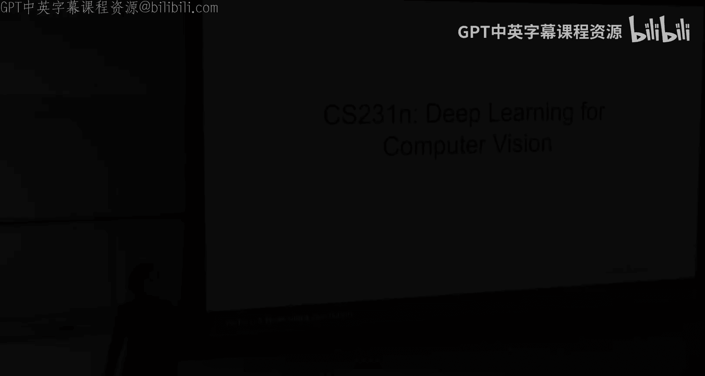
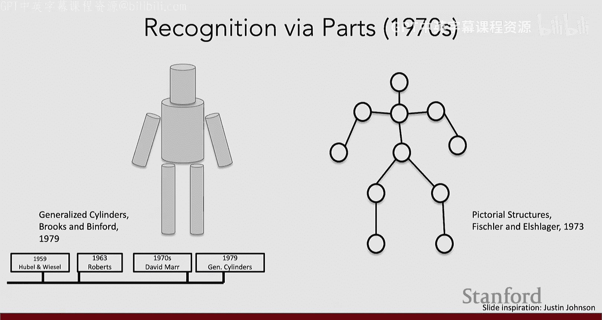
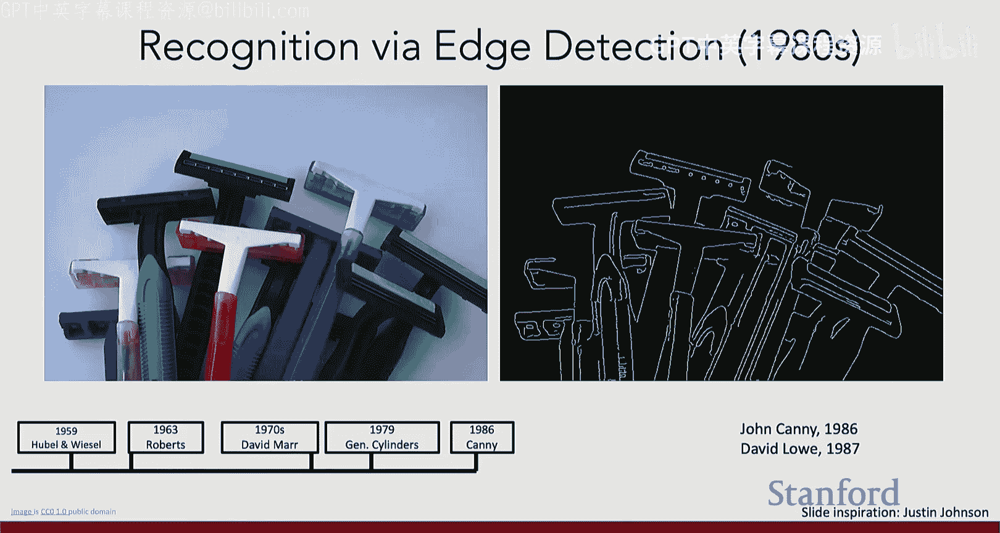
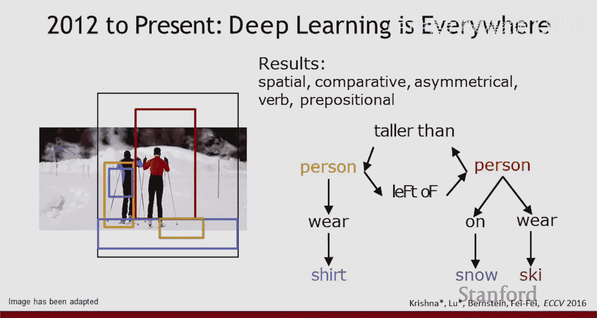
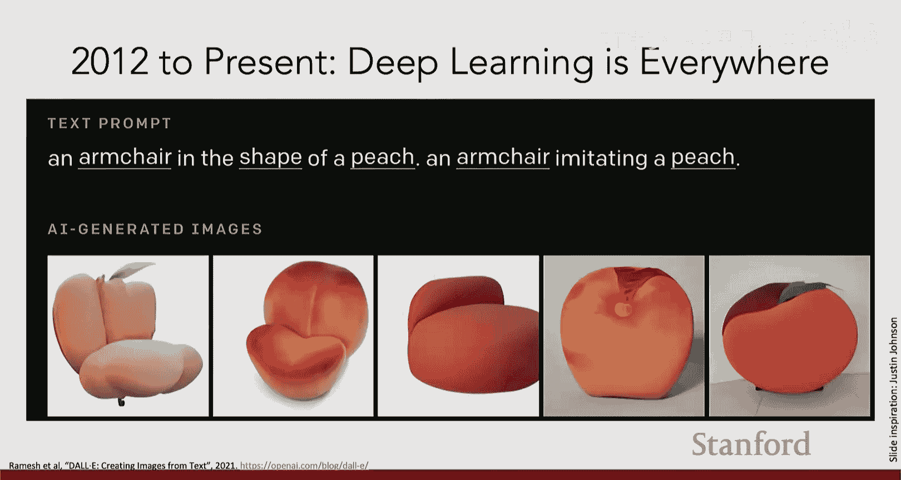
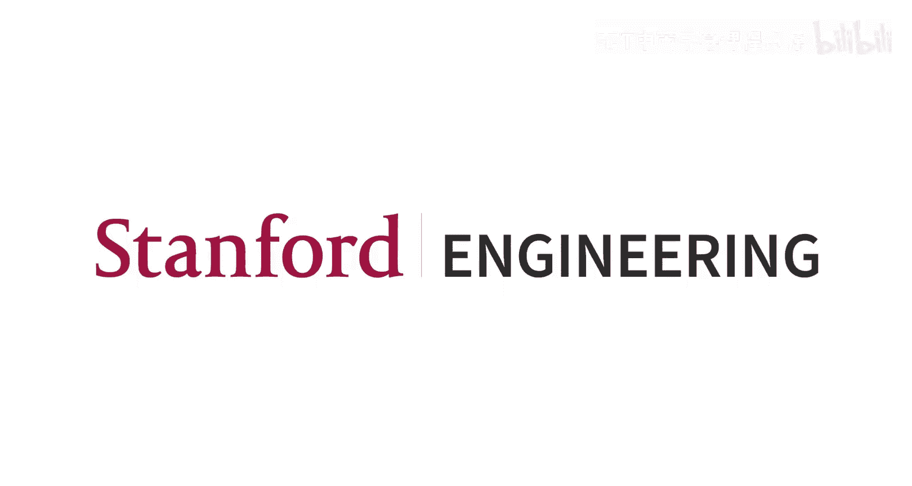

#  001： 计算机视觉与深度学习导论 🧠👁️

在本节课中，我们将要学习计算机视觉与深度学习的基本概念、历史脉络以及本课程的核心内容。我们将从视觉的起源讲起，探讨计算机视觉如何成为人工智能的关键组成部分，并了解深度学习革命如何重塑了这一领域。

## 概述

计算机视觉旨在使机器能够“看见”和理解视觉世界。深度学习，特别是神经网络，已成为解决计算机视觉问题的强大工具。本节课将概述这两个领域的交汇点，并为本课程后续内容奠定基础。

## 视觉的起源与重要性

视觉的历史并非始于人类文明，而是可以追溯到5.4亿年前的寒武纪生命大爆发。化石研究表明，在这个相对短暂的进化时期内，动物物种出现了爆炸性增长。

一个最引人注目的理论认为，这一爆发的关键驱动力是“眼睛”的出现。最早的动物（如三叶虫）获得了光敏细胞，形成了一个简单的“针孔”，能够收集光线。

一旦生物能够感知光线，生命便从被动的新陈代谢转变为与环境积极互动的一部分。视觉（连同触觉）作为动物最古老的感官之一，驱动了神经系统和智能的进化。几乎所有现代动物都将视觉作为主要感官之一。

人类是尤其依赖视觉的动物。我们超过一半的大脑皮层细胞都参与视觉处理，并拥有复杂精密的视觉系统。理解视觉智能的奥秘，正是理解智能本身的关键。

## 从生物视觉到计算机视觉

人类不仅能够看见，还渴望建造能够“看见”的机器。从达芬奇研究“暗箱”，到古希腊和古代中国的思想家探索通过小孔成像，人类一直在尝试复制视觉。

然而，相机（或眼睛）本身并不等同于“看见”。它们只是 apparatus（装置）。我们需要理解视觉智能是如何发生的，而这正是本课程的核心。

## 计算机视觉与深度学习的简史

上一节我们介绍了视觉的生物学起源，本节中我们来看看推动现代计算机视觉与深度学习交汇的关键历史节点。

### 神经科学的奠基 (1959)

20世纪50年代，Hubel和Wiesel在神经科学领域进行了一系列至关重要的实验。他们通过电极研究活体（麻醉）猫的初级视觉皮层神经元。

他们的发现有两个关键点：
1.  **神经元的感受野**：负责“看见”的每个神经元只对视觉空间中一个特定小区域的特定模式（如特定朝向的边缘）有反应。
2.  **视觉通路的层次性**：神经元相互连接，形成层次网络。初级层的神经元（如边缘检测器）将其输出传递给更高层的神经元，后者则对更复杂的模式（如角点、物体）产生反应。

这些发现对后来的神经网络建模产生了深远影响。约30年后，Hubel和Wiesel因揭示视觉处理原理而获得了诺贝尔医学奖。

### 计算机视觉的诞生 (1960s)

1963年，Larry Roberts撰写了公认的第一篇计算机视觉博士论文，专注于研究形状。其核心思想是：能否通过分析形状的曲面、角点和特征来理解物体？这直觉上正是人类所做的。

1966年，MIT教授发起了一个夏季项目，目标是让本科生“解决视觉问题”。尽管视觉并未在那个夏天被“解决”，但这个项目与Roberts的论文一同被视为计算机视觉领域的开端。

### 大卫·马尔的理论框架 (1970s)

David Marr在其著作中系统性地思考了视觉处理过程。他的理论框架包含三个层次：
1.  **初始简图**：从图像中提取基本特征，如边缘（类似于Hubel & Wiesel的发现）。
2.  **2.5维简图**：将图像中的物体按深度分离，区分前景和背景。
3.  **三维模型表示**：获得对世界的完整三维理解。这是视觉中最困难的问题，因为从二维图像反推三维世界是一个**病态问题**。自然界通过进化出多只眼睛（如双眼视觉）并理解对应关系等方式部分解决了这个问题。

### 视觉与语言的根本差异

这里需要理解一个哲学上微妙但重要的差异：语言在自然界中并不存在，它是人类大脑生成的一维序列信息。而视觉则是对一个真实存在的、遵守物理定律的三维世界的感知。这种根本差异意味着处理视觉和语言的任务与模型会有深刻的不同。

### 早期探索与AI寒冬

在1970-80年代，尽管缺乏数据、算力和现代数学工具，先驱们已开始尝试解决一些困难的计算机视觉问题，例如物体识别（如“广义圆柱体”模型）、人体组合模型和边缘检测。

然而，到80年代末，进展似乎停滞不前，许多预期未能实现，导致了“AI寒冬”的到来——对AI研究的热情和资金大幅减少。但正是在这个“寒冬”的表象之下，许多研究在计算机视觉、自然语言处理、机器人学等领域持续生长。

### 认知神经科学的指引

与此同时，认知神经科学持续发展，为计算机视觉指明了应重点研究的“北极星”问题。例如：
*   研究表明，识别物体（如自行车）的速度和准确性受其周围场景（是否倒置）的影响，这说明视觉处理是整体性的、快速的。
*   实验表明，人类能在约150毫秒内完成对复杂自然图片的分类（如判断有无动物），这对于生物神经元而言是极快的速度。
*   研究发现，人类大脑有专门识别面孔、地点或身体部位的特化脑区。

所有这些都指向一个核心问题：**在自然场景下的物体识别**。这成为解锁视觉智能的关键问题之一，也是本课程后续将深入探讨的重点。

## 深度学习的平行演进

当计算机视觉领域在神经科学和认知科学的启发下前行时，另一条研究主线——最终发展为深度学习——也在并行发展。

### 神经网络的早期探索

早期研究集中在感知机等小型人工神经网络上。尽管Marvin Minsky等人曾指出感知机的局限性（如无法学习异或逻辑函数），导致神经网络研究一度受挫，但相关工作仍在继续。

### 福岛邦彦的新认知机 (1980)

在第一个转折点之前，福岛邦彦的**新认知机**是一项重要工作。他手工设计了一个5-6层的神经网络，其结构明显受到Hubel & Wiesel描述的视觉通路启发：浅层执行简单功能（卷积），深层整合信息形成更复杂的表示。

然而，这是一个工程壮举，因为成百上千的参数都是手工精心设置的，仅能用于识别数字或字母。

### 反向传播的突破 (1986)

真正的突破是**反向传播**学习规则的出现。Rumelhart, Hinton等人为神经网络架构引入了基于误差修正的目标函数。其核心思想是：当输入已知正确答案时，计算网络输出与正确答案的差异（误差），然后利用链式法则将误差信息从输出层反向传播回网络各层，从而更新所有参数以减小误差。

**公式表示（简化）**：`参数更新 = 参数 - 学习率 * (损失函数对参数的梯度)`
反向传播就是高效计算这个梯度的算法。

### 杨立昆的卷积神经网络 (1990s)

反向传播最早的重要应用之一是Yann LeCun在贝尔实验室开发的卷积神经网络（LeNet）。他构建了一个约7层的更大网络，并通过出色的工程实现，使其能够有效识别手写数字和字母，并被应用于银行和邮政系统。

尽管如此，神经网络的发展随后再次陷入停滞。原因在于，当面对神经科学家使用的那些包含猫、狗、微波炉、椅子、花朵的复杂自然图片时，这些系统完全失效。一个巨大的瓶颈出现了：**缺乏数据**。

## 数据：深度学习的引爆点

缺乏数据不仅仅是不方便，更是一个数学问题。深度学习算法是高容量模型，需要海量数据驱动才能学习并泛化到新样本。数据的重要性在早期被低估了。

李飞飞教授及其团队在21世纪初认识到了数据的重要性，并着手创建了**ImageNet**数据集。该数据集包含约1500万张图像，涵盖约22000个物体类别，其规模大致相当于人类幼年时期学习识别的概念数量。

基于ImageNet，他们发起了**ImageNet大规模视觉识别挑战赛**，使用一个包含100多万张图像、1000个类别的子集，邀请全球研究者竞赛，看谁的算法识别最准确。

以下是竞赛初期Top-5错误率的变化：
*   **2010/2011年**：最佳算法的错误率接近30%，而人类错误率约3%。
*   **2012年**：Jeffrey Hinton及其学生使用卷积神经网络（AlexNet）参赛，将错误率**几乎降低了一半**，震惊了整个领域。

AlexNet在结构上与32年前福岛的新认知机并无本质不同，但两大关键因素使其成功：
1.  **反向传播**：提供了数学上严谨、自动化的参数学习规则。
2.  **大数据**：ImageNet提供了驱动高容量模型所需的海量数据。

2012年AlexNet在ImageNet挑战赛上的成功，被广泛视为**现代AI复兴或深度学习革命诞生的历史性时刻**。

## 深度学习时代的爆发

自此，我们进入了深度学习爆炸的时代。计算机视觉领域取得了飞速进展：
*   **任务多样化**：从图像分类，发展到图像检索、多物体检测、图像分割、视频分类、人体动作识别等。
*   **领域交叉**：深刻影响医学影像、科学发现（如首张黑洞照片）、环境保护等。
*   **生成能力**：出现了图像描述、关系理解、风格迁移，并最终进入**生成式AI**时代，能够生成高度逼真的图像和视频。
*   **硬件驱动**：GPU等硬件算力的指数级增长，与算法、数据共同构成了推动领域发展的三大合力。

我们已彻底走出AI寒冬，进入了一个AI技术加速发展的时期。

## 挑战、责任与未来

尽管成就斐然，计算机视觉仍面临巨大挑战，并伴随着重大责任：
*   **技术局限**：人类视觉中的细微差别、丰富情感和复杂理解，仍是当前技术难以企及的。
*   **偏见与伦理**：AI模型由数据驱动，而数据反映了人类历史和社会中的偏见。这可能导致算法在面部识别、招聘、信贷等领域产生歧视性结果。
*   **社会影响**：AI在医疗（积极）和自动化决策（需审慎）等方面将深刻影响人类社会。

这正是为什么需要来自计算机科学、人文社科、法律、商业等不同背景的学生共同学习和探讨AI，因为AI问题远不止是工程问题。

## 课程内容预览

接下来，Professor Delli将概述本课程的具体内容结构，主要分为四大主题：
1.  **深度学习基础**：从图像分类、线性分类器入手，讲解模型容量、过拟合/欠拟合、正则化、优化以及神经网络的基本原理。
2.  **感知与理解视觉世界**：深入探讨卷积神经网络（CNN），并学习超越分类的任务，如语义分割、物体检测、实例分割，以及视频理解、多模态学习等。
3.  **大规模训练与前沿架构**：介绍训练大模型所需的分布式训练策略（数据并行、模型并行），以及Transformer等新兴架构。
4.  **生成式与交互式视觉智能**：涵盖自监督学习、生成模型（如风格迁移、扩散模型）、视觉-语言模型、3D视觉以及具身智能等前沿方向。
5.  **以人为本的应用与思考**：探讨计算机视觉的社会影响、伦理及在医疗等领域的应用。

本课程的目标是让大家能够将计算机视觉问题形式化为任务，开发并训练视觉模型，并理解该领域的现状与未来方向。

## 总结

本节课中我们一起学习了：
*   视觉在智能进化中的核心地位。
*   计算机视觉与深度学习各自的发展简史及关键里程碑。
*   **数据**、**算法**（反向传播）和**算力**如何共同引爆了2012年的深度学习革命。
*   现代计算机视觉的广泛应用、当前面临的挑战以及社会责任。
*   本课程（CS231n）将涵盖的核心知识体系。

下节课，我们将正式进入技术核心，从**图像分类和线性分类器**开始我们的深度学习之旅。