#  002：使用线性分类器进行图像分类

在本节课中，我们将继续讨论图像分类这一核心任务。我们将从数据驱动的方法入手，介绍两种基础的图像分类方法：K最近邻算法和线性分类器。通过理解这些基础概念，我们将为后续学习神经网络和卷积神经网络打下坚实的基础。

## 图像分类任务

图像分类是计算机视觉中的一项核心任务。给定一张图像和一组预定义的类别标签（例如“猫”、“卡车”、“飞机”），系统的任务是为该图像分配一个最合适的标签。

对人类而言，这是一项非常简单的任务，因为我们的大脑能够整体性地理解图像。然而，对于计算机来说，图像通常被表示为数据矩阵（或更一般地，张量）。例如，一张800x600像素的彩色（RGB）图像，可以表示为一个形状为 `800 x 600 x 3` 的张量，其中每个像素的RGB值通常在0到255之间。

这种表示方式与我们人类的感知之间存在巨大的“语义鸿沟”。为了理解计算机识别图像的挑战，我们需要考虑图像数据中的多种变化因素。

## 图像分类的挑战

以下是图像分类任务中常见的一些挑战，它们会导致像素值发生变化，从而给机器识别带来困难：

*   **视角变化**：即使物体本身静止，移动相机也会改变所有像素值。
*   **光照变化**：同一物体在不同光照条件下，其RGB像素值会发生变化。
*   **背景干扰**：杂乱的背景或前景物体会干扰对目标物体的识别。
*   **尺度变化**：物体在图像中的大小（缩放）不同。
*   **遮挡**：物体可能被部分遮挡，只露出一小部分。
*   **形变**：物体（如猫）本身具有多种可变形态。
*   **类内差异**：同一类别的物体（如不同品种的猫）在大小、颜色、纹理上存在差异。
*   **上下文依赖**：有时需要依赖图像的整体上下文才能做出正确判断。

尽管存在这些挑战，得益于大规模数据集（如ImageNet）和深度学习模型的发展，今天的分类器已经能够非常出色地完成图像分类任务。本课程的目标，就是一步步构建实现这些强大算法所需的基石。

## 数据驱动方法

与传统的、试图通过硬编码规则（如边缘检测、角点统计）来识别物体的方法不同，现代方法主要采用**数据驱动**的范式。这种方法不依赖于手动设计的逻辑，而是遵循一个三步流程：

1.  **收集数据集**：收集包含图像及其对应标签的大量数据。
2.  **训练分类器**：使用机器学习算法，在训练数据上学习一个模型（函数），该模型能够建立图像与标签之间的关联。
3.  **评估分类器**：在新的、未见过的测试图像上评估训练好的模型，预测其标签。

我们将重点介绍两种基础的数据驱动分类方法。

## K最近邻分类器

K最近邻是一种最简单直观的分类算法。它帮助我们理解分类器的基本概念，并引入超参数调优等重要思想。

### 算法原理

K最近邻分类器包含两个核心函数：

*   **训练函数 `train`**：该函数非常简单，只需“记住”所有的训练图像和标签。用代码表示，即 `def train(X, y): self.X_train = X; self.y_train = y`。
*   **预测函数 `predict`**：对于一个新的查询图像，在训练集中找到与之“最相似”的K个图像，然后通过投票（多数表决）决定其标签。

这里的关键在于如何定义“相似”，即需要一个**距离函数**。

### 距离度量

以下是两种常用的距离函数：

*   **L1距离（曼哈顿距离）**：计算两个图像所有像素值之差的绝对值之和。
    *   **公式**：`d(I1, I2) = sum(|I1[i] - I2[i]|)`
*   **L2距离（欧几里得距离）**：计算两个图像所有像素值之差的平方和的平方根。
    *   **公式**：`d(I1, I2) = sqrt(sum((I1[i] - I2[i])^2))`

L1距离对特征轴（像素值）的旋转敏感，其等距点构成菱形；而L2距离是旋转不变的，其等距点构成圆形。选择哪种距离取决于具体问题和特征的性质。

### 算法复杂度与可视化

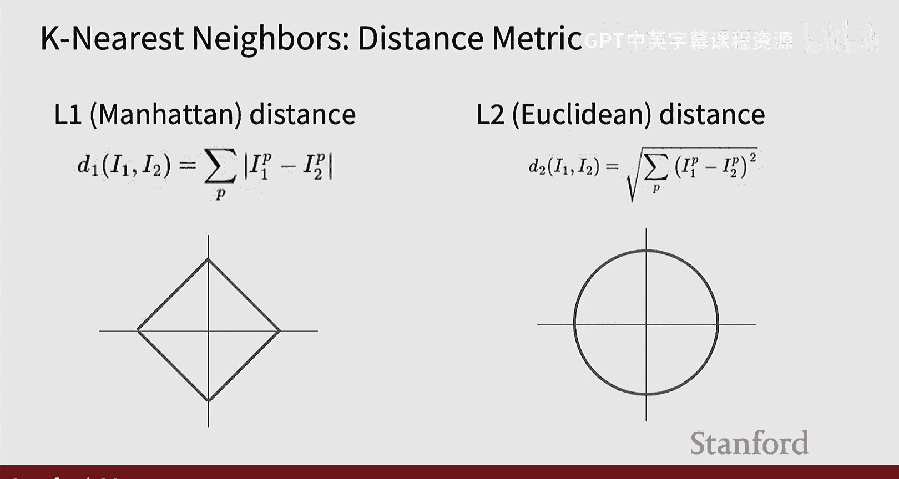

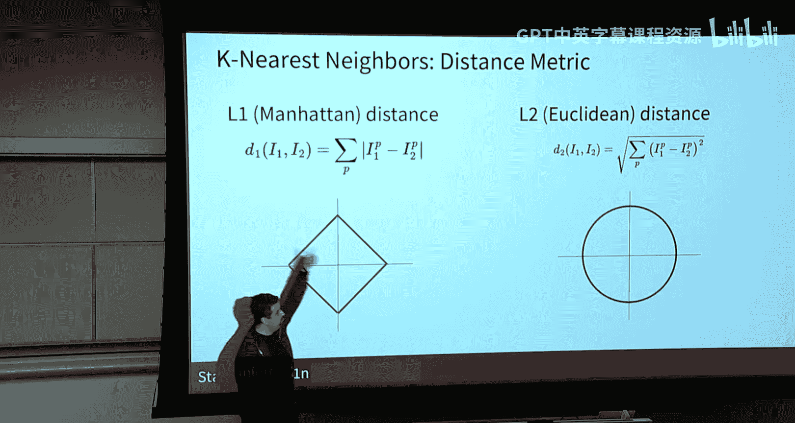

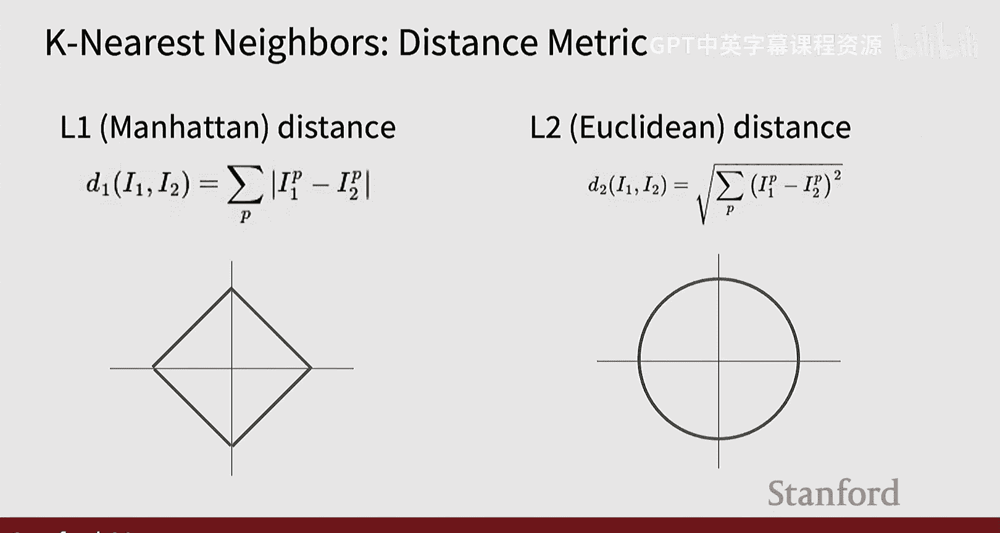

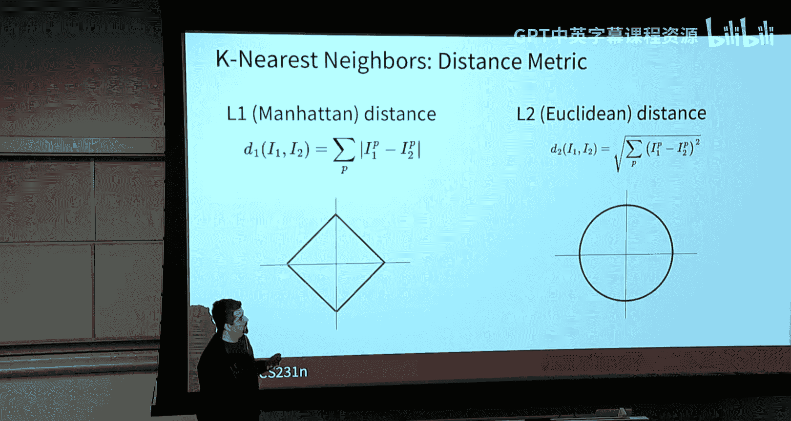

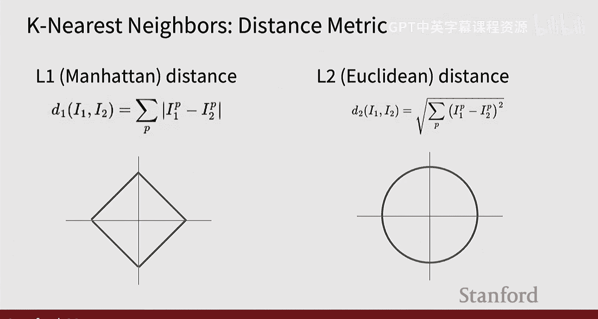

*   **训练复杂度**：O(1)，因为只是存储数据。
*   **预测复杂度**：O(N)，对于每个测试样本，都需要与所有N个训练样本计算距离。这使得预测阶段非常慢，不适用于大规模应用。

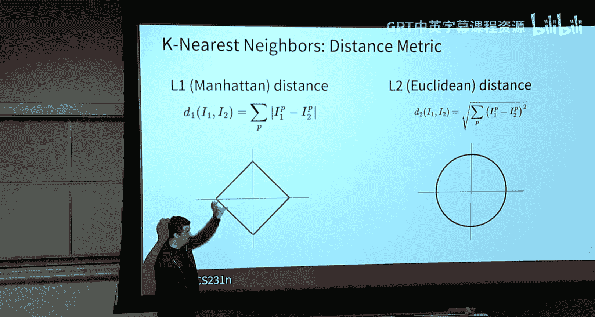

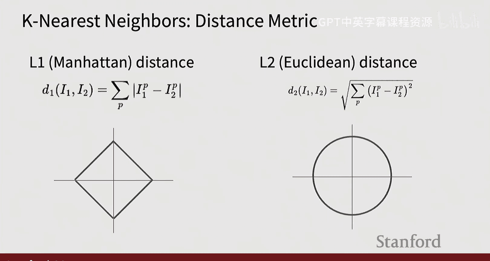

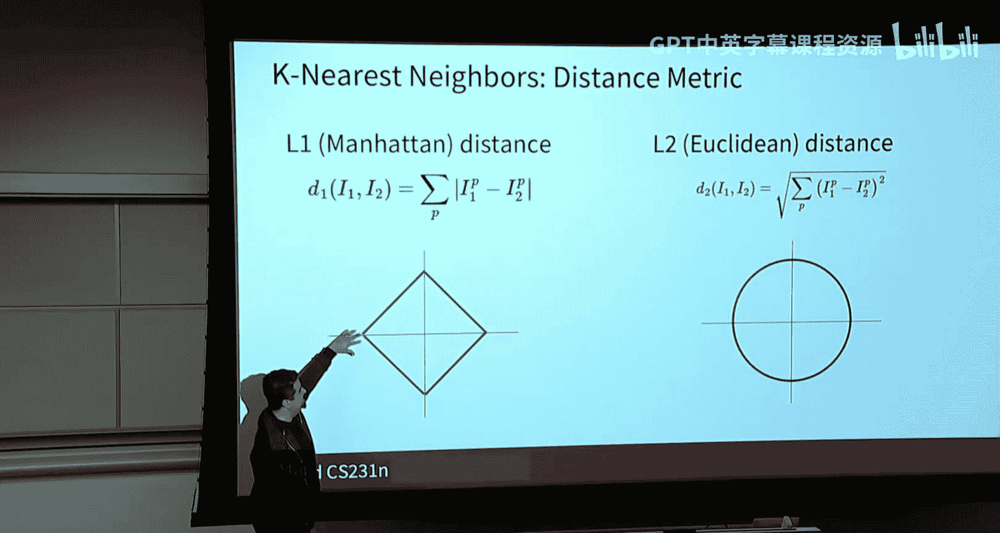

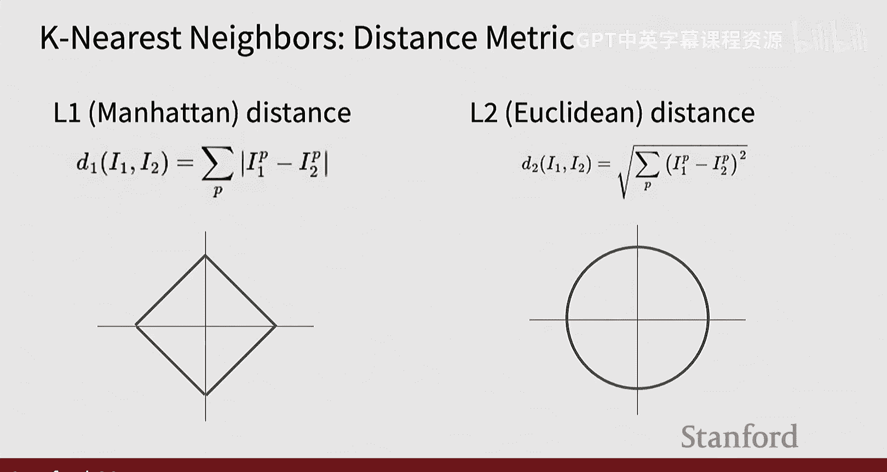

在特征空间的可视化中，K=1的最近邻算法会根据每个训练样本划出决策区域。K值增大（K近邻）可以使决策边界更平滑，减少对噪声的敏感度，但也可能在某些区域产生平局而无法决策。

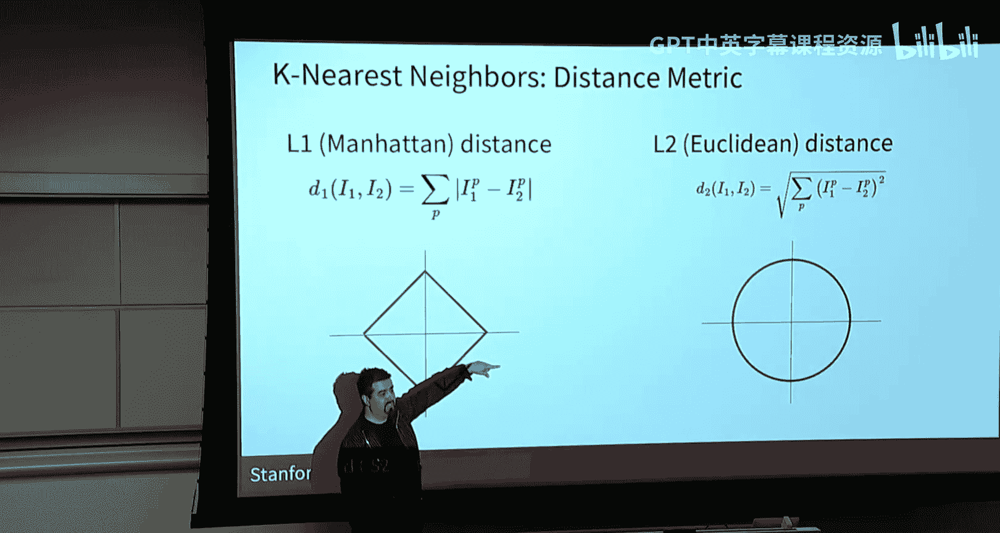

### 超参数调优

K最近邻算法有两个关键的**超参数**：**K值**和**距离函数类型**。超参数的选择不能基于训练集（会导致过拟合），也不能基于测试集（属于“作弊”）。正确的做法是：

1.  将训练数据划分为**训练集**和**验证集**。
2.  在训练集上训练模型，在验证集上评估不同超参数组合的性能。
3.  选择在验证集上表现最好的超参数组合。
4.  **最终**，使用选定的超参数在完整的训练集上重新训练，并在**独立的测试集**上进行一次性评估。

对于更可靠的估计，可以使用**K折交叉验证**：将训练数据分成K份，轮流将其中一份作为验证集，其余作为训练集，重复K次后取平均性能。

### 在CIFAR-10上的结果

在CIFAR-10数据集（10个类别，共6万张32x32小图像）上，K最近邻的最佳准确率约为28-29%，远高于随机猜测的10%，但仍有很大提升空间。观察错误案例可以发现，基于原始像素的距离度量效果有限，因为外观相似的物体（如绿色的青蛙和卡车）可能在像素空间很接近。

**总结**：K最近邻算法让我们理解了数据驱动方法的基本流程、距离度量的概念以及超参数调优的重要性。然而，其预测速度慢且基于像素的相似性度量效果有限，这促使我们转向更强大的方法——线性分类器。

## 线性分类器

线性分类器是神经网络和深度学习中最重要的构建模块之一。与K最近邻这种非参数方法不同，线性分类器是一种**参数化方法**，它通过学习参数（权重）来将输入映射到输出。

### 算法原理

线性分类器将输入图像 `x`（例如，CIFAR-10中为3072维向量）通过一个线性函数映射到每个类别的“得分”上。

*   **公式**：`f(x, W, b) = W * x + b`
    *   `x`：输入图像展平后的向量（例如 3072 x 1）。
    *   `W`：权重矩阵（例如 10 x 3072），每一行对应一个类别的“模板”。
    *   `b`：偏置向量（例如 10 x 1），允许决策边界不经过原点。
    *   输出：每个类别的得分（例如 10个分数）。

### 理解线性分类器

可以从三个视角理解线性分类器：

1.  **代数视角**：如上公式所示，就是矩阵乘法与向量加法。
2.  **视觉视角**：权重矩阵 `W` 的每一行可以可视化为一个图像“模板”。例如，在CIFAR-10上训练后，“汽车”类对应的模板可能隐约显示出汽车的轮廓。
3.  **几何视角**：在高维特征空间中，每个线性分类器实际上是在用一个超平面来划分空间。每个类别的得分反映了输入点距离该类别决策边界的“远近”。

### 线性分类器的局限性

线性分类器能力有限，它只能学习**线性决策边界**。对于某些复杂的数据分布（例如异或问题、多模态分布、环形分布），单个线性分类器无法进行有效分类。这为后续引入具有非线性激活函数的神经网络提供了动机。

### 损失函数与优化

为了找到最优的权重 `W`，我们需要定义一个**损失函数**（或目标函数），用以量化当前分类器在训练数据上的“糟糕程度”（即预测得分与真实标签的不匹配程度）。

一种常见的方法是使用**Softmax分类器**（或称多项逻辑回归）：
1.  将线性函数输出的得分通过 **Softmax函数** 转换为概率分布。
    *   **公式**：`P(Y=k|X=x_i) = exp(s_k) / sum_j(exp(s_j))`，其中 `s = f(x_i, W, b)`
2.  定义损失函数为**交叉熵损失**（或负对数似然），即正确类别概率的负对数。
    *   **公式**：`L_i = -log(P(Y=y_i|X=x_i))`
    *   整个数据集的损失是所有样本损失的平均：`L = (1/N) * sum(L_i)`

这个损失函数可以从**最大似然估计**或**最小化KL散度**的角度推导出来。在深度学习中，它常被称为**交叉熵损失**。

**初始化分析**：在训练开始时，如果权重 `W` 随机初始化，所有类别的得分可能相近，Softmax输出的概率也近似均匀分布（对于C个类别，每个概率约为1/C）。此时的初始损失值约为 `-log(1/C) = log(C)`。对于CIFAR-10的10个类别，初始损失约为 `log(10) ≈ 2.3`。训练的目标就是通过优化算法（如下一讲将介绍的梯度下降）不断调整 `W`，以最小化这个损失函数。

## 总结

本节课我们一起学习了图像分类的基础知识。我们首先明确了图像分类任务的定义及其面临的主要挑战。然后，我们探讨了数据驱动方法的三步流程，并深入介绍了两种基础分类器：

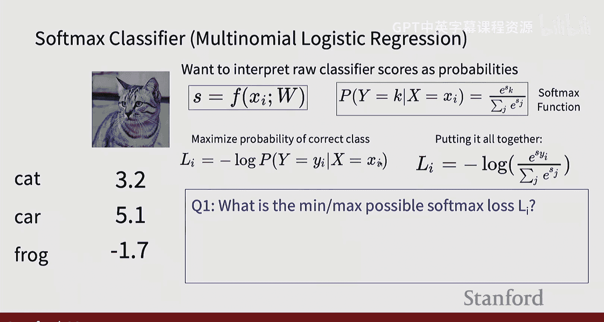

1.  **K最近邻分类器**：一种简单直观的非参数方法，我们通过它理解了距离度量、超参数（K值和距离函数）以及通过验证集或交叉验证进行超参数调优的重要性。
2.  **线性分类器**：一种重要的参数化方法，是神经网络的基石。我们学习了其代数、视觉和几何解释，了解了它的能力与局限性，并介绍了如何通过Softmax函数和交叉熵损失函数来形式化分类问题。

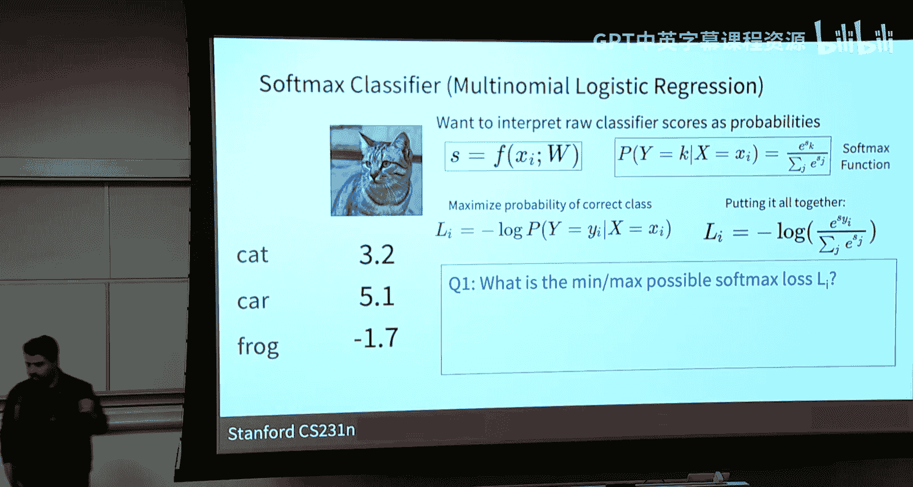

在下一讲中，我们将探讨如何通过优化算法（如梯度下降）来找到最小化损失函数的最佳权重 `W`，从而完成线性分类器的训练。