#  003：正则化与优化

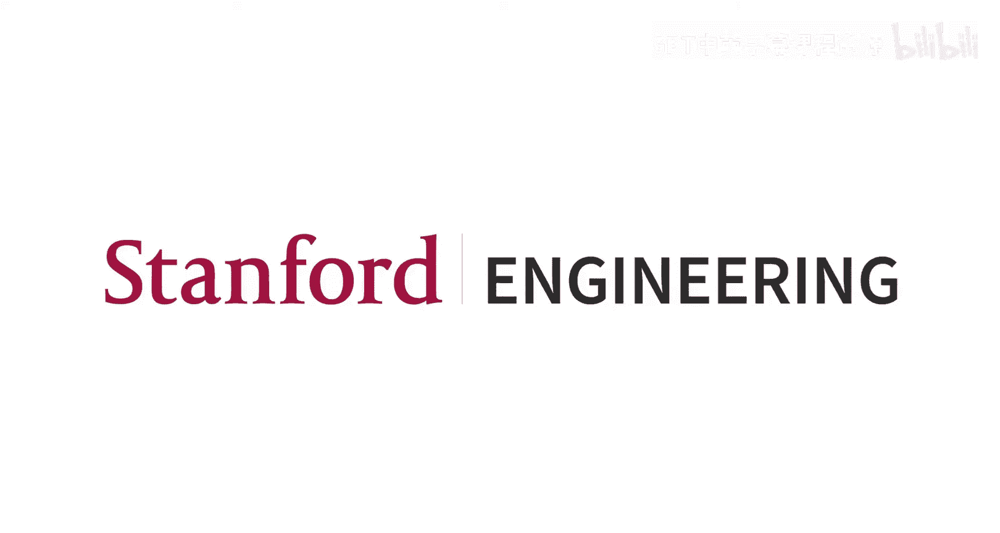

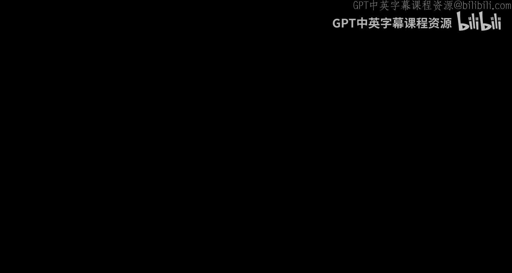

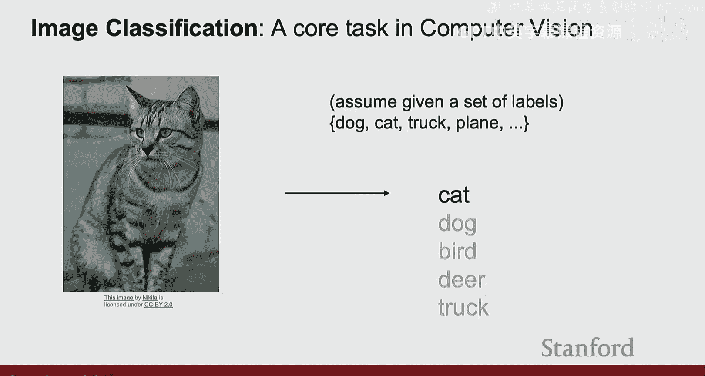

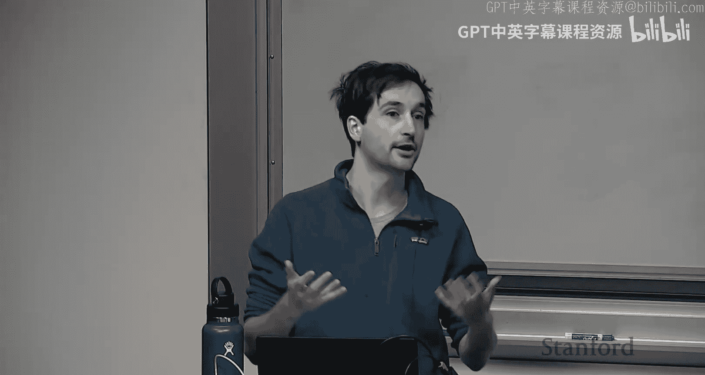

## 概述
在本节课中，我们将要学习深度学习和机器学习中两个非常重要的概念：**正则化**和**优化**。我们将从回顾上周的内容开始，然后深入探讨如何通过正则化防止模型过拟合，以及如何使用优化算法找到模型的最佳参数。

---

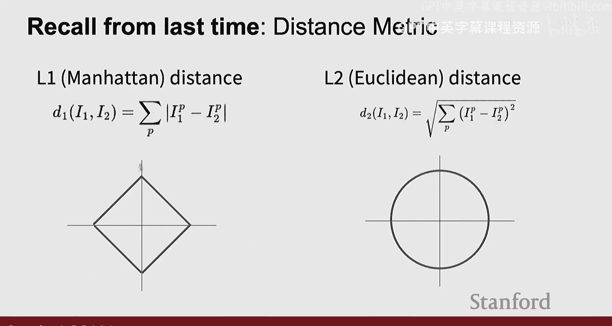

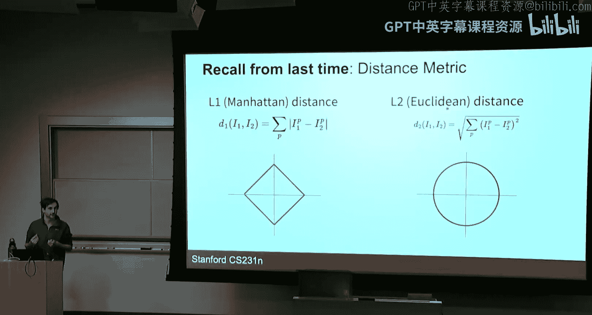

## 回顾：图像分类与线性模型

上一节我们介绍了图像分类作为计算机视觉的核心任务。其目标是将输入的图像映射到一组预定义标签中的一个。

图像分类面临诸多挑战，例如**语义鸿沟**（像素值与人类理解之间的差异）、**光照变化**、**物体形变**、**遮挡**以及**类内差异**等。由于无法用简单的逻辑规则解决这些问题，我们转向了数据驱动的方法。

我们讨论了最简单的机器学习模型之一：**K最近邻**模型。其核心思想是为一个新的数据点，在训练集中找到距离最近的K个邻居，并根据这些邻居的标签来预测新数据点的类别。我们通常将数据集划分为训练集、验证集和测试集，并使用验证集来选择超参数（如K值）。

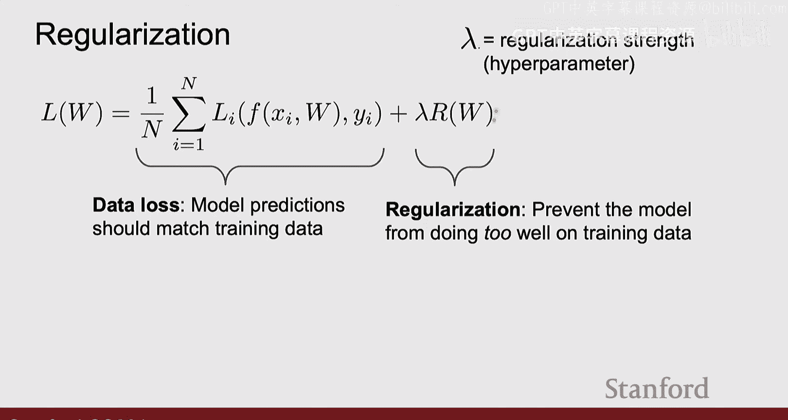

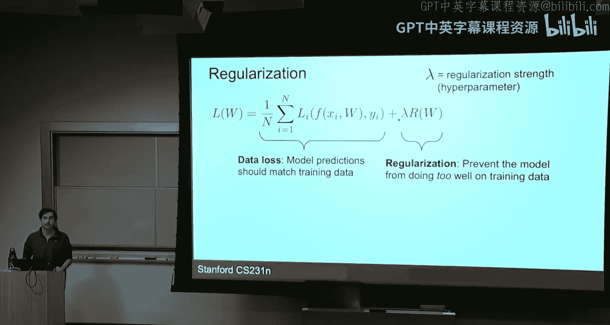

我们还深入探讨了**线性分类器**。其基本思想是将图像（例如32x32x3的像素值）展平为一个向量（如3072维），然后乘以一个权重矩阵 **W**，并加上一个偏置向量 **b**，从而得到每个类别的得分。

我们可以从三个角度理解线性模型：
1.  **代数视角**：每个类别的得分由权重矩阵的对应行与输入向量的点积加上偏置得到。
2.  **模板匹配视角**：将权重矩阵的每一行重新排列成图像形状，可以将其视为每个类别的“模板”。
3.  **几何视角**：每个类别的权重向量在输入空间中定义了一条决策边界（线或超平面），用于区分不同类别。

---

## 正则化：防止过拟合

上一节我们介绍了如何用线性模型进行预测，本节中我们来看看如何评估和提升模型的泛化能力。我们通过**损失函数**来衡量模型预测的好坏。对于分类任务，最常用的是**交叉熵损失**（或称Softmax损失）。

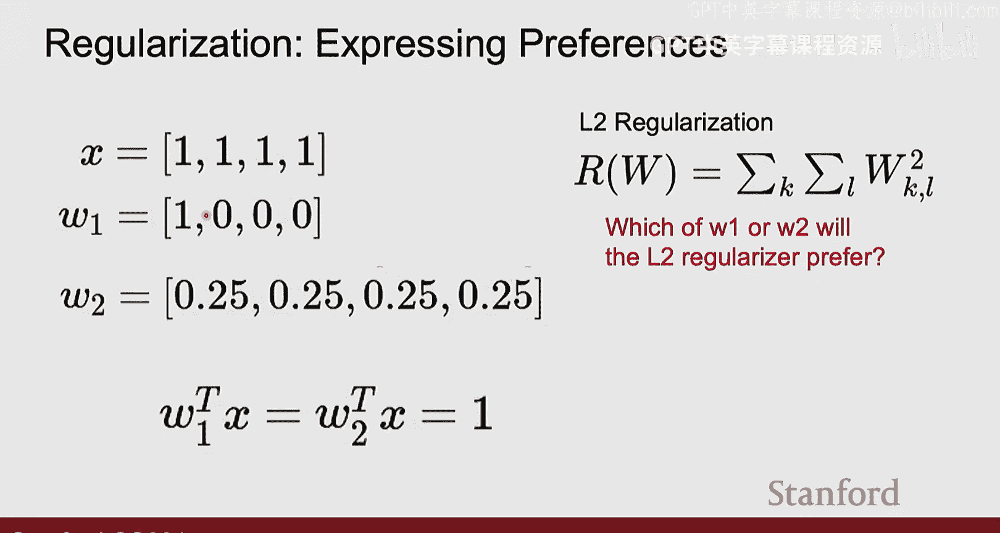

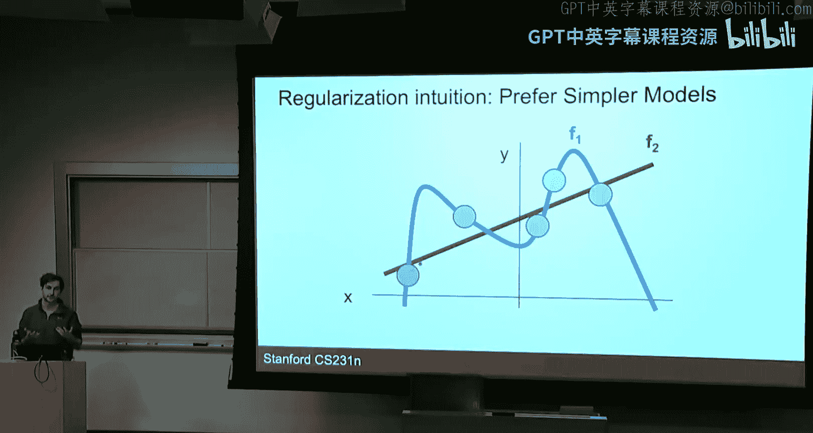

总损失通常由两部分组成：
`总损失 = 数据损失 + 正则化项`

**数据损失**衡量模型预测与训练数据的匹配程度。**正则化项**则用于惩罚模型的复杂度，防止其在训练数据上表现“太好”（即过拟合），从而提升模型在未见数据（测试集）上的性能。正则化强度由一个超参数 **λ** 控制。

以下是两种最常见的正则化方法：

*   **L2正则化**：惩罚权重向量中所有值的平方和。公式为：`λ * Σ (W_i)^2`。它倾向于让所有权重值都较小且分布均匀。
*   **L1正则化**：惩罚权重向量中所有值的绝对值之和。公式为：`λ * Σ |W_i|`。它倾向于产生**稀疏**的权重向量，即许多权重值为零。

**为什么正则化有效？**
1.  它允许我们表达对权重形式的偏好（如稀疏性或均匀性）。
2.  通过惩罚复杂度，它鼓励模型更简单，从而可能在新数据上表现更好。
3.  L2正则化还能改善优化过程，因为它使损失函数更“平滑”，更容易找到最小值。

---

## 优化：寻找最佳参数

现在我们已经知道如何用损失函数评估一个权重矩阵 **W** 的好坏，接下来的问题是如何找到使损失最小的那个 **W**。这就是**优化**要解决的问题。

一个直观的比喻是**损失景观**：将损失值想象成地形的高度，模型参数（如W的两个分量）是平面坐标。我们的目标是找到这个景观中的最低点（最小损失）。优化算法就像是一个蒙着眼睛的徒步者，试图通过感受脚下地面的坡度（梯度）来找到下山的路。

### 梯度计算
我们通过计算**梯度**来获得“坡度”信息。梯度是一个向量，其每个分量是损失函数对相应模型参数的偏导数，它指向损失上升最快的方向。因此，**负梯度**方向就是损失下降最快的方向。

计算梯度有两种方法：
1.  **数值梯度**：使用极限定义进行近似计算（`f(x+h) - f(x) / h`）。优点是易于实现，缺点是计算慢且不精确。
2.  **解析梯度**：使用微积分（如链式法则）直接推导出梯度公式。优点是计算快速精确，缺点是实现时容易出错。实践中，我们常用数值梯度来验证解析梯度实现的正确性，这称为**梯度检查**。

### 梯度下降
最基本的优化算法是**梯度下降**。其核心步骤是：
`W_new = W_old - learning_rate * gradient`
其中，**learning_rate**（学习率）是一个超参数，控制我们沿着梯度方向迈出的步长。

在实际应用中，我们很少在整个训练集上计算梯度（计算量太大），而是采用**随机梯度下降**。每次迭代时，我们随机抽取一小批数据（**mini-batch**）来计算梯度并更新参数。遍历一遍所有训练数据称为一个**epoch**。

### 梯度下降的挑战与改进
基本的SGD存在一些问题：
1.  **病态条件**：在损失函数不同方向曲率差异很大的“峡谷”地形中，SGD会剧烈震荡，收敛缓慢。
2.  **局部极小值与鞍点**：梯度为零的点会使优化停滞。在高维空间中，鞍点比局部极小点更常见。
3.  **梯度噪声**：由于使用mini-batch，梯度估计存在噪声。

为了解决这些问题，研究者提出了更高级的优化器：

*   **动量法**：引入“速度”变量，使其成为过去梯度的指数加权平均。这有助于在相关方向加速，并抑制震荡。更新公式类似于物理中的动量：`velocity = momentum * velocity - learning_rate * gradient`， `W += velocity`。
*   **RMSProp**：对梯度平方进行指数加权平均，然后根据这个平均值来调整每个参数的学习步长。在梯度大的方向减小步长，在梯度小的方向增大步长，有助于处理病态曲率。
*   **Adam**：目前最流行的优化器，它结合了**动量法**和**RMSProp**的思想。它同时计算梯度的一阶矩（动量）和二阶矩（梯度平方），并进行偏差校正，使其在训练初期更稳定。

### 学习率调度
学习率是优化中最重要的超参数之一。学习率太大会导致震荡甚至发散，太小则收敛缓慢。一个有效的策略是在训练过程中动态调整学习率，这称为**学习率调度**。

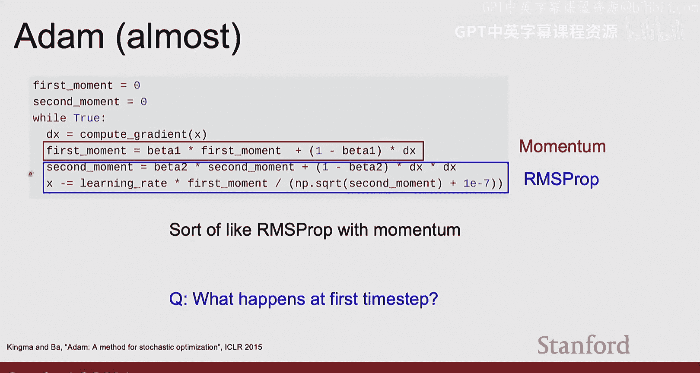

常见的调度策略包括：
*   **步进衰减**：每经过一定轮次，将学习率乘以一个衰减因子（如0.1）。
*   **余弦衰减**：学习率随训练过程按余弦函数从初始值衰减到0。
*   **线性预热**：在训练开始时，将学习率从0线性增加到初始值，然后再应用衰减策略。

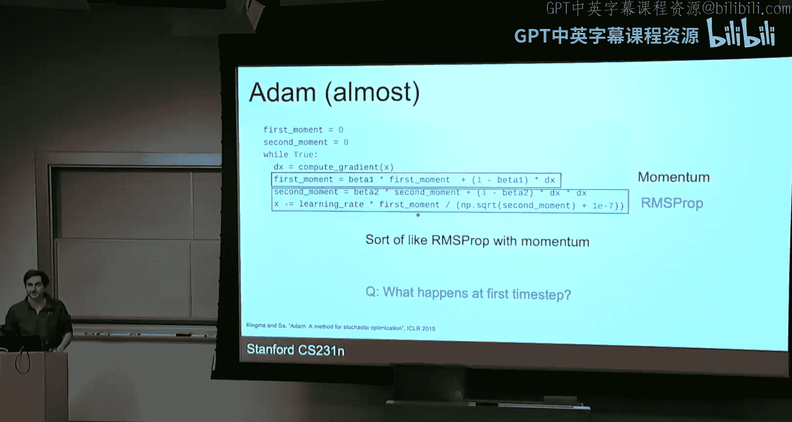

一个经验法则是**线性缩放法则**：当批量大小（batch size）增加N倍时，学习率也应大致增加N倍。

### 二阶优化（简要提及）
除了使用一阶梯度信息，还可以使用**海森矩阵**（二阶导数）来进行优化（如牛顿法）。它能更准确地估计损失函数的局部形状，从而可能更快收敛。然而，对于现代大型神经网络，计算和存储海森矩阵的开销巨大，因此实践中很少使用。

---

## 总结与展望

本节课中我们一起学习了：
1.  **正则化**：通过向损失函数添加惩罚项（如L1、L2）来防止模型过拟合，提升泛化能力。
2.  **优化**：通过梯度下降及其变体（SGD、动量、RMSProp、Adam）来寻找最小化损失函数的模型参数。我们讨论了梯度计算、学习率设置以及调度策略。

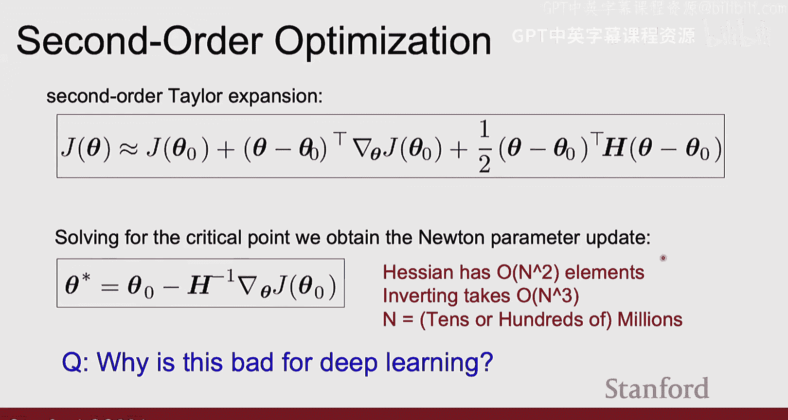

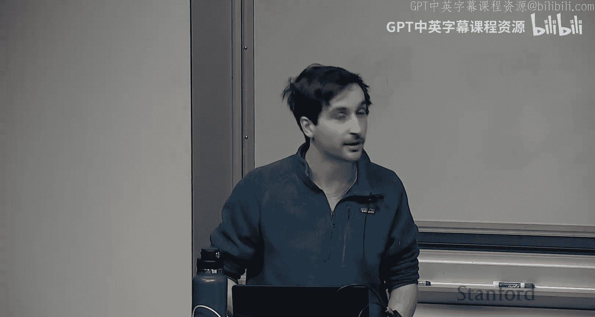

这些是训练所有深度学习模型的基础。目前，**Adam**或**AdamW**是许多情况下的优秀默认选择。对于能够使用全批次数据的小型模型，可以考虑探索二阶优化方法。

在下一讲中，我们将超越简单的线性模型，开始学习**神经网络**。通过引入非线性激活函数和多个层，神经网络能够学习更复杂、更强大的数据表示，从而解决线性模型无法处理的分类问题。