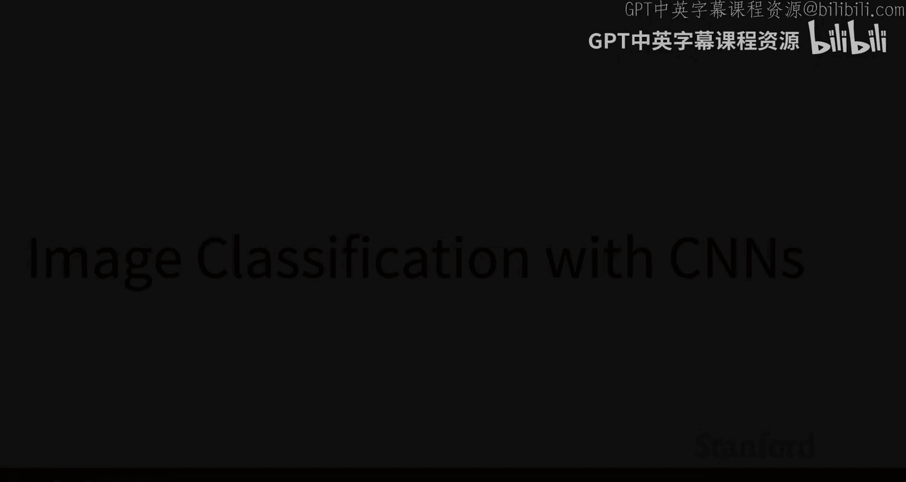

#  005：使用卷积神经网络进行图像分类




在本节课中，我们将要学习卷积神经网络（CNNs）的基本概念，特别是卷积层和池化层，以及它们如何帮助我们构建更强大的图像分类模型。

## 概述

在之前的课程中，我们学习了深度学习的基础知识，包括线性分类器、损失函数、优化算法以及神经网络。然而，我们之前看到的全连接网络在处理图像时存在一个主要缺陷：它们忽略了图像固有的二维空间结构。本节课，我们将介绍卷积神经网络，这是一种专门为处理图像等具有空间结构的数据而设计的网络架构。我们将重点学习卷积层和池化层这两个核心组件，理解它们的工作原理和优势。

## 从线性分类器到卷积神经网络

上一节我们介绍了如何使用线性分类器和全连接网络进行图像分类。本节中我们来看看这些方法的局限性，以及卷积神经网络如何解决这些问题。

线性分类器和全连接网络将图像像素拉伸成一个长向量进行处理。这种方法存在两个主要问题：
1.  **破坏空间结构**：图像是二维的，像素之间的空间关系（如边缘、纹理）对于识别物体至关重要。拉伸向量会丢失这些信息。
2.  **参数效率低**：对于一张32x32的RGB图像，输入向量长度为 `32 * 32 * 3 = 3072`。如果下一层有1000个神经元，仅这一层就需要 `3072 * 1000 ≈ 3百万` 个参数。这会导致模型庞大且容易过拟合。

卷积神经网络通过使用**局部连接**和**权值共享**来优雅地解决这些问题。

## 卷积层：核心构建模块

卷积层是CNN的核心。其核心思想不再是让每个神经元查看整个输入图像，而是让每个神经元只查看输入的一小片局部区域（称为感受野），并通过学习一组小的**滤波器**（或**卷积核**）来检测局部特征（如边缘、颜色斑点）。

以下是卷积层的关键概念：

*   **滤波器**：一个小的三维张量（例如 `5x5x3`），其深度与输入图像的通道数相同。每个滤波器负责检测一种特定的局部特征。
*   **卷积操作**：将滤波器在输入图像上从左到右、从上到下**滑动**。在每个位置，计算滤波器与当前图像局部区域的**点积**（即模板匹配），结果是一个标量，表示该局部区域与该滤波器的匹配程度。
*   **激活图**：将滤波器滑过整个图像后，得到的所有标量输出组成一个二维矩阵，称为**激活图**或**特征图**。该图上的每个点对应原图上一个局部区域对特定滤波器的响应强度。
*   **多滤波器**：一个卷积层通常包含多个滤波器（例如64个）。每个滤波器独立产生一张激活图。将所有激活图堆叠起来，就得到了卷积层的输出，一个三维张量（宽度 x 高度 x 通道数），其中通道数等于滤波器的数量。

卷积操作的输出空间尺寸计算公式为：
```
输出尺寸 = (输入尺寸 - 滤波器尺寸 + 2 * 填充) / 步长 + 1
```
其中：
*   **步长**：滤波器每次滑动的像素数。步长为1是常见选择，步长为2则进行下采样。
*   **填充**：在输入图像边缘添加零值像素。常用设置是 `填充 = (滤波器尺寸 - 1) / 2`，这样可以保持输入输出的空间尺寸相同。

卷积层的参数数量远少于全连接层。例如，一个具有10个 `5x5x3` 滤波器的卷积层，其参数数量仅为 `(5*5*3 + 1) * 10 = 760`（`+1` 为每个滤波器的偏置项）。

## 池化层：下采样与特征聚合

在卷积层之后，我们常常会插入**池化层**。池化层的主要作用是进行**下采样**，它有以下好处：
1.  逐步降低特征图的空间尺寸，减少计算量和参数数量。
2.  扩大后续层的有效感受野，让高层神经元能够整合更广区域的低级特征。
3.  提供一定程度的平移不变性。

最常见的池化操作是**最大池化**。以下是其工作方式：

*   将每个输入特征图（通道）划分为不重叠的区域（例如 `2x2` 的方块）。
*   对每个区域，取其中所有值的**最大值**作为输出。
*   使用 `2x2` 的池化窗口和步长2，可以将特征图的宽度和高度减半。

池化是一种非常廉价的下采样方式，它不引入需要学习的参数。

## 构建一个卷积神经网络

现在，我们可以将学到的组件组合起来，构建一个简单的卷积神经网络。一个典型的模式是交替堆叠卷积层、激活函数和池化层，最后连接一个或多个全连接层进行分类。

以下是构建CNN时常见的层序列模式：
```
输入图像 -> [卷积层 -> 激活函数(如ReLU) -> 池化层] x N -> 展平 -> 全连接层 -> 输出类别分数
```
其中 `N` 可以重复多次。随着网络加深，特征图的空间尺寸逐渐减小，而通道数（即检测的特征复杂度）逐渐增加。

## 平移等变性：CNN的内在优势

卷积和池化操作具有一个重要的数学性质：**平移等变性**。这意味着，如果输入图像发生平移，那么经过这些操作后得到的特征图也会发生相应的平移（边界效应除外）。这个性质非常重要，因为它编码了我们的一个直觉：图像中某个特征（如一只猫的耳朵）无论出现在图像的哪个位置，都应该被相同的滤波器检测到。这是CNN能够有效处理图像的关键原因之一。

## 总结

本节课中我们一起学习了卷积神经网络的基础知识。我们了解到：
1.  **卷积层**通过使用局部连接的滤波器来检测图像中的局部特征，并利用权值共享极大地提高了参数效率。
2.  **池化层**通过对特征图进行下采样，来聚合信息、扩大感受野并引入一定的平移不变性。
3.  通过堆叠卷积、激活和池化层，我们可以构建出强大的**卷积神经网络**，它能够有效地处理图像的二维空间结构。
4.  CNN的**平移等变性**是其成功处理视觉任务的关键特性之一。


在下一讲中，我们将深入探讨经典的CNN架构（如AlexNet, VGG, ResNet），看看这些基础组件是如何被组合成改变计算机视觉历史的强大模型的。