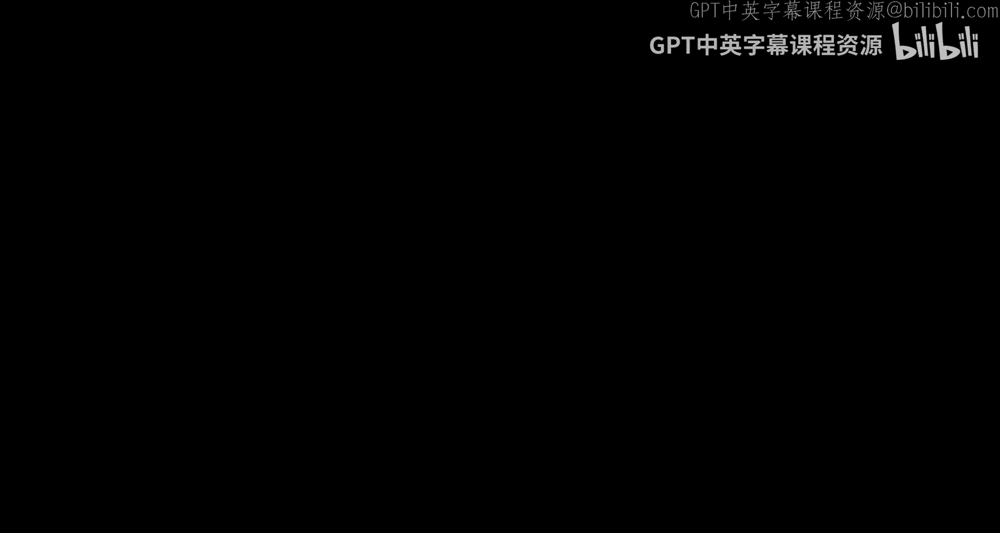
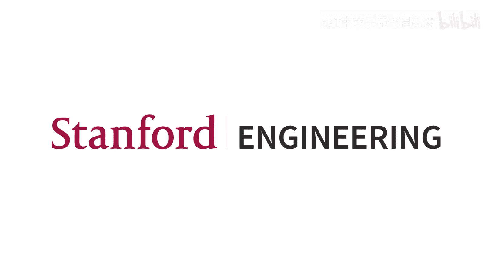

#  006：CNN架构与训练

## 概述
在本节课中，我们将学习如何构建和训练卷积神经网络。课程分为两部分：首先，我们将学习如何组合不同的网络层来构建CNN架构；其次，我们将探讨训练CNN所需的具体步骤和实用技巧。

---

## 第一部分：构建卷积神经网络

上一节我们介绍了卷积层和池化层等基础组件。本节中，我们将看看如何将这些组件组合起来，并介绍其他关键的网络层。

### 卷积神经网络中的层
卷积神经网络主要由几种类型的层构成。我们已经学习了卷积层、池化层和全连接层。接下来，我们将介绍归一化层、Dropout层以及激活函数。

#### 归一化层
归一化层的基本思想是计算输入数据的统计量（如均值和标准差），然后使用这些统计量对数据进行归一化。模型随后会学习一个最优的数据分布。

具体来说，归一化层学习参数，用于对输入数据进行缩放和偏移。所有归一化层都遵循以下两个步骤：
1.  将输入数据归一化为均值为0、标准差为1的单位高斯分布。
2.  使用可学习的参数对归一化后的数据进行缩放和偏移。

不同归一化层的主要区别在于它们计算统计量的方式。

**层归一化**是目前深度学习中最常用的归一化层之一，尤其在Transformer模型中。其工作原理如下：
*   输入数据 `X` 的形状为 `(N, D)`，其中 `N` 是批次大小，`D` 是特征维度。
*   对于每个样本，独立计算其沿 `D` 维度的均值和标准差。
*   使用可学习的缩放参数 `γ` 和偏移参数 `β` 对归一化后的数据进行变换。

**公式**：`LayerNorm(x) = γ * ( (x - μ) / σ ) + β`，其中 `μ` 和 `σ` 是每个样本的均值和标准差。

对于卷积神经网络，输入数据通常具有通道、高度和宽度维度。层归一化会计算每个样本在所有通道、高度和宽度维度上的单一均值和标准差。

#### Dropout层
Dropout是一种在CNN中使用的正则化技术。其基本思想是在训练过程中引入随机性，以提升模型的泛化能力。

具体操作是：在前向传播过程中，随机将某一层中一定比例的激活值置零。这个比例 `p` 是一个超参数，常用值为0.5或0.25。

在测试阶段，不再进行Dropout操作。但为了保持输入到后续层的数值量级一致，需要将激活值乘以 `p`。

Dropout迫使网络学习冗余的特征表示，防止模型过度依赖某些特定的特征组合，从而有助于泛化。

#### 激活函数
激活函数为模型引入非线性，是神经网络的关键组成部分。

历史上，**Sigmoid**函数曾被广泛使用，但其存在梯度消失问题。当输入值非常大或非常小时，Sigmoid的梯度接近于零，导致深层网络难以训练。

**ReLU**函数解决了Sigmoid在正区间的梯度问题，其公式为 `f(x) = max(0, x)`。ReLU计算高效，但在负区间梯度为零。

近年来，更平滑的激活函数如 **GELU** 和 **SiLU** 变得流行。GELU是高斯误差线性单元，其公式为 `f(x) = x * Φ(x)`，其中 `Φ(x)` 是标准高斯分布的累积分布函数。它在接近零的区域提供了非零梯度，是目前Transformer模型中的主流激活函数。

激活函数通常放置在卷积层或全连接层之后。

---

## 第二部分：训练卷积神经网络

现在我们已经了解了CNN的各个组成部分，接下来看看如何将它们组合成有效的架构，并探讨训练过程。

### CNN架构实例
历史上，**AlexNet** 是首个在ImageNet上取得巨大成功的CNN。随后，**VGG** 网络成为一种标准架构。

VGG网络的特点是大量使用堆叠的 **3x3卷积层**。使用多个小卷积核堆叠，而非单个大卷积核，有两个主要优势：
1.  **参数更少**：三个3x3卷积层的参数数量少于一个7x7卷积层。
2.  **表达能力更强**：更多的非线性激活函数允许模型学习更复杂的特征。

三个步长为1的3x3卷积层，其**有效感受野**相当于一个7x7的卷积层。

### 残差网络
随着网络层数加深，一个反直觉的现象出现了：更深的网络有时在训练集和测试集上的表现都更差。这并非过拟合，而是**优化困难**。

理论上，更深的网络应能表示更浅网络的所有函数（例如，通过将某些层设置为恒等映射）。但在实践中，让深层网络学习恒等映射非常困难。

**残差网络** 通过引入**残差连接**解决了这个问题。在残差块中，输入 `x` 被直接添加到经过若干卷积层变换后的输出 `F(x)` 上。

**公式**：`H(x) = F(x) + x`

这样，如果网络不需要这些卷积层进行变换，它只需将 `F(x)` 学习为接近零，即可轻松实现恒等映射 `H(x) ≈ x`。这使得深层网络的训练变得可行，并催生了如ResNet-152等超过百层的模型。

### 权重初始化
权重初始化的好坏直接影响训练过程。初始化值过小会导致信号在传播中消失；过大则会导致信号爆炸。

**Kaiming初始化**（又称He初始化）是针对使用ReLU激活函数的网络的一种有效初始化方法。对于全连接层，权重从均值为0、标准差为 `sqrt(2 / fan_in)` 的高斯分布中采样，其中 `fan_in` 是层的输入单元数。对于卷积层，`fan_in` 是 `kernel_size * kernel_size * in_channels`。

这种初始化方法能确保各层激活值的方差在传播过程中保持大致稳定。

---

## 第三部分：训练流程与实用技巧

构建好网络架构后，我们来看看如何准备数据并有效地训练模型。

### 数据预处理与增强
对于图像数据，标准的预处理是进行**逐通道归一化**：计算数据集中所有图像在每个颜色通道（R, G, B）上的均值和标准差，然后在训练时对每张输入图像进行减去均值、除以标准差的操作。

**数据增强**是在训练时对图像应用随机变换，以增加数据多样性、防止过拟合的常用技术。以下是一些常见的数据增强方法：
*   **水平翻转**：适用于大多数自然场景图像。
*   **随机缩放裁剪**：先随机缩放图像，再从缩放后的图像中随机裁剪出目标大小的区域。这是最常用的增强策略之一。
*   **色彩抖动**：随机调整图像的亮度、对比度、饱和度和色调。
*   **随机遮挡**：随机将图像中的部分区域置为固定值（如灰色），模拟遮挡情况。

在测试阶段，为了进一步提升性能，可以使用**测试时增强**：对同一张测试图像进行多种不同的增强（如不同裁剪、翻转），将模型对所有增强版本的结果进行平均，作为最终预测。

### 迁移学习
在实际项目中，我们往往没有海量的标注数据。迁移学习是利用在大规模数据集（如ImageNet）上预训练好的模型，来帮助我们在较小数据集上取得好性能的强大技术。

根据目标数据集的大小和与预训练数据集的相似度，可以采用不同策略：
1.  **数据量少，相似度高**：冻结预训练模型的所有层，仅训练新替换的最后一层（分类头）。这相当于将预训练模型作为一个固定的特征提取器。
2.  **数据量中等，相似度高**：使用预训练权重初始化模型，然后微调所有层。
3.  **数据量少，相似度低**：尝试寻找在更相关领域预训练的模型。这是一个具有挑战性的场景。
4.  **数据量大，相似度低**：可以从头开始训练，但使用预训练初始化可能仍有帮助。

### 超参数选择与调试
训练模型时，遵循一个系统的调试流程很重要：
1.  **在小样本上过拟合**：使用极少量数据（如1-5张图片）训练模型。如果模型无法将训练损失降到接近零，说明代码可能存在bug或模型结构有问题。这也有助于确定学习率的大致范围。
2.  **观察训练/验证曲线**：
    *   如果训练损失和验证损失都在下降，且准确率在上升，可以继续训练。
    *   如果训练损失下降但验证损失上升（或准确率差距拉大），这是过拟合的迹象，需要加强正则化（如增加Dropout率、数据增强）或收集更多数据。
3.  **超参数搜索**：相比于网格搜索，在定义的超参数范围内进行**随机搜索**通常更高效，因为它能更充分地探索对性能影响大的关键参数。

---

## 总结
本节课中我们一起学习了：
1.  CNN的核心层组件，包括归一化层、Dropout层和现代激活函数（如GELU）。
2.  经典的CNN架构设计思想，如VGG中使用小卷积核堆叠，以及ResNet中革命性的残差连接如何解决了深层网络的优化难题。
3.  训练CNN的完整流程：从数据预处理、增强，到利用迁移学习应对数据不足的挑战，再到系统性的超参数调试策略。

掌握这些构建和训练CNN的知识，是解决实际计算机视觉问题的基础。