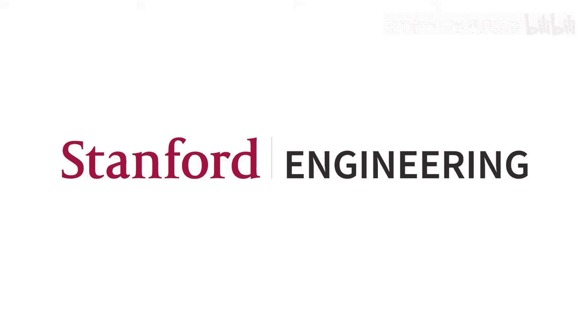
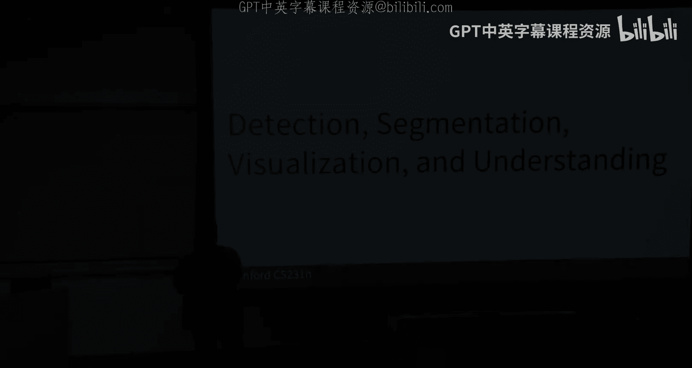
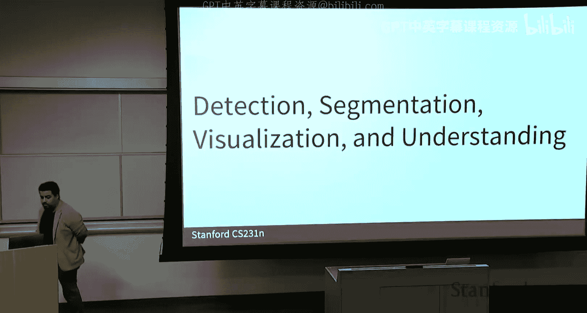
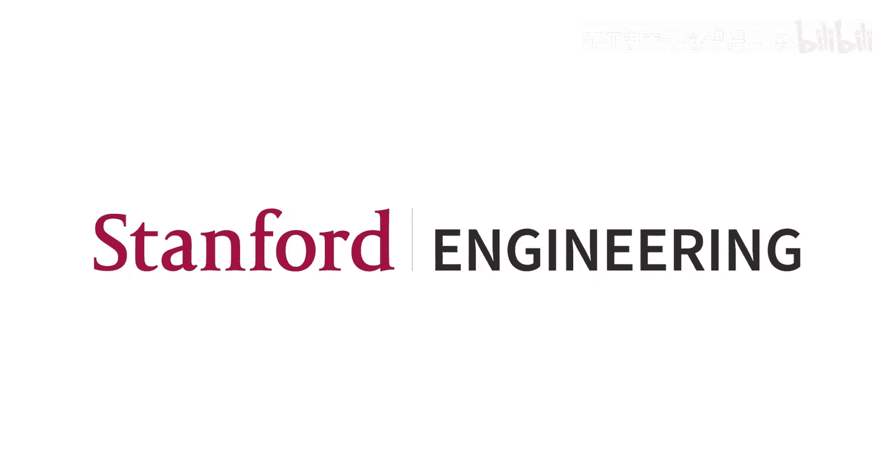

#  009：目标检测、图像分割与可视化

在本节课中，我们将学习计算机视觉中的几个核心任务：目标检测与图像分割。我们还将探讨如何可视化和理解神经网络所学到的内容。课程内容将涵盖这些领域的基础算法和重要概念，旨在为初学者提供一个清晰、全面的入门指南。

## 从序列模型到视觉Transformer

上一节课我们讨论了从循环神经网络（RNN）到Transformer模型的演变。我们看到，Transformer模型由编码器和解码器组成，编码器包含多层多头自注意力机制、层归一化以及多层感知机。这种架构能够有效地编码输入序列，并在需要时解码生成输出序列，如文本或图像。

Transformer模型，特别是自注意力机制，在许多应用中表现优于传统的RNN和卷积方法，尽管其计算和内存需求更高。这种优势源于其强大的序列建模能力。

## 视觉Transformer（ViT）简介

为了将Transformer应用于图像处理，我们需要将图像转换为序列。具体做法是将图像分割成多个小块（patches），每个小块被视为一个“令牌”（token）。这些令牌通过线性投影转换为向量，并输入到Transformer中。

然而，将图像分割成小块会丢失其二维空间位置信息。为了解决这个问题，我们引入了**位置编码**（positional embedding），可以是简单的序列编号，也可以是二维坐标编码，以告知模型每个令牌在原始图像中的位置。

在图像分类任务中，一种常见做法是添加一个特殊的**类别令牌**（class token）。这个可学习的参数在输出时被转换为类别概率向量。另一种方法是直接对所有输出令牌进行池化操作，然后投影到类别概率空间。

## Transformer的优化与变体

原始的Transformer架构经过多年发展，出现了许多优化变体，旨在提升性能或训练稳定性：
*   **层归一化位置**：将层归一化置于残差连接之前，有助于模型学习恒等映射。
*   **RMSNorm**：使用均方根归一化，有时能使训练更稳定。
*   **门控MLP**：在MLP层引入门控非线性激活，增加模型表达能力而不显著增加参数量。
*   **混合专家（MoE）**：使用多个并行的MLP层作为“专家”，通过路由机制将不同令牌分配给不同专家处理，能在不显著增加计算量的情况下提升模型容量和鲁棒性。专家数量是一个需要预设的超参数。

## 计算机视觉核心任务概述

计算机视觉涵盖多种任务，其中两个基础且重要的任务是：
*   **图像分类**：为整张图像分配一个类别标签。
*   **语义分割**：为图像中的每一个像素分配一个类别标签。

## 语义分割与全卷积网络

语义分割的目标是生成与输入图像同尺寸的像素级标签图。一种朴素的方法是独立处理每个像素及其周围区域，但这计算效率极低。

更高效的方法是使用**全卷积网络**。FCN接收整张图像作为输入，并直接输出分割图。为了处理高分辨率图像并减少计算量，FCN通常采用编码器-解码器结构：
*   **编码器**：通过卷积和下采样（如池化或步长卷积）逐步降低空间分辨率，扩大感受野，提取高级语义特征。
*   **解码器**：通过上采样操作逐步恢复空间分辨率，最终输出与输入同尺寸的分割图。

以下是常见的上采样方法：
*   **最近邻上采样**：简单复制像素值。
*   **反池化**：如果在编码器使用了最大池化并记录了最大值位置，解码器可使用反最大池化将值放回原位置。
*   **转置卷积**：一种可学习的上采样方法，通过卷积操作生成更大尺寸的输出。

训练FCN时，损失函数通常是对每个像素计算的分类损失（如交叉熵损失）的总和。这需要像素级的标注数据作为监督信号。

一个著名的FCN变体是**U-Net**，它在解码器阶段将编码器对应层的特征图通过跳跃连接（skip connections）与解码器特征图融合，这有助于保留细节信息并生成更清晰的分割边界，在医学图像分割等领域仍被广泛使用。

## 从语义分割到实例分割与目标检测

语义分割只区分像素类别，不区分同一类别的不同个体。**实例分割**则要求区分出每个独立的物体实例。这自然引出了**目标检测**任务，即不仅要识别物体类别，还要用边界框定位每个实例。

对于单目标检测，网络可以同时输出类别分数和边界框坐标（如中心点x, y，高度h，宽度w），并使用多任务损失（如分类的交叉熵损失和边界框的L2回归损失）进行训练。

对于多目标检测，直接回归所有目标的坐标不具可扩展性。早期解决方案包括：
*   **滑动窗口**：在图像上滑动不同大小和位置的窗口，对每个窗口进行分类。但窗口组合数量巨大，效率低下。
*   **区域提议网络（RPN）**：先由一个网络（RPN）快速生成可能包含物体的候选区域（Region Proposals），再对每个候选区域进行分类和边界框微调。R-CNN系列算法（如Fast R-CNN）即基于此思想，但需要两阶段处理，计算量较大。

## 单阶段目标检测器：YOLO

为了提升速度，出现了**单阶段检测器**，如**YOLO**。YOLO将图像划分为S×S的网格，每个网格单元负责预测以该单元为中心的B个边界框及其置信度（包含物体的概率）和类别概率。网络一次性完成所有预测，速度极快。通过置信度阈值和非极大值抑制（NMS）等后处理，筛选出最终的检测结果。YOLO及其后续变体因其速度和精度的平衡，在工业界应用广泛。

## 基于Transformer的目标检测：DETR

**DETR**是一个使用Transformer架构进行端到端目标检测的模型。其流程如下：
1.  使用CNN骨干网络从图像中提取特征图，并将其转换为一系列令牌，加入位置编码。
2.  令牌输入Transformer编码器进行特征交互。
3.  在解码器端，引入一组固定数量的**对象查询**（object queries，可学习参数）。每个查询通过解码器中的自注意力和与编码器输出的交叉注意力，学习“询问”图像中某个特定物体的信息。
4.  解码器的每个输出通过一个前馈网络，预测一个边界框（坐标）和类别标签（包括“无物体”类别）。

DETR简化了检测流程，无需手工设计锚框或NMS后处理。对象查询的数量设定了图像中可检测物体的最大数量。模型通过二分图匹配损失进行训练，将预测与真实标注进行最优匹配。

## 实例分割：Mask R-CNN

**Mask R-CNN**是在目标检测框架（如Faster R-CNN）基础上的扩展，用于实例分割。它在原有分支（分类和边界框回归）之外，增加了一个并行的全卷积网络分支，用于为每个检测到的物体预测一个二值掩码（mask），精确勾勒出物体的像素级轮廓。

## 神经网络的可视化与理解

理解神经网络内部的工作机制对于调试模型、建立信任（尤其在医疗等关键领域）至关重要。以下是一些核心方法：

**1. 可视化滤波器权重**
对于网络第一层的卷积滤波器，可以直接将其权重可视化为小图像，通常能看到其学习到的边缘、颜色或纹理等基础模式。

**2. 显著性图**
通过计算网络输出（如某个类别的得分）相对于输入图像每个像素的梯度，可以得到**显著性图**。图中高亮区域表示改变这些像素值对类别得分影响最大，即这些区域对网络的决策最重要。

**3. 类激活映射**
*   **CAM**：针对卷积神经网络，通过将最后一个卷积层的特征图按其对应分类权重重加权求和，并上采样回原图尺寸，生成显示哪些区域激活了特定类别的热力图。但其局限性是只能应用于最后一个卷积层。
*   **Grad-CAM**：CAM的泛化版本。它使用流向目标卷积层的梯度信息作为权重，因此可以应用于网络中间的任何卷积层，提供更灵活的可视化。

**4. Transformer的注意力可视化**
Transformer模型天然具备可解释性。其自注意力机制生成的注意力权重矩阵，可以直接显示输入序列中不同部分（如图像块）之间的关联强度，这本身就是一种强大的可视化工具，便于理解模型关注了图像的哪些区域以做出决策。

## 总结

本节课我们一起学习了计算机视觉中的几个核心任务与关键技术。我们从视觉Transformer的回顾开始，深入探讨了语义分割（使用全卷积网络如U-Net）、目标检测（从两阶段的R-CNN到单阶段的YOLO，以及基于Transformer的DETR）以及实例分割（Mask R-CNN）的基本原理。最后，我们了解了如何通过可视化技术（如显著性图、Grad-CAM和注意力图）来窥探和理解神经网络内部的决策过程。这些知识构成了现代计算机视觉应用的重要基础。