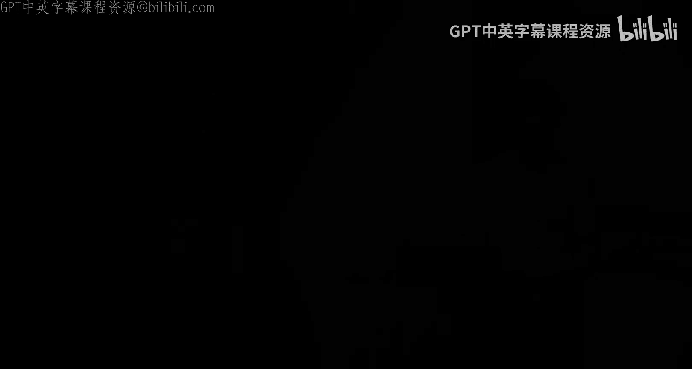
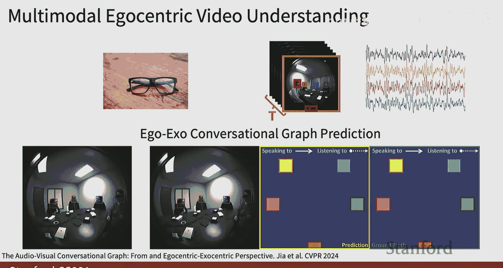
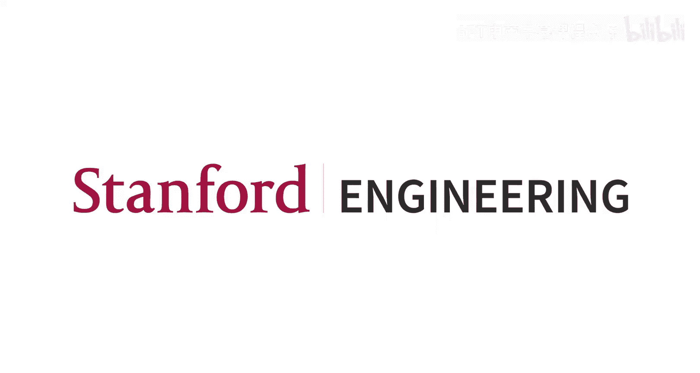

#  010：视频理解 🎥

在本节课中，我们将要学习视频理解的基础知识。视频可以看作是二维图像加上时间维度，这带来了新的挑战和机遇。我们将探讨如何将图像分类的技术扩展到视频领域，并介绍专门用于处理视频数据的模型架构。

---

## 视频理解简介

视频是二维图像加上时间维度。我们处理的不仅是三维图像（高度、宽度、通道），而是四维数据：时间（T）、高度（H）、宽度（W）和通道（C）。视频可以看作是一系列连续的图像帧。

一个典型的任务是视频分类。给定一个视频，例如一个人在跑步，我们希望训练一个深度学习模型来分类这个人是在游泳、跑步还是跳跃。这与图像分类类似，但输入是视频帧的时间序列。

视频理解与图像分类的一个关键区别在于，我们通常更关注视频中的动作，而不仅仅是场景或物体。例如，我们关心的是人的活动。

视频数据通常非常庞大。标准清晰度视频每分钟可能占用约1.5GB的存储空间，而高清视频（1920x1080）每分钟可能占用约10GB。我们无法直接将如此庞大的数据全部加载到GPU内存中。

一个简单的解决方案是缩小视频的尺寸。我们可以在时间和空间维度上进行压缩。例如，对于一个3.2秒的视频，我们可以每秒只采样5帧，并将空间分辨率降低到112x112，从而将视频大小减小到约588KB。

对于长视频的训练，一种常见的方法是使用剪辑。我们训练模型对短片段（例如几秒钟的视频）进行分类。在训练时，我们从长视频中滑动采样多个片段作为训练数据。在测试或推理时，我们同样采样多个片段，运行模型，然后对预测结果进行平均，作为整个长视频的预测。

---

## 简单的视频分类模型

视频本质上是一系列图像帧。因此，最简单的方法是将其视为独立的图像进行处理。

我们可以直接运行单帧卷积神经网络。这意味着我们使用已经学到的图像分类器，对视频的每一帧单独处理。例如，对于一个跑步的视频，每一帧可能都预测为“跑步”。然后我们对所有帧的预测结果进行平均，得到视频的最终预测。这种方法通常是一个强大且简单的基线模型，尤其是当视频帧之间变化不大时。

这种方法的关键问题是如何采样帧。一种简单的方法是随机采样。例如，对于一个一小时的视频，我们可能每分钟采样一帧。虽然这能给出一些结果，但可能不是最智能的采样策略。其他方法尝试提出更智能的采样策略，例如根据已采样帧的信息决定下一步在哪里采样。

---

## 融合策略：晚期融合与早期融合

除了单帧处理，我们还可以在特征层面进行跨帧融合。

**晚期融合** 的思路是：我们仍然对每一帧使用2D CNN提取特征。假设有T帧，我们会得到T个特征图。然后，我们可以将所有特征图展平并连接成一个巨大的特征向量，这个向量包含了所有帧的信息。接着，我们使用全连接网络将这个向量映射到类别分数。这种方法称为“晚期融合”，因为我们在非常靠后的阶段才合并特征。

晚期融合的一个缺点是会引入大量参数。连接后的特征向量非常庞大，映射它的全连接层参数很多，效率不高。

另一种晚期融合的方法是使用池化操作。我们对T个帧的特征进行池化（例如平均池化或最大池化），得到一个固定长度的特征向量，然后再用线性层映射到类别分数。这不会增加特征向量的长度，但池化操作可能会丢失一些重要信息。

晚期融合的一个潜在问题是，当我们在网络后期才融合特征时，一些低级的运动信息（例如人物脚部的上下移动）可能已经在深层特征中丢失了，因为这些特征更侧重于高级语义信息。

为了解决这个问题，我们可以尝试 **早期融合**。

在早期融合中，我们从一开始就聚合时间信息。具体做法是：将输入重塑为 `(3*T) x H x W`，即将所有帧的通道堆叠起来。然后，我们使用一个2D卷积层，将通道维度从 `3*T` 映射到 `D`。这样，我们在网络的第一层就试图处理所有帧的信息。网络的其余部分则是标准的2D CNN。这种方法试图在早期捕捉运动信息。

早期融合的缺点是，我们试图在单个卷积层中捕获所有时间信息，这可能过于雄心勃勃，难以实现。

---

## 3D卷积神经网络

介于早期融合和晚期融合之间，我们可以使用 **3D卷积神经网络**，这被称为 **慢速融合**。

其核心思想是使用3D版本的卷积和池化操作，在网络中逐渐融合时空信息，而不是在早期或晚期一次性完成。

**3D卷积** 与2D卷积类似，但多了一个时间维度。在2D卷积中，滤波器在空间维度（高度和宽度）上滑动。在3D卷积中，滤波器在时间、高度和宽度三个维度上滑动，形成一个立方体。例如，一个 `3x3x3` 的3D卷积核会在3个连续帧、3个像素高、3个像素宽的立方体区域上进行计算。

通过堆叠多个3D卷积和池化层，网络可以逐渐增大在时间和空间上的感受野，从而学习到视频中的时空模式。

与早期融合（使用2D卷积但通道维度包含所有时间信息）相比，3D卷积的主要优势在于具有 **时间平移不变性**。在早期融合中，滤波器在时间维度上是“全连接”的，这意味着要识别在不同时间点发生的相同运动模式（例如从蓝色到橙色的变化），需要学习不同的滤波器。而3D卷积的滤波器只在局部时间窗口内操作，并可以滑动，因此同一个滤波器可以识别在不同时间点出现的相同运动模式，提高了表示效率。

我们可以可视化3D卷积网络学习到的滤波器。有些滤波器学习的是静态的颜色或边缘模式（类似于图像滤波器），而有些则学习到了明显的时空运动模式。

---

## 视频数据集与模型性能

一个著名的视频分类数据集是 **Sports-1M**，包含487种细粒度的体育类别。

在这个数据集上，一些有趣的实验结果包括：
*   **单帧模型**（将视频视为图像）取得了77.7%的Top-5准确率，是一个非常强的基线。
*   **早期融合模型** 的性能略差。
*   **晚期融合模型** 性能稍好。
*   **3D卷积神经网络**（以2014年的模型为例）带来了约2-3%的性能提升。

这个结果告诉我们，在设计视频分类器时，应该首先尝试简单的单帧模型。当然，在过去十年中，3D卷积网络已经有了巨大的进步。

---

## 双流网络：显式建模运动

空间（外观）信息和时间（运动）信息本质不同。人类仅凭运动信息（如关节点轨迹）就能很好地区分动作。因此，我们可以显式地分别建模外观和运动。

一种显式测量运动的方法是计算 **光流**。光流估计了相邻帧之间每个像素的运动矢量（dx， dy），描述了像素从一帧到下一帧的移动。水平光流和垂直光流可以分开可视化。

**双流网络** 包含两个并行的分支：
1.  **空间流**：处理单帧RGB图像，负责识别外观。
2.  **时间流**：处理多帧堆叠的光流图像（水平和垂直分量），负责识别运动。

两个分支分别进行预测，最后将它们的预测分数融合，得到最终的动作类别。实验表明，在某些数据集（如UCF-101）上，仅使用运动流（时间流）的性能甚至优于仅使用外观流（空间流），这可能是因为运动信息更不容易过拟合背景等无关信息。

---

## 建模长时依赖：循环网络与注意力机制

之前讨论的模型主要处理短片段。为了建模视频中的长时依赖关系，我们可以使用序列模型。

一种方法是使用 **循环神经网络**（RNN， LSTM）。我们可以用CNN（无论是单帧CNN还是3D CNN）从每个片段或帧中提取特征，然后将这些特征序列输入RNN/LSTM。这可以实现“多对一”的映射（整个视频输出一个标签）或“一对一对”的映射（每帧输出一个标签）。

我们可以进一步结合CNN和RNN，构建 **循环卷积神经网络**。其思想是将RNN中的矩阵乘法替换为2D卷积操作。这样，网络中的每个“状态”都是一个特征图（C x H x W），它依赖于上一时间步的同一层状态和同一时间步的上一层状态。这结合了卷积的空间处理能力和循环的时间建模能力。

然而，RNN难以并行处理长序列。因此，**自注意力机制**（如Transformer）成为了更受欢迎的选择。自注意力高度可并行化，能有效捕捉长距离依赖。

我们可以将自注意力机制扩展到3D。给定一个 `C x T x H x W` 的特征图，我们可以使用 `1x1x1` 的3D卷积来生成查询（Query）、键（Key）和值（Value）特征图。然后计算注意力权重，并聚合值特征。这种模块（常被称为“非局部块”）可以插入到现有的3D CNN架构中， powerful地融合时空信息。

---

## 利用图像网络知识：膨胀3D网络（I3D）

我们拥有大量在图像数据上预训练成功的2D CNN架构和权重。能否将它们用于视频？

**膨胀3D网络（I3D）** 的核心思想是“膨胀”现有的2D架构。具体做法是：将2D卷积核（如 `KxK`）复制并扩展到时域，变成3D卷积核（如 `TxKxK`）。例如，将ImageNet上预训练的2D Inception网络的权重进行膨胀，初始化对应的3D网络。

为了保持输入为静态图像时输出不变，可以将膨胀后的3D卷积核权重除以时间维度T。这样，我们就有了一个利用图像先验知识初始化的3D视频网络，然后可以在视频数据上进行微调。这种方法被证明非常有效，性能优于早期的双流网络。

---

## 超越分类：其他视频任务与多模态

视频理解不仅限于分类。

*   **时序动作定位**：不仅要识别动作，还要定位动作在视频中发生的时间段。
*   **时空动作检测**：在视频中同时定位动作发生的空间位置（边界框）和时间区间。

此外，视频通常包含 **音频** 信息。结合视觉和听觉的多模态理解能开启更多有趣的任务，例如：
*   **视觉引导的音频源分离**：利用视频信息（如说话人的嘴型或乐器的演奏动作）来分离混合音频中的不同声源。
*   **音视频联合分类**：使用Transformer等架构同时处理视觉片段和音频频谱图，进行更鲁棒的分类。

当前的研究热点还包括：
*   **高效视频理解**：通过智能采样、模型选择等技术，减少需要处理的视频剪辑数量，提高效率。
*   **第一人称（Egocentric）视频理解**：处理来自智能眼镜等设备的第一人称视角视频，理解复杂的社交互动。
*   **视频大语言模型**：构建能够理解和生成视频描述的大型基础模型。

---

## 总结

本节课中，我们一起学习了视频理解的基础知识。我们从最简单的单帧图像分类方法开始，探讨了晚期融合和早期融合策略，并深入介绍了核心的3D卷积神经网络。我们还了解了显式建模运动的双流网络，以及用于处理长序列的循环网络和注意力机制。最后，我们看到了如何利用图像网络的预训练知识（I3D），并简要介绍了视频理解的其他任务和多模态扩展方向。视频理解是一个丰富且快速发展的领域，结合了计算机视觉、序列建模和多模态学习的多种技术。