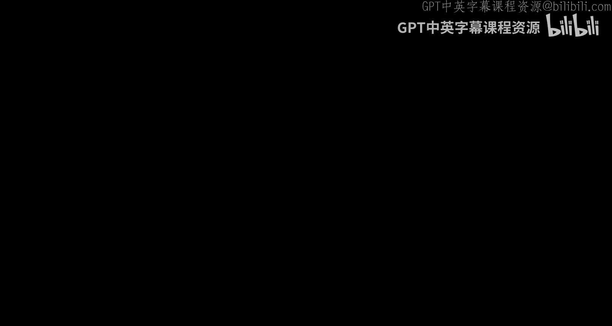
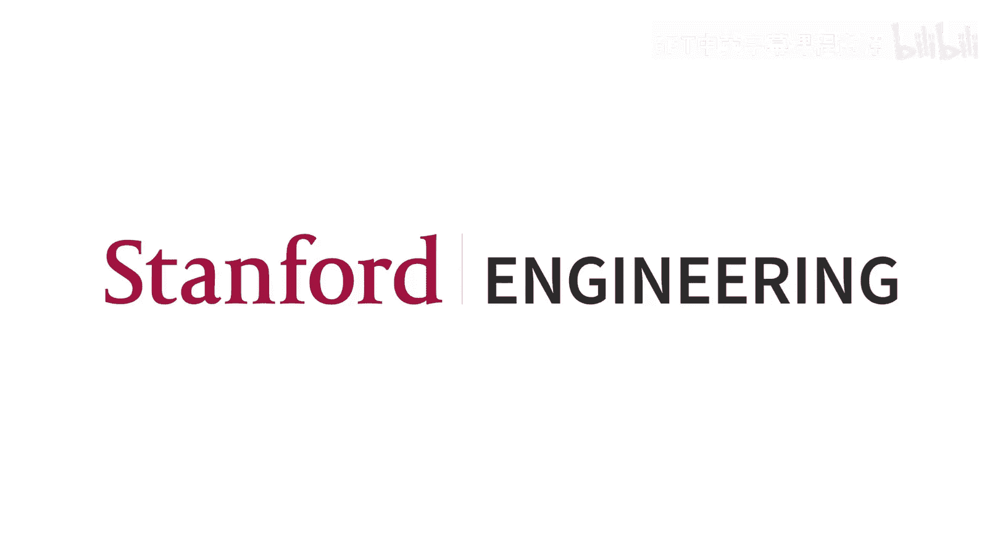

#  011：大规模分布式训练

欢迎回到CS231n。今天第11讲，我们将讨论大规模分布式训练。这是一个令人兴奋的话题，因为如今所有神经网络的实践训练都基于此。无论是初创公司、工业界还是学术界的大型模型，大规模训练已成为深度学习的常态。这与10年前我们开设这门课程时的情况相比，发生了巨大变化。10年前，基本上所有模型都在单个GPU设备上训练，多设备训练相当少见。但如今，新的常态是在数十、数百、数千甚至数万台设备上并发训练模型。因此，我们需要开发新的算法和新的思维方式来实现这一点。

😊

作为贯穿今天讲座的一个运行示例，我们将大量讨论Llama 3 405B模型。这并非因为它是最好的或最有趣的模型，而是因为它是一个相当接近前沿的模型，并且实际分享了大量关于其训练方式、模型架构等实现细节。过去几年，谷歌、OpenAI、Anthropic等公司训练了许多真正强大惊人的模型，但它们基本上不再分享任何模型细节。对我而言，一个非常著名的引述标志着行业的一个重大转变，这出现在2023年的GPT-4论文中。当他们发布GPT-4模型时，他们写道：“考虑到像GPT-4这样大规模模型的竞争格局和安全影响，本报告（即他们关于GPT-4的论文）不包含关于架构的进一步细节，包括模型大小、硬件、训练计算、数据构建、训练方法或类似内容。”这基本上就是过去三年来大规模模型的最新技术状态。自GPT-4以来，他们不会告诉你任何信息。你能知道它是一个Transformer模型就算幸运了。

因此，Llama 3之所以引人注目，并非因为它是最好的模型，而是因为它是最开放的模型之一。这是一个由Meta训练并于2024年4月开源发布的大型语言模型。与OpenAI不同，其论文确实分享了大量关于模型训练的细节，虽然关于数据的信息不多，但分享了大量用于训练的系统基础设施信息。这让我们得以一窥当今大规模LLM的实际训练方式。顺便提一下，上个月（2025年4月）刚刚发布了新的Llama 4模型，开源领域已经有了稍好的模型，但Llama 4还没有论文。我希望几个月后论文发布时能读到它，看看我们能从新一代Llama训练中学到什么。但作为今天讲座的运行示例，我们将出于这个原因引用许多Llama 3 405B模型的例子。

今天我想讨论的基本上是两件事。一是关于GPU硬件，二是如何在大量GPU上进行训练。我想让大家了解这些模型实际执行的硬件是什么，以及我们需要使用哪些算法来在大量GPU上进行训练。

首先，我们将稍微讨论一下GPU硬件。GPU，对于不了解的人来说，是图形处理单元。这些是专门设计的协处理器，最初是为计算机图形学开发的，后来被发现是非常有用的通用并行处理器。在这个房间进行这个讲座非常合适，因为这是黄仁勋礼堂。黄仁勋是英伟达的CEO和创始人，英伟达是过去几十年来最大的公司，为游戏和AI生产GPU。这些东西最初是为图形学设计的，因为如果你想想计算机图形学，你需要在屏幕上生成大量像素，需要处理许多小的原始几何图形来生成这些像素。因此，在进行计算机图形学时，很自然地会进行大量并行计算。人们很快发现，这些为计算机图形学构建的硬件实际上也可以用于更通用的并行计算。在21世纪初，研究人员就发现了如何利用这些显卡进行通用并行编程。进入21世纪10年代，英伟达真正抓住了这一点，开发并推广了这些设备，旨在成为通用并行处理器。当时他们并不完全清楚它们将被用于什么，但他们有一个普遍的想法，即并行处理将变得重要。当深度学习在21世纪10年代初开始兴起时，英伟达充分利用了这一点。值得称赞的是，我认为他们很早就认识到了这个研究领域的潜力，甚至在21世纪10年代初就投入了大量资源，确保他们的硬件对深度学习训练真正有用。基于此，十多年来，这已成为人们训练大规模深度学习模型的主要方式，尽管正如我们将看到的，这种情况正在开始改变。但他们的芯片仍然是人们使用的主要芯片。

我总是喜欢观察这些设备的内部结构，看看里面有什么。这是一张英伟达H100的图片，它是当前深度学习训练的主力。下一代已经发布，但还不太容易获得，我还没有在上面训练过任何东西，所以这基本上是当前的技术水平。在这个英伟达H100 GPU的中间是这些计算核心，周围是80GB的HBM（高带宽内存）。你可以看到内存与计算核心是分离的，它们需要通过总线相互通信，在GPU内存和核心之间来回移动数据，速度约为每秒3TB，这是大量的比特移动。

现在，如果我们深入GPU核心内部，可以看到在中间的计算核心部分，有一块较小的内存，大约50MB的L2缓存，这比80GB的HBM内存小得多，但它非常接近实际的计算元件，因此计算核心可以更快地访问它。然后，真正的核心是这132个流式多处理器（SM）。这些就像是独立的并行核心，在某些方面比典型的CPU核心更强大，因为它们可以进行更多的并行计算，但在许多方面也比典型的CPU核心弱得多，因为它们往往时钟速度较低，无法进行那么多的指令预测和分支预测。因此，很难在GPU核心和CPU核心之间进行精确的苹果对苹果的比较，但我通常认为这些流式多处理器大致相当于一个CPU核心。我知道有人会回家仔细数屏幕上的小方块，你会发现实际上有144个，而我刚才说只有132个。为什么会这样？这是因为所有GPU硬件都使用一个称为“分档”的过程。在制造这些东西时，它们有如此多的晶体管和计算元件，无论投入多少资金，都无法完美制造出来。总有一些会出点问题。因此，他们在产品开发中为此做了规划。他们说，我们尝试制造一个芯片。理论上完整的芯片有144个核心，但没有一个芯片是完美的。但我们知道，其中相当一部分至少有132个核心能正常工作。因此，他们倾向于使用这种分档过程。这样，他们实际上可以通过只保证132个核心能开启，来销售更大比例的他们尝试生产的芯片。

然后，我们可以更深入地观察其中一个流式多处理器，看看GPU内部更多的情况。这只是H100内部132个活动流式多处理器中的一个。这里面有几个有趣的元素需要关注。首先，我们看到有256KB的L1缓存和寄存器文件。这延续了GPU内存层次结构的趋势。我们发现在学习深度学习时，实际上是在学习计算机体系结构，这有点意外。事实证明，内存层次结构对于深度学习和所有高性能计算都非常重要。总的趋势是，离计算核心越远，内存容量越大；离计算核心越近，内存容量越小，但速度要快得多。如果你编写在这些设备上运行的低级算法，了解这个内存层次结构并非常仔细地在不同层次之间传递数据是非常重要的。如果你编写高性能的GPU内核，你会花很多时间尝试优化这一点。

为了让你有个概念，H100中有三个级别的内存层次结构：256KB的L1缓存、50MB的L2缓存和80GB的HBM内存。这是H100中内存层次结构的三个主要级别。

😊

然后，我们还有128个FP32核心。这些是可以进行通用浮点运算的小型算术单元。具体来说，这128个FP32核心中的每一个都可以在一个时钟周期内计算 `AX + B`，其中A、X和B都是标量。然后，如果你把它们加起来，`AX + B` 基本上是一次乘法和一次加法，你有128个这样的核心，所以整个SM每个设备时钟周期可以执行256次浮点运算。

然后，我们还会看到用红色标出的部分，这是真正神奇的地方。除了这些FP32核心，还有这些张量核心。我认为这个名字有点用词不当，它们实际上是矩阵核心。每个张量核心都是一个专用电路，只做一件事：矩阵乘法。具体来说，我相信H100的张量核心可以处理一个16x4的输入矩阵A和一个4x8的输入矩阵B，然后加上一个16x8的偏置矩阵。它基本上执行 `AX + B`，其中A、X和B是这种固定大小的矩阵块。每个张量核心每个时钟周期可以执行一次这样的小块矩阵乘法。然后，如果你把这些数字乘起来，你会发现那个特定大小的 `AX + B` 矩阵乘法涉及1024次浮点运算（每次乘法和每次加法算作一次浮点运算）。乘以SM中的四个张量核心，我们看到整个SM如果通过张量核心运行，每个时钟周期可以执行超过4096次浮点运算。我们需要将这个数字与从FP32核心获得的256次进行比较。在这里我们看到，就像张量核心是所有魔力的来源一样，设备的主要吞吐量也来自这里。如果你编写的代码想要在这些GPU上以最大利用率运行，你需要最大限度地利用这些张量核心。

关于这些张量核心的另一个有趣之处是，它们实际上以混合精度运行，而不是传统的32位浮点数。张量核心倾向于使用混合精度过程，输入通常是16位，有几种不同的有趣16位格式，我们今天无法深入讨论。它们会以这种较低精度的16位进行乘法运算，然后以较高精度的32位进行加法（累积）。因此，这些张量核心接受低精度16位输入，进行一些中间计算，并以较高精度32位产生输出。这很重要，因为如果你忘记将PyTorch模型转换为16位，它将在浮点核心上运行，速度将比你预期的慢20倍。这看起来像是细节问题，但当你在PyTorch代码中搞错数据类型时，它会变得非常明显。

GPU确实非常快，而且过去十年或十五年它们的速度提升之快令人难以置信。当我刚开始攻读博士学位并从事深度学习研究时，我们都在使用的最先进的GPU是2013年发布的K40 GPU。整个设备只能进行约5 teraflops的FP32计算。我应该解释一下这个图表：X轴是时间，大约从2013年到现在；Y轴是每个设备的峰值吞吐量，以每秒teraflops为单位。你可以看到图表上升了很多，但这里需要注意一点：从K40到P100，再到V100（大约在2016-2017年我博士毕业前后发布），发生了一些真正惊人的事情。V100是第一款引入这些张量核心的设备。自那以后，更新的设备拥有了更多的张量核心、更大的张量核心，设备面积更多地分配给了张量核心，这导致了这些设备在过去10到15年里吞吐量的巨大增长。最新的设备是正式宣布的B200，目前正在缓慢推出。理论上，它的FP32计算能力约为83.3 teraflops/秒，张量核心的NI精度计算能力约为5000 teraflops/秒。退一步看，这确实意味着过去12年里，计算能力增长了1000倍，而这还只是在单个设备层面。为什么过去10年AI变得如此强大？这就是答案之一：我们现在利用的计算资源在十年内增长了1000倍。世界上任何事物发生1000倍的变化时，你都应该站起来关注，因为这将在我们的技术能力上引起重大变化。我认为，这1000倍的改进是过去十年深度学习改进的主要驱动力。

所以，B200没有500个张量核心，而是有5000 teraflops的张量核心计算能力。是的，我们总是试图区分张量核心上的计算和FP32核心上的计算。

这已经很疯狂了，对吧？一个你可以拿在手里的设备，在十年内性能提升了1000倍，这已经够疯狂了。我手里拿过K40，虽然还没有机会拿B200，但它们感觉像是相同的物理对象，大小、重量、外观都差不多，但今天的设备比12年前的快1000倍。这太疯狂了。

但更疯狂的是，我们并不只在一台GPU上训练。我说过，当K40在2013年首次推出时，实际上很多模型都是在单个GPU上训练的。但今天，我们不仅在单个GPU上训练，而是在数千、数万甚至数十万台GPU上共同训练一个模型。将这个叠加在每台设备吞吐量1000倍的提升之上，过去十年确实发生了一些真正疯狂的事情。

😊

那么，我们已经观察了GPU内部。现在，我想放大视角，将GPU置于上下文中，不再看单个设备，而是思考我们构建的、将许多这样的设备连接在一起的现代GPU集群。

我们已经看到了单个H100 GPU。在这里，我们可以将其视为内存层次结构的另一个级别。我们已经看到H100内部，随着我们接近计算元件，有三个层次的内存层次结构。随着你离计算元件越远，内存带宽（设备在不同系统部分之间移动比特的能力）就越慢。这种趋势实际上在超出单个设备的范围，想象这些设备在完整数据中心中的背景下时，仍在继续。

这里我们看到，单个H100 GPU的内存带宽约为每秒3TB，这是GPU内存与其自身计算元件之间的通信速度。但这些设备通常位于GPU服务器内部。几乎所有的GPU服务器都有8个设备，装在一个大箱子里。这些GPU可以相互通信，通常服务器内任何一台GPU与另一台GPU之间的通信速率约为每秒900GB。你可以看到，这与GPU内部设备间的通信带宽相比，大约减少了3倍。

在这里，我们再次转向Llama 3。许多主要参与者不公布其训练集群的细节，但Llama 3技术报告确实提供了大量关于其训练集群的细节。因此，这里的一些具体细节可能因集群而异，但这些数字来自用于训练其模型的Llama 3集群。给定一个GPU机箱，他们将两个这样的机箱堆叠到一个服务器机架中。服务器机架大约6英尺高，和一个人差不多高，可以想象一下这些东西的大小。一个服务器机架内部有两个服务器，总共16个GPU。然后，我们将许多服务器机架连接成一个GPU pod。Llama 3集群的GPU pod由192个机架组成，总共3072个GPU。这些机架之间有非常高带宽的连接器，因此，pod内任何一对GPU可以以大约每秒50GB的速率相互通信。现在你可以看到，这比单个服务器内部GPU之间的通信带宽又降低了大约20倍。

3072个GPU似乎计算能力很强，但现在还远远不够。因此，我们将把这些GPU pod堆叠在一起，形成一个完整的GPU集群。这实际上是Meta为训练Llama 3模型构建的完整GPU集群。这个东西将8个GPU pod组合在一起，总共24576个GPU。我找不到这些pod之间内存流量的确切数字，但肯定低于每秒50GB。顺便说一下，这远非世界上最大的GPU集群，只是我能快速找到精确数字的最大集群。但世界上肯定存在拥有5万、10万个GPU的GPU集群，它们确实存在，并且人们在其上训练模型。

这种方式是自然扩展的。你只需将更多pod集群在一起，创建一个更大的集群，或者你可能会有另一个层次结构，比如一个超级pod连接到其他超级pod，以获得更高的级别。

他们用那个GPU集群训练了多长时间？我不记得Llama 3模型的具体时间了，但过去十年有一个经验法则：人们训练的最长模型通常在几个月左右。我认为这更多地与技术无关，而与人员有关。在制定计划、让人们从事工作时，很难进行非常、非常长的训练运行。因此，最大的最先进模型的训练运行时间通常以月计。如果像GPT-4.5、GPT-5这样的最大模型现在接近一年，我也不会感到惊讶，但在这些非常长、非常大的训练集群上，看到持续几个月的训练运行是相当常见的。

问题在于，为什么将服务器组织成机架而不是pod？你必须把它们放在某个地方。这些东西有物理限制。因此，服务器机架几十年来一直是数据中心的标准单元。当这些新的GPU设备出现时，它们提供了不同种类的服务器，物理尺寸更大，功耗更高，但你无法一夜之间从头开始重新设计整个数据中心。因此，服务器机架一直是一种标准单元，具有标准的硬件尺寸，数据中心通常围绕它构建。

一个集群需要多大的物理空间？哦，这是个好问题。一个服务器机架大约6-8英尺高，大概这么大，也许像这个讲台大小，和我差不多高。然后一个pod里有192个机架，所以想象一下大约200个这样的讲台有多大，然后乘以8。但这实际上有点低估了，因为你通常将这些设备组织成行，以便人们可以在其间行走，并且集群中还需要打包更多硬件。除了包含物理GPU服务器的计算机架外，还会有其他机架包含网络硬件，因为所有设备之间需要传输大量比特；还会有专门的机架仅用于存储硬件，因为你需要将训练数据存储在某个地方并输入到设备中。这些东西会占用相当大的空间。

哦，是的，问题是当你使用这些大型集群时，较小的计算单元是否保持较高的吞吐量？是的，它们确实如此。这是设计这些系统的秘诀和挑战的一部分，因为你理想情况下希望在可能的时候利用快速通信，同时在扩展时优雅地回退到较慢的通信。

它有多热？相当热。如果你们中有人是游戏玩家，家里台式机里有4090或5090 GPU，单个4090 GPU在玩游戏时会使你的房间变热，让你想开窗，会使房间物理上更温暖。想象一下，单个游戏GPU就能对一个普通大小的房间产生这种影响。是的，一旦你将数万台这样的设备堆叠在一个大型数据中心里，就需要一些严重的冷却要求。

😊

尽管另一个有趣的事情是，冷却变得疯狂，对吧？游戏台式机通常是风冷，有时是水冷。然后你可以设计不同的冷却系统，可以在硬件上大做文章，尝试优化所有这些。

😊

好了，我认为这些东西超级酷，想象一下这些GPU不仅仅是漂浮在云中的神秘生物，它们是有人建造并堆放在某个房间里的实际物理原子，想象它们的样子真的很有趣。

😊

因此，当我们转向这些大型GPU集群时，一种思维方式的转变实际上是不再过多考虑单个设备或单个服务器，我基本上尝试将整个数据中心视为一台大型计算机。在这种情况下，这台大型计算机有24000个GPU、1.8 PB的GPU HBM内存、4.15亿个FP32核心、1300万个张量核心，整个系统每秒可以进行24 exaflops的计算（24乘以10的18次方）。这是大量的flops。但我保证，五年后的今天，这不会让人觉得是很多flops，这才是更疯狂的部分。我们的目标实际上是将这24000个GPU的整个块视为一台巨型超级计算机。然后问题是，我们如何在这台巨型超级计算机上连续数月训练一个神经网络，并训练一个真正庞大、强大、能够吸收海量数据的神经网络？这基本上就是我们在深度学习中转向的问题和范式。

顺便说一下，我一直说GPU，一直说英伟达，因为它们是目前最主要的训练架构和硬件。但也出现了一些其他竞争者。我认为目前英伟达训练硬件的最大竞争对手是谷歌。谷歌有自己的硬件，称为张量处理单元（TPU），这些硬件非常出色，已经经历了六代。这是V5 TPU的统计数据，你现在可以在谷歌云上租用，其规格与我们刚刚讨论的H100大致处于同一数量级，有些相似。TPU中有一些有趣的设计决策与GPU有很大不同，我觉得很迷人，但我们今天没有时间深入探讨。有人问这些东西有多大？这是一张实际图片，就像GPU一样，这些TPU被排列成pod，V5 TPU可以排列成最多8960个芯片的pod。这实际上是一张V2 TPU pod的图片，只有256个芯片。这让你对这些东西的大小有个概念。每个机架，你可以看到这里有四个机架，这些机架大概比我高一点，四个并排放置，容纳256个TPU芯片。现在想象一下，在拥有近9000个芯片的更新pod中，这个东西会变得大得多。

是的，谷歌的Gemini模型几乎肯定是在TPU上训练的。当然，他们不会告诉你，但如果它们不是，我会感到非常震惊。

正如我所说，TPU实际上非常好。我假设大多数大规模的谷歌模型都是在这些设备上训练的，而且这些模型非常有竞争力。因此，这是非常好的训练硬件。与英伟达的不同之处在于，你无法购买它，访问TPU的唯一方式要么是在谷歌工作，要么是在谷歌云上租用。但它确实是非常好的硬件，很多人都在使用它，但我认为目前它仍然比H100、比英伟达GPU稍微不那么流行。当然，其他公司显然知道这是非常重要的事情。因此，有许多其他公司正在尝试构建有竞争力的训练硬件。但我诚实的评估是，目前英伟达和TPU可能是两大巨头，在可用性、性能和市场份额方面遥遥领先于其他所有人。但也有很多其他公司正在努力追赶这里。两个值得注意的公司是AMD，AMD几十年来一直是第二大GPU制造商，他们也有一个训练加速器，称为MI325X。在纸面上，它实际上有非常好的统计数据，与H100相当，但目前还没有产生与H100相同的影响。AWS也开发了自己的训练芯片，称为Trainium。我对这个了解不多，我自己从未尝试使用过它，但我知道Anthropic在他们的部分训练中使用它。我不知道他们的训练在多大程度上完全使用Trainium而不是GPU。

因此，我们应该期待看到更多，但就目前而言，我认为英伟达GPU可能是最主要的，谷歌TPU紧随其后，它们也非常好，但可能不如英伟达的GPU使用广泛。

好了，这基本上是第一部分：什么是GPU？我们如何将它们组织成集群？只是让你了解一下我们构建和训练的机器的物理特性。

第二个问题是，我们如何实际编写算法，能够利用这个拥有数万台GPU的巨型GPU集群？这将需要我们开发新的算法、新的计算思维方式以及新的并行化和拆分神经网络的方法。这里的基本策略是拆分你的计算。这些是巨大的并行设备，我们看到了它们有很多GPU、很多CPU核心、很多可以独立运行的GPU核心，而且它们之间不能过多通信。如果你从高层次思考计算机真正做什么，计算机基本上做两件事：计算（接收输入比特并从中计算新的输出比特）和通信（将比特从一个地方的内存移动到另一个地方的内存）。整个诀窍是如何利用整个集群中多个级别的内存层次结构，将通信与计算重叠，并拆分和并行化计算。

在训练一个巨型神经网络的过程中，我们有有用的工作让那数万台独立GPU、数百万个独立计算元件全部并行执行，然后让它们以某种方式相互通信它们的工作，从而实现在这个巨型集群上训练一个巨型神经网络。

😡

为此，我喜欢的一种思考方式是，如今在训练大规模神经网络时，人们基本上利用了五种并行度。其中很多是针对Transformer的，因为它们是人们用于大规模训练的主要架构。如果你考虑一个Transformer，它基本上是一个L层的堆栈，每一层都在一个三维张量上操作。一个维度是小批量维度，我们有一批序列在小批量中操作；一个序列维度，我们在序列或标记集上操作；一个维度维度，每个标记本身是一个具有某个维度的向量。因此，我们的Transformer在这些三维张量上操作，并通过一系列层进行操作。这给了我们四个可以并行化的轴：我们可以在层轴上并行化（称为流水线并行），可以在批量维度上并行化（称为数据并行），可以在序列维度上拆分（称为上下文并行），可以在那个维度维度上拆分（称为张量并行）。所有这些都有有趣的名字，但如果你这样思考，它们基本上都是在Transformer内部这四个计算轴上进行计算拆分的不同方式。然后我们将更详细地逐步介绍每一种，因为所有这些不同的分布式训练机制都有很多有趣的细微差别。

第一种是数据并行（DP）。基本思想很简单。记住，当我们训练神经网络时，我们总是在小批量样本上操作，对吧？我们总是取一小批元素，根据我们的训练任务计算每个条目的损失，然后计算梯度，其中梯度通常是每个小批量元素损失梯度的平均值。在大多数神经网络架构中，计算损失然后计算梯度对于小批量中的每个元素是独立的。因此，这似乎是可轻松并行化的。

😊

基本思想是，如果你可以在单个GPU上容纳n个示例的小批量，并且你可以访问M个GPU，那么我们将使用一个M乘以n个示例的巨型小批量来训练我们的模型，我们将那个巨型小批量拆分成更小的n个样本的小批量，每个GPU上放一个。如果你从数学上思考为什么这有意义，那是因为梯度是线性的。实际上，如果你计算一个标量损失L，它将是每个条目上计算的某些个体损失的平均值（这些Xj是你整个宏批次中的所有条目），而w是整个网络的权重矩阵，那么通常在正向传播结束时计算的损失是每个小批量元素损失的平均值。然后，如果你计算损失相对于网络权重的梯度（这是我们需要计算以进行权重更新的东西），那么这实际上会拆分，因为梯度是线性的。

你可以选择我们想以什么顺序进行求和、进行梯度计算、进行平均。具体来说，将梯度安排在这种特定的公式中变得很方便，其中我们突出显示了蓝色的内部项，这基本上是在n个元素上的正常反向传播，这些可以在不同的GPU上并行计算。然后有一个外部求和，我们需要在所有参与训练的M个不同设备上对梯度取平均值。

这就是从数学角度发生的事情，我们看到这在数学上是完全合理的。这基本上与在单个设备上训练完全相同，我们只是巧妙地运用了代数，改变了平均和求和的顺序。但这不是近似，这与我们在单个更大GPU上进行的计算完全相同。

从GPU的角度来看，这看起来像是我们有M个GPU（这里我展示M=3，因为幻灯片上只能合理容纳这么多，但请理解在实践中这比3大得多）。然后，每个GPU实际上维护其自己独立的神经网络权重副本、优化器状态副本和梯度副本。然后，每个GPU将并行加载不同的小批量数据（这里我们展示每个GPU加载三个元素的小批量）。至关重要的是，不同的GPU需要加载不同的小批量数据。我的代码和学生的代码中曾出现过错误，他们不小心加载了相同的小批量到所有GPU上，这不会有帮助，不好，不要犯那个错误。因此，不同的GPU实际加载不同的小批量数据至关重要。然后，每个GPU将独立地在其自己的小批量数据上执行自己的正向传播，计算其自己的局部损失。这些都可以完全独立操作，不需要GPU之间的任何通信。然后，每个网络将执行自己的反向传播，计算其自己的局部损失相对于模型所有权重的梯度。同样，这可以完全独立发生，因为每个模型都有自己的模型权重独立副本，可以完全独立地执行自己的正向和反向传播。

但在反向传播完成后，事情就变得棘手了。记住，我们需要计算所有参与训练的设备上这些梯度的平均值。因此，我们需要通信。这时我们执行一个“全归约”操作。每个GPU需要将其梯度发送给所有其他GPU。因此，有两件事同时发生：一、每个GPU需要将其梯度广播给所有GPU；二、每个GPU需要收集所有参与训练的GPU的梯度。这是一个全归约操作，通常在对数时间内发生，取决于GPU数量。在这个全归约操作结束时，每个GPU现在拥有所有设备上所有梯度的平均值。此时，通信已经发生，每个GPU现在拥有一个相同的梯度副本，这些梯度已经在所有设备上进行了全归约。现在，在训练迭代开始时，我们假设每个GPU都有其自己独立的模型权重副本。此时，每个GPU都有其自己独立但相同的、来自整个宏批次数据的梯度副本。因此，此时每个GPU可以对其自己的局部权重副本进行权重更新。因为它们从相同的权重开始，并应用了相同的梯度，假设算术是确定性的，它们在局部权重更新后将具有相同的权重。

顺便说一下，这非常重要：步骤4和5实际上可以并行发生。我们说过，这里实际上有两件事可以并行发生：一是反向传播，每个GPU计算自己的反向传播以计算梯度；二是跨GPU的梯度通信。在实践中，这两件事通常会同时发生。这意味着每个模型将开始计算网络最后一层的反向传播，然后计算其自己的局部梯度。然后，模型将开始计算倒数第二层的反向传播，当计算元件忙于计算倒数第二层的反向传播时，GPU将同时进行最后一层梯度的全归约。这意味着这些操作可以并行进行：第L+1层的通信和第L层的反向传播。它们可以并行地进行，希望到我们到达网络末端、反向传播完成时，梯度已经在所有设备上完成了全归约。然后我们可以立即进行权重更新，无需等待。这非常重要，因为正如我们所说，通信相对较慢。因此，在这些系统中的整个诀窍是找出隐藏通信成本的方法，并在计算的同时进行通信。

问题是，步骤4或5会成为瓶颈吗？答案是：是的。这完全取决于你的设备速度、模型大小、小批量大小、设备间互连速度。当你进行这种较低规模的分布式训练时，答案总是：这取决于你的具体情况，你需要为你的情况进行基准测试。

为什么不在每个GPU上执行M个不同的梯度步骤？这实际上是一个非常酷的想法。实际上，过去有一组流行的算法，称为异步SGD，它们基本上会这样做：让一堆不同的模型副本独立地执行一些模型步骤，然后每隔一段时间尝试对它们进行平均。这些算法曾经很流行，谷歌在开发TPU pod之前，他们在21世纪10年代初的一些早期网络就是以这种方式训练的。但首先，它往往更不稳定；其次，它很难调试和复现，往往效果稍差。因此，它感觉上是一种更具扩展性的方法，但在实践中，如果你能同步进行所有操作，那么你的算法更容易调试、理解和推理。基本上，如果你能实现同步梯度更新，它可能会工作得更好。但实际上，我个人不会对在未来几年内看到异步SGD方法的复兴感到太惊讶，因为我认为它们对分布式更友好。

没有一台计算机可以协调所有这些事情。所有这些设备都是具有自己独立资源的独立设备，没有驱动程序可以以上帝视角来执行这些步骤。

所有这些计算都必须在某个地方进行。好问题。我说过，当你重叠通信和计算时，你需要为此编写代码，还是硬件会自动完成？你肯定需要为此编写代码。硬件不够智能，无法理解你想做什么。正如我们所说，硬件理解这些小矩阵乘法块，理解相当低级的东西。任何你想要调度通信的事情，都需要在软件中处理。但幸运的是，对于许多这些常见用例，PyTorch已经为你提供了支持。例如，在这种情况下，有一个PyTorch类叫做`DistributedDataParallel`，它会为你完成这些，并在你编写的其他直接了当的PyTorch代码之上相对透明地实现这一点。

😊

尽管实际上，这与单个设备的情况形成了有趣的对比。因为如果你在CUDA（英伟达用于编程GPU的语言）中编程单个GPU，那么硬件实际上会自动为你处理很多这种异步传输。但在集群级别，通常不会，你通常需要在软件中完成。因此，在单个设备级别的并行性（其中很多确实在硬件中自动发生）与集群级别（需要在软件中编排）之间，实际上存在一些有趣的不对称性。

是的，所以通常这些是异构系统，系统的不同部分用不同的编程语言编写。会有低级设备内核，这些是实际在GPU内部执行的代码，通常用CUDA编写，CUDA是英伟达用于编程其GPU的类C语言。然后，这些单独的GPU内核会被包装起来，你可以从Python调用这些GPU内核。这基本上是PyTorch的工作方式。PyTorch就像是一堆可以在GPU上做很多有趣事情的GPU内核的集合，以及大量围绕这些GPU内核的C++和Python代码，使其更易于编程。

在这张图中，每个GPU自己计算其自己的黑色梯度，然后红色梯度通过所有GPU的并行全归约计算。

哦，较低层的反向传播依赖于上一层的梯度，但至关重要的是，每个GPU只在其自己的小批量上本地进行反向传播。因此，现在基本上有两种不同变体的梯度需要考虑：一是局部梯度，即我的小批量的局部损失相对于我的网络权重的梯度；二是全局梯度，即宏批次总损失相对于网络权重的导数。为了计算反向传播，每个GPU只需要其上游梯度的局部版本。但计算上游梯度的全局版本需要通信。

😊

这就是数据并行。这里实际上有一个问题：这是一种很好的并行化GPU计算的方法，也是人们开始并行化神经网络训练的第一种方法，但我们很快在模型大小上遇到了瓶颈。记住，这里每个GPU都维护其自己独立的模型参数副本，当你想拥有非常大的模型时，这就成了瓶颈。具体来说，现在你的神经网络中的每个权重，你基本上需要跟踪四个数字：权重本身、该权重的梯度、梯度的梯度以及优化器状态。如果我们使用Adam，通常每个网络参数有一个beta1和一个beta2，有时你还会有一个模型参数的指数移动平均值。因此，通常你需要为网络中的每个权重跟踪四到五个标量。如果你使用16位精度进行训练（这在当今相当常见），其中一些你有时会以更高精度保存，但让我们以16位作为下限来讨论。那么每个数字需要2字节，这意味着我们需要为网络中的每个标量跟踪8字节。因此，10亿个模型参数将需要大约8GB的GPU内存来存储所有这些东西。而我们说过，整个H100 GPU只有80GB内存。这意味着，在这种情况下，你希望训练的最大模型大约是100亿参数。这还不够大。我们想要真正的大模型。我们不希望受限于GPU内存大小，从而限制我们允许训练的模型大小。因此，我们需要以某种方式解决这个问题。

解决这个问题的方法实际上相对容易：我们需要将模型权重拆分到不同的GPU上。因此，除了将数据批次拆分到GPU上，我们还将把模型权重拆分到GPU上。这导致了数据并行的一个变体，称为完全分片数据并行（FSDP）。从概念上讲，我们将要做的是：网络中的每个模型权重，每个权重W_i，我们将把它分配给一个所有者GPU。因此，每个权重将由我们正在训练的M个GPU中的一个唯一GPU拥有，并且拥有每个权重的GPU也将负责管理该权重的全局梯度和优化器状态。

通常你会按层拆分，你不是管理单个标量，这个W你应该认为是神经网络整个层的权重矩阵。

现在，右边的图片发生了一点变化。这里我们只展示两个GPU，因为剧透一下，稍后会有更多箭头飞来飞去。这里我们展示了一个四层网络，分布在两个不同的GPU上。我们将前两个网络层（W1和W2）的权重分配给GPU1拥有，权重W3和W4由GPU2拥有。这意味着在每个批次的开始，网络权重以这种方式拆分到GPU上。但它仍然是数据并行，仍然是相同的基本思想：每个GPU将加载其自己独立的元素批次，在该批次上执行完整的正向和反向传播以计算其自己的局部梯度，然后我们将归约梯度并执行梯度步骤。相同的基本算法，但现在变得棘手了，因为模型权重被拆分了。这里我们需要引入额外的通信。在进行完全分片数据并行时，现在在正向传播开始之前，在开始第一层的正向传播之前，拥有第一层权重的GPU需要将该权重矩阵广播给所有正在训练的其他GPU。在这种情况下，GPU1拥有W1，因此它将其广播给GPU2。现在GPU2有了W1的副本。现在所有GPU都有了W1的副本，它们可以运行网络第一层的正向传播，并计算网络第一层的激活值。

现在，在你运行正向传播之后，每个不拥有W1的GPU将删除其W1权重矩阵的本地副本以节省内存。然后，在我们运行第一层的正向传播之后，我们回到了模型权重拆分到GPU上的状态，但现在所有GPU在GPU内存中也有了运行网络第一层的结果激活值。现在，是时候进行第二层了，我们做完全相同的事情。然后，拥有第二层权重矩阵的GPU将把它广播给所有正在训练的GPU。现在它们都有了W2的本地副本，它们可以继续正向传播。顺便说一下，我们也有机会在这里交错计算和通信。因此，在实践中，在FSDP运行的正向传播过程中，当我们计算第i层时，我们可以预取下一层的权重。因此，在实践中，这将并行发生。然后，当我们到达第3层时，注意现在GPU1拥有第3层，因此GPU1将权重广播给所有正在训练的GPU。这将重复，直到我们到达网络末端。现在，在网络末端，所有模型现在每个模型都完成了一次完整的正向传播，计算了其自己小批量的局部损失，并且内存中已经有了所有层的激活值用于反向传播。现在我们需要反向执行相同的操作来计算反向传播。在最后一层的反向传播开始时，拥有该最后一层权重的GPU会将其广播给所有设备。一旦设备有了该权重，它们就可以执行反向传播。整个反向传播过程将执行类似的程序。现在，在网络的最后一层，我们可以做一点优化：不要删除最后一层的权重，让所有GPU在内存中保留最后一层的权重。这是你在实践中通常会做的事情，因为在最后，所有GPU已经从正向传播中有了最后一层权重的副本，它们会将其保留在内存中，并且知道无论如何它们即将在反向传播中重用。

因此，我们只是不会删除最后一层的权重。

现在，在反向传播过程中基本上需要发生三件事：一是一旦GPU计算了网络最后一层的反向传播，现在它们有了权重的副本，此时每个GPU已经计算了其自己的局部反向传播，即其自己的局部损失相对于该最后一层权重的局部梯度。然后我们需要通信这些梯度，并且我们说过，拥有权重矩阵的GPU也将负责管理该权重矩阵的梯度。因此，现在与数据并行情况下的全归约梯度不同，我们将只让拥有最后一层权重的那个GPU收集并求和所有设备上的所有局部梯度。在这种情况下，GPU1将发送其最后一层的局部梯度给GPU2，GPU2然后将拥有整个宏批次相对于最后一层权重的完整梯度dL/dW4。

在停机期间会发生什么？你必须让所有这些事情并行发生。因此，在反向传播期间，基本上需要发生三件事：一、我们需要通信权重，因此拥有该层权重的GPU必须广播它们；二、所有GPU一旦获得该权重，需要计算该层的反向传播；三、在每个GPU计算其反向传播之后，它需要将该反向传播相对于权重的结果（梯度）发送回拥有它的GPU。然后，一旦权重的所有者有了完整的梯度，那么只有权重矩阵的所有者现在可以对该权重矩阵进行梯度更新。但我想在这一点上，我们实际上不需要通信更新后的权重矩阵，因为它将在下一次正向传播时重新通信给所有GPU。这与DP情况有点不同。然后，基本上所有这些事情实际上也可以并行发生。

它们将对网络的每一层重复此过程，然后基本上在一个非常深的网络的稳定状态下，所有这三件事将同时发生。因此，当我们计算第L层的反向传播时，我们将在第L+1层上聚合梯度并执行权重更新，并且我们将预取第L-1层的权重。我说过需要发生三件事：获取权重、运行反向传播、然后更新权重（聚合梯度并更新权重）。这些事情都可以并行发生，因此我们基本上在反向传播过程中，通常会在三个连续的层上操作，并同时进行所有这三件事。

是的，然后当我们反向通过网络时，如果你能够适当地重叠所有通信和计算，那么到你完成反向传播时，所有梯度应该已经通信完毕，所有GPU应该已经完成了对所有权重的更新。此外，希望你的数据加载器（在服务器的CPU核心上异步加载数据）也同时在进行。因此，CPU已经准备好一批新的数据可以再次进行正向传播。因此，这些基本上是并行化机器，我们需要