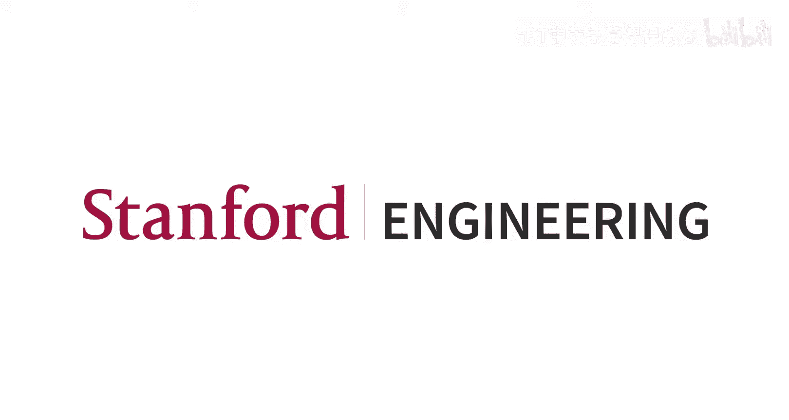
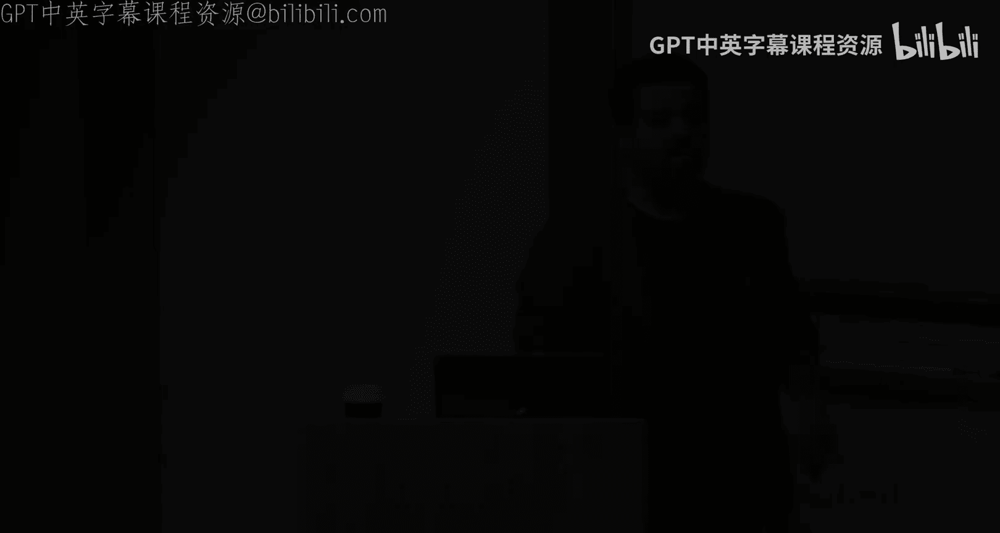
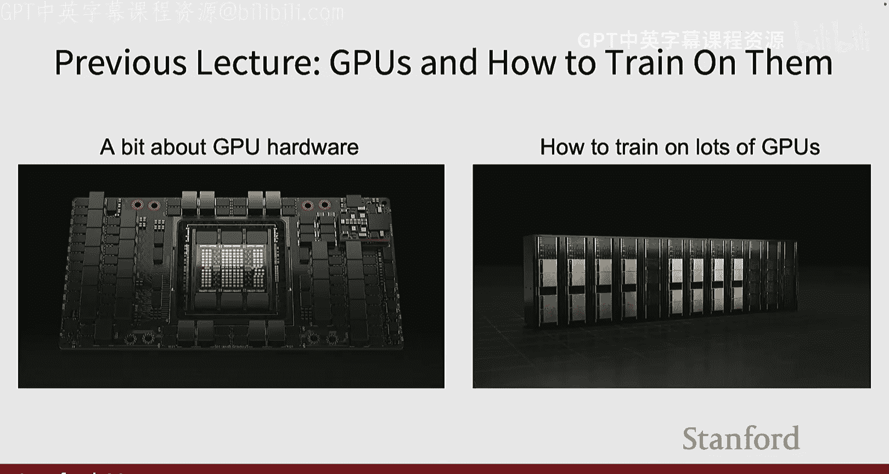
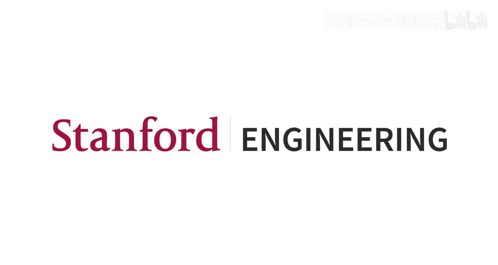

#  012：自监督学习

## 概述
在本节课中，我们将要学习自监督学习。这是一种无需大量人工标注数据即可训练神经网络的方法。我们将探讨如何通过设计“前置任务”来让模型从无标签数据中学习到有用的特征表示，并了解如何将这些特征应用于下游任务。

---

## 前置任务与自监督学习概念

上一节我们介绍了计算机视觉中的各种任务，如分类、检测和分割。这些任务通常需要大量带标签的数据。本节中，我们来看看如何在没有标签的情况下训练模型。

自监督学习的核心思想是：我们拥有一个没有标签的大型数据集（例如图像）。我们的假设是，我们可以通过定义一个**前置任务**来训练一个神经网络，使其学习到图像的良好特征。这个前置任务的目标函数不需要人工标注，其“标签”可以从数据本身自动生成。

训练完成后，我们可以使用这个训练好的**编码器**来提取特征，并将其用于一个**下游任务**（例如分类）。对于下游任务，我们只需要一个较小的带标签数据集，并在编码器提取的特征之上训练一个简单的分类器（如线性层）。

**核心概念公式化**：
设 `E` 为编码器，`D` 为用于前置任务的解码器/分类器，`x` 为输入数据，`y_pretext` 为自动生成的前置任务标签。
前置任务训练过程可表示为：`L_pretext = loss(D(E(x)), y_pretext)`
下游任务微调过程可表示为：`L_downstream = loss(Classifier(E(x)), y_true)`

---

## 前置任务示例

以下是几种常见的图像前置任务设计思路：

*   **图像旋转预测**：将图像旋转一个固定角度（如0°, 90°, 180°, 270°），让模型预测旋转角度。这迫使模型理解物体的正常朝向。
*   **拼图游戏**：将图像分割成网格并打乱 patches 的顺序，让模型预测正确的排列顺序。
*   **图像补全**：随机遮盖图像的一部分，让模型根据未遮盖的部分预测被遮盖的内容。
*   **图像着色**：将彩色图像转换为灰度图（仅亮度通道），让模型预测缺失的颜色通道。

---

## 具体前置任务详解

### 1. 旋转预测
这个任务假设模型只有具备对物体的视觉常识，才能正确判断其旋转角度。实现时，通常将旋转角度离散化为几个类别（如4类），从而将问题转化为分类任务。实验表明，用此方法预训练的模型，在下游分类任务上，其起点准确率远高于随机初始化，性能接近在有标签ImageNet上预训练的模型。

### 2. 拼图游戏
一种进阶形式是预测 patches 的正确排列，而非单个 patch 的位置。由于全排列数量巨大（9!），实践中会定义一个较小的、有代表性的排列子集（如64种）作为分类目标。

### 3. 图像补全（掩码自编码器）
这是一个基于重建的前置任务。其核心是随机遮盖图像中大部分区域（例如75%），然后让模型重建被遮盖的部分。**掩码自编码器** 是这类方法的代表。它使用不对称的编码器-解码器架构（通常基于Vision Transformer）：
*   **编码器**：仅处理未被遮盖的图像 patches，将其编码为特征。
*   **解码器**：接收编码器输出的特征以及代表被遮盖区域的**可学习掩码令牌**，重建出完整的图像。
损失函数仅针对被遮盖的区域计算均方误差。这种方法能学习到非常强大的特征表示，在下游任务中表现出色。

### 4. 图像着色
此任务利用LAB颜色空间中亮度与颜色分离的特性。给定亮度通道，预测颜色通道。一个扩展是“分脑”自编码，将输入分为两组通道，用两个网络相互预测对方。这种方法学到的特征可用于分类，其本身也能用于黑白图像上色、视频着色等应用。在视频着色中，通过参考帧对后续帧进行着色，模型还能隐式地学习到物体跟踪能力。

---

## 对比学习简介

上一节我们介绍了基于图像变换的前置任务。本节中，我们来看看另一种强大的自监督学习范式——对比学习。

对比学习的核心思想不是预测某种变换，而是学习一种特征表示空间，使得同一张图像的不同变换（**正样本**）在空间中距离很近，而不同图像的变换（**负样本**）在空间中距离很远。

**核心概念公式化（InfoNCE损失）**：
设 `f(x)` 为样本 `x` 的特征表示，`x+` 为正样本，`{x_i-}` 为负样本集合，`sim` 为相似度函数（如余弦相似度）。
InfoNCE损失函数定义为：
`L = -log[ exp(sim(f(x), f(x+)) / τ) / (exp(sim(f(x), f(x+)) / τ) + Σ_i exp(sim(f(x), f(x_i-)) / τ) ) ]`
其中 `τ` 是温度参数。最小化该损失函数等价于最大化正样本对的互信息下界。

---

## 对比学习框架

以下是两个重要的对比学习框架：

*   **SimCLR**：这是一个简洁的框架。它对批次中的每张图像生成两个随机增强视图，通过编码器和投影头得到特征表示，然后使用InfoNCE损失进行训练。正样本对是同一图像的两个视图，批次内所有其他图像的视图均作为负样本。SimCLR表明，大的批次大小和强的数据增强至关重要。
*   **MoCo**：为了克服大批次大小的内存限制，MoCo引入了**动量编码器**和**动态字典队列**。它维护一个包含大量负样本特征的队列，用于计算对比损失。查询编码器通过梯度更新，而键编码器通过查询编码器的动量平均来更新。这种方式解耦了批次大小与负样本数量，允许使用大量负样本。

---

## 总结
本节课中我们一起学习了自监督学习。我们首先了解了其核心概念：通过设计无需人工标签的前置任务，从无标签数据中预训练一个特征提取器（编码器）。然后，我们详细探讨了几种具体的前置任务，如图像旋转预测、拼图、图像补全和着色，并重点介绍了强大的掩码自编码器方法。最后，我们引入了对比学习范式，它通过拉近正样本、推开负样本的方式来学习特征表示，并简要介绍了SimCLR和MoCo这两个经典框架。这些方法使得我们能够利用海量无标签数据来训练模型，为下游任务提供强大的特征基础。