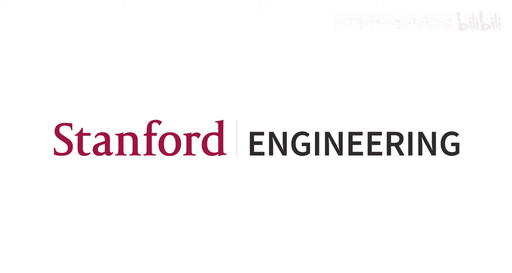
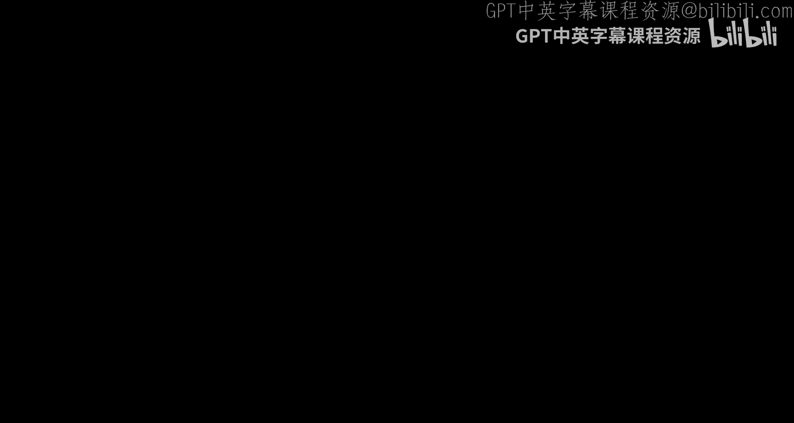
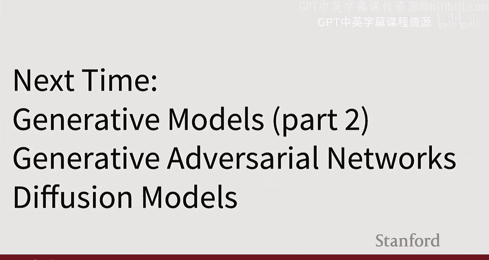
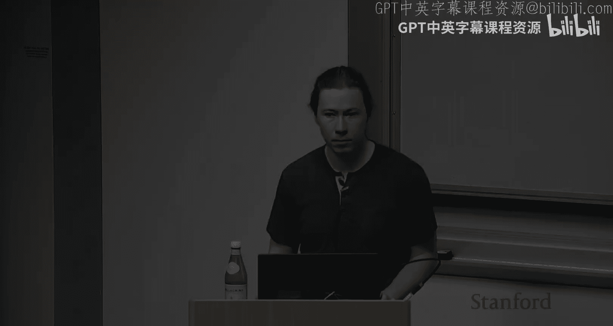
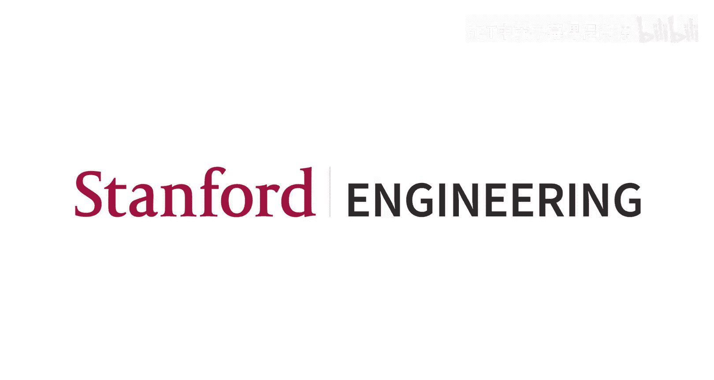

#  013：生成模型（第一部分）

## 概述

在本节课中，我们将学习生成模型的基本概念、分类以及两种重要的生成模型：自回归模型和变分自编码器。我们将从概率建模的角度出发，理解生成模型与判别模型的区别，并探讨如何利用最大似然估计等方法来训练这些模型。

---

## 从自监督学习到生成模型

上一节我们介绍了自监督学习，这是一种无需人工标注标签，直接从数据中学习结构的方法。其典型流程是：将大量无标签数据（如图像）输入编码器以提取特征表示，再通过解码器基于这些特征预测某些内容。自监督学习的核心在于设计一个“前置任务”，使得整个系统可以在没有人工标注的情况下进行训练。常见的任务包括图像旋转、图像块重排或图像修复等。

自监督学习通常分为两个阶段：首先，在所有可用的无标签数据上训练编码器和解码器以完成前置任务；然后，丢弃解码器，接入一个新的（可能很小的）全连接网络，并在少量有标签的下游任务上进行微调。这样做的目的是通过前置任务从海量数据中学习到关于数据（如图像）的通用结构知识，然后将这些知识迁移到我们真正关心但只有少量标注数据的任务上。

除了上述基于重构或几何扰动的前置任务，另一种非常成功的自监督学习范式是对比学习。其核心思想是：获取相似的数据对和不相似的数据对，并希望模型将相似对的特征拉近，将不相似对的特征推远。具体实现时，对每个输入图像应用两种随机变换（如裁剪、灰度化），得到两个增强样本。将所有增强样本通过特征提取器（如CNN或ViT）得到特征向量，然后计算一个巨大的相似度矩阵。我们希望来自同一原始图像的两个增强样本的特征相似度高，而来自不同原始图像的增强样本的特征相似度低。

SimCLR是成功应用此思想的代表性工作。但它的一个问题是需要相当大的批次大小才能良好收敛，因为如果负样本不够多，网络区分正负样本的任务就太简单了，无法提供足够强的学习信号。这促使了后续改进方法的出现。

例如，MoCo方法通过维护一个“负样本队列”来解决大批次问题。它使用两个编码器：一个通过梯度下降正常更新的编码器，和一个作为“动量编码器”的编码器。动量编码器的权重不是通过梯度更新，而是作为正常编码器权重的指数移动平均。这样，模型可以利用历史批次中的样本来构建负样本队列，而无需在每次迭代中都处理巨大的批次，从而降低了内存需求。

另一个重要工作是DINO及其升级版DINOv2。DINO也采用了类似MoCo的双编码器结构，但使用了不同的损失函数（如KL散度）。DINOv2的关键突破在于成功地将这种自监督学习方法扩展到了更大的数据集（约1.42亿张图像）上，从而学习到了非常强大的特征表示，这些特征在实践中被广泛用于下游任务的微调。

以上是关于自监督学习的补充。现在，让我们进入本节课的核心主题：生成模型。

---

## 生成模型简介 🎨

生成模型是深度学习领域中一个非常激动人心的方向。大约在十年前，生成模型的效果还很不理想，生成的样本往往是模糊、低分辨率的。但在过去几年里，随着计算力的提升、训练方法的稳定以及数据规模的扩大，生成模型取得了突破性进展，催生了像语言模型、图像生成模型、视频生成模型等广泛应用。

尽管应用效果发生了翻天覆地的变化，但生成模型的许多基本数学思想和建模方法在过去十年中并没有根本性的改变。进步主要来自于更强大的计算资源、更稳定的训练方案、更大的数据集以及分布式训练能力的提升。当然，也有一些重要的算法改进，我们将在下一讲讨论扩散模型时看到。

首先，为了明确术语，让我们回顾一下监督学习与无监督学习的区别。

### 监督学习 vs. 无监督学习

*   **监督学习**：这是我们本学期大部分时间都在学习的内容。在监督学习中，我们有一个由输入X和标签Y组成的数据集。目标是学习一个从X映射到Y的函数。例如：
    *   **图像分类**：X是图像，Y是类别标签。
    *   **图像描述**：X是图像，Y是描述文本。
    *   **目标检测**：X是图像，Y是边界框和类别标签的集合。
    *   **图像分割**：X是图像，Y是每个像素的标签。

*   **无监督学习**：在无监督学习中，我们只有数据X，没有标签Y。目标是直接从数据中发现某种结构或模式，而不是完成某个特定的预测任务。例如：
    *   **K均值聚类**：识别数据中的簇。
    *   **主成分分析**：发现数据的低维子空间或流形。
    *   **密度估计**：拟合数据的概率分布。

监督和无监督可以看作是对学习方法进行分类的一个维度。

### 判别模型 vs. 生成模型

另一个独立的分类维度是**判别模型**与**生成模型**，这两者都涉及概率建模。

*   **判别模型**：学习的是条件概率分布 **P(Y | X)**。即，给定输入数据X（如图像），模型输出所有可能标签Y的概率分布。
    *   **关键点**：对于**每一个**输入X，模型都独立地分配一个概率分布给所有可能的Y。不同X之间的概率质量没有竞争关系，竞争只发生在同一个X对应的不同Y之间。
    *   **局限性**：模型无法拒绝不合理的输入。例如，对于一个猫/狗分类器，输入一张抽象画，它仍然必须在“猫”和“狗”之间分配概率。

*   **生成模型**：学习的是数据本身的概率分布 **P(X)**。即，模型需要为所有可能存在的图像X分配一个概率值。
    *   **关键点**：现在，**所有可能的图像**都在竞争有限的概率质量。模型必须深入理解现实世界的结构，才能判断哪些图像更可能（概率高），哪些图像不可能（概率低）。
    *   **优势**：模型有能力拒绝不合理的输入，只需为其分配极低或零概率即可。

*   **条件生成模型**：学习的是条件概率分布 **P(X | Y)**。即，给定某个条件信号Y（如文本描述），模型输出所有可能图像X的概率分布。
    *   **关键点**：对于**每一个**条件Y，都引发了一场在所有可能图像X之间的竞争。这使得模型能够根据丰富的条件（如一段文字）生成多样化的、符合描述的图像。
    *   **实用性**：条件生成模型是最有用、最令人兴奋的，它使我们能够通过控制输入Y来生成想要的图像。

这三种模型通过**贝叶斯规则**相互关联。理论上，如果拥有其中两种模型（例如判别模型P(Y|X)和生成模型P(X)），可以推导出第三种（如条件生成模型P(X|Y)）。但在实践中，条件生成模型通常是从头开始训练的。

### 为什么需要生成模型？

当任务输出存在**模糊性**或**不确定性**时，生成模型就派上了用场。例如：
*   **语言建模**：输入“写一首关于生成模型的押韵短诗”，存在无数种可能的诗。
*   **文生图**：输入“一个人在白板前讲授生成模型课程”，存在无数种符合描述的图像。
*   **图生视频**：给定一张图像，预测接下来会发生什么，存在多种合理的未来场景。

生成模型的目标就是建模这种在给定输入条件下，所有可能输出的**整个概率分布**。

---

## 生成模型的分类 🌳

生成模型领域有很多不同的方法，我们可以用一个分类树来概括：

1.  **显式密度模型**：模型能够直接计算（或近似计算）概率密度值 **P(X)**。
    *   **精确密度模型**：可以精确计算密度值。例如：**自回归模型**。
    *   **近似密度模型**：可以计算一个近似的密度值或密度下界。例如：**变分自编码器**。

2.  **隐式密度模型**：模型无法直接计算密度值 **P(X)**，但能够以某种方式从该分布中采样。
    *   **直接采样方法**：通过单次网络前向传播即可生成样本。例如：**生成对抗网络**。
    *   **间接采样方法**：需要通过迭代过程才能生成样本。例如：**扩散模型**。

**注意**：在文献和本讲后续内容中，为了简化公式，我们常常省略条件生成模型中的条件Y，写作P(X)。但请始终记住，在大多数有意义的应用中，我们实际指的是**P(X | Y)**。

本节课我们将重点介绍分类树的左半部分：**自回归模型**和**变分自编码器**。下一讲我们将介绍右半部分：**生成对抗网络**和**扩散模型**。

---

## 自回归模型 📝

### 最大似然估计

在深入自回归模型之前，我们先了解一个训练概率模型的通用框架：**最大似然估计**。

假设我们有一个由神经网络参数化的概率密度函数 **P(X; W)**，其中W是网络权重。给定一个包含N个独立同分布样本的数据集 {X¹, X², ..., Xᴺ}，最大似然估计的目标是找到一组权重W，使得该数据集在这些权重下的**似然**最大化。

由于概率的连乘可能导致数值下溢，我们通常转而最大化**对数似然**，因为对数函数是单调的，且能将连乘转化为连加：

**最大化 log P(X¹, X², ..., Xᴺ; W) = Σᵢ log P(Xⁱ; W)**

这为我们提供了一个可以用于训练神经网络的具体损失函数。

### 自回归建模

直接对整个高维数据X建模非常困难。自回归模型的核心思想是：将数据X**顺序地**分解为一系列子部分 (x₁, x₂, ..., xₜ)。然后利用概率的链式法则：

**P(X) = P(x₁) * P(x₂ | x₁) * P(x₃ | x₁, x₂) * ... * P(xₜ | x₁, x₂, ..., xₜ₋₁)**

这个分解本身没有做任何假设，它对任何联合分布都成立。现在，问题转化为：顺序地预测序列中下一个部分的概率分布，条件是其之前的所有部分。

这听起来很熟悉吗？是的，**循环神经网络**和**Transformer**（特别是掩码Transformer）天然适合这种任务。
*   **RNN**：通过隐藏状态传递序列的历史信息，在每个时间步预测下一个元素。
*   **Transformer**：通过恰当的注意力掩码，使每个输出位置只能关注到它之前的序列部分，从而实现自回归预测。

### 应用于图像

文本数据天然是离散的一维序列，非常适合自回归模型。但图像是二维的，且像素值通常是连续的（或量化为离散的8位整数）。如何应用自回归模型呢？

一种朴素的方法是：将图像**光栅化**成一个长序列。例如，对于一个1024x1024的RGB图像，我们可以将其展开为一个包含约314万个子像素值（1024 * 1024 * 3）的序列，每个子像素值是0-255的整数。然后，我们可以像处理文本一样，用RNN或Transformer对这个离散值序列进行自回归建模。

**问题**：序列过长，导致计算成本极高，难以扩展到高分辨率图像。

**提示**：近年来的一些新方法通过将图像编码成更紧凑的离散“token”序列，而非原始像素，使自回归模型在图像生成领域重新焕发生机。我们将在下一讲中提及。

---

## 变分自编码器 🔄

上一节我们介绍了自回归模型，它是一种可以精确计算数据密度的生成模型。本节我们来看看变分自编码器，它属于“显式但近似”的密度模型。它放弃了计算精确密度的能力，但换来了一个关键优势：学习到一个结构化的、易于采样的**隐变量空间**。

### 从普通自编码器说起

普通自编码器是一种无监督学习方法，用于从数据X中学习特征表示Z，而无需标签。它包含一个编码器（将X映射到Z）和一个解码器（将Z映射回X）。训练目标是让重建输出尽可能接近原始输入，即最小化重建误差。

关键在于，我们通常对中间表示Z施加一个**瓶颈**，使其维度远小于输入X。这迫使网络在压缩和重建的过程中，学习到数据中重要的、非平凡的结构信息。

训练完成后，我们可以丢弃解码器，将编码器提取的特征Z用于下游任务（如分类器的初始化）。但是，如果我们想**生成**新数据呢？理想情况是：我们能从隐空间Z的分布中采样，然后将采样的Z通过解码器得到新样本X。问题在于，我们不知道Z应该服从什么样的分布，也不知道如何从中采样。

### 变分自编码器的核心思想

变分自编码器为普通自编码器引入了**概率框架**。它假设：
1.  每个观测数据X都是由某个不可见的**隐变量Z**生成的。
2.  隐变量Z服从一个我们预先设定的简单**先验分布**，通常是标准正态分布 **N(0, I)**。

VAE的目标是同时学习：
*  一个**编码器（推断网络）**：近似后验分布 **Q(Z | X)**。给定数据X，它输出隐变量Z的概率分布（通常是高斯分布，输出均值和方差）。
*  一个**解码器（生成网络）**：似然分布 **P(X | Z)**。给定隐变量Z，它输出数据X的概率分布。

这样，训练完成后，我们可以轻松地从先验分布N(0, I)中采样一个Z，然后通过解码器生成一个新的X。

### 训练目标：证据下界

我们最终的目标仍然是最大化数据的对数似然 **log P(X)**。经过一系列数学推导（涉及贝叶斯规则、引入编码器Q、利用KL散度的性质），我们可以得到**证据下界**：

**log P(X) ≥ E[log P(X | Z)] - KL( Q(Z | X) || P(Z) )**

其中：
*   **E[log P(X | Z)]** 是**重建项**。它鼓励解码器能够从编码器产生的Z中很好地重建出原始X。
*   **KL( Q(Z | X) || P(Z) )** 是**正则项**。它鼓励编码器输出的分布Q(Z|X)接近我们预设的先验分布P(Z)（标准正态分布）。

ELBO是真实对数似然的一个**下界**。通过最大化ELBO，我们间接地最大化了数据的似然。

### 训练过程与特性

1.  **编码器**：输入X，输出高斯分布的参数（均值μ和方差σ²）。
2.  **采样**：使用**重参数化技巧**从N(μ, σ²)中采样一个Z。这使得采样操作可导，允许梯度反向传播。
3.  **解码器**：输入Z，输出重建的X（通常输出高斯分布的均值，方差固定）。
4.  **损失计算**：计算重建损失（如均方误差）和KL散度损失，两者加权求和。

VAE的训练存在一种有趣的**对抗**：重建项希望每个X都有独特、确定的Z以便完美重建；而KL正则项希望所有Z的分布都接近标准正态。训练过程就是在这两者之间寻找平衡。

训练完成后，VAE的隐空间具有很好的性质：
*   **连续性**：隐空间是连续的，轻微改变Z，生成的X也会平滑变化。
*   **解耦性**：由于先验是各向同性的高斯分布，隐变量的不同维度往往对应数据中某些独立、可解释的变化因素（如笔画的粗细、数字的倾斜度）。

---

## 总结

本节课我们一起深入探讨了生成模型的世界。

*   我们首先区分了**监督学习**与**无监督学习**，以及**判别模型**与**生成模型**的核心区别，理解了条件生成模型 **P(X | Y)** 的强大之处在于它能建模输出的不确定性。
*   我们建立了一个生成模型的**分类框架**，将其分为显式密度模型和隐式密度模型两大类。
*   我们重点学习了两种显式密度模型：
    1.  **自回归模型**：通过链式法则将联合分布分解为条件分布的乘积，天然适合RNN和Transformer，是语言模型的基石，也可通过特定方式应用于图像。
    2.  **变分自编码器**：通过引入隐变量和变分推断，学习一个结构化的、接近高斯先验的隐空间。其训练目标是最大化证据下界，在数据重建和隐空间正则化之间取得平衡，从而能够从隐空间中采样以生成新数据。

下一节课，我们将继续探索生成模型家族的另一半：**生成对抗网络**和**扩散模型**，看看它们如何以不同的方式实现强大的生成能力。