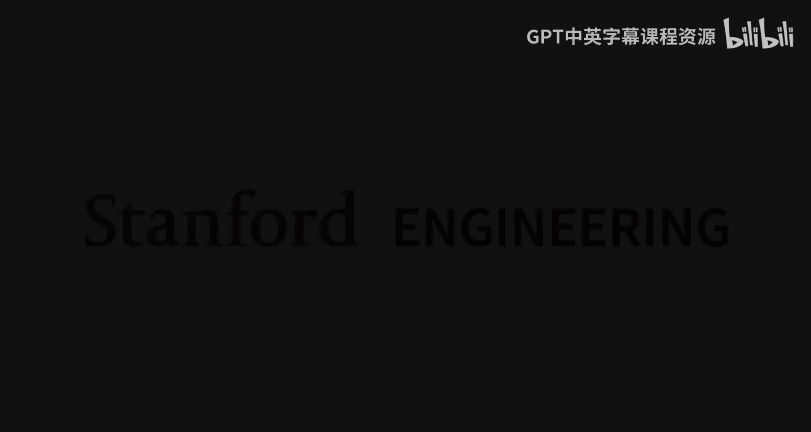
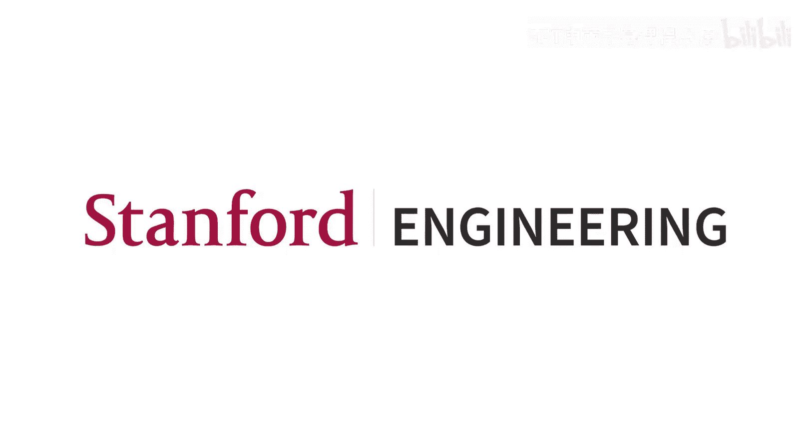

#  014：生成模型（第二部分）




## 概述 📖

在本节课中，我们将继续探讨生成模型。我们将深入介绍两种重要的生成模型：**生成对抗网络** 和 **扩散模型**。我们将了解它们的工作原理、训练方式、优缺点，以及它们如何共同构成了现代生成式AI的核心技术栈。

---

## 生成对抗网络（GANs）🎭

上一节我们介绍了基于显式密度的生成模型，如自回归模型和变分自编码器。本节中，我们来看看另一大类模型：**隐式密度模型**。这类模型不直接输出数据的概率密度值 `P(x)`，但能够从学习到的分布中**采样**生成新数据。

### GANs的基本思想

生成对抗网络的核心思想是让两个神经网络——**生成器** 和 **判别器**——相互对抗、共同进化。

*   **生成器** 的目标是生成足以“以假乱真”的数据。
*   **判别器** 的目标是准确区分真实数据和生成器产生的“假”数据。

通过这种对抗训练，生成器被迫不断改进其生成能力，最终生成与真实数据分布非常接近的样本。

### GANs的数学框架

GAN的训练过程被形式化为一个**极小极大博弈**。其目标函数 `V(G, D)` 如下：

```
V(G, D) = E_{x~P_data}[log D(x)] + E_{z~P_z}[log(1 - D(G(z)))]
```

其中：
*   `G` 是生成器，输入噪声 `z`，输出生成数据 `G(z)`。
*   `D` 是判别器，输入数据 `x`，输出该数据为“真实”的概率 `D(x)`。
*   `P_data` 是真实数据分布。
*   `P_z` 是噪声的先验分布（通常是标准高斯分布）。

以下是训练过程中两个网络的视角：

*   **判别器的目标**：**最大化** `V(G, D)`。它希望对于真实数据 `x`，`D(x)` 接近1；对于生成数据 `G(z)`，`D(G(z))` 接近0。
*   **生成器的目标**：**最小化** `V(G, D)`。它希望生成的数据 `G(z)` 能骗过判别器，即让 `D(G(z))` 接近1。

### GANs的训练过程

训练GANs采用交替优化的策略：

1.  **固定生成器G，更新判别器D**：通过梯度**上升**来最大化 `V(G, D)`，使D更好地区分真假。
2.  **固定判别器D，更新生成器G**：通过梯度**下降**来最小化 `V(G, D)`（或等价地最大化 `log D(G(z))`），使G生成更逼真的数据。

一个重要的实践技巧是，在训练初期，使用 `-log D(G(z))` 作为生成器的损失函数，而不是原始的 `log(1 - D(G(z)))`，这能提供更有用的梯度信号。

### GANs的优缺点

**优点**：
*   概念直观，公式相对简单。
*   在精心调优后，能生成**质量极高、细节清晰**的图像（如StyleGAN系列）。
*   其隐空间通常具有**平滑的插值特性**，意味着在隐空间中移动能产生语义上连续变化的图像。

**缺点**：
*   **训练极其不稳定**。目标函数 `V(G, D)` 的值本身并不能反映模型好坏，难以监控训练进程。
*   容易出现**模式崩溃**，即生成器只学会生成有限的几种样本，缺乏多样性。
*   生成器和判别器的能力需要精细平衡，否则训练容易失败。

尽管挑战重重，GANs在2016至2021年间曾是生成模型领域的主导方法，催生了海量的研究和应用。

---

## 扩散模型 🌪️

近年来，**扩散模型** 在图像和视频生成质量上取得了突破性进展，逐渐成为主流的生成模型范式。

### 扩散模型的直观理解

扩散模型的核心思想是通过一个**逐步去噪**的过程来生成数据。

1.  **前向过程（加噪）**：从一张干净图片开始，逐步添加高斯噪声，直到它变成纯随机噪声。这个过程将数据分布 `P_data` 逐渐转化为一个简单的噪声分布 `P_z`（如标准高斯分布）。
2.  **反向过程（去噪）**：训练一个神经网络，学习如何从带噪数据中预测并移除一小部分噪声。
3.  **生成过程（采样）**：从纯噪声开始，多次调用这个训练好的神经网络进行迭代去噪，最终得到一张干净的、来自数据分布的图片。

### 整流流模型：一种简洁的扩散模型

在众多扩散模型变体中，**整流流模型** 提供了非常直观和简洁的实现方式。其训练目标可以几何化地理解：

1.  从数据分布中采样一个真实样本 `x`，从噪声分布中采样一个噪声样本 `z`。
2.  在 `x` 和 `z` 之间连一条直线，定义速度向量 `v = z - x`。
3.  在这条线上随机选取一个点 `x_t`（由噪声水平 `t` 控制，`t=0` 时为 `x`，`t=1` 时为 `z`）。
4.  训练一个神经网络 `f_θ`，输入 `x_t` 和 `t`，目标是预测出真实的速度向量 `v`。

**训练代码** 可以非常简洁：
```python
# 训练循环（伪代码）
for x in data_loader:
    z = sample_noise_like(x)          # 采样噪声
    t = uniform(0, 1)                 # 采样噪声水平
    x_t = (1-t)*x + t*z               # 线性插值得到带噪样本
    v_true = z - x                    # 真实速度向量
    v_pred = model(x_t, t)            # 模型预测的速度向量
    loss = MSE(v_pred, v_true)        # 均方误差损失
    loss.backward()
    optimizer.step()
```

**采样（生成）过程** 则是一个迭代的去噪过程：
1.  从噪声分布采样一个初始样本 `x_1`（纯噪声）。
2.  从 `t=1` 到 `t=0` 循环：
    *   将当前 `x_t` 和 `t` 输入模型，得到预测速度 `v_pred`。
    *   更新 `x_{t-Δt} = x_t + v_pred * Δt`（沿预测方向走一小步）。
3.  循环结束后，`x_0` 即为生成的干净样本。

### 条件生成与无分类器引导

我们通常希望生成模型是**可控的**，即能根据文本描述等条件生成特定内容。这可以通过**条件扩散模型**实现：在训练和采样时，将条件信息（如文本编码）作为额外的输入提供给模型。

为了增强模型对条件信号的遵循程度，一个关键技巧是**无分类器引导**：
*   **训练时**：随机以一定概率（如50%）将条件信息置为空（`null`），迫使模型同时学习**有条件**和**无条件**的生成。
*   **采样时**：分别计算有条件预测 `v_y` 和无条件预测 `v_null`，然后按以下公式进行引导：
    ```
    v_cfg = v_null + w * (v_y - v_null)
    ```
    其中 `w` 是引导尺度。`w` 越大，生成结果对条件 `y` 的遵循程度越高，但多样性可能降低。

### 潜在扩散模型：现代生成管道

直接在原始高分辨率像素空间训练扩散模型计算成本极高。因此，现代主流方法是**潜在扩散模型**：
1.  **第一阶段**：训练一个**变分自编码器**，将图像压缩到一个低维的**潜在空间**。这个VAE的编解码器需要训练得非常出色，以保证重建质量。
2.  **第二阶段**：在VAE编码器得到的**潜在空间**上，而非像素空间，训练扩散模型。
3.  **生成时**：用扩散模型在潜在空间中生成样本，再用VAE的解码器映射回像素空间。

这种架构结合了VAE、GAN（常用于提升VAE解码器质量）和扩散模型的优势，是当前文生图、文生视频等SOTA系统的基础。

### 扩散模型的数学视角（补充）

扩散模型有多个等价的数学解释，这增加了其深度但也带来了复杂性：
*   **潜变量模型视角**：类似于VAE，将加噪过程视为潜变量，通过优化变分下界进行训练。
*   **得分匹配视角**：模型在学习数据分布（在不同噪声水平下）的**得分函数**，即概率密度对数的梯度。
*   **随机微分方程视角**：将扩散和生成过程视为一个SDE的正向和反向过程，神经网络在学习其漂移项。

---

## 总结 🎯

本节课中我们一起学习了两种强大的生成模型：

1.  **生成对抗网络**：通过生成器和判别器的对抗博弈进行训练，能产生高质量样本，但训练不稳定。
2.  **扩散模型**：通过学习和迭代逆转一个逐步加噪的过程来生成数据。我们重点介绍了直观的**整流流模型**，并了解了其训练和采样过程。现代**潜在扩散模型**通过结合VAE、GAN和扩散模型，构成了当前文生图、文生视频等应用的基石。



生成模型是一个快速发展的领域，这些基础模型以各种方式组合，不断推动着人工智能生成内容能力的边界。