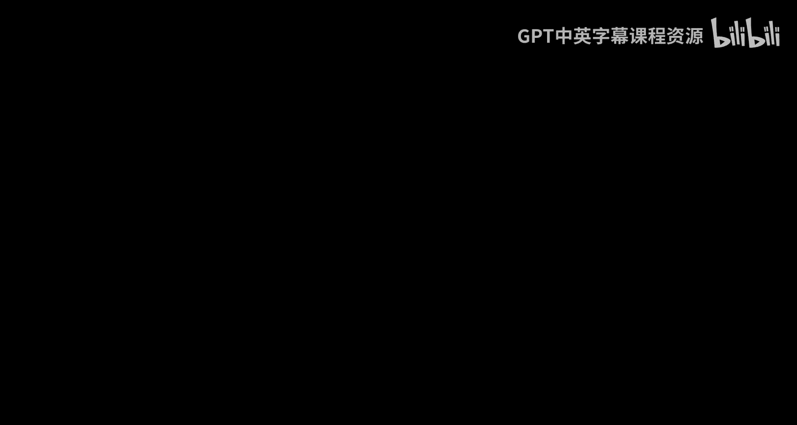
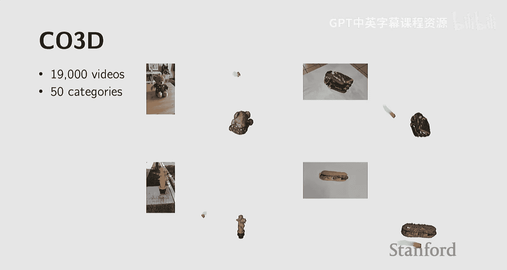
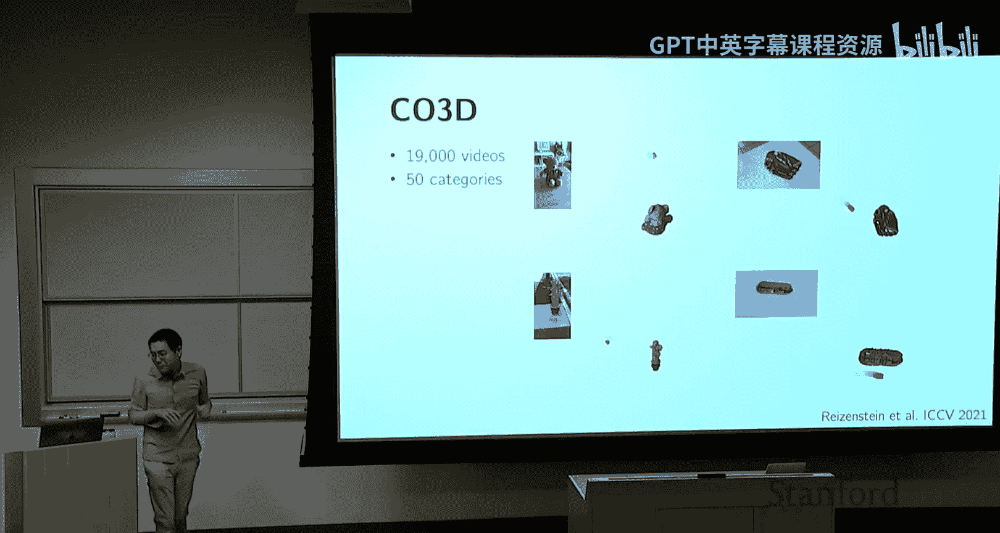
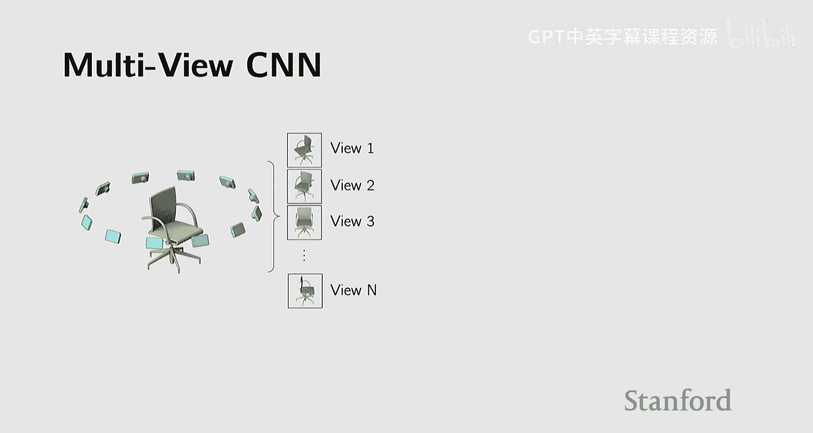
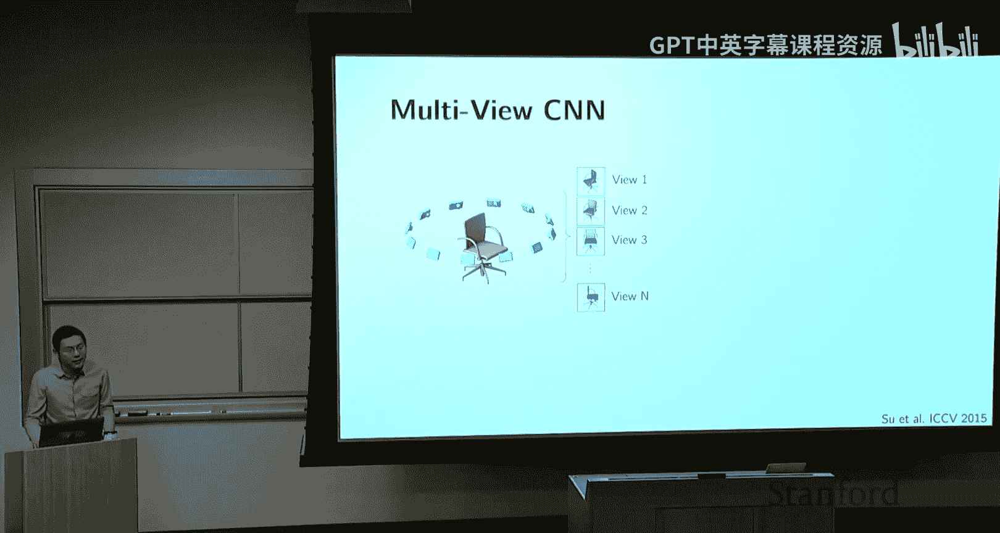
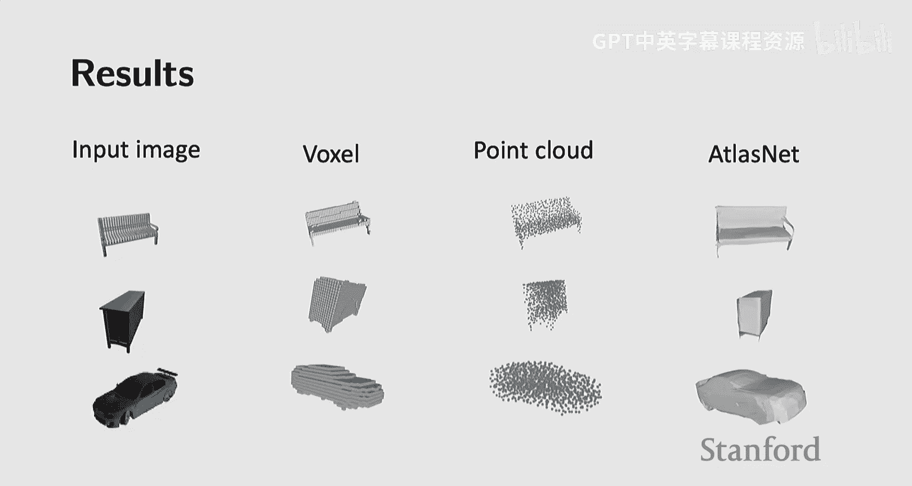
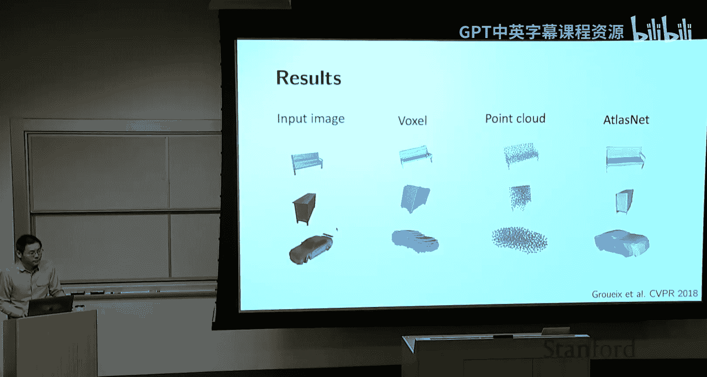
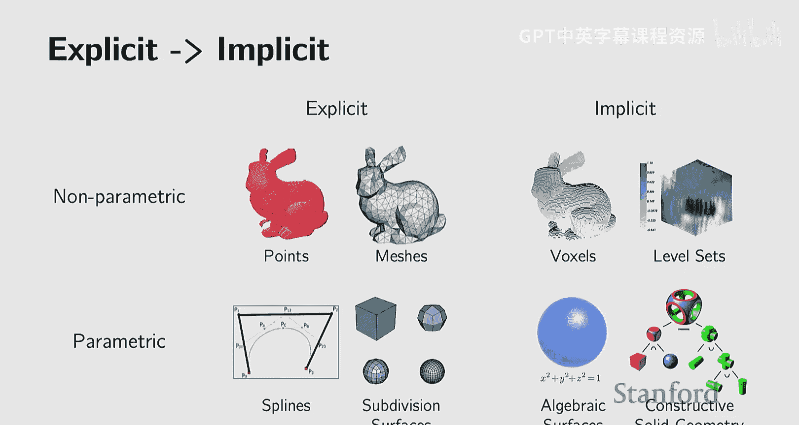
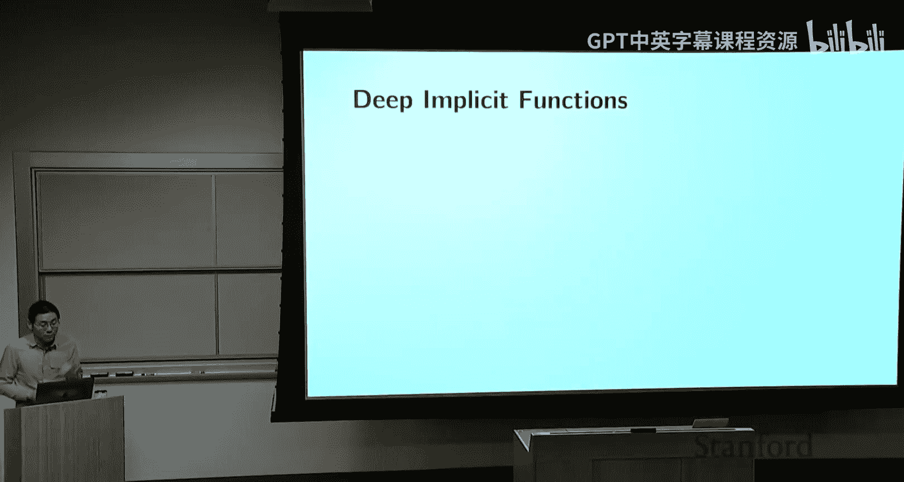
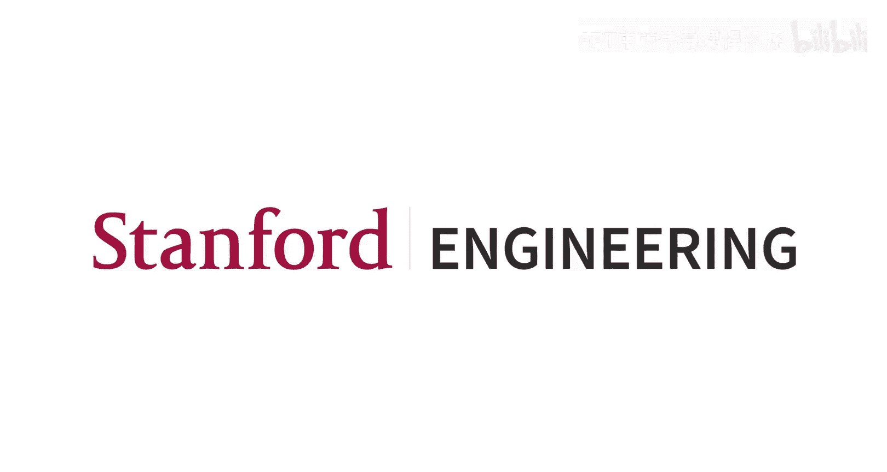

#  015： 3D视觉

## 概述

在本节课中，我们将要学习3D视觉的基础知识。我们将从3D物体的不同表示方法开始，探讨它们各自的优缺点，然后了解深度学习如何与这些表示方法结合，以解决3D生成、重建和理解等任务。课程内容将涵盖从显式表示（如点云、网格）到隐式表示（如符号距离函数、神经辐射场）的演变，并介绍相关的数据集和应用。

---

## 3D物体表示方法

在2D图像中，我们使用像素矩阵来表示物体。然而，在3D世界中，物体的表示方法更加多样和复杂。3D物体不仅包含几何形状，还可能包含纹理、材质等信息。我们首先关注几何形状的表示。

3D物体的几何表示方法大致可以分为两类：**显式表示**和**隐式表示**。

*   **显式表示**：直接描述物体表面的点或面。例如点云、多边形网格。
*   **隐式表示**：通过一个函数来描述物体，该函数定义了空间中哪些点属于物体表面、内部或外部。例如水平集、符号距离函数。

每种表示方法都有其适用的任务和优缺点，特别是在与深度学习方法结合时。

---

### 显式表示

上一节我们介绍了3D表示的两大类别，本节中我们来看看具体的显式表示方法。

显式表示直接给出了物体表面的位置信息。以下是几种常见的显式表示：

#### 点云

点云是最简单的3D表示形式，它仅由一组3D空间中的点构成，不包含点与点之间的连接信息。

*   **数据结构**：一个 `3 x N` 的矩阵，其中每一列代表一个点的 `(x, y, z)` 坐标。
*   **附加信息**：有时会包含每个点的**表面法向量**，用于指示该点所在表面的朝向，这对渲染光照效果非常重要。
*   **优点**：
    *   **获取简单**：是许多3D传感器（如深度相机、激光雷达）的直接输出格式。
    *   **灵活通用**：可以表示任意拓扑结构的物体。
*   **缺点**：
    *   **无连接信息**：无法直接判断物体的拓扑结构（例如，一个点云无法区分一个环面和一个球体）。
    *   **采样不均**：如果点分布不均匀，某些区域细节会丢失。
    *   **操作困难**：难以直接进行平滑、简化或细分等操作。

#### 多边形网格

为了克服点云缺乏连接信息的缺点，多边形网格在点的基础上，增加了点与点如何连接以构成面的信息。

*   **数据结构**：包含**顶点**（3D点）和**面**（由顶点索引构成的多边形，通常是三角形）。
*   **应用广泛**：是计算机图形学、游戏引擎中最主流的3D表示方法。
*   **优点**：
    *   **信息完整**：明确表达了物体的表面和拓扑结构。
    *   **支持丰富操作**：存在成熟的算法支持网格的**细分**（增加细节）、**简化**（减少面数）和**正则化**（使网格更规整）。
*   **挑战**：网格结构不规则（面的大小、顶点连接数可变），早期难以与需要固定尺寸输入的卷积神经网络结合。

#### 参数化表示

对于一些具有规则结构的物体（如椅子、桌子上的直线），可以使用数学函数来精确描述。

*   **核心思想**：利用函数将低维参数空间映射到3D空间中的物体表面。
*   **示例**：
    *   **2D圆**：可以用参数方程表示：`x = cos(t)`, `y = sin(t)`，其中 `t` 是角度参数。
    *   **3D球体**：可以用两个参数 `(u, v)` 表示：`x = sin(u)cos(v)`, `y = sin(u)sin(v)`, `z = cos(u)`。
*   **高级形式**：贝塞尔曲线/曲面，通过少数控制点来定义平滑的曲线和曲面。
*   **优点**：表示紧凑，易于进行数学操作和插值。
*   **缺点**：难以描述任意复杂、不规则的形状。

---

### 显式表示的优缺点

综合来看，显式表示有其明显的优势和不足。

*   **优点**：**易于采样**。给定一个参数化表示或一个密集网格，我们可以轻松地生成物体表面上任意多的点。
*   **缺点**：**难以进行内外测试**。对于一个给定的3D空间查询点，判断它位于物体内部还是外部通常比较困难。这对于一些需要空间查询的任务（如某些新型渲染方法）是个障碍。

---

### 隐式表示

由于显式表示在空间查询上的局限性，人们发展了隐式表示方法。

隐式表示的核心思想是，用一个函数 `F(x, y, z)` 来定义物体。所有位于物体表面的点满足 `F(x, y, z) = 0`；函数值为负的点在物体内部；函数值为正的点在物体外部。

*   **经典示例**：单位球体可以用函数 `F(x, y, z) = x² + y² + z² - 1` 表示。表面点满足 `F=0`，内部点 `F<0`，外部点 `F>0`。
*   **优点**：
    *   **易于空间查询**：判断点是否在物体内部变得非常简单，只需计算函数值。
    *   **易于组合**：通过逻辑运算（并、交、差）或算术运算，可以轻松地将多个简单隐式函数组合成复杂形状。这在计算机辅助设计中广泛应用。
    *   **支持平滑混合**：使用有符号距离函数，可以通过加法等操作实现形状间的平滑过渡。
*   **缺点**：**难以采样**。从 `F(x, y, z)=0` 这个方程中直接解出表面上的点（即采样）通常很困难。

---

### 从隐式函数到体素

虽然隐式函数表达能力强，但对于复杂形状，其函数可能没有解析式，且每次查询都需计算。一个实用的折中方案是**预计算**。

*   **方法**：在3D空间中定义一个密集的网格，预先计算每个网格点处的隐式函数值（例如，有符号距离）。
*   **存储**：将这些值存储在一个3D矩阵中。
*   **二值化**：如果只关心物体内部/外部，可以将距离值二值化（例如，内部为1，外部为0）。这样得到的3D二值矩阵就是**体素**表示。
*   **特点**：体素可以看作是3D像素，它本质上是隐式表示的一种离散化、非参数化的形式。

---

## 3D视觉的数据集

要应用深度学习，高质量、大规模的数据集至关重要。与ImageNet推动2D视觉类似，3D领域也有几个关键数据集：

*   **Princeton Shape Benchmark**：早期数据集，约1800个模型，180个类别。
*   **ShapeNet**：一个大规模数据集，核心子集包含约5万个模型，55个类别（如椅子、汽车），推动了3D深度学习的早期发展。
*   **Objaverse**：更近期的超大规模数据集，包含数百万个带纹理的3D资产。
*   **真实物体扫描数据集**：例如CO3D，通过众包方式收集真实物体的多视角视频，用于3D重建。
*   **场景级数据集**：如ScanNet，包含真实室内场景的3D扫描和标注。
*   **部件级数据集**：如PartNet，标注了物体的部件层次结构和运动属性。

尽管3D数据集在不断增长，但其规模与互联网上的2D图像/视频数据相比仍有巨大差距，这是3D视觉面临的一个挑战。

---

## 深度学习与3D表示的结合

有了对3D表示和数据集的了解，我们现在来看看深度学习如何与它们结合，解决各种任务，如生成、识别、重建等。

### 早期方法：基于2D渲染

在3D深度学习初期，一个直接的想法是利用强大的2D图像模型。

*   **思路**：将3D物体从多个视角渲染成2D图像，然后使用标准的2D卷积神经网络处理这些图像，最后融合多视角信息进行分类或识别。
*   **优点**：直接利用了在ImageNet等大型2D数据集上预训练的、性能优异的模型。
*   **缺点**：不是原生的3D方法，且渲染质量受原始3D数据影响。

### 体素方法：3D卷积神经网络

最直接的3D深度学习方法是将2D卷积扩展到3D，处理体素数据。

*   **思路**：将二值体素网格作为输入，使用3D卷积核进行特征提取。
*   **优点**：概念简单，是2D CNN的自然延伸。可用于分类和生成（如3D-GAN）。
*   **缺点**：计算和内存消耗大（`O(n³)`），且分辨率受限，导致模型表面粗糙。

#### 改进：八叉树

为了提升体素方法的效率，八叉树被引入。

*   **思路**：自适应地细分3D空间。在物体表面附近使用高分辨率体素，在空旷区域或物体内部使用低分辨率体素。
*   **优点**：在相同内存下，能表示比均匀体素更高分辨率的细节。

### 点云方法：PointNet

为了处理更常见的点云数据，斯坦福团队提出了PointNet。

*   **核心挑战**：点云是无序且点数可变的集合。
*   **解决方案**：
    1.  使用共享的多层感知机独立处理每个点，提取点特征。
    2.  使用一个**对称聚合函数**（如 `max` 或 `sum`）将所有点的特征聚合为一个全局特征。这个操作保证了排列不变性。
    3.  基于全局特征进行分类或其他任务。
*   **损失函数**：对于生成任务，需要比较两个点云。常用**倒角距离**（Chamfer Distance）或**推土机距离**（Earth Mover‘s Distance）。

### 参数化表面方法：AtlasNet

为了生成光滑的曲面，AtlasNet等方法用神经网络学习参数化映射。

*   **思路**：训练多个小型神经网络，每个网络将一个2D正方形参数域（如 `(u, v)`）变形并映射到3D物体表面的一块“碎片”上。所有碎片拼接成完整的物体。
*   **优点**：可以生成连续、光滑的网格表面。

### 隐式函数方法：DeepSDF等

人们意识到，深度神经网络本身就是强大的函数逼近器，非常适合用来表示隐式函数。

*   **思路**：训练一个神经网络 `f(p)`，输入是一个3D坐标点 `p=(x, y, z)`，输出是该点的有符号距离值（SDF）或占用概率（0/1）。`f(p)=0` 的等值面就是物体表面。
*   **优点**：
    *   **表示紧凑**：一个网络可以表示一个复杂形状。
    *   **无限分辨率**：可以查询任意位置，不受离散网格限制。
    *   **易于组合**：网络可以编码形状先验，用于从图像或代码生成3D形状。

### 神经辐射场：NeRF

NeRF将隐式表示推向了新的高度，它不仅建模几何，还建模外观。

*   **核心**：用一个神经网络表示一个3D场景。输入是一个3D点 `p` 和观察方向 `d`，输出是该点的**颜色** `c=(r, g, b)` 和**体密度** `σ`。
*   **可微分渲染**：通过经典的体渲染方程，将沿着一条射线的所有点的颜色和密度积分，合成该射线对应的2D像素颜色。这个过程是可微分的。
*   **训练**：只需输入多视角的2D图像及其相机参数，通过最小化渲染图像与真实图像的差异，即可优化神经辐射场。
*   **优点**：能够重建出具有复杂光照和细节的高质量3D场景。
*   **缺点**：渲染速度慢，需要沿着每条射线密集采样并查询网络。

### 高效渲染方法：3D高斯泼溅

为了加速NeRF的渲染，3D高斯泼溅提出了一种混合表示。

*   **思路**：用一组3D高斯椭球（具有位置、尺度、旋转、颜色、不透明度属性）来显式地表示场景。渲染时，只需将这些高斯投影到2D并进行混合。
*   **优点**：渲染速度极快（实时帧率），质量与NeRF相当。
*   **本质**：可以看作是一种具有空间范围的、可高效渲染的“智能点云”。

---

## 超越几何：结构与关系

物体的3D表示不仅包含几何细节，还包含高层次的结构信息，如对称性、部件层次、物体间关系等。这也是一个重要的研究方向。

*   **基于图网络的方法**：将物体部件表示为图的节点，部件间关系表示为边，使用图神经网络进行学习和生成。
*   **程序化生成**：用程序（如循环、条件语句）来描述具有重复和规则结构的物体。最近，研究者开始探索利用大语言模型来生成此类程序，再结合神经隐式函数刻画细节，实现可控的3D内容生成。

---

## 总结

本节课我们一起学习了3D视觉的基础。我们从3D物体的不同表示方法（显式 vs. 隐式）出发，探讨了点云、网格、体素、参数化表面、隐式函数等各自的特点。随后，我们回顾了3D领域的重要数据集，并深入讲解了深度学习如何与这些表示方法结合：从早期的多视角渲染和3D卷积，到直接处理点云的PointNet，再到用神经网络表示光滑曲面的AtlasNet，以及革命性的、联合建模几何与外观的隐式表示方法——神经辐射场及其高效变体3D高斯泼溅。最后，我们简要提到了对物体结构和关系进行建模的高级表示方法。理解这些表示方法的演进和权衡，是掌握现代3D视觉与图形学算法的关键。