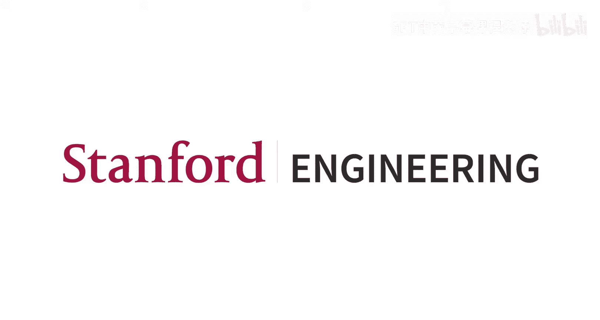
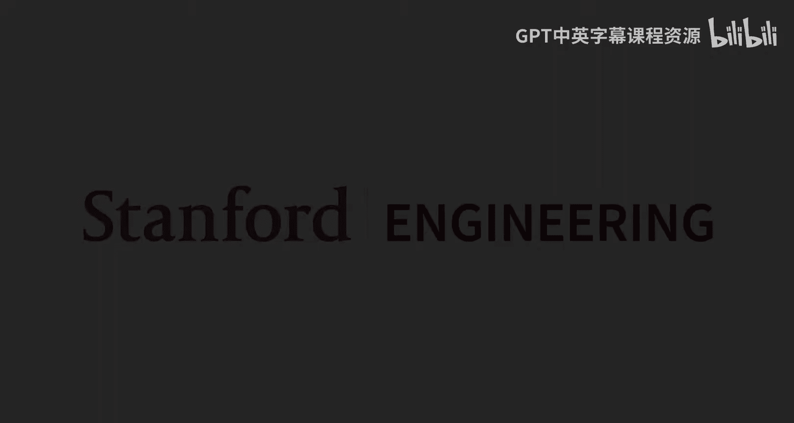
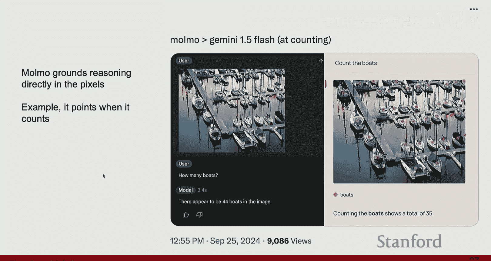
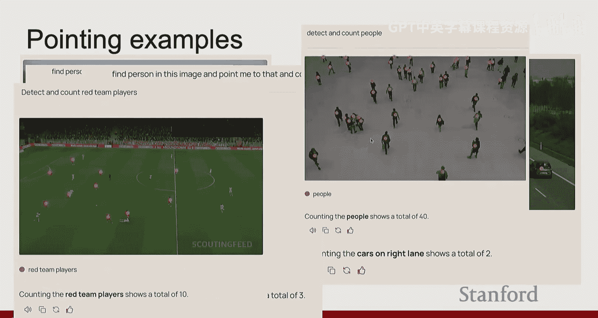
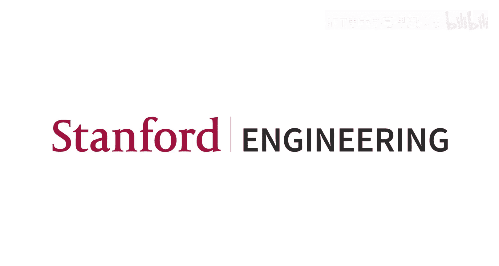

#  016：视觉与语言

## 概述
在本节课中，我们将要学习多模态基础模型。我们将探讨如何构建能够处理图像和文本等多种模态信息的强大模型，并了解它们如何通过预训练和微调来适应各种下游任务。课程将从图像分类基础模型开始，逐步深入到结合视觉与语言的多模态模型，并讨论如何通过模型链式组合来解锁新的能力。

## 图像分类基础模型：CLIP 🖼️

在之前的课程中，我们学习了为单个任务（如图像分类、图像描述）构建模型的流程。这通常包括收集数据集、训练专用模型并在测试集上评估。然而，近年来领域内出现了一个转变，即从构建单个模型转向构建更通用的基础模型。

基础模型旨在通过预训练让模型掌握多种技能和任务，随后再根据具体需求将其适配到个别任务上。例如，GPT就是一个常见的语言基础模型，它在大量互联网数据上预训练，然后可以针对数学问题、符号推理等不同任务进行微调。基础模型的优势在于，它通常只需要极少甚至无需额外训练数据，就能快速适应新任务。

当我们讨论基础模型时，通常会看到一些共同特征：它们对多种任务具有鲁棒性和通用性，参数量巨大，训练数据量庞大，并且通常使用自监督目标进行训练。本节课我们将重点讨论图中绿色部分，即视觉和多模态基础模型。

### 从自监督学习到多模态

上一节我们介绍了自监督学习的概念，本节中我们来看看如何将其扩展到多模态领域。回忆一下自监督学习方法SimCLR，它使用对比目标，将同一图像的不同增强版本在表示空间中拉近，同时将不同图像的表示推远。这种方法的理念是让相似概念（如猫的不同形态）的表示彼此靠近，而不同概念（如猫和狗）的表示彼此远离。

我们希望这些通过自监督学习目标训练出的表示具有足够的通用性，这样当模型看到新的内容（如猫或狗的素描）时，仍然能将其嵌入到合适的表示空间中以便分类。

我们可以将同样的思想和目标应用到多模态场景中，开始思考如果在这个表示空间中加入文本会怎样。例如，如果我们能将“一只毛茸茸的猫”这段文本的表示也嵌入进来，并让它靠近猫的图像表示，那就非常理想了。这样，我们就可以通过图像和文本来查询概念。

### CLIP模型的工作原理

CLIP模型采用了与SimCLR类似的思想，但将其扩展到了图像和文本两种模态。在CLIP中，我们仍然有一个图像编码器（左侧），但现在右侧多了一个文本编码器。这个文本编码器用于嵌入各个图像的描述文本。

训练目标是：一张狗的图像应该学习到其表示更接近“我最喜欢的狗是金毛寻回犬”这段文本的表示，而远离所有其他文本的表示。由于这与SimCLR的公式相同，训练此类模型的目标就是收集大量图像-文本对，将它们输入模型进行小批量训练，并确保使用SimCLR中的对比目标，但现在将其应用于图像和文本之间。

我们希望每张图像最接近其对应的文本，并远离所有其他文本。同时，我们也希望反之亦然：每段文本最接近其对应的图像，并远离所有其他图像。因此，这是一个在两种输入模态之间互补的对称损失函数。

CLIP类模型的优点在于，它只需要图像和文本的关联数据即可训练，而互联网上存在大量此类数据。OpenAI在2021年发布CLIP模型时，正是从互联网上收集了大量数据，并使用这种对比目标进行训练。

训练完成后，遵循自监督学习课程中看到的两步流程：第一步是预训练，第二步是取用训练好的图像编码器，将其适配到新任务。你可以在这个预训练的图像编码器上添加一个额外的线性层，以适应图像分类、检测任务，甚至可以接入解码器来输出语义分割图。通过从这种预训练目标初始化模型，许多不同的任务都成为可能。

当CLIP论文发布时，令人兴奋的是，仅在这个CLIP编码器之上线性添加一个分类器，就带来了性能的巨大提升。图表显示，在多个图像分类数据集上的平均性能，CLIP模型（红色）遥遥领先。随着训练图像数量的增加，性能持续提升。这表明我们找到了一个非常有效的预训练目标，并且互联网上丰富的图像-文本数据意味着我们可以训练出规模巨大、性能优异的模型。

### 零样本分类与提示工程

当然，故事并未结束。理想情况下，我们希望能够直接使用CLIP模型，而无需为每个新任务微调特征。对于语言模型，你训练一个模型进行自动补全（例如，给定“I love”，模型补全“cake”）。在第二阶段，你可以直接使用同一个模型，通过提示将其适配到新任务，而无需重新训练。

但对于CLIP，问题在于没有这种自动补全过程。我们使用对比目标训练了模型，但要将其适配到新任务，仍然需要训练数据和需要在顶部训练的线性层。

因此，人们开始思考如何让模型能够直接使用。他们想出了一个巧妙的技巧：利用文本编码器来引导模型泛化到任何下游分类任务。其工作原理如下：假设你想用CLIP模型对图像进行分类，但不想为任何下游任务重新训练或适配模型。你可以取文本编码器，将类别名称输入其中以创建文本向量，然后使用最近邻方法找出正确的分类。

具体操作是：取新数据集中的所有类别（例如，“飞机”、“狗”、“鸟”），在文本空间中嵌入它们，得到每个类别的向量。当新图像输入时，只需使用图像编码器嵌入该图像，然后找到最接近的邻居。在这个例子中，图像与“狗”向量的相似度得分最高，因此可以将其分类为狗。

你可以将整个过程视为构建一个“1-最近邻”算法。你在文本空间中生成了一堆中心点或嵌入，可以将它们用作类别标签，并对任何新输入的图像执行1-最近邻搜索以找到最佳分类。

当然，单个单词可能不足以获得非常好的词向量。相反，你可能希望使用一个短语。原因在于，互联网数据中的文本通常不是孤立的单词。CLIP是从互联网下载的短语中训练的，因此理想情况下，你希望选择能给出最佳表示的短语。例如，不是简单地嵌入“飞机”、“狗”、“鸟”，而是嵌入代表“一张飞机的照片”、“一张狗的照片”的向量。事实证明，仅仅做这个小改动，就能在ImageNet上获得约1.3%的性能提升。

当然，选择正确的短语本身也很困难。因此，人们通常不会只选一个短语，而是选择许多不同的短语（例如，“一张狗的照片”、“一幅狗的图画”等），为每个类别生成多个向量。最后，取每个类别所有短语向量的平均表示，将其作为该类别的平均向量（如平均狗向量、平均飞机向量）。然后，你就可以回到起点，在这个平均向量上执行相同的1-最近邻算法。

### CLIP的泛化能力与局限性

CLIP能够适配各种新的图像分类任务。虽然它在ImageNet上表现良好并不稀奇，但真正有趣的是它在其他数据集上的表现。例如，ObjectNet数据集包含人们在非常规场景下拍摄的物体照片（如把香蕉放在地上拍照，或拍摄腐烂的香蕉）。这些图像中的物体并不常见。如果在ImageNet上训练，模型表现不会很好，因为ImageNet包含的大多是这些类别的典型形态。但CLIP模型表现同样出色，这让许多人感到兴奋，因为这种泛化到前所未见、甚至某种程度上超出分布的数据的能力非常强大。

CLIP泛化能力更好的原因主要有两点：首先，从互联网下载的文本不仅包含类别标签，还包含更多结构信息，如形状、颜色等，这些都有助于学习更好的表示，使模型能更好地适应分布外或外观略有不同的物体。其次，数据规模巨大。ImageNet只有约130万张图像，而互联网上可轻松下载的图像-文本对已达数十亿。这些模型看到了多得多的数据，使得适配变得容易得多。

人们开始在广泛的泛化任务上进行实验，结果表明这些模型不仅对自然图像，对素描、对抗性数据等都非常鲁棒。性能普遍表明这些模型非常优秀，适用于多种应用。

图表显示了零样本分类和线性探测（添加线性分类器并微调）之间的性能差异。当然，线性探测在大多数数据集（绿色部分）上能提升性能，但并非总是如此。在某些情况下，CLIP零样本直接表现就很好。这似乎表明我们终于解锁了将图像编码器适配到各种下游任务的能力，这也是许多人将CLIP视为第一个图像基础模型的原因。

那么，是什么让CLIP工作得如此出色？关键在于其训练数据。CLIP在训练时没有使用真实的标签，只是下载了与图像相关的任何文本。使其表现出色的因素包括：模型参数量巨大（从ResNet架构转向ViT，使用了3.07亿参数的Transformer架构），以及数据量巨大（从ImageNet的120万张图像扩展到从互联网下载的约4亿个图像-文本对）。模型规模和数据的扩展极大地提升了性能。

## 视觉语言模型：从ViLBERT到Flamingo 🦩

CLIP问世后，人们立即开始尝试这个目标，多年来出现了许多CLIP的变体。其中一个特别突出的变体是2022年提出的CoCa。CoCa采用了与CLIP相同的目标（图像编码器、文本编码器及两者间的对比损失），但额外添加了一个解码器。该解码器接收来自图像编码器的图像特征，通过交叉注意力机制为图像生成描述。事实证明，这个描述过程也有助于模型学习更丰富的信息。

其动机在于，仅仅区分图像是猫还是狗并不足够，而用文本描述图像则需要模型学习更多信息。因此，假设这是一个更强的学习目标，能学习到更好的特征。总体而言，CoCa相比CLIP在所有图像变体和数据集上的性能都有显著提升，平均约有10%的性能提升。

我认为这是基础模型首次在性能上全面超越我们通过监督学习训练的所有模型。此时，人们开始放弃用于图像编码器的监督学习目标，转而完全专注于使用互联网数据的自监督学习方法进行预训练。

### CLIP的优势与局限

CLIP有很多有趣的优势：训练简单（只需简单的对比学习目标），推理速度快（可以将整个数据集嵌入表示，分类时只需进行检索），这使得它不仅适用于分类任务，也适用于搜索和检索任务。此外，CLIP是开放词汇的，可以输入任何文本描述来检索相关图像，这使其能够应用于许多不同领域。当然，CLIP也易于与其他模型链式组合，这个想法后来变得非常流行。

然而，CLIP也存在许多局限性。例如，它无法区分“草地上的杯子”和“杯子里的草”这两张图像。原因在于CLIP的学习目标严重依赖于批次大小。如果批次大小不够大，批次中的其他元素不太可能为模型提供有用的监督。如果总是比较猫和卡车，你实际上学不到好的猫的表示。相反，你只能得到某种在高层面上还行的表示。但如果你将批次大小增加到32,000并在多个GPU上训练，你就能开始学习到真正好的表示，甚至可以区分威尔士柯基犬和其他柯基犬。这是因为需要批次中有足够接近的负样本（即困难负样本）来迫使模型学习。这对于让这些模型良好工作非常重要。

不幸的是，无论人们如何尝试增加批次大小，都不能保证模型能学到好的表示。因此，你实际上受制于训练数据的随机性。增加批次大小确实有助于学习一些细粒度概念，但它仍然是有限的，并且32,000的批次大小对大多数实验室来说都太大了。

人们已经在许多基准测试中发现了CLIP的错误，并指出CLIP缺乏组合性概念。例如，“草地上的杯子”和“杯子里的草”涉及组合不同概念（杯子、草地）及其关系，而这些在CLIP的表示中并没有很好地组合。已经出现了许多基准测试（如Winoground、CLEVR、ARO等），它们不断发现CLIP存在大量局限性，有很多事情它根本无法完成。

作为回应，社区立即开始思考如何手动构建批次以包含困难负样本。例如，如果批次中有一种柯基犬，最好能有另一种柯基犬也在批次中，这样模型就不得不学习好的表示。因此，“使用困难负样本训练”的想法在社区中流行了大约一年，直到我们发布了一篇后续论文指出，使用困难负样本训练实际上会导致模型遗忘很多语义信息。原因尚不明确，但我们在不同环境和数据集上的泛化性能确实变得更差。因此，在确定构建数据和训练信号的正确方法方面，仍有大量工作要做。

此外，图像级别的描述仍然不够。理想情况下，我们需要的远不止这些。我们不仅希望识别出“有人过马路”，还希望知道人的位置、车的位置、街道的位置等。所有这些 grounding 信息在CLIP中是完全缺失的。理想情况下，你希望数据集包含这类信息，模型也能对此进行推理。

最后，CLIP的一个重大劣势是，无论你的数据集有多大（即使收集了多达50亿张图像），仍然不足以涵盖你可能关心的所有重要信息。因此，我们在数据过滤方面做了很多努力，研究如何过滤互联网数据以找到训练CLIP模型的最佳训练数据。这已成为当前该领域研究的前沿。

## 多模态语言模型：Flamingo与MoO 🦜

上一节我们讨论了关于泛化分类的基础模型分支，现在让我们来谈谈视觉和语言模型。在过去的两年半里，出现了一类新的流行基础模型，我们通常称之为多模态语言模型。我将以LlaVA开始讨论，它可以说是最早流行起来的多模态语言模型之一。

其动机在于，语言模型通过下一个词预测（自动补全）过程，非常适用于适配许多新任务。因此，我们能否开始思考让图像模型也做类似的事情？我们能否给出一张图像，并开始进行类似于自回归过程的不同推理？这催生了一类称为视觉语言模型或多模态模型的新模型。

当然，从历史角度看，这个想法在2022年并非全新。早在2019年，ViLBERT就引入了这个想法，它将图像模型和语言模型结合在一起，以实现跨不同任务的泛化。但它们都是在Transformer之前训练的，并且大多使用LSTM。而现在的复兴正是发生在LlaVA等模型上，这些模型转向了更好的架构、更好的目标集，并且不再仅仅在单个任务上训练，而是使用互联网数据的某种预训练目标，在多种任务的基础上进行训练。

### Flamingo模型架构

那么，这是如何工作的？我们如何思考LlaVA？要讨论LlaVA，让我们先退一步思考Transformer模型或自注意力机制。具体来说，当我们思考语言模型时，它们所做的是关注过去的历史。例如，输入序列“Cats are so”，模型为了生成下一个词，会关注这个历史上下文，然后生成它认为应该的下一个词（如“cute”）。这是表示相同目标的另一种方式：底部是输入文本，模型将生成下一个词“cute”。

当我们思考视觉语言模型时，人们通常指的是通过将我们关心的图像 grounding 到对话中，来增加额外的上下文。我们可能关心以某种方式对图像进行标记，并将这些标记与历史上下文（如“Cats are so”）一起输入到语言模型中，然后利用它来自动补全图像的其余描述。

这就是LlaVA背后的基本思想：将这些图像标记与正在生成的词语一起输入，以持续生成关于该图像的更多描述。

当然，随之而来的问题是：如何定义这些标记？它们首先应该是什么？在LlaVA中，他们的解决方案是使用CLIP图像编码器。他们取用CLIP模型，提取其图像编码器，然后基本上从该编码器中提取标记。

你首先可能想到的是只使用CLS标记。图像被分割成多个块，每个块变成一个表示并输入到Transformer架构中。在CLIP中，它经过多层处理，最后得到每个块的标记以及CLS标记的表示。到目前为止，我们只考虑了CLS标记，仅用它进行分类任务。但其中还有其他标记。问题在于，这些其他标记从未被监督过。CLS标记通过对比目标与文本一起被监督，但其他标记从未用于任何目的。因此，它们可能不包含任何有用信息，经验表明这些特征并不非常有用。

但人们发现，如果你往回退一层，使用CLIP编码器中倒数第二层的特征，这些特征实际上非常有用。这些特征用于在最后一层生成最终的CLIP嵌入，并且它们包含了关于图像中物体位置的大量空间信息。因此，当将CLIP编码器与基于LLM的Transformer模型结合时，人们通常使用这些特征。

这就是整个LlaVA架构的样子：将图像输入预训练的CLIP编码器，提取一堆特征，将这些特征通过一个需要训练的线性层。这个线性层将训练成将CLIP表示转换为LLM能够理解和处理的东西。一旦有了这些标记，你就可以将它们全部输入到语言模型中，现在它可以生成关于该图像的对话。

LlaVA是最早流行的模型之一。随后，谷歌迅速发布了Flamingo。在Flamingo中，它基本上遵循了LlaVA的整个设置，能够将视觉编码器的特征与大型语言模型结合，但其创新之处在于如何融合这些不同的特征。

在LlaVA中，特征通过线性层输入，并作为输入的一部分馈入。而在Flamingo中，他们所做的不是这样，而是基本上将从视觉编码器输出的所有特征馈入到LLM的每一层。因此，他们必须对LLM架构本身进行一些修改。

以下是Flamingo训练数据的一个示例：图像被编码（例如，一只狗和一只猫），它们都被嵌入，并将被馈入到LLM的每一层。下方是描述每张图像的数据：以图像开始，描述该图像，然后下一张图像，描述下一张图像，依此类推。它们作为输入馈入LLM，而输出将是自动补全最后一张图像的描述。因此，你有一张图像，接着是狗的描述，然后是第二张图像，你开始描述，模型将被训练来自动补全第二张图像的描述。

他们对模型本身做了哪些改变？他们在LLM的每一层都添加了这种门控交叉注意力模块，并做了另一个改变：他们还添加了这个感知采样器，它基本上对图像表示进行采样和下采样，为每一层提供固定数量的、维度更小的标记。

总体而言，大多数组件都是冻结的：所有语言模型权重、所有视觉模型部分都被冻结。唯一被训练的部分是这些感知采样器组件和添加到LLM每一层的交叉注意力层。

这个交叉注意力模块看起来是这样的：在每个LLM层之前，都有这个交叉注意力组件。其目的是查看图像特征，然后决定它想要保留哪些图像特征，以及哪些部分对语言模型有用。他们将其设计为一组你已经见过的组件：使用交叉注意力层关注图像特征，然后在交叉注意力之后添加tanh非线性激活，这基本上决定了要保留这些组件中的哪些部分，以及要忘记图像的哪些部分。接着，它通过一个全连接层，稍微调整这些表示，然后再次通过tanh非线性激活来决定哪些部分应该保留，哪些不应该。经过这两个组件（每个都有残差连接）后，它进入正常的语言模型处理，然后继续生成所需的词。

这些额外的层被添加进来，只是为了让语言能够在每一层处理时融入并关注视觉特征。实际的修改本身，如果你对代码感兴趣，只是大约两三行代码，他们在其中添加了这个交叉注意力层，然后中间是tanh非线性激活。就代码而言，这是一个非常小的改动，尽管对模型来说是一个巨大的变化，因为它现在可以选择在每一层处理时关注图像的哪些部分。

### Flamingo的训练与应用

Flamingo非常令人兴奋，但训练它非常困难。他们有一种非常巧妙的训练方法，使得模型能够适应许多不同的任务。他们训练的方式是通过将一堆不同的图像和描述连接在一起。你不仅仅有一张图像和一个描述，而是在开头有一个描述说“这里有一些我宠物的可爱照片”，然后是“图像开始”的句子，接着是第一个组件的描述，然后是第二张图像和第二张图像的描述，依此类推。因此，训练设置看起来像是一个图像-文本-图像-文本交错的长序列数据。

当然，在描述任何单张图像时，你并不希望模型查看整个上下文，而只希望它关注那一张特定的图像。因此，他们创建了一个掩码方案，其中每张图像在生成时只查看该特定图像的特征，而不是其他图像的特征。这意味着，当生成“我的小狗坐在草地上”的描述时，你只查看与小狗对应的特征；同样，当生成猫的描述时，你只查看猫的图像，而不是其他图像。因此，他们创建了这种手工制作的掩码方案，以确保描述始终只关注特定的图像，但在训练时，模型确实能看到它正在生成的所有内容的整个上下文。

为什么这个过程有帮助？为什么能够同时看到所有这些内容是有帮助的？因为它允许你实现这些类型的应用。以下是Flamingo能够展示的三种不同应用，它们都围绕着进行多次对话或处理多张图像。

在第一种情况下，输入一张图像，Flamingo模型通过说“这是一张两只泰迪熊在月球上的照片”来描述图像。然后，它允许人们提出另一个问题，比如“它们在做什么？”。由于它已经通过现有的LLM进行了训练，继承了该LLM的推理能力，现在它可以推理并回答这个问题，可以说“泰迪熊正在交谈”。然后用户可能会问“它们在使用什么物体？”，Flamingo可以回答“看起来是一台电脑”，等等。因此，你可以通过做两件事来实现关于图像的多轮对话：首先预训练语言模型，然后将其融入Flamingo；其次，在训练数据中允许模型看到许多不同的图像和多轮对话，从而适应更长的文本序列。

你也可以给它多张图像，并询问这些图像的共同点是什么。现在，Flamingo模型将查看每个不同的组件并进行推理，说“它们都是火烈鸟”。因此，你可以开始进行许多这类非常酷的应用。

人们还展示了你可以开始进行上下文学习（如果你已经在GPT中使用过上下文学习，你应该熟悉）。你可以对Flamingo做同样的事情：传入一张图像和描述，再传入另一张图像和描述，现在当你传入一张新图像时，它会给你一个描述。或者你可以说“这里有一张图像，一个问题和一个答案；这里有一张图像，一个问题和一个答案”，然后当你传入一张新图像并只问问题时，它会给出答案。因此，你并没有训练它执行这些不同类型的任务，而是提供了它应该具有的行为示例，它应该泛化到你可能关心的新类型的行为。

同样，你可能关心分类，也可以使用Flamingo进行分类。你可以给它一张图像并说“这是地下，这是国会”，然后你可以问“这是什么？”。你甚至可以教它进行OCR和数学运算：你给它一张图像并说“哦，这应该对应2加1等于3”，最终当你给它一张新图像时，它应该能够自动补全并提取出“3乘以6”，然后通过推理整个过程给你输出。是的，这将是少样本学习的一个例子，你给它一些示例，然后问它新事物应该是什么。如果我丢弃所有的上下文示例，那将是零样本学习。

我们并不是在技术上连接它们，而是将图像标记通过这个感知采样器传递到LLM的每一层。因此，只有文本是被连接并作为输入馈入Flamingo模型的，而它选择何时关注图像的哪些部分。

你一次性输入给它，但在幕后，当然，这是网络接口。实际上，他们所做的是缓存模型，假设用户会继续对话，因此模型被缓存并准备好接受更多标记。是的，但如果他们没有缓存，那么是的，他们会将整个对话作为输入传入。

Flamingo非常酷，因为他们的论文中有这些非常大的表格，你可以去查看。但真正酷的是，有许多任务非常困难，你必须调整CLIP才能完成，而Flamingo只需零样本或少样本就能做到。你开始在许多不同的基准测试中看到这些巨大的改进。我认为，正是在这个时候，该领域从报告少数分类基准测试转向报告任何类型的理解任务，只要你能将其构建为问答过程，你就可以为各种技能构建基准测试。在过去的两年里，我们看到这成为计算机视觉领域的常态。

## 开源多模态模型的崛起：MoO 🦉

大约在去年这个时候，看到了LlaVA的成功，许多公司开始大力投资这些模型。因此，你开始看到许多API模型，如GPT-4V、Gemini 1.5 Pro、Gemini 1.5 Flash，许多这些模型开始发布，甚至Anthropic也加入了竞争，推出了Claude 3 Opus。当然，现在Claude 4 Opus也已经发布。因此，出现了许多这些模型，并且它们在一系列基准测试上表现更好。

图表显示了该领域11个更流行的视觉理解基准测试的平均性能。这里存在巨大的差异。LlaVA（我们讨论过的开源模型）的平均准确率大约在43%，而GPT和其他模型的表现要好得多，大约在80%左右或高70%。这两种模型之间的性能差异巨大。

当然，一看到这种差异，人们立即开始将GPT和Gemini的知识蒸馏到变体模型中并尝试发布这些模型。例如，中国的阿里巴巴公司发布了名为Qwen的模型，还有InternVL、Phi等，所有这些模型都开始出现，并且它们都是从GPT（如果不是GPT，就是从Gemini）蒸馏而来的。

这导致了该领域的一个大问题，也成为了我自己研究议程中试图关注的一个重要部分：作为一个研究社区，我们实际上不知道如何构建真正高性能的视觉语言模型。如何构建这些模型的技巧只有OpenAI和Google Gemini团队中的人知道。但开源社区，研究社区，还停留在较低的水平。

当然，你可以说这些是非常好的开源模型，但它们并不真正开放，因为它们是蒸馏而来的。我们实际上不知道如何复现这些模型。我们只能生产它们，但如果GPT不存在，我们就不知道如何创建这些其他模型。因此，我过去几年的研究议程一直专注于弄清楚如何缩小这个差距，如何构建真正优秀的多模态语言模型，并将这种理解传播给整个社区。

在过去的六个月（大约一年）里，我们所做的是创建了我们自己的一类模型，我们称之为MoO。图表顶部显示了MoO的性能。MoO与所有其他模型的不同之处在于，它是完全开源的：开放权重（你可以下载模型）、开放数据（你可以下载训练集和评估集）、开放代码（你基本上可以在自己的家中训练自己的MoO，假设你有足够的GPU），并且你还可以进行评估，适配这个模型用于各种新事物，当然也可以开始在各种不同的上下文中使用它。

当然，学术基准测试还不够，因为我们最终关心的是人们是否会使用这些模型，人们是否会想用这些模型而不是GPT。为了确保我们正确进行了评估，我们发布了一个MoO的演示平台，并进行了一项大规模的用户研究，实际上将我们模型的输出与所有其他模型的输出进行了头对头比较。我们的模型与GPT-4V具有相同的Elo评分，排名第二，与GPT-4V的Elo评分仅差一分。这是一个巨大的评估，涉及约870名用户，我们向他们展示了这些模型的输出，并进行了约325,000次成对比较，询问人们更喜欢哪个模型的输出。我们的MoO模型排名第二，人们在GPT和我们的模型之间的偏好几乎像是抛硬币。但它已经超过了Gemini 1.5 Pro和Claude 3.5。最大的区别在于，我们是一个小型研究实验室，却击败了谷歌对Gemini的数十亿美元投资以及Anthropic的数十亿美元投资，并且已经与GPT匹敌。因此，我们对整个过程感到非常兴奋。

我们还开发了一个70亿参数的模型，紧随那些大型模型之后。这个70亿参数的模型非常令人兴奋，因为你可以将其放在单个GPU上。因此，你现在可以拥有这个能够执行各种视觉任务的模型，并且它可以在单个GPU上运行，这意味着许多人现在可以使用它并针对各种任务进行微调。我们在2025年9月发布了这个模型，社区对此非常兴奋。这是第一次发布了一个性能非常高的多模态视觉语言模型，许多人开始讨论和撰写文章，谈论他们想要使用它的各种方式。不断出现的一个用例是将MoO微调用于机器人应用。我今天不会讨论机器人，因为你将在下一节课中学习，但我想给你一些人们对此感到兴奋的例子。

许多公司，甚至像NVIDIA这样的人，也开始谈论开源社区最终会赶上，无论你在私下里做了多少模型开发。在那个时候，我们正在赶上。看到我们的模型发布后，Meta迅速发布了他们的Llama 3.2模型作为回应，许多人进行了评估，比较MoO与Meta的Llama模型。同样，我非常高兴我们也在Llama之上胜出。

### MoO成功的关键：数据与像素级定位

让我展示一下MoO表现出色的原因。MoO成功的诀窍在于将其决策建立在像素本身之上。通常，当你给模型一个问题，比如“数一数有多少艘船”，它会给你一个数字，并且经常产生幻觉。但我们的模型不同之处在于，它实际上会指向它正在计数的所有东西。它会生成指向所有船的点，然后输出最终的数字。因此，它的决策是建立在像素本身之上的。这使我们能够训练一个模型，与Meta的Llama（在约60亿图像-标记对上训练）不同，我们的模型仅在70万个图像-标记对上训练。

最大的区别在于，我们手工策划了这70万个图像-标记对。这是我们能够做到的与这些公司构建的模型之间最大的区别。

许多人目前正试图从互联网下载这些图像-标记对，这已成为许多人训练这些视觉语言模型的基础：收集大量带有相关文本的互联网图像数据。但互联网数据的问题在于它是附带的。通常与图像关联的文本描述的是主观内容或上传者对图像的感受，很少真正谈论图像本身的内容。

与此同时，我们的数据看起来是这样的：对于单张图像，我们有关于该图像实际内容的密集描述，并且包含了许多人们在互联网上从未谈论过的东西。关于视觉世界，有大量的任务和知识我们从未提及。我永远不会告诉你某物在另一物的左边，仅仅因为对我们来说这样做很不自然。某物在另一物的左边是如此明显，你为什么还要传达这些信息？这就是我们开始从人们那里获取的那种信息。我们开始让人们谈论事物具有特定大小（如大）、形状（如矩形）、材料（如抛光、丰富）以及它在图像中的位置（如横跨图像的水平面）。所有这些信息确实使这些模型表现更好。

这是数据中的另一个例子：一张非常简单的手机屏幕或平板屏幕图像，我们这里的信息再次是互联网上完全缺失的、人们会发现有用的信息，比如“这是一个平板设备”、“时间是……”、“设备剩余电量是……”。这是那种会帮助人们使用这些模型的信息，但这也是我们从未在互联网上谈论过的信息。为了获取这类信息，我们设计了许多不同的问题，花了两年的时间进行不同类型的启发研究，以找出互联网上缺失的正确信息或信息片段，以及如何尽可能有效地获取它们。

非常重要的一点是，我们让所有的标注员不是输入描述，而是谈论描述。交谈自动打破了许多关于格莱斯准则的刻板印象，因此通过让人们交谈，我们让他们说出了他们通常不会输入的内容。

模型本身与LlaVA没有什么不同，我们有相同的设置：CLIP编码器输入，一个只是线性层的连接器，然后是一个大型语言模型，接收所有这些标记并输出任何你关心的东西。因此，模型本身看起来与现有模型非常相似，最大的区别在于数据本身的质量和密度。

由于这种定位能力，模型将其决策建立在图像本身之上，你可以让MoO做一些你无法使用任何其他模型做的事情，比如指向菜单。它实际上会告诉你菜单项在哪里。或者你可以告诉它指向“我可以在哪里设置搜索选项”，它会显示“好的，这是你可能想要设置这些选项的地方”，或者指向“中型数据集在哪里”，它会告诉你需要移动哪个选项。

我已经向你展示了它可以指向计数，但它也可以指向做非常细粒度的事情，比如能够询问“这辆公交车的路线号是多少？”。MoO不仅仅是简单地给你一个答案，它实际上会指向图像中（在这种情况下是包含公交车号的区域），然后返回公交车号给你。你可以让它推理左边有多少辆车 vs. 右边有多少辆车。你可以让它推理深度图像、俯视图像，甚至是非常拥挤的场景和运动区域。

同样令人兴奋的是（我们将在几分钟后讨论）是链式组合的想法，这在当今的多模态模型中不断出现。将MoO与其他模型链式组合的想法是，你可以将MoO的输出作为另一个模型（如SAM2）的输入。因此，你可以告诉MoO指向板球拍，现在你取那个点，将其输入到像SAM2这样的模型中进行分割，现在你可以对那个板球拍进行跨时间的分割。因此，你可以开始启用各种新的应用。

这是我们在办公室里尝试的一个例子，希望你在下一节关于机器人的讲座中会学到。我们让MoO指向水瓶在哪里，然后使用简单的运动规划器将机器人移动到那个水瓶旁。接下来，我们让它将那个水瓶移到脏盘子所在的地方，它指向水槽，然后将机器人移动到那里。然后我们告诉它指向水槽中的空闲空间，并将瓶子放在那个位置。因此，你可以再次将所有这些能力组合在一起，并将它们链式组合，甚至自动化许多机器人应用。现在，我的团队中很多工作都集中在适配许多这些视觉语言模型，并在实际物理领域中实现泛化。

## 分割基础模型：Segment Anything (SAM) ✂️

在剩下的20分钟左右的时间里，我想讨论如何泛化这些基础模型，使其不仅能处理图像分类和文本，还能泛化到你可能关心的任何输出空间。在这个领域中一个变得非常流行的模型是Segment Anything模型。

Segment Anything模型（简称SAM）试图构建一个分割模型，作为所有类型分割任务的基础模型。他们真正想做的是允许任何人在图像中指向他们关心的东西，然后希望模型能为那个东西输出一个掩码。例如，你希望一个模型能够泛化到固定数量的类别之外，涵盖你可能关心的任何类别，并且理想情况下，你希望这些输出是用户真正感兴趣的类别的掩码。因此，我们有两个目标：泛化到任何类别（大量类别），并且理想情况下，我们希望能够非常具体地输出用户真正关心的东西。这两个都是挑战：如何收集涵盖广泛类别的大量数据，以及如何设计一个能够精确定位用户真正关心的内容的架构。

让我们先从第二个问题开始：当我们想要某个东西的掩码时，这真的很模糊。想象一个场景，图像中有两只猫，用户进来说：“嘿，我想要猫的分割掩码。”但到底想要哪只猫的掩码并不清楚。理想情况下，如果你有指向能力，你实际上可以指向你关心的那只猫，然后根据点来创建相关的掩码。

当然，这些掩码质量可能不是很好，理想情况下，你希望这些掩码质量非常高，能够支持各种下游应用，如图像编辑或任何你可能想到的其他事情。

因此，要构建这种允许任何用户能够精确指定他们关心内容的架构，我们需要它超越仅仅输入文本描述你关心什么。SAM架构有两个或三个组件：图像编码器（同样可以是CLIP编码器），以及一个特殊的提示编码器，它试图编码文本、点、边界框或用户可能想要指定他们关心内容的任何方式。然后，给定这两个输入，它通过一个非常轻量级的解码器输出掩码。这个解码器看起来非常像你在这门课程中已经见过的分割解码器。

总体而言，这就是模型的样子：给定一张图像，我们使用图像编码器对其进行编码，然后有一堆不同的提示通过解码器与这些图像编码进行交互，并输出一个掩码。这是整体的架构设计。

现在，分割有一个大问题。假设用户确实指向了这个特定位置，并说：“嘿，我想要这个位置的分割掩码。”现在，那个分割掩码的问题在于，即使有一个点，它仍然不够明确，因为那个点可能指的是整个剪刀，可能只指你可以握持的部分，或者可能指你可以握持的其中一个部分。这种模糊性真的很难解决，而且你不想因为模型选择了错误的掩码而惩罚它。

因此，SAM架构所做的不是输出一个分割掩码，而是输出三个不同粒度的分割掩码，然后选择最接近真实情况的一个来计算损失，从而不惩罚其他掩码。希望随着时间的推移，这个模型将学会输出所有不同类型的掩码，然后用户基本上可以选择哪个最适合他们的用例。

如果你把所有这些东西放在一起，你现在唯一需要的就是数据：你需要跨许多不同类别的大量数据来真正使这个模型成为可能。数据的问题在于，直到2023年这个模型发布（大约一年半到两年前），大多数分割数据集都非常小。

这篇论文的作者所做的是，他们增长了当时存在的分割数据集的数量，图像数量增加了约6倍，分割掩码数量增加了约400倍。因此，他们显著增长并收集了大量掩码，以使这个模型尽可能高性能。同样，信息与我们在Flamingo和MoO中看到的信息非常相似：你需要真正高质量的数据来使这些模型尽可能高性能，并且对于许多视觉任务，数据在互联网上完全缺失，你需要出去寻找和收集这些数据才能使这些模型良好工作。

为了使这些数据成为可能，他们创建了这种循环过程：最初他们有一些标注数据，从这些标注中创建训练数据，训练一个模型，然后使用该模型标注更多数据，然后迭代地使用用户细化模型生成的分割，并继续这个过程。他们有一个“人在循环中，模型在循环中”的过程，提出分割建议，然后使用人工标注员修复分割。

这是他们数据中一个示例图像的样子：有很多类别，每个单独的蔬菜都有自己的掩码标注。收集这些数据非常昂贵，他们在数百万张图像上进行了这样的标注。这是另一个例子，同样，所有单个雨伞都被标注。这是另一个水下场景的例子，当然还有绘画，他们也有绘画的分割。所有这些加在一起，确实是构建这个分割基础模型的基础。

## 模型链式组合：解锁新能力 🔗

链式组合背后的想法你已经在本讲座中多次看到我给出的提示。其思想是能够将不同的模型组合在一起，以实现单个模型无法单独完成的事情。这是一个我们可以作为课堂进行的有趣小练习：我给你四张图像和四个类别。这些可能是你们中一些人从未见过的类别，也是CLIP未曾见过的类别。因此，CLIP实际上无法区分这些类别，因为它不知道哪个与哪个相关联。

这里有人知道哪个是哪个吗？马林巴琴？是的，第二个是马林巴琴。没错。有一个比较容易的，高架桥。是的，我想你们很多人都知道是哪个。但是，哪个是狗，哪个是鸟？如果我给你这些描述呢？现在我给了你这些东西的描述，突然之间，将每个与正确的类别关联起来对你来说变得非常容易，对吧？

这就是链式组合的基本思想：即使CLIP从未见过这些图像，这些概念很可能在互联网上以某种程度被讨论过，GPT可能能够描述它们。如果GPT可以创建这些描述，那么这些描述就成为分类哪个类别是哪个的非常好的方法。

链式组合的思想是，你取一个模型的优势，将其与另一个模型的能力结合起来，突然之间，你就获得了以前没有的各种新能力。因此，你可以取一堆CLIP没有训练数据的类别，但如果你能描述它们，因为CLIP见过很多事物的描述，它现在可以开始非常好地对它们进行分类。你可以开始让CLIP为单个花朵、单个汽车、单个空间甚至不同种类的宠物生成分类，