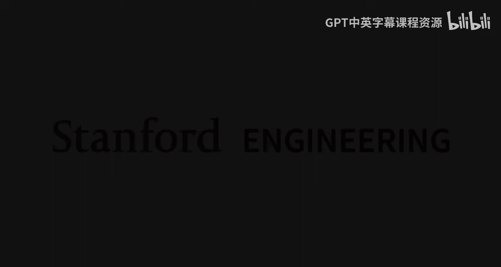
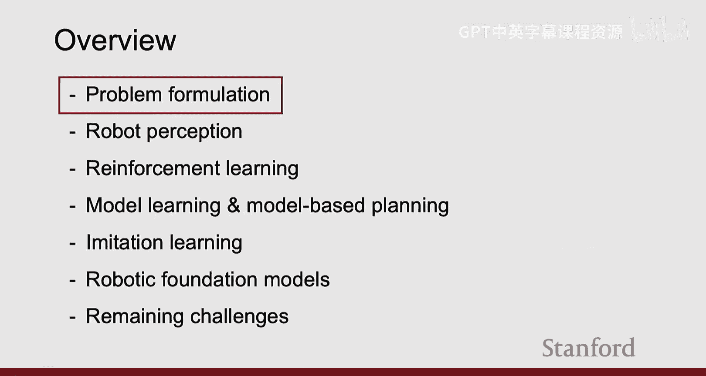
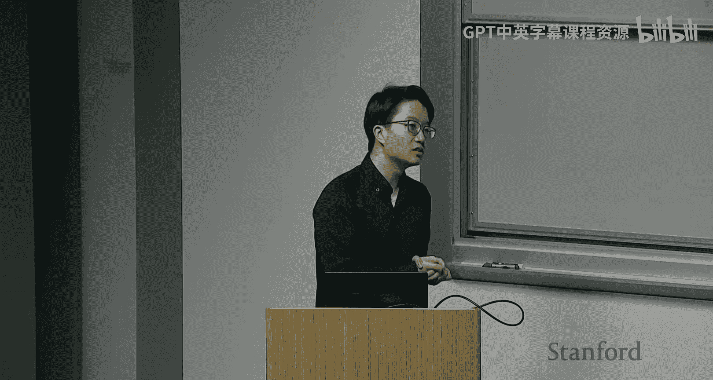
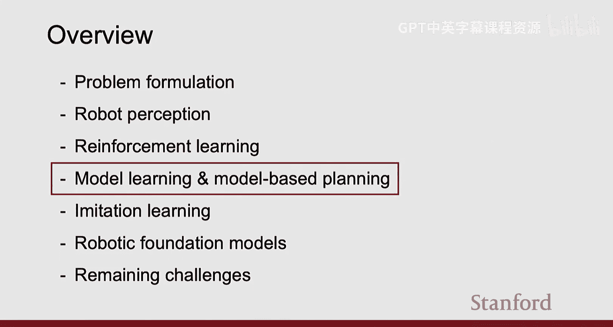
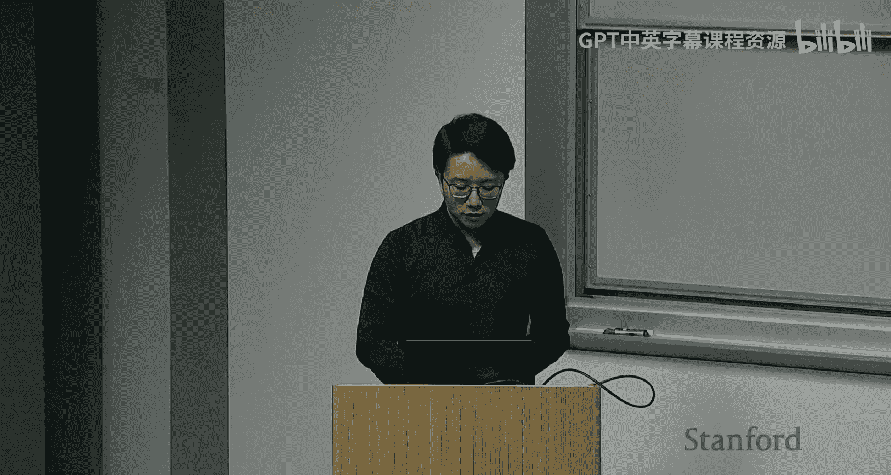
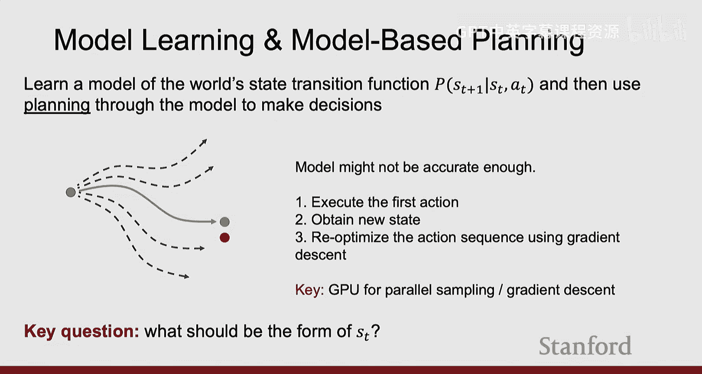
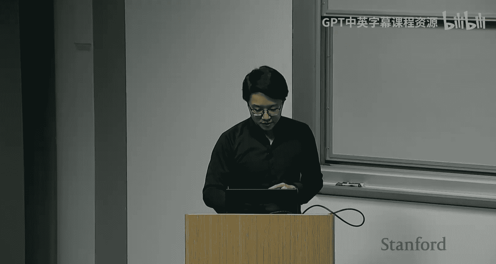
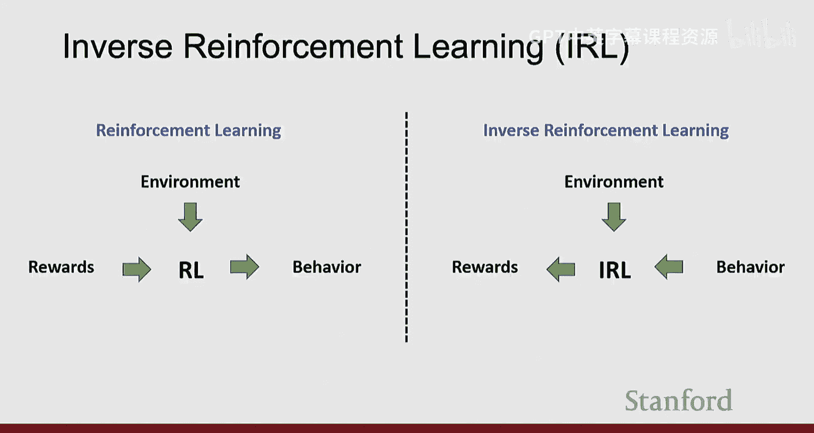
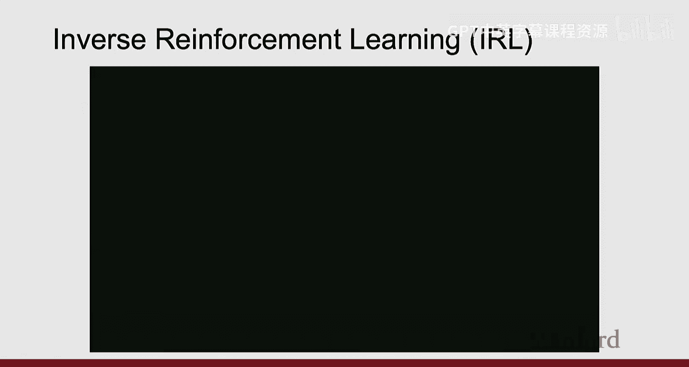
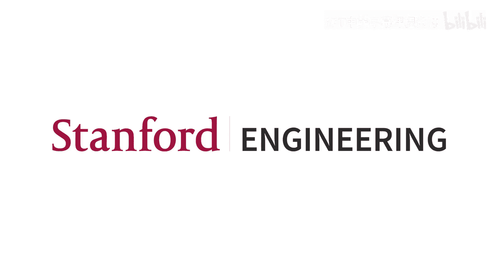

#  017：机器人学习导论

在本节课中，我们将要学习机器人学习的基础知识。机器人学习是计算机视觉、机器学习和机器人技术的交叉领域，其核心目标是让机器人能够通过感知和物理交互来理解和影响周围的世界。我们将从问题定义开始，探讨机器人感知的特殊性，并介绍几种核心的学习范式，包括强化学习、模型学习和模仿学习。最后，我们将了解当前热门的机器人基础模型及其面临的挑战。

## 问题定义 🎯

上一节我们介绍了课程概述，本节中我们来看看如何形式化地定义机器人学习问题。机器人学习与传统的计算机视觉任务有本质区别。计算机视觉主要关注从高维输入数据中学习环境的表示，而机器人学习本质上是一个优化问题：在物理世界的约束下，通过一系列动作来最大化或最小化某个目标函数。

一个通用的机器人学习框架可以用以下要素描述：
*   **智能体**：执行任务的机器人或程序。
*   **目标**：任务目标，可以是人类的语言指令或定义的奖励函数。
*   **状态**：环境或机器人自身的当前状态，例如传感器读数、关节角度等。
*   **动作**：智能体在环境中执行的操作，例如施加力、移动关节。
*   **奖励**：环境对智能体动作的反馈，衡量任务完成的好坏。

这个框架可以形式化为一个序列决策问题，智能体在时间步 `t` 观察状态 `s_t`，执行动作 `a_t`，环境转移到新状态 `s_{t+1}` 并给出奖励 `r_t`。智能体的目标是学习一个策略 `π`，以最大化累积奖励 `R = Σ γ^t * r_t`，其中 `γ` 是折扣因子。

以下是该框架在不同领域的具体实例：

*   **倒立摆**：目标是平衡杆子。状态是杆的角度、角速度、小车位置和速度。动作是施加给小车的水平力。奖励是每个时间步杆子保持直立时获得+1。
*   **机器人移动**：目标是让机器人向前走。状态是所有关节的角度、位置和速度。动作是施加给每个关节的扭矩。奖励是机器人每前进一步并保持直立时获得+1。
*   **雅达利游戏**：目标是获得最高分。状态是游戏屏幕的原始像素。动作是游戏控制（上、下、左、右）。奖励是每个时间步得分的增减。
*   **围棋**：目标是赢得比赛。状态是当前棋盘上所有棋子的位置。动作是在棋盘上放置下一个棋子的位置。奖励是最终获胜得+1，失败得0。
*   **大语言模型**：目标是预测下一个词。状态是当前句子中的词。动作是选择下一个特定的词。如果预测正确则获得奖励。
*   **聊天机器人**：目标是成为人类用户的好伙伴。状态是当前的对话。动作是聊天机器人生成的下一个句子。根据人类评价，如果用户满意则获得奖励。
*   **叠衣服**：目标是叠好衣服。状态是机器人从环境获得的多视角RGB或RGBD观测。动作是机器人如何移动其末端执行器以及是否开合夹爪。根据人类评估，如果衣服叠好则获得奖励。

## 机器人感知 👁️

上一节我们定义了机器人学习的问题框架，本节中我们来看看机器人如何感知世界。机器人感知的目标是从高维、非结构化的传感器数据（如RGB图像、深度图、触觉信号）中提取对下游决策有用的结构化和知识。

机器人感知与计算机视觉有几个关键区别：

1.  **具身性**：机器人拥有物理身体，其动作会直接影响自身的感知。例如，抓取物体时触觉传感器的反馈。
2.  **主动性**：机器人是主动的感知者。它可以决定感知什么、何时感知以及如何感知。例如，移动头部去看桌子后面的东西。
3.  **情境性**：机器人处于具体环境中，其感知需要与任务和决策系统紧密耦合。它不需要知道环境的完整状态，只需关注与当前任务相关的区域。例如，扣衬衫时只需关注纽扣附近的局部区域。

此外，机器人面临的环境更加复杂和动态：
*   **观测不完整**：存在遮挡、传感器误差。
*   **动作不完美**：抓取可能失败，物体会掉落。
*   **环境动态**：包含刚体、可变形物体（如衣服、绳索）、颗粒介质以及其他智能体（如人、宠物）。

因此，机器人系统通常融合多种传感器（视觉、触觉、听觉、深度），让它们互补以提供更鲁棒的感知。

## 强化学习 🤖

上一节我们探讨了机器人如何感知，本节中我们来看看机器人如何通过试错来学习行动，即强化学习。强化学习的核心思想是让智能体通过与环境的广泛交互，收集经验数据，通过试错来学习哪些动作能带来更高的奖励，从而调整其行为策略。

强化学习与监督学习有几个重要区别：

1.  **环境随机性**：环境可能是随机的，相同的动作可能导致不同的状态转移和奖励。
2.  **信用分配**：奖励可能是延迟的，需要将最终的成功或失败归因到之前的一系列动作上。
3.  **环境不可微**：环境动态通常不可微分，无法直接通过反向传播计算梯度，有时需要依赖大量采样进行零阶估计。
4.  **非平稳性**：环境的状态演变是智能体自身动作的结果，数据分布会随着策略改变而变化。

一个经典的强化学习算法是Q学习。Q函数 `Q(s, a)` 衡量在状态 `s` 下执行动作 `a` 后，所能获得的期望累积折扣奖励。智能体通过与环境交互来学习Q函数，然后选择能最大化Q值的动作。Q函数通常用神经网络（如卷积神经网络）来近似。

以下是强化学习取得显著成功的领域：

*   **游戏**：例如DeepMind的DQN智能体玩雅达利游戏《打砖块》，通过训练发现了人类玩家未知的高效策略（在墙边挖隧道）。AlphaGo及其后续版本在围棋上超越了人类顶尖选手。
*   **机器人移动**：通过在仿真中大量随机化物理参数（摩擦、几何等）并训练策略，可以实现非常鲁棒的仿真到现实迁移，让机器人在雪地、冰面等复杂地形中行走。
*   **灵巧操作**：例如OpenAI使用强化学习训练机械手解魔方。虽然成功率初期较低，但展示了在仿真中训练并迁移到现实进行灵巧操作的潜力。

然而，纯粹的无模型强化学习也存在瓶颈：
*   **样本效率低**：需要海量的环境交互，在现实世界中成本高、不安全。
*   **安全性差**：训练过程中会产生许多怪异、危险的行为。
*   **可解释性差**：策略难以理解和修正。

## 模型学习与基于模型的规划 🧠

上一节我们讨论了强化学习及其局限性，本节中我们来看看如何让机器人像人类一样，通过学习环境模型来进行想象和规划。基于模型的方法的核心思想是：从机器人与环境的物理交互中学习一个前向动力学模型，然后用这个模型进行规划，找到能达到目标状态的动作序列。

具体流程如下：
1.  **学习前向模型**：模型 `f_θ` 学习预测给定当前状态 `s_t` 和动作 `a_t` 时，下一个状态 `s_{t+1}` 的变化。即 `s_{t+1} ≈ f_θ(s_t, a_t)`。
2.  **轨迹优化**：给定当前状态（蓝点）和目标状态（红点），优化一系列动作，使得通过前向模型预测出的状态轨迹（绿点）尽可能接近目标。这通常通过梯度下降等优化方法实现。
3.  **滚动执行**：由于模型不完美，通常只执行优化得到的第一动作，然后从真实环境中获取新状态，并基于新状态重新规划。

模型表示的选择至关重要：
*   **像素动力学**：以2D图像为状态，预测动作后的图像变化。可用于推动物体等任务。
*   **关键点动力学**：以物体上的3D关键点为状态，预测其运动。可用于更精确的物体操控。
*   **粒子动力学**：用一组粒子表示物体（如一堆颗粒、面团），预测粒子的运动。这种方法非常灵活，能处理可变形物体。

一个成功的例子是“包饺子机器人”。该系统使用粒子表示面团和工具的形状，学习了一个前向动力学模型。机器人根据当前面团形状的观测，利用该模型进行规划，决定使用哪种工具以及执行什么动作，最终能将面团做成饺子皮并包好馅料。该系统还能在人类不断干扰的情况下鲁棒地恢复并完成任务。

基于模型的方法的优点是：
*   **样本效率更高**：模型可以从相对较少的数据中学习，并用于规划多种任务。
*   **可进行离线规划**：在行动前进行“想象”，减少危险尝试。
*   **更易解释**：模型本身提供了对环境动态的理解。

## 模仿学习 👥

上一节我们介绍了基于模型的方法，本节中我们来看看另一种高效的学习范式：模仿学习。模仿学习的核心思想是：通过提供大量展示任务如何完成的示范数据，让机器人直接学习一个映射从观测到动作的策略，而无需明确指定奖励函数。

最简单的模仿学习方法是**行为克隆**，它本质上是一个监督学习问题：学习一个策略 `π_θ`，使得在示范状态 `s` 下，其预测的动作 `a` 与专家动作 `a*` 尽可能接近。损失函数可以定义为均方误差：`L(θ) = Σ ||π_θ(s) - a*||^2`。

然而，行为克隆存在**级联错误**问题：由于策略在执行时会产生微小的误差，导致进入训练数据分布之外的状态，进而产生更大的误差，最终可能严重偏离成功轨迹。

因此，实用的模仿学习通常是一个迭代过程：
1.  收集专家示范数据。
2.  用行为克隆训练初始策略。
3.  在真实环境中运行策略，收集失败案例。
4.  针对失败案例，收集额外的纠正数据或让专家提供干预。
5.  将新数据加入训练集，重新训练策略。重复此过程。

另一种思路是**逆强化学习**：从专家示范中推断出隐含的奖励函数，然后利用这个奖励函数进行标准的强化学习。这结合了示范的效率和强化学习的探索能力。

近年来，模仿学习得益于生成模型的发展而变得更强大：
*   **基于能量的模型**：学习一个能量函数 `E(s, a)`，其值在专家数据上较低。策略通过最小化能量进行推断，能处理多模态的示范。
*   **扩散策略**：将扩散模型用作策略函数类别。策略不是直接输出动作，而是通过一个去噪过程来生成动作序列。这种方法在多种灵巧操作任务上取得了成功，如涂抹黄油、削土豆皮等。

模仿学习是目前在现实世界中获得可用策略最高效的方法之一，可以在较短时间内（例如半天）收集数据、训练并部署一个能完成特定任务的策略。

## 机器人基础模型 🚀

上一节我们介绍了模仿学习，本节中我们来看看当前推动机器人学习领域快速发展的前沿：机器人基础模型。机器人基础模型是一种旨在获得广泛泛化能力的策略模型。它类似于大语言模型或视觉-语言模型，但输出是机器人的动作。

其核心目标是：给定当前观测（如多视角图像）和任务描述（如语言指令），模型能生成合理、平滑且符合指令的动作序列，并在大量未见过的场景和任务中都能有效工作。

这类模型也被称为视觉-语言-动作模型或大行为模型。它们通常遵循一个类似的构建流程：
1.  **大规模数据收集**：聚合来自不同机器人平台、执行多种任务的海量机器人交互数据。
2.  **预训练**：通常从一个预训练的视觉-语言模型开始，以保留其语义知识。然后在机器人数据上对模型进行协同微调，同时优化动作预测损失和视觉问答等任务的损失。
3.  **后训练**：对于特定任务，收集任务相关的数据对基础模型进行微调，以提升在该任务上的性能。

一个著名的例子是`Pi0`模型。它展示了在叠衣服、叠盒子等长视野任务上的可靠性能。评估通常分为三类：
*   **已知任务**：基础模型在预训练阶段见过的任务上表现良好。
*   **领域内新任务**：与预训练任务相似但更复杂，通过后训练可以提升性能。
*   **领域外新任务**：完全新的任务，必须通过任务特定的后训练才能获得满意性能。

然而，该领域也面临挑战：
*   **评估困难**：泛化能力难以量化，真实世界评估成本高、噪声大。
*   **效率问题**：由于示范数据通常通过遥操作收集，速度较慢，导致学到的策略也较慢。
*   **规模化**：单个大策略能否处理家庭中所有复杂、多样的任务仍需验证，可能需要更高层的抽象或符号规划。

## 挑战与未来方向 🔮

上一节我们了解了前沿的机器人基础模型，在本节课的最后，我们总结一下机器人学习领域仍然面临的主要挑战和未来方向。

1.  **评估基准**：当前评估主要依赖昂贵、嘈杂的真实世界测试。仿真评估则受限于仿真到现实的差距、资产创建难度和世界数字化问题。社区亟需一个像ImageNet之于计算机视觉那样的、能可靠衡量进展的基准平台。
2.  **训练目标与最终性能脱钩**：策略的训练损失（如单步动作预测误差）往往不能准确反映其在长视野任务中的真实成功率。需要建立更好的代理指标。
3.  **从数据中学习世界模型**：目前收集的大规模机器人交互数据主要用于训练策略，其中蕴含的丰富动力学知识未被充分挖掘。未来方向之一是利用这些数据训练**基础世界模型**，它们可以与策略模型协同，提升规划能力和样本效率。
4.  **构建真正通用的机器人基础模型**：最终目标是开发出能在我们周围非结构化环境中广泛、稳健工作的机器人基础模型。这需要算法、数据、仿真和硬件等多方面的共同进步。

## 总结 📝

本节课中我们一起学习了机器人学习的核心内容。我们从**问题定义**开始，理解了机器人学习作为一个序列决策优化问题的特殊性。接着，我们探讨了**机器人感知**与计算机视觉的区别，强调了其具身性、主动性和情境性。然后，我们深入介绍了三种核心学习范式：**强化学习**通过试错优化策略，但样本效率低；**模型学习与规划**让机器人学会预测环境变化并进行内部模拟，样本效率更高；**模仿学习**则直接从专家示范中学习策略，是当前最高效的实践方法之一。最后，我们展望了**机器人基础模型**这一前沿方向及其面临的**评估、效率与泛化**等挑战。机器人学习是一个充满活力且快速发展的领域，正致力于让机器人在复杂的物理世界中为我们提供切实的帮助。