#  018：以人为本的人工智能

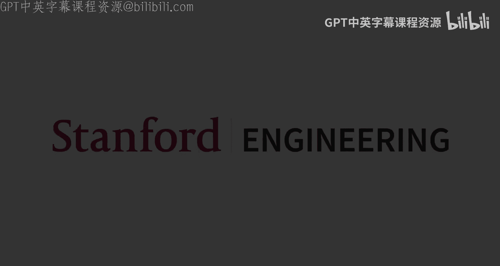

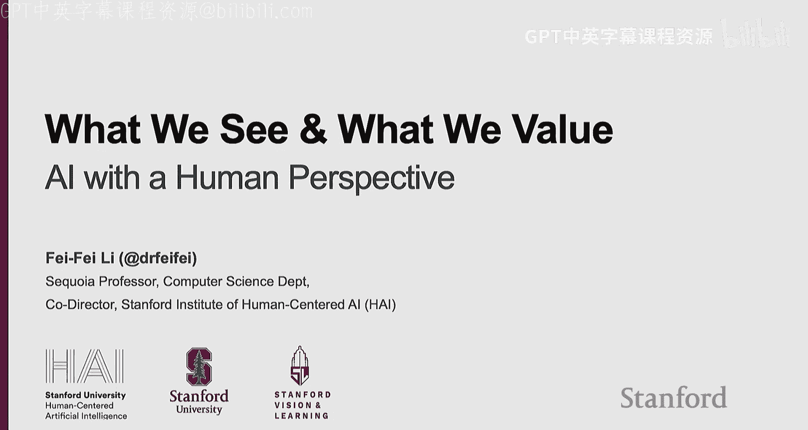

在本节课中，我们将探讨人工智能发展历程中一个至关重要的视角——以人为本。我们将回顾计算机视觉如何从模仿人类视觉能力，发展到超越人类局限，并最终致力于实现人类所期望的价值。我们将看到，人工智能不仅是技术演进的产物，更应成为服务于人类、增强人类能力的工具。

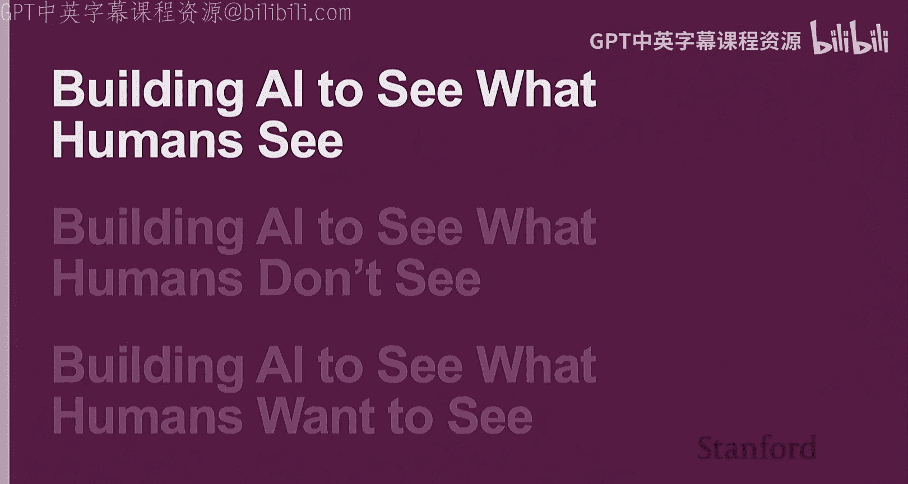

## 第一部分：构建能看见人类所见之物的AI

上一节我们介绍了课程背景，本节中我们来看看人工智能发展的第一个阶段：模仿人类视觉能力。

人类视觉系统非常强大。半个世纪前的实验表明，即使以每秒10帧的速度播放从未看过的视频，人类也能轻松识别出复杂场景中的目标。神经科学研究进一步证实，人类能在刺激出现后150毫秒内完成复杂的物体分类，并且大脑中存在专门处理物体（如面孔、地点、身体部位）的区域。这激发了计算机视觉领域的早期目标：让机器也能识别图像中的物体。

然而，对于机器而言，这是一个极其困难的任务。数学上存在无限的可能性，因为光照、纹理、背景、遮挡和视角等因素都会变化。

在深度学习兴起之前，物体识别经历了两个主要阶段：
*   **第一阶段（70-90年代）**：受心理学启发，尝试使用预定义的几何部件来组合识别物体。这些模型在数学上优美但未能成功。
*   **第二阶段（21世纪初）**：统计机器学习兴起。人们认识到，要获得泛化能力，需要从数据中学习参数，而非手动设计模型。这一时期出现了随机场、贝叶斯网络、支持向量机等模型，并在少量物体类别的基准测试上取得了进展。

真正的突破源于对认知科学的再次借鉴。心理学家艾尔·比尔曼推测，人类儿童能识别约3万到10万个视觉类别。这个“比尔曼数字”揭示了当时计算机视觉数据集规模的不足。

因此，ImageNet项目应运而生，它构建了一个包含约2.2万个类别、1500万张图像的数据集。大数据与卷积神经网络等强大算法的结合，最终在2012年迎来了深度学习的“诞生时刻”，基本解决了通用物体识别问题。

但视觉智能不止于给物体贴标签。认知科学家杰里米·沃尔夫指出，理解物体间的关系至关重要。受此启发，计算机视觉开始研究场景图，用节点表示物体，用边表示关系。Visual Genome数据集和场景图表示方法使得模型能够进行“零样本”学习，例如理解“马戴帽子”这种不常见的关系。

更进一步，视觉智能需要讲述故事。2014年左右，结合卷积神经网络和LSTM语言模型的工作开启了图像描述和密集描述生成的先河，为今天的多模态大模型奠定了基础。

动态场景理解则更具挑战性。理解视频中多个参与者的活动及其相互关系，对于未来机器人融入日常生活至关重要，目前这仍是一个未完全解决的问题。

此外，计算机视觉领域在3D视觉、人体姿态估计和生成式AI等方面也发展迅速。

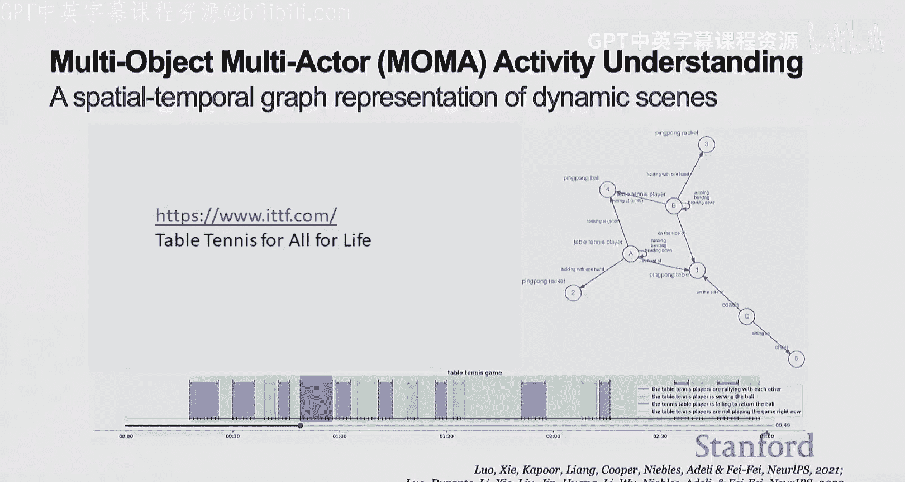

本部分的要点是：数据、算力和神经网络算法在大约十年前汇聚，催生了现代AI革命。而这一历程始终深受认知科学、心理学和神经科学的启发，这种紧密联系未来仍将继续。

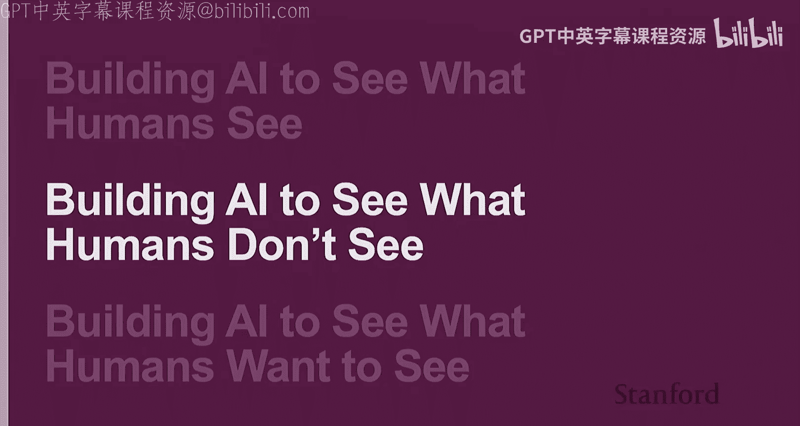

## 第二部分：构建能看见人类所未见之物的AI

上一节我们回顾了AI模仿人类视觉的历程，本节中我们来看看AI如何超越人类视觉的局限，或弥补人类的不足。

首先，AI可以追求“超人类”的精细识别能力。例如，细粒度物体分类（如识别成千上万的鸟类或汽车型号）是人类的弱项。早期工作表明，在细粒度级别上，算法的错误率仍然很高。有趣的是，这种能力可以成为研究社会的透镜。例如，通过街景图像识别汽车型号，可以分析其与教育水平、收入、投票模式等的相关性，这是任何个人或群体都难以手动完成的。

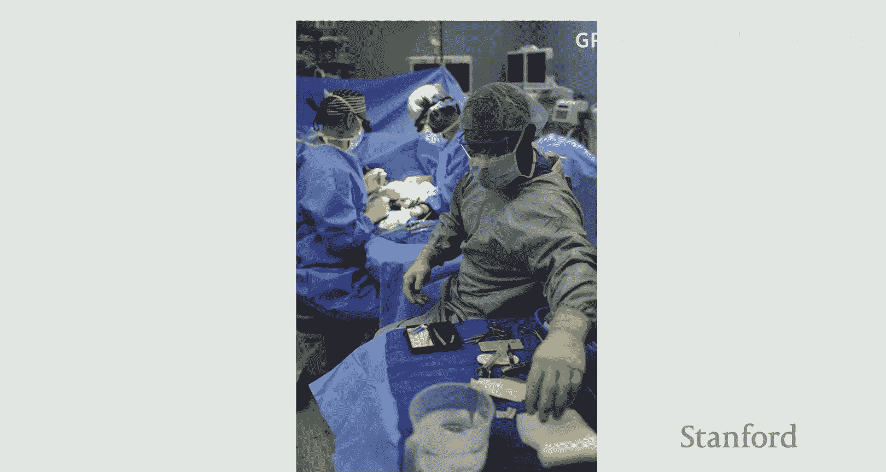

其次，人类视觉本身存在局限。例如，斯特鲁普测试揭示了阅读单词颜色时的认知冲突；变化盲视实验表明我们难以察觉场景中的显著变化。这些注意力局限在某些领域可能造成严重后果，例如医疗错误是美国医疗系统中第三大致死原因。

因此，AI可以辅助人类克服这些局限。例如，在手术室中，传统依靠人工清点器械，效率低且有风险。演示表明，AI有潜力辅助进行物品追踪，以提升安全性和效率。

再者，人类的视觉认知存在由进化或社会经验造成的偏差。例如著名的棋盘阴影错觉，揭示了我们对光照和阴影的固有假设。更严重的是，算法可能放大社会偏见，如几年前的人脸识别算法在不同肤色和性别上的性能差异。值得欣慰的是，到2025年，AI偏见问题已受到学术界和工业界的广泛关注。

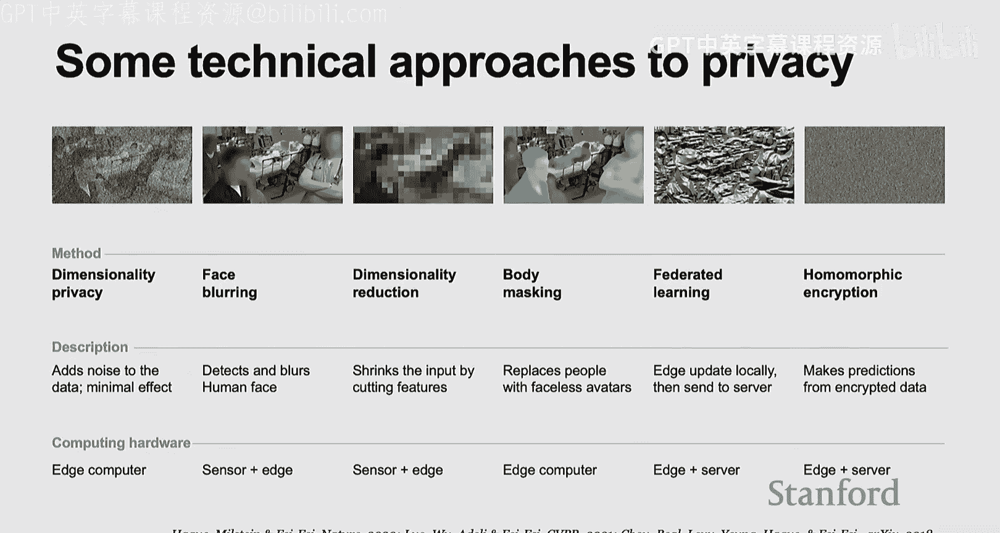

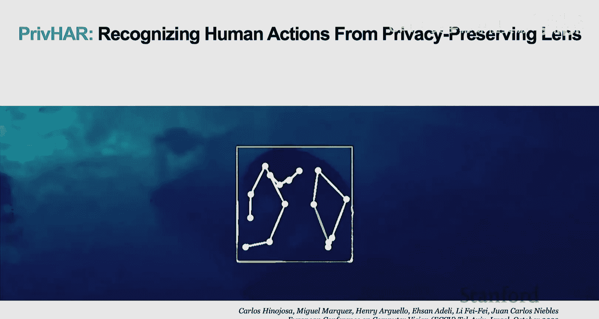

最后，有时“看不见”恰恰是出于对隐私的尊重。如何在利用AI提供帮助的同时保护隐私，是一个技术和人文交织的难题。

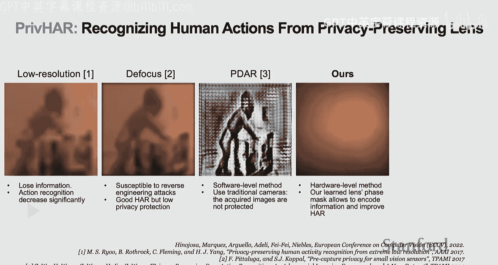

以下是几种可能的机器学习隐私保护技术方案：
*   模糊或掩码
*   降维
*   联邦学习
*   加密

一项结合硬件和软件的工作令人印象深刻：通过特殊设计的镜头过滤视觉数据，在保护人脸和身体隐私的同时，仍能解析出人物的活动信息，实现了“看见所需，保护隐私”的平衡。

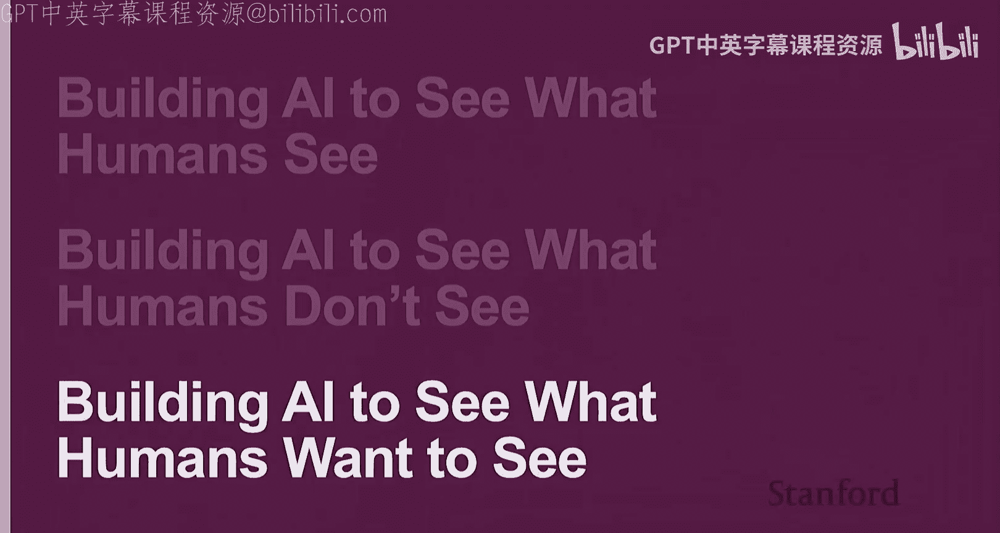

本部分的要点是：AI是一把双刃剑，既能帮助和增强人类，也可能放大人类的偏见和问题。因此，在构建AI时，必须秉持以人为本的视角，研究、预测并引导其社会影响，尊重人类价值。

## 第三部分：构建能看见人类所愿所见之物的AI

上一节我们探讨了AI如何看见人类所未见，本节我们将更进一步，连接“看见”与“行动”，探讨AI如何实现人类所期望的价值。

当前社会对AI的一大焦虑是劳动力替代。历史表明，技术变革总会带来劳动力市场变化，有些过程是痛苦的。但我们也应看到，在许多领域，如老年护理和医疗保健，我们正面临劳动力短缺。AI的角色不应仅仅是“替代”，更应是“增强”。

在医疗保健的诸多“黑暗空间”（如手术室、病房、药房、家庭）中，缺乏足够的“眼睛”进行监测。环境智能医疗旨在结合智能传感器和机器学习算法，从中提取关键健康信息并及时预警。

以下是几个应用示例：
*   **手部卫生项目**：医院感染是导致患者死亡的主要原因之一。传统人工审计效率低。通过深度传感器和视觉算法监测洗手动作，AI的检测效果比人类更准确、更一致。
*   **ICU患者活动监测**：帮助患者正确活动对康复至关重要。在ICU部署智能传感器，辅助医生监测患者下床、上床等活动，在劳动力短缺的情况下尤为宝贵。
*   **居家养老**：通过智能传感器（如热成像相机）帮助监测老年人的感染早期迹象、活动能力、睡眠和饮食模式，助力老年人健康独立生活。

然而，传感器只能收集信息，无法提供物理帮助。这就引向了具身AI——机器人技术，它能够闭合感知与行动的循环。但当前机器人仍面临速度慢、适应性差、任务范围有限等挑战。

我们的研究尝试让机器人能响应开放指令。通过利用大语言模型和视觉语言模型，将自然语言指令转化为代码和环境理解，再生成运动规划图，使机械臂能在非预设环境中执行如“打开抽屉但避开花瓶”这类任务。

为了推动机器人学习，我们需要像自然语言和计算机视觉领域那样，建立大规模、多样化的基准测试数据集。因此，我们启动了“行为”项目，旨在建立一个生态化的机器人学习环境与基准。

关键问题是：机器人应该学习哪些任务？我们通过以人为本的调查，询问人们希望机器人提供帮助的任务，并据此对数千项日常活动进行排序和筛选，确保机器人学习的任务是人们真正需要的。

我们扫描了50个不同的真实环境，获取了超过1万个具有物理属性的3D物体资产，并与NVIDIA Omniverse合作构建了高保真、支持物理交互的仿真环境。在这个环境中对当前机器人算法进行测试，发现在不给特权信息的情况下，其完成“行为”任务的能力几乎为零，这说明该领域仍有巨大发展空间。

此外，我们也在利用该环境研究视障患者，并与心理学家和医生合作，探索如何利用脑电波非侵入式地控制机器人。演示中，学生通过EEG帽发送指令，控制机械臂完成了一餐日式料理的烹饪，这为帮助严重瘫痪患者带来了希望。

“行为”项目旨在增强人类能力，它是一个大规模、多样化、具有真实生态物理和感知的基准。本部分的最终要点是：我们不仅希望构建能“看见”或“做事”的AI，更希望构建能“帮助人”的AI。将AI作为人类的增强工具，而非替代工具，这一点至关重要。

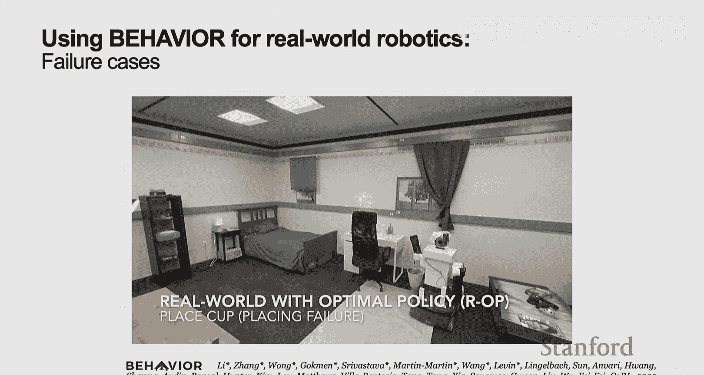

## 总结

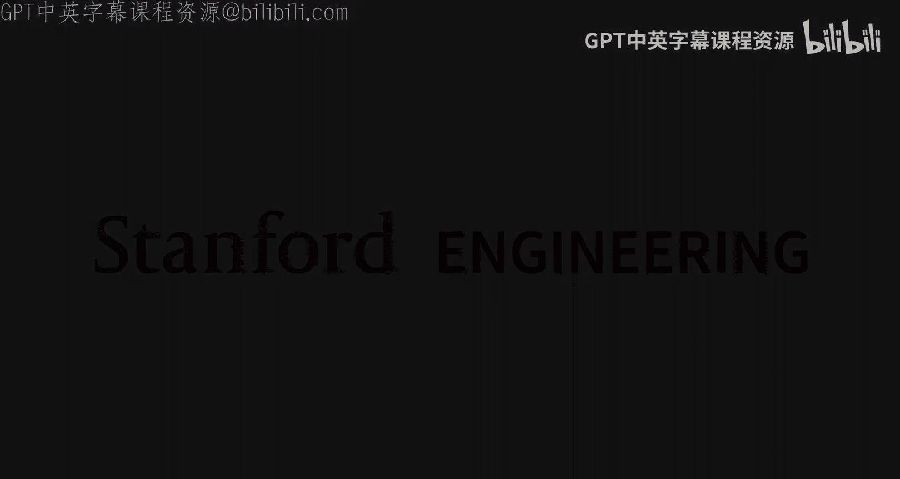

本节课中我们一起学习了人工智能发展的三个层次：从模仿人类视觉，到超越人类局限并辅助人类，最终致力于实现人类期望的价值。我们看到了技术演进与认知科学的深刻联系，认识到在开发强大AI时必须同时考虑其社会影响和人文关怀。未来，以人为本、增强人类能力的AI将继续是研究和应用的重要方向。