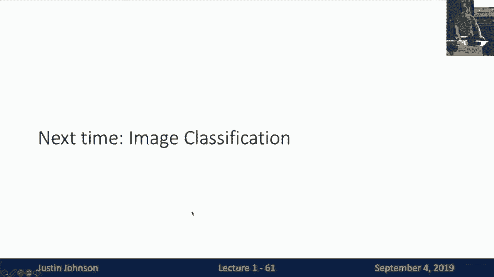

# 1：L1 - 计算机视觉中的深度学习介绍 🧠👁️

在本节课中，我们将要学习计算机视觉与深度学习的基本概念，了解它们如何结合并推动人工智能领域的发展。我们将回顾这两个领域的历史脉络，并概述本课程的结构与目标。

## 概述

计算机视觉旨在构建能够处理、感知和理解视觉数据的人工系统。深度学习则是一种受大脑结构启发、包含多层结构的机器学习方法。本课程将聚焦于这两个领域的交叉点，探讨如何利用深度学习技术解决复杂的视觉问题。

## 计算机视觉简史

上一节我们介绍了计算机视觉的广义定义，本节中我们来看看这个领域是如何发展起来的。

计算机视觉的研究可以追溯到1959年。Hubel和Wiesel通过研究猫的视觉皮层，发现了“简单细胞”和“复杂细胞”，这些细胞分别对特定方向的边缘和更复杂的运动模式产生反应。这项关于视觉信息分层处理的研究，为后来的计算模型提供了重要灵感。

1963年，Larry Roberts完成了可能是第一篇关于计算机视觉的博士论文，其工作涉及从图像中提取边缘和推断三维几何结构。

1966年，MIT提出了“夏季视觉项目”，其雄心勃勃的目标是在一个暑假内“解决”视觉问题，这凸显了早期研究者对问题复杂性的低估。

进入20世纪70年代，David Marr提出了视觉处理的阶段理论，从二维图像逐步推导到三维场景理解。同时，研究者开始尝试识别更复杂的物体，如使用“广义圆柱体”和“图示结构”来表示人体。

80年代，随着数字相机和计算能力的提升，基于边缘检测的物体识别成为主流。John Canny在1986年提出了著名的Canny边缘检测算法，而David Lowe在1987年提出了通过匹配模板边缘来识别物体的方法。

90年代，研究的重点转向通过“分组”进行物体识别，即先将图像分割成语义上有意义的区域，再对这些区域进行识别。

2000年代初期，“特征匹配”成为关键。David Lowe提出的SIFT（尺度不变特征变换）算法，能够提取对旋转、光照变化鲁棒的关键点特征，极大地推动了物体识别的发展。同年，Viola和Jones提出了用于实时人脸检测的算法，这是机器学习在计算机视觉中的一次重要成功应用，并迅速实现了商业化。

随后，大规模标注数据集的出现，如PASCAL Visual Object Challenge，使得数据驱动的机器学习方法成为可能。而ImageNet大型视觉识别挑战赛（ILSVRC）的设立，通过众包方式标注了超过140万张图像，成为了推动领域发展的关键基准。

## 深度学习简史

在计算机视觉发展的同时，另一条研究主线——深度学习也在并行演进。

1958年，Frank Rosenblatt发明了**感知机**，这是一种能够从数据中学习的早期硬件系统。从现代视角看，它可以被理解为一个**线性分类器**。

1969年，Minsky和Papert出版了《感知机》一书，指出了单层感知机的局限性，这在一定程度上导致了相关研究的降温。但书中也提到了**多层感知机**的潜力，这一点在当时被忽视了。

1980年，福岛邦彦提出了**神经认知机**，其结构（交替的“S细胞”和“C细胞”）已非常接近现代的卷积和池化操作，但缺乏有效的训练算法。

1986年，Rumelhart等人发表了关于**反向传播算法**的著名论文，为高效训练多层神经网络（即多层感知机）奠定了基础。

1998年，Yann LeCun等人提出了**卷积神经网络**，并将其成功应用于手写数字识别，该系统一度被用于处理美国约10%的支票。

2000年代，“深度学习”这一术语开始流行，指代那些具有多层结构的神经网络算法。尽管此时它仍是一个相对小众的研究领域，但许多核心技术和思想都在此期间得以发展。

## 历史性的交汇：2012年及以后

上一节我们分别回顾了两个领域的历史，本节中我们来看看它们是如何产生革命性交汇的。

2012年，Alex Krizhevsky、Ilya Sutskever和Geoffrey Hinton提出的**AlexNet**卷积神经网络，在ImageNet竞赛中大幅降低了错误率，震惊了整个计算机视觉界。这标志着深度学习正式成为主流。

自此以后，卷积神经网络被广泛应用于几乎所有计算机视觉任务中，例如：
以下是卷积神经网络的一些典型应用：
*   **图像分类**：为整张图像分配一个标签。
*   **物体检测**：在图像中定位并识别多个物体。
*   **图像分割**：为图像中的每个像素分配语义标签。
*   **视频分析**：识别视频中的动作和行为。
*   **图像生成与艺术风格迁移**：创造新的图像或将名画风格应用于照片。

推动这次突破的因素主要有三个：
以下是促成2012年突破的三大要素：
1.  **算法**：长期积累的神经网络与深度学习算法，特别是反向传播。
2.  **数据**：互联网和众包催生的大规模标注数据集，如ImageNet。
3.  **算力**：GPU计算性能的指数级增长，使得训练大型神经网络成为可能。

2018年，Yoshua Bengio、Geoffrey Hinton和Yann LeCun因在深度学习领域的奠基性贡献被授予图灵奖，这充分认可了该技术的巨大影响力。

## 现状与挑战

尽管深度学习在计算机视觉中取得了巨大成功，但我们距离构建具有人类水平理解能力的视觉系统依然遥远。人类能够从图像中理解物理规律、心理活动和社会关系，而当前的系统还远远做不到这一点。

然而，计算机视觉技术已经并将在以下方面持续改善我们的生活：
以下是计算机视觉技术的一些重要应用方向：
*   **娱乐与交互**：增强现实、虚拟现实、图像滤镜。
*   **安全与交通**：自动驾驶汽车、安防监控。
*   **医疗健康**：医学影像分析、疾病辅助诊断。
*   **科学研究**：生物多样性监测、天文图像分析。

## 课程结构与安排

现在，让我们将目光从历史拉回到本课程。我们将采用以下教学理念：
以下是本课程的核心教学理念：
*   **注重基础**：我们将从零开始实现神经网络，深入理解梯度计算和反向传播，而非仅仅调用高级API。
*   **结合实践**：在掌握原理后，我们会学习使用PyTorch/TensorFlow等现代工具，并探讨调试与训练大型网络的实际技巧。
*   **关注前沿**：课程内容将涵盖近5-10年的最新研究成果。
*   **保持趣味**：我们会探讨图像描述、深度学习艺术等有趣的应用。

课程分为两个部分：
以下是本课程的两个主要部分：
1.  **基础模块**：深入讲解全连接网络、卷积神经网络、循环神经网络的实现与训练细节。
2.  **应用模块**：概述物体检测、图像分割、3D视觉、视频理解、视觉与语言、生成模型等前沿应用。

课程评分将基于六次编程作业、一次期中考试和一次期末考试。我们鼓励同学们通过Piazza进行讨论与合作，但所有提交的代码必须是个人独立完成的。

## 总结

本节课中我们一起学习了计算机视觉与深度学习的基本定义，回顾了它们从各自起源到2012年产生革命性交汇的历史进程。我们看到了算法、数据和算力的结合如何催生了当前的人工智能浪潮，同时也认识到现有技术面临的挑战。最后，我们了解了本课程注重基础、兼顾前沿与实践的教学理念与整体安排。希望这门课能帮助大家打下坚实的理论基础，并激发你们在这一快速发展的领域中进行探索的兴趣。