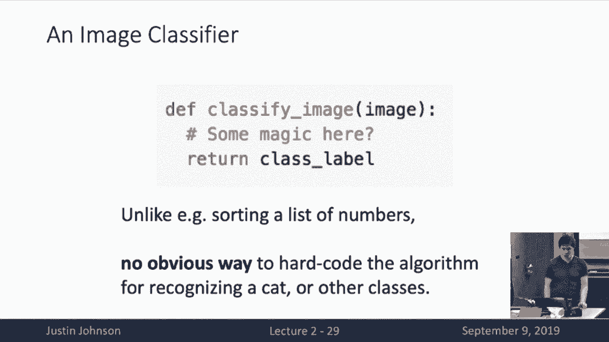
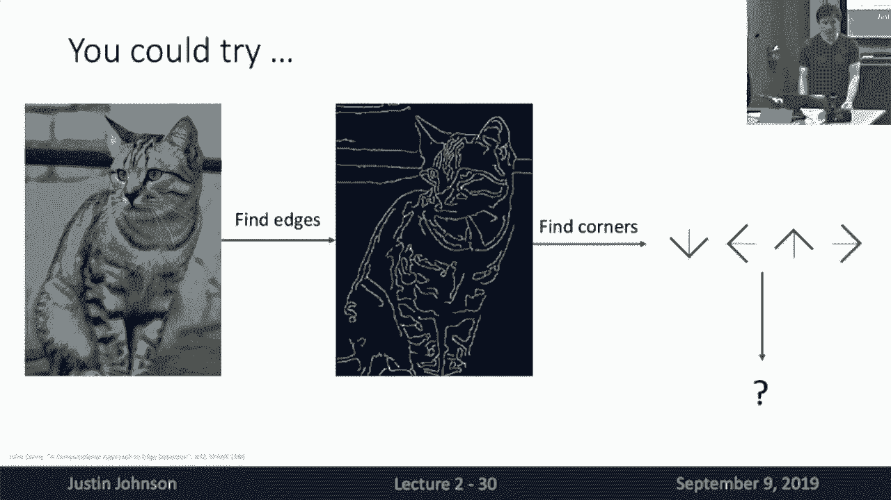
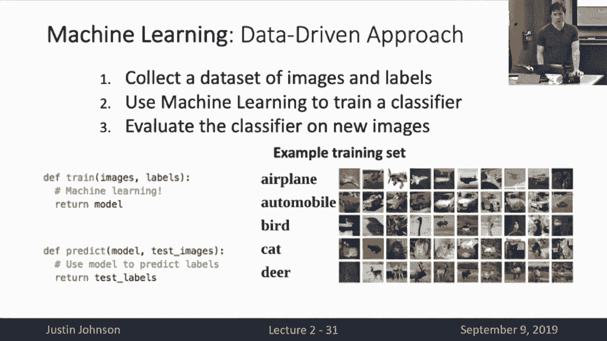
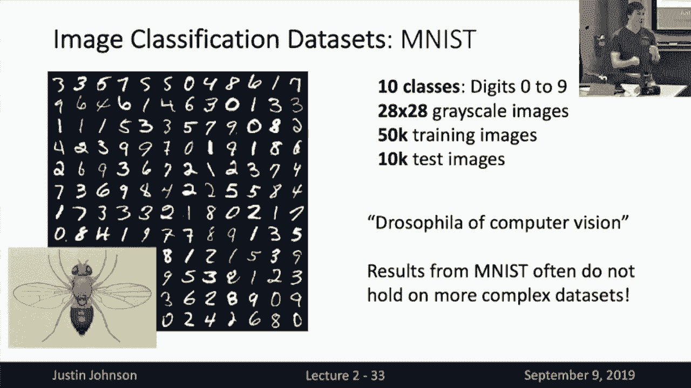
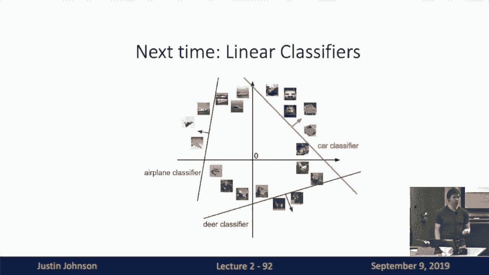

# 2：L2-图像分类 🖼️ 

在本节课中，我们将要学习图像分类这一计算机视觉中的核心任务。我们将探讨图像分类的基本概念、面临的挑战，以及如何通过数据驱动的方法构建分类器。特别地，我们将详细介绍我们的第一个学习算法——K最近邻算法，并讨论其工作原理、优缺点以及在实际应用中的注意事项。

---

## 📖 概述：什么是图像分类？

图像分类是一个看似简单但极具挑战性的任务。算法的输入是一张图像，输出则是为该图像分配一个预定义的类别标签。

例如，算法可能知道“猫”、“鸟”、“鹿”、“狗”、“卡车”这五个标签。当它看到一张猫的图片时，需要输出“猫”这个标签。

对人类而言，识别图像中的物体是轻而易举的。然而，对计算机来说，这却是一个巨大的挑战。其核心困难在于“语义鸿沟”：我们看到图像时，能直观地理解其内容；但计算机看到的只是一个巨大的数字网格（例如800x600x3的像素值矩阵）。这个数字网格与“猫”这个语义概念之间没有直接、明显的联系。

更复杂的是，图像像素值会因各种因素发生剧烈变化，而语义内容却保持不变。我们的算法需要对这些变化具有鲁棒性。

---

## 🎯 图像分类面临的挑战

为了构建一个实用的图像分类系统，算法需要克服以下主要挑战：

*   **视角变化**：同一物体从不同角度拍摄，像素值会完全不同。
*   **类内差异**：同一类别的物体（如不同的猫）在视觉上可能千差万别。
*   **细粒度分类**：有时需要区分视觉上非常相似的类别（如不同品种的猫）。
*   **背景干扰**：目标物体可能与背景融为一体。
*   **光照变化**：不同的光照条件会彻底改变图像的像素值。
*   **物体形变**：许多物体（如猫）的姿态和形状可以发生很大变化。
*   **遮挡**：目标物体可能只露出一小部分。

克服这些挑战，实现鲁棒的图像分类，将能解锁许多强大的应用，例如医学影像诊断、天文现象识别、自动驾驶等。

---

## 🧱 图像分类作为基础模块

图像分类不仅是独立的任务，更是构建更复杂计算机视觉应用的基础模块。

*   **目标检测**：可以通过对图像中不同滑动窗口进行分类来实现。
*   **图像描述**：可以将其视为一系列分类问题，依次选择最合适的词语来描述图像。
*   **游戏AI**：例如围棋AI，可以将棋盘状态视为一张“图像”，将下一步落子位置的选择视为一个分类问题。

由此可见，图像分类是计算机视觉中一个极其重要的基础性任务。

---

## 🤖 数据驱动的机器学习方法

鉴于直接为“识别猫”编写明确规则的算法非常困难且不具扩展性，我们转向**数据驱动的机器学习方法**。

其基本流程如下：
1.  **收集数据集**：收集大量带有标签的图像（例如，猫和狗的图片及其对应标签）。
2.  **训练模型**：使用机器学习算法，学习输入图像和输出标签之间的统计关系。
3.  **评估模型**：使用训练好的模型对新的、未见过的图像进行预测。

这改变了我们编程的方式：我们不再直接告诉计算机每一步该怎么做，而是通过提供数据来“教”计算机如何完成任务。如果想识别新的类别（如星系），我们只需要收集新的数据集，而无需重写算法。

---

## 📊 常用图像分类数据集

以下是几个在研究和教学中常用的图像分类数据集：

*   **MNIST**：包含0-9的手写数字，28x28灰度图。包含50,000张训练图像和10,000张测试图像。常被用作算法验证的“果蝇”式数据集。
*   **CIFAR-10**：包含10个类别（飞机、汽车、鸟、猫等）的物体，32x32彩色图。包含50,000张训练图像和10,000张测试图像。本课程作业将主要使用此数据集。
*   **CIFAR-100**：CIFAR-10的扩展，包含100个类别。
*   **ImageNet**：当前图像分类领域的“黄金标准”。包含1000个类别，约130万张训练图像。通常使用**Top-5准确率**（预测的5个标签中包含正确答案即算对）进行评估。
*   **MIT Places**：专注于场景分类（如教室、田野、建筑）的数据集。
*   **Omniglot**：专注于“小样本学习”的数据集，包含50多种书写语言的1600多个字符类别，每个类别只有20个示例。

数据集的大小和复杂性随时间不断增长，这对算法提出了更高的要求。

---

## 🧮 第一个学习算法：K最近邻

K最近邻是一种非常简单直观的学习算法。

**算法流程**：
1.  **训练阶段**：简单地**记忆**所有训练数据和标签。用代码表示即 `self.X_train = X; self.y_train = y`。
2.  **预测阶段**：对于一张新的测试图像，在训练集中找到与其“最相似”的K张图像，然后通过投票（多数表决）决定其类别标签。

**核心问题**：如何定义两张图像之间的“相似性”？我们需要一个距离度量。

**常用距离度量**：
*   **L1距离（曼哈顿距离）**：计算两个图像像素值之差的绝对值之和。
    `distance = sum(abs(I1 - I2))`
*   **L2距离（欧几里得距离）**：计算两个图像像素值之差的平方和再开方。
    `distance = sqrt(sum((I1 - I2)^2))`

**KNN的特点**：
*   **训练极快**（O(1)），但**测试很慢**（O(N)），因为需要与所有训练样本比较。这与我们通常希望的“训练慢、测试快”的特性相反。
*   决策边界可能不平滑（K=1时）或存在平局问题（K>1时）。
*   使用不同的距离度量（L1 vs L2）会产生不同形状的决策边界。

---

## ⚙️ 超参数选择与数据划分

KNN算法中的K值和距离度量类型都是**超参数**——它们不是从数据中学到的，而是需要我们在算法运行前设定的选择。

**如何选择超参数？错误的做法：**
1.  **根据训练集准确率选择**：这会导致选择K=1（因为训练集上总能达到100%准确率），但通常会过拟合，泛化能力差。
2.  **根据测试集准确率选择**：这相当于在测试集上“学习”，会污染我们对算法真实泛化能力的评估，是严重的错误。

**正确的做法：**
将数据集划分为三部分：
1.  **训练集**：用于训练模型参数。
2.  **验证集**：用于调整和选择超参数。
3.  **测试集**：仅在最终评估时使用一次，以得到对模型泛化能力的无偏估计。

**更优的做法：交叉验证**
将训练集进一步划分为多个“折”。轮流将其中一折作为验证集，其余作为训练集，重复训练和验证多次。最后取各次验证结果的平均值来选择超参数。这种方法评估更稳健，但计算成本更高。

---

## 💡 KNN的深入思考

**万能近似定理**：理论上，当训练数据无限多时，KNN可以近似任何函数。这意味着只要有足够的数据，KNN可以解决任何分类问题。

**维度灾难**：为了在高维空间（如图像像素空间）中“密集”覆盖，所需的数据量随维度指数级增长。对于32x32的二进制图像，其可能状态的数量（2^(1024)）远远超过了宇宙中基本粒子的总数。因此，我们永远无法收集到足够的数据来在原始像素空间中进行有效的最近邻搜索。

**像素距离的局限性**：在原始像素上计算的L1/L2距离通常不能反映图像的语义相似性。例如，一张图像和它平移几个像素后的版本，在像素距离上可能很远，但语义上完全相同。

**改进方向：使用更好的特征**
虽然原始像素上的KNN效果有限，但如果我们能先计算图像的高级特征（例如，使用后续课程将讲的卷积神经网络提取的特征），再在这些特征向量上使用KNN，往往能得到非常好的效果。这证明了特征表示的重要性。

---

## 📝 总结

本节课我们一起学习了计算机视觉的核心任务——图像分类。我们了解了其定义、挑战、广泛应用以及作为基础模块的重要性。我们重点介绍了第一个机器学习算法——K最近邻，详细探讨了其工作原理、实现方式、超参数选择以及数据划分的正确方法。最后，我们讨论了KNN的理论能力（万能近似）与实际限制（维度灾难），并指出了通过使用高级特征来提升其性能的方向。

掌握了这些知识，你已经可以开始动手实现并评估一个简单的图像分类器了。下节课，我们将学习一个更强大的学习算法——线性分类器。