# 4：L4 - 训练与优化 🚀

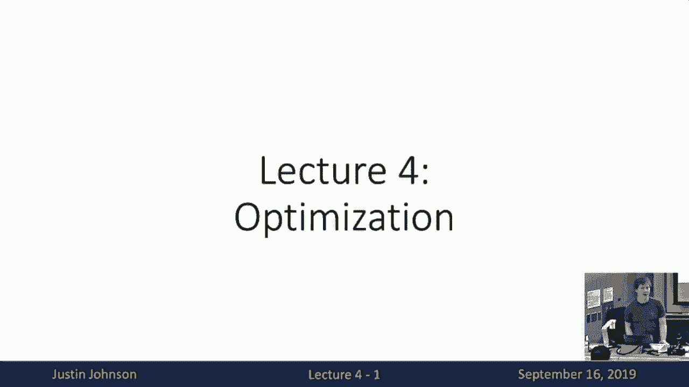

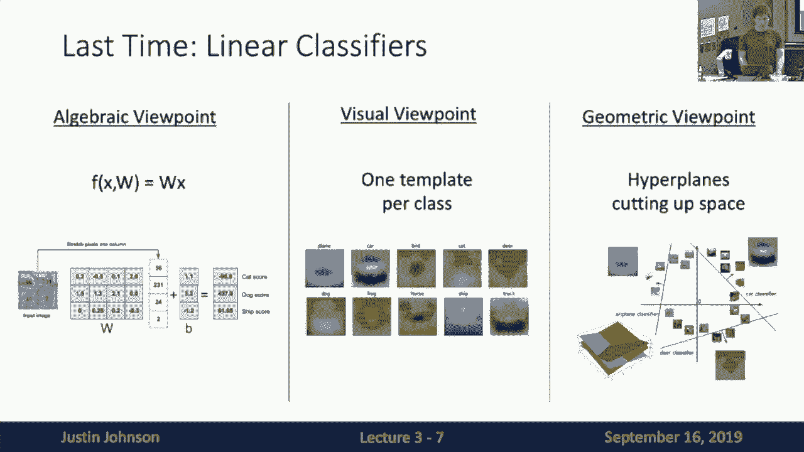

在本节课中，我们将要学习如何为线性分类器找到最优的权重矩阵。具体来说，我们将探讨优化这一核心主题，即如何最小化损失函数，从而找到能使模型在训练数据上表现最佳的权重参数。

---

## 概述 📋

在之前的课程中，我们介绍了线性分类器，并从代数、视觉和几何三个角度理解了它。上一节课，我们讨论了如何使用损失函数（如Softmax和SVM损失）来量化对不同权重值的偏好，以及正则化如何帮助我们构建更简单、泛化能力更强的模型。

然而，我们留下了一个开放性问题：给定一个线性分类器设置和一个损失函数，我们如何实际找到能最小化该损失的权重矩阵 W？这正是本节课要解决的核心问题。

---

## 优化问题：寻找最优权重 🎯

广义上讲，寻找能最小化损失函数的权重矩阵属于**优化**的范畴。我们的通用框架是：我们有一个损失函数 **L(W)**，它输入权重矩阵，输出一个标量损失值。

我们可以将优化过程直观地想象为在一个高维“地形”中行走。地面上的每个点（x, y）对应一个不同的权重矩阵 W 值，而该点的高度则对应损失函数 **L(W)** 的值。我们的目标是找到这个地形的最低点（即损失最小的点）。

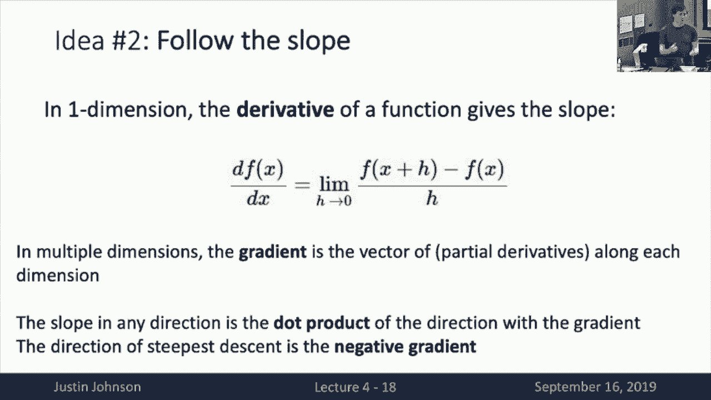

---

## 迭代优化方法 🔄

对于某些特殊的优化问题（如线性回归），我们或许可以直接写出最优解的解析式。但在一般情况下，这是不可能的。因此，我们需要使用**迭代方法**来逐步改进我们的解，朝着目标地形的最低点前进。

### 方法一：随机搜索（一个糟糕但具有启发性的想法）

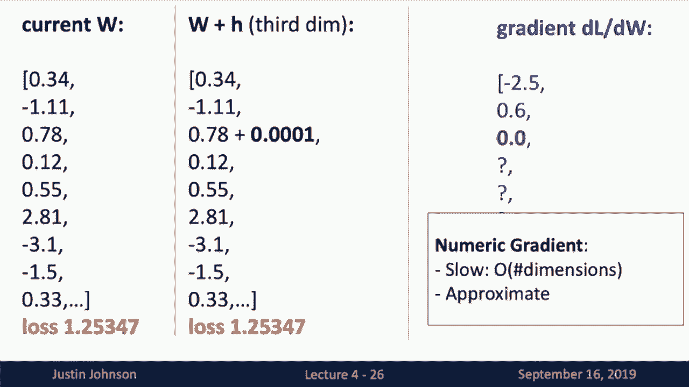

以下是随机搜索的基本思路：
*   生成大量随机的权重矩阵值。
*   在训练集上评估这些随机矩阵的损失值。
*   记录在整个随机搜索过程中找到的最低损失值。

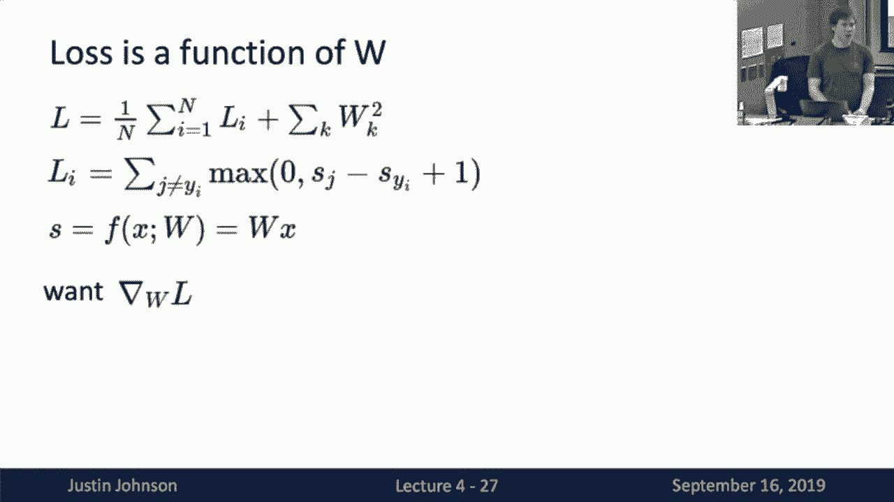

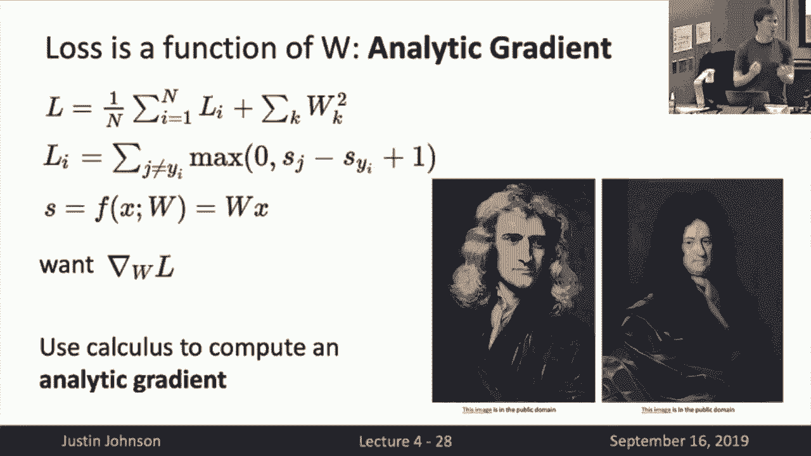

虽然这是一个非常低效的算法，但令人惊讶的是，即使在CIFAR-10数据集上，它也能达到约15.5%的准确率（尽管当前最优水平约为95%）。这启发了我们使用更智能的算法。

---

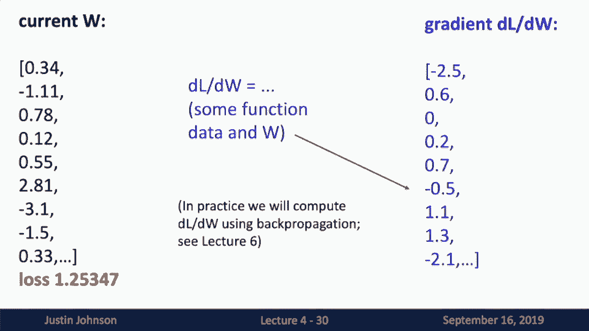

## 梯度下降：沿着坡度下山 ⛰️

在实践中，我们将采用第二种思路：沿着地形的**坡度**下山。即使我们“蒙着眼睛”，也可以通过感受脚下地面的局部倾斜方向，朝着最陡的下降方向迈出一小步，并不断重复这个过程。

为了使这个概念更形式化，我们需要引入**梯度**的概念。

### 梯度的概念

对于一个输入向量、输出标量的函数（这正是我们的损失函数），其**梯度**是一个向量。它指向函数值**增长最快**的方向，其大小表示该方向上的斜率。

由于我们希望**最小化**损失，因此我们实际要移动的方向是梯度的**反方向**，即**负梯度方向**。

---

## 计算梯度 🧮

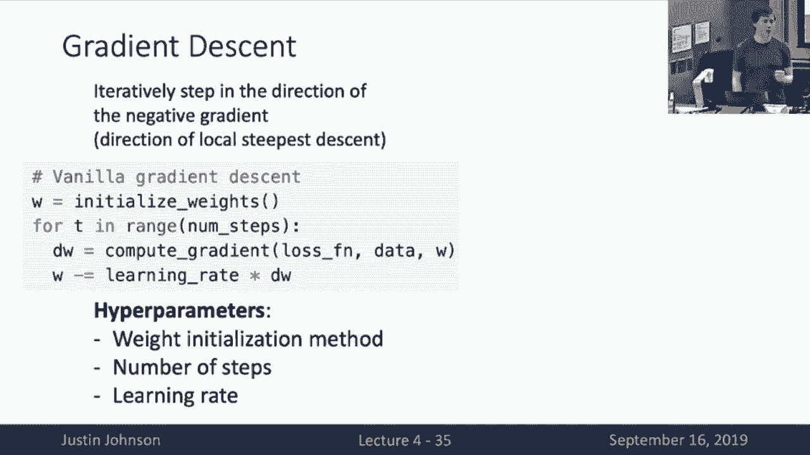

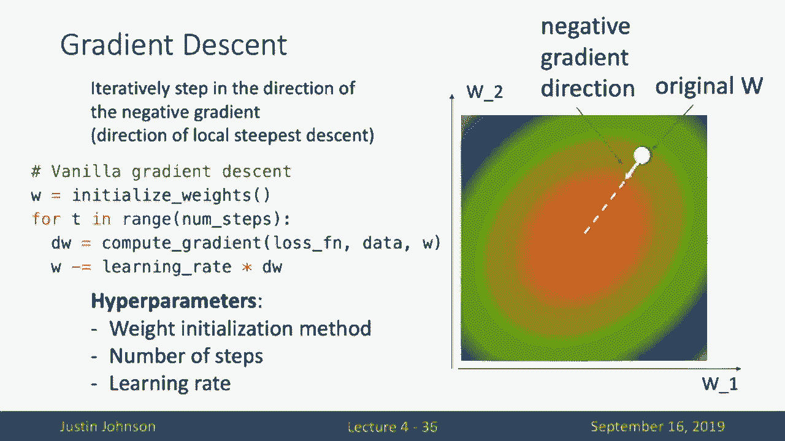

那么，我们如何计算任意函数的梯度呢？主要有两种方法。

### 数值梯度

我们可以直接通过软件实现梯度的极限定义。基本思想是：对权重矩阵 W 的每一个元素进行微小的扰动，计算损失函数的变化，然后用差分来近似该方向上的导数（斜率）。

**公式**：对于 W 的第 i 个元素，数值梯度近似为：
`grad_approx[i] = (L(W + epsilon * e_i) - L(W)) / epsilon`
其中 `e_i` 是第 i 个基向量，`epsilon` 是一个很小的数（如1e-5）。

然而，这种方法有两个主要缺点：
1.  **非常慢**：对于有 N 个参数的模型，需要计算 N+1 次前向传播。
2.  **是近似值**：依赖于有限差分，并非精确梯度。

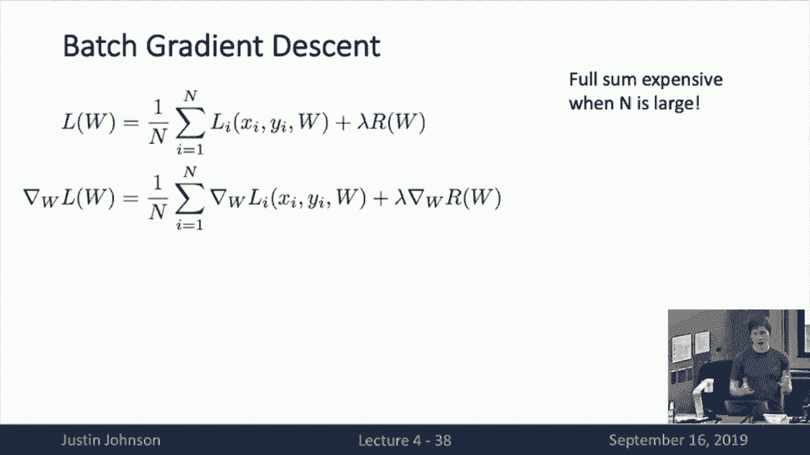

### 解析梯度（分析梯度）

我们可以利用微积分知识，直接推导出损失函数关于权重矩阵 W 的梯度解析表达式。这样，我们就能通过一次计算得到精确的梯度值。

在实践中，对于复杂的函数（如后续的神经网络），我们将使用**反向传播**算法（将在第6课详细讲解）来高效、结构化地计算这些梯度。

---

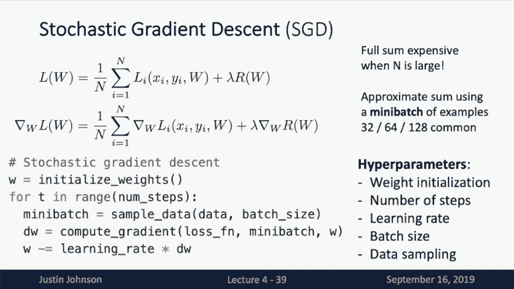

## 梯度检查：确保正确性 ✅

由于推导和实现解析梯度可能出错，一个非常好的实践是使用**数值梯度**作为调试工具来验证**解析梯度**的正确性。

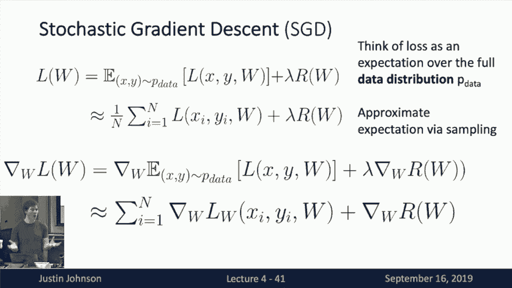

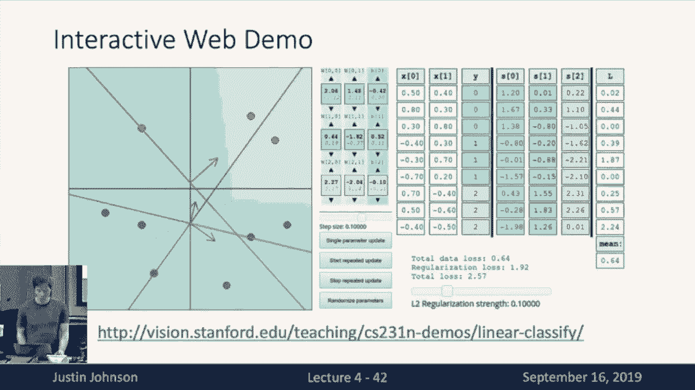

具体做法是：在一个小规模、低维的问题上，同时计算数值梯度和解析梯度，并比较它们是否足够接近。PyTorch等框架也提供了 `gradcheck` 函数来帮助完成这项工作。在完成作业和实际开发中，强烈建议使用梯度检查。

---

## 梯度下降算法 📉

现在，我们终于可以介绍**梯度下降**算法了。其核心思想非常简单，可以用几行伪代码概括：

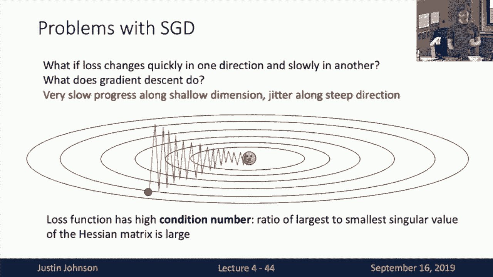

```python
# 梯度下降伪代码
W = random_initialization() # 初始化权重
for i in range(num_iterations):
    grad = compute_gradient(L, W, data) # 计算损失L在W处的梯度
    W = W - learning_rate * grad # 沿负梯度方向更新权重
```

这个算法引入了几个重要的**超参数**：
1.  **权重初始化方法**：如何设置 W 的初始值。
2.  **迭代步数**：算法运行多少次更新。
3.  **学习率 (learning_rate)**：控制每次沿着梯度方向更新权重时的步长大小。这是最重要的超参数之一。

---

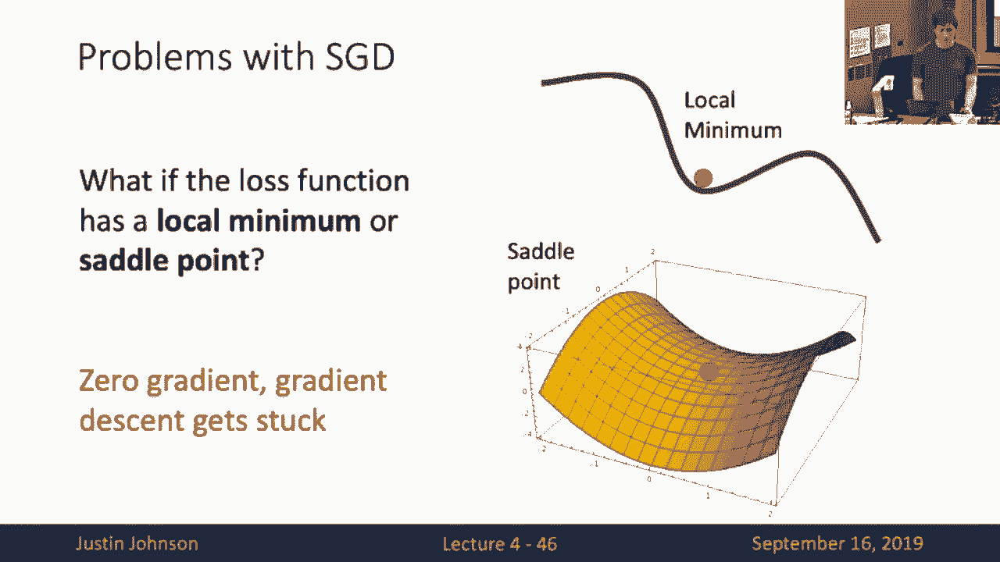

## 随机梯度下降 (SGD) 🎲

上述“朴素”的梯度下降算法（又称**全批量梯度下降**）有一个严重问题：我们的损失函数通常是所有训练样本损失的总和。计算一次梯度就需要遍历整个数据集，当数据集很大时（例如数百万样本），这将极其缓慢。

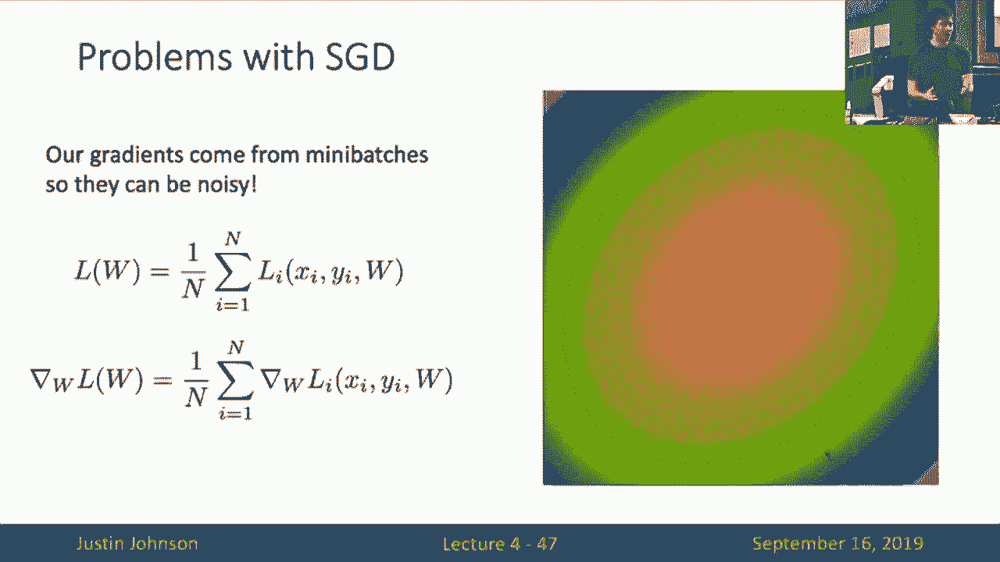

解决方案是使用**随机梯度下降**。其核心思想是：在每次迭代中，我们不计算整个数据集的梯度，而是随机抽取一小部分样本（称为**小批量**，mini-batch），用这个小批量的平均梯度来近似整个数据集的梯度。

**公式**：损失函数可写为期望形式 `L(W) = E_{(x,y)~p_data}[L_i(W)]`。SGD 使用蒙特卡洛估计来近似这个期望和其梯度。

SGD 引入了新的超参数：
*   **批量大小 (batch_size)**：每个小批量包含的样本数。经验法则是：在GPU内存允许的范围内，尽可能使用较大的批量。
*   **数据采样方法**：如何从数据集中抽取小批量。对于分类问题，通常在每个周期（epoch）开始时打乱数据顺序即可。

---

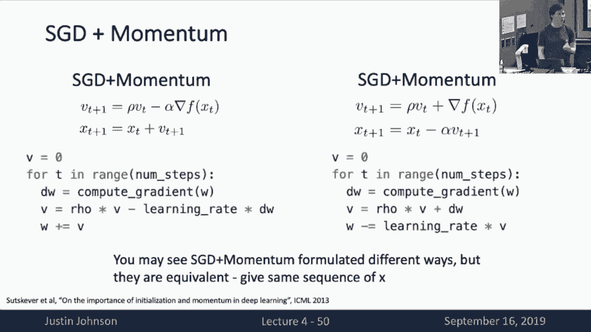

## SGD 可能遇到的问题与改进 🛠️

基本的 SGD 算法在实践中可能会遇到一些问题：

1.  **病态条件（高条件数）**：损失函数在不同方向上的曲率差异很大。学习率设置大了会在陡峭方向振荡，设置小了在平缓方向进展缓慢。
2.  **局部最小值和鞍点**：梯度为零的点可能导致算法停滞。在高维空间中，**鞍点**比局部最小值更常见。
3.  **梯度噪声**：由于使用小批量估计梯度，更新方向存在噪声，导致收敛路径曲折。

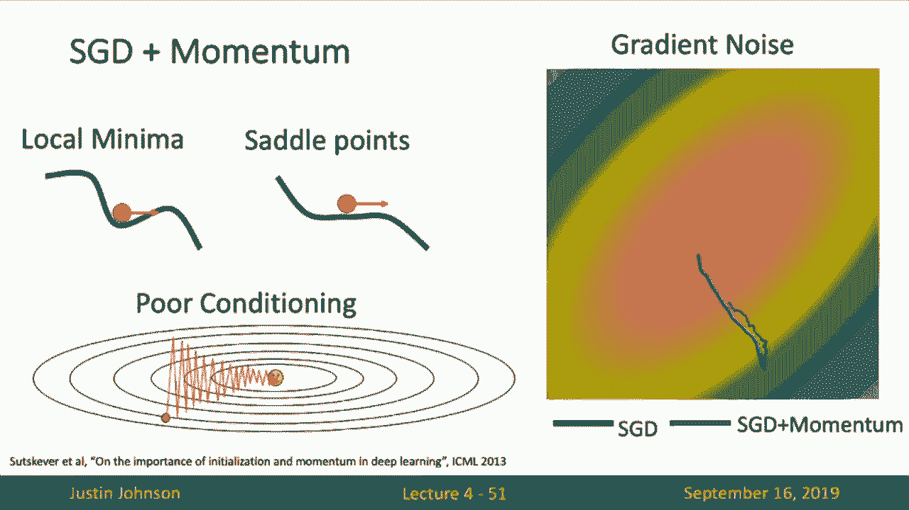

为了克服这些问题，人们开发了 SGD 的改进变体。

---

### SGD + 动量 (Momentum)

动量法引入了物理直觉：想象一个球滚下山坡。它不仅受当前坡度（梯度）影响，还积累了过去移动的“速度”。

**算法核心**：
*   维护一个速度变量 **v**，它是历史梯度的指数加权平均。
*   更新时，沿着速度 **v** 的方向移动，而不是仅仅沿着当前梯度。

**公式**（一种常见形式）：
`v = rho * v + grad`
`W = W - learning_rate * v`
其中 `rho` 是动量系数（如0.9），控制历史速度的衰减。

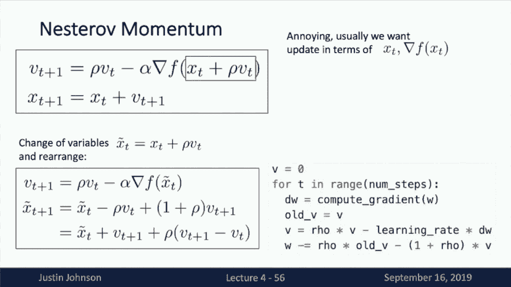

动量法有助于：
*   平滑梯度噪声。
*   帮助冲出平坦区域或鞍点。
*   在条件数高的方向上加速。

---

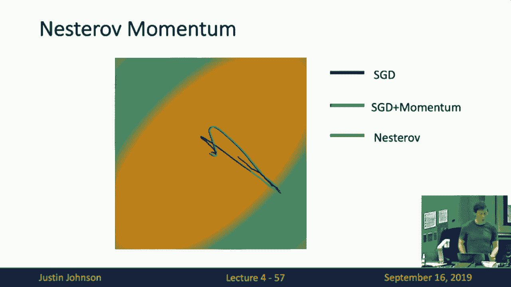

### 涅斯捷罗夫动量 (Nesterov Momentum)

这是动量法的一个变体，具有“前瞻性”。它先根据当前速度“展望”一步，在那个展望点计算梯度，然后结合该梯度更新速度。

**直观理解**：它比标准动量法能更早地感知到地形的变化并进行调整，从而减少振荡。

---

### 自适应学习率算法

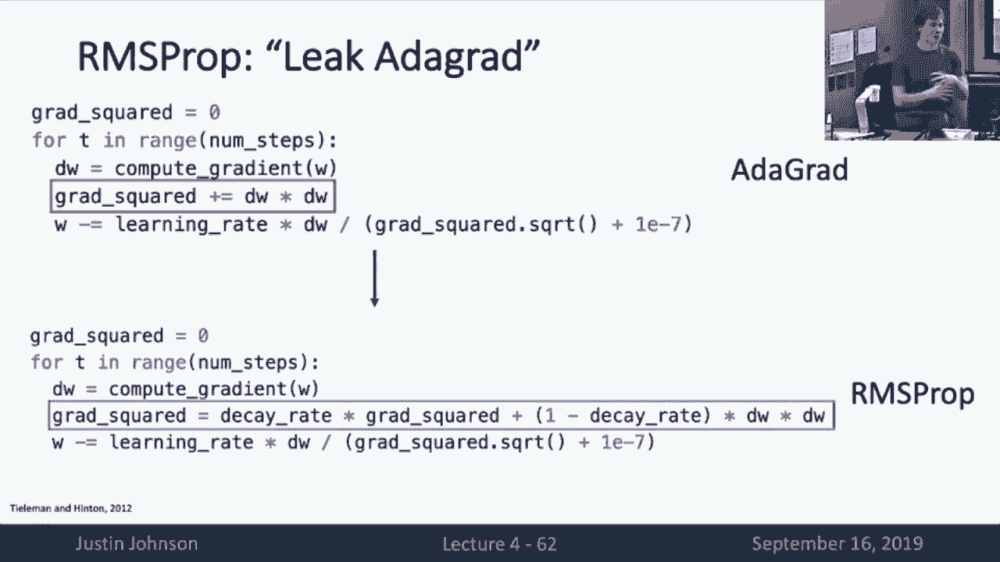

这类算法通过调整每个参数的学习率来改进 SGD。

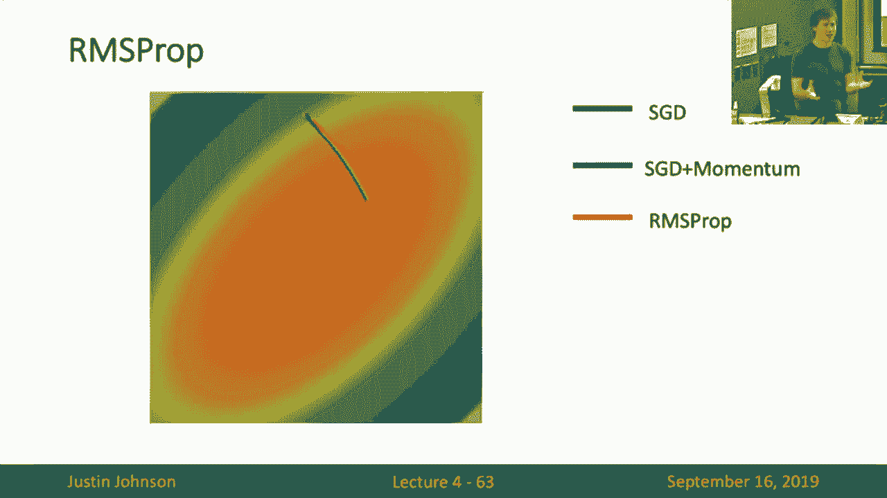

**AdaGrad**：为每个参数累积历史梯度平方。更新时，用累积平方根的倒数来缩放学习率。这会使在频繁更新（梯度大）的参数上学习率变小，在稀疏更新（梯度小）的参数上学习率相对变大。但累积平方和会一直增长，可能导致学习率过早衰减至零。

**RMSProp**：解决了 AdaGrad 学习率衰减过快的问题。它使用**指数衰减移动平均**来累积历史梯度平方，而不是简单求和。这样，历史信息会逐渐淡忘。

**Adam (Adaptive Moment Estimation)**：结合了**动量**和**RMSProp**的思想，是目前最流行、最鲁棒的优化器之一。
*   它同时计算梯度的一阶矩（动量）和二阶矩（梯度平方的移动平均）。
*   包含偏差校正，以解决训练初期矩估计偏向零的问题。

**Adam 的超参数经验值**（一个很好的起点）：
*   `beta1`（一阶矩衰减率）：0.9
*   `beta2`（二阶矩衰减率）：0.999
*   `learning_rate`：1e-3 或 1e-4

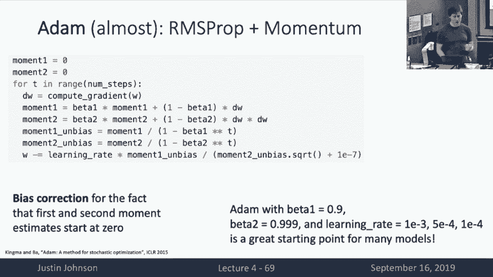

Adam 因其对超参数相对不敏感、在许多任务上表现良好而成为深度学习中的默认优化器之一。另一个常用选择是 SGD + 动量，它有时能获得更好的最终性能，但通常需要更精细的超参数调优。

---

## 二阶优化方法（简要提及） ⚙️

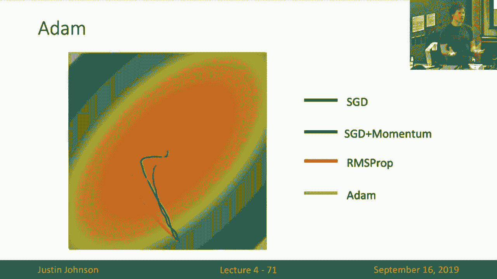

上述方法都只使用了一阶导数（梯度）信息，属于**一阶优化算法**。我们还可以使用二阶导数（海森矩阵，Hessian）信息来构建局部二次近似，从而更智能地选择步长。

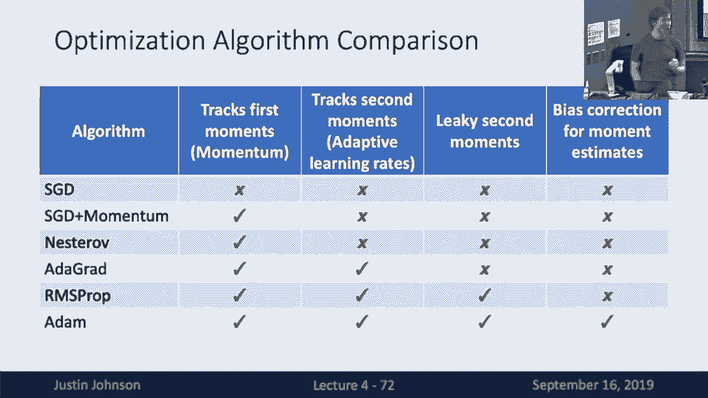

然而，对于高维模型（参数数量 N 很大），海森矩阵的大小是 N×N，存储和求逆的计算成本（O(N³)）过高，使其不适用于大规模深度学习。像 L-BFGS 这样的拟牛顿法是低维问题或非随机问题的好选择，但在深度学习中远不如 SGD 和 Adam 系列算法常用。

---

## 总结 🎓

在本节课中，我们一起学习了机器学习和深度学习的核心——优化。

我们首先明确了优化问题的目标：找到最小化损失函数的权重。然后，我们从最简单的随机搜索出发，引入了强大的**梯度下降**框架，并解释了如何通过**数值梯度**和**解析梯度**来计算更新方向。

为了解决大数据集上的效率问题，我们学习了**随机梯度下降 (SGD)**。为了克服 SGD 的缺陷（如振荡、鞍点、噪声），我们深入探讨了几种改进算法：
*   **SGD + 动量**：通过积累速度来平滑更新。
*   **自适应学习率算法（AdaGrad, RMSProp）**：为每个参数调整学习率。
*   **Adam**：结合动量和自适应学习率的优势，是实践中强大且鲁棒的选择。

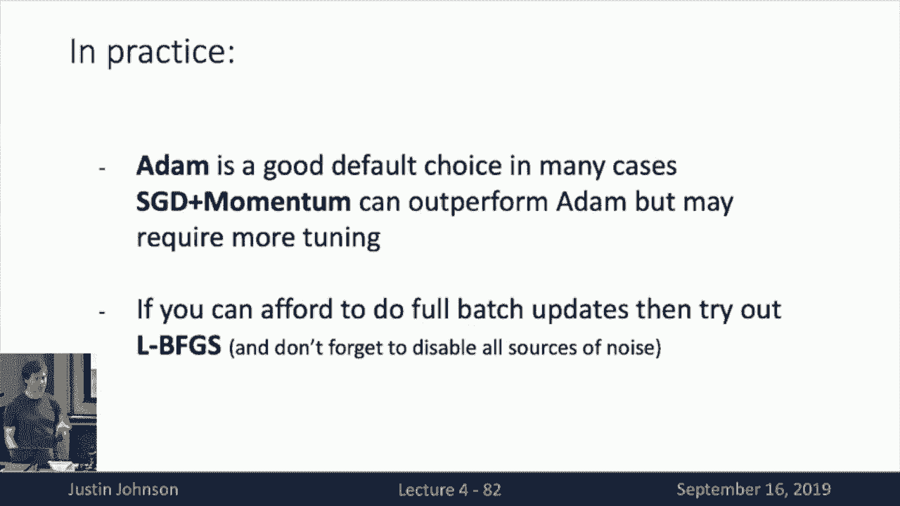

最后，我们简要了解了二阶优化方法及其在大规模应用中的局限性。

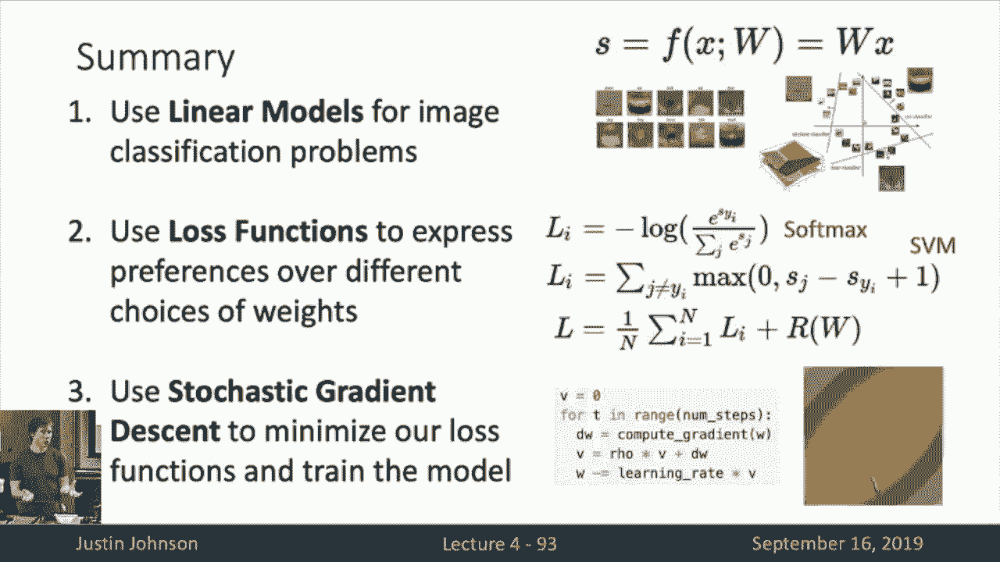

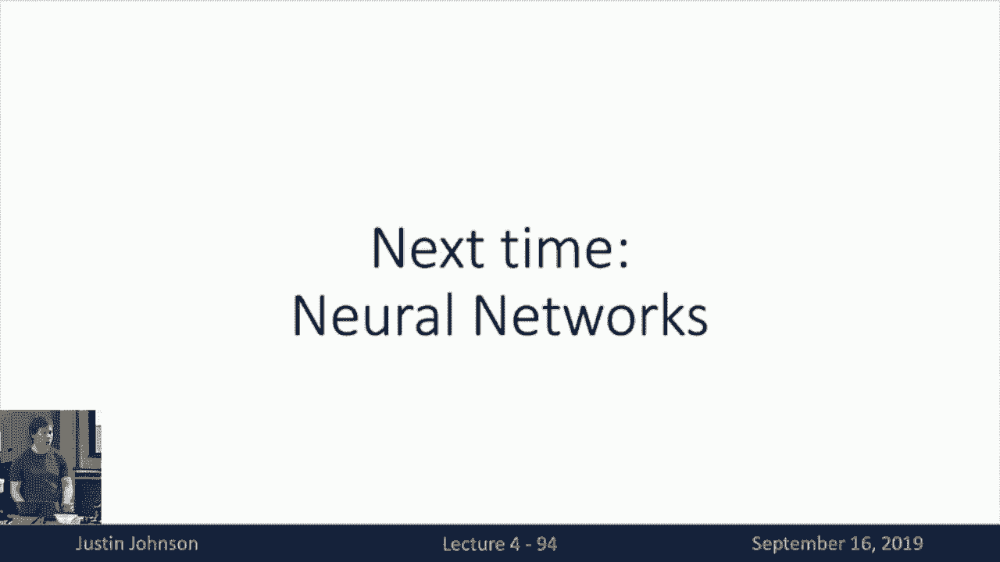

现在，我们已经掌握了使用线性模型、损失函数和优化算法来解决图像分类问题的全套工具。在下一节课中，我们将把这些概念结合起来，最终开启**神经网络**的大门，用更强大的非线性模型来替代线性分类器。