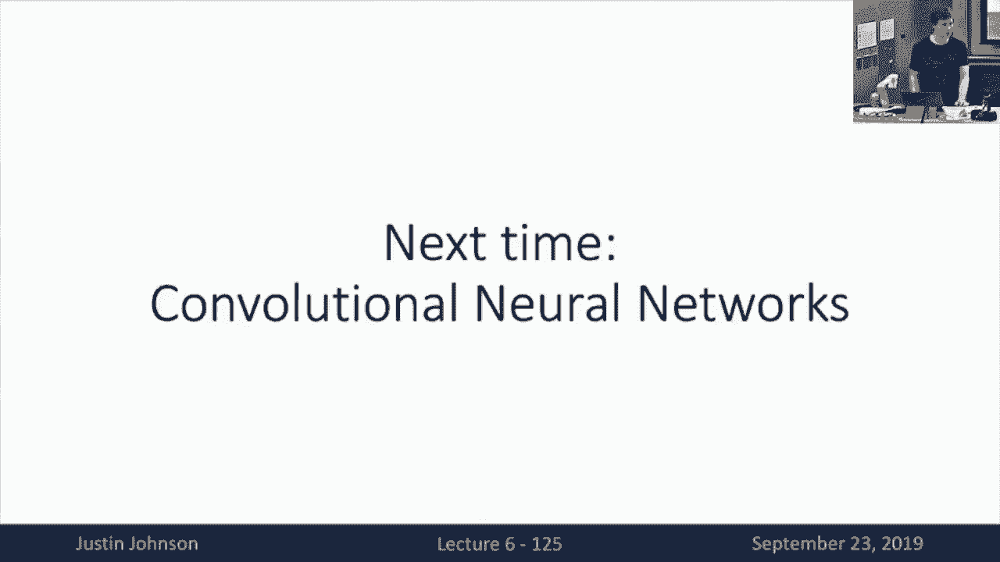

# 6：L6 - 反向传播 📚

在本节课中，我们将要学习**反向传播**。这是一种用于计算复杂神经网络模型中梯度的核心算法。通过将计算过程表示为**计算图**，我们可以高效地自动计算损失函数相对于所有模型参数的导数，从而利用随机梯度下降等优化算法来训练模型。

---

## 🧠 背景与动机

上一节我们介绍了神经网络，并看到了其强大的非线性表达能力。然而，我们也面临一个问题：如何计算这些复杂模型损失函数的梯度？

一种朴素的方法是手动在纸上推导梯度表达式。然而，这种方法存在几个问题：
*   它极其繁琐，对于复杂的损失函数（如交叉熵损失或SVM损失）和模型结构，推导过程会变得非常冗长。
*   它无法扩展到复杂模型。对于像AlexNet这样的深度卷积神经网络，手动推导梯度是不现实的。
*   它缺乏模块化设计。每次更改模型架构、损失函数或正则化器时，都需要从头开始重新推导所有梯度。

在深度学习中，我们倾向于使用**计算图**这一数据结构来帮助我们解决梯度计算的难题。

---

## 🗺️ 计算图

计算图是一种有向图，用于表示模型内部执行的计算。图的左侧是输入节点（如数据 `X` 和权重 `W`），随着我们从左向右遍历，节点代表了计算过程中的基本操作（如矩阵乘法、激活函数、损失计算等），图的右侧最终输出标量损失 `L`。

对于线性模型，计算图可能看起来很简单，但对于复杂的深度模型（如包含多个卷积层和非线性的AlexNet，或更复杂的神经图灵机），计算图变得庞大而复杂。这时，我们绝对需要依赖计算图形式化和图遍历算法来自动计算梯度。

---

## 🔄 前向传播与反向传播：一个简单例子

为了理解如何利用计算图计算梯度，我们来看一个简单的标量函数例子：`f(x, y, z) = (x + y) * z`。

假设我们想在点 `(x=-2, y=5, z=-4)` 处计算函数值及其梯度。

### 前向传播
在前向传播中，我们按从左到右的顺序执行图中节点指定的所有操作，从输入值计算输出值。
1.  计算 `q = x + y = -2 + 5 = 3`
2.  计算 `f = q * z = 3 * (-4) = -12`

### 反向传播
在反向传播中，我们的目标是计算输出 `f` 相对于每个输入 (`x`, `y`, `z`) 的导数。我们从右向左遍历图，从输出开始。

以下是计算过程，我们通常将每个节点的前向计算值写在线上方，反向传播的梯度值写在线下方。

1.  **基础情况**：计算 `df/df = 1`。
2.  **计算 `df/dz`**：我们知道 `f = q * z`。局部梯度（`f` 对 `z` 的导数）是 `q`。查前向传播结果，`q = 3`。因此，`df/dz = q = 3`。
3.  **计算 `df/dq`**：同样，`f = q * z`。局部梯度（`f` 对 `q` 的导数）是 `z`。查前向传播结果，`z = -4`。因此，`df/dq = z = -4`。
4.  **计算 `df/dy`**：这里 `y` 不直接与 `f` 相连，需要通过中间变量 `q`。我们需要使用**链式法则**：`df/dy = (dq/dy) * (df/dq)`。
    *   `dq/dy` 是局部梯度。由于 `q = x + y`，所以 `dq/dy = 1`。
    *   `df/dq` 是上游梯度，我们已计算出为 `-4`。
    *   因此，`df/dy = 1 * (-4) = -4`。
5.  **计算 `df/dx`**：过程与计算 `df/dy` 完全对称。`df/dx = (dq/dx) * (df/dq) = 1 * (-4) = -4`。

通过这个简单的例子，我们可以看到如何利用计算图来机械化地计算复杂函数的导数：前向传播从左到右计算所有值，反向传播从右到左逐步计算每个节点的梯度。

---

## 🧩 模块化视角：节点的局部计算

反向传播机制的一个强大之处在于其模块化。我们可以将整个计算图的计算分解为每个节点的局部计算。

对于图中的任何一个节点：
*   **前向计算**：节点接收输入，应用其局部函数，产生输出，并将输出传递给后续节点。
*   **反向计算**：节点从后续节点接收一个**上游梯度**（即最终损失相对于该节点输出的导数 `dL/dz`）。然后，节点计算其**局部梯度**（即其输出相对于每个输入的导数 `dz/dx`, `dz/dy`）。最后，通过将上游梯度与每个局部梯度相乘，得到**下游梯度**（即最终损失相对于该节点每个输入的导数 `dL/dx`, `dL/dy`），并将这些下游梯度传递给前驱节点。

这种设计的美妙之处在于，每个节点只需要关心自己的局部计算，而不需要了解整个图的全局结构。通过在所有节点上聚合这种局部处理，我们就能计算出整个图的全局梯度。

---

## 🧮 实现反向传播的模式

有两种主要方式来实现反向传播。

### 1. 扁平化实现
在这种模式下，我们编写一个单一的Python函数来计算整个计算图（如前向传播计算损失）。然后，我们编写对应的反向传播代码，它看起来像是前向传播代码的“倒置”版本。

以下是一个示意性的例子（对应于一个类似Sigmoid的计算图）：

```python
# 前向传播
def forward(x, w, b):
    s0 = x * w
    s1 = s0 + b
    s2 = 1.0 / (1.0 + np.exp(-s1)) # Sigmoid
    L = -np.log(s2) # 假设是二分类交叉熵损失的一部分
    return L

# 反向传播 (扁平化实现)
def backward(x, w, b):
    # 前向传播 (需要缓存中间变量)
    s0 = x * w
    s1 = s0 + b
    s2 = 1.0 / (1.0 + np.exp(-s1))
    L = -np.log(s2)

    # 反向传播 (从后往前，每一步对应前向的一步)
    grad_L = 1.0 # 基础情况 dL/dL
    grad_s2 = -1.0 / s2 * grad_L # 对应 L = -log(s2)
    grad_s1 = s2 * (1 - s2) * grad_s2 # 对应 s2 = sigmoid(s1)，这是Sigmoid导数的简便形式
    grad_b = 1.0 * grad_s1 # 对应 s1 = s0 + b
    grad_s0 = 1.0 * grad_s1
    grad_w = x * grad_s0 # 对应 s0 = x * w
    grad_x = w * grad_s0
    return grad_x, grad_w, grad_b
```

这种方法对于完成特定作业（如编写SVM或两层神经网络的梯度）非常直接有效。通过练习，你几乎可以不用在纸上推导数学公式，仅通过“反转”前向传播代码就能写出正确的梯度代码。

### 2. 模块化API实现
这是一种更工业级、模块化的方法，它更贴合我们之前讨论的“节点局部计算”视角。我们定义一个计算图对象，该对象能够通过对图中所有节点进行拓扑排序，在前向传播时调用每个节点的 `forward` 操作，在反向传播时调用每个节点的 `backward` 操作。

以PyTorch为例，你可以通过子类化 `torch.autograd.Function` 来定义自己的计算节点：

```python
import torch

class MyAdd(torch.autograd.Function):
    @staticmethod
    def forward(ctx, x, y):
        # ctx 是上下文对象，用于存储反向传播需要的信息
        ctx.save_for_backward(x, y)
        z = x + y
        return z

    @staticmethod
    def backward(ctx, grad_z):
        # grad_z 是上游梯度 dL/dz
        x, y = ctx.saved_tensors
        # 局部梯度： dz/dx = 1, dz/dy = 1
        grad_x = 1 * grad_z
        grad_y = 1 * grad_z
        return grad_x, grad_y

# 使用自定义函数
x = torch.tensor([1.0], requires_grad=True)
y = torch.tensor([2.0], requires_grad=True)
z = MyAdd.apply(x, y)
loss = z.sum()
loss.backward()
print(x.grad, y.grad) # 输出: tensor([1.]) tensor([1.])
```

像PyTorch、TensorFlow这样的框架，其核心自动微分引擎就是由大量这样成对的、定义了前向和反向操作的函数构成的。

---

## 📐 向量与张量的反向传播

在实践中，我们处理的是向量、矩阵甚至更高维的张量，而不仅仅是标量。但核心思想不变。

*   **梯度**：当函数输入是向量，输出是标量（如损失 `L`）时，梯度 `dL/dx` 是一个与输入 `x` 形状相同的向量。
*   **雅可比矩阵**：当函数输入和输出都是向量时，导数是一个矩阵，称为雅可比矩阵，其元素 `J[i, j]` 表示输出第 `i` 个元素对输入第 `j` 个元素的导数。
*   **张量情况**：对于输入输出为任意维张量的函数，其局部导数是一个高阶张量（可以理解为将输入和输出的所有元素展开后的雅可比矩阵）。

在反向传播中，对于向量/张量值的节点：
1.  我们接收的上游梯度 `dL/dz` 是一个与节点输出 `z` 形状相同的张量。
2.  局部梯度是雅可比矩阵（或高阶张量）。
3.  我们需要计算的下游梯度 `dL/dx` 是与输入 `x` 形状相同的张量。
4.  计算下游梯度的公式在本质上仍然是链式法则：`dL/dx = (dz/dx)^T * (dL/dz)`，这里 `dz/dx` 是雅可比矩阵，`*` 表示矩阵乘法。对于张量，这对应于一种广义的“张量缩并”操作。

**关键技巧**：我们几乎从不显式构造庞大的（且通常是稀疏的）雅可比矩阵。相反，我们寻找一种隐式、高效的方式来计算这个“雅可比矩阵-向量乘积”。

**示例：矩阵乘法的反向传播**
假设节点计算 `Y = X @ W`，其中 `X` 形状为 `(N, D)`，`W` 形状为 `(D, M)`，`Y` 形状为 `(N, M)`。
*   接收上游梯度 `dL/dY`，形状为 `(N, M)`。
*   经过推导（可通过分析单个输入元素对输出的影响，或使用形状匹配启发法），下游梯度为：
    *   `dL/dX = (dL/dY) @ W.T` （形状 `(N, D)`）
    *   `dL/dW = X.T @ (dL/dY)` （形状 `(D, M)`）
    这些公式正是高效计算隐式雅可比矩阵-向量积的方式。

---

## 🧪 其他主题

### 前向模式自动微分
我们讨论的反向传播算法，因为是从输出向输入反向计算梯度，被称为**反向模式自动微分**。还有一种**前向模式自动微分**，它从一个标量输入开始，向输出方向计算该输入对图中所有中间变量和输出的导数。虽然在某些科学计算场景中有用，但主流深度学习框架主要实现的是反向模式。

### 高阶导数
由于反向传播操作本身（如果实现得当）也是由可微的原始操作组成的，因此我们可以对计算图进行**二次反向传播**，从而计算损失函数的高阶导数（如Hessian矩阵向量积）。这为实现涉及梯度正则化等更复杂的优化技术提供了可能。

---

## 📝 总结

本节课我们一起学习了反向传播的核心思想：
*   我们使用**计算图**来表示复杂函数。
*   通过**前向传播**计算函数值，通过**反向传播**高效计算梯度。
*   反向传播的核心是**链式法则**的模块化应用，每个节点只需计算局部梯度并与上游梯度相乘。
*   实现上，可以采用**扁平化**（倒置前向代码）或**模块化API**的方式。
*   该方法可以推广到处理向量和张量，关键在于高效计算隐式的雅可比矩阵-向量积。




现在，我们已经掌握了计算线性分类器和神经网络梯度的方法。然而，目前我们的网络在处理图像时，需要将像素拉伸成向量，从而破坏了图像的空间结构信息。这看起来不是一个好方法，我们将在下一讲中解决这个问题。