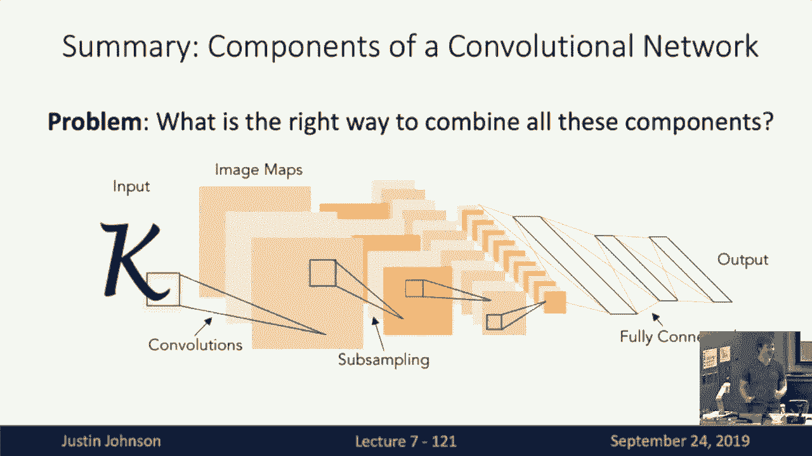

# 7：L7 - 卷积神经网络教程 📚

在本节课中，我们将学习卷积神经网络（Convolutional Neural Networks, CNNs）。这是一种专门用于处理图像数据的主要模型类别。我们将从回顾上一节的内容开始，逐步介绍卷积神经网络的核心概念、基本操作及其在图像处理中的应用。

## 回顾：反向传播与计算图 🔄

上一节我们介绍了反向传播算法，该算法可用于计算任意复杂计算图中的梯度。我们了解到，使用计算图数据结构可以非常方便地计算梯度，而无需推导复杂的表达式。通过前向传播计算输出，再通过反向传播计算梯度，我们可以轻松处理任意复杂度的表达式。

在反向传播算法中，每个函数都需要实现一个局部操作符，该操作符在前向传播中根据输入计算输出，在反向传播中根据上游梯度计算相对于输入的梯度。这种模块化的门API使得我们可以轻松地将新类型的函数插入到计算图中。

## 从全连接网络到卷积神经网络 🚀

到目前为止，我们已经多次讨论了线性分类器和全连接神经网络分类器。全连接神经网络分类器是一个非常强大的模型，可以灵活地表示许多不同的函数。然而，这两种分类器都存在一个问题：它们都没有尊重输入图像的二维空间结构。

无论是线性分类器还是全连接神经网络，都需要将具有空间结构的输入图像展平为一个长向量，然后输入到模型中。这种做法破坏了图像的空间结构，似乎不是处理图像数据的最佳方式。为了充分利用输入图像数据的空间结构，我们需要定义一些新的操作符，这些操作符能够处理图像或具有空间结构的数据。

## 卷积神经网络的基本操作 🛠️

在全连接神经网络中，我们熟悉两个基本组件：全连接层和非线性激活函数（如ReLU）。当我们从全连接神经网络转向卷积神经网络时，需要引入几个新的基本操作，这些操作可以在计算图或模型中使用。

以下是卷积神经网络中常用的三种操作：

1. **卷积层（Convolution Layers）**
2. **池化层（Pooling Layers）**
3. **归一化层（Normalization Layers）**

### 卷积层：保留空间结构 🧩

首先，让我们看看如何扩展全连接层的概念，使其能够保留输入的空间结构。全连接层在前向传播中接收一个向量（例如展平的CIFAR-10图像，大小为3072），并通过与权重矩阵相乘产生输出向量。

卷积层则输入一个三维张量（即三维体积），而不是展平的向量。例如，对于CIFAR-10图像，输入体积可能是一个3x32x32的三维张量，其中3表示通道数（红、绿、蓝颜色通道），32x32表示图像的高度和宽度。

卷积层的权重矩阵（有时称为滤波器）也具有三维空间结构。例如，一个卷积滤波器的大小可能为3x5x5。这意味着滤波器的深度维度必须与输入张量的深度维度匹配。卷积操作始终覆盖输入张量的整个深度。

为了计算输出，我们将这个3x5x5的滤波器滑动到输入张量的所有空间位置，并在每个位置计算滤波器与输入张量对应元素的点积。这类似于全连接网络中的内积，但现在是滤波器与输入张量局部空间块之间的内积。

例如，在一个3x5x5的输入图像块上，点积涉及75个元素。通常，我们还会添加一个偏置项。通过在每个位置计算点积，我们得到一个标量，表示该位置与滤波器的匹配程度。所有位置的点积结果组合成一个输出张量。

如果我们有多个滤波器，卷积层将涉及与一组不同滤波器的卷积。每个滤波器都会产生一个激活图，显示输入图像对该滤波器的响应程度。这些激活图可以连接成一个三维张量，其深度维度等于滤波器的数量。

卷积层通常包含偏置项，每个滤波器对应一个偏置值。输出张量可以看作是一组特征图，也可以看作是一个空间网格，其中每个位置都有一个特征向量，表示该位置输入张量的结构或外观。

### 卷积层的参数与计算 📊

卷积层接收一个四维张量作为输入，形状为`(N, C_in, H, W)`，其中N是批次大小，C_in是输入通道数，H和W是空间维度。输出也是一个四维张量，形状为`(N, C_out, H', W')`，其中C_out是输出通道数，H'和W'是新的空间大小。

卷积层的超参数包括滤波器大小、滤波器数量、填充和步幅。滤波器大小通常为正方形（如3x3或5x5）。填充用于在图像边界周围添加零值，以防止空间尺寸缩小。步幅控制滤波器滑动的间隔。

输出空间大小的计算公式为：

```
H' = floor((H - K + 2P) / S) + 1
W' = floor((W - K + 2P) / S) + 1
```

其中，K是滤波器大小，P是填充大小，S是步幅。

### 卷积层的常见设置 ⚙️

以下是一些常见的卷积层设置：

- 使用方形滤波器（如3x3、5x5）。
- 使用相同填充（padding = (K-1)/2），使输出空间大小与输入相同。
- 步幅为1的卷积层保持空间大小不变。
- 步幅为2的卷积层将空间大小减半。

### 1x1卷积的特殊用途 🔍

1x1卷积是一种特殊的卷积操作，其滤波器大小为1x1。它用于改变输入张量的通道数，而不改变空间大小。1x1卷积可以看作是在每个空间位置独立应用的全连接层，用于调整特征向量的维度。

### 多维卷积 🌐

除了二维卷积，还有一维和三维卷积：

- **一维卷积**：用于处理序列数据（如文本或音频波形）。输入为二维张量（通道数 x 序列长度），滤波器为一维。
- **三维卷积**：用于处理三维数据（如点云或体积数据）。输入为四维张量（通道数 x 深度 x 高度 x 宽度），滤波器为三维。

## 池化层：下采样操作 📉

池化层用于在神经网络中进行下采样，不涉及可学习参数。池化操作类似于卷积，但在每个局部区域应用一个固定的池化函数（如最大值或平均值），将区域内的值合并为一个输出值。

常见的池化操作是2x2最大池化，步幅为2。这意味着将输入张量划分为2x2的非重叠区域，并在每个区域中取最大值作为输出。最大池化具有一定的平移不变性，因为即使输入图像中的物体稍有移动，区域内的最大值可能保持不变。

池化层的超参数包括核大小和步幅。与卷积层类似，池化操作会减少空间维度，同时保持深度不变。

## 归一化层：稳定训练过程 ⚖️

归一化层用于稳定深度神经网络的训练过程。最常见的归一化方法是批归一化（Batch Normalization）。批归一化的思想是对每个层的输出进行标准化，使其具有零均值和单位方差，从而减少内部协变量偏移（Internal Covariate Shift）。

批归一化在训练时使用批次数据的均值和方差进行标准化，并在测试时使用训练过程中累积的移动均值和方差。此外，批归一化还引入了可学习的缩放和偏移参数，允许网络自行调整均值和方差。

批归一化在卷积网络中的实现与全连接网络类似，但均值和方差是在批次和空间维度上计算的。批归一化可以显著加速训练过程，并允许使用更高的学习率。

然而，批归一化在训练和测试时的行为不同，这可能导致一些问题。为了解决这个问题，还有一些其他的归一化方法，如层归一化（Layer Normalization）、实例归一化（Instance Normalization）和组归一化（Group Normalization）。这些方法在不同维度上进行归一化，适用于不同的应用场景。

## 经典卷积网络设计 🏛️

经典的卷积网络设计通常由多个卷积层、激活函数、池化层和全连接层组成。例如，LeNet-5是一个早期的卷积网络，用于手写数字识别。其结构包括卷积层、ReLU激活函数、池化层和全连接层。

在卷积网络中，随着层数的增加，空间尺寸逐渐减小，而深度（通道数）逐渐增加。这种设计使得网络能够在不同尺度上提取特征，同时保持计算效率。

## 总结 🎯

本节课我们一起学习了卷积神经网络的基本概念和核心操作。我们从全连接网络的局限性出发，引入了卷积层、池化层和归一化层，这些操作使得神经网络能够有效处理图像数据的空间结构。卷积层通过滑动滤波器提取局部特征，池化层进行下采样并增加平移不变性，归一化层稳定训练过程并加速收敛。

通过组合这些操作，我们可以构建强大的卷积神经网络，用于图像分类、目标检测等任务。在下一节课中，我们将深入探讨如何设计和训练高效的卷积神经网络架构。

---




希望本教程能帮助你理解卷积神经网络的基本原理和操作。如果你有任何问题或需要进一步的解释，请随时提问！ 😊