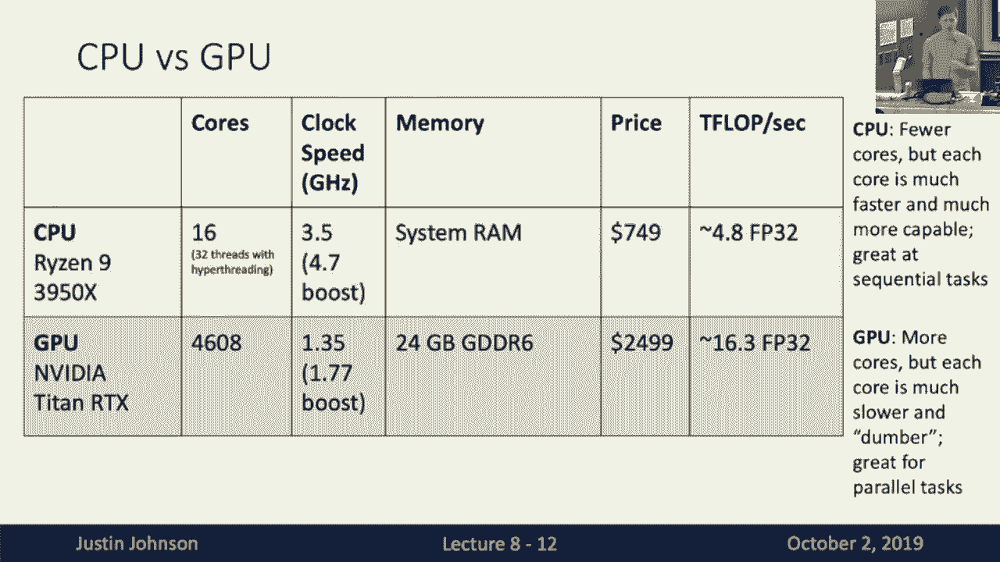
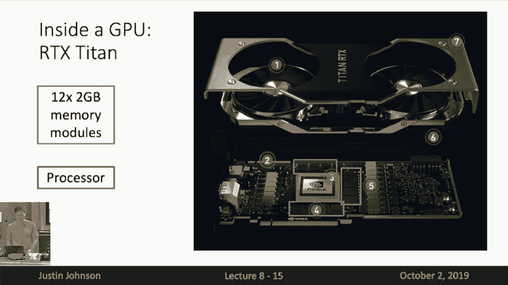
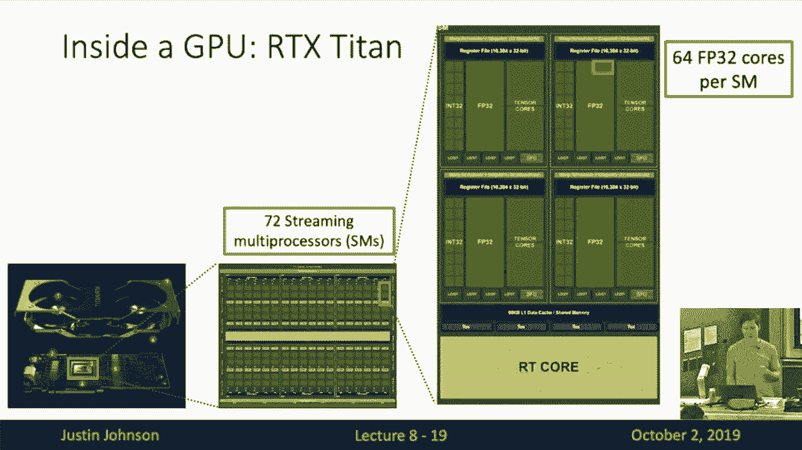
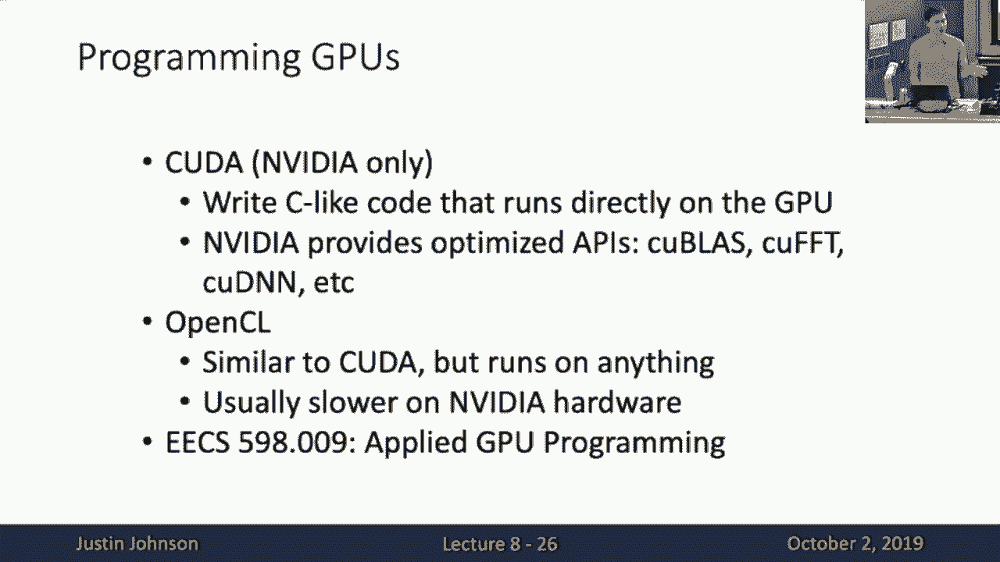
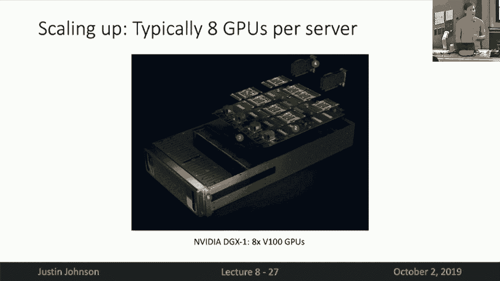
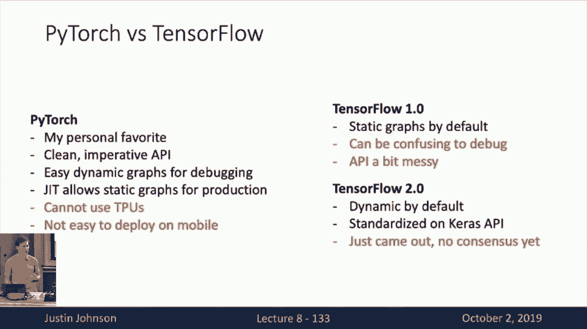
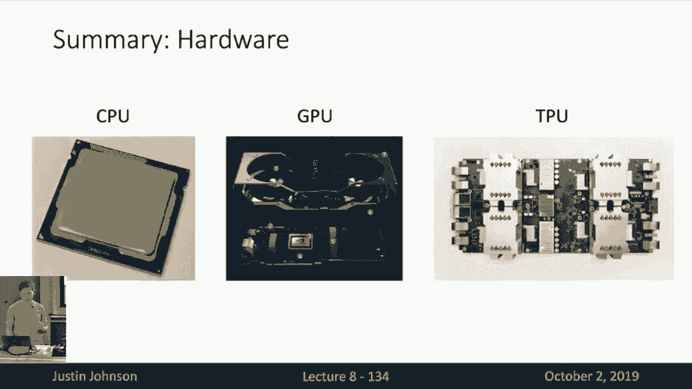
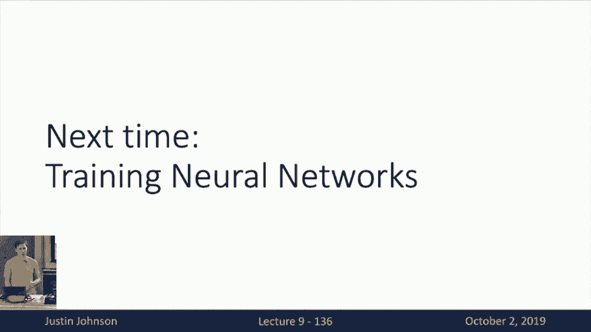

# 9：L9 - 深度学习硬件与软件 🖥️⚙️

在本节课中，我们将学习深度学习模型运行所依赖的硬件和软件系统。我们将首先探讨硬件，特别是CPU和GPU的区别与演进，然后深入了解深度学习软件框架，如PyTorch和TensorFlow，以及它们如何利用计算图来简化模型构建和训练。

---

## 硬件：CPU vs. GPU vs. TPU 💻

上一节我们介绍了深度学习模型的各种架构，本节中我们来看看这些模型最终运行的实际硬件系统。



### 计算成本趋势 📈



以下是CPU和GPU在计算能力（以每美元千兆浮点运算次数衡量）上的历史趋势：



*   **CPU**：多年来计算成本稳步下降，但进步相对平缓。
*   **GPU**：自2006年NVIDIA推出支持CUDA的GPU后，计算成本急剧下降，尤其在2012年后与CPU拉开巨大差距。这使得训练像AlexNet这样的大型模型成为可能。

### 核心架构对比 🔍

CPU和GPU在设计哲学上有根本不同：

*   **CPU**：核心数量较少（例如16核），但每个核心非常强大，时钟频率高（例如3.5 GHz），擅长处理复杂、串行的任务。
*   **GPU**：拥有大量核心（例如4608个CUDA核心），但每个核心相对简单，时钟频率较低（例如1.35 GHz），专为大规模并行计算设计。

### GPU内部揭秘 🧠

现代GPU（如NVIDIA RTX Titan）本身就像一个微型计算机：



1.  **独立设备**：拥有自己的散热风扇和专用显存（例如24GB）。
2.  **流式多处理器**：GPU的核心计算单元，一个GPU包含多个SMs（例如72个）。
3.  **计算核心**：每个SM内部包含许多32位浮点核心（FP32 Cores）和**张量核心**。



**张量核心**是NVIDIA为深度学习专门设计的硬件，能在单个时钟周期内完成一个4x4矩阵乘法并加上偏置项（`A * B + C`）。它使用混合精度计算（乘法用16位浮点，累加用32位浮点），能极大提升矩阵乘法和卷积运算的速度。

**公式**：张量核心单次操作计算量 = 2 * (4 * 4 * 4) = 128次浮点运算（乘加各算一次）。

### 超越单卡：规模化与TPU 🚀

为了处理更庞大的模型和数据集，计算需要超越单块GPU：

*   **多GPU服务器**：常见的服务器配置包含8块GPU，通过并行计算加速训练。
*   **TPU**：谷歌推出的专用深度学习硬件。Cloud TPU v3单个设备提供420 TeraFLOPS算力，并能组成**TPU Pod**（例如256个TPUv3），提供超过100 PetaFLOPS的聚合算力。目前TPU主要与TensorFlow框架配合使用。

**注意**：消费级GPU与计算级GPU在**显存容量**和**显存带宽**上都有差异，后者对于需要频繁进行数据交换的深度学习任务至关重要。

---

## 软件：深度学习框架 🛠️

了解了硬件基础后，我们来看看如何通过软件框架高效地利用这些硬件。

### 框架的核心诉求 ✅

一个优秀的深度学习框架应具备以下三个关键特性：

1.  **快速原型设计**：提供丰富的预构建层和工具。
2.  **自动梯度计算**：基于计算图抽象，自动通过反向传播计算梯度。
3.  **硬件透明性**：轻松在GPU、TPU等不同硬件上运行代码，无需用户关心底层细节。

### yTorch 的核心抽象层次 🐍

PyTorch 提供了三种不同层次的抽象来构建神经网络：

1.  **张量 API**：基础层次，类似于支持GPU的NumPy多维数组。在前三次作业中我们主要使用这一层。
2.  **自动求导**：核心层次，通过设置 `requires_grad=True` 自动构建计算图并计算梯度。
3.  **神经网络模块**：面向对象的高级层次，通过 `nn.Module` 等类来组织网络层和参数。

### 计算图：动态 vs. 静态 🔄

这是深度学习框架的一个核心设计选择：

*   **动态计算图**：**PyTorch默认模式**。每次前向传播都会实时构建一个新的计算图，执行完后丢弃。优点是与Python控制流（如循环、条件语句）无缝集成，**调试直观**。
*   **静态计算图**：**TensorFlow 1.x 默认模式**。先定义并编译一个固定的计算图结构，然后多次执行。优点是可以进行图优化提升性能，并且模型**更容易序列化和部署**到非Python环境（如C++）。

**PyTorch** 也通过 `torch.jit.script` 装饰器支持将代码编译为静态图。**TensorFlow 2.0** 则转向以动态图（Eager Execution）为默认模式，并通过 `@tf.function` 装饰器支持静态图编译。

### 框架代码示例对比 📝

以下是使用不同抽象层次和框架训练一个两层全连接网络的示例：

**1. 仅使用PyTorch张量API（手动计算梯度）**
```python
# 初始化数据、权重
x = torch.randn(N, D_in)
y = torch.randn(N, D_out)
w1 = torch.randn(D_in, H)
w2 = torch.randn(H, D_out)
# 前向传播
h = x.mm(w1)
h_relu = h.clamp(min=0)
y_pred = h_relu.mm(w2)
loss = (y_pred - y).pow(2).sum()
# 手动反向传播（计算梯度）
grad_y_pred = 2.0 * (y_pred - y)
grad_w2 = h_relu.t().mm(grad_y_pred)
grad_h_relu = grad_y_pred.mm(w2.t())
grad_h = grad_h_relu.clone()
grad_h[h < 0] = 0
grad_w1 = x.t().mm(grad_h)
# 梯度下降更新（需在torch.no_grad()上下文中）
with torch.no_grad():
    w1 -= learning_rate * grad_w1
    w2 -= learning_rate * grad_w2
```

**2. 使用PyTorch自动求导**
```python
w1 = torch.randn(D_in, H, requires_grad=True)
w2 = torch.randn(H, D_out, requires_grad=True)
# 前向传播（自动记录计算图）
y_pred = x.mm(w1).clamp(min=0).mm(w2)
loss = (y_pred - y).pow(2).sum()
# 一键反向传播，自动计算w1.grad和w2.grad
loss.backward()
# 更新权重（需清零梯度）
with torch.no_grad():
    w1 -= learning_rate * w1.grad
    w2 -= learning_rate * w2.grad
    w1.grad.zero_() # 重要：清零梯度
    w2.grad.zero_()
```

**3. 使用PyTorch nn.Module 和优化器**
```python
model = torch.nn.Sequential(
    torch.nn.Linear(D_in, H),
    torch.nn.ReLU(),
    torch.nn.Linear(H, D_out),
)
loss_fn = torch.nn.MSELoss(reduction='sum')
optimizer = torch.optim.SGD(model.parameters(), lr=learning_rate)
# 训练循环
y_pred = model(x)
loss = loss_fn(y_pred, y)
optimizer.zero_grad() # 清零梯度
loss.backward()       # 反向传播
optimizer.step()      # 更新参数
```

**4. 使用TensorFlow 2.0 (Eager模式)**
```python
w1 = tf.Variable(tf.random.normal((D_in, H)))
w2 = tf.Variable(tf.random.normal((H, D_out)))
with tf.GradientTape() as tape:
    y_pred = tf.matmul(tf.nn.relu(tf.matmul(x, w1)), w2)
    loss = tf.reduce_sum(tf.square(y_pred - y))
grads = tape.gradient(loss, [w1, w2]) # 计算梯度
# 手动更新
for w, g in zip([w1, w2], grads):
    w.assign_sub(learning_rate * g)
```

### 框架选择小结 🤔

*   **PyTorch**：**研究首选**。动态图设计使得代码灵活、调试简单，与Python生态结合紧密。在学术界和研究中非常流行。
*   **TensorFlow**：**生产部署强大**。拥有强大的生态系统（如TensorBoard可视化工具）、更好的移动端支持，并能使用TPU。TensorFlow 2.0 吸收了PyTorch的优点，变得更容易使用。

---

## 总结 📚

本节课中我们一起学习了深度学习的硬件和软件基础。

在硬件方面，我们了解了CPU、GPU和TPU的不同设计理念与性能特点，特别是GPU的并行架构和张量核心对深度学习的加速作用。

在软件方面，我们探讨了PyTorch和TensorFlow等框架如何通过计算图抽象来简化模型的构建、训练和部署，并比较了动态计算图与静态计算图的优缺点。







掌握这些知识将帮助你根据任务需求（快速实验 vs. 生产部署）选择合适的工具，并更深入地理解你的模型是如何被执行的。