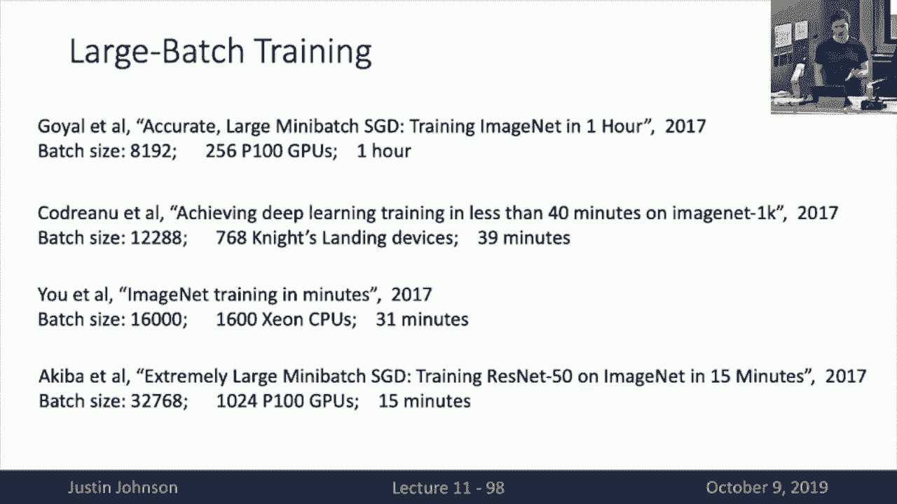

# 11：L11- 训练神经网络(下) 🧠

在本节课中，我们将继续探讨训练神经网络时所需的各种实用技巧和策略。上一节我们介绍了一次性设置选择，如激活函数、数据预处理、权重初始化和正则化等。本节中，我们将关注训练过程中的动态调整、超参数选择、模型集成与迁移学习，以及如何将训练扩展到大规模计算环境。

## 学习率调度 📉

上一节我们介绍了优化算法中的学习率，它是深度学习模型中最重要的超参数之一。本节中我们来看看如何通过调整学习率来优化训练过程。

学习率设置不当可能导致训练失败。设置过高，损失可能迅速爆炸至无穷大；设置过低，训练过程会非常缓慢。理想的学习率应能快速降低损失，同时避免爆炸。

一个常见的策略是使用学习率调度：在训练初期使用较高的学习率以快速进展，随后逐渐降低学习率以收敛到更低的损失值。以下是几种常见的学习率调度方法：

*   **阶梯衰减**：在预定的训练轮次（如每30个epoch）将学习率突然降低一个固定因子（如乘以0.1）。这种方法在ResNet等模型中常用，但引入了额外的超参数（衰减时机和幅度）。
*   **余弦衰减**：学习率随训练过程按余弦函数的一半周期从初始值衰减到0。它只依赖初始学习率和总训练轮次这两个原本就需要设置的超参数，因此更易于调优。
*   **线性衰减**：学习率从初始值线性衰减到0。这种方法在自然语言处理任务中较为常见。
*   **常数调度**：在整个训练过程中保持学习率不变。对于许多问题，尤其是使用Adam等自适应优化器时，这种方法简单有效，通常是快速实现模型的首选。

**核心公式**（余弦衰减）：
`learning_rate(t) = 0.5 * initial_lr * (1 + cos(pi * t / T))`
其中 `t` 是当前epoch，`T` 是总epoch数。

在训练过程中，监控损失曲线至关重要。建议同时绘制每个迭代的原始损失（散点图）和其移动平均（线图），以观察长期趋势和方差。

## 早停与模型检查点 ⏹️

为了防止模型在训练后期过拟合或性能下降，我们引入早停策略。

早停的核心思想是：在训练过程中定期（如每5或10个epoch）在验证集上评估模型性能，并保存模型参数。训练结束后，选择在验证集上性能最佳的那个检查点作为最终模型。这样，即使训练后期损失上升，我们也能保留之前的最佳模型。

## 超参数调优 🎛️

选择合适的超参数对模型性能至关重要。以下是两种主要的搜索策略：

*   **网格搜索**：为每个超参数指定一组候选值，尝试所有可能的组合。当超参数数量较多时，这种方法计算成本呈指数级增长。
*   **随机搜索**：为每个超参数指定一个范围，每次试验随机从中采样一个值。研究表明，当某些超参数对性能影响较大而另一些影响较小时，随机搜索比网格搜索更高效，因为它能对重要参数进行更充分的探索。

一个实用的超参数调优流程如下：

1.  **检查初始损失**：在关闭正则化的情况下，检查模型在随机初始化后的损失是否符合预期（例如，交叉熵损失应为 `-log(类别数)`）。不符则说明存在bug。
2.  **在小样本上过拟合**：使用极小的训练数据子集（如1-10个批次），关闭正则化，调整模型架构和学习率，目标是在几分钟内达到100%的训练准确率。这用于验证优化循环和代码的正确性。
3.  **寻找合适的学习率**：使用全部训练数据，仅调整学习率，目标是让损失在最初的100-1000次迭代内显著下降。
4.  **进行粗略网格搜索**：基于前几步的经验，设置一个包含少数几个学习率和正则化强度的粗略网格。训练模型几个epoch，观察验证集性能。
5.  **迭代优化**：分析学习曲线，根据观察结果调整超参数网格，并训练更长时间，循环此过程直至达到满意性能或时间限制。

## 分析学习曲线 📊

通过观察训练损失和训练/验证准确率曲线，可以诊断模型状态：

*   **损失曲线初始平坦后骤降**：可能表明初始化不佳。
*   **损失快速下降后平台期**：考虑引入学习率衰减。
*   **学习率衰减后损失立即平台**：可能衰减过早。
*   **训练和验证准确率持续同步缓慢上升**：训练顺利，可考虑延长训练时间。
*   **训练准确率持续上升，验证准确率停滞或下降**：这是过拟合的典型标志，需要增加正则化强度或收集更多数据。
*   **训练和验证准确率几乎相同且较低**：这通常是欠拟合的标志，需要增加模型容量或减少正则化。

## 模型集成与提升 🚀

在训练出单个模型后，可以通过以下方法进一步提升性能：

*   **模型集成**：训练多个独立模型，在测试时对它们的预测进行平均。对于分类任务，可以平均输出概率分布。集成通常能带来1-2%的性能提升。
*   **检查点集成**：保存单个模型训练过程中的多个检查点，并对这些检查点的预测进行平均。
*   **Polyak平均**：在训练过程中维护模型权重的指数移动平均，并在测试时使用这个平均权重，有助于平滑训练中的迭代噪声。

## 迁移学习 🔄

迁移学习允许我们利用在大数据集（如ImageNet）上预训练的模型来解决数据量较小的新任务，这已成为计算机视觉的主流方法。

基本步骤如下：

1.  在大型数据集（如ImageNet）上训练一个卷积神经网络。
2.  移除该网络的最后一层（分类层）。
3.  将剩余部分作为特征提取器，为新任务的数据提取固定特征向量。
4.  在这些特征之上训练一个简单的线性分类器（如逻辑回归或SVM）。即使新数据集很小，这种方法也往往能取得良好效果。

如果新数据集规模中等，可以进行**微调**：
1.  同样使用预训练模型，但替换最后一层以适应新任务的类别数。
2.  以较低的学习率继续训练整个网络（或部分层），使其适应新数据。

迁移学习的效果很大程度上取决于新任务与预训练任务的相似性以及新数据集的规模。当数据量小且与ImageNet差异大时，迁移学习最具挑战性，但通常仍能提供不错的基线。

## 大规模训练 🖥️

为了利用多GPU或数据中心级计算资源加速训练，主要采用**数据并行**策略：

1.  将完整的模型复制到每个GPU上。
2.  将训练批次数据在批次维度上分割，每个GPU处理一部分。
3.  每个GPU独立进行前向和反向传播，计算梯度。
4.  将所有GPU上的梯度求和，然后同步更新每个GPU上的模型参数。

进行大规模批次训练时，一个关键技巧是**线性缩放规则**：如果将批次大小扩大 `K` 倍（使用 `K` 个GPU），学习率也应大约扩大 `K` 倍。此外，在训练初期常采用**学习率预热**，即从很小的学习率开始，在最初几千次迭代中逐渐增加到目标学习率，以避免初期训练不稳定。

## 总结 📝

本节课中我们一起学习了训练神经网络下半部分的核心内容。我们探讨了如何通过不同的学习率调度策略动态优化训练过程，介绍了使用早停和检查点来保存最佳模型的方法。我们详细讲解了超参数调优的实用流程，包括网格搜索、随机搜索以及基于学习曲线分析的迭代优化策略。此外，我们还了解了通过模型集成来提升性能的技巧，以及强大的迁移学习范式如何让我们能够利用预训练模型高效解决新任务。最后，我们简要介绍了如何利用数据并行技术将训练扩展到大规模计算环境。掌握这些实践技巧对于成功训练和部署深度学习模型至关重要。