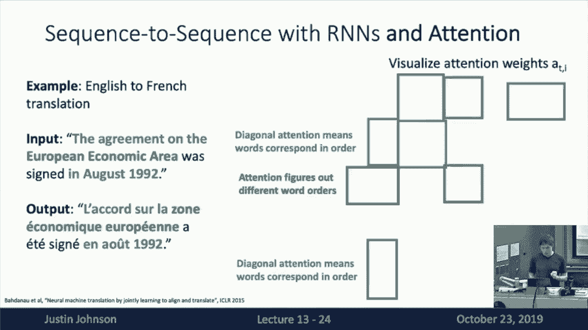
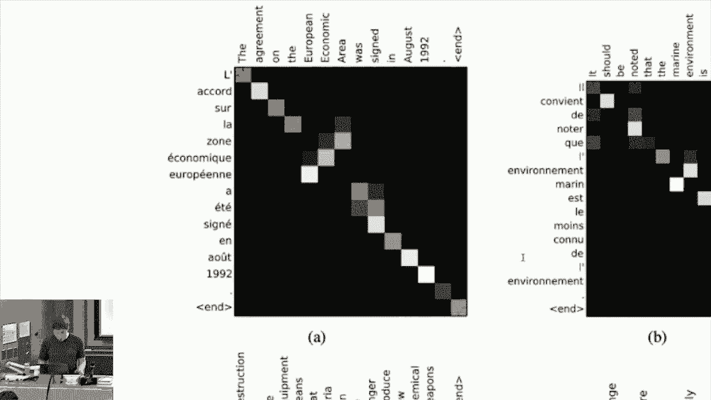
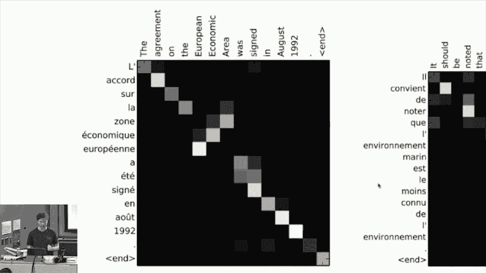
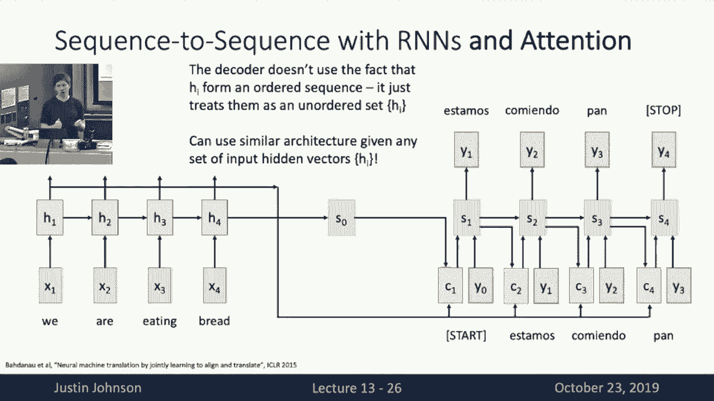
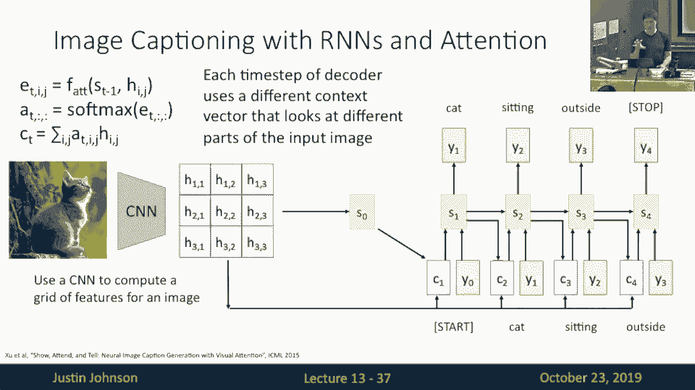
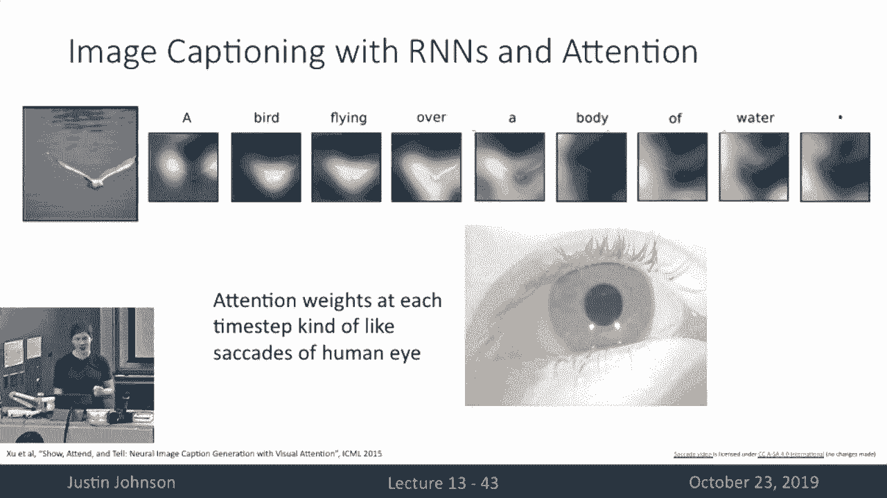
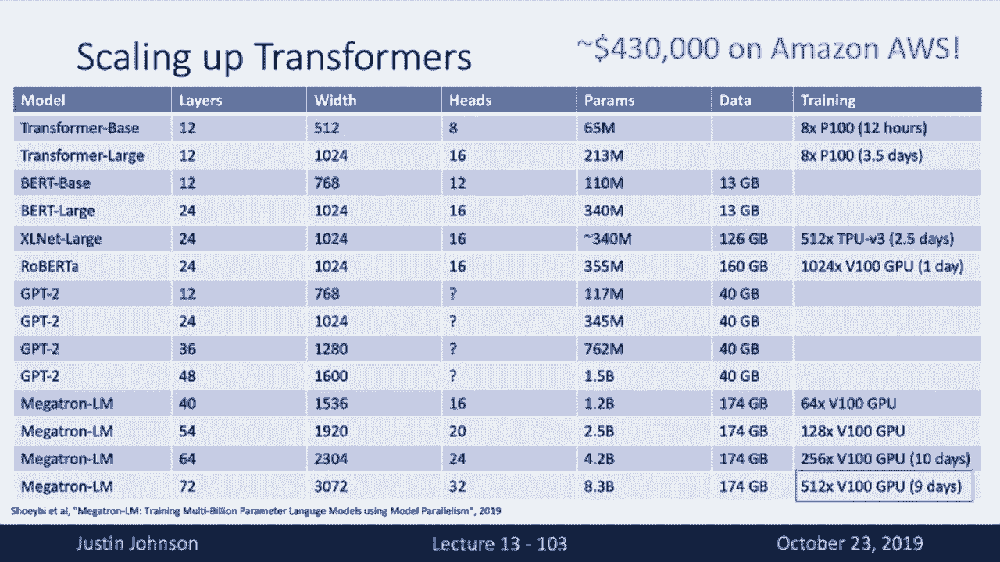
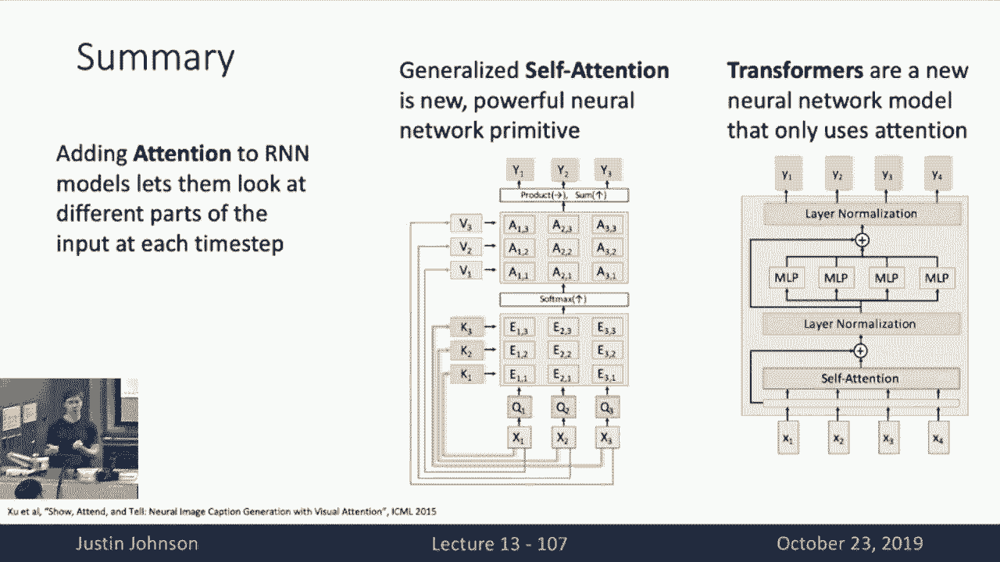

# 13：L13- 注意力机制 🧠

在本节课中，我们将要学习注意力机制。这是一种强大的技术，它允许神经网络在处理序列数据（如机器翻译或图像描述生成）时，动态地关注输入的不同部分。我们将从序列到序列模型的问题出发，逐步推导出注意力机制，并最终介绍基于自注意力的Transformer架构。

## 从序列到序列模型的问题出发

上一节我们介绍了用于处理序列的循环神经网络。本节中我们来看看如何用RNN构建序列到序列模型，以及它存在的瓶颈。

在序列到序列任务中（例如机器翻译），我们接收一个输入序列（如英文句子），并希望生成一个输出序列（如对应的西班牙语句子）。输入和输出序列的长度可能不同。

我们之前讨论过一种使用编码器-解码器架构的循环神经网络。编码器RNN接收输入序列，并产生一系列隐藏状态。解码器RNN则利用这些信息，逐个生成输出序列的单词。

在这种架构中，编码器需要将整个输入序列的信息“压缩”成一个单一的**上下文向量**，然后传递给解码器的每一步。这带来了一个问题：对于很长的输入序列（如整个段落或书籍），将所有信息塞进一个向量中是不现实的，这会形成一个信息瓶颈。

## 引入注意力机制

为了克服上述瓶颈，我们引入注意力机制。其核心思想是：不让解码器在每一步都使用同一个固定的上下文向量，而是允许它在生成每个输出单词时，动态地计算一个新的上下文向量，这个新向量可以聚焦于输入序列的不同部分。

以下是注意力机制的工作步骤：

1.  **计算对齐分数**：在解码器的每个时间步 `t`，我们有一个解码器隐藏状态 `s_t`。我们使用一个可微分的**对齐函数** `f_att`，将 `s_t` 与编码器的每一个隐藏状态 `h_i` 进行比较，得到一个标量**对齐分数** `e_{t,i}`。这个分数表示在生成当前输出时，输入位置 `i` 的重要性。
    *   一个常见且高效的选择是使用**缩放点积**作为对齐函数：
        `e_{t,i} = (s_t · h_i) / sqrt(d_k)`
        其中 `d_k` 是向量的维度。除以 `sqrt(d_k)` 是为了防止点积结果过大，导致Softmax梯度消失。

2.  **转换为注意力权重**：将所有对齐分数 `e_{t,i}` 通过Softmax函数，得到一个概率分布，即**注意力权重** `a_{t,i}`。这确保了所有权重之和为1，且更高的分数对应更高的权重。
    `a_{t,i} = softmax(e_{t})_i`

3.  **计算上下文向量**：将编码器的所有隐藏状态 `h_i` 按照对应的注意力权重 `a_{t,i}` 进行加权求和，得到当前时间步的**上下文向量** `c_t`。
    `c_t = Σ_i (a_{t,i} * h_i)`

4.  **生成输出**：解码器RNN将上一步的隐藏状态、上一步生成的单词（或起始标记）以及新计算的上下文向量 `c_t` 作为输入，生成当前时间步的输出单词 `y_t`。

这个过程在解码器的每一步重复进行。其优势在于：
*   **解决瓶颈**：模型不再需要将长序列的所有信息压缩进一个向量。
*   **可解释性**：通过可视化注意力权重，我们可以看到模型在生成每个输出词时关注了输入序列的哪些部分，这提供了宝贵的模型决策洞察。
*   **端到端训练**：整个计算图（对齐、Softmax、加权求和）都是可微分的，因此模型可以通过反向传播自动学习在哪里“集中注意力”，而无需人工标注对齐信息。

## 注意力机制的应用与泛化

注意力机制非常通用，并不局限于序列数据。以下是其应用和泛化的几个方向。

### 应用于图像描述生成

我们可以将注意力机制用于图像描述生成。模型输入是一张图像，输出是描述文本。
1.  使用卷积神经网络处理图像，得到一组空间位置上的特征向量网格（例如，`H x W` 个 `C` 维向量）。
2.  解码器RNN在生成每个单词时，使用注意力机制计算一个上下文向量。这个向量是图像特征网格的加权和，权重由解码器当前隐藏状态与每个图像特征向量的对齐分数决定。
3.  这样，模型在生成“鸟”这个词时，注意力会集中在图像中鸟的区域；生成“水”时，注意力会转移到水面区域。这模仿了人类观察图像时视线焦点的移动。

### 抽象为通用层：键、查询、值

我们可以将注意力机制抽象成一个通用的神经网络层。其输入包括：
*   **查询**：一组向量 `Q`，代表“我想知道什么”。
*   **键**：一组向量 `K`，代表“我可以提供什么信息”。
*   **值**：一组向量 `V`，代表“我实际提供的信息”。

在之前的序列翻译例子中：
*   **查询**是解码器的隐藏状态 `s_t`。
*   **键**和**值**最初都是编码器的隐藏状态 `h_i`。

抽象层的工作流程如下：
1.  计算所有查询与所有键之间的相似度（如缩放点积），得到一个相似度矩阵。
2.  对每个查询对应的相似度行进行Softmax，得到注意力权重矩阵。
3.  输出是值向量的加权和，权重即注意力权重。

这种抽象允许我们将输入信息用于两个不同目的：**匹配**（通过键）和**贡献内容**（通过值），为模型提供了更大的灵活性。

### 自注意力层

当查询、键、值都来自同一组输入向量时，就得到了**自注意力层**。它让输入序列中的每个元素都能直接与其他所有元素交互。

自注意力层的一个关键特性是**排列等价性**：改变输入向量的顺序，输出向量也会以相同的方式改变顺序，但内部的值关系不变。这意味着自注意力层本身不感知顺序。为了给模型注入位置信息，我们通常需要加入**位置编码**，例如为每个位置学习一个向量并加到输入上。

自注意力层还有几种变体：
*   **掩码自注意力**：在类似语言建模的任务中，我们要求模型在预测当前位置时只能看到之前的信息（不能看到未来）。这可以通过在相似度矩阵中，将未来位置的分数设置为负无穷大（在Softmax后变为0）来实现。
*   **多头自注意力**：我们并行运行多个自注意力层（称为“头”），每个头使用不同的可学习投影矩阵将输入映射到键、查询、值空间。最后将所有头的输出拼接起来。这允许模型同时关注来自不同表示子空间的信息。

## 注意力机制与其他序列处理方式的对比

到目前为止，我们学习了三种处理序列的主要方式：

1.  **循环神经网络**：
    *   **优点**：能很好地处理长序列依赖，单层即可让最终输出依赖于整个输入序列。
    *   **缺点**：计算本质上是顺序的，难以并行化，限制了在GPU等硬件上的训练速度。

2.  **一维卷积**：
    *   **优点**：高度可并行化，每个输出可以独立计算。
    *   **缺点**：单层卷积的感受野有限，需要堆叠很多层才能让一个输出位置看到整个输入序列。

3.  **自注意力**：
    *   **优点**：
        *   高度可并行化（核心是矩阵运算）。
        *   单层即可让每个输出位置直接看到所有输入位置的信息。
    *   **缺点**：计算所有对之间的交互，内存和计算复杂度随序列长度平方增长，但对于中等长度序列和现代硬件来说通常是可管理的。

## Transformer：基于自注意力的强大架构

基于自注意力的优势，研究人员提出了 **Transformer** 架构。其核心构建块是 **Transformer块**，它完全依赖于自注意力来进行序列元素间的交互。

一个Transformer块通常包含以下层：
1.  **多头自注意力层**：进行序列内元素间的交互。
2.  **残差连接与层归一化**：添加在自注意力层前后，有助于稳定和加速深度网络的训练。
3.  **前馈神经网络**：一个独立应用于每个位置的全连接网络，用于进行非线性变换。
4.  **另一个残差连接与层归一化**。

通过堆叠多个这样的Transformer块，我们可以构建非常深的模型。Transformer因其卓越的并行能力和对长程依赖的有效建模，已成为自然语言处理领域的基石。

近年来，通过在海量互联网文本上预训练巨大的Transformer模型（如BERT、GPT系列），然后在特定任务上进行微调，取得了革命性的成果。这些模型参数规模已达数十亿甚至上百亿，展示了注意力机制和Transformer架构的强大可扩展性。

## 总结

本节课中我们一起学习了注意力机制。我们从序列到序列模型的瓶颈出发，引入了动态计算上下文向量的注意力机制。随后，我们将其泛化为一个通用的键-查询-值操作，并深入探讨了自注意力层及其变体（如多头注意力）。通过比较，我们看到了自注意力在并行性和长程依赖建模上的优势。最后，我们介绍了以自注意力为核心的Transformer架构，它已成为现代自然语言处理乃至其他序列建模任务中最强大的工具之一。注意力机制不仅提升了模型性能，还通过可解释的注意力权重，为我们打开了理解模型决策过程的一扇窗。