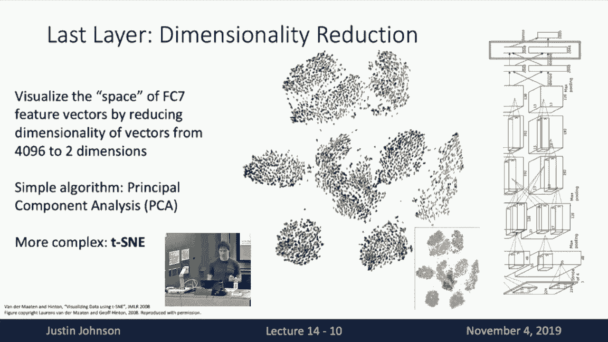
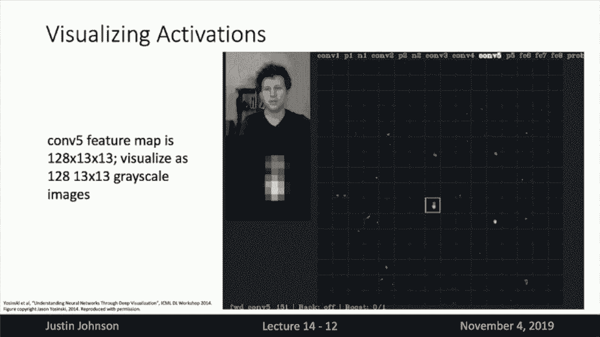
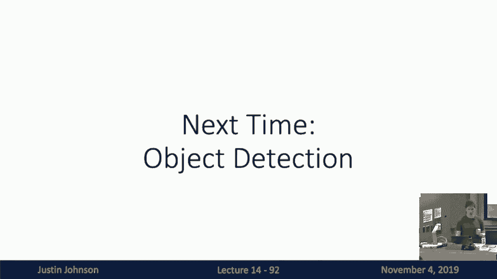

# 14：L14- 可视化与模型理解 🎨

在本节课中，我们将学习如何可视化卷积神经网络（CNN）的内部工作，并理解它们从训练数据中学到了什么。我们还将探讨如何利用这些可视化技术进行一些有趣的应用，如DeepDream和风格迁移。

---

## 1️⃣ 可视化第一层卷积滤波器

上一节我们介绍了如何通过可视化第一层卷积滤波器来初步理解CNN。本节中，我们来看看这些滤波器具体捕捉了哪些特征。

卷积神经网络的第一层学习一组滤波器，这些滤波器在输入图像上滑动并计算内积。通过将这些滤波器可视化为RGB图像，我们可以了解网络在第一层寻找的特征。

以下是第一层滤波器可视化的一些观察：
*   不同网络架构（如AlexNet、ResNet、DenseNet）在第一层学习的滤波器通常非常相似。
*   常见的模式包括不同方向的边缘检测滤波器。
*   也常见到检测不同颜色或对比色的滤波器。
*   这与哺乳动物视觉系统中检测定向边缘的细胞有相似之处。

---

## 2️⃣ 理解高层特征表示

上一节我们看到了第一层的特征，本节中我们来看看如何理解网络更深层的特征表示。

直接可视化高层卷积层的权重并不直观，因为它们的输入是前一层的特征图，而非原始RGB像素。因此，我们需要其他技术来理解高层特征。

一种方法是关注网络最后的全连接层（例如AlexNet的fc7层）。该层将图像转换为一个高维向量（如4096维），然后通过线性分类器输出类别分数。我们可以通过分析这个向量来理解网络的“理解”。

以下是几种分析该特征空间的方法：
*   **最近邻检索**：在特征空间中，计算查询图像的特征向量，并在测试集中寻找与之最接近的特征向量。这可以显示网络认为哪些图像在语义上相似，即使像素值差异很大。
*   **降维可视化**：使用如PCA或t-SNE等降维算法，将高维特征向量投影到2D或3D空间进行可视化。这可以揭示不同类别在特征空间中的分布结构。

---

## 3️⃣ 可视化中间层激活与最大激活图像块

上一节我们通过分析最终特征向量来理解网络，本节中我们来看看如何直接窥视中间卷积层的激活。

我们可以可视化网络中间层的激活图。对于给定图像，将特定卷积层的输出特征图（每个通道对应一个滤波器）可视化为灰度图像。通过将激活图与原始图像对齐，可以观察不同滤波器对输入图像中哪些区域有响应。

另一种更深入的方法是寻找**最大激活图像块**。对于网络中某个选定的神经元（或滤波器），在整个数据集中寻找那些能最大化激活该神经元的图像区域（图像块）。

以下是具体步骤：
1.  选择网络中的某一层和该层中的一个特定滤波器。
2.  将整个测试集图像输入网络。
3.  记录该滤波器在每张图像上激活值最高的空间位置。
4.  提取并可视化这些位置对应的原始图像块。

通过观察这些最大激活的图像块，我们可以推断该神经元正在寻找什么模式（例如，狗鼻子、文本、人脸）。

---

## 4️⃣ 显著性图：识别重要像素

上一节我们关注了网络内部神经元的激活，本节中我们来看看如何确定输入图像中哪些像素对网络的最终决策最重要。

我们可以通过计算**显著性图**来识别对分类决策至关重要的图像区域。其核心思想是：遮挡图像的某些部分，观察网络置信度的变化。

一种计算方法是**遮挡实验**：
1.  使用一个灰色方块（或均值图像块）依次遮挡输入图像的不同区域。
2.  每次遮挡后，将图像输入网络，记录目标类别（如图像真实类别）的得分。
3.  为每个遮挡位置生成一个热力图，颜色深浅表示遮挡该区域后类别得分下降的程度。得分下降越大的区域越重要。

另一种更高效的方法是使用**梯度信息**。通过反向传播，计算类别分数相对于输入图像每个像素的梯度。梯度绝对值大的像素，意味着微小变化会对类别分数产生较大影响，因此这些像素更重要。

公式表示为：`Saliency Map = abs(∇_x f_c(x))`，其中 `f_c(x)` 是类别 `c` 的分数，`x` 是输入图像。

这种方法生成的显著性图可以粗略勾勒出图像中物体的轮廓，表明网络确实在关注物体本身，而非背景等无关信息。

---

## 5️⃣ 梯度上升：生成最大化激活的图像

上一节我们使用梯度来找出重要像素，本节中我们来看看如何利用梯度主动生成图像，以最大化特定神经元或类别的激活。

我们可以不局限于现有图像，而是通过**梯度上升**从头合成一张新图像，使其能够最大化激活网络中的某个目标（如某个类别分数或中间层神经元）。

其优化目标可以表示为：
`I* = argmax_I [f(I) - R(I)]`
其中：
*   `I*` 是我们要生成的图像。
*   `f(I)` 是目标神经元在图像 `I` 上的激活值。
*   `R(I)` 是一个正则化项，用于迫使生成的图像看起来更“自然”（例如，惩罚图像像素值的L2范数）。

**优化过程**：
1.  初始化一张图像（如随机噪声）。
2.  将图像输入固定权重的预训练网络，计算目标激活值 `f(I)`。
3.  反向传播，计算目标激活值相对于图像像素的梯度。
4.  沿着梯度方向更新图像像素（梯度上升），以增加 `f(I)`。
5.  同时，应用正则化 `R(I)` 来约束图像。
6.  重复步骤2-5，直到生成满意的图像。

通过这种方法，我们可以生成一些抽象但能反映网络所学概念的图像（例如，最大化“狗”类别会生成包含狗相关纹理和形状的图像）。

---

## 6️⃣ 特征反演与网络信息流

上一节我们生成了最大化特定目标的图像，本节中我们来看看如何通过特征反演来理解网络不同层保留的信息。

**特征反演**旨在回答：给定网络某一层对某张图像的特征表示，我们能多大程度上重建出原始图像？这有助于理解不同层捕获的信息类型。

过程如下：
1.  选取一张图像 `y`，将其输入网络，并提取某一中间层（如 `relu4_3`）的特征 `Φ(y)`。
2.  初始化一张新图像 `I`（如随机噪声）。
3.  优化目标：最小化生成图像 `I` 在该层的特征 `Φ(I)` 与目标特征 `Φ(y)` 之间的差异，同时加入图像正则化 `R(I)`。
   `I* = argmin_I [ ||Φ(I) - Φ(y)||^2 + λ R(I) ]`
4.  通过梯度下降优化图像 `I`。

**观察**：
*   重建低层特征（如 `relu2_2`）几乎能完美恢复原始图像，说明低层保留了大部分像素级信息。
*   重建高层特征（如 `relu5_3`）只能恢复图像的粗略结构和轮廓，而丢失了颜色、纹理等细节，说明高层更关注高级语义信息。

---

## 7️⃣ 应用：DeepDream

基于梯度上升的思想，我们可以创建有趣的应用，如**DeepDream**。其核心思想是：选择一张现有图像，然后放大网络在图像中已经检测到的特征。

**算法步骤**：
1.  将输入图像输入网络，前向传播至某一选定层。
2.  将该层的激活值设置为梯度目标（即，让梯度等于激活值本身）。
3.  反向传播至输入图像，计算梯度。
4.  使用该梯度更新输入图像（实际上是执行梯度上升，以增强该层已激活的特征）。
5.  重复此过程，并通常加入一些图像正则化（如多尺度处理、像素裁剪）以获得更美观的结果。

效果是：图像中那些被网络轻微识别出的模式（如边缘、纹理）会被显著增强和扭曲，产生迷幻、梦境般的视觉效果。如果在高层进行，网络可能会“看到”并生成更复杂的物体（如动物、建筑）。

---

## 8️⃣ 应用：神经风格迁移

另一个强大的应用是**神经风格迁移**，它结合了特征重建和纹理合成的思想。

**核心思想**：生成一张新图像，使其：
1.  **内容**上匹配一张**内容图像**的高层特征（保留其结构和布局）。
2.  **风格**上匹配一张**风格图像**的纹理统计信息（捕获其颜色、笔触等风格）。

**关键组件**：
*   **内容损失**：使用特征反演中的方法，衡量生成图像与内容图像在高层特征上的差异。
*   **风格损失**：使用**Gram矩阵**来捕获风格。Gram矩阵计算了某一层特征图中不同通道之间的相关性，它描述了哪些特征倾向于共同出现，从而捕捉了纹理信息，同时丢弃了空间位置信息。
    *   对于一层特征 `F` (形状为 `C x H x W`)，其Gram矩阵 `G` 是一个 `C x C` 的矩阵，其中元素 `G_{ij}` 是特征通道 `i` 和 `j` 的内积（在空间维度上平均）。
*   **总损失**：`L_total = α * L_content + β * L_style`，其中 `α` 和 `β` 是权衡内容与风格权重的超参数。

**优化过程**：从一张随机噪声图像（或内容图像的副本）开始，通过梯度下降同时最小化内容损失和风格损失，逐步迭代生成最终图像。

通过调整内容层、风格层、损失权重等，可以控制输出效果。原始的优化方法速度较慢，后来出现了**快速风格迁移**方法，训练一个前馈网络来直接进行风格转换，实现了实时处理。

---

## 9️⃣ 总结

本节课中我们一起学习了多种理解和可视化卷积神经网络的技术：
*   **直接可视化**：观察第一层滤波器。
*   **特征空间分析**：通过最近邻和降维理解高层特征表示。
*   **激活分析**：可视化中间层激活和寻找最大激活图像块。
*   **显著性分析**：确定输入图像中对分类决策至关重要的像素。
*   **梯度上升**：生成能最大化激活网络特定部分的新图像。
*   **特征反演**：理解网络不同层保留的信息类型。

我们还看到，这些技术不仅有助于模型理解，还能催生出像**DeepDream**和**神经风格迁移**这样富有创意和艺术性的应用。这些应用展示了深度学习模型在图像生成和艺术创作方面的巨大潜力。