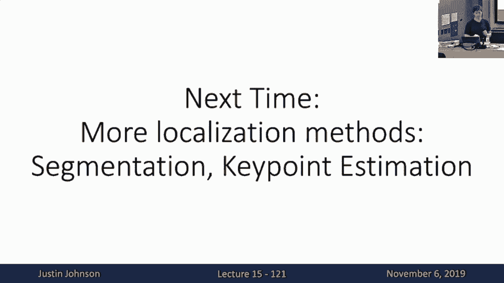

# 15：L15- 目标检测 📚

在本节课中，我们将要学习计算机视觉中的一个核心任务——目标检测。与之前学习的图像分类不同，目标检测不仅需要识别图像中存在哪些物体，还需要精确地定位出每个物体在图像中的位置（即输出边界框）。我们将从基础概念开始，逐步深入到经典的检测算法，并了解如何评估检测器的性能。

---

## 🎯 什么是目标检测？

上一节我们回顾了用于理解和可视化卷积神经网络内部工作的技术。本节中，我们来看看一个更实际的任务——目标检测。

目标检测任务输入一张RGB图像，输出则是一组检测到的物体。对于检测到的每个物体，模型需要输出两样东西：
1.  **类别标签**：指明检测到的物体属于哪个预定义的类别（例如猫、狗、汽车）。
2.  **边界框**：用一个矩形框标出物体在图像中的空间范围。

边界框通常用四个实数参数化：中心点的x、y坐标（以像素为单位），以及框的宽度`w`和高度`h`。因此，一个边界框可以表示为：
`bbox = [center_x, center_y, width, height]`

与仅输出单个类别标签的图像分类相比，目标检测带来了几个新的挑战：
*   **多输出**：图像中可能包含数量不定的物体，模型需要输出可变数量的检测结果。
*   **输出类型混合**：模型需要同时输出离散的类别标签和连续的边界框坐标。
*   **高分辨率需求**：为了准确定位小物体，通常需要处理分辨率更高的图像（如800x600像素），这带来了更大的计算负担。

---

## 🔍 从单物体检测到多物体检测

首先，让我们考虑一个简化问题：如何检测图像中的单个物体？

我们可以构建一个相对简单的架构：图像输入一个CNN主干网络（如ResNet），得到一个图像的特征向量表示。然后，从这个特征向量分出两个分支：
1.  **分类分支**：一个全连接层，输出每个类别的得分，使用Softmax损失进行训练。这与标准的图像分类器相同。
2.  **回归分支**：另一个全连接层，输出四个实数，代表边界框的坐标，使用回归损失（如L2损失）进行训练。

为了用梯度下降法训练这个同时做两件事的网络，我们需要将两个损失函数合并成一个标量。常见的做法是计算它们的加权和，这被称为**多任务损失**：
`总损失 = w1 * 分类损失 + w2 * 回归损失`

然而，现实世界的图像通常包含多个物体。我们需要一种机制，让模型能为每张图像输出**可变数量**的检测结果。

---

## 🪟 滑动窗口与区域提议

一种直观的想法是**滑动窗口**：训练一个CNN分类器，用于判断图像中某个固定大小的子区域（窗口）是否包含目标物体。然后，将这个分类器在图像的所有可能位置和尺度上滑动应用。

但这种方法计算量巨大。对于一个`H x W`的图像，考虑所有可能的窗口位置和大小，需要评估的窗口数量是`O(H^2 * W^2)`量级。对于一张800x600的图像，这可能意味着数千万次CNN前向传播，完全不可行。

为了解决这个问题，研究者引入了**区域提议**的概念。其核心思想是：使用一个快速、轻量的算法（而非CNN）预先找出图像中**可能包含物体**的候选区域，数量远少于穷举的滑动窗口。一个经典算法是**选择性搜索**，它能在CPU上几秒内为一张图像生成约2000个区域提议。

---

## 🚀 R-CNN 系列算法

有了区域提议，我们可以构建实用的目标检测器。以下是其演进过程：

### 1. R-CNN（Region-based CNN）

R-CNN是深度学习目标检测的开创性工作。其流程如下：
1.  输入图像，使用选择性搜索生成约2000个区域提议。
2.  将每个区域提议**变形（Warp）** 到固定大小（如224x224）。
3.  将每个变形后的区域**独立地**输入一个CNN（例如在ImageNet上预训练的AlexNet）。
4.  CNN为每个区域输出两部分：
    *   类别得分（C个目标类 + 1个背景类）。
    *   一个边界框回归参数，用于微调输入的区域提议框，使其更贴合真实物体。

R-CNN的缺点是速度慢，因为需要为每个区域提议（约2000个）独立运行CNN前向传播。

### 2. Fast R-CNN

Fast R-CNN改进了流程，大幅提升了速度。关键改变是**交换了卷积和区域裁剪的顺序**：
1.  将**整张图像**输入CNN主干网络，得到整张图的卷积特征图。
2.  将选择性搜索生成的区域提议**投影**到这张特征图上。
3.  对每个投影后的区域，在特征图上进行**RoI池化**操作，将其转换为固定大小的特征网格。
4.  将这些固定大小的特征输入一个轻量的“每区域”网络，最终输出类别和精修后的边界框。

这样做的好处是，耗时的卷积计算只在整张图像上执行一次，所有区域提议共享这部分计算。

**RoI池化**是一种将不同大小的区域转换为固定大小特征的可微分操作。它将区域划分成固定数量的子窗口（如2x2），然后在每个子窗口内进行最大池化。

### 3. Faster R-CNN

在Fast R-CNN中，区域提议（选择性搜索）成了新的速度瓶颈。Faster R-CNN的创新在于**用神经网络自己生成区域提议**。

它在Fast R-CNN的基础上，在主干网络输出的特征图后，添加了一个**区域提议网络**：
*   RPN在特征图的每个位置上放置`k`个不同尺度和长宽比的**锚点框**。
*   对于每个锚点框，RPN预测两个值：
    1.  **物体性得分**：该锚点框内包含物体的概率（二分类：是物体/背景）。
    2.  **边界框变换参数**：用于将锚点框微调成更准确的区域提议。

这样，区域提议的生成也变成了可学习的、基于CNN的快速过程。Faster R-CNN因此成为一个**两阶段检测器**：
*   **第一阶段（RPN）**：在整张图像上运行，生成区域提议。
*   **第二阶段（Fast R-CNN头部）**：对每个区域提议进行分类和边界框精修。

---

## ⚡ 单阶段检测器

既然RPN已经能给出可能包含物体的位置（锚点框），那么能否直接在这些位置上完成分类，省去第二阶段？这就是**单阶段检测器**的思想，如SSD和YOLO。

单阶段检测器通常：
*   在特征图的每个位置预设锚点框。
*   使用一个卷积网络，直接为每个锚点框预测**类别得分**（C+1类）和**边界框变换参数**。
*   在单次前向传播中完成所有预测，速度通常更快。

与两阶段方法相比，单阶段检测器速度优势明显，但历史上精度略低。不过，随着技术发展（如特征金字塔网络FPN的引入），两者的性能差距已经大大缩小。

---

## 📊 评估指标：交并比与平均精度均值

如何衡量目标检测器的好坏？我们需要新的评估指标。

### 交并比

**交并比**是衡量两个边界框重叠程度的指标。计算公式为：
`IoU = (预测框 ∩ 真实框) / (预测框 ∪ 真实框)`
IoU值在0到1之间。通常，IoU > 0.5被认为是一个可以接受的匹配。

### 非极大值抑制

检测器通常会为同一个物体输出多个高度重叠的边界框。**非极大值抑制**是一种后处理算法，用于去除冗余检测框：
1.  选择置信度最高的检测框。
2.  计算该框与所有其他框的IoU。
3.  移除所有IoU超过某个阈值（如0.7）的框（视为重复检测）。
4.  在剩余的框中重复步骤1-3，直到没有框剩下。

### 平均精度均值

目标检测的常用综合评估指标是**平均精度均值**。计算过程如下：
1.  对每个类别单独计算**平均精度**：
    *   将模型在该类别上所有的检测结果按置信度排序。
    *   从高到低遍历每个检测，计算当前的**精确率**和**召回率**，绘制P-R曲线。
    *   AP即是该P-R曲线下的面积。
2.  对所有类别的AP取平均，即得到**mAP**。

在实际研究中，为了更全面评估定位精度，常计算不同IoU阈值（如0.5, 0.75）下的mAP，并取平均。

---

## 🏁 总结与实用建议

本节课中我们一起学习了目标检测的核心概念与方法。我们从图像分类与目标检测的区别讲起，探讨了单物体检测的多任务损失。为了应对多物体检测，我们介绍了滑动窗口的局限性以及区域提议的解决方案。随后，我们深入讲解了R-CNN系列的演进：从需要独立处理每个区域的R-CNN，到共享卷积计算的Fast R-CNN，再到引入RPN实现端到端学习的Faster R-CNN。我们还了解了更快的单阶段检测器思想。最后，我们学习了用于评估检测器性能的交并比、非极大值抑制和平均精度均值等关键指标。

目标检测是一个复杂且快速发展的领域，涉及大量工程细节和调优技巧。因此，**在实践中，不建议从头开始实现目标检测系统**。推荐使用成熟的开源框架，例如：
*   **Detectron2**：Facebook基于PyTorch的下一代目标检测库，包含了当前众多先进算法的实现和预训练模型。
*   **TensorFlow Object Detection API**：Google基于TensorFlow的目标检测框架。

这些工具能帮助你快速地将强大的目标检测能力应用到自己的项目中。

---

**下节预告**：在下一讲中，我们将继续探讨与物体定位相关的计算机视觉任务，例如实例分割和语义分割。