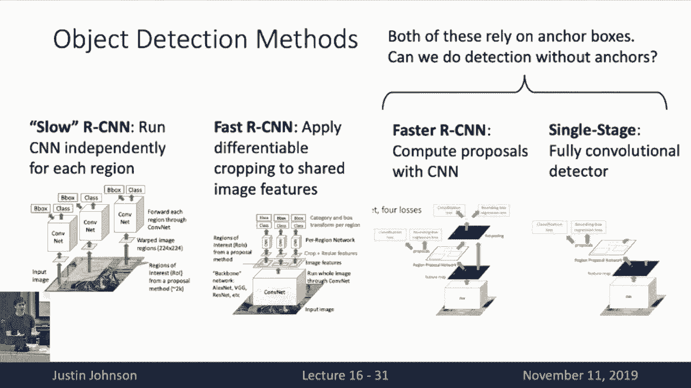
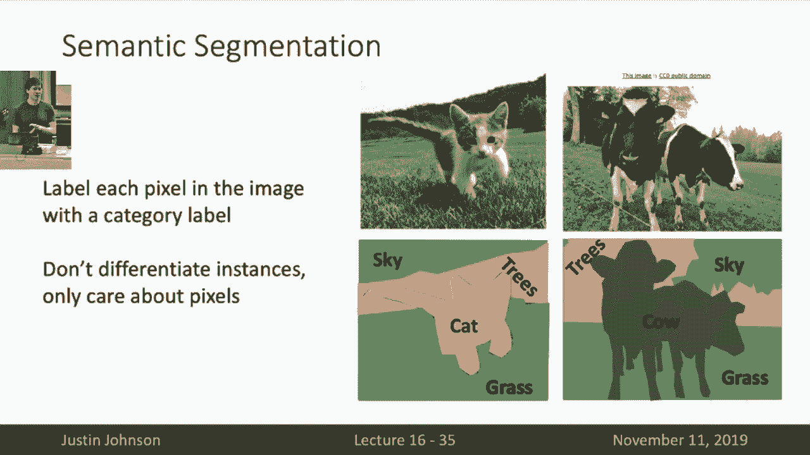
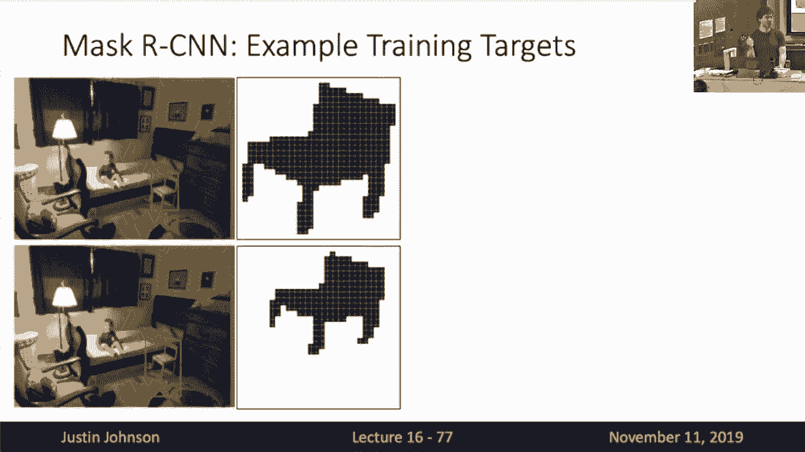
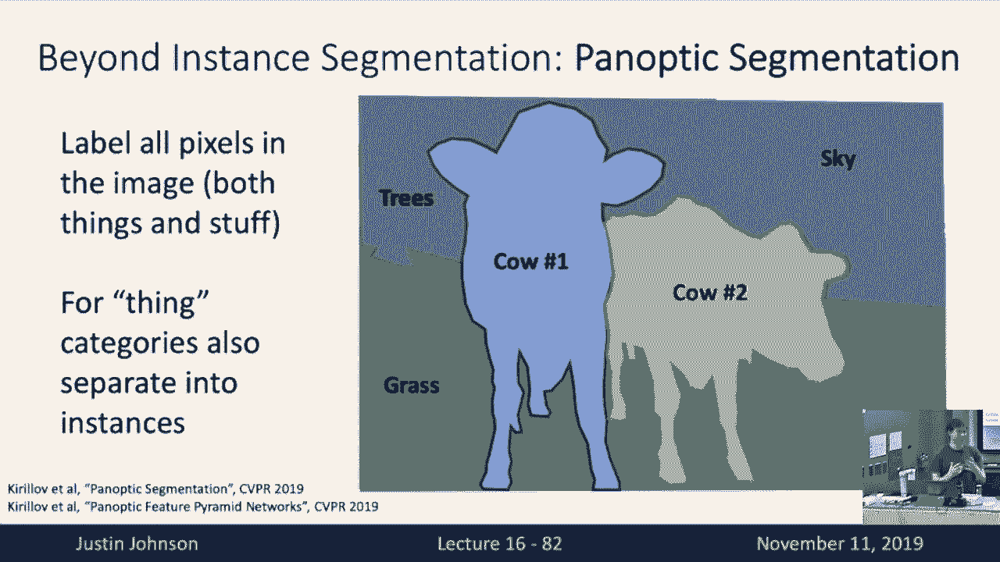
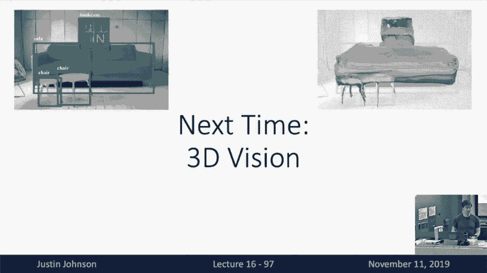

# 16：L16 - 目标检测与图像分割 🎯

在本节课中，我们将深入学习计算机视觉中的目标检测与图像分割任务。我们将回顾目标检测的核心概念，并探讨不同类型的图像分割任务，包括语义分割、实例分割和全景分割。课程内容将涵盖从经典方法到现代深度学习方法的关键技术和原理。

---

## 📊 目标检测的深度学习进展

上一节我们介绍了目标检测的基本概念，本节中我们来看看深度学习如何推动该领域的巨大进步。

下图展示了从2007年到2015年目标检测在Pascal VOC数据集上的性能进展。纵轴是平均精度均值（mAP）指标。



从图中可以看出，在2007年至2012年间，人们主要使用非深度学习方法进行目标检测，性能提升缓慢，并在2010年至2012年间趋于平缓。然而，从2013年开始，当深度学习首次应用于目标检测任务时，性能出现了巨大的飞跃。这种提升并非一次性事件，随着更优的深度学习目标检测方法（如Fast R-CNN、Faster R-CNN）的出现，性能持续攀升。

值得注意的是，该图表在2016年结束，因为此后Pascal VOC数据集被认为过于简单，研究社区转向了更具挑战性的数据集。目前，该数据集上的最佳性能已远超80%，但大多数方法已不再在此数据集上进行测试。

---

## 🔍 R-CNN系列模型训练流程详解

上一节我们快速介绍了R-CNN系列模型，本节中我们将深入探讨这些模型的训练流程，特别是如何为区域建议分配标签。

在训练R-CNN风格网络时，我们接收一个RGB输入图像以及该图像中所有物体的真实边界框和类别标签。流程如下：

1.  **生成区域建议**：在输入图像上运行区域建议方法（如选择性搜索），得到一组可能包含物体的区域。
2.  **匹配与标记**：将生成的区域建议与真实边界框进行比较，为每个区域建议分配标签。这是上节课未详细讨论的关键步骤。

以下是匹配过程的详细说明：

*   **真实边界框**：图中亮绿色框代表图像中两个狗和一只猫的真实边界框。
*   **区域建议**：青色框代表区域建议方法生成的所有候选区域。
*   **标签分配**：
    *   **正样本**：与某个真实边界框高度重叠（通常通过交并比IoU阈值判断，如IoU > 0.5）的区域建议。这些区域应被网络分类为包含物体。
    *   **负样本**：与所有真实边界框重叠度很低（如IoU < 0.3）的区域建议。这些区域不包含目标物体，应被分类为背景。
    *   **中性样本**：与真实边界框有部分重叠，但既不够正也不够负的区域建议（例如IoU在0.3到0.5之间）。在训练时通常忽略这些框。

在训练过程中，我们裁剪出所有正样本和负样本区域建议对应的像素，并将其调整为固定大小（如224x224）。此时，问题类似于图像分类任务，但输入是这些图像裁剪块。

对于每个区域建议，网络需要预测两件事：
1.  **类别标签**：对于正样本，其目标类别标签是与之匹配的真实边界框的类别。对于负样本，其目标类别是“背景”。
2.  **边界框回归变换**：一个将原始区域建议坐标变换到更精确的目标边界框坐标的变换参数。**只有正样本才有回归损失**，负样本没有回归目标。

**标签来源的澄清**：区域建议的类别标签来源于匹配过程。我们将每个区域建议与重叠度最高的真实边界框配对，并将该真实框的类别标签分配给该区域建议。回归目标则是计算能将区域建议坐标“对齐”到其匹配的真实边界框坐标所需的变换参数。

在训练时，分类损失应用于所有样本，而回归损失仅应用于正样本。正负样本的比例是训练中需要调整的超参数。

对于Faster R-CNN这类在线学习区域建议的网络，这种匹配需要在训练过程中动态进行，这增加了实现的复杂性。

---

## 🧮 从RoI Pooling到RoI Align

在从Slow R-CNN过渡到Fast R-CNN时，我们引入了特征裁剪操作。Fast R-CNN交换了卷积和裁剪的顺序，先计算整个图像的特征图，再从特征图中裁剪出每个区域建议对应的特征。

上节课我们介绍了**RoI Pooling**操作，但其存在两个问题：
1.  **特征未对齐**：由于需要将区域建议映射到特征图的离散网格上并进行两次量化（取整）操作，导致特征位置与原始图像区域不精确对齐。
2.  **不可微分**：由于量化操作，梯度无法从区域特征反向传播到区域建议的坐标输入。

**RoI Align**操作解决了这些问题。其核心思想是**消除所有量化操作，使一切连续化**。

RoI Align的工作流程：
1.  将区域建议投影到特征图上，**不进行任何取整**。
2.  将投影后的区域均匀划分为若干子区域（如2x2）。
3.  在每个子区域内**均匀采样**固定数量的点（如4个）。
4.  对于每个采样点，使用**双线性插值**根据其周围四个最近邻特征网格点的值来计算该点的特征值。
5.  对每个子区域内的所有采样点特征进行聚合（如最大池化），得到该子区域的最终输出特征。

**双线性插值公式**（对于位置`(x, y)`的特征值`f(x, y)`）：
`f(x, y) ≈ f(Q11) * (x2 - x)(y2 - y) + f(Q21) * (x - x1)(y2 - y) + f(Q12) * (x2 - x)(y - y1) + f(Q22) * (x - x1)(y - y1)`
其中，`Q11=(x1,y1)`, `Q21=(x2,y1)`, `Q12=(x1,y2)`, `Q22=(x2,y2)`是`(x,y)`周围的四个整数坐标点。

RoI Align的优势：
*   **更好的对齐**：由于使用连续坐标和插值，特征与原始图像区域对齐更精确。
*   **完全可微分**：梯度可以通过插值操作反向传播到图像特征图和输入的区域建议坐标。

---

## 🔲 无锚框目标检测：CornerNet


之前讨论的Faster R-CNN和单阶段检测器都依赖于预设的锚框。一个有趣的问题是：能否设计一个完全不依赖锚框，直接预测边界框的目标检测系统？

**CornerNet**是一个创新的解决方案。它改变了边界框的表示方式，用**左上角**和**右下角**两个关键点来定义一个边界框。

网络架构与流程：
1.  将图像通过一个骨干CNN，得到图像级特征。
2.  **左上角预测分支**：预测一个热图，对于每个空间位置和每个物体类别，输出该位置是该类别物体边界框左上角的概率。
3.  **右下角预测分支**：类似地，预测每个位置是右下角的概率。
4.  **嵌入向量预测**：网络还为每个位置预测一个嵌入向量。关键思想是：**属于同一个边界框的左上角和右下角，其嵌入向量应该非常相似**。
5.  **匹配与输出**：在测试时，通过计算左上角和右下角嵌入向量之间的距离，将配对的角点组合成最终的边界框输出。

这种方法提供了一种与锚框范式完全不同的目标检测思路。



---

## 🖼️ 语义分割

**语义分割**的任务是为输入图像中的**每一个像素**分配一个类别标签。它不区分同一类别的不同实例（例如，图像中的两只猫会被标记为同一个“猫”类别，而不是猫1和猫2）。

一种低效的方法是使用滑动窗口，为每个像素提取一个图像块并用CNN分类。但更高效的方法是使用**全卷积网络**。

**全卷积网络**是一种没有全连接层或全局池化层的CNN，仅由卷积层组成。输入是图像，输出是一个张量，其空间尺寸与输入相同（或按比例缩放），通道数等于类别数。每个空间位置的特征向量经过softmax后，表示该像素属于各个类别的概率分布。训练使用**逐像素交叉熵损失**。

然而，简单的全卷积网络存在两个问题：
1.  **感受野有限**：堆叠多个3x3卷积虽能增大感受野，但需要很多层才能覆盖大区域。
2.  **计算成本高**：在高分辨率图像上直接进行全尺寸卷积非常耗时。

因此，实际的语义分割网络通常采用**编码器-解码器**结构：
*   **编码器（下采样）**：通过卷积和池化降低分辨率，扩大感受野，减少计算量。
*   **解码器（上采样）**：将低分辨率特征图恢复到输入图像尺寸，以进行逐像素预测。

---

## ⬆️ 上采样方法

上采样是解码器的关键操作。以下是几种常见方法：

1.  **最近邻上采样**：将输入特征图中的每个值复制到输出中对应的一个区域。
    ```python
    # 伪代码示例：最近邻上采样（2倍）
    output[x*2, y*2] = input[x, y]
    output[x*2+1, y*2] = input[x, y]
    output[x*2, y*2+1] = input[x, y]
    output[x*2+1, y*2+1] = input[x, y]
    ```
2.  **双线性/双三次插值**：在输出网格的连续位置采样，并使用周围输入点的加权平均值来计算输出值。双线性使用4个最近邻点，双三次使用16个点，能产生更平滑的结果。
3.  **最大反池化**：与最大池化操作相关联。在下采样进行最大池化时，记录最大值所在位置。在上采样时，将值放回记录的位置，其他位置填零。这有助于保持特征的位置对齐。
4.  **转置卷积**：一种可学习的上采样操作。其前向传播相当于普通卷积的反向传播。通过设置步长小于1，它可以在输出中为输入的每个元素生成多个值，从而实现上采样。

**转置卷积操作示意**（1维简化）：
输入 `[a, b]`， 卷积核 `[x, y, z]`， 输出步长模式。
输出计算过程涉及将加权后的卷积核复制到输出张量的不同位置并求和。

选择哪种上采样方法通常与下采样方法配对：如果下采样使用平均池化，上采样可选用最近邻或插值；如果下采样使用最大池化，则最大反池化是更自然的选择。

---

## 🧩 从目标检测到实例分割：Mask R-CNN

**实例分割**结合了目标检测和语义分割：它需要检测出图像中的每个物体实例，并为每个实例预测一个精确的像素级掩码（只针对“物体”类别，不针对“背景”类别如天空、草地）。

**Mask R-CNN** 是建立在Faster R-CNN之上的经典实例分割框架。其核心思想是：**在Faster R-CNN的现有分支（分类和边界框回归）基础上，增加一个并行的掩码预测分支**。

网络流程：
1.  输入图像经过骨干网络提取特征。
2.  区域建议网络生成候选区域。
3.  使用RoI Align从特征图中提取每个区域的特征。
4.  对于每个区域，同时进行：
    *   **分类**：预测物体类别。
    *   **边界框回归**：微调边界框。
    *   **掩码预测**：通过一个小型全卷积网络，预测一个固定大小（如28x28）的二值分割掩码，表示该区域内哪些像素属于该物体。

**训练目标**：对于每个区域建议，其掩码分支的训练目标是一个二值掩码，该掩码由真实实例掩码裁剪并缩放到区域建议框内得到，且仅针对该区域建议被分配到的类别。

Mask R-CNN能够同时输出高质量的检测框和分割掩码，是实例分割领域的强大基准模型。

---

## 🌈 其他高级分割与感知任务



1.  **全景分割**：旨在统一语义分割和实例分割。它为图像中的每个像素分配一个标签：对于“物体”类别，标签包含实例ID以区分不同个体；对于“背景”类别，则只使用语义标签。这是一个更全面的分割任务。

2.  **关键点检测**：例如人体姿态估计。Mask R-CNN也可以扩展到此任务，通过为每个区域增加一个关键点预测分支，输出每个关键点的热图。这可以实现联合的目标检测、实例分割和姿态估计。

3.  **密集描述生成**：结合目标检测和图像描述，为图像中的多个区域生成自然语言描述。这可以通过在检测器区域特征上附加一个LSTM或Transformer描述模型来实现。



4.  **3D形状预测**：在目标检测的基础上，为每个检测到的物体预测其3D形状。这同样遵循了“检测+附加预测头”的范式。

---

## 📝 课程总结

本节课我们一起深入学习了计算机视觉中的核心定位任务：

*   **目标检测**：回顾了R-CNN系列模型的训练细节，深入理解了区域建议的匹配与标签分配过程，以及从RoI Pooling到RoI Align的改进。还简要了解了无锚框检测器CornerNet的创新思路。
*   **图像分割**：
    *   **语义分割**：学习了全卷积网络和编码器-解码器结构，以及各种上采样方法（最近邻、插值、反池化、转置卷积）。
    *   **实例分割**：掌握了如何通过Mask R-CNN在目标检测框架上增加掩码预测分支来实现实例级别的分割。
    *   **全景分割**：了解了这个统一分割任务的目标。
*   **扩展任务**：认识到目标检测框架可以作为基础，通过添加不同的预测头来支持多种高级感知任务，如关键点检测、密集描述和3D形状预测。




目标检测是本节课要求掌握的重点，而对其他任务的了解有助于拓宽在计算机视觉实际应用中的视野。下节课我们将探讨如何使用深度学习处理3D数据。