# 18：L18- 深度学习中的视频处理 🎬

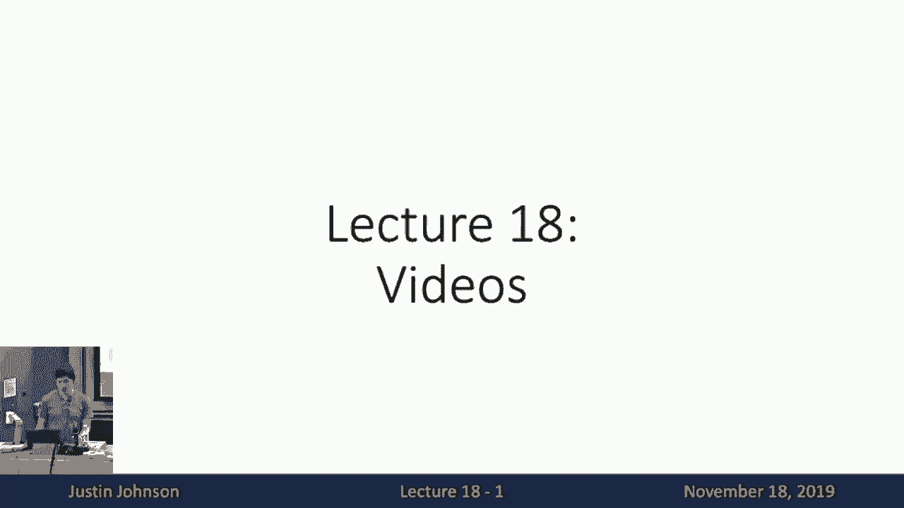

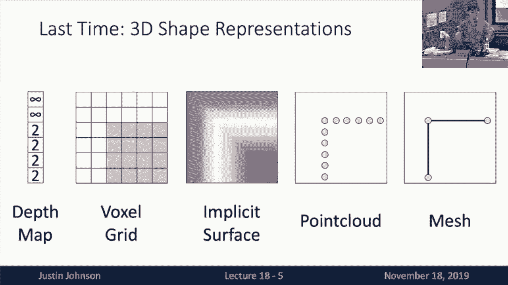

在本节课中，我们将要学习如何使用深度学习处理视频数据。视频本质上是随时间展开的图像序列，这为神经网络模型引入了一个新的维度——时间维度。我们将探讨如何构建能够理解视频内容（如识别动作或活动）的模型，并了解处理这类数据所面临的独特挑战。

## 📹 视频：带有时间维度的图像

上一节课我们介绍了如何将卷积网络从二维图像处理扩展到三维形状处理，我们通过添加第三个空间维度实现了这一点。今天，我们将探讨另一种为神经网络模型增加额外维度的方法：不是添加空间维度，而是添加时间维度。

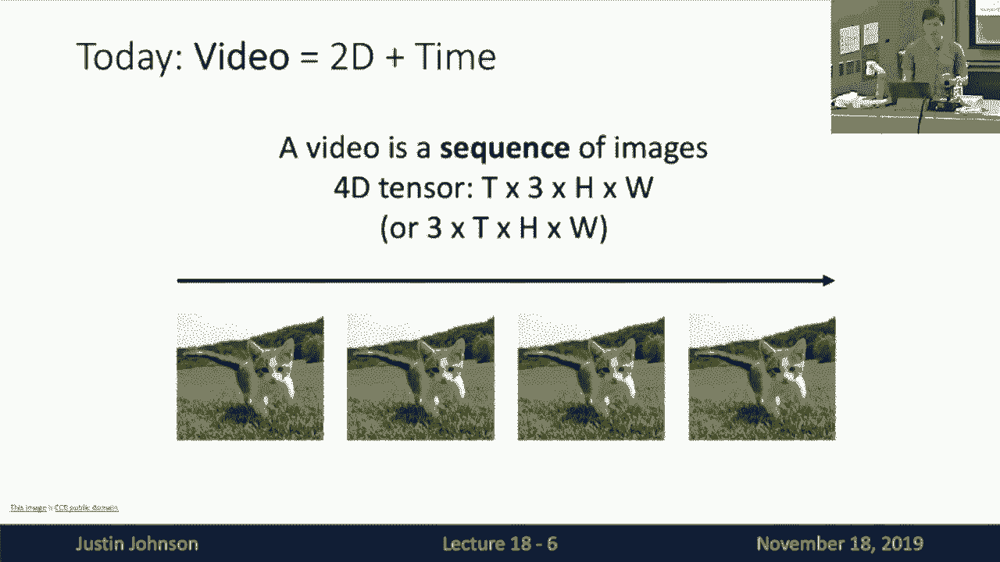

视频可以看作是一个图像序列在时间上的展开。这是一种特殊的三维表示，它包含两个空间维度和一个时间维度。与上一节处理三个空间维度不同，这种“2D空间+1D时间”的结构带来了额外的挑战，因为我们可能希望以不同的方式处理空间和时间信息。

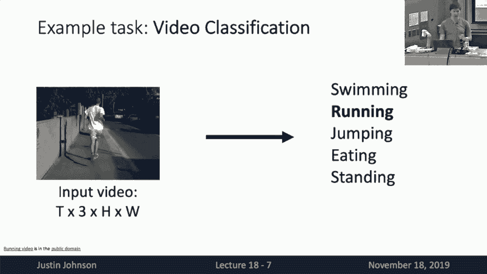

对于视频处理任务，我们的网络通常需要从处理三维张量（2D图像数据）转向处理四维张量。例如，我们可以将一个视频看作一个四维张量，其形状为 `(T, C, H, W)`，其中：
*   **T** 是时间或时间维度。
*   **C** 是通道维度（例如，原始输入视频的RGB三个颜色通道）。
*   **H** 和 **W** 是两个空间维度。

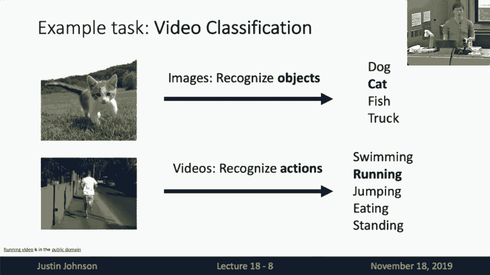

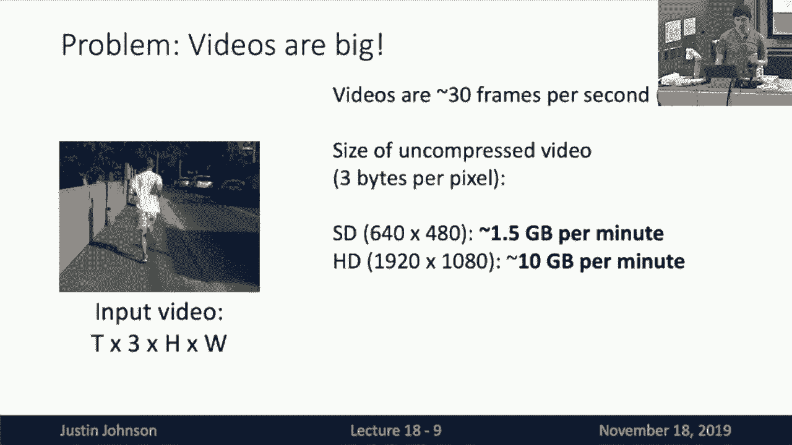

根据所使用的具体架构，我们有时会交换前两个维度的顺序。但基本思想是，视频就是一个四维张量，我们需要找到构建深度神经网络的方法来处理这类数据。

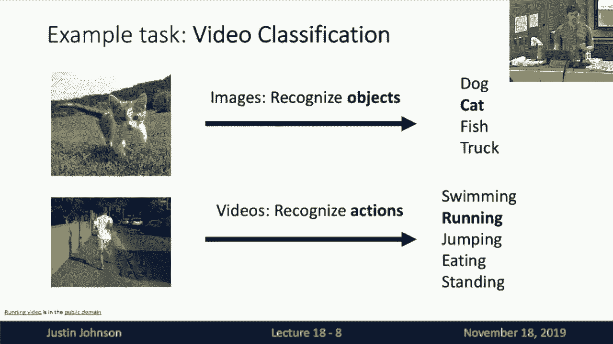

## 🎯 核心任务：视频分类

为了引出后续的各种架构，我们将使用**视频分类**任务作为主要动机。这基本上是图像分类任务在时间上的延伸。

网络将接受一个输入视频（即一堆RGB帧），系统需要选择一个类别标签来对该视频中的动作、活动或语义类别进行分类。与图像分类一样，系统在训练时知晓一组固定的类别，并拥有一个将视频与类别标签相关联的训练数据集。

训练时，我们通常使用交叉熵损失函数。整个任务的核心技巧在于：如何将这个四维输入张量转换为我们可用于训练交叉熵损失函数的分数向量。

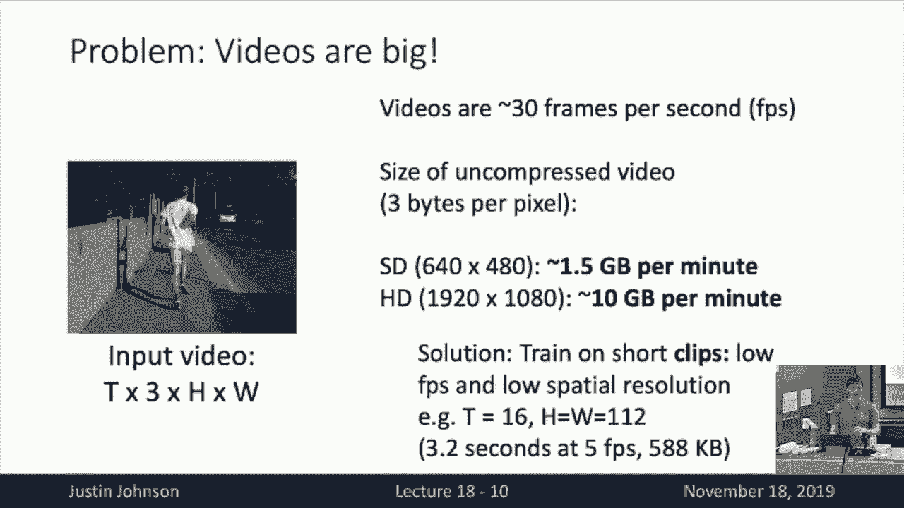

## 🏃 识别对象 vs. 识别动作

在二维识别任务中，我们通常识别的是**对象**（名词），例如狗、猫、瓶子或汽车。而在三维视频序列中，我们通常想要分类的是**动作或活动**（动词），例如游泳、跑步、跳跃、进食或站立。

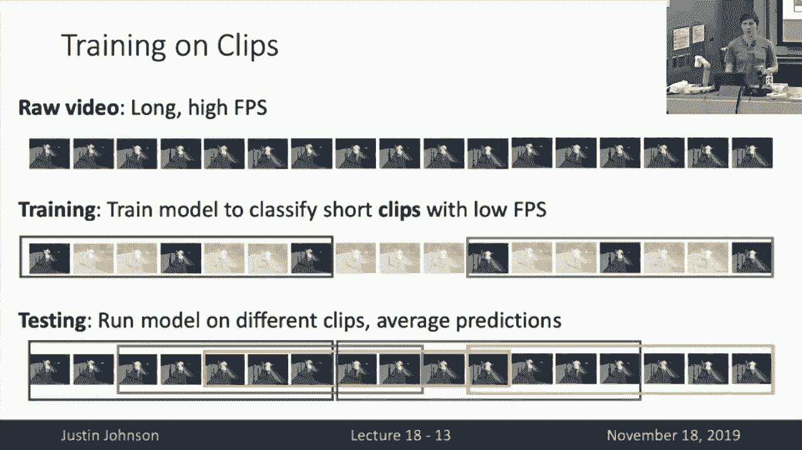

视频分类数据集中大多数类别标签都对应着人类可以执行的不同类型的动作或活动，因为分析人们的行为是深度学习在视频分析中的一个重要应用方向。

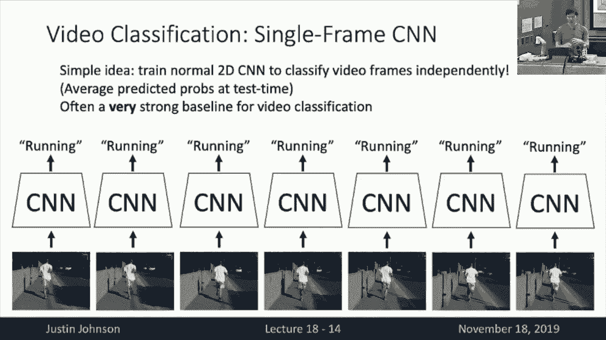

## 💾 视频数据的巨大挑战

处理视频数据的一个主要约束是其**数据量非常庞大**。如果处理不当，计算开销将难以承受。

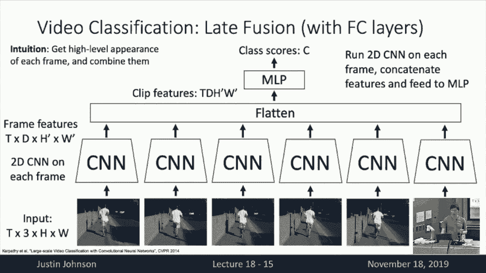

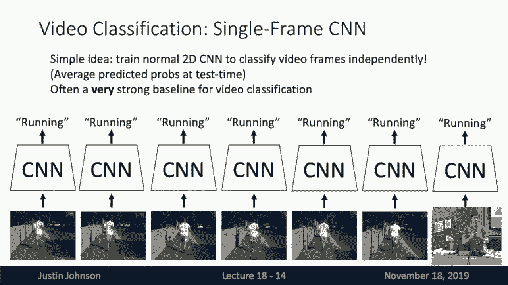

例如，一个标准清晰度（640x480像素）的视频流，以每秒30帧（fps）播放，其未经压缩的原始数据每分钟约为1.5GB。如果是全高清视频（1920x1080像素），这个数字会上升到每分钟10GB。如此庞大的数据量几乎不可能直接装入GPU内存进行处理。

因此，解决方案是必须大幅减小数据规模。在视频分类中，我们通常训练神经网络来分类**非常短的视频片段**（通常为3-5秒）。为了使其更易于处理，我们还会：
1.  **时间下采样**：将帧率从30 fps降至很低的水平（例如5 fps）。
2.  **空间下采样**：将视频帧的空间分辨率降至很低（例如112x112像素）。

由于计算限制，我们的神经网络目前只能处理这种非常短小、低分辨率的视频片段。

在训练时，我们从较长的视频中截取这些短片段进行训练。在测试时，我们通常将训练好的模型在原始视频的不同位置（不同子片段）上多次应用，然后对所有子片段的预测结果进行平均，以得到整个视频的最终分类预测。这是一种在训练和测试之间进行权衡的技巧。

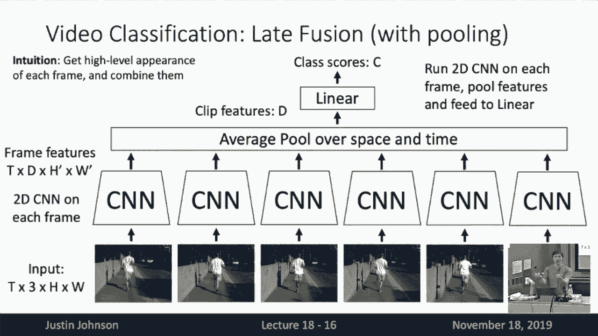

## 🖼️ 方法一：单帧基线模型

我们的第一个视频分类模型看似简单，但效果出奇地好：**忽略视频特性，训练一个标准的二维CNN来独立分类视频的每一帧**。

具体做法是：将视频序列的所有帧分割成独立的2D RGB图像，然后使用你最喜欢的标准2D图像识别模型（如ResNet）在每一帧上独立训练，训练目标是对应整个视频片段的标签。

在测试时，我们只需在视频的每一帧上运行这个单帧模型，然后对所有帧的预测结果进行平均。

这个模型基本上忽略了数据中的所有时间结构，但它实际上是许多视频分类任务中非常强大的基线模型。在构建实际的视频分类系统时，**应该首先尝试这个简单的单帧基线模型**，因为它通常已经足够好，而更复杂的时间建模方法往往只是将准确率从“很好”提升到“更好一点”。

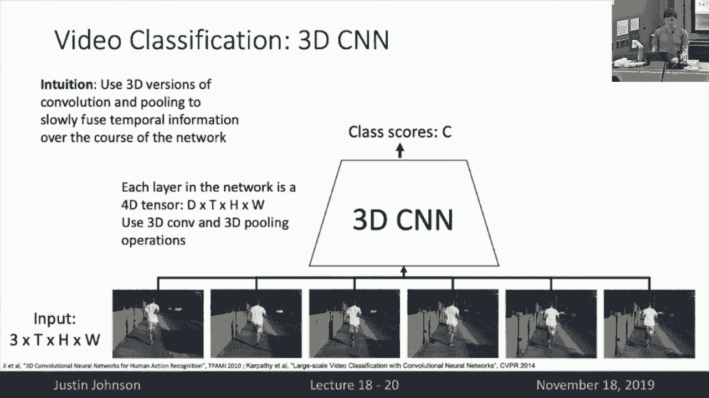

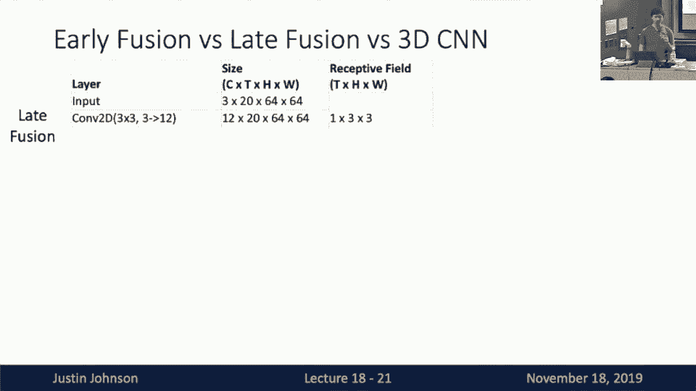

## 🔗 方法二：晚期融合

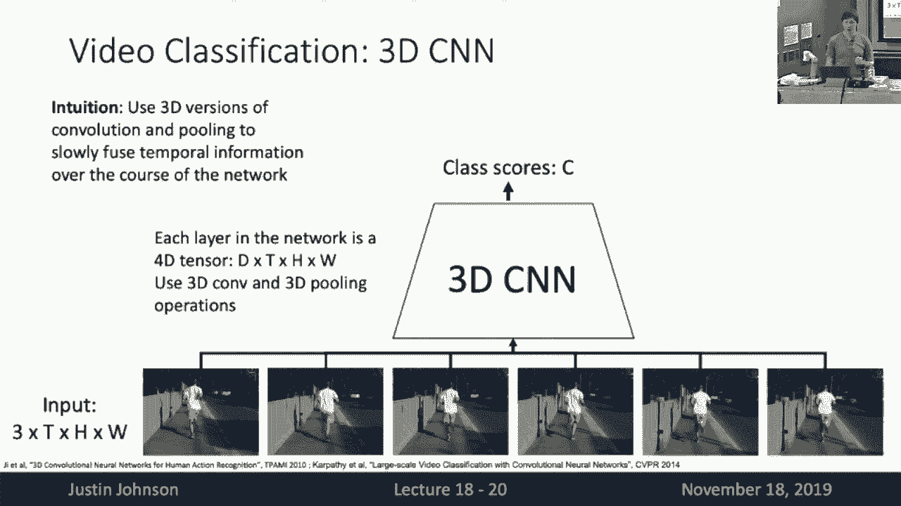

一个稍微复杂、并考虑了视频时间结构的模型是**晚期融合**。

在单帧基线中，我们在视频的每一帧上独立运行CNN，提取独立的分类决策，然后在测试时进行平均。晚期融合方法与此类似，但我们将“跨时间平均”的概念构建到网络本身中，让网络在训练时就能意识到测试时会进行这种平均。

具体操作如下：
1.  使用你最喜欢的2D CNN架构（如ResNet）独立处理视频序列的每一帧，提取每帧的特征。这样我们得到了一系列独立的每帧特征图。
2.  我们需要一种方式来聚合或组合所有这些独立的每帧特征。一种方法是使用全连接层：将每帧特征展平成一个巨大的向量（形状为 `T x D x H‘ x W’`），然后应用一些全连接层，将其映射到最终的类别分数C。
3.  使用交叉熵损失进行训练。

这种方法被称为“晚期融合”，因为我们在分类流程的**很晚的阶段**才融合时间信息（先独立进行每帧建模，最后才融合）。

另一种晚期融合的方法是使用**全局平均池化**。在提取了独立的每帧特征后，我们应用一个全局平均池化层，该层在所有空间维度和所有时间维度上进行平均池化。这样我们就得到了一个D维向量，然后可以应用线性层来获得最终的类别分数。这种方法更简单，参数更少，有助于防止过拟合。

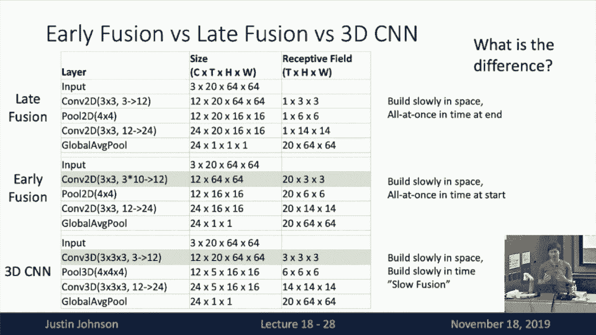

**晚期融合的局限性**：这种方法难以建模相邻视频帧之间非常低级的像素或特征运动。因为网络将每帧的所有信息汇总为一个向量，所以很难比较相邻帧之间的低级像素值。

## ⚡ 方法三：早期融合

既然有“晚期融合”，自然就有“早期融合”。其思想是：在CNN的**第一层**就融合所有的时间信息。

具体做法是：将输入视频帧序列（四维张量）重新塑形，将时间维度解释为一组通道。也就是说，将所有RGB帧沿着通道维度堆叠起来。这样我们就得到了一个三维张量，其通道维度为 `3 * T`（T是帧数），空间维度不变。

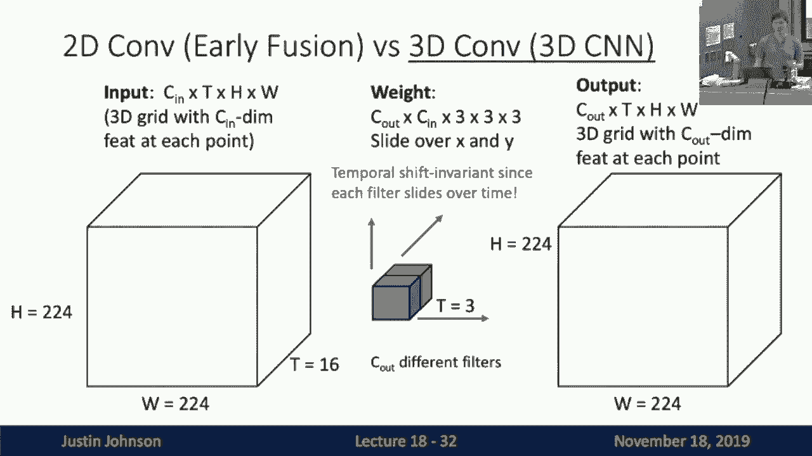

然后，我们可以使用一个单一的二维卷积操作来处理这个张量，该卷积的输入通道数为 `3T`。在这个第一层完成了“早期融合”之后，网络的其余部分可以是任何标准的二维卷积架构，因为时间信息已经在第一层被“折叠”了。

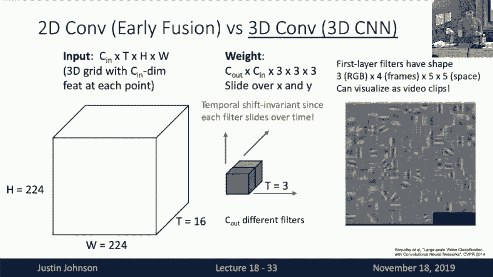

这种方法有望更好地建模相邻视频帧之间的低级像素运动，因为网络可以学习比较相邻帧局部像素的卷积核。但问题在于，这种方法可能过于激进：仅通过一个2D卷积层就破坏了所有的时间信息，而一个卷积层的计算量可能不足以正确建模视频序列中所有类型的时间交互。

## 🐌 方法四：3D CNN（慢速融合）

我们需要一种机制，允许我们在处理视频序列的过程中**缓慢地融合**信息，这就是**3D CNN**，有时也称为**慢速融合网络**。

其思想是：在CNN的每一层，我们都维护四维特征张量（通道、时间、高度、宽度）。在每一层的处理中，我们使用三维卷积和三维池化的类比操作，允许我们在许多层的处理过程中缓慢地在空间和时间上融合信息。

与早期融合（立即在整个时间范围上建立感受野）和晚期融合（在最后才建立时间感受野）不同，3D CNN允许网络在多个处理层中**缓慢地在空间和时间上建立感受野**。

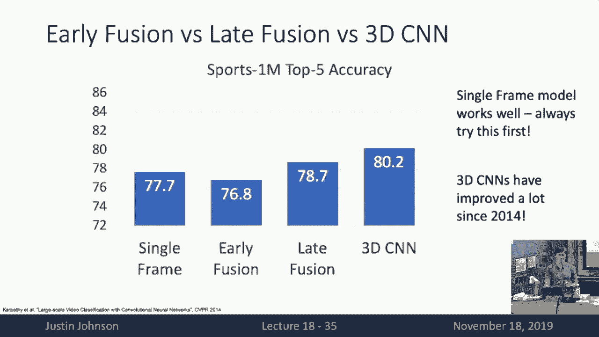

**2D卷积（早期融合） vs. 3D卷积（3D CNN）的核心区别**：
*   **2D卷积（早期融合）**：卷积核在空间上很小，但在时间上覆盖了整个输入长度。这意味着它**不具备时间平移不变性**。要检测不同时间点发生的相同变化（如颜色从蓝变橙），需要学习不同的滤波器。
*   **3D卷积（3D CNN）**：卷积核在空间和时间上都很小。它在所有空间维度和时间维度上滑动。这**解决了时间平移不变性问题**。要检测不同时间点发生的相同变化，只需要一个三维卷积滤波器，因为它会在所有时间位置上滑动。这使得3D卷积在表征上更高效。

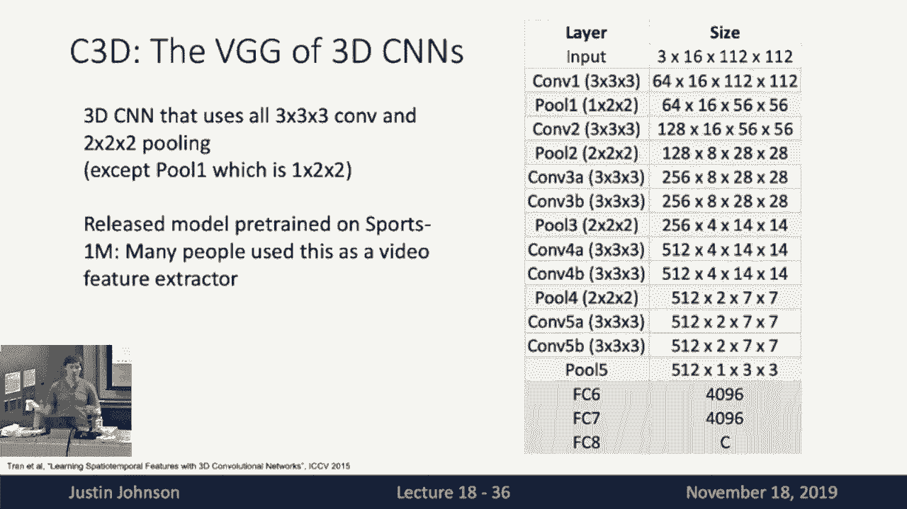

一个有趣的点是，我们可以将这些学习到的3D卷积滤波器可视化为小视频片段，从而了解网络学习了哪些类型的时空特征。

## 📊 基准测试与模型演进

为了比较这些不同方法的优劣，我们需要在数据集上进行基准测试。一个常用的数据集是 **Sports-1M**，它包含一百万个YouTube体育视频，标注了各种细粒度的体育类别。

比较结果令人惊讶：**单帧基线模型**的性能非常强大，准确率超过77%。早期融合模型的表现略差于单帧基线，而晚期融合和3D CNN方法比单帧方法稍好，但优势并不巨大。这再次证明了单帧基线在视频识别任务中的强大实力。

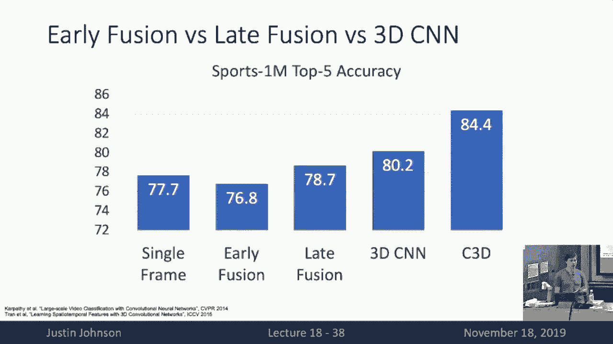

一个著名的改进版3D CNN架构是 **C3D**，它被称为“3D CNN中的VGG”。它完全由3x3x3的卷积和2x2x2的池化组成。C3D影响深远，因为作者发布了预训练权重，许多人将其作为固定的视频特征提取器用于下游任务。

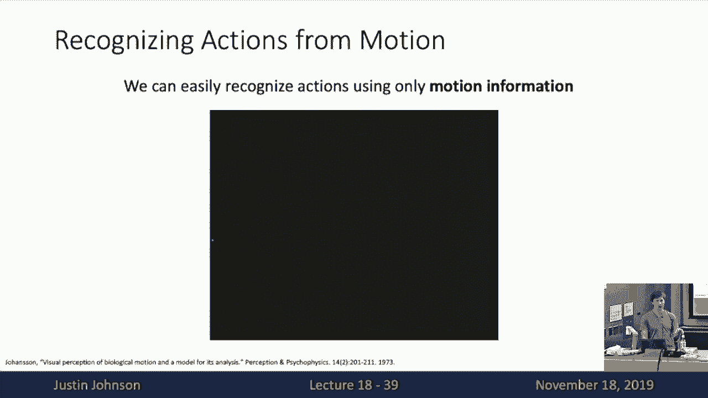

但3D CNN模型的计算成本非常高。例如，C3D模型处理一个很小的输入（16帧，112x112分辨率），其前向传播的总计算成本接近40 GigaFLOPs，是VGG16的三倍。这是视频模型的一个普遍问题。

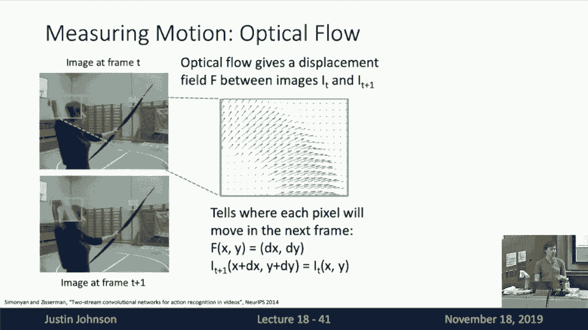

## 🌊 显式建模运动：双流网络

空间和时间也许应该在我们的模型中区别对待。人类仅凭运动信息就能识别很多动作（例如，仅凭几个移动的点就能识别行走的人）。受此启发，有一类神经网络架构尝试更**显式地将运动信息**作为网络内部的原始特征。

**光流**是量化运动信息的一种常用方法。它接收一对相邻的视频帧，计算一个流场或畸变场，描述每个像素从第一帧到第二帧的位移向量。光流为我们提供了关于像素在相邻帧之间如何移动的局部运动线索。

**双流网络**是一个著名的利用运动信息的视频识别架构：
1.  **空间流**：处理输入视频的**外观**。它输入视频片段中的单帧图像，并尝试预测类别分布。这本质上就是强大的单帧基线。
2.  **时间流**：仅处理**运动**信息。给定一个视频片段，我们计算每一对相邻帧之间的光流，得到一个通道数为 `2*(T-1)` 的张量（每个光流有x和y两个分量）。然后，我们使用早期融合方法（在第一层卷积融合所有光流场），网络的其余部分使用正常的2D CNN操作。时间流也独立地尝试仅根据运动信息预测分类决策。
3.  在测试时，空间流和时间流会分别预测一个类别概率分布，我们对这两个分布进行平均，得到最终预测。

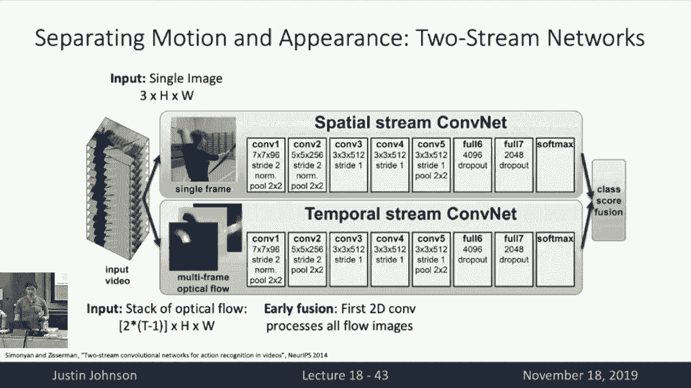

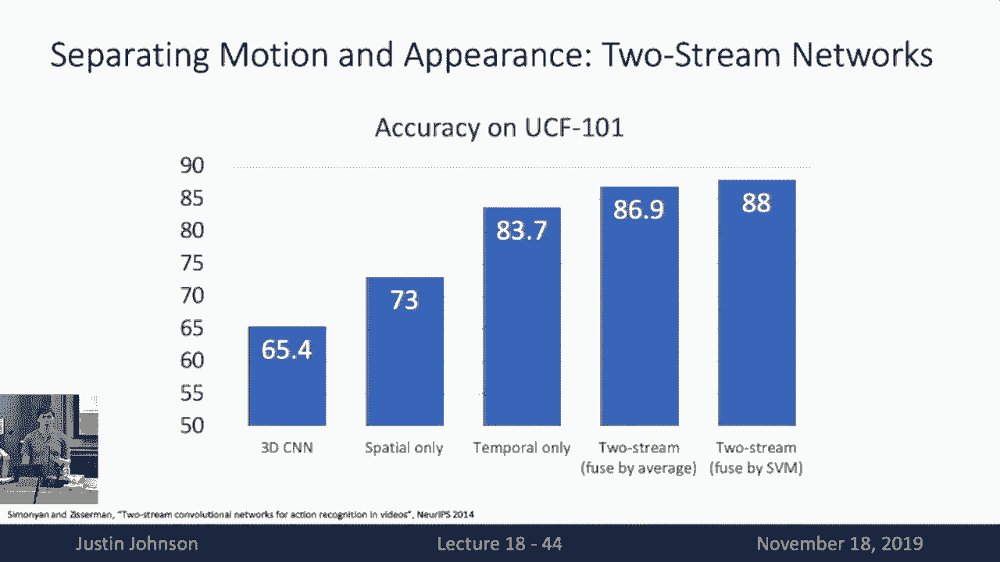

实验表明，仅使用时间流（运动信息）就能取得很好的性能，甚至能超过空间流（外观信息）。将两者融合后，性能能得到进一步提升。

## 🔄 结合CNN与RNN处理长时依赖

到目前为止，我们看到的建模方法（2D卷积、3D卷积、光流）在处理时间信息时都非常**局部**。如果我们想要构建能够识别时间上跨度更大的模式的CNN，该怎么办？

我们已经在本课程中见过一种能够处理长时序列信息的神经网络架构：**循环神经网络**。我们可以将CNN和RNN结合起来。

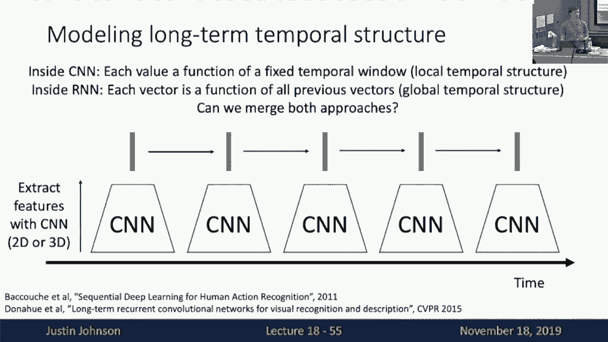

具体思路是：在时间序列的底部应用某种CNN（2D或3D）来提取每个时间点的局部特征，然后使用RNN架构（如LSTM）根据这些独立CNN的输出在时间上融合信息。我们可以使用“多对一”操作在视频末尾做出单个分类决策，也可以使用“多对多”操作在视频的每个时间点做出一系列预测。

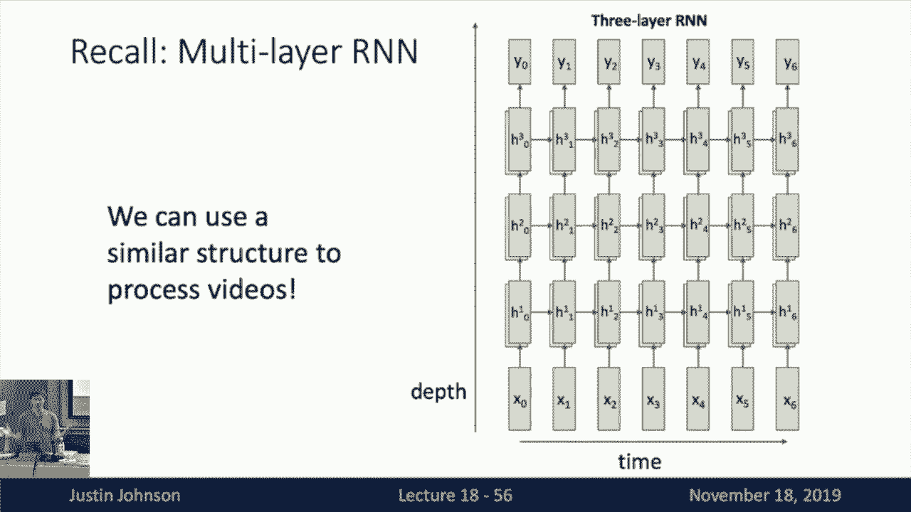

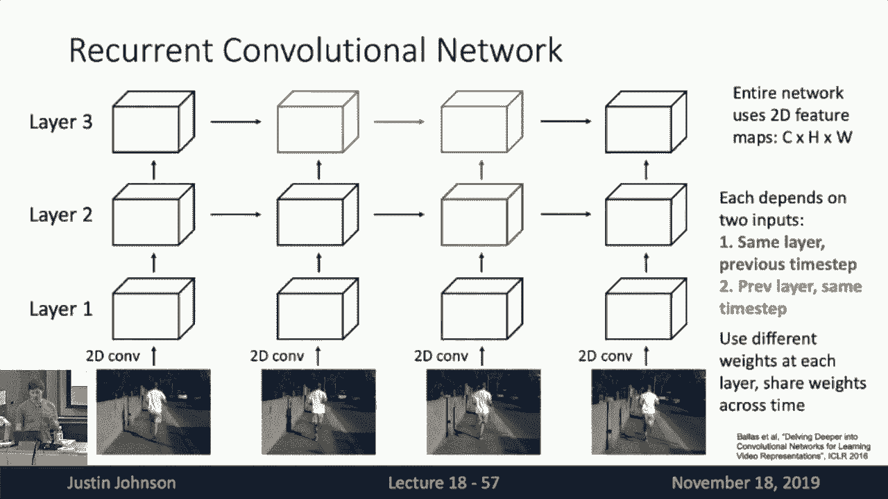

一个技巧是：我们可以使用预训练的C3D作为特征提取器，提取视频每个时间点的特征，然后在顶部使用RNN处理这些预提取的特征。这样我们就不需要向CNN反向传播，可以训练处理更长时间段的模型。

## 🧠 循环卷积网络

我们能否将局部融合（CNN内部）和长时融合（CNN顶部的RNN）两种方法结合起来？我们可以从RNN中获得灵感，看看**多层RNN**的结构。

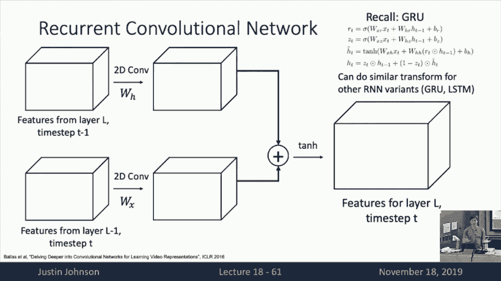

我们可以构建一个**多层循环卷积网络**。在这个二维网格中，每个点的特征张量（三维：空间+通道）将由**同一时间步的上一层特征**和**同一层的上一时间步特征**共同计算得到。然后，我们可以使用卷积操作来融合这两部分信息。

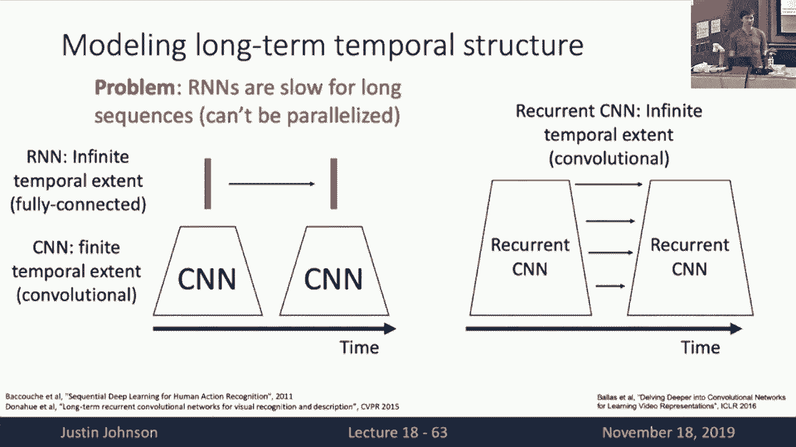

这相当于将熟悉的RNN公式（如Vanilla RNN：`h_t = tanh(W_x * x_t + W_h * h_{t-1} + b)`）中的矩阵乘法全部替换为2D卷积操作。这样，网络中的每一层、每一个神经元都变成了一个小型循环网络，空间和时间融合以非常巧妙的方式发生在网络的每一层。

尽管这个想法非常优美，但在实践中人们并没有过多使用，主要原因是**RNN的计算效率不高**。RNN在处理长序列时速度很慢，因为它们强制要求计算完前一个时间步才能计算下一个时间步，无法很好地并行化。

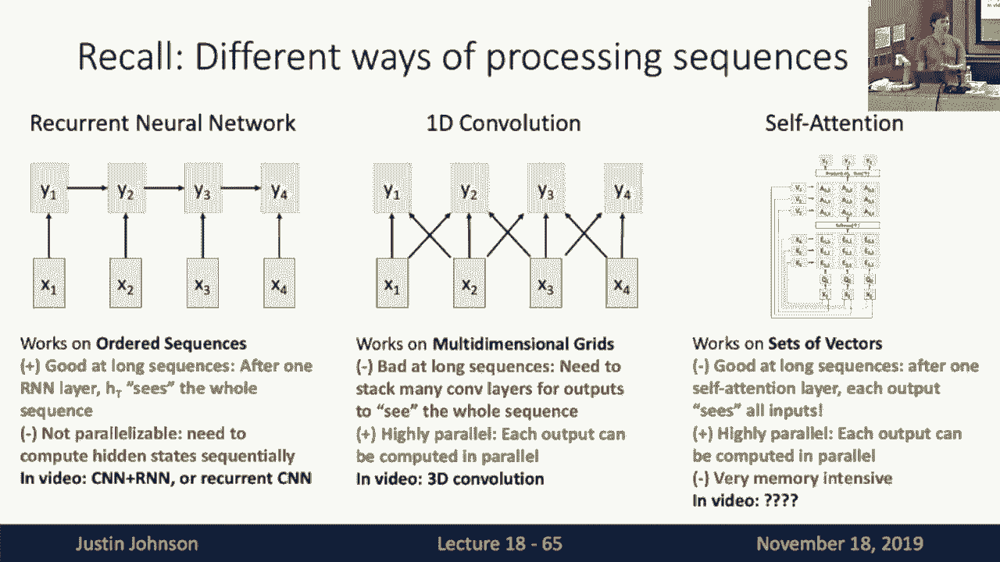

## ✨ 自注意力机制用于视频

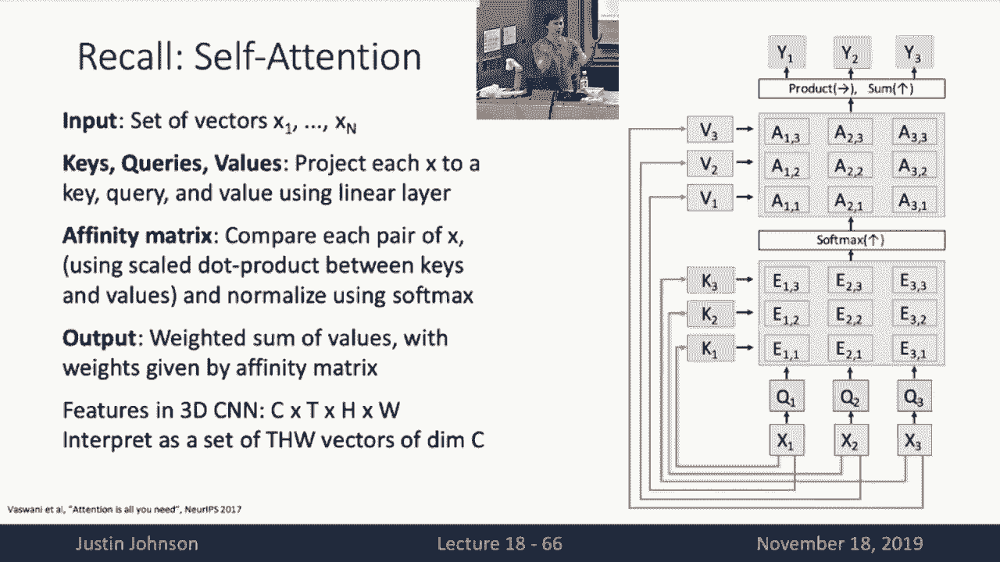

我们之前讨论过处理序列的另一种机制：**自注意力**。它擅长处理长序列，并且高度可并行化（没有时间依赖）。那么，能否将自注意力机制应用于视频序列处理呢？答案是肯定的。

我们可以将自注意力机制移植到3D领域。在网络的一部分使用3D CNN处理后，我们会得到一个四维张量（通道、时间、高度、宽度）。我们可以将这个四维张量解释为一组向量（共有 `T*H*W` 个向量，每个向量维度为C），然后在这组向量上运行完全相同的自注意力操作符。

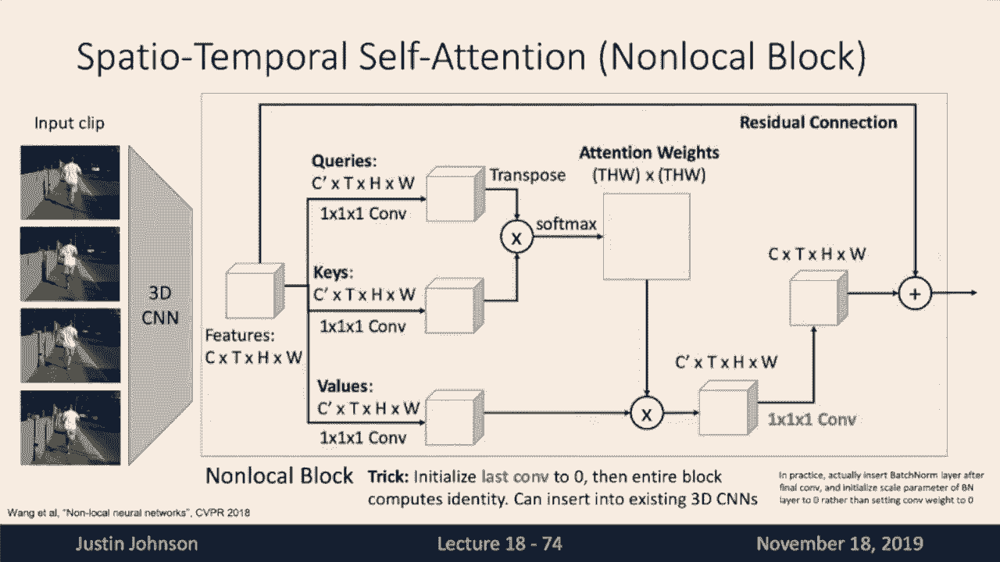

具体来说，这个操作（有时称为**非局部块**）可以插入到我们的3D CNN中，计算一种时空自注意力。一个巧妙的技巧是：我们可以通过将最后一个卷积层初始化为零，使整个块初始时计算恒等函数（由于残差连接）。这样，我们就可以将一个计算恒等函数的非局部块插入到已有的预训练3D CNN模型中，然后继续进行微调。

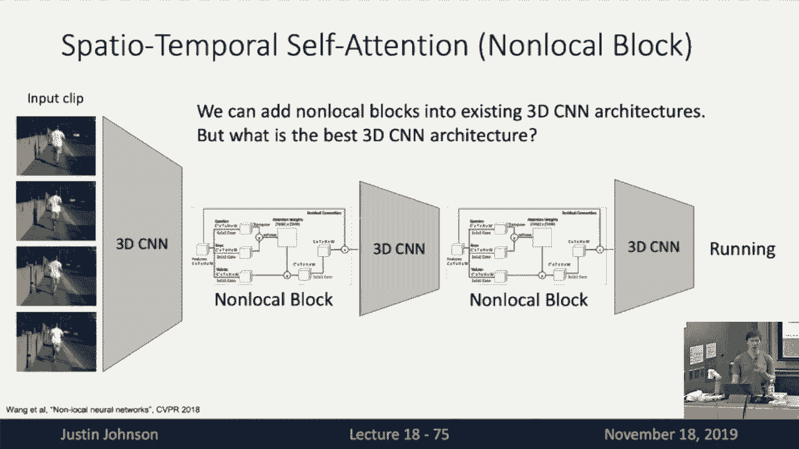

这种架构结合了3D CNN（缓慢融合时空信息）和非局部块（全局融合所有时空信息），是一种非常强大、接近最先进的视频识别架构。

## 🎈 膨胀2D网络：从图像到视频

我们仍然需要选择一个可以插入非局部块的3D CNN基础架构。一个非常酷的想法是：**将现有的优秀2D网络架构“膨胀”成3D**。

我们不想从头开始发明最好的3D CNN架构，而是希望利用在2D图像上设计好的架构。具体方法是：取一个现有的2D CNN架构（包含2D卷积和2D池化），将其中的每一个2D卷积替换为3D卷积，每一个2D池化替换为3D池化。

更进一步，我们不仅可以膨胀架构，还可以**迁移权重**。我们可以使用在图像上训练好的网络权重来初始化膨胀后的3D CNN。具体做法是：将每个卷积层的卷积核在时间维度上复制，然后除以复制因子。这样做的原因是，卷积是线性操作。如果我们有一个由单帧重复多次构成的“无聊”视频，使用复制权重的3D卷积在其上计算的结果，与在原图像上使用2D卷积计算的结果相同。

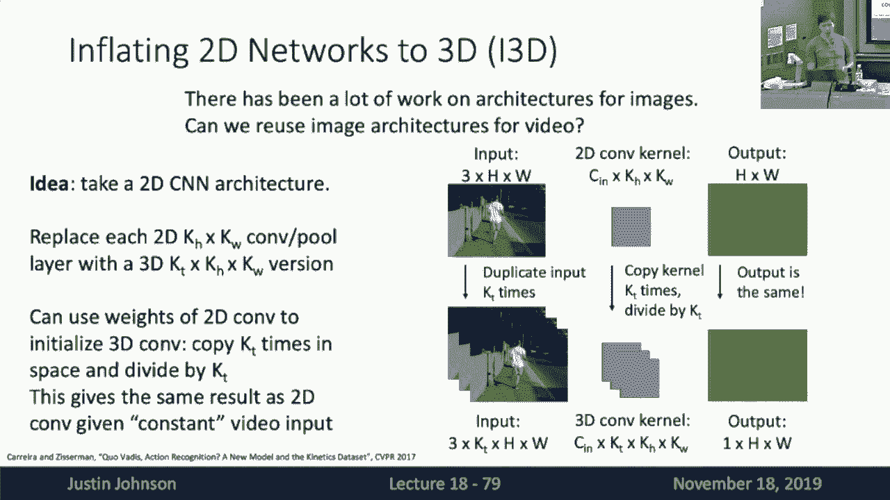

这个技巧允许我们在图像上预训练模型，然后膨胀架构和权重，再在视频数据集上继续微调。这让我们能够回收所有已知在图像上有效的架构和预训练模型。

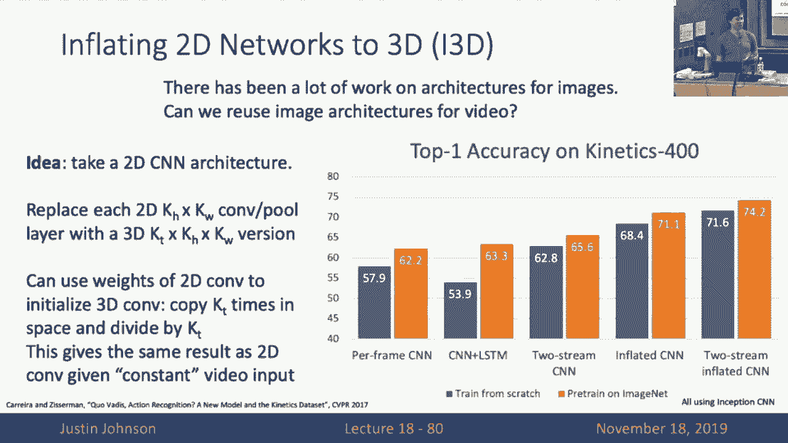

实验表明，在视频数据集上，这种“膨胀CNN”的方法比双流CNN等模型表现更好。将两个膨胀网络分别用于外观流和光流流，构成的双流膨胀网络效果更佳。

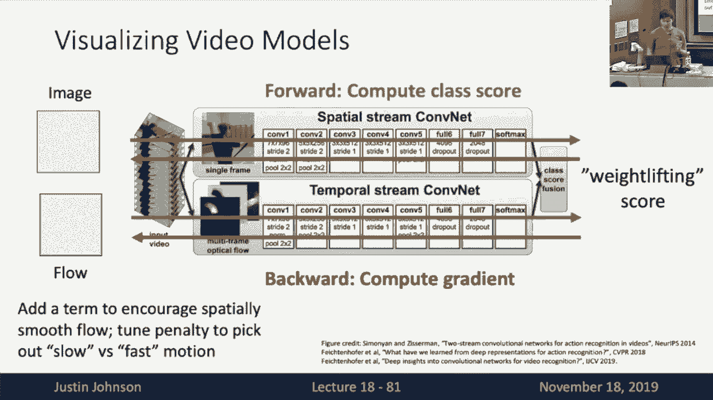

## 👁️ 可视化视频模型所学内容

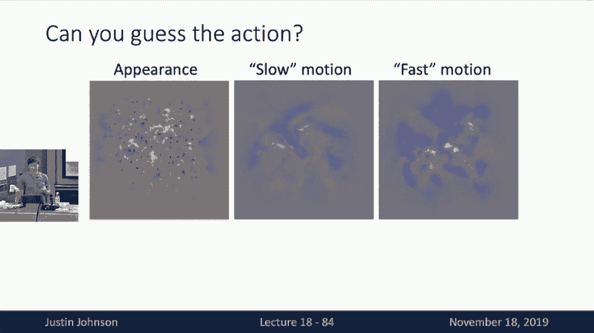

我们可以使用与可视化图像模型相同的技巧来可视化训练好的视频模型学到了什么。例如，我们可以随机初始化一个输入图像和一个光流场，然后通过网络前向传播计算特定类别的分类分数，再反向传播计算分数相对于输入图像和光流场的梯度，最后使用梯度上升来找到最大化该类别分数的图像和光流场。

可视化结果非常有趣。例如，对于“举重”类别，外观流学会在图像中寻找杠铃；慢速运动流学会寻找杠铃在顶部晃动；快速运动流则学会寻找将杠铃举过头顶的动作。对于“化妆”类别，外观流寻找眼睛，慢速运动流寻找头部或手部的运动，快速运动流则寻找局部涂抹的动作。

## 🚀 当前前沿：SlowFast 网络

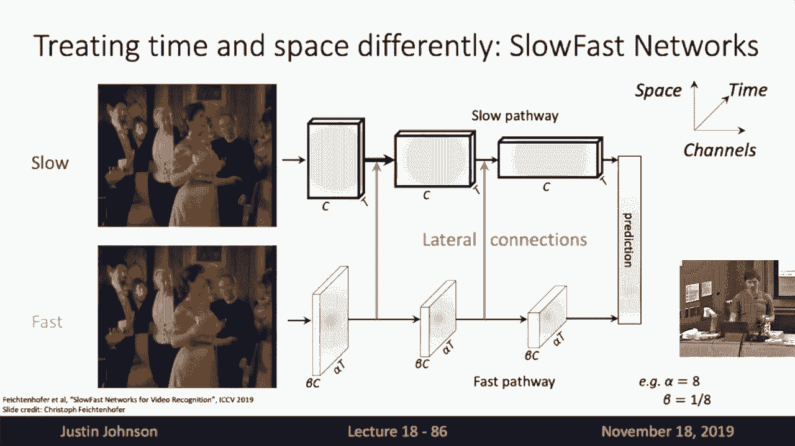

双流网络仍然依赖于外部的光流算法。如果能放松这个约束，构建仅处理原始像素值而不依赖外部光流的网络，那将是非常好的。这引出了当前最先进的 **SlowFast 网络**。

SlowFast网络仍然有两个并行分支，但两者都处理原始像素。关键区别在于它们以**不同的时间分辨率**运行：
1.  **慢速通路**：以**低帧率**运行，但网络“更胖”，每层使用**大量通道**进行深度处理。它主要捕捉外观和缓慢变化的语义信息。
2.  **快速通路**：以**高帧率**运行，但网络“更瘦”，每层使用**很少的通道**进行轻量处理。它主要捕捉快速变化的运动信息。
3.  **横向连接**：信息从快速通路融合回慢速通路，这与传统双流网络仅在最后平均融合不同，SlowFast在网络内部多个阶段进行融合。

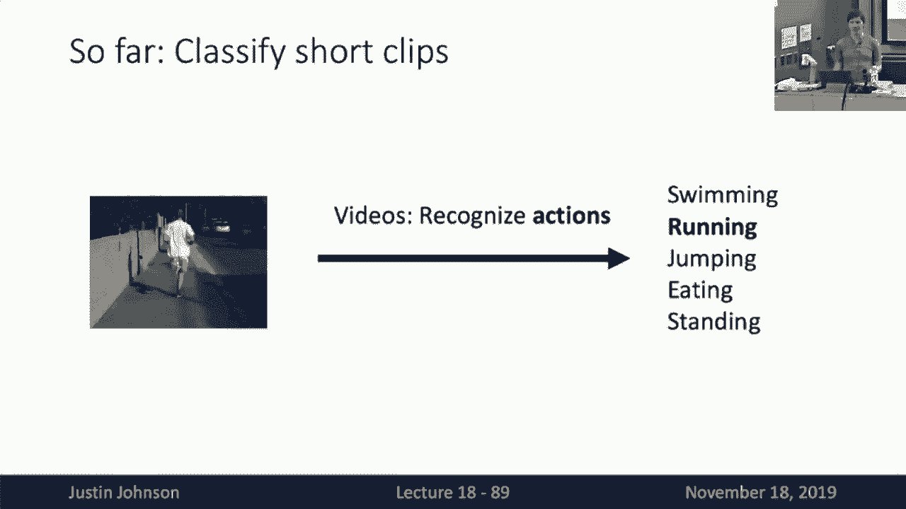

每个通路本身都是一个膨胀的ResNet-50架构。这种设计结合了本课讨论的多种技术（双流、膨胀、多分辨率处理），是目前许多视频理解任务上的最先进方法。

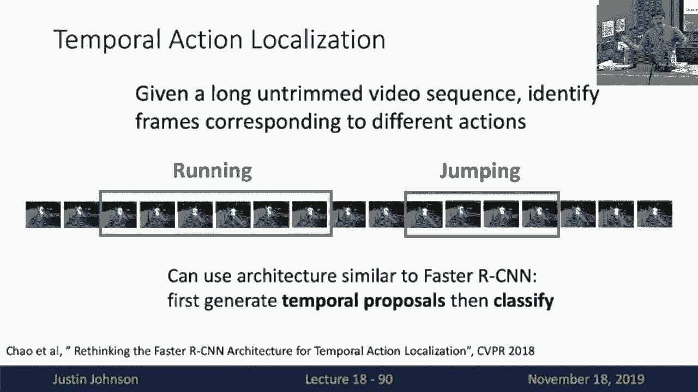

## 🕵️ 超越分类：其他视频任务

我们主要讨论了分类短视频片段的任务，这有助于引出许多时空CNN架构。当然，还有许多其他视频理解任务。

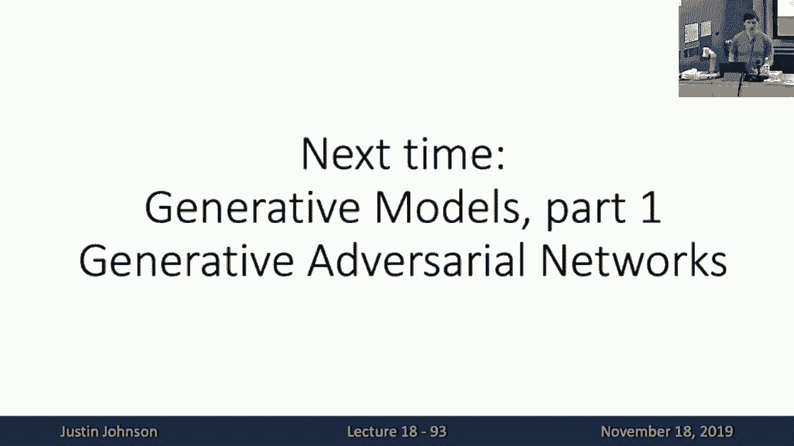

*   **时序动作定位**：给定一个很长的未修剪视频序列，模型需要检测其中发生的多个活动，并告诉我们每个活动发生的时间段。可以构建类似于Faster R-CNN的架构来实现。
*   **时空动作检测**：这是一个更具挑战性的任务，输入是一个长视频序列，任务是需要检测每一帧中