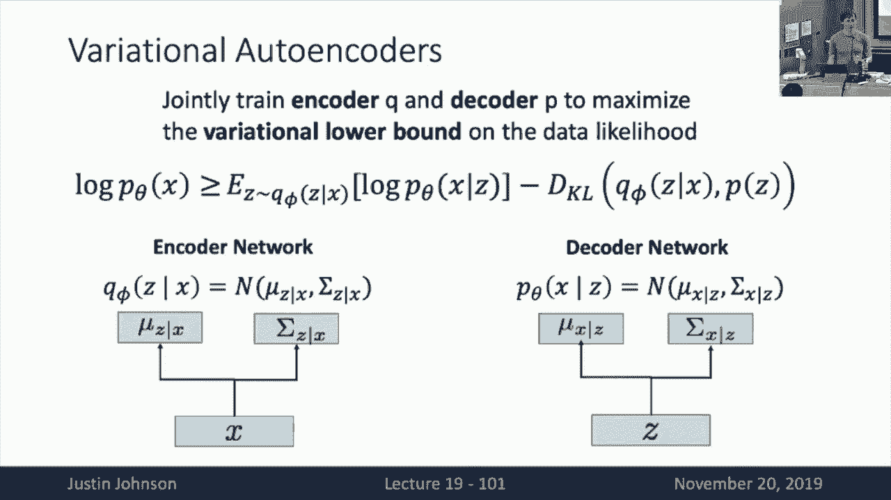

# 19：L19- 生成模型(上) 🎨

在本节课中，我们将要学习生成模型的基本概念、分类以及两种具体的生成模型：自回归模型和变分自编码器。我们将从监督学习与无监督学习的区别开始，逐步深入到生成模型的数学原理和实现方法。

---

## 📚 概述

生成模型是机器学习中的一个重要分支，它旨在学习数据的概率分布，从而能够生成新的数据样本。与判别模型不同，生成模型不仅能够进行分类，还能够检测异常值、学习特征表示，甚至生成全新的数据。

---

## 🔍 监督学习与无监督学习

在机器学习中，我们通常区分监督学习和无监督学习。监督学习依赖于带有标签的数据集，例如图像分类任务中，我们既有图像（输入 X）也有对应的标签（输出 Y）。无监督学习则只使用原始数据，没有标签，目标是发现数据中的隐藏结构。

以下是几种常见的无监督学习任务：

*   **聚类**：将数据样本分成不同的组。
*   **降维**：将高维数据投影到低维空间，如主成分分析（PCA）。
*   **自编码器**：通过重建输入数据来学习潜在表示。
*   **密度估计**：学习一个概率分布，使得训练数据具有高概率。

---

## 🧮 判别模型与生成模型

在概率框架下，机器学习模型可以分为判别模型和生成模型。

*   **判别模型**：学习条件概率分布 **P(Y|X)**，即给定输入 X 预测输出 Y 的概率。例如，图像分类器。
*   **生成模型**：学习联合概率分布 **P(X)**，即数据 X 本身的概率分布。它能够评估任何输入数据的可能性。
*   **条件生成模型**：学习条件概率分布 **P(X|Y)**，即在给定标签 Y 的情况下生成数据 X 的概率。

生成模型的一个关键特性是，由于概率密度函数必须归一化（积分为1），不同的数据样本会“竞争”概率质量。这使得生成模型能够识别并拒绝不合理的输入。

根据贝叶斯规则，这些模型之间存在联系：
**P(X|Y) = P(Y|X) * P(X) / P(Y)**

---

## 🌳 生成模型的分类

生成模型可以根据其密度函数的形式进行分类：

1.  **显式密度模型**：能够直接计算密度函数的值。
    *   **可处理的密度模型**：如自回归模型。
    *   **近似密度模型**：如变分自编码器。
2.  **隐式密度模型**：无法直接计算密度值，但可以从中采样。例如生成对抗网络（将在下节课介绍）。

---

## 🔢 自回归模型

自回归模型是一种具有显式且可处理密度函数的生成模型。其核心思想是将数据的联合概率分布分解为条件概率的乘积。

对于图像数据，我们可以将像素按顺序排列（例如从左到右、从上到下），然后使用链式法则：
**P(X) = Π P(x_i | x_1, ..., x_{i-1})**

这类似于我们在循环神经网络（RNN）中看到的结构。因此，我们可以使用RNN来建模图像像素的生成过程。

以下是两种具体的自回归模型：

*   **PixelRNN**：使用RNN按顺序生成像素。虽然效果不错，但训练和采样速度较慢。
*   **PixelCNN**：使用掩码卷积来并行计算像素的条件概率，训练速度更快，但采样仍然较慢。

自回归模型的优点是密度函数可计算，便于评估。然而，它们生成样本的速度较慢，且生成的图像质量有时不够高。

---

## 🌀 变分自编码器

变分自编码器是一种具有近似显式密度函数的生成模型。它结合了自编码器的结构和概率建模的思想。

### 自编码器基础

自编码器是一种无监督学习方法，旨在学习数据的压缩表示。它由两部分组成：

*   **编码器**：将输入数据 X 映射到潜在表示 Z。
*   **解码器**：从潜在表示 Z 重建输入数据 X。

训练目标是最小化重建误差，从而学习到有用的特征表示。然而，传统的自编码器不是概率模型，无法生成新样本。

### 变分自编码器的概率框架

变分自编码器引入了概率分布：

*   **先验分布**：假设潜在变量 Z 服从简单的分布，如标准正态分布 **N(0, I)**。
*   **解码器**：学习条件分布 **P(X|Z)**，通常假设为对角高斯分布。
*   **编码器**：学习近似后验分布 **Q(Z|X)**，以解决贝叶斯规则中难以计算的部分。

通过引入变分下界，我们可以最大化数据的对数似然的下界：
**log P(X) ≥ E[log P(X|Z)] - D_KL(Q(Z|X) || P(Z))**

其中：
*   **E[log P(X|Z)]** 是重建项。
*   **D_KL(Q(Z|X) || P(Z))** 是KL散度项，衡量编码器输出与先验分布的差异。

通过最大化这个下界，我们可以同时训练编码器和解码器，从而学习到一个能够生成新样本的概率模型。

---

## 📝 总结

在本节课中，我们一起学习了生成模型的基本概念和两种具体实现：自回归模型和变分自编码器。

*   自回归模型通过顺序生成数据（如像素）来建模概率分布，具有显式且可处理的密度函数，但生成速度较慢。
*   变分自编码器结合了自编码器和概率建模，通过最大化变分下界来学习数据的潜在表示和生成新样本。

下节课我们将继续探讨生成模型，重点介绍生成对抗网络及其应用。