# 20：L20- 生成模型(下) 🧠

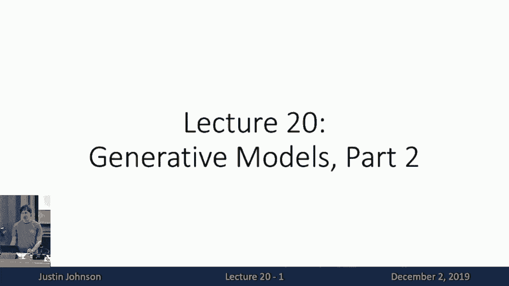

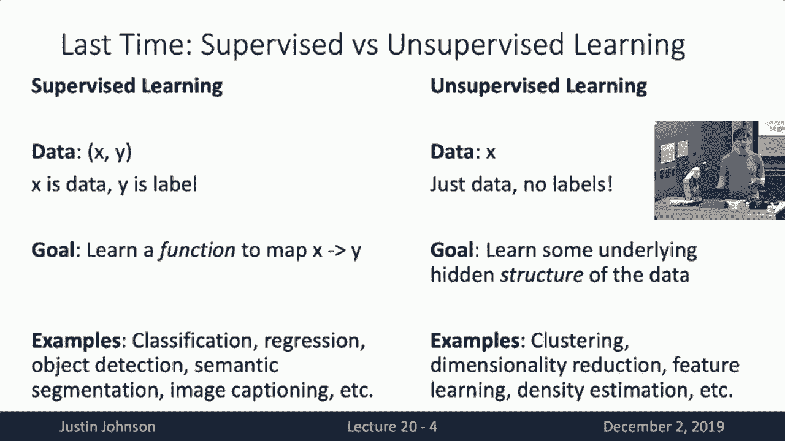

在本节课中，我们将继续探讨生成模型，这是深度学习领域中一个非常活跃且富有挑战性的研究方向。我们将重点介绍**变分自编码器** 和**生成对抗网络** 这两种强大的生成模型，并理解它们的工作原理、优势与挑战。

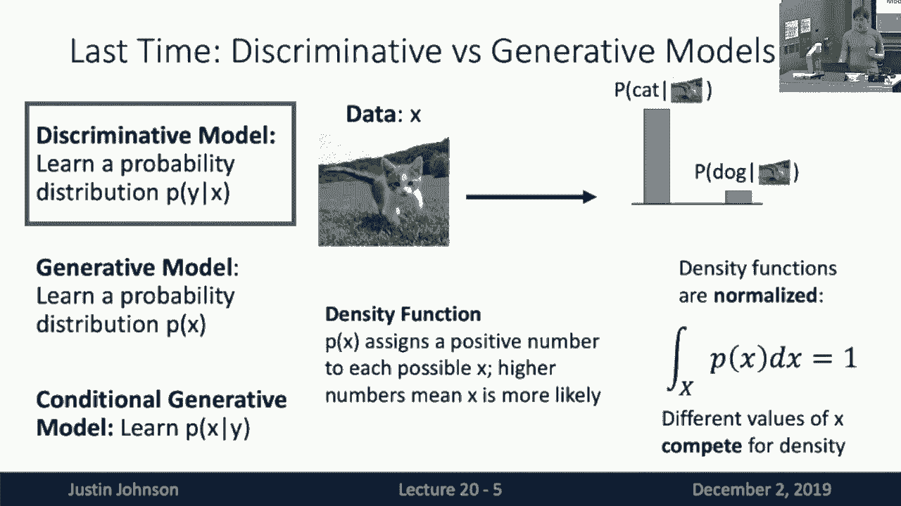

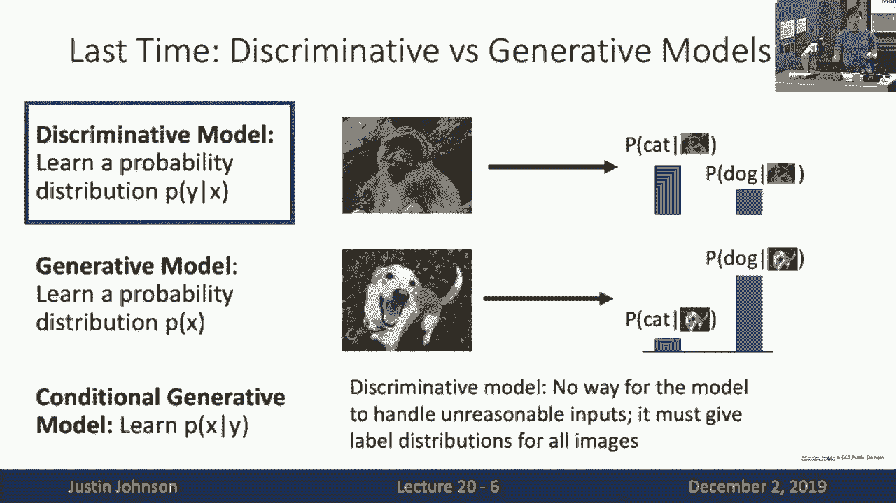

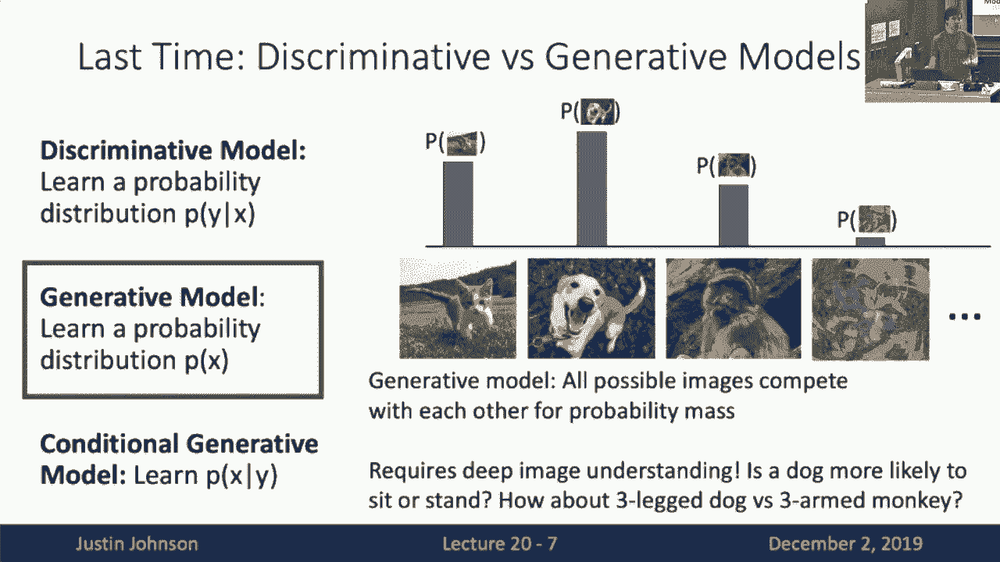

---

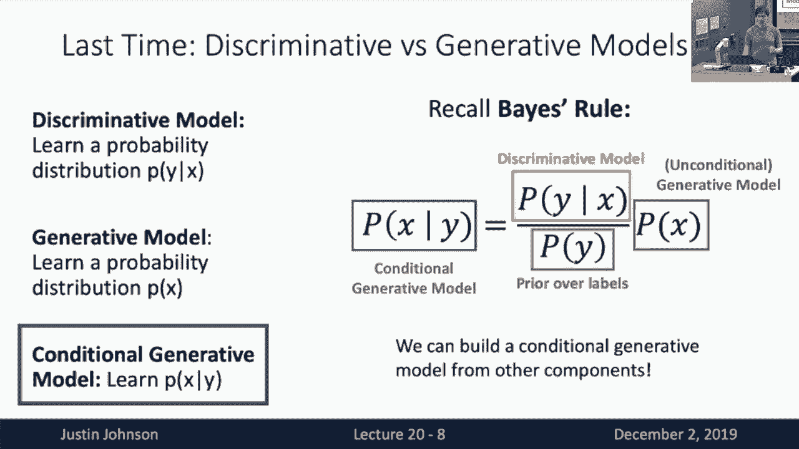

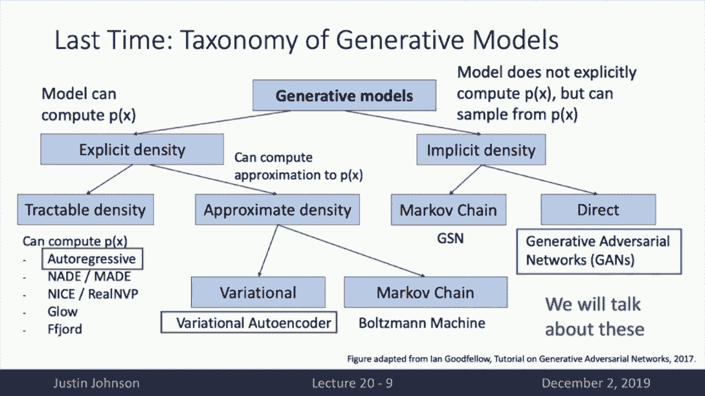

## 概述：从判别模型到生成模型

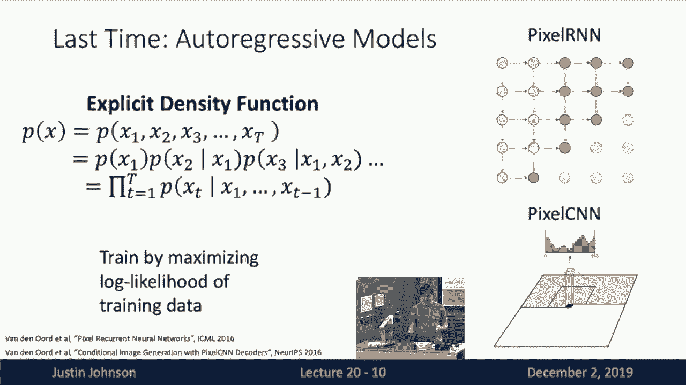

上一节我们介绍了生成模型的基本概念，并区分了**判别模型** 与**生成模型**。判别模型学习的是条件概率分布 **P(Y|X)**，而生成模型则试图直接对数据本身的分布 **P(X)** 进行建模。我们还回顾了**自回归模型**，它通过逐个预测像素来显式地定义图像的概率分布。

本节中，我们将深入探讨另外两类重要的生成模型：变分自编码器和生成对抗网络。它们采用了不同的策略来学习复杂的数据分布。

---

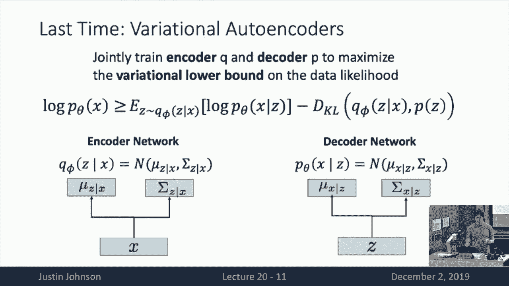

## 变分自编码器：学习潜在表示

自回归模型直接对像素进行建模，但它们没有学习到一个压缩的、有意义的**潜在表示**。变分自编码器则引入了一个潜在变量 **z**，旨在学习数据的高层语义特征。

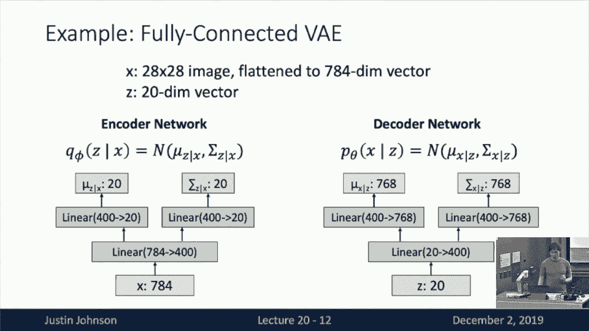

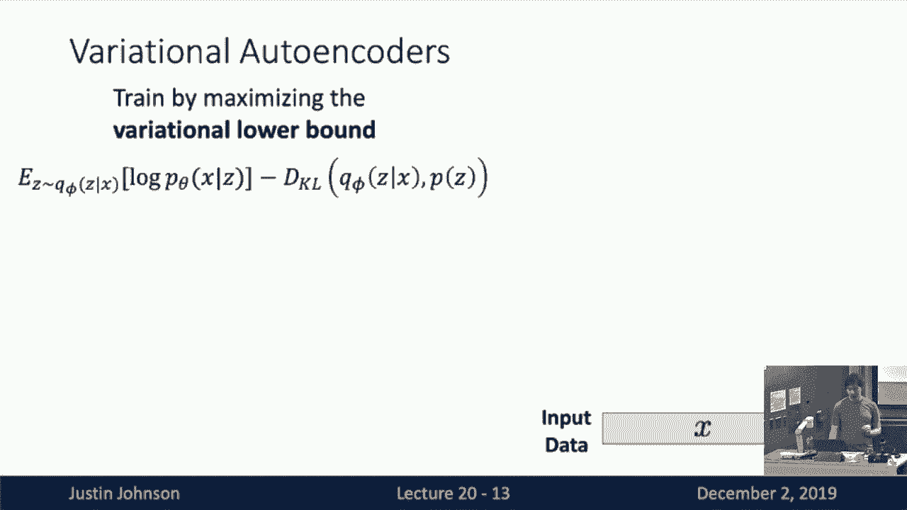

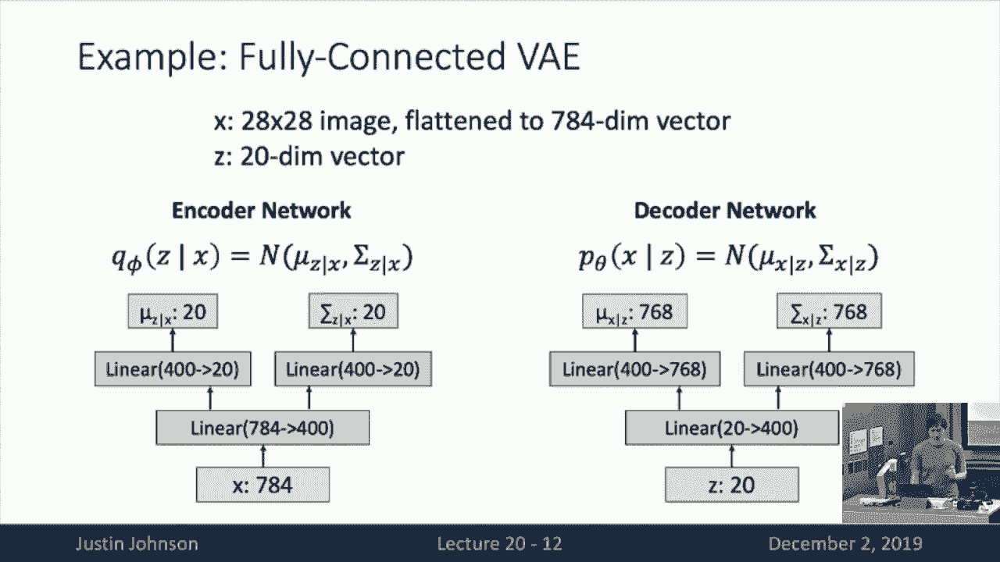

### 核心思想与架构

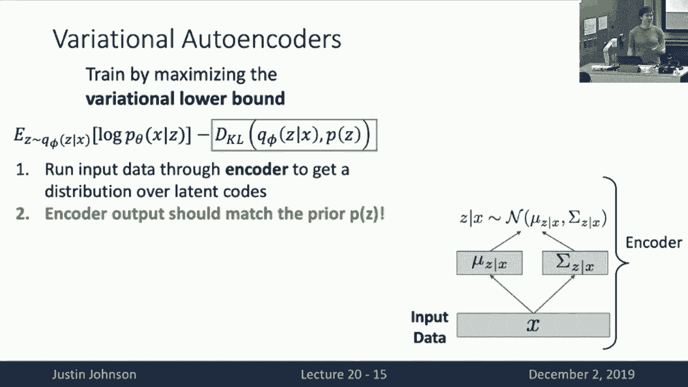

变分自编码器的目标是学习数据的生成过程 **P(X)**。它通过引入潜在变量 **z**，将问题转化为学习 **P(X|z)** 和 **P(z|X)**。由于直接最大化数据似然 **P(X)** 是难解的，我们转而最大化其**变分下界**。

模型包含两个神经网络：
*   **编码器 (Encoder)**: 输入数据 **x**，输出潜在变量 **z** 的分布参数（例如高斯分布的均值和方差）。我们记其分布为 **q_φ(z|x)**。
*   **解码器 (Decoder)**: 输入潜在变量 **z**，输出重构数据 **x‘** 的分布参数。我们记其分布为 **p_θ(x|z)**。

为了便于计算，我们通常假设这些分布是**对角高斯分布**。编码器网络输出均值向量 **μ** 和对角协方差矩阵 **σ²I**。

**一个简单的全连接VAE架构示例（用于MNIST数据集）:**
```python
# 编码器: 输入784维（28x28图像展平），输出20维潜在变量的均值和方差
encoder_fc1 = Linear(784, 400) -> ReLU
encoder_mean = Linear(400, 20)   # 输出均值 μ
encoder_logvar = Linear(400, 20) # 输出方差的对数 log(σ²)，保证正值

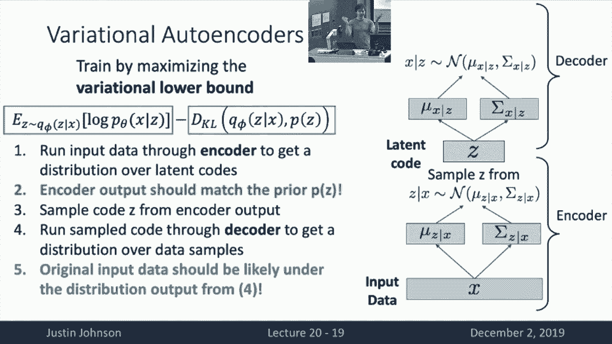

# 解码器: 输入20维潜在变量，输出784维重构图像的均值和方差
decoder_fc1 = Linear(20, 400) -> ReLU
decoder_mean = Linear(400, 784)   # 输出重构像素的均值
decoder_logvar = Linear(400, 784) # 输出重构像素的方差
```

### 训练目标：最大化变分下界

变分自编码器的训练目标是最大化证据下界：
**ELBO = E_{z~q_φ(z|x)}[log p_θ(x|z)] - D_{KL}(q_φ(z|x) || p(z))**

这个目标包含两项：
1.  **重构损失**: 期望潜在变量 **z**（从编码器分布采样）能通过解码器很好地重构原始数据 **x**。这鼓励潜在编码包含足够的信息。
2.  **KL散度项**: 鼓励编码器输出的分布 **q_φ(z|x)** 接近我们预设的简单先验分布 **p(z)**（通常为标准正态分布 **N(0, I)**）。这起到了正则化的作用，让潜在空间更规整、易于采样。

由于我们选择了高斯分布，KL散度项可以解析计算。训练时，我们使用**重参数化技巧**从 **q_φ(z|x)** 中采样 **z**，从而使梯度可以通过采样过程反向传播。

以下是训练一个VAE的步骤：
1.  从训练集中取一个批次的数据 **x**。
2.  通过编码器得到 **μ** 和 **log(σ²)**。
3.  使用重参数化采样潜在变量：**z = μ + ε * σ**，其中 **ε ~ N(0, I)**。
4.  将 **z** 输入解码器，得到重构数据的分布参数。
5.  计算重构损失（如二元交叉熵或均方误差）和KL散度损失。
6.  将两项损失相加，通过反向传播同时更新编码器和解码器的参数。

### VAE的能力与应用

一旦VAE训练完成，我们可以用它做几件很酷的事情：

*   **生成新数据**: 从先验分布 **p(z)**（如标准正态分布）中随机采样一个 **z**，输入解码器，就能生成一张新的图像。
*   **探索潜在空间**: 由于我们规范了潜在空间，在其间进行插值会产生语义上平滑过渡的图像。例如，从一个数字“7”的编码逐渐变化到数字“1”的编码，生成的图像会平滑地从“7” morph 成“1”。
*   **图像编辑**: 给定一张图像，可以通过编码器得到其潜在编码 **z**，然后有目的地修改 **z** 的某些维度，再通过解码器生成编辑后的图像。研究发现，潜在空间的某些维度可能对应着有意义的属性，如人脸图像的“表情”或“光照方向”。

VAE的优点是提供了一个 principled 的概率框架，并学习了有用的潜在表示。但其生成的图像有时会比较模糊，这是其简化分布假设（如高斯分布）带来的一个局限。

---

## 生成对抗网络：通过对抗学习生成

生成对抗网络采取了一种完全不同的思路：它放弃了显式地对数据分布 **P(X)** 进行建模，而是专注于**学习如何从该分布中采样**。GAN的核心思想是通过一个“对抗”的游戏来训练模型。

### 核心思想：双人博弈

GAN框架中包含两个相互对抗的神经网络：
*   **生成器 G**: 输入一个从简单分布（如均匀分布或正态分布）中采样的随机噪声向量 **z**，输出一张合成图像 **G(z)**。它的目标是生成足以“以假乱真”的图像。
*   **判别器 D**: 输入一张图像，输出一个标量，表示该图像是来自真实数据分布（输出接近1）还是来自生成器（输出接近0）。它的目标是成为一个优秀的“鉴定师”。

它们的训练过程形成一个**极小极大博弈**：
**min_G max_D V(D, G) = E_{x~p_data(x)}[log D(x)] + E_{z~p_z(z)}[log(1 - D(G(z)))]**

*   **判别器 D 试图最大化 V**: 它要最大化对真实图像判为“真”(log D(x))和对生成图像判为“假”(log(1-D(G(z))))的概率。
*   **生成器 G 试图最小化 V**: 具体是最小化第二项，即让判别器对自己生成的图像判为“真”(D(G(z))接近1)，这样 log(1-D(G(z))) 就会变小。

在实际训练中，我们交替优化D和G。理论上，当博弈达到纳什均衡时，生成器学到的分布 **P_G** 将无限接近真实数据分布 **P_data**，而判别器则无法区分真假（始终输出0.5）。

### 训练技巧与挑战

原始的GAN目标函数在训练初期可能存在梯度消失问题（当生成器很差时，判别器很容易识别，导致生成器梯度很小）。一个常见的改进是训练生成器去**最大化 log(D(G(z)))**，而不是最小化 log(1-D(G(z)))。这提供了更稳定的梯度。

训练GAN非常具有挑战性：
*   **模式崩溃**: 生成器可能只学会生成少数几种样本，缺乏多样性。
*   **训练不稳定**: 生成器和判别器的损失波动很大，难以监控。
*   **超参数敏感**: 对学习率、网络架构等非常敏感。

研究人员提出了许多改进，如使用 Wasserstein 距离的 WGAN、谱归一化、自注意力机制等，极大地提升了GAN的稳定性和生成质量。

### GAN的惊人进展与应用

自2014年提出以来，GAN的发展日新月异，生成图像的质量和分辨率飞速提升：

*   **DCGAN**: 首次成功将卷积网络用于GAN，生成了结构复杂的卧室图像。
*   **Progressive GAN**: 通过渐进式增长网络，生成了高清(1024x1024)的人脸图像。
*   **StyleGAN**: 通过对潜在空间进行更精细的控制，生成了极其逼真且多样化的人脸和物体图像。

GAN的应用远不止无条件图像生成：

*   **条件生成**: 通过将类别标签等信息输入生成器和判别器，可以实现**可控生成**。例如，指定生成“火烈鸟”或“校车”的图像。这通常通过**条件批归一化**等技术实现。
*   **图像到图像翻译**: 学习从一个图像域到另一个图像域的映射。例如，将语义分割图转换为真实照片、将素描上色、将马变成斑马（CycleGAN）、将低分辨率图像超分辨为高清图像等。
*   **其他领域**: GAN也被用于生成文本、音乐、3D模型，甚至预测行人未来轨迹。

---

## 总结与展望

本节课我们一起深入学习了两种主流的深度生成模型：

1.  **变分自编码器**：一种基于概率框架的生成模型，通过最大化变分下界来同时学习数据的潜在表示和生成过程。它结构清晰，能进行有意义的潜在空间操作，但生成的图像可能较模糊。
2.  **生成对抗网络**：一种通过对抗博弈训练的生成模型，放弃了显式的似然计算，专注于生成高质量的样本。它能够生成极其逼真的图像，并广泛应用于各种条件生成和图像翻译任务，但训练过程不稳定且难以调试。

此外，我们还看到了结合自回归模型和VAE思想的**VQ-VAE-2**等前沿工作，它们试图融合不同模型的优点。

生成模型是通向无监督学习这一“圣杯”的重要路径，它使机器能够理解并创造数据的内在结构和模式。从自回归模型到VAE，再到GAN，每一种方法都为我们提供了不同的视角和工具。尽管挑战依然存在，但这个领域的快速发展持续为我们带来惊喜，并推动着人工智能在艺术、设计、仿真等众多领域的应用边界。