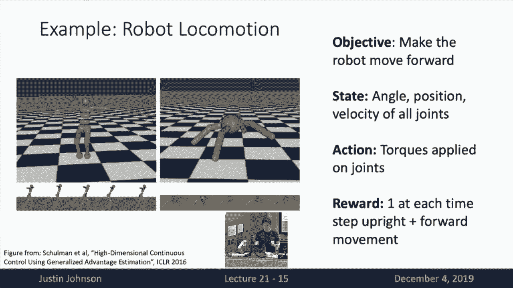
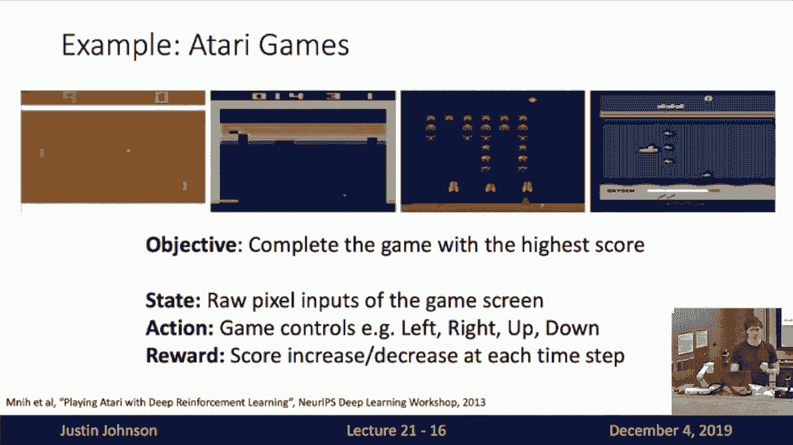
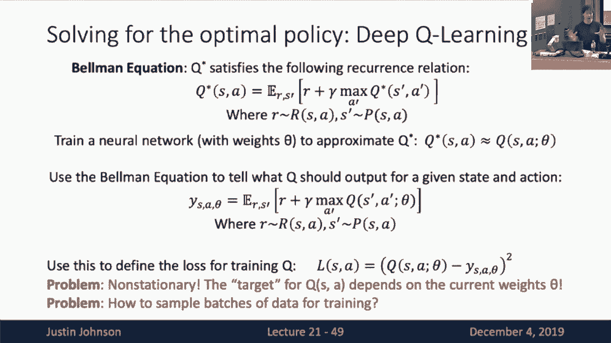
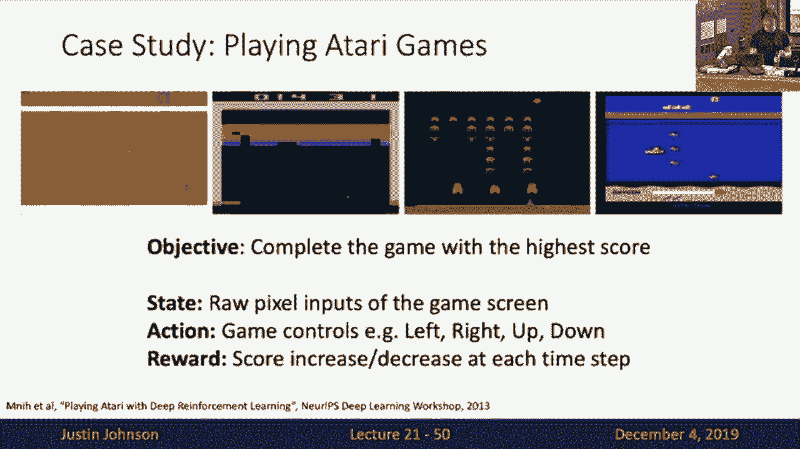
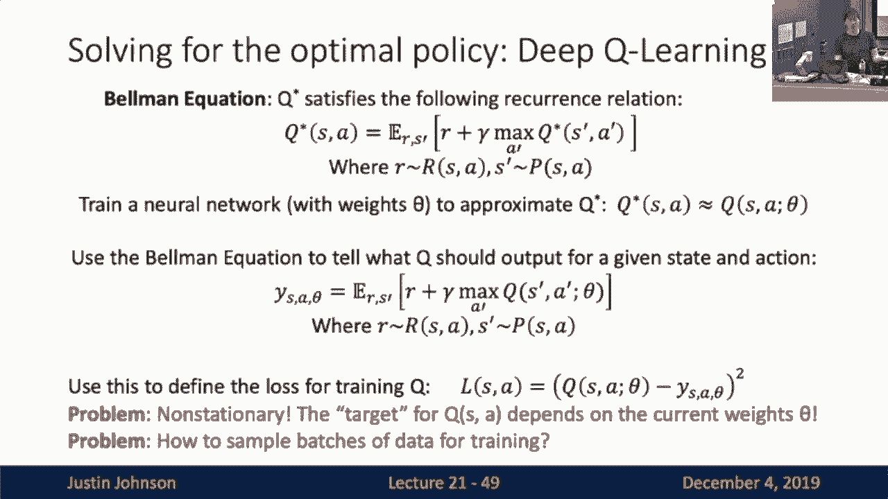
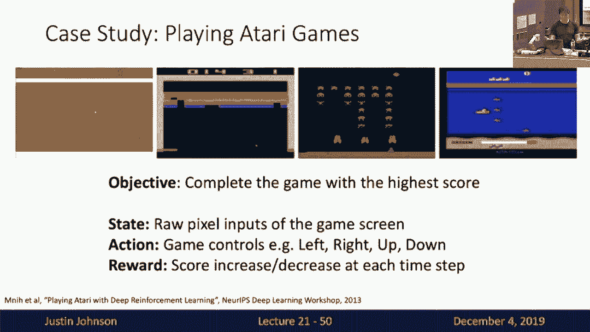
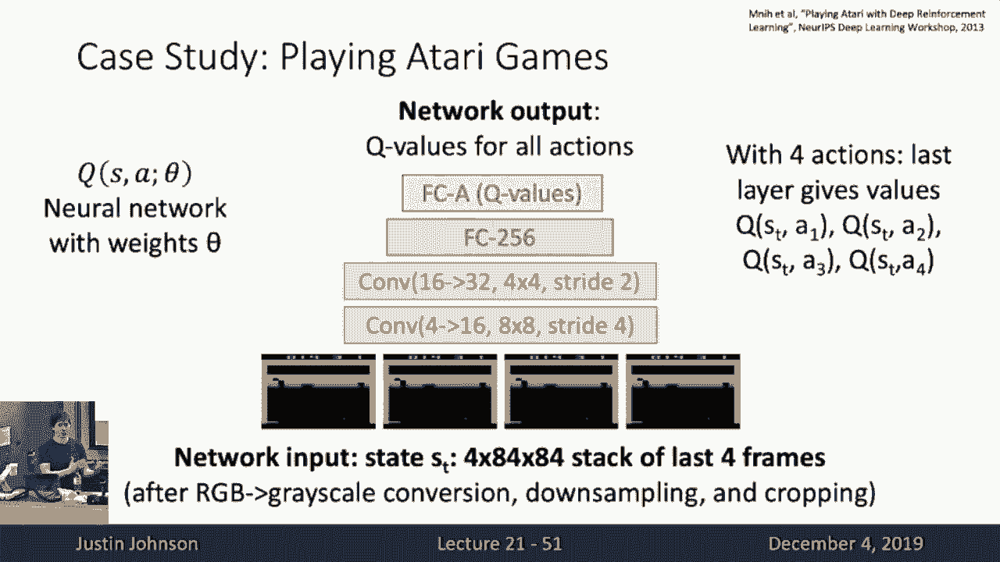
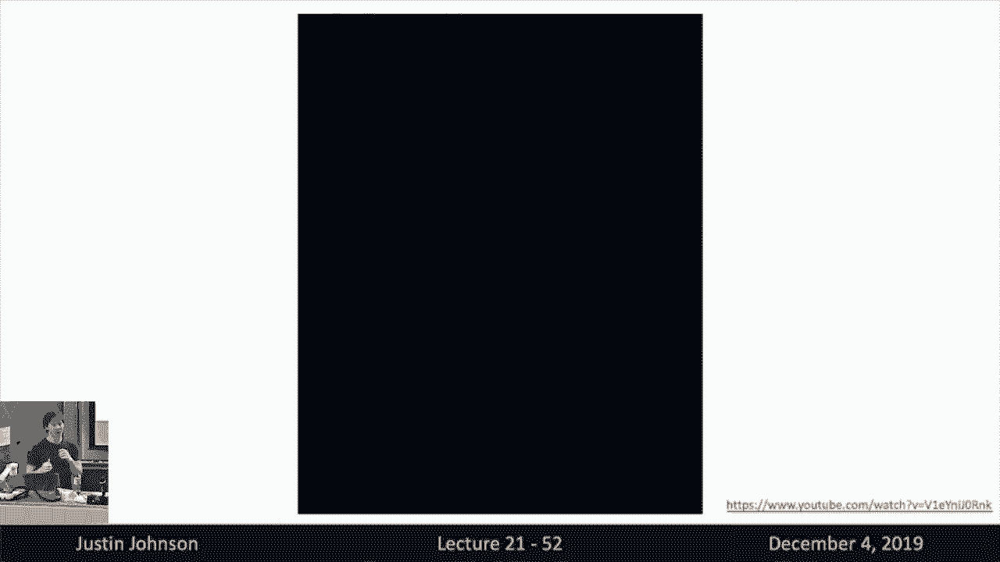
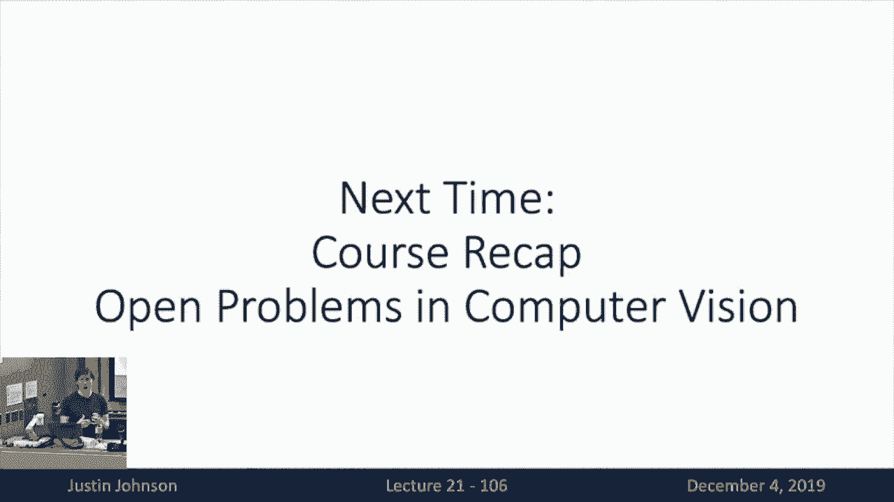

# 21：强化学习入门教程 🧠

在本节课中，我们将学习强化学习的基本概念、核心算法及其应用。强化学习是机器学习的第三大范式，与监督学习和无监督学习有本质区别。我们将从强化学习的定义出发，逐步介绍其数学形式化表示、核心算法（Q学习和策略梯度），并通过实例展示其应用。

## 📚 概述：什么是强化学习？

强化学习涉及智能体与环境的交互。智能体通过观察环境状态、执行动作并获得奖励信号来学习如何最大化累积奖励。与监督学习不同，强化学习没有标注数据；与无监督学习不同，强化学习的目标是通过交互获得高奖励。



上一节我们介绍了强化学习的基本概念，本节中我们来看看强化学习与监督学习的区别。



## 🔄 强化学习 vs 监督学习

强化学习与监督学习有以下几个根本区别：

1. **随机性**：在强化学习中，状态、奖励和状态转移都可能具有随机性。
2. **信用分配**：奖励可能由过去多个动作共同导致，难以确定具体是哪个动作导致了当前奖励。
3. **不可微分性**：无法通过反向传播直接计算奖励对模型权重的梯度。
4. **非平稳性**：智能体训练的数据分布会随着其策略的改变而变化。

## 🧮 马尔可夫决策过程（MDP）

马尔可夫决策过程是强化学习的数学框架，由以下五元组定义：

- **状态集合 S**：所有可能的状态。
- **动作集合 A**：所有可能的动作。
- **奖励函数 R**：给定状态和动作的奖励分布。
- **状态转移概率 P**：给定当前状态和动作，转移到下一状态的概率。
- **折扣因子 γ**：权衡即时奖励与未来奖励的重要性。

马尔可夫决策过程具有马尔可夫性质，即下一状态仅依赖于当前状态和动作，而与历史状态无关。

## 🎯 策略与价值函数

智能体的行为由策略 π 定义，策略给出了在给定状态下执行各个动作的概率分布。目标是找到最优策略 π*，以最大化期望累积折扣奖励。

以下是两种常用的价值函数：

1. **状态价值函数 V^π(s)**：从状态 s 开始，遵循策略 π 的期望累积奖励。
2. **动作价值函数 Q^π(s, a)**：从状态 s 执行动作 a，然后遵循策略 π 的期望累积奖励。

最优动作价值函数 Q* 满足贝尔曼方程：

```
Q*(s, a) = E[r + γ * max_a' Q*(s', a')]
```

## 🧠 Q学习算法

Q学习是一种基于价值函数的强化学习算法，通过迭代更新Q函数来逼近最优Q函数。以下是Q学习的核心步骤：

1. 初始化Q函数。
2. 在每一步中，根据当前状态选择动作（例如使用ε-贪婪策略）。
3. 执行动作，观察奖励和下一状态。
4. 使用贝尔曼方程更新Q函数：
   ```
   Q(s, a) ← Q(s, a) + α * (r + γ * max_a' Q(s', a') - Q(s, a))
   ```
5. 重复步骤2-4直到收敛。

当状态和动作空间较大时，可以使用神经网络近似Q函数，称为深度Q学习（DQN）。









## 📈 策略梯度算法





策略梯度算法直接优化策略函数，通过梯度上升最大化期望累积奖励。以下是策略梯度的核心公式：

```
∇_θ J(θ) = E[∑ ∇_θ log π_θ(a_t | s_t) * R_t]
```

其中，J(θ) 是期望累积奖励，π_θ 是参数化的策略，R_t 是累积奖励。

策略梯度算法的步骤如下：

1. 初始化策略参数 θ。
2. 使用当前策略在环境中采样轨迹。
3. 计算轨迹的累积奖励。
4. 使用策略梯度公式更新策略参数。
5. 重复步骤2-4直到收敛。

## 🎮 强化学习应用实例

强化学习已成功应用于多个领域，以下是一些经典案例：

- **平衡杆问题**：通过移动小车平衡杆子。
- **机器人行走**：控制机器人关节运动以实现稳定行走。
- **Atari游戏**：通过屏幕像素输入学习玩游戏。
- **围棋**：AlphaGo击败人类世界冠军。
- **硬注意力机制**：在图像处理中选择特定区域进行特征提取。

## 🔮 总结与展望

本节课我们一起学习了强化学习的基本概念、核心算法及其应用。强化学习通过智能体与环境的交互学习最优策略，具有广泛的应用前景。尽管强化学习面临随机性、信用分配、不可微分性和非平稳性等挑战，但通过Q学习和策略梯度等算法，我们可以在许多复杂任务中取得显著成果。




未来，强化学习将继续在游戏、机器人控制、自然语言处理等领域发挥重要作用，并推动人工智能技术的进一步发展。