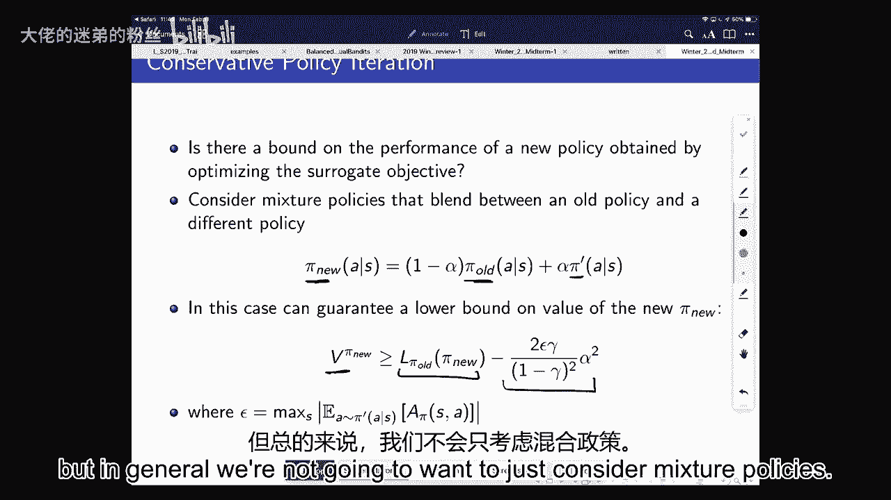
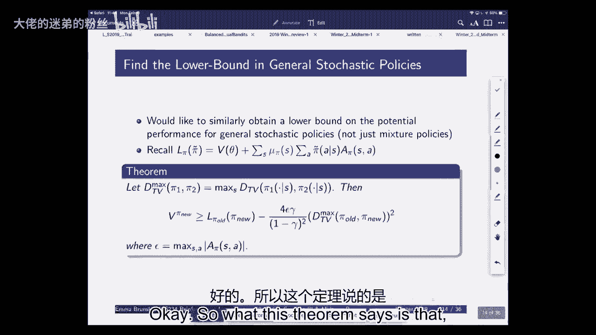
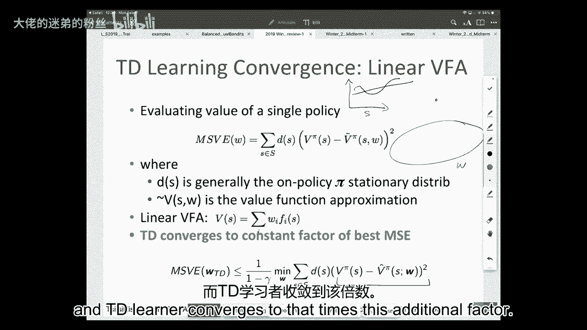
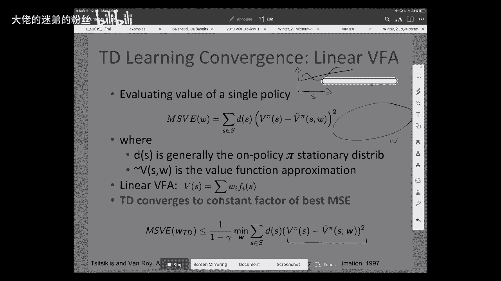
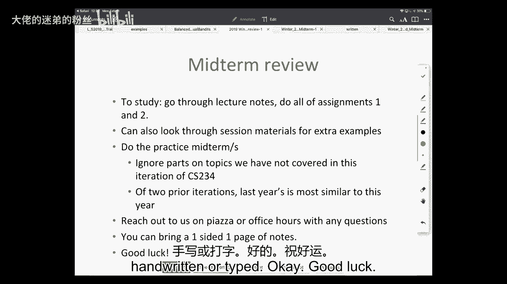

# P10：Lecture 10 - Policy Gradient III & Review - 大佬的迷弟的粉丝 - BV1Cc411h7QQ

 So before we get started， I'm just going to say a brief note about the logistics for the。

 midterm。 We're going to be split across two rooms。 The room you're in。

 it depends on your normal Stanford ID， whatever the first letter is。

 We'll send an email out about this to confirm it。 But we're going to be in either Gates B1 or coverall auditorium and it depends on the。

 first letter of your Stanford ID。 In addition， you're allowed to have one page of notes typed or written as fine。

 one-sided。 We have any other questions about the midterm。 Okay。

 we'll reach out to us on Piazza if you have any questions about the midterm。

 What we'll do today is we're going to split， we're going to go finish up the rest of policy。

 gradient。 So in terms of where we are in the class right now， we are almost done with policy search。

 We're going to have the midterm on Wednesday， Monday is a holiday， and then we'll also。

 be releasing the last homework this week， which will be over policy search。

 And so we're going to have policy search and then we're going to have the project， that's。

 the remaining sort of main assignments for the term。

 And then we're going to be getting into fast exploration and sort of fast reinforcement。

 learning after we come back from the midterm。 So I wanted to make sure to get through policy search today because you're going to have。

 the assignment released later this week。 So we'll spend hopefully around like 20。

 25 minutes on policy search and then we're going， to do a brief review before we get into the midterm。

 about the midterm material。 So we have any questions？ Oh。

 and just a friendly reminder to please say your name whenever you ask a question because。

 it helps me remember and also helps everybody else learn your names as well。 All right。

 So where we were is that for the last couple of lectures， we've been starting to talk about。

 policy based reinforcement learning where we're specifically trying to find a parameterized。

 policy to learn how to make good decisions in the environment。

 And so just like what we saw with value function approximation and what you're doing with Atari。

 for our policy parameterization， we're going to assume there's some vector parameters。

 We can represent policies by things like Softmax or by a deep neural network。

 And then we're going to want to be able to take gradients of these types of policies。

 in order to learn a policy that has a high value。 So we introduced sort of the vanilla policy gradient algorithm where the idea is that。

 you start off， you initialize your policy in some way and you also have some baseline。

 And then across different iterations， you run out your current policy and the goal is。

 by running these out that we're going to be able to estimate the gradient。

 So we're going to be doing this part to estimate the gradient of our policy at the current。

 So we want to get through dv d theta with respect to our current policy。

 So what we talked about is that you would run out trajectories from your current policy。

 So use your policy to execute in the environment。 You would get state action rewards， next state。

 next section， next rewards。 And then you would look at returns and advantage estimates which compared your returns to a。

 baseline。 You could refit your baseline and then you could update your policy。

 And so this was sort of the most vanilla policy gradient algorithm we talked about。

 And then we started saying that there's a number of different choices that we were making in。

 this algorithm and almost all sort of policy gradient based algorithms are going to follow。

 this type of formula。 So in particular， we were making a decision of sort of estimating some sort of return or。

 targets。 Often we were picking a baseline and then we had to make some decision about after we compute。

 the gradient， how far along the gradient do we go？

 So this is sort of helping us to determine how far do we move on our gradient。

 So for the first part， we talked about how do we estimate sort of the value of where we。

 are right now that we're going to be using to try to estimate our gradient。

 And we talked about the fact that the most vanilla thing that we could do is just roll。

 out the policy and look at the returns。 That this was really similar to what we'd seen in Monte Carlo estimates。

 So we could do that。 We could get sort of an estimate of the value function by just rolling out the policy for。

 one episode。 But that was just like what we saw in Monte Carlo， an unbiased estimator。

 but high variance。 And so we talked about how we could play all the sorts of。

 we use also the same tools as， what we've been doing in the past to try to balance between bias and variance。

 So in particular， we talked about how we could introduce bias using bootstrapping and function。

 approximation， just like what we saw on TDMC and just like what we talked about with value。

 function approximation。 So we could repeatedly see these same sorts of ideas of the fact that we're trying to understand。

 what the value is of a particular policy。 And when we're estimating that value。

 then we can trade off between getting sort of unbiased。

 estimators of how good decisions are versus biased estimators that might allow us to。

 propagate information more quickly and allow us to learn to make better decisions faster。

 We also talked about the fact that there are actor critic methods that both maintain an。

 explicit parameterized representation of the policy and a parameterized representation。

 of the value function。 But the thing that we really started getting into last time is to say， well。

 both， you know， there are all these sort of existing techniques that we know of to try to estimate these targets。

 and estimate the value function。 But then there's this additional question of how far do we move along the gradient？

 So once we estimate the gradient of the policy， we need to figure out how far along that gradient。

 do we go in terms of computing a new policy。 And the reason we argue this was particularly important in reinforcement learning versus。

 supervised learning is that whatever step we take， whatever new policy we look at is going。

 to determine the data we get next。 And so it was particularly important for us to think about how far along do we want to。

 go on our gradient to get a new policy。 And one desirable property we were talking about is how do we ensure monotonic improvement？

 So what we would like here is we'd really like monotonic improvement。 That's our goal。

 And we talked about wanting monotonic improvement， which was not guaranteed in DQN or a lot of。

 other algorithms， because in a lot of high stakes domains， like finance， customers， patients。

 you might really want to ensure that the new policy you're deploying is expected to be， better。

 at least in expectation before you deploy it。 So we talked about wanting this。

 but there's this big problem that we don't have data from， the new policies that we're considering。

 and we don't want to try out all the possible， next policies， because some of them might be bad。

 And so we want to try to use our existing data to figure out how do we take a step and。

 determine a new policy that we think is going to be good。 So in particular。

 our main goal for policy gradients is to try to find a set of policy。

 parameters that maximize our value function。 And the challenge is that we currently have access to data that was gathered with our current。

 policy， which we're going to call pi old。 It's parameterized by a set of thetas that we can also denote theta old。

 And throughout policy， the policy gradient lectures， I've been sort of going back and。

 forth between talking about policies and talking about thetas。

 But it's good just to remember that there's sort of this direct mapping between pi and， theta。

 For each for a policy， it's exactly defined by a set of parameters。

 So whether we're talking about policies or we're talking about parameters， those are。

 referring to exactly the same thing。 So the challenge is that we have data from our current policy。

 which has some set of， parameters， and we want to predict the value of a different policy。

 And so this is a challenge with off policy learning。

 So what we're talking about last time is how do we express the value of a policy in。

 terms of stuff that we do know？ And we talked about how we could write it down in terms of an advantage over the current。

 policy。 So if we think about a value being parameterized by a new set。

 a new policy with a new set of， theta tilde parameters， it's equal to the value of another policy。

 And we're parameterized by a set of theta plus the expected advantage。

 So we can write that as the distribution of states that we would expect to get to under。

 the new policy times the advantage we would get under the old policy if we were to follow。

 the new policy。 And the reason what we're trying to do in this case。

 to sort of keep us thinking about， what the main goal is here。

 is what we're trying to do is figure out a way to do policy。

 gradient where we're guaranteed to have monotonic improvement， where our new policy is going。

 to be guaranteed to be better than our old policy。

 But we want to do this without actually trying out our new policy。

 So we're trying to re-express what the value is of a new policy in terms of quantities we。

 have access to。 So what do we have access to？ We have access to existing samples from the current policy。

 And we want to use those and the returns we've observed in order to estimate the value of。

 a new policy before we deploy it。 So that's kind of where we're trying to get to。

 And we noticed here that maybe we can have access to an explicit form of a new policy。

 That's like whatever new parameters we're considering putting into our neural network。

 And we could imagine estimating the advantage function。

 But we don't know the state distribution under the new policy because that would require us。

 actually to run it。 So what we talked about is let's just define a new objective function which is just a different。

 objective function。 Might be good， might be bad， I'm going to argue to it's good。

 But this right now is just a quantity that we can optimize。

 So the quantity that we can optimize here， we're going to call that sort of this new objective。

 function。 And it is going to be a function of the previous value。 So here。

 remember this is always equal to direct mapping between thetas and pi's。

 So we're going to just say it looks like the objective function we just talked about which。

 really was the value of the new policy。 But we don't know what that stationary weighted distribution is of states under the new policy。

 So we're just going to substitute in the stationary distribution under the current policy。

 Now in general， this is not going to be so it's not going to be equal to your new policy。

 distribution。 The only time you're going to get the same state distribution under two policies is generally。

 if they're identical。 Occasionally， you can get the same state distribution under two different policies but then that。

 means they have the same value。 So in general， we're going to expect that these are going to be different。

 But we're going to ignore that for now。 We're just going to say this is an objective function。

 This is something we can optimize。 And the nice thing about this is that we have samples from the current policy。

 So we can imagine just using those samples to estimate this expectation。

 The thing that I also want us to note here is that this is just this new objective function。

 called L。 If you evaluate the objective function L at the current policy， so if you plug in。

 your old policy into your objective function， it's exactly equal to the value of your current。

 policy。 So this second term becomes zero。 Because the advantage of the existing policy over the existing policy is zero。

 So this objective function is exactly equal to the value of the old policy if you evaluated。

 the old policy。 In another case， for new policies， it's going to be something different。 Yes。

 How is this similar to important sampling？ Great question。 You're asked。

 how is this similar to important sampling？ If we were going to do important， well。

 it's different in a number of ways。 An important sampling。

 what we tend to do is we reweight the distribution that we want， by the distribution that we have。

 In this case， we're looking and we normally do that on a per state level。 In this case。

 we are looking at the stationary distribution over states。

 There's actually a really cool paper that just came out in NURIPS like a month ago， 2018。

 with Lee Hong Lee and some other colleagues that looked at how would you reweight stationary。

 distributions to try to get off policy estimates of the value function。

 And so to try to directly reweight what like mu pi would be versus mu pi tilde。

 So we're not doing that here。 There's some really nice ideas in that that could help really reduce the variance in long。

 horizon problems。 In this case， we're just substituting。 So we're ignoring the difference。

 We're not doing important sampling。 We're just pretending that the distribution of states that we get to is exactly the same。

 It's not。 But we're going to show that this is going to end up being a useful lower bound to what。

 we actually want to optimize。 Okay。 So you might say， if you take this objective function。

 which might be good， might not be， good， if we optimize with respect to it。

 do we have any guarantees on whether the new， value function that we get if we optimize with respect to this wrong objective function。

 is better than the old value function。 Because remember， that's where we're trying to go to。

 We don't really care what we're optimizing。 What we care about is that the resulting value function we get out is actually better than。

 the old value function。 So last time I said that if you have a mixture policy。

 which blend between your current policy， and a new policy。

 so let's say you have a pie old and you have some other policy。 I haven't said how you get it。

 but just say you have some other policy and that defines， your new policy。

 So with probability one minus alpha， you take the same action as you used to with probability。

 alpha you take a new action。 In this case， you can guarantee a lower bound on the value of the new policy。

 So the value of the new policy is greater than or equal to this objective function we。

 have here minus this particular quantity。 So that says that if you optimize with respect to this weird L objective function。

 you can， actually get bounds on how good your new policy is。 So that seems promising。

 but in general we're not going to want to just consider mixture。

 policies。 So what this term says is that for any stochastic policy， not just this weird mixture。

 you can。

 get a bound on the performance by using this slightly strange objective function。 So in particular。

 define the distance of total variation as follows。 So dtv between two policies。

 So I'm using a dot there to denote that there's a number of different actions。

 The policies are denoting a probability distribution over actions。

 This is equal to the max over all A， the distance between the probability that each of the two。

 policies put on that action。 So it's giving us sort of a maximum difference in what's the probability of an action under。

 one policy versus the other policy。 And then we can do， let's see。

 we can do dmax of total variation by taking the max of that， quantity over all states。

 So it's essentially saying over all states what's the biggest difference that the two。

 policies give over a particular action。 So where do they most differ？

 And then what this theorem says is that if you have that quantity， in general we're not。

 going to be able to evaluate that。 But what that's saying is that if you know what that quantity is。

 then you can define， that if you use this objective function L。

 that the new value of your policy is at least， the objective function you compute minus this quantity that's a function of the distance。

 of total variation， the max distance of total variation。

 So this gives us some confidence that if we were to optimize with respect to the objective。

 function L， then we can get a bound on the value function。 Now this distance。

 this max through the total variation distance isn't particularly easy， to work with。

 So we can use the fact that the square of it is upper bounded by the KL divergence and。

 then get a new bound which is a little bit easier to work with that looks at the KL divergence。

 between the two policies and we again get this similar bound。 Okay， so why is this useful？

 So what I've told you right now is that we have this new objective function。

 If we use this new objective function， we could in principle get this lower bound on。

 the performance of the new policy。 So how do we use this to ensure that we want to get monotonic improvement？

 So the goal is monotonic improvement。 We want to have the V of pi i plus 1 is greater than or equal to V of pi i。

 That is our goal。 So i is iterations。 We want that the new policy that we deploy is actually better than the policy we had before。

 So how are we going to do this？ So what we're going to say is first we have this objective function here。

 this lower bound， objective function。 And what we're going to define is that mi of pi i is equal to L of pi i pi。

 So I'm just copying the equation from the previous slide。

 Minus 4 epsilon gamma divided by 1 minus gamma squared dkl max of pi i pi。

 So this is the lower bound。 That's what we just defined on the previous slide。

 So what we said here is that the value of our new policy， so this is equal to this m。

 function I've defined。 So we've said that the new value is going to be at least as good as this lower bound。

 So we're going to say V of i plus 1 is going to be equal to mi of pi i plus 1， which is。

 equal to L pi i plus 1， just writing out what the definition is here。 And again。

 what we're trying to do here is get to the point where we're confident that。

 we can get something that's better than our old value function。

 Now the thing that I want to now look at is， well what is， if we were to evaluate the lower。

 bound at the current policy， what would that be？ So let's look at mi of pi i。

 So that's going to be equal to L pi i of pi i。 I'm just plugging it into this equation up there。

 Minus 4 epsilon gamma minus gamma squared dkl max of pi i pi i。 So why is this nice？

 Well this is nice because the k-l divergence between two identical policies is zero。

 Because these are exactly the same。 This is equal to zero。

 So now this is just equal to L pi i of pi i。 But what I told you before is that if we go back a few slides to what the definition is。

 of pi i， L of pi i， is that if you evaluate it at the current policy， it's just equal to。

 the value of that policy。 So if we evaluate this objective function at the current policy。

 it's just the same as， the value of the current policy。 So now if we go back here。

 this is just equal to v of pi i。 Okay， so what does this say？

 This says that if I want to look at how the value of my i plus 1 policy looks compared。

 to the value of my old policy， we know that's greater than or equal to mi of pi i plus 1。 So。

 because we said that the v at we knew from this theorem that the new value of the policy。

 is greater than or equal to this lower bound we computed。

 So it's greater than or equal to mi pi i plus 1 minus mi of pi i。 So what does this say？

 This says that if your new value function has a better lower bound than your old value， function。

 you have monotonic improvement。 So if this is greater than zero， then monotonic improvement。

 Which means that if you optimize with respect to this lower bound and you can evaluate that。

 quantity and your new lower bound is higher than your old lower bound， then your value。

 has to be better。 So we can guarantee monotonic improvement。 Yes。 So just to clarify。

 so for these value comparisons， are we implicitly considering as an infinity。

 norm in terms of saying one is better？ Yes， generally。 Yeah。

 I think I mean they probably go through with L squared too， but yeah。

 Question is whether or not we're always defining this with respect to L infinity norm almost。

 always。 There certainly is some analysis particularly when we get into function approximation which。

 looks at an L2 norm。 But most of this is all with respect to an L infinity norm。

 which means that when we're， looking at this， for example。

 we're looking at ensuring that for all states the value of。

 those states is at least as good as the previous value of the states。 Yes。

 So the claim made was if our lower bound improves， then it must be the case that what it's the。

 lower bound of must also be improving。 So there's never a case where， for example。

 your lower bound might improve even though， the actual value of the policy of value increases。

 It seems like that's right。 So what this is saying is that what this is asking about to have this lower bound and。

 what that relates to the actual value。 But this is stating is that if you improve your two lower。

 like if you have a lower bound， of your existing policy and you get a new lower bound with some new policy and that new。

 lower bound is higher， then your lower bound will be the one that you're guaranteed to。

 be improving。 So this is what guarantee。 So this is assuming you can solve this。

 But if you can get this lower， if you optimize with respect to this lower bound quantity。

 because when you plug in the lower bound for the current policy under that， that's exactly。

 equal to the value of that policy， then you're guaranteed to be improving。

 Because you're basically saying， here's my lower， here's my existing value。

 I have something whose lower bound is better than my existing value。

 And so I know my new thing has to be better。 Yeah。 >> Can you like deal with the absolute term？

 Because it seems like the absolute changes depending on the apply and it's also like a。

 global property。 >> Absolutely。 >> So that expression is a great one。

 I feel might ask us about this。 So note this， your lower bound is in terms of epsilon。

 Epsilon is a max over all states and actions of your advantage。 In principle。

 you could evaluate this， particularly if you had a discrete state in the action， space。 In practice。

 that's something that you would not want to do。 This。

 I view this part as sort of saying this is formerly if you could evaluate this lower。

 bound and what we're going to do now is talk about a more practical algorithm which tries。

 to take this guarantee of conservative policy improvement and actually make it practical。

 in terms of quantities that are a little bit easier to compute。 Because that's right。 Yeah。

 In general， it would be very hard to evaluate this epsilon。

 Now you could take upper or lower bounds on it。 But you won't generally know what this epsilon is。

 I note that this， as Chris was pointing out， this epsilon is dependent on the policy。

 But this is pretty cool。 So it means that you can do this guaranteed improvement。

 This is a form of mineralization， maximization。 And it's this nice idea of saying you can have this new lower bound。

 this guarantee to be， better than the value of your current policy。

 So you can get this sort of conservative monotonic improving policy。 All right。

 So I want to make sure we have enough time to go through some of the midterm review。

 But I want to briefly talk about how we would make this practical， particularly because trust。

 region policy optimization is an extremely popular policy gradient algorithm。

 So I think it's useful for you guys just to be aware of。

 Some of you might use it in some of your projects。

 We won't be a mandatory part of the homework or on the midterm。

 But I think it's just a useful idea to be familiar with。 So again。

 if we look at sort of what this objective function was that we just discussed， we said。

 we had this L function。 And then we turned it into a lower bound by subtracting off this constant that might。

 be hard for us to compute。 And so what we do in this case is we take this constant here and we turn it into a hyperparameter。

 So you could turn it into a constant C。 But the problem always is that even if you could。

 compute this， often we don't know what this is， but even if you could compute it or compute。

 it bound on it， generally if we use this， we would take very small step sizes。

 So intuitively this is because it's often very hard to extrapolate far away from your。

 current policy。 And so this would say if you want to be really sure that your new value is better than your。

 old value， then just take a very small step size。 And intuitively it's because if you change your policy very。

 very small amounts， at least， under some smoothness guarantees。

 the value of your policy can't change that much。 It should also be intuitive that your gradient is often a pretty good estimate very close。

 to your current value of your function。 But we also need to quickly try to get to a good policy。

 so this is not generally practical。 And so the idea of TRPO。

 one of the main ideas is to think of there being a trusted。

 region and use this to constrain our step sizes。 So again。

 if we go back to the generate template for policy gradient algorithms， we have to。

 make this choice of how far out to step in our gradient。

 And the idea is we're going to sort of define a constraint。

 So we're going to have our objective function here。

 And instead of explicitly subtracting off our lower bound， we're just going to say you， can move。

 you can change your gradient， but not too far。 We're going to put a constraint on how far the KL divergence can be。

 As a way to sort of say you're kind of having this region of which in your parameter space。

 it allows you to know how far you can change your policy。

 So I'm just going to talk very briefly about how this is instantiated。

 So the main idea is that if we look at what these objective functions are， this may or。

 may not be easy for us to evaluate。 So if we look back at what L theta is， even here。

 we have sort of our discounted visitation， weight under the current policy。

 but we don't have direct access to that。 We have only access to samples from really not a current policy。

 So the first idea is that instead of taking an explicit sum over the state space， where。

 that state space might be， you know， continuous and infinite， we're just going to look at。

 the states that were actually sampled by our current old policy and reweight them。

 So that's the first part of the first substitution we do。

 What we're trying to do right now is say we have this objective function and we want。

 to make it so that this can be part of an algorithm， but we can compute all the quantities we need。

 to in order to take a step size where we think the new policy is going to be better。

 The second thing we do， and this relates to Andrew's question about important sampling。

 we have this second quantity in here where this is the probability of an action under。

 our new policy。 We do have access to that in the sense that if someone gives us a state。

 we can tell， we， can say exactly what our probability would be under all the actions。 But again。

 this often can be a continuous set。 And so instead of doing sort of this continuous set。

 we're just going to say we're going to， use important sampling and we can take samples。

 This is typically going to be from pi old。 So we look at times where we've taken an action given our current policy and we reweight。

 them according to the probability we would have taken those actions under our new policy。

 So it allows us to approximate that expectation using data that we have。

 And then the third substitution is switching the advantage back to the Q function。

 And it's just important to note that all of these three substitutions don't change the。

 solution to the object to the optimization problem。

 These are all sort of taking these different substitutions or different ways to evaluate。

 these quantities。 So we end up with the following。

 We have this objective function that we're optimizing。

 This is after we've done the substitutions I just mentioned and we have this constraint。

 on how far away we can be。 And empirically， they generally just sample this sort of alternative sampling distribution。

 Q is just your existing old policy。 So there's a bunch of other stuff in the paper。

 It's a really nice paper。 A lot of really interesting ideas。

 I'll skip through sort of exactly how they do some of the additional details。

 Some nice complexity there。 But I'll just say briefly the main thing they're doing here is they're sort of running a。

 policy。 They're computing this gradient。 They have to consider these constraints。

 And they do this sort of line search with a kale constraint。

 And perhaps the most important thing is just to be aware of this and to sort of understand。

 kind of them being inspired by this conservative policy improvement and then trying to make。

 that more practical and fast。 They've applied it to a lot of different problems。

 There's some really nice stuff on low-comotion controllers， cases where you have continuous。

 action spaces， continuous state spaces。 These are cases where policy gradient is often very helpful and they have some very。

 nice results。 I'll step through those here。 The main thing to know is that empirically this is a really good tool to know about。

 Often if you're doing policy gradient style approaches， TRPO can be a very useful thing。

 to build on。 And it's been incredibly influential。 This came out in ICML in 2015。

 There's hundreds of citations to it already。 So it's sort of become one of the main benchmarks for policy gradient。

 Okay， so if we go back just to kind of what the， to summarize what the policy gradient。

 algorithm template is， whether you're looking at the existing algorithms or whether you're。

 trying to define your own， generally they look like something like the following。

 For each iteration， you run your policy out。 You gather trajectories of data by running that policy。

 You compute some target that might be just the rewards。 That might be a Q function。

 We can trade off between bias and variance in that。

 And then we use that to estimate the policy gradient。

 And then we may want to smartly take a step along that gradient to try to ensure monotonic。

 improvement。 The things to be aware of and some of the things you're going to have practice on soon。

 is that you should be very familiar with these sort of vanilla approaches and reinforce。

 And this general template sort of understand how some of the different algorithms we're。

 talking about might instantiate these different things。

 You don't have to drive and remember all the formula that I just went through quickly for， TRPO。

 And you'll have the opportunity to practice these more in homework three， but we'll only。

 cover these lightly in terms of the midterm。 All right。

 so doesn't make any questions about this before we go into sort of a short overview。

 of the stuff we've done so far for before the midterm。 Okay。 All right， let's switch over。 Okay。

 so what this is going to be is sort of a very short recap of what we've done so far。

 And in terms of why this is useful， there's certainly a lot of good evidence from learning。

 sciences that spaced repetition of ideas is really helpful as is forced recall， which。

 is one of the other benefits of doing exams。 So that's what we're going to do today is just sort of do a quick recap of a lot of。

 the different main ideas。 So again， reinforcement learning generally involves optimization。

 delayed consequences， generalization and exploration。 We haven't really talked about that yet。

 So that's not really going to be on the midterm。 We're going to start talking a lot more about that post the midterm。

 It's an incredibly important topic when I think is super fascinating and one of the main。

 reasons why RL is interesting。 But these other things are really important too when we spent some time on those so far。

 So in terms of thinking about the midterm and indeed thinking about the class， on the。

 very first day I put up this sort of blizzard of learning objectives。

 And I just want to highlight a few of these which are the things that I mentioned we're。

 going to make explicitly evaluated in the exam。 Which is that by the end of the class。

 including on the exam， you should be very familiar with。

 sort of what are the key features of reinforcement learning that make it different than other。

 machine learning problems， another AI problems。 So we spend some time on that in the first day and I've sort of tried to talk about it。

 throughout。 But the fact that the agent is collecting its own data and that the data it gathers。

 influences the policies it can learn。 So we sort of have this censored data issue。

 The agent can't know about other lives it didn't live。

 Makes a very big difference compared to supervised learning。

 A second really important thing is that if you are given an application problem， it's。

 important to try to know why or why not to formulate it as a reinforcement learning problem。

 And if so， how you would。 Generally， there's not a single answer to this。

 So it's good to think of like， what is one or more way to define the state space， the， action space。

 the dynamics and the reward model。 And what algorithm you would suggest from class to try to tackle it。

 This is in general sort of something that you'll probably run into much more than like。

 looking at any particular algorithm。 And then a third thing that I think is really important is to understand how we decide whether。

 or not an RL algorithm is good。 And so what is the criteria for performance and evaluation we can use to sort of evaluate。

 what are the benefits， strengths and weaknesses of different algorithms and how they compare。

 So this could be things like bias and variance。 It also could be computational complexity or sample efficiency or other aspects。

 So what we've covered so far is planning where we know how the world works， policy evaluation。

 model free learning， how to make good decisions， value function approximation and then imitation。

 learning and policy search。 And we've also talked about the fact that for reinforcement learning in general。

 you， can think of either trying to find a value function， a policy or a model。

 And that a model is sufficient to generate a value function， which is sufficient to generate。

 a policy。 But they're not all necessary。 They don't have to have a model in order to get a policy。

 So I'll go through this part pretty fast since I think a lot of you guys have also seen some。

 of this stuff in previous classes。 So we're almost everything we've been talking about so far assumes the world is a Markov。

 decision process。 So I've mentioned that often the world is not a Markov decision process。

 And in the MDP case， we assume that the state is sufficient， a sufficient statistic of all。

 the prior history。 So we don't have to keep track of the full set of states and observations and actions。

 or awards from the whole time period。 We can just look at the current observation in order to make good decisions in the world。

 In terms of this， it's very useful to know what the Markov property is， why it's important。

 why it might be violated， what are things like models， value functions and cues， and。

 what is planning and what is the difference。 So in planning。

 we assume that you're given a model of how the world works。 You know the dynamics model。

 You know the reward model。 It still can be really hard to figure out how to act。

 This is like knowing the game of Go。 It's still really。

 really computationally intensive and tricky to try to figure out what's。

 the optimal decision to take and go， even though you know all the dynamics and all the， rewards。

 In learning， we don't know the dynamics and rewards and we still have to gather data in。

 order to learn a good policy， which has a high value， a high discounted expected sum of， awards。

 We talked about the Bellman backup operator， which is a contraction if your discount factor。

 is less than one， which means the repeated applications are guaranteed to converge to。

 a single fixed point。 We talked about value versus policy iteration。

 in value iteration on the iteration K， you， are always computing the optimal value as if you only get to make K decisions。

 And then you use that to back up and get the K plus one policy。 In policy iteration。

 you always have a policy and the value of that policy if you were to， act using it forever。

 But it might not be a very good policy。 And then you update this。 And as we've seen。

 it's closely related to sort of policy gradients style algorithms。

 where you sort of try to estimate the gradient of a policy。 So in policy iteration generally。

 and similar to what we've been seeing in policy gradient， approaches。

 we intermix evaluation and improvement。 So we compute the value of a policy and then we use that in order to take a step and improve。

 it。 If we are in the case of being model free and not having extra model， we often want to compute。

 Q values instead so that we can directly improve the policy。 So let's just take a quick second。

 So these are check your understandings or good things to go back through。

 These are all sort of like small conceptual questions of the type that we might ask you。

 on the exam。 So let's just take a minute to check our understanding and think about for a finite state and action。

 MDP， the lookup table representation， which means that we just have a table entry for。

 each data and action。 Gamma less than one。 Does the initial setting of the value function impact the final computed values？

 Why or why not？ Does value iteration and policy iteration always yield the same solution？

 And is the number of iterations needed for policy iteration in a finite state and action。

 MDP bounded and if so， how many？ Just take a minute and think about those。

 Feel free to talk to somebody next to you。 [ Inaudible ]， [ Inaudible ]， [ Inaudible ]。

 [ Inaudible ]， [ Inaudible ]， [ Inaudible ]， [ Inaudible ]， [ Inaudible ]， [ Inaudible ]。

 [ Inaudible ]， That's the total number of policies。 In policy iteration， in tabular MDPs。

 with like policy improvement in tabular MDPs， you're guaranteed to be monotonically improving。

 So you can at most go through every policy once。 And then you're done。

 So it relates to what we were just talking about。 In that case。

 you definitely get guaranteed policy improvement。 Because there's no function approximation there。

 There's no errors。 You exactly know what the current value is。

 And then you can take a monotonic improvement step。 All right。

 So now we're going to talk briefly of a refresher on model-free policy evaluation。

 So this is model-free policy evaluation with this sort of passive reinforcement learning where we're just trying to understand how good an existing policy is。

 Ideally with not too much data。 And so we want to either directly estimate the Q function or the value function of the policy。

 And so we talked mostly in this case about episodic domains。 When I say episodic domains。

 I mean that we're going to act in the world for a fixed number of steps。

 Or we're in a setting where we know we have terminal states。 So we know the episodes will end。

 The probability one may have to end。 And then at that point you're reset to a start state with some fixed distribution。

 And in Monte Carlo approaches， we directly average the episodic rewards。 It's pretty simple。

 We take our existing policy。 We run it out for H steps or until the end of the episode。 We reset。

 We repeat that a whole bunch of times and we just average。 But in TV learning or Q learning。

 we use a target to bootstrap。 And I know you guys have seen this a number of times。

 but just as a refresher。 And I like these diagrams to think about the distinctions。

 So when we've talked about dynamic programming here。

 we've thought about the case where we know the transition model， we know the reward model。

 So when we think about what the value is of a policy。

 it's exactly equal to the expected distribution of states and actions we would encounter by following this policy。

 Of the reward we would get plus gamma times the value of the next state。

 So note that when we think about this expectation here， there's really an S prime。

 So that expectation is thinking about all the next states that we might get to。

 And so in dynamic programming， we just explicitly think about that sum that sum over all the next states we much reach might reach and the value of each of those states。

 So if we had started in a state， we take an action。 We get to some next new states in general。

 we could repeat this process all the way out to reach， you know， the horizon H or terminal states。

 And what we think of here is taking an expectation over the next states that we would reach。

 And what we do in dynamic programming is instead bootstrap。 So what we mean by bootstrap here。

 Is that instead of building this whole tree， we keep track of what the value is of all the states and we use that to take an explicit expectation over the next states we'd reach an average over the value of those next states。

 And note that in this case， we're assuming we know the model。

 Now there are ways to extend this where we don't know the model。

 but we haven't talked very much about those this term。 So。

 but we're nice a dynamic programming here。 I mean that less we otherwise specify that we know the models of the world。

 So this is a case where we're bootstrapping because we are update is using V for V uses an estimate。

 Okay， because those values are not going to be perfect estimates of the true expected discounted reward for those next states because we're still computing them。

 Then we looked at Monte Carlo policy evaluation and it looks pretty similar in many ways。

 except for what we're doing is we're running a trajectory all the way out to the horizon。

 We're adding up all the rewards。 And that is our target。

 And when we say that policy evaluation with Monte Carlo is sampling。

 it means we're sampling the return。 What is the expectation that we're approximating？

 We're expectationing a。 We're approximating expectation of that probability of S prime。

 So we only got a single S prime instead of getting an expectation over all the next ones。

 And the problem with that is that we said it was high variance， even though it was unbiased。

 And then we talked about combining these ideas with temporal difference methods。

 Where we're both going to bootstrapped and sample。

 So we're sampling because we are only looking at a single next state。

 And we are bootstrapping because we are plugging in our estimate of V。

 So we're sampling a single S T plus one。 And we're bootstrapping because we're not rolling all the way out like we did with Monte Carlo。

 We're just plugging in our current estimate of that value function。

 So let's do another quick understanding of for each of these cases。

 It's good to know whether it applies to dynamic programming。

 which requires you to know the models of Monte Carlo or TD learning。

 So is it usable when we don't know the models of the current domain？

 Does that handle continuing non episodic domains？ Does it handle non-marcovian domains？

 Let me be clear by that clear what I mean by that。 You can always apply any algorithm to anything。

 It just may give you garbage out。 And so my question is when you when I say handling non-marcovian domains。

 is it guaranteed to do something good or does it fundamentally make a mark off assumption？

 Does it converge to the true value of the policy and the limit of updates？

 Right now we're thinking about tabular case。 So the value function is exactly representable。

 And is it giving us an unbiased estimate of the value along the way？

 The estimate still might be consistent， which means that eventually with enough data they converged to the right thing。

 but they could give you biased estimates along the way。

 So it's just been like a minute or two and they're just binary answers to each of these。

 So yes or no for each of them。 And feel free to talk to somebody next to you。 [BLANK_AUDIO]。

 [INAUDIBLE]， [INAUDIBLE]， [INAUDIBLE]， [INAUDIBLE]， [INAUDIBLE]， Yeah， it's a great question。

 Policy iteration。 [INAUDIBLE]， [INAUDIBLE]， All right， I'm gonna ask people to vote again。 Okay。

 so I'll just ask you to raise your hands if the answer is yes。 So is DP。

 is dynamic programming usable when there are no models of the current domain？ No。

 is Monte Carlo usable？ Yes， is TD usable？ Great。 Okay。

 does DP handle continually non episodic domains？ Raise your hand if yes， correct？ Yep。

 so you can use dynamic programming， you can use Bellman operators and contractions， even if the。

 you know， for infant horizon domains。 You generally want your gamma function to be less than one。

 so your values don't explode。 But you can do it， it's fine。 What about Monte Carlo estimates？ No。

 right， Monte Carlo only updates when you get to the end of an episode。 TD estimates， yes， great。

 Does DP handle non-marcovian domains？ No， does Monte Carlo guess TD？ No， again。

 you can run all of these things wherever you want， but no， no。

 Converges to the true value of the policy and the limit of updates for DP。 Yes， Monte Carlo？ Yes。

 TD。 Yes。 Unbiased estimate of the value DP is kind of non-applicable because we're not really using data。

 it's sort of a little bit different。 Monte Carlo is in an unbiased estimate of the value。 Yes， TD。

 No。 Great。 Okay。 So， and if we're asking you about this in an exam。

 we'd be sure to clarify whether we're talking about the tabular setting or the function approximation setting where everything can be very different。

 Yes。 Can you explain it quickly why TD doesn't work for non-marcovian？ Yeah， so it's。 Yeah。 Yeah。

 Here's a good one。 So why does TD not work for Markovian？

 It's because it's fundamentally making a Markov assumption about the domain and the reason that comes up is here。

 So the way it is writing down the value function is it saying that the expected discounted sum of rewards from the current state is exactly equal to the immediate reward plus the discounted future sum of rewards for each of the next states where that's encapsulated only by ST plus one。

 So that is where you're making the Markovian assumption because you're aliasing。

 If you have an observation space which was aliased， that would ignore the whole history。

 whereas Monte Carlo is summing up all the rewards from that current state onwards。 Good question。

 [inaudible]， Great question。 Great。 It is great。 So。

 saying we talked to almost everything we've been talking about is TD zero where we just have this reward plus gamma times the value function。

 but we also talked briefly about n step where you sort of would do R1 plus R2 plus gamma times R2。

 et cetera。 So for the n step， you'd have something like this。

 You'd have RT plus gamma RT plus one plus gamma squared RT plus two plus gamma cubed V of ST plus three。

 So that would be like an n step。 And that is essentially making different notions of Markovian assumptions。

 Because you can have continuums， you can either have completely non-Markovian domains or you can have things like n step Markov domains。

 which essentially means that if you're keeping track of a certain amount of history。 Okay。 So。

 just to sort of give an example that similar to some of the ones that we've seen before。

 we can think of something like a random walk process。

 So imagine that we have a domain where we have three states and two terminal states。

 So we always start in state B and then with probability 50% we go left or right。

 And if you reach either of the black nodes， then the process terminates。 And when you get there。

 either you get plus one on this one or you get zero。

 And it's a random walk with equal probability until you get to a terminal state and then the process ends。

 And so in this case， we could try to compute like what is the true value of a state。

 So the true value of a state in this case would involve us thinking about what is the distribution of states that you would visit under this random walk process。

 So for example， if we think about what the value is of all those。

 So if you think about what the value is of state C。

 that's always going to be equal to the media or plus gamma times the sum over the next states value of S prime。

 Well， let's call this one like， I don't know， SD and this one S zero。

 So SD's value is always going to be equal to plus one。

 So V of SD is equal to plus one because you get that reward and then it terminates。

 So this would say with gamma times half probability， you would go to the value of SB plus half。

 you get one。 And eventually， if you look at this distribution， it's going to be。

 so you could do this process for each of the different states。

 What you would find when you do this is that you get sort of this random walk terminating on the right side or the left side in terms of the probability distribution。

 And you could compute the values for this。 In the exam。

 we would probably make this a little bit easier， but it's good to be able to sort of look at this example and work through it and see what this part would be in terms of the value function。

 Then the next question is， let's imagine that we have a particular trajectory and want to compare what would happen under different algorithms。

 So let's imagine what we have is we have a trajectory where we go B， C， B， C， terminal plus one。

 So that's our episode。 So what is the first visit Monte Carlo estimate of B？ One。 That's right。

 So V of B is equal to one。 Why is that？ Because what we do in Monte Carlo is we add up for first visit Monte Carlo。

 We look at the first time we visited a state and we add up all the rewards we get from that state till the end of the episode。

 In this case， that reward is just one。 So the estimate of this would be one。

 The only other thing that we might want to know about there is if you're doing sort of this sliding average like an alpha estimate to update the Monte Carlo estimate。

 you'd want to know what the initial values were and what alpha was。

 But let's imagine that here you just look at exactly taking that return。

 So this is equal to the return starting at B going to the end of the episode。

 So then the next question is what are the TD learning updates given the data in this order C terminal plus one B C zero C B zero with the learning rate of A。

 And maybe just take like a minute or two and do one or two of these updates。

 And then think about what would happen if we reverse the order of the data with the same learning rate。

 So this relates to a point we've talked about a couple times about whether or not the order of updates we do。

 given some set of data matters in terms of the values we compute。

 So I guess I would go at this in the following way。 I would first convince yourself either way。

 whether or not the order matters in terms of the values we're going to compute。

 And then try to compute one or two of them。 So let's just spend like a minute or two to decide whether or not the order matters here in terms of the resulting values。

 And then we can also compute。 Okay。 [inaudible]， And I'm not giving you guys enough time to do all the computations here。

 but this is mostly just sort of do that forced recall aspect of trying to remember exactly what the formulas are and remember whether or not this matters。

 So I'm just going to ask you to vote。 Who here thinks that the order matters in terms of some of the values we compute。

 That's right。 No， it won't always。 Sometimes you can do things in different orders。

 The fact that we've emphasized a lot might leave you to believe that it always matters。

 It doesn't always matter。 But in this case it does。 So in this case。

 if we look at what the value is in the first order。

 what we would do is we'd say V of C is equal to zero plus alpha one minus zero。

 So the new reward we observed。 That would be alpha。 Then when we're computing the value of B。

 we could use the new V of C we just computed because when we have this update。

 now we've already got a nonzero estimate for V is C。 Note to be precise。

 I should have told you here exactly how we're initializing all of the values。 So in this case。

 we've implicitly assumed that the initial values are zero。 This matters a lot。

 We'll talk some more in a week or two about smarter exploration and the fact that being optimistic often really is very helpful。

 One challenge can be in deep neural networks is how to set things so that they're optimistic。

 But in this case， so we're assuming that everything is zero。

 So V of B will be alpha squared V of C will be the following expression。

 These are basically me just applying TV learning to these cases。 They're in the second line。 Yeah。

 Good catch。 In the where。 Yeah， I'm squared。 Yes。 Yeah， in the final expression。 Thanks。

 So which reappears in the third line。 If we do it in the reverse order V of C will be zero for our first update because C goes to be via via via zero。

 Then when we update BC zero， the value of C is still zero and we only update V of C in the final one。

 So this just points out that order matters。 This comes up also when we're doing functional approximation and episodic replay。

 Just in general， we think about policy evaluation algorithms。

 It's good to be aware of the bias variance trade off data efficiency and computational efficiency。

 TD learning tends to be pretty good on computational efficiency。 Data efficiency wise。

 It depends a little bit。 Sometimes if you do experience replay with TD， it gets better。

 So it's useful to think about。 There's often a lot of variance of these algorithms。

 And so just being precise in whatever you're， whatever you're stating。

 If you just assuming the middle version we're using or if you're like， well。

 if you do this additional experience replay， this is how it can change。 Okay。

 Now let's think about how we can do model free learning to make good decisions。

 We've talked a lot about Q learning。 Q learning is a bootstrapping technique that assumes Markovian and Markovian world。

 We say that the value， the Q value is going to be。

 Approximately by the reward plus gamma times max over a prime of the next two function。

 And we can use that as sort of our target and then we do the slow slowing。

 We sort of have this updated learning rate。 Or learning rate。

 Where we're slowing between the one sample we just saw versus our previous estimate。

 And we slowly slov this towards， we generally decrease alpha over time to try to converge Q to a single value。

 We talked about some conditions under which for Q learning to converge。 Again。

 this is all under sort of， well， this is both under reachability assumptions and also we're right now we're talking about the tabular setting。

 So there's no function approximation going on。 So if you act randomly。

 Q learning will converge to Q star under mild reachability assumptions。

 Which means that you can't have a helicopter which if you crash it the world is over you can't get any more samples。

 So you have to be able to sort of repeatedly visit all the states and infinite number of times and try all the actions and infinite number of times。

 And it has this interesting property that when you're doing Q learning you can use data gathered by one policy to estimate the value of another policy。

 Because this is where we're trying to estimate the optimal Q function。

 But we can use for example random data， random samples， a random policy to try to estimate that。

 And the reason for that is because we're doing this max。

 We're always looking at what's the best thing we could do next。 So that's a pretty cool property。

 So then if we sort of think about in this case， there's some different things we'll go through these I guess briefly。

 If you have a Q learning policy which has E greedy。

 E greedy here is with probability one minus epsilon。

 You take the action which is expected to be best under your current Q function and with probability epsilon you act randomly。

 So if you're in a lookup table this is guaranteed to converge to the optimal policy in the limit of infinite data。

 So this is yes with mild reachability。 For the second one can we use Monte Carlo estimation in MDPs with large state spaces。

 Let's vote if yes。 How about everyone take a second and just start your neighbor and then we'll vote again。

 I'm not saying that those people are wrong。 I'm just saying that since most people didn't vote I'm assuming that most people would benefit from just thinking about for a second。

 [inaudible]， [inaudible]， [inaudible]， All right let's vote again。

 Vote if you think Monte Carlo estimation can be used in MDPs with large state spaces。 Yes。

 yeah so it's not you're not restricted to whether it's a large state space or not you can use Monte Carlo estimation there。

 That's so yes it can。 So no Monte Carlo can be used。

 Yes great question so Monte Carlo if you there are a number of data points per state could be very low。

 If you have a single start state that's not too bad。

 If you have a distribution of start states can be trickier or we're going to want to move into the value function approximation setting。

 But there's nothing a priori which means you can't apply it。

 If you can put in there it might be really bad。 We might need to start doing function approximation。

 The last thing I put on there this is something that's we haven't discussed a lot yet。

 I think it's an interesting thing to start for one to start connecting these between the dynamic programming aspects we've talked about。

 Model based reinforcement learning is not necessarily always more data efficient than model free。

 We've talked mostly about model free so we haven't discussed this too much but well it's a good thing to be thinking about particularly as we start getting into exploration。

 And I mentioned briefly before that there's a nice new paper by when son and some colleagues at MSR at Microsoft Research New York City that is showing that in some cases model based is strictly better than model free。

 And the intuition there is that you can compactly represent the model but you can't compactly represent the value function。

 So you don't need a lot of parameters to learn the model and then you can plan with it but if you try to directly learn the value function you need a lot more。

 Alright so as we're sort of starting to move into and even just in that discussion a lot of our recent focus has been in value function approximation including in homework too。

 So we talked about if you were looking at Monte Carlo methods versus TD learning what sort of convergence guarantees do we have in the on policy case。

 So this is important to emphasize。 So we're looking at evaluating the value of a single policy and we talked about how we could think about the on policy stationary distribution。

 When we define a single policy then we run it that's like we're inducing a Markoff reward process or a Markoff chain and we think can think about the stationary distribution of states that we would visit under that policy。

 And we talked about convergence properties。 And in particular we said that what Monte Carlo does。

 No matter what sort of functional proximity you're using is it tries to minimize the mean squared error。

 So the style of techniques we've talked about with Monte Carlo is that it simply tries to minimize the mean squared error of your data。

 And so we can think about this for linear value function approximator shouldn't this also holds for other value function approximation meters it's going to minimize their。

 In the case of linear value function approximation with TD learner learning it's going to converge to a constant factor of the best mean squared error。

 Now what does that mean in this case。 Here what we have。

 Is we might have a gap so particularly if you have something like linear value function approximators you just might not be able to write to exactly represent the value of all the states using the chosen like parametric family that you have。

 And so there might fundamentally just be a gap between the value function that's representable with the space that you have and the true value function。

 I often like to think about like this there's a nice picture and said no bar talk about this too。

 This is sort of showing with your set of W what are the value functions you can represent。

 And it might be that your variable value function lives up here。

 You just can't with for example with a line be able to represent all of the true value functions。

 If you think about this in two dimension another dimension you can imagine for a state maybe a real value function looks something like this。

 but you're using a line approximator。 So you just can't represent that exactly a straight line。

 So Monte Carlo converges to the best mean squared error possible given your value function approximator space and TD learner converges to that times it's additional factor。

 See， I think that's not going to like that。 Okay， so note that there's this。 Okay。 Well， no。

 I'm just going to make that not even anymore。 All right。

 So， we talked about the fact that when you're doing off policy learning。

 you learning with functional approximation can diverge。

 which means that doesn't even converge with infinite amounts of data。

 This is even separate the what it might converge to if it converges that just says that the actual your parameters just may never stop changing。

 If you're doing sort of grading updates。 Yeah。 We have officials whether or not the initialization of the parameters helps determine whether or not。

 for example， you might converge or diverge。 It's an interesting question。

 I don't think there's work that I know formally tries to characterize this。 Like， you know。

 are there places where you could formally do this so that in terms of your gradients， for example。

 they wouldn't start to explode。 There might be a suspect。 It depends a lot on the problem。

 And I also suspect that there might be pathological examples you can construct where it's hard to do。

 but certainly with try。 You can also observe whether or not your parameter estimates are continuing to change。

 We talked quite a lot of you guys had a lot of practice with deep learning a model free Q learning。

 where we looked at having this Q learning target in the Q network and we're doing stochastic gradient descent。

 We're using a deep neural network to approximate Q。

 We talked about that some of the challenges with the sort of divergence might be that we have these correlated local updates。

 The value of a state is often very closely related to the value of its next successor state。

 And that also by changing these targets frequently， then that might cause instability。

 So this sort of a lot of the recent progress over roughly the last five years has been in sort of ways to modify this equation in order to make it more stable when you're doing gradient descent。

 And in DQN it's sort of both introduced that we should do experience replay。

 So don't use each data point once and also fix the target for a while。

 So you should have said I'm going to use a fixed value functional approximator of my next state for a while。

 And then we can minimize that means quite error。 We talked about the fact that experience replay is particularly hugely helpful。

 And the targets is also quite。 And there aren't good guarantees yet on convergence that there's a lot of interesting work that's being done in this space。

 People are very interested in trying to understand the formal properties of these type of networks。

 We also talked about double Q dueling and like prioritize replay as things that we could look at to try to improve how quickly our Q functions converge to something reasonable。

 So I think this is the last one for today。 So quick question in finite state spaces with features that can represent the true value function。

 Does TD learning with value function approximation always find the true value function of the policy given sufficient data。

 So this is for TD learning。 So we're essentially doing policy evaluation right now。 So in this case。

 are we guaranteed to find the true value function given sufficient data？

 Maybe take one chat with a neighbor for one minute and then I'll ask people to vote。

 But we're going to say this is on policy。 Or at least with sufficient amounts of data from the policy distribution。

 [ Inaudible ]， All right， who wants to vote yes that we do find the true value function approximator。

 That's right。 Okay， so how could we have checked this？

 So if we go back to what I was saying over here。 What I said is that we're going to converge to a constant factor of the best mean squared error。

 This mean squared error is always zero if you can exactly represent the value in the current space。

 So that additional sort of constant factors is a constant factor times zero。 So in this case， yes。

 So I， because I said here that it with features that can represent the true value function。

 So we've said that it is perfectly possible to represent the value function of this policy in the features I've given to you。

 And so it will be possible to achieve that。 Yeah。 [ Inaudible ]， So for policy evaluation。

 if you have a nonlinear， if you have features， like if you have a general representation that allows you to exactly represent the value function and you're doing on policy learning。

 So you're doing TD learning， you will be able to get zero with infinite， you know， sufficient data。

 etc。 Find my data。 This is all off。 Yeah。 [ Inaudible ]。

 I got a little confused given that we might have all the features that we want。

 but we might not have any representative value function approximation that would actually be able to generate the views。

 Are those two things like identical？ Like， I guess the way I was thinking about this one is we might have all the features。

 but we might not find a space of functions that actually would be able to represent the value function。

 Okay。 So I think the question is say， okay， well， what if we had a lot of features， but like。

 does that actually give us a parameterization of the value function that can represent the true value function？

 When I say here sort of features and representation。

 I mean that we have picked a function class that can exactly represent the value function if we have an algorithm to try to fit it well enough。

 So what I'm assuming， what I'm saying in this case is that if your value function， if someone could。

 if an oracle could give you those features， the parameter vector that would make that zero that TD learning can find it。

 [ Inaudible ]， Because we can generate the table。 It doesn't have to be tabular。 So to go over。

 this does not have to only hold for tabular cases。 It's that if， like。

 so if we look at something here， let's imagine this is your state。 This is your value function。

 So if someone gives you a line or a quadratic or a deep neural network with enough parameters to exactly represent that line。

 what this statement is saying is that TD learning can fit those parameters exactly。

 This is not true when we start to go into Q learning。 So in some cases。

 you can have a representation that could optimally represent the value function。

 but you can't find it。 Like Q learning will not identify it。

 So that's sort of the difference that we're trying to make here is that in TD learning。

 if that exists in your on policy， you can find it。 Q learning， you may not be able to。 Yeah。

 there's a question in back and name first， please。 [ Inaudible ]， Yes。 Yeah。

 so what's your question on this？ This is true for generic representations。 If your representation。

 whether it's linear tabular or tabular generally always assume it's exact， so linear or otherwise。

 then this is true。 Yes。 Does this have anything to do with if our value function approximator is a contracting operator or not？

 Yeah， it's a great question。 So if you're curious whether or not this has to do with whether or not our value function approximator is a contraction。

 you can think of when we're doing this sort of TD learning that we have two steps。

 We're kind of doing our approximated Bellman and our Bellman operator， if we could do it exactly。

 we know is a contraction， and then we have to do this additional part of fitting a function。

 And if you can exactly fit your function， then you're not going to introduce additional error during that part。

 That's one of the benefits in here。 That can start to be different。 So in this case， again。

 it's all on policy， so it's much closer to the supervised learning setting。

 When you start to be off policy， this gets more complicated。 All right。

 so let's just go really briefly through imitation learning and policy search。

 So it'll be kind of at the same level that you'd be expected to know it for the exam。

 You haven't had a chance to practice either of these， except for from lecture。

 So imitation learning was the idea that the specification of reward functions can be really complicated。

 What if we could just have people demonstrate procedures and then learn from them。

 Behavior cloning is where we're doing supervised learning。

 so we're trying to learn a mapping of actions to states。

 and we're treating this as a supervised learning problem。

 So we just look at for an expert pairs of states in action。

 and you can try to fit your favorite machine learning supervised classification algorithm to predict that。

 And the thing that can go wrong in this case is that your state distribution that you induce under your approximate policy is trying to mimic the expert can be different than the distribution of states you'd reach under the expert policy。

 which means that you can end up with these sort of different state distributions。

 and you don't know what the right thing is to do under these new states because you don't have any data about that。

 So things can go pretty badly in some of those cases。

 We talked about imitation learning where the idea is that we have again trajectories of demonstrations。

 and now the goal is to directly learn rewards。 A good thing to rethink about here is how many reward functions are compatible with an expert's demonstration。

 We talked about this before。 If it's not clear， feel free to reach out to me。

 either at the end of class or on Piazza。 And then we talked about policy search。

 So just really briefly， these are the types of levels of questions I would expect you to be familiar with。

 So why do we want to do stochastic parameterized policies can be a nice way to put in domain knowledge。

 It can help us with non-marcovian structure。 We talked about aliasing and we talked about game theory settings where deterministic policies would do badly。

 but stochastic ones would do well。 Policy gradient methods are not the only form of policy search。

 We talked about exoskeleton optimization by my colleagues， Steve Collings。

 and the fact that that worked pretty well。 Generally， we're going to talk mostly about gradients。

 The likelihood ratio policy grading method does not need us to have the dynamics model。

 which is really important because when we don't have it。

 And then two ideas to reduce the variance of a policy gradient estimator is to use the temporal structure。

 And here it involves the fact that the reward you get at a time step now can't be influenced by your future decisions because of the structure of time。

 And then， and secondly， baselines。 So that's kind of the level。 This stuff we talked about in class。

 but not deep procedural knowledge。 So just to summarize。

 recommendations would be to go through lecture notes， look at things like check your understanding。

 If you want to look at existing additional examples going through session notes can be useful。

 The practice midterms particularly last year will be more similar to the one from two years ago。

 If you see some topic that we haven't covered in this class。

 it's not going to be covered on the midterm。 But feel free to reach out to us if you have any questions。

 And you can bring a one-sided one page of notes that's handwritten or typed。 Okay。 Good luck。

 [BLANK_AUDIO]。

