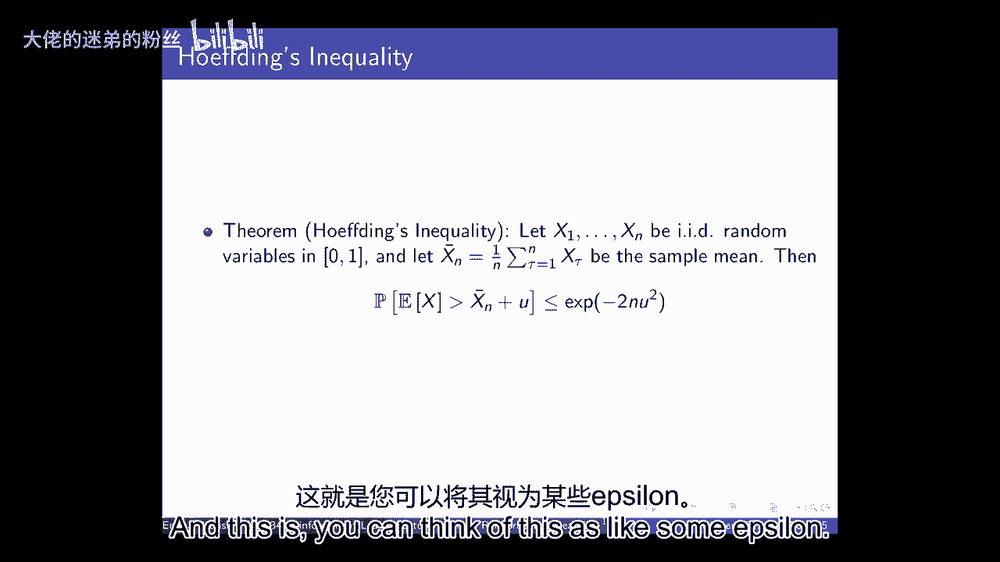
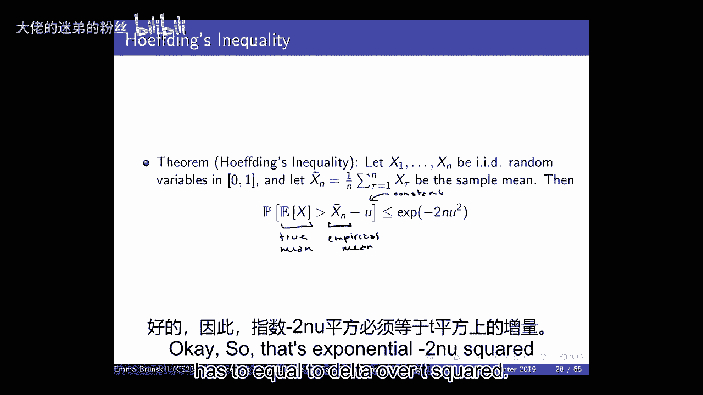
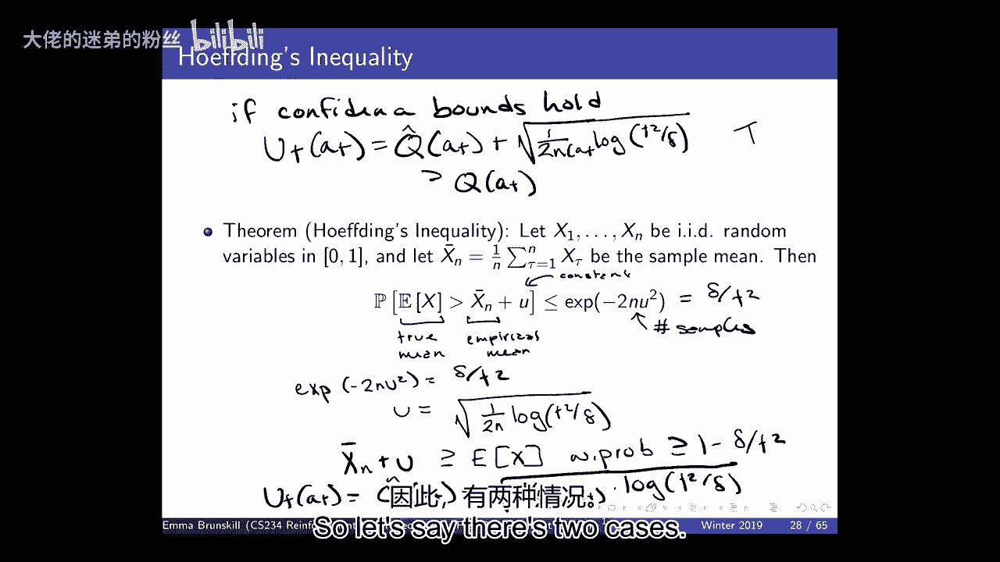

# P11：Lecture 11 - Fast Reinforcement Learning - 大佬的迷弟的粉丝 - BV1Cc411h7QQ

今天我们要做的是，我们将开始讨论快速强化学习，嗯，所以就我们在班上的位置而言，我们刚刚完成了政策搜索，你们现在正在为你们的家庭作业研究策略梯度，那就是最后的作业了，然后剩下的时间将在项目上，抱歉。

打扰一下，嗯，然后呃，现在我们要开始讨论快速强化学习，这是我们没有谈论太多的事情，如此如此，我们讨论了很多的事情，到目前为止，像优化这样的事情，泛化和延迟后果，那么我们如何做计划和马尔可夫决策过程。

我们如何使用深度神经网络来扩展到真正大的状态空间，嗯，我们如何做这个优化，我觉得这样很好，很多情况下，我们有很好的模拟器，或者在数据相当便宜的地方，但我在自己的实验室里做的很多工作都在考虑。

我们如何教计算机来帮助我们，这自然涉及强化学习，因为我们在教计算机如何做出有助于我们的决定，但我认为还有很多其他的应用，我们真的希望电脑能帮助我们，所以像教育这样的事情，在每一种情况下。

我们都可以把它们看作是强化学习问题，因为我们会有某种代理，比如我们的计算机，那就是，当它与人互动时做出决定，它试图优化一些奖励，就像它试图帮助某人学习一些东西，或者它试图治疗一个病人。

或者它试图通过拥有消费者来增加公司的收入，点击广告，在所有这些情况下，数据来自的地方是人，嗯，所以至少有两个大的挑战，首先就是，嗯，你知道吗，人是有限的，没有无限多的人，嗯，而且它是昂贵的，嗯。

当你与人互动时，试着收集数据，因此，它引起了对样本效率的关注，所以总的来说，当然啦，我们希望有强化学习算法，既具有计算效率又具有采样效率，但是到目前为止我们研究的大多数技术，尤其是Q学习类型的技术。

我们真的受到了对计算效率的需求的启发，所以如果我们回想一下我们刚开始做计划的时候，当我们谈论动态编程和动态编程中的Q学习时，我们必须对接下来的所有州进行求和，在TD学习中，我们取样了，所以在TD学习中。

我们每次更新的成本是不变的，与动态编程相比，我们有这个S的平方乘以成本，嗯，所以做动态编程这样的事情要昂贵得多，比做TD学习，嗯，按步计算，所以，许多在强化学习中发展起来的技术，一直在思考计算效率问题。

嗯，很多时候计算效率很重要，就像如果你想从头开始计划，你在开车，以每小时六十英里的速度，那么如果它需要你，嗯，所以如果你以每小时60英里的速度开车，你的电脑需要一秒钟才能做出决定，就像。

你知道怎么转动轮子之类的，那么在那一秒钟里，你已经旅行了，你知道很多脚，嗯，所以在很多情况下，你真的有实时的计算限制，你可以做，在许多情况下，比如，你知道的，在一些机器人技术的情况下。

尤其是当我们有模拟器的时候，嗯，我们真的想要计算效率，因为我们需要能够很快地做这些事情，我们可以用我们的模拟器，但我们需要我们的模拟器快，这样我们的经纪人就可以了解到，嗯，与这些例子相比。

样本效率是非常重要的，也许计算不那么重要，所以每当经验是昂贵的，我们在一起很辛苦，所以这尤其是涉及人们的事情，所以我们为病人考虑学生，就像我们的代理人了解世界的方式是做决定，嗯，数据影响真人。

所以我们采取，你知道的，几天的计算，如果我们能找到治疗癌症的更好方法，嗯，因为我们不想随机地在人身上做实验，我们想尽可能地利用数据并且非常非常有效地取样，在雅达利的情况下，它是，呃。

我们想要真正的计算效率，因为我们可以做很多，许多模拟，没事的，没有人会受伤，但是嗯，但我们最终需要学会，你知道的，推导出一个好的游戏，所以一个自然的问题可能没问题，所以也许现在我们关心样本效率，嗯。

在我们更关心计算效率之前，但也许我们已经讨论过的算法已经是样本高效的了，嗯，有没有人记得，就像在数量级上，或者喜欢，你知道的，在粗糙的棒球场的某个地方，DQN花了多少步骤才学会Pong的好政策。

也许有多个答案，也许有人在那里，五百万所以也许有人有五百万左右，我想你知道它可能在两到十个之间，我猜，两百万到一千万，所以嗯，那是很多，学打乒乓球需要很多数据，所以我认为我们到目前为止看到的技术。

嗯不打算解决这个问题，我们不需要，你知道的，两百万到一千万的顾客，在我们想出一个好的方法来定位广告之前，或者两百万到一千万的病人，然后我们才能做出正确的决定，到目前为止，我们看到的技术不会是。

他们在形式上没有样品效率，从经验上看，它们也不是有效的样本，所以我们需要新的技术，比我们到目前为止看到的，所以说，当然当我们开始思考这个，我们思考，你知道，一个算法好意味着什么，我们已经讨论过计算效率。

我提到过这个叫做样本效率的东西，但总的来说，我认为我们很关心的一件事是，你知道我们的强化学习算法有多好吗，我们将开始尝试用样本效率来量化，嗯，但当然你可以有一个非常有效的算法，从某种意义上说。

也许它只使用了前十个数据点，然后它从不更新策略，所以它不需要太多的数据来找到一个策略，但政策不好，所以当我们谈论样本效率时，我们想要两者，我们不需要太多的数据，我们不需要太多的数据来做出好的决定。

所以我们还是希望得到好的表现，我们不需要太多经验，所以当我们谈论算法好意味着什么时，你知道一种可能性是，我们可以讨论它是否会聚，嗯，这只是意味着价值函数或策略在某个时候是否稳定，像渐近。

因为时间步数是无穷大的，我们谈到了有时，值函数逼近，我们甚至没有这样的东西可以振荡，嗯，那么另一件比你可能想要的更强烈的事情是说“好”，当t趋于无穷大时渐近，我们会收敛到最优策略吗，我们讨论了一些算法。

在一些不同的假设下可以做到这一点，嗯，但我们没有谈论太多，你很清楚，我们多快能到那儿？渐近是一个很长的时间，所以我们可能想说，如果我们有两个算法，其中一个在这里得到最优策略，就像如果这是表演，是时候了。

另一个算法是这样直观的，算法2比算法1好，即使他们最终都得到了最优策略，所以我们希望能够解释其中任何一个，我们可以考虑我们的算法犯了多少错误，或其随时间的相对表现，与最优值相比。

所以我们今天要开始讨论一些其他形式的措施，一个算法有多好，所以在这堂课中，在接下来的几节课中，我们要做几件不同的事情，试图讨论这些强化学习算法有多好，思考算法，在性能保证方面可能会更好，嗯。

我们将开始讨论表格设置，其实今天我们只讲简单的土匪，但通常是为了下一个，嗯，今天和下节课我们将讨论表格设置，然后嗯，希望也能得到一些关于函数逼近和样本效率的知识，但我们将开始讨论设置，框架和方针。

所以我们今天要讨论的设置，下次就是土匪了，你们中的一些人在这里做默认项目，好的，所以你们中的一些人已经开始考虑这个项目了，所以我们今天要介绍土匪，嗯，然后我们还将讨论MDPS的这一点。

然后我们还将介绍框架，这些是正式评估强化学习算法质量的评估标准，所以他们的方式，有一种工具你可以用，评估许多不同的算法和算法，将满足或不满足此框架或具有不同的属性，嗯，在这些不同的框架下。

然后我们也将开始讨论方法，它们是实现这些不同评估标准的算法类别，对于不同设置下的这些不同框架，对于MDP设置或强盗设置，我们很快就会看到，有几个主要的想法，算法方法的风格，结果两者都有，嗯，适用。

强盗设置和mdp设置和函数近似，嗯，也有一些非常好的形式属性，关于我们如何快速做到这一点，有几个很大的概念性想法，加固，学习，好的，所以这个，今天的计划是，我们将首先介绍多年方法。

然后我们将讨论数学形式意义上的后悔的定义，嗯，然后我们将谈论不确定性下的乐观，然后我们将尽可能地讨论贝叶斯遗憾，um和概率匹配与汤普森采样，我很好奇这里有谁以前见过这种材料，好的，几个人，大多数人不是。

我不会，它被覆盖了吗，ai，我想他们不会报道的，好的，好的，所有的权利，所以对你们中的一些人来说，我这将是一个评论，对你们大多数人来说，它将是新的，所以对于多武装土匪来说。

我们可以把它们看作是强化学习的一个子集，所以它通常被认为是一套武器，有一套M臂，这相当于我们过去所说的行动，所以在强化学习中，我们的一系列动作，嗯，我们在想，就像有不同的行动。

现在我们经常把那些手臂叫做，然后对于这些手臂中的每一个，他们有你可以得到的奖励分配，所以我们没有谈太多，对我们的回报有点不确定，我们主要讨论的是预期的回报，嗯，对于今天的多武装土匪来说。

我们要明确地考虑，奖励可以从随机分布中取样的事实，所以有一些我们不知道的分布，它是以手臂为条件的，如此依赖于手臂，你会得到不同的奖励，所以说，比如说，可能是，为了我们的一个，你的发行版是这样的。

这就是那个奖励的概率，这是奖励，嗯，然后是第二臂，它看起来是这样的，所以在这个特殊的例子中，第一只手的平均奖励会高于第二只手的平均奖励，然后它们会有不同的差异，但它不一定是高斯的。

你可以有很多不同的分布，嗯，本质上，我们在这里试图捕捉的是，每当你，采取特定的行动，我们也称之为拉手臂，嗯，对于多臂土匪来说，嗯，那么你得到的奖励可能会有所不同，即使你拉了同一只胳膊两次。

所以在这种情况下你可以想象如果你一次又一次地拉手臂，你可能会在这里得到奖励，也许第二次你在那里得到奖励，所以在这种情况下，它的想法是类似于MDPS，除了现在没有过渡功能，所以没有状态，或者等价地。

你可以想到它，因为只有一个国家，嗯，所以当你拿起一只胳膊，你保持在同样的状态，你总是可以采取这些行动，在每一步中，你可以选择采取什么行动，然后你观察到一些奖励，从与该臂相关的未知概率分布中采样。

就像强化学习一样，我们事先不知道那些奖励分配是什么，我们的目标是最大化累积奖励，所以如果有人提前告诉你这些分布是什么，你就会知道该拉哪只胳膊，以预期最高者为准，平均，所以说。

我们将尝试使用与我们所使用的非常相似的符号，用于强化学习案例，但如果你注意到令人困惑的事情，只要让我知道，嗯，所以我们将把行为值定义为平均奖励，对于某一特定动作，所以这是Q A，这是未知的。

代理人事先并不知道这一点，最佳值v星等于最佳动作的q，然后遗憾将是失去一步的机会，所以这意味着如果不是采取，如果你能取一颗星的Q，相反，你拿了A的Q，所以这是你选择的真正的手臂，你拿了次优的手臂。

预期损失了多少，这就是我们如何从数学上定义后悔，在强化学习的情况下，所以如果你选择了最佳的手臂，你的遗憾，我们期望的遗憾将是零，为了那个时间步骤，嗯，但对于任何其他手臂，会有一些损失。

完全的遗憾只是完全的机会损失，如果您将代理行为的所有时间步长相加，并比较它所采取的操作，和，嗯，这些行动中每一个行动的预期回报到最佳行动的预期回报，我想说清楚，这是不知道的，代理不知道这一点。

探员不知道这一点，只是想看看你是否理解，这是为什么，那么为什么探员不知道第二件事，因为你不知道概率，所以是正确的，所以你不知道我的分布是什么，所以你不知道Q是什么，你可以观察到，嗯，从中提取的样本。

所以你可以观察R，你得到一个R，从奖励的概率分布中取样，鉴于所采取的行动，但是你不能观察到最优臂的真正期望值，也不是手臂的真实期望值，您选择的，所以这不是我们通常可以评估的，除非我们在模拟领域，好的。

但我们将讨论如何约束这一点，并思考算法，试图将遗憾降至最低，所以如果我们想办法量化它，另一种思考方式，或者是嗯，想想你采取某一特定行动的次数，我们可以称之为，所以这就像我们选择行动的次数，一招二招等等。

然后我们可以定义一个缺口，这是最优臂值之间的差值，以及我们选择的手臂的价值，这就是差距，所以这就是我们选择不同的手臂而不是最佳的手臂所损失的，所以这个间隙等于恒星的间隙等于零。

因为你不会因为选择最佳手臂而失去任何东西，适用于所有其他武器，这将是积极的，所以另一种方式来思考遗憾，它是等价的，也就是说，这相当于思考预期的次数是多少，你选择每一个手臂，乘以他们的差距。

那么选择这只手臂和选择最佳的手臂相比你会损失多少，我们想要的是一种算法，应该能够调整你拉手臂的次数这些手臂有很大的间隙，所以如果有一只非常非常糟糕的手臂，好像有很糟糕的动作，它的奖励很低。

你不想拉那么多，采取那个行动，就像接近最优的手臂一样，所以我们以前见过的一种方法是贪婪，在土匪的情况下，贪婪算法非常简单，我们只是平均我们在一只手臂上看到的回报，所以我们看着每一次我们拿着那只胳膊。

我们看看我们为每一个时间戳得到的奖励，然后我们把它平均一下，这就给了我们Q HAT的估计，然后贪婪所做的是，它选择值最高的动作，嗯，永远带走那只手臂，在这种情况下可能很清楚。

因为奖励是从随机分布中取样的，如果你运气不好，得到的样本是错误的，那么你可能会锁定在错误的动作中，并永远停留在那里，所以如果我们想想我之前举的那个小例子，我很快就会想出一个更大的例子，所以在这种情况下。

想象这是奖励，这是概率，所以让我们想象第一个，嗯，我不知道，把这个1和这个0，所以如果你从一个，在这种情况下，你可以想象你得到的第一个样本有一定的非零概率，比如说第二点，嗯一个，你得到的第一个样品是2。

非零概率可能是第五点，所以2的真实平均值比1的平均值低，但是如果你把这些都取样一次，嗯，那么如果你是一个贪婪的人，那你就会永远采取错误的行动，永远的行动是我们的政策将影响，将来会得到什么样品。

还是这个想法，但是有一些独立于这种贪婪政策的样本开始，因为看起来不是这样，如果没有零奖励，你就永远接受这个问题，一个很好的问题，所以嗯，是的是的，是啊，是啊，所以说的是，嗯，你知道的，在这之前。

我们还有什么额外的事情要做吗，通常对于许多这些算法，我们假设他们都是通过选择每只手臂一次来操作的，至少如果你有一套有限的手臂，um及相等，如果你没有任何数据，你可以说，你对一切都一视同仁，或者嗯。

但本质上，这些人大多说，直到你有所有手臂的数据，我们要进行循环赛，你要把所有东西都取样一次，然后再取样，2。要么你贪心，要么我们另想办法，所以必须有一个预初始化空间，这是个好问题，所以。

我们现在也要假设我们分道扬镳，嗯，以相等的概率，所以如果有两个手臂有相同的概率，嗯，它们都有最大动作最大值，然后您将在这些时间之间分配时间，直到值被更改，所以这是一个例子，如果我们第一次取样一次。

然后取样一次，嗯，因为这些样本让它看起来像那个动作的概率不是零，a 1的平均值低于a 2，那么你可能会永远锁定在错误的动作中，现在一个e贪婪算法，我们以前在课堂上见过，嗯，我做了一些非常相似的事情。

除了概率1减去ε，我们选择，嗯贪婪的行动，否则，对于Epsilon，我们将概率分配给所有其他动作，或者其他所有的手臂，所以在这些情况下，嗯，我们有更多的鲁棒性，所以在这种情况下你知道我们会继续取样，嗯。

另一个动作，但我们总是会做出次优的决定，至少Epsilon%的时间，大约比这个少一点，因为如果你完全随机地做，不是一个，但这是Epsilon的命令，我是说，比那稍微少一点，因为，嗯。

如果你均匀分布在你所有的手臂上，概率是手臂数的1，你将选择最佳动作，好的，让我们在实践中看看这些，在我们更多地谈论更好的算法之前，嗯，所以说，让我们想象一下我们正试图找出如何治疗断了的脚趾。

这不是一个真正的医学例子，嗯，但让我们想象一下有三种不同的手术，三种不同的选择，一个是手术，一个是巴迪用另一个脚趾粘断的脚趾，这就是互联网可能告诉你要做的，嗯，第三是什么都不做。

结果度量将是一个二元变量，你的脚趾在六周后是否痊愈，经X光评估，好的，所以让我们把它想象成一个多臂强盗，有三只胳膊，每个臂对应井，我马上就会问你这是什么意思，这里有一个未知的参数，所以每一个都是。

有一个未知参数，这是奖励结果，所以让我们只拿，你知道的，一两分钟，只是想说在这种情况下，手臂的一拉对应于什么，为什么把它塑造成强盗是合理的，而不是MDP，至于为什么我们把它塑造成强盗。

一个原因是MDPS通常认为一个特工在这个世界上行走，每个州，世界有许多不同的状态，我们在这里分析这些，我们只有一个状态，脚趾断了，和T中的各种动作是正确的，所以我们只有一天时间，所以什么是什么。

拉一只胳膊是什么意思，在这种情况下，或者采取行动，这在现实世界中对应于什么，那将是一个新病人进来，然后对病人的护理做出决定，所以这就像一个病人进来，然后我们决定要么给他们做手术，要么给他们，嗯。

在这种情况下，我喜欢做三个治疗选择之一，嗯，所以在这种情况下也是如此，每个池子都是不同的病人，通常会影响我们对二号病人的治疗他们是否痊愈，或者那个特定的，你知道的。

手术对他们有效并不影响下一个进来的病人，所以所有的病人都是LID，嗯，我们想知道要做的是，这些治疗方法中哪一种平均最有效，好的，所以让我们在一个特定的场景中思考这些，所以i是一组特定的值。

所以让我们假设它们都是伯努利奖励变量，因为要么脚趾要痊愈了，否则六周后就不会痊愈了，在这个假的例子中，手术是最好的，所以如果你以95%的概率做手术，六个星期后就会好了，伙伴录音是90%。

什么都不做是第一点，那么如果我们做一个贪婪的算法会发生什么，哦耶，公司其他因素，就像拉手臂一样，比如说，外科手术，比如征税，或者像交叉感染，为了身体的东西，或者把它结合起来的方法，是啊，是啊。

这是个很好的问题，所以嗯，问题是关于，呃，你知道，我们能不能，你知道的，手术更具侵入性，可能会有其他副作用，等，等，你可以想象有几种不同的方法把这些信息放在一个里面，你可以改变奖励结果。

所以你可以说也许它更有效，但也很贵，我得想办法把结果和成本结合起来，嗯，在这种情况下，人们可能会有兴趣做的另一件事，你可能有一个结果的分布，所以在这种情况下，它们都有相同的分布，他们都是伯努利。

但在某些情况下，嗯，你的奖励结果不会是，将是复杂的功能，就像这样，可能是，嗯，也许对一些人来说，手术真的很糟糕，对大多数人来说，这真的很好，但这对一些人来说真的很糟糕，因为他们有。

你知道一些非常糟糕的副作用，所以它的意思更好，嗯，但有一个非常糟糕的风险尾巴，也许你认识的人对麻醉或类似的东西反应不好，所以在这些情况下，你可能不想关注预期的结果，你可能想看看风险敏感性，事实上。

我们小组正在做的事情之一是研究安全加固，学习，包括安全土匪，嗯，并思考如何优化风险敏感标准，我们今天不谈的另一件事，在这种情况下，你可能也想做的是，病人并不都是相同的，嗯。

你可能想结合病人的一些背景特征，试图决定做哪个手术，或者不手术和伙伴录音，希望很好，你们中那些正在做默认项目的人肯定会想到这一点，我们可能会在几节课中讨论这个问题，我们通常有一种丰富的上下文状态。

这也会影响结果，好的，所以在这种情况下，让我们想象一下我们有，嗯，我们可以做的三种潜在的干预措施，我们在运行贪婪算法，所以嗯，作为一个以前长大的人，我们将对这些手臂进行一次取样。

现在我们要得到一个经验平均值，所以假设我们的动作是1，我们得到了一个加1，所以现在我们对行动的预期回报的经验平均值，一个就是一个，然后我们做一个二，我们也得到一个，这是我们的新平均值，然后我们做一个三。

我们得到一个零，所以在这一点上，贪婪选择每只手臂的概率是多少，假设领带是随机分裂的，对于前两个，然后让第三个人加减一点，我是说，是啊，是啊，所以这是完全正确的，为了E贪婪的案子，所以你跳得有点快。

但那是完全正确的，嗯，呃，在这种情况下为了贪婪，就五五分成，你已经变得贪婪了，所以是的，所以一个的概率等于，2的概率等于一半，所以让我们想象一下，我们这样做了几个时间步骤，所以我们可以想想遗憾是什么。

我们在这一切中所招致的，所以在开始的时候，我们有这样的初始化期，在那里我们将选择每个动作一次，我们总是把这比作，在最佳行动下，我们可以得到什么回报，所以这里的遗憾将完全相等，所以这是最优的，记住。

毕业生将是一颗星的Q，减去你所采取的行动的Q，所以在第一种情况下，它将是零，因为我们采取了最优的行动，在第二种情况下，它将是点九零点五减去点九，所以零点五，在第三种情况下是9点5减去1点。

然后在第三种情况下，它将为零，否则第四个病例将为零，然后又会是零点五，在这种情况下，我们会选择一个贪婪的，我们还会再选3吗，考虑到我们到目前为止看到的价值，否，是啊，是啊，我看到人们说不，否，所以说。

为什么不呢？有可能吗？我们目前对三人组的奖励估计是多少，零，是啊，是啊，所以我想我没有显示把那些放在这里，但这是真正的，这些是我们得到的奖励，所以是一个零，所以我们目前对3的估计是零。

我们知道我们的奖励在零到一之间，我们的估计都不会跌破零，嗯，我们已经有了一个积极的其他两个行动，这意味着他们的平均值永远不会归零，所以我们再也不会拿三分了，在这种情况下，这实际上并没有那么糟糕。

就像这里，这实际上不是一个问题，因为三分是不好的手臂，它的预期回报要低得多，在其他情况下，我可能是一个三，我们只是运气不好，在这种情况下这可能意味着我们永远不会采取最佳行动。

我想我们在后悔的奖励方面用了B星，是呀，这和这个好问题是一样的，所以这和b星一样，我会在符号之间来回，但是是的，当然只要问我，所以在这种情况下，我们再也不会选择三了，现在请注意，在贪婪的情况下。

有些情况下，嗯，如果我在这里使用了稍微不同的值，嗯，您可能稍后再次选择了通过，因为如果是这样的话，如果你没有伯努利奖励，但你有高斯，嗯，可能是其他手臂的奖励后来下降到另一个手臂下面，然后你开始切换。

所以你不一定总是坚持在开始时另一只胳膊看起来最好，但在这种特殊的情况下，这些结果，那你就不会再选三了，好了现在，让我们做，嗯，贪婪，所以在这种情况下，我们会假设我们在最初的几个中得到了完全相同的结果。

嗯，然后说的是我们要有一半，负ε大于2，所以我们又要随机平分领带了，所以我们要用概率epsilon，嗯，Epsilon大于3，我们要拿一、二、三，一减ε除以二，我们要拿一两个，它没有更新。

所以在这种情况下，它看起来几乎相同，除了我们仍然有可能拿三分，在这种情况下，在这种情况下，我们可以做一个类似的计算，嗯，你假设所有这些都是完全相同的，所以在这种情况下，E贪婪会再次选择一个三，是呀，嗯。

如果Epsilon是固定的，不更新，嗯，如果Epsilon是固定的，它要选多少次三，主要问题是它是有限的还是无限的，所以也许可以和邻居谈谈，并决定Epsilon是否固定。

是否会是一个三将被选择有限或无限次，就遗憾而言，这意味着什么，好的，我要让每个人都投票，所以如果你认为它会被无限次选中，举起你的手，伟大，那遗憾是什么意思呢？所以后悔是好是坏，未知，大错特错大错特错。

我是说，不幸的是，在这种情况下，遗憾是无限的，所以不幸的是我们总是会有无限的遗憾，但是嗯，但它的生长速度可能要小得多，取决于算法，你这样做，特别是，我是的，所以我们也可以考虑一下，在这种情况下。

所以如果你有很大的差距，我们在这里做一个三，我们将无限次选择那只手臂，那么E贪婪也会有，嗯，巨大的遗憾，所以我喜欢这个情节，这个情节来自大卫·西尔弗的幻灯片，嗯，所以如果你永远探索。

就像如果你只是随机地做，嗯，我们没有讨论，但你也可以，那你就会有线性的完全后悔，嗯，这意味着随着时间步数t，你要用T线性缩放，1。你的遗憾与日俱增，它呈线性增长，这基本上是一个比例。

我是说它前面通常会有一个常数，但是嗯，这将是一个恒定的时间，你在每一步都能做的最坏的事情，因为如果你每次都选最差的手臂，你的后悔也会线性增长，所以很糟糕，嗯，如果你探索，从来没有，如果你贪心，呃。

那么它也可以是线性的，如果你贪婪，它也是线性的，所以本质上，这意味着我们到目前为止使用的所有这些算法，可能会有非常非常糟糕的表现，当然在糟糕的情况下，所以关键问题是它是否更好，有可能做得更好。

所以我们能不能，所以通常所说的潜意识后悔，所以我们想有遗憾，如果一个算法在性能和样本效率方面被认为是好的，我们会希望它的遗憾在潜意识里增长，当我们想到这个，我们通常会考虑我们创造的界限。

性能界限将与问题无关或与问题相关，所以大部分的边界都取决于MDPS，我们能得到的大部分边界对强盗来说都是问题独立的，有很多问题相关的界限，嗯，在强盗的情况下，问题相关的界限意味着，嗯。

我们得到的遗憾的数量将是这些差距的函数，这应该是一种直觉，所以如果你有，让我们想象一下，我们只有两只胳膊，就像一只胳膊和一只胳膊，预期回报的平均值，所以如果这是预期的奖励是一个，预计这将是零点零一。

直觉上，应该更容易发现第一臂比第二臂好，那么如果这是五点三，这是五点二五，这是一个案例，很难分辨两只手臂的平均值，另一种情况意味着真的真的很远，所以有点直觉，如果差距真的很大，对我们来说应该更容易学习。

如果它真的很小，它应该是比较硬的，是啊，是啊，如此如此是的，呃所以呃，对于某些行为，最优报酬是确定性的，我是说我们没有，好的，好问题，嗯嗯，问题是，如果最优是，如果呃，最佳奖励是，呃，你是说最佳奖励。

是啊，是啊，最优报酬是确定性的，我们有零遗憾吗，如果你知道的话，所以如果你知道武器的所有奖励都是决定性的，然后你只需要拉一下，然后你就可以做出一个好的决定，然后你就大功告成了，如果你不知道这些信息。

这些算法就不会知道这些信息，即使它是确定性的，你仍然会有这些其他形式的界限，那么那个案子呢，如果确定，如果在贪婪的情况下，在贪婪的情况下，这是一个很好的问题，如果你的真正回报是确定性的，嗯，那你就知道。

那你就会把所有的胳膊都拉出来一次，你不会犯错，你会让你无怨无悔，基本上从那一点开始，所以我们会考虑，就像你最初会有一些持续的遗憾，然后它将独立于，你没有问题吗？是啊，是啊，我的你的是。

它也是每只手臂方差的函数，哦，好问题，像第二种情况的方差最好，是啊，是啊，大问题，所以我们不打算谈论一个问题，它是否也取决于方差，除平均值外，嗯，是呀，我们不谈这个，但是除了问题相关的界限之外。

你当然可以考虑参数，比如，如果你对奖励的分配有一些参数化的知识，然后你就可以利用它，嗯，所以如果你知道它是高斯的，或者其他类似的东西，嗯，我想总的来说，如果你知道更多的喜欢，如果你有关于这些时刻的信息。

那么你应该可以利用它，我看到的大部分信息是，我在看平均值，我们在整个过程中经常变化的差异，很多东西都会假设我们的奖励是有限的，嗯，这对我们做的大多数证明都很重要，即使不做任何其他参数假设，好的。

但另一个版本是问题无关的，它只是说不管你在哪个领域，不管有什么差距，我们也能证明，嗯，不管问题的任何结构，我们还能确保遗憾线性增长吗，这就是我们今天要重点讨论的，所以我认为下限。

较低的理论界限有助于理解一个问题有多难，所以我说，有可能是次线性的吗，嗯，以前有一些工作要看，后悔要增长多少，所以在这种情况下，这是遗憾，我们主要是用，写下遗憾，但在这种情况下，他们。

他们证明了从分布的间隙和相似性来看，就KL散度而言，kl散度，你可以显示后悔增长的下限，所以说，这就是遗憾的不幸方面，无限生长，如果你不做任何其他假设，关于你奖励的分配，嗯，一般来说，你的遗憾，嗯。

你的悔恨会无限增长，它将根据这些差距和羽衣甘蓝的差异来做到这一点，但它仍然是亚线性的，所以这很好，所以它是随着t和时间步长的对数增长的，令人鼓舞的是，就像我们的下限表明有牵引力的空间，对我们可以。

肯定至少，没有正式的结果说它必须是线性的，它说不，我们应该能成长得慢得多，那么我们怎么做为什么，我们该怎么做，所以现在我们已经讨论了一个特定的框架，就是后悔，我们讲了一个土匪的场景。

现在我们要谈谈一种乐观的方法，面对不确定性，这个想法只是选择可能有高价值的行动，我们为什么要这样做--上一张幻灯片上的一个问题，嗯，所以在每一个t处都是真的，还是只在极限处是真的？因为正如它所写的。

那不只是说它大于无穷大吗，嗯，这是个好问题，问题是它是否成立，我想我想这坚持住了每一步，2。我得核实一下，他们写了这个，嗯啊，也有常数，嗯，但我认为这应该保持在每一次步骤的基础上。

我们真的是说随着时间的推移，这应该是真的，是啊，是啊，当T变大时，极限，这就是我必须回头看原始论文的地方，嗯，可能还有额外的常数项，它们是暂时的，所以这可能是主要的术语，当T变大的时候。

但在很多遗憾的范围内，尤其是在我们的MDP病例中，我们经常有独立于时间步长的临时术语，但在早期仍然很大，那是我的猜测，但很好的问题，好的，面对不确定性如此乐观，嗯，说我们应该选择可能有很高价值的行动。

为什么好，有两种可能的结果，如果我们选择一些我们认为可能好的东西，嗯一个是，这很好，所以如果它是好的，或者我会更精确，在这种情况下，假设我们选择了一个，一个有很高的奖励，所以这很好。

如果我们如果我们采取行动，它真的做到了，因为我们认为这可能会有很高的回报实际上确实有很高的回报，那我们就会有小小的遗憾，所以这很好，嗯，另一个结果是什么，一个人没有很高的报酬，就像我们取样时一样低。

我们得到了一个报酬很低的R，如果我们得到一些低回报的东西，我们学到了一些东西，所以我们就像嘿，你知道我们又去了那家餐厅，我们觉得很棒，第一次，第二次很可怕，所以现在我们知道那家餐馆不如。

我们更新了对这家餐馆有多好的估计，这意味着我们不认为这一行动有那么高的价值，就像以前一样，所以本质上要么世界真的很棒，在这种情况下，这很好，我们会有很低的遗憾，还是世界没那么伟大，然后我们学到一些东西。

所以这给了我们信息，所以这是乐观的行动，嗯给了我们两个关于世界的信息，或者让我们获得高回报，所以这是一个非常好的原则，它至少已经存在了，嗯，1993年莱斯利布线，引入了区间估计排序的思想，然后呢。

开始有很多对这种乐观情绪的分析，在不确定性技术下，那么我们怎样才能更正式地做到这一点呢，或者喜欢，我们从哪里可以更精确地了解一个动作意味着什么，有很高的价值，让我们想象一下。

我们估计每个作用值的上置信限，使那个动作的真正价值，um大概率小于或等于置信度上限，以及一般的置信度上限，将取决于我们选择那个特定动作的次数，因为我们希望它是这样的，如果我们选择了这个动作很多。

置信度上限应该非常接近a的q，如果我们没有经常选择它，也许我们真的很乐观，嗯，然后呢，我们可以定义一个置信度上限的强盗算法，只要选择置信度上限最高的动作，所以对于每一个动作，我们都保持一个上置信限。

然后我们只选择最大的一个，然后我们在采取行动后更新该行动的置信上限，所以对于t等于一个点，UCB算法将，我们首先会有一个初始化阶段，我们把它拉一次魅力，每只手臂一次，然后我们计算，对所有人来说。

然后对于t等于一个点，点点，我们会选择一个T同样错过Argmax，然后呢，我们会得到一个从真实的奖励分配中取样的奖励，为了那只胳膊，然后我们会更新，出了一个T，和所有其他武器。

我们经常要更新的不仅仅是手臂的动作，但我们采取的所有其他武器的行动也是如此，嗯，这基本上进入了你的身体，你不必那么做，但就理论而言，我们经常要这样做，以便说明，嗯，大概率界。

我们将在一秒钟内看到更多关于这一点的信息，每次你得到奖励，你更新你所有手臂的置信上限，然后选择下一个操作，你一遍又一遍地重复这个，好的，那么我们如何定义这些U，所以我们要用希望不等式，嗯。

在希望的不平等中复习，我们可以将其应用于一组IID随机变量，我们现在假设它们都在零到一之间有界，我们要定义我们的样本平均值，只是所有这些变量的平均值，然后主机说的是，预期的意思是。

就像这是真正的预期平均值，所以这才是真正的意思，这是我们的经验平均值，这就是你可以把它想象成一些epsilon。

这只是一些常数。

你的真实平均值大于经验平均值的概率，加上一些常数u小于，或等于指数-2 nμ的平方，所以这是我们有的样本数量，所以我们也可以反过来说，如果你希望这是真的，有一定的概率，你可以挑一个。

所以xn加mu至少和，嗯，真正的意思，所以让我们说我们想做的是我们想让这个，我们希望经验平均值加上mu，低于实际平均值的概率，等于△除以t的平方，我们很快就会明白为什么我们要选择那个特定的概率。

但让我们想象一下，这就是我们希望我们的概率，然后我们就可以解决什么是好的，所以这是指数级的，等于Δ除以t的平方。

然后我们要做的就是解出μ是多少，谢谢你让我知道，所以在这种情况下，mu等于平方根，n的对数t的平方除以delta，所以我只是解这个方程，这告诉了我们什么，如果我们这样做了，如果我们定义了我们的。

或者在本例中我们定义，我将使用与跳跃相同的符号，所以说，如果我们有x和mu，在特定的mu选择下，这通常会大于或等于x的真实期望值，概率大于等于t的平方上的一减delta。

所以这个质量的停顿给了我们一个定义上限的方法，因为现在这些不是X，你可以想象这些只是我们手臂上的水池这些都是奖励，所以这意味着如果你把你到目前为止的经验平均回报，加上这个上界。

这取决于我们拉那只胳膊的次数，所以这里没有注意到我们拉任何手臂的总时间步数，n是我们拉那只胳膊的次数，所以它们不是一回事，所以我们在这个信心范围内，我们有信心。

它是以我们拉这个特定手臂的次数的速度减少的，然后我们有一个对数项，它以我们拉任何手臂的次数的速度增加，这就是为什么在每一个时间步骤之后，我们必须更新所有武器的置信上限，所以当你拉一只胳膊时。

你会有两种相互竞争的速度，越多，你就会对它的回报有更好的估计，所以它在缩小，但你也有这个生长较慢的术语，这个日志，随着时间的推移而增加，步骤，所有的权利，所以这是我们定义置信度上限的一种方法。

所以我们可以在奖励的情况下用这个，所以我们可能想说，T的UT等于我们对该臂的经验平均值，加1/2，我们拉手臂的次数，t的平方除以delta的对数，这就是我们定义置信度上限的一种方法。

所以现在下一个问题是好的，所以我们已经做到了，这将如何帮助我们展示，也许对乐观的事情的遗憾实际上是亚线性的，所以我们现在要做的是，嗯，我做个快速调查，你们想让我写在这里吗，还是你们想让我在黑板上做。

所以如果你想把它放在黑板上，请举手，所有的权利，如果你想把它放在这里，请举手，好的，我们会在黑板上做下一部分，那很容易，后面有问题吗，因为似乎你第一次介绍它是关于t的，是啊，是啊。

当你第一次介绍它的时候，它基本上是一个常数，我们四处移动，但后来你又说，那实际上是我们每一步都在更新的时间，那么我们怎样才能做到这一点呢，是啊，是啊，这是个好问题，所以嗯，你说的对。

我是说对此有点不精确，如果你知道时间范围是什么，你要演强盗，您可以将t设置为最大值，所以如果你知道你要为时间而行动，你可以把它插进去，然后你的信心界限是，那么该日志项是固定的，嗯，在联机设置中。

如果你不知道，你也可以随着时间步长不断更新，这是个好问题，德尔塔怎么样了，决定，怎么样，德尔塔怎么样了，就像，什么是三角洲，问得好，嗯，所以我的问题是什么是Delta，嗯，什么，我们要，我没有告诉你。

呃，在这种情况下，在这种情况下，它告诉我们，嗯，它在指定，这保持的概率是多少，就像这种不平等所持有的，后来，我们将提供一个遗憾的约束，那是很有可能的，所以我们要说证明是一个令人遗憾的束缚。

这就像概率一样，至少一个减去delta的函数，嗯，你的遗憾将是亚线性的，所以那是，嗯，你可以得到预期的后悔界限，我也是，还有啊UCB纸，加州大学的哪一篇原始论文，提供预期界限，但我觉得有点。

这个界限在课堂上更容易做一点，所以我想我会做高概率的限制，所以在我们谈论后悔之前，我不太明白你怎么用后悔，更新您对动作值的估计，哦好问题嗯，所以问题是我们是否使用。

或者我们如何利用遗憾注定遗憾来更新我们的估计行动，我们不后悔只是一个分析我们算法的工具，大澄清，所以遗憾是我们分析的一种方式，一个算法是好是坏，就遗憾增长的速度而言，但算法本身没有使用，算法不计算后悔。

在更新方面没有使用，抱歉，打扰一下，好的，所以实际上我把这个留在这里，所以你们可以继续看到好吧，所以让我们做我们的证明，所以我们现在要做的，我们要试着证明一些关于遗憾的事情，但是对于上置信限算法来说。

它增长之前和多快，但在我证明之前，我要试着和你争论，我们要看看这些遗憾失败的可能性，这些置信区间的元音，所以我在这里说的是，我们要像这样定义这些置信度上限，到目前为止，就该手臂的经验平均值而言。

加上这个术语，这取决于我们拉手臂的次数，我现在想说服你的是，概率是多少，在一个台阶上，在某个台阶上，信心界限将无法保持，边界将无法保持，为什么这不好，好的，所以我们想约束在任何一步上，抱歉，打扰一下。

当我们运行算法时，我们的信心界限无法保持，为什么，因为如果他们都持有，我们可以保证我们会做一些，我们会有一些不错的房产，好的，所以注意，如果所有的信心界限都像每一步一样保持不变，然后我们可以确保以下。

所以如果所有的信心都站得住脚，边界保持，然后你，的t，这是我们选择的实际手臂，将大于恒星的Q，实际价值，最优臂的实际值，那么为什么这是真的呢，这里也有两箱，t等于一颗星，或at不等于恒星。

所以让我们花点时间，也许和你的邻居谈谈，如果我们的信心界限成立，这意味着我们真的有，我们嗯，这个信心约束是，呃，大于或等于那只手臂的平均值，所以这些是真正的置信限，这个方程成立，我们不会失败的。

所以我们知道Q T，这将大于手臂的实际期望值，所以如果那是真的，然后每一步都要保持住，所以也许让我们找一个邻居，如果你不清楚我在问什么，也不清楚该怎么想，把你的手也举起来，所以有两个案子。

要么我们选择的手臂是明星，或者我们选的手臂不是明星，在这两种情况下，这都将保持不变，如果置信限是正确的，所以也许让我们花点时间想想这个，或者随便举手，如果不清楚如何，如何开始，我先说清楚，所以说。

我只想在顶部指出如果置信度界限成立，那么置信度上限，等于这将大于手臂的实际期望值，关于束缚你的信心或你写在那里的问题，是啊，是啊，所以你是说最优的，比如你的最佳Q值应该小于任何动作的所有置信限。

没有好问题，所以请我澄清一下这一天对你选择的手臂有什么意义，您选择的手臂的置信上限是有一个值，你用来选择手臂的信心上限，无论你选择哪只手臂，该臂的置信度上限高于最优臂的真实值，这就是这个等式所说的。

说如果置信区间保持所有时间步长，他们可能不会，但假设它们有，因为这些只是高概率界，但如果他们坚持所有的时间步骤，然后你选择的任何手臂，它的置信度上限高于真臂的值，真臂的真正价值，我只想说清楚。

我的意思是信心一定会保持，我把这个放在那里，这意味着手臂支撑的上置信限，意味着上置信限，以这种方式定义的价值大于手臂的真实价值，所以让我们稍微解决一下这个问题，所以让我们看看有两个案例。

所以如果一个T等于一颗星，这就是我要说的，是不是说是恒星的质量大于恒星的质量，如果置信区间成立，根据定义，所以如果你往上看，所以置信度上限，如果它支持这样的行动。

一个动作的上限置信度必须大于该动作的平均值，如果置信度上限成立，好的，所以这个这个工作，如果我们真的选择了最佳动作，我们已经定义了我们向上的信心界限，所以他们真的比那只胳膊的平均值要好，所以这是保持。

另一种情况是AT不等于恒星，那么这意味着什么呢，这意味着out of at大于out of a star，因为否则我们会选择一颗恒星，这意味着其他手臂的置信度上限高于最佳动作。

我们知道这大于一颗恒星的q，所以如果置信区间成立，我们知道在每一个时间步骤，我们选择的手臂的置信上限，比最优臂的真实平均值好，在贪婪的情况下也是如此，这是真的，和Epsilon贪婪的情况下，我知道。

所以我还没听懂你的问题，就像你在用某种策略选择这个农场一样，对呀，是啊，是啊，在这种情况下，最大化行动奖励，对呀，我知道你看到了，所以这只成立，这一部分只有，因为我们选择了arg max。

你不会看到这个的，但是ARG最大值，A的U的T的A的T，所以第一个不等式，可能还有其他算法可以支持两个，但对于置信度上限，它尤其成立，伟大的伟大的问题，好的，所以这上面写着，如果我们能得到它。

我们很快就会看到，为什么这很重要，但直觉上，上面写着，嗯，如果置信区间成立，那么我们就知道我们选择的手臂的单独置信区间，会比最佳手臂更好，我们想要的原因，那是以后，当我们在做遗憾的界限。

我们不想处理财产，我们不观察，即最优臂的值，因为我们不知道恒星的Q是多少，不能，我们不知道是哪只手臂，所以当我们现在看到后悔的时候，遗憾的界限是用一颗星的Q来表示的，我们不知道那个数量是多少，所以说。

我们得想个办法把那批货处理掉，嗯，我们最终将使用这些上界，但是，我们需要事实，我们选择的手臂的上界比Q星更好，恒星的q，好的，所以这是说那是真的，如果我们的置信度上限成立，发生这种情况的可能性有多大。

好的，这意味着如果我们想说在所有的时间步骤上，这是一个联合约束，这是一个关于事件的联盟，所有事件的联合，因为T等于一颗恒星Q的概率的一到T，减去我们所采取的行动的置信上限，我们想要这个概率。

本质上是失败的概率，所以这就是我们的问题，如果所有的信心界限都保持着事情是好的，它说失败的概率是多少，你拿的手臂实际上并没有更好，上置信限不比，最优臂的真实平均值，所以这是一个失败的案例，信心，但是。

嗯，我们要说，如果我们看看，我们不希望这种事发生，我们可以上界，通过确保我们的信心上限在任何时候都保持，所以这些是手臂，所以我在上面说的是，如果我们所有的信心都保持在所有的时间步数上。

我们可以确保这一点，所以我们现在要写下来，在这方面，置信度上限在所有时间步上保持不变的概率是多少，所以我们要做概率Q，一个T的S Q的帽子比你大，这是我们在那里定义的置信度上限，这只是说。

每只手臂的信心上限都保持在每一步很好，根据定义，在那里我们说我们，我们选择了一个置信度上限，以确保这一点以最小的概率△除以t的平方，因为这就是我们如何定义我们的置信度上限。

我们选择了一个足够大的东西来增加我们的经验手段，这样我们就可以确保我们的信心上限真的比我们的意思我更大，所以现在我们有一个工会在所有的时间步骤，所有三角洲上的联邦除以t的平方，注意，如果你和t等于1。

到t的无穷大到负t，等于圆周率的平方除以6小于2，所以当你做这个和的时候，你得到两个m-delta，所以说，这意味着你的置信度上限在所有时间步上保持不变的概率，所以这是底片。

这就是他们没有保持的至少是1-2米的三角洲，所以我们最终要做的是，我们很有可能会后悔，说，概率至少为1-2 m Delta，你会后悔的，这是一个很好的问题，是呀，这都是为了一个无限视界的案例。

我们要看看，我们将用时间步数来定义我们的遗憾，那么这为什么有用呢，嗯，你们想让我把这个留在，或者我们可以移动它，现在每个人都写下来了，谁想要，好的，所以让我们把这个升起来，让我看看，或者不是，好的。

那么为什么这有用呢，好的，我们现在要定义我们的遗憾，所以黑板的这一部分只是说我们成功了，所以这些置信度上限很有可能成立，现在我们要试着展示我们的遗憾是什么，哦很好，谢谢好的，那么我们有什么遗憾呢？后悔。

我们的UCB算法在T个时间步长后正好等于和，在所有这些时间步骤中，t等于1到t的恒星的q减去q，记住，这两件事我们都不知道，我们不知道我们选择的任何手臂的真正含义是什么。

我们不知道最优臂的真正平均值是什么，所以我们需要把它变成我们知道的东西，这些都是未知的，所以说，我们要做的是强化学习中我们最喜欢的技巧之一，也就是我们加减同样的东西，所以我们求和t等于。

-t等于这个上界的，一t减去一t的q，一颗星的q，减去u t a t，我刚刚做了同样的加减法，我选择了我们在每个时间点选择的手臂的置信度上限，所以重要的是我们在这里展示的是。

如果我们所有的信心界限都成立，那么我们选择的臂的置信上限大于一颗星的q，这就是我们在那里展示的，所以这意味着它必须小于或等于零，因为我们选择的任何手臂的上置信限。

我们在那里证明了会高于最佳臂的实际平均值，所以这个方程的第二部分小于或等于零，这意味着我们可以按以下方式限制我们的遗憾，所以现在我们可以放弃第二个学期，所以这是很好的权利，因为现在我们再也没有A星了。

我们只是在看我们在每一个时间步骤中实际采取的行动，我们将当时步长的置信上限与实际步长进行比较，平均，但请记住我们定义置信度上限的方式，把它放在这里，我们定义上置信度的方式，这个平方根1除以n。

△上的t平方，我们在这里说过这将是不同的，从停止在一个t的q减去一个t的q帽子之间，所以这个记得我叫这个U的概率，这大于mu的概率很小，所以现在我们假设我们所有的置信区间都成立，也就是说，我们知道。

真实的区别，经验平均值和这只手臂的真实平均值是由你限定的，是啊，是啊，最左边的底部，所以很难看到，嗯两个问题，首先，第二个在哪里，所以你有一个工会，i等于一个臂数，我看不出这个指数实际上在哪里。

如果你能越过第三行，用t的平方和，我们是如何推导出来的，当然可以，是啊，是啊，所以嗯，所以我们在那里做的是，我们说过，如果嗯，你是在问第二行到第三行，是呀，所以我们所做的，在这种情况下是嗯。

我们说每个人都要确保，在每个时间步上，所有的置信度上限都成立，所以这就是我们得到额外金额的地方，嗯，在这里，在所有的手臂上，所以这是保守的，嗯，试图确保我们不知道，你可以想象在手臂上这样做。

那是被选中的，嗯，但我们不知道哪只手臂被选中，我们希望能够展示这个，这将是一个更宽松的上限，说这就足够了，所以嗯，我们是说，如果你想确保一颗星的Q大于，所选手臂的上界。

它足以确保您的置信度上限在所有时间点都有效，从这个从这个，嗯，在这里推理，所以这是你的置信度上限在任何时候都是正确的概率，每一次的积分，每只手臂的点，你的信心上限必须保持，然后我们在这种情况下得到的是。

我们说在特定的时间步长上的概率，置信度上限为△除以t的平方，我们就是这样定义U项的，所以根据霍夫廷不等式，它至少会保持概率△除以t的平方，然后这就是，然后我只是做了一个附带说明，这不是什么。

你们中的一些人可能看到了这个，但我肯定没想到人们会那样，只是事实证明，就极限而言，如果你和t等于1，到t的无穷大到-2，以圆周率的平方除以6为界，不到两个，有趣的事实，所以你可以把它插进去。

因为这样你就会得到一个二，然后你就得到了所有武器的总和，就是嗯嗯，你有一个三角洲，所以这让我们可以取无限和，所以还要注意，嗯，这是以前的问题，这适用于无限的地平线，因为当我们做这个夏天的时候。

我们基本上是在确保我们的信心界限永远保持不变，所以我们很好很好，所以我们现在在这里说，我们正在做这一部分，假设我们的置信区间成立，我们的信心范围意味着，我们期望的平均值和真实平均值之间的差异。

因为同样的手臂被MU包围，大概率以u为界，这里是u的定义，所以这就是我们停滞不前的不平等让我们留下来的，所以拿这个量，那是我们的U，把它插在这里，所以这正是我们的置信度上限和Q之间的差异。

所以这正好等于t的和等于u的1到t，在符号方面有点混乱，所以我就在这里插入确切的表达式，所以我们刚刚插上了，经验平均值和真实平均值之间的差受这个量u的限制，所以在这种情况下，我们能做的是。

我们可以把它分成我们拉的不同的手臂，所以这是所有时间步长的总和，我们可以拉出注意这是嗯，如果我们用大T来上界，这等于小于或等于嗯，平方根对数大T的平方，然后我们会得到一个总的时间步长的总和。

我们要根据我们选择的武器来分配，好的，所以这和我们看每一个手臂是一样的，我们拉了多少次，所以n和等于1到n t，i，n的平方根1，所以我们就把这个分了，就像每一个手臂，我们选择了他们，在这里的一些时候。

我在索引我们的手臂，所以NTI是我们选择ARM的总次数，然后我们总结一下，然后呢，如果我们注意到这样一个事实，如果你和，从n等于1到t平方根，小于或等于2平方根t的n/1，你用一个积分参数来表示。

我很乐意谈论这件事，离线，是啊，是啊，在后面，我翻转的东西，中的一两个，谢谢。你这儿有吗？我们可以把它放到这里，我对常数有点松，但一定要抓住我，因为这些界限中的大多数最终都是关于，不管是次线性还是线性。

精确是好的，好的，所以我们这里有这个数量，嗯，这个量什么时候最大？这个数量会最大化，如果我们把所有的手臂拉相等的次数，因为1/n是随n递减的，所以最大的可能是如果你分裂。

如果你把你的游泳池平分在所有的手臂上，所以如果我们回到这里，我把这叫做，所以a将小于或等于，抱歉，打扰一下，平方根1 2 log t的平方除以delta，乘i和等于1到m，n和等于1到t除以m。

这就好像我们把所有的池子平均分配到所有的手臂上，1/平方根n，然后我们可以用这个表达式，好的，所以这个比，或等于二比一，我们快到了，嗯t，三角形上的平方，然后我们要得到和，i等于2平方根的1到m。

不要超过我，然后当你用小于等于平方根的m求和时，1/2 log t的平方除以Δ得到m，我们会得到像另外两个在这里时间，现在我们结束了，这显示的是什么，这表明，如果我们使用置信度上限。

我们后悔的速度是次线性平方根乘以对数，所以，这是时间戳的数量，好像我们是，如果我们使用置信度上限来做出决定，然后后悔的速度就慢了很多，这是一个独立的问题，这不取决于缝隙，有很多，有更好的和更紧的。

这取决于间隙，但这表明了为什么乐观从根本上说是一件合理的事情，在土匪的情况下，它让我们成长得更多，它让我们在遗憾方面有更好的表现，比贪婪的案子更重要，是啊，是啊，在顶板的最后一行要多得多。

你是如何从一个总结变成一个大T的，你刚刚拿出了T的平方大T，在T发生了什么等于1到大T减去一个很好的问题，是啊，是啊，所以这个对数项t=是从t=1到，当t是大t时，这个对数项最大化。

所以我们在对数项的上界，然后它变成一个常数，我们可以把它拉出来，所以这里最酷的是这是亚线性的，这才是重点，嗯，我看了一个例子，下次我们会经历更多这样的事情，接下来我们看一个例子，对于玩具领域。

为了断了的脚趾，就像，在这种情况下，这些置信度上限是什么样子的，然后算法在这些场景下会做什么，嗯，这就是我们接下来要看的，然后我们来看看，所以说，这是一种技术，也就是不确定性方法下的乐观，也就是说。

我们要看看价值是多少，基于我们到目前为止看到的经验回报的组合，加上对他们的上置信度，并用它来做决定，接下来我们会看到，也是我们对世界进行贝叶斯分析的地方，相反，我们保持一个先验，我们更新我们的前科。

并利用它来找出如何行动，所以我们下周再讨论这个问题。

