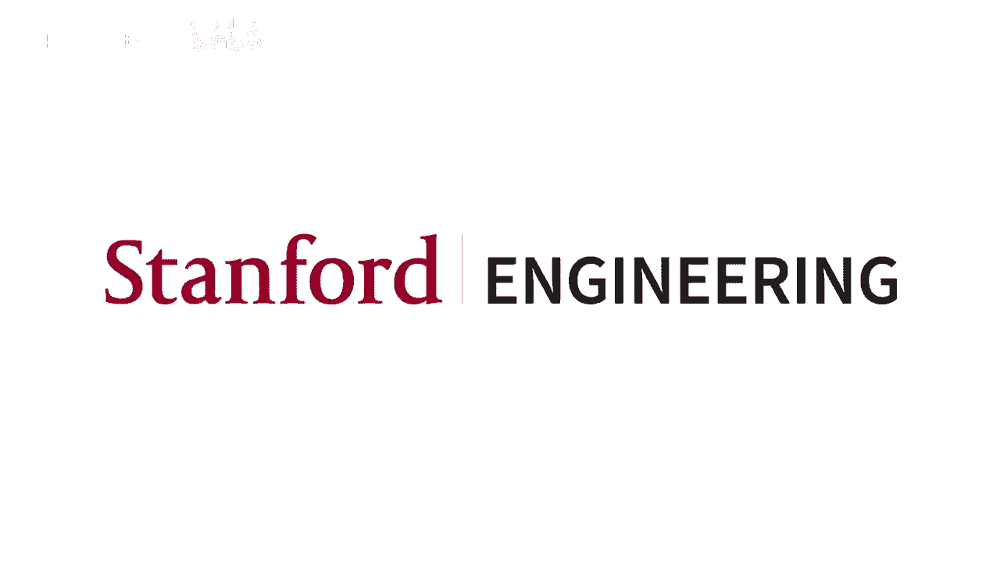
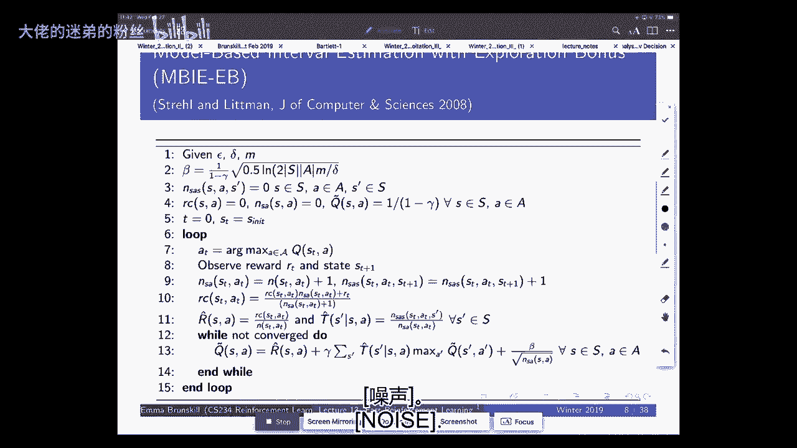
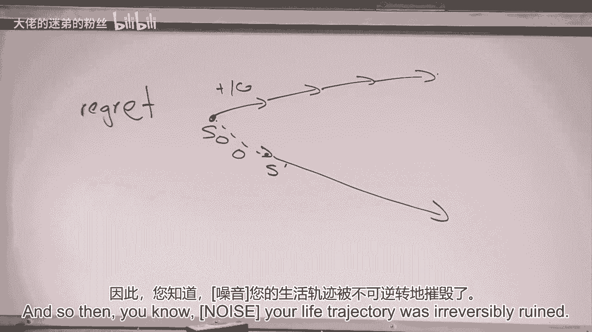
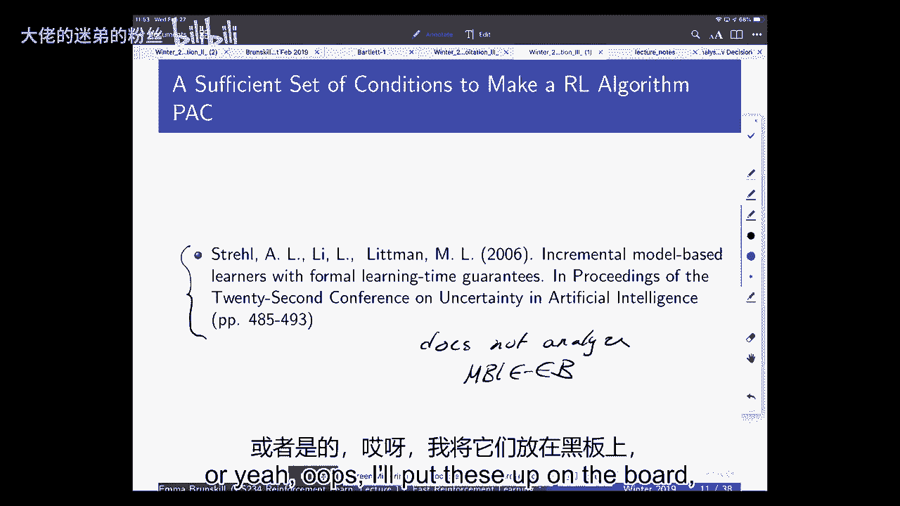
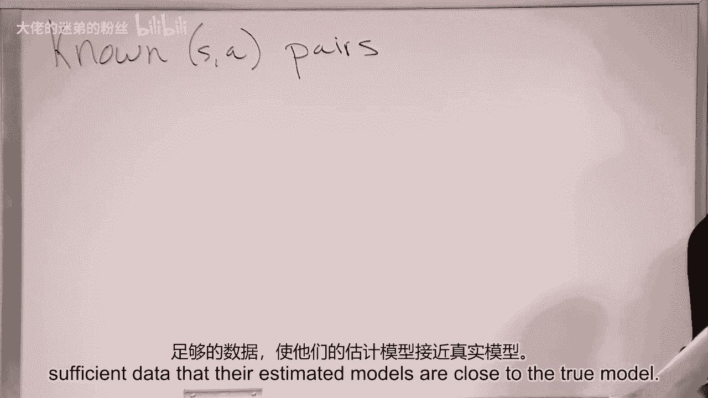
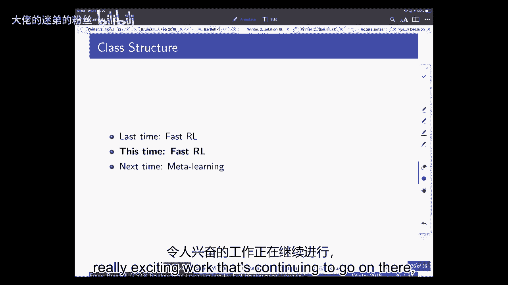

# P13：Lecture 13 - Fast Reinforcement Learning III - 大佬的迷弟的粉丝 - BV1Cc411h7QQ

所有的权利，我们要开始了，嗯，我想从一些关于物流的东西开始上课，也是为了解决广场上出现的一些问题，关于期中考试的成绩，嗯，有些人担心这对他们最后一堂课的成绩意味着什么。

回到过去比较期中考试的均值和分布是很有趣的，去年几乎一模一样，嗯，所以去年的平均值是百分之六十九，今年大约是71%，你会看到非常相似的分布，上面的那个是我们的或者知道下面的那个是我们的。

所以你可以看到这是2019，这是二八，所以看起来很相似的分布，嗯，我们不在课堂上做正式的曲线，如果有人超过90%，我一直在考虑，即使每个人都得到90%以上，这意味着这些人都足够了解这些材料，值得一个A。

然后如果我们真的有异常的分布有时我们会在下面弯曲，但只是为了给你一个感觉，嗯，去年，班上大约有42%的人得了a，所以对于那些关心你期中考试表现的人来说，关心你的期末成绩，是否还有可能在班上取得好成绩。

绝对是，所以说，那么我们对期中考试有什么问题吗？我知道我们收到了一些降级请求，我们正在尽快通过这些，任何，可能很好奇，但是有什么发行版吗，每个问题的cur，因为我觉得，比如说，对我来说。

我刚说完最后一个问题，我想知道我们是否有这些信息，我再和助教核实一下，我们没有理由不发布它，我想没有，嗯，我们在年级范围内给了我们所有问题的完整分布，所以我们可以释放很多人没有时间了，呃。

最后一道题绝对是最难的，所以这是我们看到最大变化的地方，所以这就是我们试图在标题上特别小心的地方，我们非常努力地确保，如果你在整个考试中都犯代数错误，那一文不值，我们专注于概念上的理解。

还有什么关于期中考试的问题吗？所以我只写下每个问题的分类，基本上当我们经历它的时候，我们试图研究任何方差很大的问题，然后再检查一遍以确保我们是公平的，哦，还有一件事，i是，我们将继续接受中期的降级请求。

到星期五，之后就会关闭，好的，那是期中考试，嗯，希望，这有助于平息班上一些人的担忧，我现在想提出的另一件事是小测验，小测验大约在两周后进行，不到两个星期，这是一种奇怪的格式，我们这样做是有原因的。

我认为在有大的期末项目的课堂上最大的紧张之一是，是要不要做一个大的期末项目和一个大的期末考试，我认为这对学生来说是一个很大的挑战，为什么期中考试后还要去上课？我你知道为什么，为什么你知道。

我们如何确保有理由了解这些材料，在课程的后半段，我们确实认为这是有价值的，尤其是经常报道最近更重要的话题，嗯，但如果不做一个高风险的大型考试，所以我和很多教学人员谈过，i，这里的教学中心叫VPTO。

我们想出的主意是做一个低赌注的测验，这个想法是很有趣，我从很多人那里听说这是真的，这就是它的设计，这个设计是，这将是一个两部分的测验，这是多项选择题，这一切都应该是关于，高层次的概念问题。

我们将发布去年的，所以大家可以看到一个例子，所以你的想法是把它分成两部分，你先单独做，大约需要4-5分钟，然后你会和随机的小组配对，你们要做一个联合测验，你的成绩就会组成，你的个人部分和你的团体部分。

但你只能在团队部分做得更好，所以如果你的团队做得更糟，那么你就会得到和你个人成绩一样的分数，所以我们这么做的原因是为了团队，那就是小考了，所以当你作为一个群体来决定答案时，你会刮掉答案。

关键是你应该能够清楚地说明为什么，你相信这些答案中的一些是真的还是假的，并说服你的同学，在这样做的过程中，这可能是一个非常有用的方式来思考，真正了解材料，也能听到其他人的观点，这就是最后一次测验的结果。

嗯，去年又来了，大家之前都有些担心，在广场上，人们很担心，有一些博弈论方面可以出现，嗯，我们精心设计了这个，所以它又是你成绩的一小部分，你只能在团队中做得比在个人身上做得更好，所以当我们这样做的时候。

它是经过仔细构建和经验的，有很多笑声，很多人似乎真的很喜欢这方面，我们考虑是否要在课堂的多个部分进行，但它是不同的，几乎没有人做过这样的考试，所以对此有什么问题吗，这大约是你成绩的百分之五。

我记得你之前说过，你们已经决定好队伍了，或者会决定，是啊，是啊，所以我们还没有决定问题是，团队是如何分配的，我们已经决定了吗？我们将通过随机分配来做到这一点，这也取决于，哪些SCPD学生在校园参加考试。

但我们会在几天前发布这个，你会被随机分配到一个团队，然后你就和那个团队坐在一起进行考试的那一部分，关于那件事你还有什么问题吗？我们将发布样品，它将涵盖整个课程，所以它的重量会更大。

从期中考试开始就发生了，但整个过程中的任何东西都将是游戏，这个想法是，那些在网上听课或看讲座的人，嗯，应该要为，你知道吗，在几个小时的时间里，然后为考试做好充分的准备，你还可以带一张备忘单。

就像你期中考试一样，在那里，还有什么问题吗，我觉得你可能提到过这个，但我只是不知道测验的哪一部分是个人的，与其他人，我们单独坐下来，然后在20分钟前和人们在一起，是呀，所以这个问题很好。

那么什么是个人团体的事情，所以这个想法是你进来，每个人都有考试，你在做那个考试吗？大概45分钟左右，你把它交上来，当你做完，然后当大家，当那个部分，课程结束了，大多数人很早就结束了，看情况。

然后你们作为一个小组得到一个新的考试，你做的考试和以前完全一样，但你们只需要共同商定答案，你把它刮下来，这样我们就可以看到它是多少，你要刮掉多少直到你得到正确的答案。

但本质上我们可以看看你是否在第一次得到了答案，或者花了不止一个，关于测验的其他问题吗，如果你对此有任何担忧，恰到好处，在广场上给我们发电子邮件，我只想简单地说一下，去年出现的问题之一是什么，嗯。

关注的是博弈论，所以你总是得到你的最高分和小组的最高分，所以人们说的很好，你应该做的是，你应该尽你所能回答，在你个人的部分，因为那是最值得的学分，然后在小组部分你应该，如果你在两个之间左右为难。

你应该让人们同意第二个答案，对冲你的赌注，你可以这样做，如果你想或尝试你或你的团队成员可以再次超过你，去年的团体部分约为5%，所以它很小，所以有这种可能性，你只会想这么做。

如果你真的在两个选择之间左右为难，嗯，一次又一次，只有一个正确答案，所以我认为我们在实践中观察到，几乎不需要对此进行博弈论分析，又不行了，我们总是欢迎听到人们如何解释这些事情，关于测验或物流的其他问题。

现在我们也是你们中大多数已经上交了项目里程碑的人，我们将在接下来的几天里给出反馈，对于那些没有执行默认操作的人，所有的权利，所以我之前把这个挂起来了，这是给所有以前没见过的人的，年级分布基本相同。

所以今天我们要做关于快速学习的最后一部分，嗯，这是一个非常大的话题，有大量的工作要做，嗯好吧，我们今天会多花点时间在上面，然后在星期一，切尔西·芬恩，谁是，呃，刚在伯克利完成博士学位。

她将在夏天加入这里的教职员工，我们会来谈谈元学习，这也是一个非常令人兴奋的领域，她会谈论强化学习的元学习，元学习与多任务或迁移学习任务有关，所以只是为了让我们对我们正在谈论的事情重新振作起来。

就这种快速学习而言，我们在考虑数据很重要的情况，所以像医疗保健、教育和顾客这样的事情，周一我在Pinterest上做了一个受邀演讲，他们肯定也关心这些类型的想法，嗯，我们一直在讨论两种不同的设置。

强盗与马尔可夫决策过程，以及正式理解算法是好还是快的框架，就它需要的数据量而言，我会在那里注意到，那个，在课程的这一部分，我们没有太多讨论计算复杂性，但也有类似的。

其中一些框架甚至可以很容易地扩展到讨论多项式样本复杂性，通常您可以将这些框架扩展到，还考虑了计算复杂性要求，好的，让我们继续研究马尔可夫决策过程，我们上次看到的是我们积累了关于土匪的专业知识。

到目前为止，我想了几个主要的方法，我们评估一个强盗算法是否好，以及实现这一目标的方法，所以我们谈到了数学上的遗憾，这就是我们能做得多好和我们做得多好之间的区别，《强盗》中的很多作品都集中在后悔上。

我们还讨论了两种不同的方法来实现低后悔，这是不确定性下的乐观，呃，然后是汤普森取样，所以试图成为贝叶斯，并明确地表示你认为可能发生的事情的后验，当你拉手臂或采取行动时，使用这种信息。

上次我们开始讨论马尔可夫决策过程，我认为非常相似的想法在这里很重要，但是这个问题在许多方面都更具挑战性，我们谈了一点，可能大致正确，所以我们特别讨论了一点基于模型的区间估计。

我提到的可能是一个大致正确的算法，所以只是为了提醒我们自己PAC是什么意思，你们中的一些人可能在机器学习中看到过这一点，所以可能。

可能近似正确的RL算法是一个给定输入epsilon和delta的算法，所以Epsilon会具体说明有多好，接近我们想要的最优，德尔塔会指定概率是多少，我们会希望这一切发生，嗯。

输入epsilon和delta为ON，它们是那个动作的q值，真正的最优Q值，大于或等于所有权利，唐娜是那个州最好的人选，至少一个减增量，今天我会对常数有一点松懈，有时这将是1-2三角洲。

有时前面可能会有一点恒定，有时前面可能会有一点恒定，我在这里放一个，所以你要记住这一点，那里可能有小常数，那些只是，他们可能是两四个，但重要的是，你非常接近最佳，除了可能有一个不变的因素。

其中n是多项式函数，状态空间的大小，操作空间的大小，gamma，一比一，呃，是呀，伟大，所以表情很好，这些是取决于Epsilon还是Delta，或者一个在epsilon上，或者一个在delta上，是呀。

在所有的表达中，他们最终会成为，一个在Epsilon上，一个在Delta上，所以你可以把这个和这个一样写，因为本质上n会更大，如果你想更准确，所以随着Epsilon变小，这将是。

你需要更多的数据才能更准确，如果你想更确定你会是准确的，你也要扩大三角洲的规模，我只想在我们继续之前，我想简单地对比一下遗憾，因为在强盗的背景下，我们大多想到后悔，但想想打包和后悔有什么区别是很好的。

尤其是在线学习，意思是，就像我们的算法在MDP中在线学习一样，它永远在学习，嗯，这就是后悔告诉你的，所以后悔是说后面足够大，你能看出后悔吗，好的，所以我们遗憾的是，假设我们从一个状态开始，It’零度。

后悔是说如果你从那时起做了最好的事情怎么办，就像你的生活会有多棒，所以如果你赢了，你知道吗，第一次涂色比赛，那你就可以去哈佛了，让你进入最高法院，喜欢它的神话般的，但如果你没有参加那个涂色比赛。

你却来到这里，所以你可以在那里得到一个加10，但你却得了零分，你去了一个不同的州，就MDP而言，你去了一个不同的州，现在你不是那个赢得涂色比赛的人，所以你知道你的人生轨迹被不可逆转地毁了。

在这种情况下评判你的标准不仅仅是动作，但是状态分布，你本可以在最优策略下，所以你总是被评判，我能到什么，如果从一开始我就做出了最佳的决定，我总是去参加那个涂色比赛，我总是去哈佛，你知道我从没去过斯坦福。

你上了最高法院，一旦你做出不同的决定，您可能最终处于不同的状态分布，但你要看看这些缝隙，所以你将根据你最终所在的州的分布来判断，你在那里得到的奖励与州分配的比较，你会在最佳政策下进入。

你在那里得到的回报，所以后悔在某些方面是一个相当苛刻的标准，因为它在说，你总是要被评判，就像，如果你做出了最佳的决定，永远，包装在某些方面要合理得多，Pake说我在国家分配下评判你，在你的算法下。

因为它说它会采取接近，最适合你所处的状态，那么PAC怎么说，PAC说，好的，你从这里开始，你没有参加涂色比赛，你去了那里，好的，那太糟糕了，考虑到你本可以，那你就知道，我不知道，参加下一次涂色比赛。

或者你没有，我将根据当地的差距来判断，我将永远只根据我的最优程度来判断，给定我在算法下得到的状态分布，所以包可以给有更小的遗憾或抱歉，小得多的那种，嗯，因为想象一下你有一个非常严厉的MDP。

你必须做出正确的第一步，然后你去了一个奇妙的地方，否则你总是在这个可怕的网格世界里辛劳，所以在这种情况下，如果你真的做出了正确的第一选择，后悔会把你比作，而PAC会说好，也许你做了一个糟糕的第一选择。

但就像你在为你所处的位置做最好的事情一样，你已经接近最佳状态了，考虑到这个糟糕的状态空间，你最终陷入了，所以在某些方面，你可以把包装看作是一种制造，你陷入的大多数情况，而遗憾总是从。

如果你从一开始就做出好的决定，那是个问题，是啊，是啊，每个人都请提醒我你们的名字，我知道我很努力，但我有时会忘记，是啊，是啊，所以TPS很好的问题，问题是，这是否扩展到插曲MDPS，嗯。

所以对DPS的一个比喻，只是为了回忆，那些是MDPS，其中我们为h步或有限步行动，然后我们在插曲MDPS中重置，后悔和打包更近了，因为通常情况下，这群人保证我们得到，那样的话，今天我不打算谈太多这些。

但将是关于起始状态，所以你会把v星看成零，相对于s的0的q星，你正在采取的行动，或者你遵循的政策，所以在这种情况下，他们开始更接近，因为你总是从开始的状态就被评判，你可以重置，但在网上。

比如强化学习的持续学习，它们可能会有很大的不同，因为状态分布可能是如此不同，是啊，是啊，你能再解释一下C1和C2是从哪里来的吗，因为我不认为他们是，如给定参数，哦是的。

我只是问了一些关于c1和c2的问题，我只是，我今天对常数很放松，大多数这种类型的后悔保证都是关于数量级的，就像n是s到6的函数，还是S对四的函数，我们通常不太担心常数，所以我把这些放在那里是想说。

一些不同的理论界在那里会有不同的常数，但今天我们要忽略这些，但为了让你知道那里可能有常数，这可能是一减二的德尔塔，比如说，而不是一减三角形，所有的权利，所以这是后悔和打包的区别之一，让我们回到这个算法。

现在我将突出显示，今天晚些时候我们会讲一下泛化，但我想经历一个，我们如何开始思考一个算法是否是PAC，我告诉过你这个算法是PAC，嗯，但我想谈谈为什么它被打包了，有没有一般类型的模板，我们可以用来展示。

一个算法是PA，我现在要讲的所有东西都涉及到表格设置，在那里我们可以把值函数写成表，稍后我们将讨论这些想法是如何扩展的，我们特别选择了这个算法，这就是所谓的奖励奖金算法。

所以我们这里有一个很好的小奖励奖金，因为现在扩展到模型自由情况会更容易，当我们看B的时候，我想强调的一件事是，如果我们回去刷新我们对此的记忆，我们要做的是计算最大似然估计。

或者也就是把经验估计的计数相加和除以，每个状态动作对的转换模型和奖励模型，所以我们看看我们在一个状态动作对中有多少次，我们过渡到哪个下一个状态，我们用它来建立一个经验模型，我们对奖励结构也做同样的事情。

然后我们想知道如何行动，我们采用那些经验模型，你可以想到这个运算符，好像我们在稍微改变我们的奖励模式，所以我把它放在这里作为经验奖励，加上这个奖金，你也可以把这看作是一个r hat素数。

相当于我们SA的帽子，加上这个奖金条款，所以你可以把这看作是定义一个新的MDP，有一个新的mdp，其中过渡模型是t hat，奖励模型是r hat Prime，也就是经验奖励加上这个奖金条款。

这不是真正的MDP，但那是一个MDP，我们可以求解并试着计算，这就是我们正在做的，在这里，我们构造了这种乐观的MDP，我们使用经验转换模型，然后我们使用一个奖励模型，它有很大的奖金，在我们不常去的地方。

我们很快就会看到关键的一点是，有多乐观，有大量的工作在做，试图让事情或多或少乐观，如果我们有时间，我将给你们看一些有关这个领域最近进展的其他幻灯片，好的，所以我们之前说过这个光束包，现在让我们来谈谈。

使某物包装的充分条件是什么，那么e b如何满足这些条件，所以我要讲的条件基本上是从这篇论文中推导出来的，稍加修改，那张纸没有，我就写在这里，不分析，m b，i，e，e，b，所以事情必须有点不同。

但从3万英尺的角度来看，这基本上是一个合理的方式来思考为什么，i，e，MIE B是一个包算法吗。

把这个插上，在黑板上这样做，因为我认为一次看到所有的东西是有帮助的，好的，那么什么是使某物包装的充分条件呢，我知道我发现这篇论文很有帮助，当我开始做包装校样在我的博士学位，那么什么是足够的，包装条件。

理论很美，但即使对那些对理论不感兴趣的人来说，我想看这个很有帮助，因为它给人一种直觉，关于您的算法需要具有哪些类型的属性才能高效，或者什么类型的属性足以使您的算法高效，好的，所以第一个又是乐观。

这不是唯一一套足够的条件，足够包装的东西，但这里有一套，所以这里有乐观，好的，乐观只是说计算出的价值使用，好的，所以这是为了这个是S T，这是一个T，所以这是我们计算的实际值，就像从VIE B。

我们计算的乐观值，所以这是你的算法的计算值，必须大于，或等于该状态作用对的真最佳值减去Epsilon，在所有的时间步上，所以它说每当我们做计算的时候，当我们采用我们的经验模型时，我们加上奖励奖金。

我们得挑一个奖励奖金，因此，无论我们为结果状态动作对计算什么，都是乐观的，减去所有时间步上的一些epsilon，所有这些都只需要在很高的概率下保持，但我会这样写出来，所以这是第一个条件。

第二个条件稍微微妙一点，但我稍后会说更多关于这方面的具体情况，所以第二件事是所谓的准确性，我先把准确度写下来，所以第一件事是你需要对所有的时间步骤保持乐观，第二件事是你需要准确，这意味着V T，这又是。

算法计算的是什么，你的算法会计算这个，这是我用你的乐观模型计算的需要是负的，一个奇怪的MDP的V pi t，我要告诉你那个奇怪的MDP是怎么回事，一秒钟，不是MDP，我只是说这是很好的乐观的MDP。

它不是真正的MDP，它是一个MDP，这有点在那些中间，RL中经常出现这种技巧，我们在那里建造了你见过的，可能在现在的几个证明中，在那里我们加减相同的项，介于两者之间，假设两个不同的马尔可夫决策过程。

我们要在这里玩一个类似的把戏，我们要构建一个MDP，这一半是乐观的，一半是像真正的MDP，这在现实世界中是不存在的，我们只是要把它作为我们分析的工具，所以我很快就会说这是什么，有不同的方法来定义这一点。

但它说一些与，你乐观的MDP和真正的MDP，你的价值，所以这是你实际执行的策略，步骤t计算的值必须接近，这种奇怪的混合MDP，在Epsilon内部，所以它必须离另一个MDP很近，而这样做的原因是。

这是我们将能够使用这个，试图约束我们离真正的MDP有多远，我们为什么需要这个，我们需要这个，因为乐观很容易坚持，只是把我们的价值观定得超高，从不更新，所以那很好，但你需要能够使用你所拥有的信息。

所以最终你会表现得接近最佳，所以如果事情真的很糟糕，你不想永远保持乐观，所以精度条件会说，如果我们有足够的关于一些状态动作对的信息，我们对其中一些的价值需要相当接近真实的价值，然后第三件事。

学习复杂度是有限的，好的，它有两个部分，这表示更新的总数，共计，所以在B中，我们将更新我们的状态操作值，我们会重新运行那种乐观的Q值迭代，我们这样做的总次数是有界的，次数也是如此。

我们拜访了一对不知名的夫妇，状态动作对，我会说更多那是什么，一秒钟，所以我们要对所有状态作用对进行分类，我们在表格设置中，所以我们这样做是合理的，我们最终会把每一个状态动作对分类为，已知或未知。

我们要说，我们访问未知状态动作对的总次数，这两个都必须是有界的，是ε和δ的函数，因此，这意味着您不能进行无限次队列更新，你不能无限次地访问未知状态动作对，就像你的算法，不能，这些是算法上的条件。

所以如果你能满足所有这些，那么你的算法是一个包，所以如果有一个，你就是爱普西隆，埃普西隆目，最优，但我会把这个写在这里，就这样，你可以感觉到这些类型的边界是什么样子的，在除N以外的所有人身上。

等于命令这个警报，这种有界样本复杂度除以Epsilon次数，一负伽马，平方乘以，一些日志术语，所以本质上这是说，如果你能乐观，对于一些奇怪的MDP来说是准确的，我还没告诉你，如果队列更新的总数。

以及访问未知状态操作对的次数，这是我经常没有告诉你的，我们如何定义如果它是有界的，那你就要打包了，你会在所有的时间步上接近最佳，除了一个作为此函数缩放的数字，这通常也是状态空间和作用空间大小的函数。

这也是，和Epsilon和一个减去Delta，所以这是一个模板，所以如果你能证明你的算法满足这些属性，然后你就可以证明它是体育，首先我们要证明的是贝埃布很乐观，是啊，是啊，问题，所以第一个问题是。

对于三个部分，第一部分和第二部分，它们都有相同的界限只是两个不同的界限，询问，你是说，那里的Epsilon，电脑啊好问题，所以第三部分是Q更新的总数，我们访问状态操作对的次数，嗯。

他们将是非常密切的关系，基本上，无论何时访问状态操作对，然后可以进行队列更新，我想做得更好，听起来是一样的，是呀，是啊，是啊，好问题，所以这就是我以为你在第一和第二问，问题是Epsilon，同样的是。

他们是一样的epsilon是一样的通过一个，二和三，所以如果你在设计你的算法，一、二、三都必须是相同的常数，可能没关系，可以，你知道的，做一只老鼠，在其中一些情况下。

你可以在epsilon前面有一个常数，一个人只需要小心一点，所以在这里，我们就把它们像同样的epsilon一样放在任何地方，好的，所以让我们先谈谈为什么，我E B很乐观，嗯，我们能把这个挂起来吗。

拜托了，我想那样会更好，所以我要重新公布nvie的奖金条款，这样你就可以看到那是什么样子，好的，所以我想这将在一秒钟内上升，然后提醒我们基勒的更新是为了什么，所以我们在B中所做的是，我们有一对州行动对。

我们对国家行动对有经验奖励，加上我们的奖金贝塔除以国安局的平方根，后面不要太小，还是可以，好的，好的，伟大的嗯，我看到至少有一个人在点头，所以这是我们乐观的奖励，你可以把这个叫做R tilde。

这是我们乐观的回报，加和除以s质数，这是我们的经验过渡模型，s质数给定s最大值在s质数的q波浪数的质数上，素数，所以这将是一个备份，我们可以这样做，这就像一个行李员备份。

我们乐观的奖励奖金只是为了提醒自己，β{\displaystyle\beta}将被定义为1/1-γ{\displaystyle 1/1-\gamma}，半对数到s a m的平方根除以delta。

在这种情况下，我们想要展示的，我们不必考虑已知或未知的状态作用对，然而我们想表明这个值，当我们计算，它是真Q星的上界，直到Epsilon，所以我们希望能够展示第一个乐观的条件，我们现在想争论的是什么。

测试版足够大作为奖励，当我们做这个手术的时候，我们会很乐观，所以让我们穿过这里，那么我们如何证明，让我们考虑一个特定的状态动作对，所以让我们考虑一个状态动作对，所以是一个，让我们想想，我们参观了它几次。

小于，所以在我们的算法中，我们只会更新我们的经验估计，直到我们有M个样本，帽子和T，之后呢，我们要扔掉我们的数据，这就像说第一次你访问这个特定的状态动作对，你可以用这些数据来计算一个经验模型。

用它来计算一个经验模型，在你有M计数之前，但之后你就再也不更新了，我就放一个旁注在里面，也就是，嗯，你可能会想为什么，我们为什么要这样做，特别是，呃，对整个机器学习领域有一个非常可爱的描述，作者：

汤姆·米切尔，他是机器学习的真正创始人之一，他在那里争论，机器学习的整个学科，重点是看看代理如何学习的基础，我们设计的算法随着更多的数据而不断改进，这在某种程度上违反了这一点，因为这是说。

即使你得到10万亿个状态作用对的例子，这肯定会让你的实证模型更好，我们要把所有的数据都扔掉，只是为了让你了解我们为什么这么做，或者为什么早期的分析会这样做，我们在大概率范围内这样做。

这个想法是大概率界限会起作用，就像我们看到的强盗们做出了某种自信的上限，和一种保证，我们的估计说过渡模型接近真实值，这些界限都很有可能成立，所以这里有谁在不同的事情上看到了联盟的界限，好的，几个人。

但大多数人，不是这样的联盟界限，是一种确保如果你有许多不同的事件，所有这些都很有可能成立，这些事件的总和都有很大的可能性，这就是为什么这里我们只使用有限数量的数据，从理智上讲，这是完全不令人满意的。

因为您显然应该能够使用更多的数据，您的算法应该在使用更多数据时做得更好，根据经验，我们使用所有的数据，嗯，在过去的几年里，我觉得有一件事很令人满意，是为了拉蒂莫尔，谁结束了。

他是我们推荐的强盗书的作者之一，嗯，我们展示了您可以删除此限制，你不能永远继续使用数据，通过使用比联合边界更聪明的东西，但不管怎样，今天我们要，我们要这么做，所以我们只能用最多的样品。

让我们考虑s a的n小于，或等于m，好的，所以我们有多达M个样本，但总的来说，你知道它可能是一个，它可能是某个小于m的数字，这是一个我们还没有指定的常数，所以我们要看的是这个状态动作对。

我们要看看州行动对的所有经历，i加上s i的γv星，这应该很像什么，我们的目标，TD学习嗯，这是说我们第n次得到的奖励，我们取样了S和A，以及我们在第n次到达的下一个州，我们取样了，所以这是我去一个。

这是旁边的下一个状态，对，所以我们可以定义这个，所以你可以想到，每一个都会有一个对真实的期望，S A的Q星，因为我刚刚定义了这个，我们不必知道V星是对的，现在我们只是在分析这些样本会发生什么。

所以如果我们把我们的样本定义为真正的奖励，我们看到，我们平均看到的真正的下一个州，这真的只是S A的Q星，所以如果这是S的Q星，我们可以考虑我们需要多少样品，直到我们有一个很好的近似Q星s a。

或者我们的平均水平能比平均水平高出多远，x大小与q星的实际经验平均值，我们可以使用停机位或其他类型的偏差边界来做到这一点，有点像我们看到的强盗，所以对于土匪我们看了一下如果你有超过奖励的分配。

如果你有有限数量的样本，离真正的平均回报还有多远，同样，在这里我们要说，如果下一个状态的样本有限，收到的奖励我们离真正的Q星还有多远，在这种情况下，这里有一些技术细节，因为一个人必须小心一点，事实上。

我们收集的数据取决于历史，所以从这个意义上说，这也是马尔可夫决策过程中更具挑战性的事情之一，或者特别是马尔可夫决策过程，因为你收集的数据取决于你的算法，所以你会得到更多的州行动对样本，你认为会很好。

你认为你会变坏的状态动作对的样本更少，所以有耦合，数据不是真的，嗯，在整个分布中，但有时取决于我们为状态动作对取样的事实，下一个状态和奖励，或身份证，因为它是马尔科夫，所以我只是想说。

我们在这里要小心一点，但我们基本上可以用主机之类的东西来说明，s a/n的q星，It’s a sum over i，我就是我们在上面定义的，大于或等于NSA平方根的概率，小于等于指数-2的平方。

1-伽马平方，这是使用像停机位或类似类型的偏差不等式，你也可以使用那些依赖于鞅的，以前见过一些，不管，这基本上让我们可以说，当你为这个特定的状态动作对获得越来越多的样本时，你离最佳状态还有多远。

如果你知道B星，现在，我们知道什么是贝塔，我把它放在那里，所以如果我们把贝塔插入这里，所以如果你把beta代入beta n的实际值，你懂的，这将等于delta，被状态空间的两边分割，动作空间的大小，m。

所以它只是说，当你有更多的样本时，这个数字很有可能，你远离真正的Q星的概率很小，所有权利，所以我们可以把这个结果代入，我们可以说这意味着如果我们看看联盟，穿过这口井，我再写一件事。

如果你说1除以n等于和除以，那是什么，这实际上只是我们在上面的等式，所以它很像，这是你的经验回报，That’几乎就是那个等式，除了你这里有V星，所以这看起来应该和那个Q蒂尔德很相似，在上面。

我们使用经验奖励，在经验的转变中，不同的是这里我们用的是Q星，在上面我们用Q蒂尔德，所有的权利，这意味着如果你有很多样本，然后你可以绑定我们正在做的事情之间的差异，这个东西和Q星。

所以让我们来做我们的帽子，s，a，plus，gamma，and，over，s，prime，Transition，经验跃迁模型s a s素数减去q星的v星，s a大于或等于-beta除以平方根和申论。

这将适用于所有的T和A，对呀，所以我们用了停顿，现在我们可以把经验奖励联系起来，经验过渡模型，如果有人给了我们Q星的最优Q，现在我们要做的是把这个和，我们是这里的等式，所以我就，对呀。

这是一个这样的方程，上面的一个是我们在B中实际做的，我们一遍又一遍地这样做，直到它收敛，所以我们采用我们的经验过渡模型，我们采用我们的实证奖励模型，我们加上这个奖金，我们做价值迭代，直到我们收敛。

我们现在要做的是比较这个数量，与Q星的关系，我们想证明上面的数量会大于，或等于Q星，所以我们要通过归纳法来做到这一点，我想我会，大家可以看到，所以证明是通过归纳法，所以我们要做的是我们要得到Q蒂尔德。

s a的i是值迭代的第i次迭代，所以这是使用方程一，一级方程式在上面，我们让i的v{\displaystyle v}等于一个值，“如果我们采取最大的行动，每个状态和动作对都可以，我们要假设的是。

我们乐观地初始化，我们将初始化一个，等于1/1减去伽马，从定义上来说，它比Q星大，至少和Q星一样好，这就是我们的基本情况，再次，那是什么我们要做什么，我们试图在这里对B表示乐观，我们想说。

如果我们用AB做这个手术，我们会很乐观，我们要用归纳法做一个证明，这是基本情况，所以我们开始，我们乐观地初始化我们的Q蒂尔德，现在我们假设这成立，所以我们要假设，就要，我们假设s a的q i大于等于q。

上一个时间步的S a星，好的，所以我们会有一些好的，所以让我们写出什么，气加一等于q波，i加1等于，将等于我们的经验奖励，加伽马和除以S素数或经验跃迁模型，s质数加贝塔除以平方根n s a。

那和方程一一样，所以现在我们要说这个，根据定义，将大于，或者等于s a加γ和除以s素数的r，我们的经验跃迁模型乘以真V星，因为这是我们的归纳推理假设，我们假设这保持在前一个时间点。

好的加贝塔除以平方根NSA，这是通过归纳假设，我们假设我们知道我们有一个基本情况，我们将假设这在上一次迭代中保持不变，然后我们需要的最后一部分是如果我们把这一部分，我们看这一部分和这一部分，好的。

所以如果你重新排列这个方程，然后你可以看到s a的r加上所有这些东西都大于，或等于S a正负β的Q星，这意味着如果我们把后面的东西换成，我们可以说这等于q星的平方根上的负β，一篇文章加贝塔平方。

一篇短文，她叫Q星，所以现在我们表现出了乐观，所以在这种情况下，关键的想法是说我们知道我们正在得到，我们将把这与会发生的事情联系起来，如果我们有真正的Q星，我们会证明。

如果我们在下一个时间步骤中知道真正的Q星，然后再往上走一步，我们可以绑多远，就我们的功能而言，我们将来自Q星，然后我们可以做一个归纳炒作，归纳证明，来表明如果我们在前一个时间步上是乐观的。

我们总是可以确保在一开始就举行，因为我们使用了乐观初始化，那么我们将继续对所有的，得到的Q Q帽子Q星，所以这证明了乐观，我对那个证据有任何疑问，这就是乐观的证明，另一个关键部位。

其他部分我就不说得那么详细了，但我会在高层简短地谈论它，另一个真正重要的部分是准确性，我是说有界，3。我会把这件事保持下去，以防不时之需，一个来写，准确性真的很重要，嗯。

你最终会变得准确的事实是很重要的，所以这部分的直觉是，嗯，你可以想定义，一对不同的夫妇，你可以把事物定义为已知或未知，想让我继续这样，还是大家都写完了，喜欢的请举手，所以在很多呃。

有限状态和动作对的打包证明，有麻木的概念，那么这意味着什么呢，已知状态，动作对，直觉上已知的状态作用对将是对，我们有足够的数据，他们的估计模型接近真实模型。

所以这里的直觉，s a的t帽s质数给定s a，如此直观，如果您获得越来越多的特定状态操作对的数据，我们知道从停下来，等你估计的均值会收敛到真实均值，你的转换模型也会收敛到真正的转换模型。

我们在这里做的是，我们在沙地上划清界限，我们在说什么时候，我们什么时候有足够的数据来进行状态操作对，我们对我们的经验估计感到满意，在那里我们可以约束我们的经验估计与真实模型有多接近，如果事情足够接近。

那么我们就知道使用这些可以让我们计算出一个近乎最优的策略，所以如果一切都知道了，如果所有的文章对都知道，那么我们就可以证明，在你的经验模型下，圆周率星的v，我把它叫做帽子，这就像你的经验模型，负Vπ星。

我会把这个放在你的经验模型下，真实模型视图，嗯，这是有界的，我把所有的细节都过了一遍，所以你在期中考试中看到了一点，这通常被称为模拟引理，如果事情很接近，就像如果你的模特很亲密。

您的转换模型接近真正的转换模型，你的奖励模型接近真正的奖励模型，那么如果你用这些来计算一个值函数，你的值函数也很接近，这是一个非常酷的想法，它基本上是在说，你可以把你的经验模型中的错误传播到。

在值函数中得到的错误，你在政策中得到的错误，所以你可以传播错误，你可以去宣传道具，所以这是一个非常好的主意，你可以说，如果你有很好的预测误差，那么您最终可能会出现小的控制错误。

已知的状态作用对只是提供了一种量化的方法，你知不知道，你需要达到什么水平才能足够好，你需要的足够好将取决于，你想要的Epsilon是什么，所以一个非常重要的想法是思考这些已知的状态作用对。

以及它们允许我们在定义一些替代的MDPS方面做什么，所以在这种情况下，我会抹去这个，只是让你知道，所以你知道证明的一些部分，嗯会往前走，我就不一一细说了，但我很高兴谈论这件事，离线。

我们可以定义另外两种MDPS，我们可以称一个等于，它是一个MDP，所以它的转变和它的奖励动态，它的动力和奖励模式与真实的，所以这些是我们开始定义这些有点奇怪的MDPS的地方。

所以这是一个不完全是我们梅蒂尔德模型的模型，我们在方程中用来做的，我们有这样的奖励和奖金，加上我们的经验过渡模型，它不完全是真正的模型，它在说已知的事情，我们将再次使用现实世界的模型。

我们不知道这些是什么，这些只是分析工具，然后在未知的状态动作对上，我们将使用这个乐观模型定义一个MDP，这很有用的原因是，我们最终可以用它来帮助找出，我们的MDP与真正的MDP有什么关系。

在已知的状态动作对上，这是我们最终使用的一个MDP，然后另一个是相似的，也就是m帽素数，这是一个等于M帽的MDP，所以这只是，在K上，在所有其他方面都等于梅蒂尔德，所以在已知的集合上。

所以这是一个MDP，对于已知的集合，我们使用我们的经验估计，不真实的真实作为不真实的模型，然后我们在所有其他的上面使用m tilde，所以我们的想法是我们可以使用这些不同形式的MDPS。

我们可以量化我们通过计算得到的值有多远，用我们的Q蒂尔德对其他这些的值，我们可以用它来，基本上，做一系列的不等式，关联我们通过执行策略获得的值，相对于我们在现实世界中得到的价值和最优策略。

所以这些是让我们帮助证明准确性的工具，在状态作用对上，我们知道的是m hat和m tora，我的帽子是什么，以下是经验估计，如，如果你只使用奖励的计数和计数，过渡模式，M tilde是经验估计加上奖金。

所以过渡模型和这两种情况是相同的，但这一个会有奖励奖金，如此直观，这让我们可以帮助量化准确性，嗯，最后一件事，我想我只想简短地提一下，这些类型的证明是如何工作的，我们需要这种有限的学习复杂性。

我们需要确保我们不会不断更新我们的Q函数，我们不会不断地遇到未知的状态动作对，所以最后一部分是，你知道，我们怎么证明三个，它是有界的，和，对此的直觉有点像，乐观主义的普遍直觉，所以乐观的直觉是说。

如果你认为这个世界很棒，要么这个世界很棒，在这种情况下，你对PAC的后悔率很低，这意味着如果你假设这个世界很棒，它真的很棒，那就像不犯错误一样，这就像挑选真正的，你选择的动作是好的。

这样你就不会遭受比Epsilon更糟糕的决定，然后我们想说，你不犯错误的时代，或者你犯错的地方，你选择了一个糟糕的动作，小于ε闭有界，这就是为什么，这里的关键思想是鸽子洞原理，所以这个想法是。

如果你想到你自己，不必有偶发的MDPS，但如果你有，嗯，你可以考虑把你的经验流分成几集，在每一集里，你可以想一想，很可能你会遇到一个未知的状态动作对，所以你考虑我们到达未知状态作用对的概率是多少。

记住一个未知的状态动作对，这里有一个我们没有像这样的好模型，我们只去过一次，那么有什么问题呢，我们将在T步到达一个未知的状态动作对，所以在这种情况下，我们可以展示的是，如果这很低，这个很小，小。

如果概率很小，我们正在接近准确，我们正接近最佳状态，所以如果可能性很小，你会到达任何未知的地方，我们可以证明在已知的状态作用对上，你已经接近最佳状态了，所以如果你不太可能到达任何你有坏模型的地方。

你将接近最佳，如果它很大，这种事不会发生太多次，所以如果它很大，你就去参观它，不会发生太多次，因为如果这个很大，这意味着你真的很可能到达一个未知的状态动作对，记得我说过，对于每一个州行动对。

你最多只更新了M次，所以根据鸽子洞原理，这种概率不能持续太久，本质上，你会有一个函数，就像状态的数量，动作的数量和m比那个大，但这是说你需要能够访问每个状态操作对，这样我们就结束了，时代的束缚在这里。

我们会犯错误，我们可能会到达未知的东西，我们可能需要更多的步骤，一路上我们可能会做出一些糟糕的决定，但本质上，对于每个状态动作对的m步，事情只能是未知的，这意味着我们在这里的概率必须是有界的。

所以最终一切都必须被知道，或者你必须表现得接近最佳，这让我们可以证明东西有一个东西是打包的，它已经结界了，我们会做出有限数量的错误决定，所以要么我们不会到达国家行动空间的任何部分，这是未知的。

所以我们所能到达的一切，我们有他们的好模型，我们正在利用它们做出好的决定，或者我们正在到达的东西，在这种情况下，我们得到的信息，因为我们对生活有了新的观察，在那个状态动作对中，我们只能得到一些东西。

在我们得到M计数之前，这些东西只能继续是未知的，你介意把那东西再放下吗？这给了我们一个关于电动汽车为什么是包的概述，以及为什么，你做的很多证明都是打包的，我认为这其中的关键思想真的是，乐观和准确的概念。

和取得进步的能力，不被卡住的能力，总是通过以足够快的速度减小这些置信区间来游荡，好的，所以现在让我们回到忙碌中，所以这就结束了，一段时间的MVP部分，最近在这一领域有许多令人兴奋的工作。

我想让我看看我能不能很快地把这个提起来，嗯，这是一个演示文稿，关于我们共同的一些工作，只是为了突出这里，嗯，在包装和遗憾分析方面，在获得更好的方法方面取得了很大进展，嗯，所以在过去的几年里，嗯。

我的研究生的手段，其他一些非常好的团体在这方面做了很多工作，我们现在也在努力进行分析，这取决于问题，这意味着如果算法有更多的结构，那么我们应该需要更少的数据来学习做出好的决定，所以现在让我们做贝叶斯。

看看贝叶斯如何帮助我们，所以我们看到了贝叶斯强盗和贝叶斯强盗，我们说过，我们假设我们有一些参数知识，关于奖励是如何分配的，所以我们要考虑奖励的后验分布，我们将用它来指导探索。

我们特别讨论了概率匹配的概念，也就是说，我们希望选择具有最优概率的动作，事实证明，汤普森采样让我们做到了这一点，所以在这种方法中，如果我们有共轭前科就很有帮助了，这使得我们能够分析计算。

手臂奖励上的后部，根据我们观察到的数据，和我们之前关于那只手臂不同奖励的概率的先验，所以我们看到了一个例子，伯努利，这意味着奖励只是零一，和贝塔分布，贝塔分布是一个我们可以认为阿尔法是计数的分布。

我们看到加一的次数，贝塔是我们看到手臂为零的次数，当我们观察到其中一个或任何一个结果时，然后我们只需更新我们的测试版，所以这让我们可以定义汤普森为强盗取样，就是这个算法，我们说在每一个时间步骤。

我们首先为每个不同的手臂取样一个特定的奖励，然后我们可以尝试奖励分配，我们计算对这些奖励分配的期望，我们采取相应的行动，所以我们在脚趾的例子中看到了这个，我们看到我们会尝试不同的奖励，然后用这些来行动。

至少在那个例子中，我们看到我们开发的速度比我们看到的要快得多，采用上置信限方法，所以在MDPS的情况下也可以做类似的事情，所以现在对于基于RL的模型来说是贝叶斯的，我们将在MDP模型上进行分布。

所以这里有什么不同，这意味着我们将有两个过渡，和奖励，所以我们要得到的奖励应该看起来很像强盗，所以奖励和土匪很相似，你也可以使用测试版，如果你的奖励分配是零一，你也可以用贝塔斯和伯努利斯。

所以这和土匪很像，T有点不同，我们不打算过多讨论您可以使用的不同发行版，但是，比如说，如果我们在表格域中，不可能是多项式，多项式的共轭先验是一个适当的，共轭，所以如果你想你的转换模型是多项式的。

这是所有其他状态和动作的概率，那么共轭先验是derlay，它有一个非常好的直觉，嗯，类似于beta中的beta的描述，你可以把这看作是你观察到的次数，一或零，如果你看一个德利。

你可以把这看作是你到达下一个州的次数，所以是一是二是三是四，所以说，Derschley分布将由向量参数化，对于每个州中的一个，再一次我们可以用这种后部来更新它让我们可以进行探索，所以在这种情况下。

我们将从后部取样，然后解决它，所以如果我们看看算法是什么样子的，它看起来很像汤普森为强盗取样，除了现在我们要开始，我们必须定义一个优先于动态和奖励模型，对于每一个状态动作对，请注意，这是表格。

我们假设我们有一个有限的S和一个，所以我们可以把这个写下来，我们可以写下我们的，我们对每一个状态动作对都有一个分布，对于动态和奖励模型，然后发生的事情是，你从这些分布中取样一个mdp。

所以对于每一个状态动作对，你对一个动态模型和一个奖励模型进行了采样，现在你有了一个MDP，所以一旦你有了MDP，你为它计算最佳值，所以这显然比我们对强盗的计算更密集，但这肯定是一件合理的事情。

然后你对你拥有的Q星采取最佳行动，对于采样的MDP，所以这被称为MDPS的汤普森采样，它还实现了概率匹配，根据经验，它通常可以做得很好，就像汤普森采样在土匪中做得很好一样，所以我想这可能就是我要说的。

MDPS的汤普森采样，在这方面有许多不同的作品，只是为了强调一些在这方面做得很好的人，来自斯坦福·本·范，罗伊·罗伊的团队在这方面做了很多工作，有时他们称之为后验采样，所以人们喜欢他以前的一些学生。

就像丹·卢梭和伊恩·奥斯本，伊恩现在在DeepMind，丹卢梭现在在纽约大学，他们在这些类型的空间里做了一些非常好的工作，把这个像人一样推广到颠簸，是呀，大问题。

所以问题是我们是否可以将其推广到非表格DPS，是呀，我一会儿再谈这个，但有点差，但是是的，这就是目标，任何人都有关于有限状态和动作场景的其他问题，现在我们来谈谈泛化，所有的权利，所以说，当然啦。

我刚才说的都是关于有限状态和作用空间的，这不是很令人满意，因为如果我们考虑这些类型的边界，嗯，我说这是状态和作用空间大小的多项式，如果s是无限的呢，所以我们可以犯无限多的错误，这似乎有点不幸，嗯。

所以不清楚这个最初的呃，框架是，都有帮助吗，当您的状态空间无限或非常大时，就像像素的空间，所以即使这个框架真的很好，呃，我们希望能够将这些类型的想法推广开来，但我们想知道如何。

如何以一种现在可以实用的方式使用它们，当我们开始，所以说，这是目前研究非常活跃的领域，在过去的几年里，对此有很多不同的想法，我想强调的是，在理论方面，我们还有很长的路要走，当我们谈到一些函数逼近时。

甚至只是函数逼近和做控制，比如非策略控制，比如Q学习，我们说过，那个，我们没有很好的渐近保证，对于一些基本的算法，所以如果我们甚至没有很好的渐近保证，我们不太可能有真正好的有限。

这些通常被称为有限样本保证，因为他们保证，你要犯的错误的数量是有限的，所以我们的理论相对较少，在这种情况下，这是我的团队正在努力的事情，还有其他几个小组也在积极研究这个问题，但仍有许多工作要做。

但最近有一些非常好的实证结果，所以让我们先想想概括和乐观，喜欢不确定性下的乐观，我们现在在一个非常非常大的状态空间中，所以让我们想想如果所有东西都非常大，可能需要修改什么，如果我们回到这个算法。

首先我们有这个，这些计数，我们正在跟踪每一个状态动作对，计数是多少，所以这不会扩大规模，因为如果您处于状态空间是像素的场景中，你可能再也看不到同一组像素了，有没有人知道如何将它扩展到深度学习环境中。

就像我们想要的，在这种情况下，是一种量化我们不确定性的方法，我们对某种状态和行动的不确定性，嗯，但我们不想根据原始计数来做，因为那样一切都会合二为一，永远，我可以用某种形式的东西。

所以建议是我们是否可以做某种形式的VFA，比如说，嗯是的，我们可以想象尝试使用某种形式的密度模型，或者某种方式，试图估计我们看到了多少相关的信息，或者我们在这个地区看到了多少相关的州。

比如能够喜欢所有这些东西，变成某种小的，是啊，是啊，所以建议绝对使用某种嵌入，所以你可以在这里做的另一件事，也是对状态空间进行某种形式的压缩，其中一个挑战是正确的。

状态空间中的压缩取决于您想要做出的决定，所以一般来说，它是不静止的，这不一定是坏的，你可能只想在这些之间来回，所以这些想法很棒，一般来说，我们想要一些量化不确定性的方法。

这将不得不概括并说类似的附近状态，如果我们经常访问世界上的那个地区，那么在乐观方面我们应该得到更少的奖励，正如我所说，这些s a和s a s素数的计数是没有用的，如果我们只遇到一次，嗯。

我想强调的另一件事是我之前谈到的方法，真的是基于模型的，那里的很多工作都是基于模型的，相比之下，在过去的一年里，它最近开始改变的事情要少得多，但总的来说，基于模型的工作要少得多，基于RL的深度学习方法。

我想这是因为模型是免费的，策略搜索技术通常要好得多，部分，因为你在模型中犯的错误积累了很多，就像你计划的那样，所以我一直记得，大卫·西尔弗第一次谈到这个，或者他最早关于这个的谈话之一。

从2014年开始他展示了这个美丽的模型，嗯，一个对计划来说很可怕的模拟，所以错误必须非常好，呃，错误必须非常小，不清楚你通过最大化获得的代表性，对于预测性损失总是最好的规划。

所以我们真的希望能够把我们以前看到的想法，对于像B这样的东西，并将它们转换为无模型方法，并思考一些方法来编码深度神经网络设置中的不确定性，所以让我们考虑做一些像Q学习这样的事情，像DQ学习。

在这种情况下，所以我在这里有点松散，你可以，这可能是一个目标，所以说，可以解决这个问题，但是想想一般的Q学习和队列目标，嗯，其中我们使用当前函数近似的最大值，或者我们使用当前目标函数逼近的最大值。

所以从AB中获得灵感的一个想法是简单地包括一个奖金条款，所以这可能是，你知道一个固定的目标，但这里的想法是，当你更新参数时，只要给那个特定的州行动对加上一个奖金条款，当你在做Q学习更新的时候。

或者当你在调整体重的时候，当然我们得知道Q奖金是多少，但这将有助于规划方面，所以现在我们在模型自由的环境中，模型自由设置，所以我们可以，当我们在做Q学习更新的时候，让我们加上一个奖金条款。

这就是为什么我选择VIE B是之前向你们展示的算法，因为，我认为这种奖励奖金更容易扩展到，现在的模型自由箱，当然问题是奖励奖金应该是多少，嗯，它必须反映出未来回报的某种不确定性，从那个状态动作对。

有很多不同的方法试图在这方面取得进展，所以马克，贝勒梅尔姆，一些后续论文考虑建立一个密度模型，试图显式估计您访问的状态或状态操作对上的密度模型，嗯，其他人做了一些基于哈希的方法。

这在某种程度上更类似于嵌入，尝试散列状态空间，然后在哈希状态空间上使用这些使用计数，然后随时间更新哈希函数，这是伯克利的一些工作，所以有不同的方法来量化这一点，我想在这里强调的另一件事。

这些奖金条款通常是在访问时计算的，当我们看Viab的时候，您可以稍后重新计算这些，所以如果你，如果你在情节重播缓冲区中存储东西，您可能希望随着时间的推移更新这些，因为那些国家行动。

如果您稍后从重播缓冲区中对奖励下一个状态对进行采样，你可能想改变奖金条款，所以有许多不同的微妙之处，当我们试图把这个带到深度学习中时，有一些非常令人鼓舞的进展，嗯，所以让我这样，在这种情况下。

我们可以看到的是马克·贝拉米小组的初步工作，嗯，我们比较蒙特祖马的复仇，这被认为是最难的雅达利游戏之一，使用E贪婪的标准DQN代理的进展，在蒙特祖玛的复仇中有许多不同的房间，在这种情况下。

你可以看到五千万帧后，嗯，它做得非常糟糕，它只穿过了两个房间，然而，如果你使用这种探索奖金，这个做得好多了，所以战略性的更好，所以我认为这凸显了进行这种战略探索的经验意义。

让我们简单地考虑一下汤普森取样，所以在这种情况下，我们几年前做的一个想法，就是说，你可以在你的表示和模型的参数上做汤普森采样，我这么说是什么意思，我的意思是如果你有一个非常大的状态空间。

你可以想象折叠你的状态，做一个动态的状态聚合，对可能的状态聚合进行采样，作为一种在状态空间中折叠的方式，和汤普森抽样可以扩展到表征上的抽样，所以效果很好，但它没有完全扩大规模，当你想真正扩大规模的时候。

如果你想成为一个免费的模特，这和我们以前看到的有点不同，因为在我们看到基于模型的方法之前，现在我们想从可能的Q星的后部取样，不清楚如何写下来，我不认为我们在这方面取得了很好的进展，即使在表格设置中。

但这就是我们正在努力做的，人们试图为深度学习环境做的事情，有几种不同的主要方法，一个是伊恩·奥斯蒙德的，他在这里攻读博士学位，他们确实引导了DQN，这里的想法是，您可以对示例使用引导。

您可以构建许多不同的代理，所以现在你有了c q值，而不仅仅是一个q值，然后你可以乐观地对待这个集合，它不是非常有效，它给你一些性能提升，我们做的另一件事，呃，我们有点我们，所以我以前工作的人。

我参与了这个的早期版本之一，从那以后，他们一直在继续推动它，这里的想法是修复嵌入，你在上面做线性回归，这超级简单，但是如果你做贝叶斯线性回归，你会有一种不确定性的概念，在很多情况下。

这实际上会带来很大的性能提升，所以你可以有一点点不确定性表示，在深度神经网络之上，但这是一个活跃的区域，有很多人在考虑这种不同类型的工作，嗯，我认为这将继续是一个非常大的领域。

因为我们在如何进行探索和推广方面还没有取得足够的进展，所以总结一下，我知道我们在这一节里做了很多理论，你应该有的东西应该确保你熟悉，就是理解探索和探索之间的紧张关系是什么。

为什么在其他类型的环境中不会出现这种情况，您应该能够定义这些不同类型的标准，在打包或遗憾方面，成为一个好的算法意味着什么，并且能够映射我们已经详细讨论过的算法，在课堂上，这些不同形式的标准。

所以如果我说你知道这种乐观是在不确定性的方法下，那对PAC有好处还是后悔，或两者兼而有之，你应该知道这对双方都有好处，所以这是你应该能够理解的高水平，从我们一直在做的事情中。

只要知道有很多非常令人兴奋的工作，这还在继续。

包括定义新的性能指标，下次我们将听到元学习。

