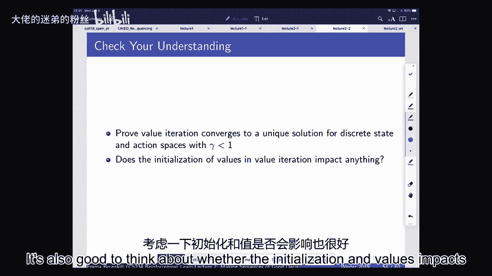

# P2：Lecture 2 - Given a Model of the World - 大佬的迷弟的粉丝 - BV1Cc411h7QQ

 All right。 So last time we were starting to talk about just sort of the general overview。

 of what reinforcement learning involves。 And we introduced the notion of a model， a value。

 and a policy。 So it's good to just refresh your brain right now about what those three， things are。

 Can anybody remember off the top of their head what a value， a model， or a policy was。

 in the context of reinforcement learning？ So the policy is a set of actions that the agent should。

 take into work。 Exactly right。 So the definition of a policy is a mapping from the state year into。

 what is the action to take。 And it might be a good policy or a bad policy and the way we evaluate。

 that is in terms of its expected discount at some of rewards。

 Does anybody remember what a model was？ Yeah。 A model is like a representation of the world and how that changes in response to。

 agents acting。 Yeah， right。 So normally we think of a model being cooperating either reward model or。

 a decision or a dynamics model which specifies in response to the current state and an action how。

 the world might change。 It could be a stochastic model or a deterministic model。 And the reward。

 model specifies what is the expected reward that the agent receives from taking a state in a particular。

 action。 So what we're going to talk about today is thinking about if you know a model of the world。

 so you know what happens if you take an action in a particular state or what the distribution of。

 next states might be if you take an action。 How we should make decisions。

 So how do we do the planning， problem？ So we're not going to talk about learning today。

 We're just going to talk about the problem of， figuring out what is the right thing to do when your actions may have delayed consequences。

 which means that you may have to sacrifice immediate reward in order to maximize long-term reward。

 So as we just stated， the model generally we're going to think about our statistical or mathematical。

 models of the dynamics in the reward function。 A policy is a function that maps the state and。

 agent states to actions and the value function is the expected discounted sum of rewards。

 from being in a state and or an action and then following a particular policy。

 So what we're going to do today is sort of build up from Markov processes up to Markov decision。

 processes。 And this build I think is sort of a nice one because it sort of allows one to think。

 about what happens in the cases where you might not have control over the world， but the world。

 might still be evolving in some way and think about what the reward might be in those sort of。

 processes for an agent that is sort of passively experiencing the world。 And then we can start to。

 think about the control problem of how the agent should be choosing to act in the world in order。

 to maximize its expected discounted sum of rewards。 So what we're going to focus about on today and。

 most of this class is this Markov decision process where we think about an agent interacting with。

 the world。 So the agent gets to take actions typically denoted by A。

 Those affect the state of the world， in some way and then the agent receives back a state in a reward。

 So last time we talked about， the fact that this could in fact be an observation instead of a state。

 But that when we think about， the world being Markov we're going to think of an agent just focusing on the current state。

 So the most recent observation like you know whether or not the robots laser range finders。

 saying that there are walls to the left or right of it as opposed to thinking of the full sequence。

 of prior history of the sequences of actions taken and the observations received。

 As we talked about last time you can always incorporate the full history to make something Markov。

 But most of the time today we'll be thinking about sort of immediate sensors。

 If it's not clear feel， free to reach out。 So what did the Markov process mean？

 The Markov process is to say that the state， that the agent is using to make their decisions is a sufficient statistic of the history。

 Which means that in order to predict the future distribution of states on the next time step。

 here we're using t to denote time step。 That given our current state st and the action that is taken at again the action。

 But this is equivalent to if we actually remember the entire history where the history。

 recall was going to be the sequence of all the previous actions and rewards at next states that。

 we have seen up until the current time point。 And so essentially it allows us to say that the。

 future is independent of the past given some current aggregate statistic about the present。

 So when we think about a Markov process or a Markov chain we don't think if there。

 being any control yet there's no actions。 But the idea is that you might have a stochastic process。

 that's evolving over time。 So whether or not I invest in the stock market the stock market is。

 changing over time and you could think of that as a Markov process。 So I could just sort of be。

 passively observing how the stock market for a particular the stock value for a particular stock。

 is changing over time。 And a Markov chain is sort of just the sequence of random states where the。

 transition dynamic satisfies this Markov property。

 So formally the definition of a Markov process is。

 that you have a finite or potentially infinite set of states and you have a dynamics model which。

 specifies the probability of the next state given the previous state。 There's no rewards there's no。

 actions yet。 And if you have a finite set of states you can just write this down as a matrix。

 Just a transition matrix that says you're starting in some state what's the probability。

 distribution over next states that you could reach。

 So if we go back to the Mars rover example that we talked about last time in this little Mars。

 rover example we thought of a Mars rover landing on Mars and there might be different sorts of。

 landing sites。 So maybe our Mars rover starts off here。 And then it can go to the left or right。

 under different actions or we could just think of those actions as being a one or a two where it's。

 trying to act in the world。 And in this case the transition dynamics it doesn't we don't actually。

 have actions yet and we just think of it as sort of maybe it already has some way it's moving in the。

 world the motors are just working。 And so in this case the transition dynamics looks like this which。

 says that for example the way you could read this is you could say well the probability that I start。

 in a particular state S1 and then I can transition to the next state on the next time step is 0。4。

 There's a 0。6 chance that I stay in the same state on the next time step。 Yeah。

 Which dimension represents the start state？ So this is a great question。

 Well which dimension which state is the start state？ I'm not specifying that here。

 In general when we think about Markov chains we think about looking。

 at their steady state distribution。 So their stationary distribution will converge to some。

 distribution over states that is independent of the start state if you run it for long enough。

 Oh sorry I'm going to ask like on that matrix which dimension represents the initial state？

 Oh you mean like where you are right now？ Yeah so in this particular case you could have it as。

 the transition of saying if you start in state let me make sure that I get it right in this case。

 And there there there so if you start in state here so this is your initial start at state S1。

 and then you take the dot product of that with I may have made let me see if I get it right in。

 terms of mixing it up。 It's either on one side or the other side and then I may have transitioned it。

 I think you'll have to do it for the other side here。 Yep it'll be flipped。 So you would have your。

 initial state the 1 0 0 0 0 0 0 1 2 3 4 5 6 and then times p and that would give you your next state。

 distribution as prime。 Yeah。 So what are the probabilities computed like the rewards I guess。

 about being based on the reward of going from state 1 to 2 or great questions？ Was you know one of。

 these transition probabilities looking at if does it relate to their award？ In this case we're just。

 thinking of Markov chain so there's no reward yet and there's no actions and this is just specifying。

 that there's some state of the of the process。 So it's as if your let's say your agent had some。

 configuration of its motors。 You don't know what that is it was said down on Mars and then it just。

 starts moving about and what this would say is this is the transition probabilities of if that。

 agent starts in state I can write it this way。 So if it starts in state s 1 then the probability。

 that it stays in state s 1 is 0。6。 So the probability that if you're starting in this particular state。

 here on the next time step that you're still there is 0。6 because of whatever configuration of the。

 motors were for that robot。 So it requires somebody to end the world already。

 This is specifying that， this is how yeah this is how the world works。 So that's a great question。

 So where's the mean right， now？ This is the this Markov process is a state of the world that you are there is some the the。

 environment you're in is described as a Markov process and this describes the dynamics of that process。

 We're not talking about how you would estimate those this is really as if this is how that world。

 works。 This is like this is the this is the world of the fake little Mars rover。

 Any questions about that？ Yeah。 Does your 1-5 factor need to be transposed when you multiply by p。

 and well confused？ Yeah。 Let me just write down and correct vector notation。 Would be like this。

 1-1-2-3-4-5-6。 That would be that would be a sample starting state you could be， in for example。

 So this could be your initial state。 Initial state and that would mean that your agent is initially in state S1。

 Okay。 And then if you want to know where it might be on the next state you would multiply that by。

 the transition model p。 Depending on the notation and whether you take the transpose of this transition。

 model it will be on the left or the right。 It should always be obvious from context but if it's。

 not clear feel free to ask us。 And so what would that say？

 That would say if you took the the matrix， multiplication of this vector which just says you're starting in state S1 what would that look like？

 Afterwards it would say that you are in state S1 still with probability 0。6 you're in state S2。

 probability 0。4 and this would be your new and I think that should be transposed。

 But it's just a one。 It would specify the distribution over next states that you would be in。

 May I have any questions about that？ Okay。 All right so this is just specifying that the。

 transition model over how the world works over time and it's just I've written it in matrix。

 notation there to be compact but if it's easier to think about it it's fine to just think about it。

 in terms of these probability of next states given the previous state。

 So you can just enumerate those， or you can write it in a matrix form if the number of states happens to be finite。

 So what would this look like if you wanted to think of what might happen to the agent over time in。

 this case or what the process might look like？ You could just sample episodes so let's say that。

 your initial starting state is S4 and then you could say well I can write that as a one-hot vector。

 I multiply it by my probability and that gives me some probability distribution over the next。

 states that I might be in and the world will sample one of those。 So your agent can't be in。

 multiple states at the same time so for example if we were looking at state S1 it has a 0。6 chance。

 of staying in S1 or a 0。4 chance of transitioning。

 So the world will sample one of those two outcomes， for you and it might be state S1。

 So in this case we have similar dynamics from S4 from S4 it has a， probability of 0。

4 going to state S3 probability of 0。4 going to state S4 or a probability of 0。2 of。

 state in the same place。 So if we were going to sample an episode of what might happen to the agent。

 over time you could start with S4 then maybe it'll transition to S5 maybe it'll go to S6。

 S7 S7 S7 S7 S7 so you're just sampling from this transition matrix to generate a particular。

 trajectory。 So it's like the world you know what the dynamic the the dynamics is of the world and。

 the nature is going to pick one of those outcomes like sampling from sort of a probability distribution。

 You may have any questions about that？ Okay so that just gives you a particular episode and。

 we're going to be interested in episodes because later we're going to be thinking about rewards。

 over those episodes and how do we compare the rewards we might achieve over those episodes。

 but for right now this is just a process this is just giving you a sequence of states。

 So next we're going to add in rewards so that was just a mark-off chain and so now what is a。

 mark-off reward process？ Again we don't have actions yet just like before but now we also。

 have a reward function so we still have a dynamics model like before and now we have a reward。

 function that says if you're in a particular state what is the expected reward you get from being。

 in that state？ We can also now have a discount factor which allows us to trade off between。

 or allows us to think about how much we weight immediate rewards versus future rewards。

 So again just like before if we have a finite number of states in this case R can be represented。

 in matrix notation which is just a vector because it's just the expected reward we get from being in。

 each state。 So if we look at the Mars rover MRP then we could say that the reward for being an S1。

 is equal to 1， the reward for being an S7 is equal to 10 and everything else the reward is zero。

 Our rewards always just tied to the state you're in。 I think last time you talked about it also。

 having an action so why are we not considering that here？ Great question saying that I mentioned。

 last time that rewards for the Markov decision process can either be a function of the state。

 the state and action or state action next state。 Right now we're still in Markov reward processes。

 so there's no action。 So in this case the ways you could define rewards would either be over。

 the immediate state or state at next state。 So once we start to think about their being rewards。

 we can start to think about their being returns and expected returns。 So first of all let's define。

 what a horizon is。 A horizon is just a number of time steps in an episode so it's sort of like。

 how long the agent is acting for or how long this process is going on for and it can be infinite。

 So if it's not infinite then we call it a finite Markov decision process。 We talked about those。

 briefly last time but often we think about the case where an agent might be acting forever or。

 this process might be going on forever。 There's no termination of it。 The stock market is up today。

 it'll be up tomorrow。 We expect it to be up for a long time and we're not necessarily trying to。

 think about evaluating it over a short time period。

 One might want to think about evaluating it over， a very long time period。

 So within this the definition of a return is just the discounted sum of rewards。

 you get from the current time step to a horizon and that horizon could be infinite。

 So a return just， says if I start off in time step t what is the immediate reward I get and then I transition maybe。

 do a new state and then I weigh that return reward by gamma and then I transition again and I weigh。

 that one by gamma squared etc。 And then the definition of a value function is just the expected return。

 If the process is deterministic these two things will be identical but in general if the process is。

 stochastic they will be different。 So what I mean by deterministic is that if you always go to the。

 same next state no matter which if you start at a state if there's only a single next state you。

 can go to then the expectation is equivalent to a single return。 But in the general case we're。

 going to be interested in these stochastic decision processes which means averages will be different。

 than particular runs。 So for an example at that well let me first just talk about discount factor。

 and then I'll give an example。 Discount factors are a little bit tricky they're both sort of somewhat。

 motivated and somewhat used for mathematical convenience。 So we'll see later one of the benefits。

 of discount factors mathematically is that we can be sure that the value function sort of expected。

 discounted sub-merf returns is bounded as long as your reward function is bounded。

 People empirically， often act as if there is a discount factor we weigh future rewards lower than than immediate。

 rewards typically。 Businesses often do the same。 If gamma is equal to zero you only care about a。

 immediate reward。 So the agent is acting myopically it's not thinking about the future of what could。

 happen later on and if gamma is equal to one then that means that your future rewards are exactly。

 as beneficial to you as the immediate rewards。 Now one thing just to note if you're only using。

 discount factors for mathematical convenience if your horizon is always guaranteed to be finite。

 it's fine to use gamma equal to one in terms of from the perspective of mathematical convenience。

 Does anyone have any questions about discount factors？ Yeah。

 My question is does the discount factor of gamma always have to progress in a geometric fashion or。

 is there a reason why we do gamma？ So a great question。 What we're defining here is that。

 using a gamma that progresses through this exponential geometric fashion is that necessary。

 It's one nice choice that ends up having very nice mathematical properties。

 There one could try using other approaches but it's certainly the most common one and we'll。

 see later why it has some really nice mathematical properties。 Any questions？ Okay。

 So what would be some examples of this？ If we go back to our Mars rover here and we。

 now have this definition of reward what would be a sample return？ So let's imagine that we start。

 off in state S4 and then we transition to S5， S6， S7 and we only have four step returns。

 So what that means here is that our process only continues for four time steps and then it maybe。

 it resets。 So why might something like that be reasonable？ Well particularly when we start to。

 get into decision making， maybe customers interact with a website on average two or three time steps。

 There is often a bounded number of time， the bounded length of a course。 In many， many cases。

 the horizon is naturally bounded。 So in this case what might happen in this scenario we start off。

 in S4。 S4， S5， S6 all have zero rewards by definition and then on time step S7 we get a reward of 10。

 but that has to be weighed down by the discount factor which here is one half。 So it's one half。

 to the power of three and so the sample return for this particular episode is just 1。25。

 And of course we could define this for any particular episode and these episodes generally。

 might go through different states even if they're starting in the same initial state because we have。

 a stochastic transition model。 So in this case maybe the agent just stays in S4， S4， S5， S4 and it。

 doesn't get any reward and in other cases it might go all the way to the left。 So if we then think。

 about what the expected value function would be it would involve averaging over a lot of these。

 And as we average over all of these then we can start to get different rewards for different time steps。

 So how would we compute this？ Now one thing you could do which is sort of motivated by what I。

 was just showing before is that you could estimate it by simulation。 So you could。

 just take for say an initial starting state distribution which could be just a single starting state or。

 many starting states and you could just roll out your process。 So right now we're assuming that we。

 have a transition matrix and a reward model and you could just roll this out just like what we。

 were showing on the previous couple time steps and you could just do this many many many times。

 and then average。 And that would asymptotically converge to what the value function is because the。

 value function is just the expected return。 So one thing you could do with simulation。

 and there are mathematical bounds you can use to say how many simulations would you need to do。

 in order for your empirical average to be close to the true expected value。

 The accuracy roughly goes down on the order of 1 over a square root of n where n is the number of。

 rollouts you've done。 But just tells you that if you want to figure out what the value is of your。

 mark-off reward process you could just do simulations and that would give you an estimate of the value。

 The nice thing about doing this is this requires no assumption of the mark-off structure。

 It's not actually using the fact that it's a mark-off reward process at all。 It's just a way to。

 estimate sums of returns， sums of rewards。 So that's both nice in the sense that if you're using。

 this in a process that you had estimated from some data or you're making the assumption that things。

 are， you know， this is the dynamics model but that's also estimated from data and it might be wrong。

 then this can give you sort of if you can really roll out in the world then you can get these sort。

 of nice estimates of really how the process is working。 But it doesn't leverage anything about。

 the fact that if the world really is mark-off there's additional structure we could do in order。

 to get better estimates。 So what do I mean by better estimates here？ I mean if we want to。

 get sort of better meaning sort of computationally cheaper ways of estimating what the value is of a。

 process。 So what the mark-off structure allows us to do， what the fact that the future is。

 independent of the past given the present， is it allows us to decompose the value function。

 So the value function of a mark-off reward process is simply the immediate reward the agent gets。

 from the current state it's in plus the discounted sum of future rewards weighed by the discount factor。

 Times and we're， we express that discounted sum of future rewards is we can just express it， with V。

 V of S prime。 So we sort of say well whatever state you're in right now you're going to get。

 your immediate reward then you're going to transition to some state S prime and then you're going to。

 get the value of whatever state S prime you ended up in discounted by your discount factor。

 So if we're in a finite state MRP we can express this using matrix notation。 So we can say that。

 the value function which is a vector is equal to the reward plus gamma times the transition model。

 times V。 Again note that in this case because of the way we're defining the transition model。

 then the value function。 So here the transition model is defined as the next state given the。

 previous state do and multiply in that by the value function there。 So in this case we can。

 express it just using a matrix notation and the nice thing is that once we've done that we can。

 just analytically solve for the value function。 So remember all of this is known so this is known。

 and this is known and what we're trying to do is to compute what V of S is。 So what we can do in。

 this case is we just move this over to the other side so we can do V minus gamma PV is equal to R。

 or we can say the identity matrix minus the discount factor times P these are all matrices。

 So this is the identity matrix， times V is equal to R which means V is just equal to the inverse of this matrix times R。

 So if one of the transitions can be backed itself wouldn't it be kind of like circular to try to。

 express V of S in terms of V of S？ The question was if it's possible to have self loops。

 could it be that this is sort of circular to find in this case。 In this case because we're。

 thinking about processes that are infinite horizon the value function is stationary and it's fine。

 if you have include self loops。 So it's fine if some of the states you might transition back to。

 the same state。 There's no problem。 You do need that this matrix is well defined that you can take。

 the inverse of it but for most processes it is。 So if we want to solve this directly this is nice it's analytic but it requires taking a matrix。

 inverse and if you have n states so let's say n states this is generally on the order somewhere。

 between n squared and n cubed depending on which matrix version you're using。 Is it ever actually。

 possible for that matrix not to have an inverse or does like the property that like call them some。

 to one or something。 Question was is it ever possible for this not to have an inverse？

 It's a good question。 I think it's basically never possible for this not to have an inverse。

 I'm trying to think whether or not that can be violated in some cases。 If you yeah sorry go ahead。

 Yeah so I think there's a couple if there's a if this ends up being the zero matrix depending。

 on how things are defined but I'll double check that and set it note on on P。

 Yeah actually I think the biggest thing about transition matrix is one。

 So if y_i_i_i_1 then y_i_1 can't have an i_i_i_1。 Just double check so I don't say anything that's incorrect and then I'll just send it note on on P。

 That's a good question。 So that's the analytic way for computing this。

 The other way is to use dynamic programming。 So in this case it's an iterative algorithm instead。

 of a one shot。 So the idea in this scenario is that you initialize the value function to be zero。

 everywhere。 In fact you can initialize it to anything and it doesn't matter if you're doing this until。

 convergence。 And so then what we're going to do is we're going to do what's going to be。

 close to something we're going to see later which is a Bellman backup。 So the idea in this case is。

 because of the Markov property we've said that the value of a state is exactly equal to the。

 immediate reward we get plus the discounted sum of future rewards。 And in this case we can simply。

 use that to derive an iterative equation where we use the previous value of the state in order。

 to bootstrap and compute the next value of a state。 And we do that for all states。

 And the computational complexity of this is a little bit lower because it's only s squared。

 because you're doing this for each of the states and then you're summing over all the。

 possible next states。 When I say we do this to a convergence generally what we do in this case。

 is we define a norm。 So generally we do something like this vk minus vk minus one。

 And you do this until it's lower than some epsilon。

 So the advantage of this is that each of the iteration updates are cheaper。

 And there also will be some benefits later when we start to think about actions。

 The other thing that does not apply is easily when we start to have actions but we'll see also。

 where it can be relevant。 So here are two different ways to try to compute the value of a Markov。

 reward process or three really。 One is simulation。 The second is analytically。 The。

 analytic one requires us to have a finite set of states。 And the third one is dynamic programming。

 We're also right now defining only all of these for when the state space is finite。 But we'll talk。

 about when the state space is infinitely drawn。 So now we can finally get on to Markov decision。

 processes。 Markov decision processes are the same as the Markov reward process except for now we。

 have actions。 So we still have a dynamics model but then now we have a dynamics model that is。

 specified for each action separately。 And we also have a reward function。 And as was asked before。

 by Camilla I think the reward can either be a function of the immediate state， the state and。

 action of the state， action and next state。 For most of the rest of today we'll be using。

 that it's a function of both the state and action。 So the agent is in a state， they take an action。

 they get immediate reward and then they transition to the next state。 So if you think about sort of。

 an observation you'd see something like this。 S-A-R and then transition to state S prime。

 And so a Markov decision process is typically described as a tuple which is just a set of states。

 actions， rewards， dynamics， model and discount factor。

 Because of the way you define the dynamic model is it that if you take a specific action that。

 is intended for you to move through state S prime you won't fully successfully move through that state。

 Like I guess I'm curious about why there's a why it's a probability at all。 Like if you're。

 given a state and you take action， why is it deterministic what the next state is？

 Question is saying like well why is this， why are there stochastic processes I think。

 There are a lot， of cases where we don't have perfect models of the environment。

 maybe if we have better models then， things would be deterministic。

 And so we're going to approximate our uncertainty over those models with， stochasticity。

 So maybe you have a robot that's a little bit faulty and so sometimes it gets stuck。

 on carpet and then sometimes it goes forward。 We could write that down as a stochastic transition。

 matrix where sometimes it stays in the same place and sometimes it advances to the next state。

 Maybe you're on sand or things like that。 Maybe when you're trying to drive to SFO sometimes you。

 hit traffic sometimes you don't。 You could imagine putting a lot more variables into your state space。

 to try to make that a deterministic outcome or you could just say hey sometimes when I try to go。

 forward you know like I hit these number of red lights and so I'm late。 Another time you know I。

 don't hit those red lights and so I'm fine。 So if we think about our Mars rover MDP now let's just。

 define there being two actions A1 and A2。 You can think about these things as the agent trying to move。

 left or right but it's also perhaps easier just to think about in general them as sort of these。

 deterministic actions for this particular example。

 So we can write down what the transition matrix would。

 be in each of these two cases that shows us exactly where the next state would be given the previous。

 action。 So what's happening in this case is if the agent tries to do A1 in state S1 then it stays in。

 that state otherwise it'll generally move to the next state over。 If it's trying to do action A1。

 and for action A2 it'll move to the right unless it hits A7 and then it'll stay there。

 So like we said at the beginning of class a Markov decision process policy specifies what action to。

 take in each state and the policies themselves can be deterministic or stochastic meaning that。

 you could either have a distribution over the next action you might take given the state you're in。

 or you could have a deterministic mapping that says whenever I'm in this state I always you know do。

 action A1。 Now in a lot of the class we'll be thinking about deterministic policies but later on when we。

 get into policy search we'll talk a lot more about stochastic policies。

 So if you have an MDP policy then that immediately specifies a Markov reward process。

 because once you have specified the policy then you can think of that as inducing a Markov reward。

 process because you're only ever taking you've specified your distribution over actions for your。

 state and so then you can think of sort of what is the reward the expected reward you'll get under。

 that policy for any state and similarly you can define your transition model for a Markov reward。

 process by averaging across your transition models according to the way to which you would take those。

 different actions。 So the reason why it's useful to think about these connections between Markov。

 decision processes and Markov reward processes is it implies that if you have a fixed policy you。

 can just use all the techniques that we just described for Markov reward processes namely simulation。

 analytic solution or dynamic programming in order to compute what is the value of a policy。

 So if we go back to sort of the iterative algorithm then it's exactly the same as before。

 exactly the same as the Markov reward process except for now we're indexing our reward by the policy。

 So in order to learn what is the value of a particular policy we instantiate the reward function by。

 always picking the action that the policy would take。 So in this case I'm doing it for simplicity。

 for deterministic policy and then similarly just indexing which transition model to look up based。

 on the action that we would take in that state。 And this is also known as a Bellman backup for。

 a particular policy so it allows us to say what is the value of this state under this policy。

 well it's just the immediate reward I would get by following the policy in the current state。

 plus the expected discounted sum of rewards I'd get by following this policy and then for whatever。

 state I end up in next continuing to follow this policy。

 So that's what the V pi of k minus 1 specifies。 So what would happen they expected discounted sum of rewards we get by continuing to follow。

 policy from whatever state we just transition to。 So if we go to the mark off the mark off chain or the mark now the mark off decision process for。

 the Mars rover then let's look at the case now where we have these two actions the reward function。

 is still that you either have for any action if you're in state one you get plus one and in any。

 state any action for state f 10 you get plus 10 everything else is zero。 So imagine your policy。

 is always to do action a one and that your discount factor is zero。 So in this case。

 what is the value of the policy？ And this is just to remind you of what like the iterative way of computing it would be。

 Yeah in the back。 And I think you'd be zero for everything except that's one and that's plus one and plus 10。

 That's exactly right。 So this is a little bit of a trick question because I didn't show you。

 again what the transition model is。 So that is exactly correct。

 It doesn't matter what the transition， model is here because gamma is equal to zero。

 So that means that all of this goes away。 And so you just have the immediate reward。

 So if your discount factor is zero then you just， care about immediate reward。

 And so the immediate reward for this policy because the reward for all。

 actions in state one is always plus one and the reward for all actions and all other states is。

 zero except for in state S seven where it's always 10 no matter which action you take。

 So this is just， equal to one。 The value function is this。 Okay so let's look at another one。

 So now we've got exactly the same， process。 I've written down a particular choice of the dynamics model for state S six。

 So let's， imagine that when you're in state S six which is almost all the way to the right you have a 50%。

 probability of staying there under action A1 or 50% probability of going to state S seven。

 That's what this top line says。 And then there's a whole bunch of other dynamics models that we're。

 not going to need to worry about to do this computation。

 And then the reward is still plus one for state， S one plus ten and state S seven zero for all the states in the middle。

 And then let's imagine that， we're still trying to evaluate the policy where you're always taking action A1。

 And we've just， said that VK is equal to one zero zero zero ten。

 And now what we want to do is do one more backup， essentially。

 So we want to move from VK equal one and now compute VK equal two。

 So how about everybody take a second and figure out what would be the value under this particular。

 policy？ K for S six。 So you can use this equation to figure out given that I know what my previous。

 value function is because I've specified it there。 It's one zero zero zero ten。

 And now I'm going to be， doing one backup and I'm only asking you to do it for one state。

 You could do it for others if you， want。 What would be the new value of S six if you use this equation to compute it？

 And it just requires plugging in what is the value of the reward。 The value is。

 and the particular numbers for the dynamics and the old value function。 And the reason that I bring。

 this up as an example is to show sort of essentially how kind of information flows as you do this。

 computation。 So you start off in the very initial let me just go over here first。 So when you start。

 off you're going to initialize the value function to be zero everywhere。 The first backup you do。

 basically initializes the value function to be the immediate reward everywhere。 And then after。

 that you're going to continue to do these backups and essentially you're trying to compute。

 these expected discounted sum of future rewards for each of the states under this policy。

 So if you think about looking at this that sort of information of the fact that state S seven is。

 good is going to kind of flow backwards to the other states because they're saying okay well。

 but then state S four I don't have any reward right now but in a couple time steps under this。

 process I might because I might reach that really great plus ten state。 So as we do these。

 iterations of policy evaluation we start to propagate the information about future。

 rewards back to earlier states。 And so what I'm asking you to do here is to just do that for one。

 one more step。 It's just a for state S six。 What would its new value be its previous value was zero。

 Now we're going to do one backup and what is this new value。 So what you just first let's ask a。

 you kind of question and then we can all take a second to do it。 I'm just wondering if you're。

 using the same process to also find the value function。 I guess like if you don't necessarily。

 know the value function is set you could just like preferably follow it down。

 The question was can you， if you don't know what the value function is I guess I'm not totally sure this is a way to compute。

 the value what your question is asking because this is a way to compute the value function。

 So what we've done here is we've said we've initialized the value function to be zero everywhere。

 that is not the real value function that's just sort of an initialization。 And what this process is。

 allowing us to do is we keep updating the values of every single state until they stop changing。

 And then that gives us the expected discounted sum of rewards。 Now you might ask okay well they。

 are they ever guaranteed to stop changing and we'll get to that part later。 We'll get to the。

 fact that this whole process is guaranteed to be a contraction so it's not going to go on forever。

 So the distance between the value functions is going to be shrinking and that's one of the。

 benefits of the discount factor。 So if people don't have any more immediate questions I suggest we。

 all take a minute and then just compare with your neighbor of what number you get when you do this。

 computation just to quickly check that the Bellman equation makes sense。 All right so wherever you。

 got to hope we had a chance to sort of compare or check any understanding with anybody else that。

 was next to you。 Before we go on I just want to answer a question that was asked before about。

 whether or not the analytics solution is always possible to invert。 Let's go back to that。

 So in this case because P is a stochastic matrix its eigenvalues are always going to be。

 less than or equal to one。 If your discount factor is less than one then i which is the identity matrix。

 minus gamma times P is always going to be invertible。 That's the answer to that question。

 So this matrix， is always invertible as long as gamma is less than one。

 All right so let's go back to this one， which we're going to require anyway for some of the other important properties we want。

 So， in this case what is that？ So the immediate reward of this is zero plus gamma times 0。

5 probability， that we stay in that state times the previous v of s6 plus 0。

5 probability that we go to v of s7， and this is going to be equal to zero plus 0。

5 times zero plus 0。5 times 10。 So that's just an example of how you would compute one billman backup。

 Just back to my original question which is you seem to be using v sub k without the super script。

 of pi to evaluate it。 Oh sorry this should have been pi。

 That was just a typo and that was correct in there。

 Just whether or not there was supposed to be pi up there。 Yes it was。 Thanks for catching。

 All right so now we can start to talk about Markov decision process control。 Now just to note。

 there so I let us through or we just went through policy evaluation in an iterative way you could。

 have also done it analytically or you could have done it with simulation。 But it has a particularly。

 nice analogy now that we're going to start to think about control。 So again what do I mean by。

 control？ Control here is going to be the fact that ultimately we don't care about just evaluating。

 policies typically we want our agent to actually be learning policies。 And so in this case we're。

 not going to when we're not going to talk about learning policies we're just going to be talking。

 about computing optimal policies。 So the important thing is that there exists a unique optimal value。

 function。 So and the optimal policy for an MDP and then infinites in finite state MDP is deterministic。

 That's one really good reason why it's sufficient for us to just focus on deterministic policies。

 just for finite state MDPs in infinite horizons。 Okay so how do we compute it？ Well first before we。

 do this let's think about how many policies there might be。

 So there are seven discrete states in this， case it's the locations of the rover。

 There are two actions I won't call them left and right I'm， just going to call them A1 and A2。

 Because left and right kind of implies that you will definitely。

 achieve that we can also just think of these as generally being stochastic scenarios so let's just。

 call them A1 and A2。 Then the question is how many deterministic policies are there and is the。

 optimal policy for an MDP always unique。 So again why don't we just take like one minute or so one。

 or two minutes feel free to talk to a neighbor about how many deterministic policies there are。

 for this particular case and then if that's the once you've answered that it's fine to think about。

 in general if you have S states and A actions and this is the cardinality of those sets。

 How many possible deterministic policies are there？

 And then the second question which is whether or， not these are always unique。

 Okay does that many want to take a guess at how many deterministic， policies there are in this case？

 Remember this can be brought with it's a mapping from states to。

 actions so we need two to the seventh。 That's exactly right。

 That is it's a mapping if we remember back to， our definition of what a policy is a mapping is going to be a map from states to actions。

 So what that means in this case is that there are two choices for every state and there are seven。

 states and more generally that the number of policies is A to the S。 So it can be large it's。

 exponential in the state space but it's finite so it's bounded。

 Any more want to take a guess whether or， not the optimal policy is always unique I told you the value function is unique is the policy unique。

 I think there might be cases where it's not really。 Exactly right it's not always unique the value。

 function is unique but if there may be cases where you get ties and so there might be that there are。

 two actions that or two policies that have the same value so no it depends on the process。

 Yes so the general question is can I explain what I mean by there's a unique optimal value function。

 I mean that the optimal value of the state so they expect to discount some of returns。

 There is a there may be more than one optimal policy but there exists at least one optimal。

 policy which leads to the maximum value for that state and there there's a single value of that。

 We'll talk about it it'll probably be a little bit clearer too when we talk about contraction。

 properties later that there's sort of this is a scale so for each state it's just a scalar value。

 it says exactly what is the expected discounted sum of returns and this is the maximum expected。

 discounted sum of returns under the optimal policy。

 Yes question is for me to sort of better clarify you know what the what this how many policies。

 there are and whether maybe and there maybe it looked like it was going to be linear and it's。

 actually exponential。 The way that we're defining a decision policy here a deterministic decision。

 policy is a mapping from a state to an action and so that means for each state we get to choose。

 an action and so just as a illustration of why this ends up being exponential so in this case。

 let's imagine instead of having seven states we just have six of two states so now we have s1 and s2。

 so you could either have action a1a1 you could have action a1a2 you could have action a2a1 or。

 action a2a2 and you have to and all of those are distinct policies so that's why the space ends。

 up being exponential。 When you have like a to the power of s I'm assuming that a refers to legal。

 actions first state assuming like you could have different actions depending on the state。

 Whether or not you might be able to have different constraints on the action space for state。

 absolutely so in this case today for simplicity we're going to assume that all actions are。

 applicable in all states in reality that's often not true in many real world cases some of the。

 actions might be specific to the state you know for totally there's a huge space of medical。

 interventions for many of them they might not be at all even reasonable to ever consider for certain。

 states or applicable so in general you can have different action subspaces per state and then you。

 would take the product over the actions the cardinality of the action set that is relevant for each of。

 the states but for right now I think it's simplest just to think of it as there's one uniform action。

 space and they can be applied in any state。 Okay so the optimal policy for an MDP and a finite horizon。

 problem where the agent acts forever is deterministic it's stationary which means it doesn't depend on。

 the time step we started talking about that a little bit last time so it means that if I'm in。

 this state if I'm in state s7 there's an optimal policy for being in state s7 whether I encounter。

 that at time step one time step 37 time step 242 stationary and one of the intuitions for this is。

 that if you get to act forever there's always like an infinite number of future time steps no。

 matter when you're at so if you would always do action a1 from state s7 now then if you encounter。

 it again in 50 time steps you still have an infinite amount of time to go from there and so。

 you'd still take the same action if that was the optimal thing to do and as we were just discussing。

 it's not the optimal policy is not necessarily unique because you might have more than one policy。

 with the same value function。 So how would we compute this one option is policy search and we'll。

 talk a lot more about this in a few weeks when we're talking about function approximation and having。

 really really large state spaces but even in tabular cases we can just think of searching so the number。

 of deterministic policies we just discussed is A to the S and policy iteration is a technique that。

 is generally better than enumeration。 So what do I mean by enumeration in this context？ I mean。

 there's a finite number of policies you could just evaluate each of them separately and then pick。

 the max。 So if you have a lot of compute you might just want to and this might be better if you really。

 care about wall clock and you have many many many processors you could just do this exhaustively you。

 could just try all of your policies evaluate all of them either analytically or iteratively or whatever。

 it's giving you want to use and then take the max over all of them but if you don't have kind of。

 infinite compute it's generally more computationally efficient if you have to do this serially to do。

 policy iteration and so we'll talk about what that is。 So in policy duration what we do is we。

 basically keep track of a guess of what the optimal policy might be we evaluate its value and then。

 we try to improve it。 If we can't improve it anymore then we can halt。

 So the idea is that we start by， initializing randomly here now you can think of the subscript is indexing which policy we're at。

 So initially we start off with some random policy and then pi i is always going to index sort of our。

 current guess of what the optimal policy might be。

 So what we do is we initialize our policy randomly。

 and while it's not changing and we'll talk about whether or not it can change or go back to the。

 same one in a second we do value function policy we evaluate the policy using the same search。

 techniques we just discussed because it's a fixed policy which means we are now basically in a。

 Markov reward process and then we do policy improvement and so the really the new thing。

 compared to what we were doing before now is policy improvement。 So in order to define how we。

 could improve a policy we're going to define something new which is the state action value。

 So before we were just talking about state values state values are denoted by b。

 We're talking about like v pi of s which says if you start in state s and you follow policy pi。

 what is the expected discounted sum of rewards。 A state action value says well I'm going to follow。

 this policy pi but not right away。 I'm going to first take an action A which might be different。

 than what my policy is telling me to do and then later on the next time step I'm going to follow。

 policy pi。 So it just says I'm going to get my immediate reward from taking this action A that。

 I'm choosing and then I'm going to transition to a new state again that depends on my current state。

 and the action I just took and from then on I'm going to take policy pi。

 So that defines the Q function， and what policy improvement does is it says okay you've got a policy you just did policy evaluation。

 and you got a value of it。 So policy evaluation just allowed you to compute what was the value of that。

 policy and now I want to see if I can improve it。 Now remember right now we're in the case where we。

 know the dynamics model and we know the reward model so what we can do then is we can do this sort。

 of Q computation where we say okay well I've got that previous value function of my policy and now I。

 compute Q pi which says if I take a different action it could be the same we do this for all A and for all。

 S。 So for all A and all S we compute this and then we're going to compute a new policy and this is。

 the improvement step which maximizes this Q。 So we just do this computation and then we take the。

 max。 Now by definition this has to be greater than or equal to Q pi i of S pi i of A。

 Right because either A is equal to pi i of A but sorry pi i of S。

 So either you the arg max is going to be the same as that your previous policy pi i or it's going。

 to be different and the only time you're going to pick it differently is if the Q function of that。

 alternative action is better。 So by definition this Q pi that max over A of Q pi i of S A has to be。

 greater than or equal to Q pi i of S times pi i of S。 Question of the back。

 So I'm kind of finding like a vocal mix of although you kind of just get stuck there to make some。

 counseling between different actions。 So this is going to allow us to maybe do some local。

 monotonic improvement maybe but are we going to be susceptible to getting stuck。 In fact for any。

 of you that have played around with reinforcement learning and policy gradient and stuff that is。

 exactly one of the problems that can happen when we start doing gradient based approaches。

 Nicely in this case this does not occur。 So we guarantee to converge the local to the global。

 optima and we'll see why for a second。 Okay all right so this is how it works you do this policy。

 evaluation and then you compute the Q function and then you compute the new policy that takes an。

 arg max of the Q function。 So that's how policy improvement works。 The next critical question。

 that there is was bringing up is okay why do we do this and is this a good idea。

 So when we look at this let's look through this step a little bit more。

 What we're going to get is we're going to get this sort of interesting type of policy improvement。

 step and it's kind of involving a few different things so I just sort of want to highlight the。

 subtlety of it。 So what is happening here is that we compute this Q function and then。

 we've got this。 We've got max over a of Q pi i with s a has to be greater than equal to r of s of pi a。

 the previous policy that we're using before。 So what I've done there is I've said okay the max。

 action over the Q has to be at least as good as following your old policy by definition because。

 otherwise you could always pick the same policy as before or else you're going to pick a better。

 action and this reward function here is just exactly the definition of the value of your old policy。

 So that means that your the max over your Q function has to be at least as good as the old。

 value you had。 So that's encouraging but here's the weird part。

 So when we do this if we instead take， argmax we're going to get our new policy。

 So what is this doing？ It's saying I'm computing this new， Q function。

 What does this Q function represent？ It represents if I take an action and then I follow。

 my old policy from then onwards and then I'm picking whatever action is maximizing that quantity for。

 each state。 So I'm going to do this process for each state。

 But then so that's going to just define a new policy right like that might be the same or it。

 could be a different policy than the one you've had before。 Here's the weird thing。 So this is。

 saying that if you were to follow that argmax a and then follow your old policy from then onwards。

 you would be guaranteed to be doing better than you were before。 But the strange thing is that。

 we're not going to follow the old policy from then onwards。 We are going to follow this new policy。

 for all time。 So remember what we're doing is we're completely changing our policy and then we're。

 going to evaluate that new policy for all time steps not just for the first time step and then。

 follow the old policy from then on。 So it should be at least a little unclear that this is a good。

 thing to do。 It should be like okay so you're saying that if I were to take this one different。

 action and then follow my old policy then I know that my value would be better than before。

 But what you really want is that this new policy is just better overall。

 And so the cool thing is that， you can show that by doing this policy improvement it is monotonically better than the old policy。

 So this is just saying this out in world。 We're saying you know if we took the new policy for。

 one action and follow pi forever then we're guaranteed to be at least as good as we were before in terms。

 of our value function but our new proposed policy is just to always follow this new policy。

 Okay so why do we get a monotonic improvement in the policy value by doing this？

 So in the policy value。 So first of all what do I mean by monotonic improvement？

 What I mean is that the value， something is monotonic if the new policy is greater than equal to the old policy for all states。

 So it has to either have the same value or be better。 And my proposition is that the new policy。

 is greater than or equal to the old policy in all states with strict inequality if the old policy。

 was suboptimal。 So why does this work？ So it works for the following reasons。 Let's go ahead and。

 just like walk through the proof briefly。 Okay so this is what we've said here is that。

 the pi i of s that's our old value of our policy so this is like our old policy value。

 has to be less than or equal to max a of q pi i of s a。 And this is just by definition。

 I'll let me write this。 Is equal to r of s of pi i plus one of s because remember the way that we defined pi of i plus one。

 of s is just equal to the policy that max maximizes the q pi i。

 So this is going to be by definition。 So I've gotten rid of the max there。

 Okay so this is going to be less than or equal to r the same thing at the beginning。

 Times max over a over q pi i。 Again my definition because we've said at the first thing there that we know that b pi i of s prime。

 would also be less than or equal to max over a of q pi i of s prime a prime。 Okay we just made。

 that substitution and then we can re-expand this part using r reward。 So this is going to be max。

 over a prime r of s prime a prime plus dot dot dot basically making that substitution from that。

 line into there。 So I'm nesting it。 I'm re-expanding what the definition is of q pi。

 And if you keep doing this forever essentially we just keep pushing in as if we get to continue。

 to take pi i plus one on all future time steps and what the key thing to notice here is that this。

 is a greater than or equal to。 So if you nest this in completely what you get is that this is the value。

 pi i plus one。 So there's kind of two key tricks in here。 The first thing is to say notice that the。

 v pi i is always lower is the lower bound to max a over q pi and then to re-express this using the。

 definition of pi i plus one and then to re-upper bound that v by q pi and just keep re-expanding it。

 So you can do this out and then that allows you to redefine to when you've substituted in for all。

 actions using pi i plus one then you've now defined what the value is of pi i plus one。

 So this is what it allows us to know that the new pi i plus one value is by definition at least as。

 good as the previous value function。 So I just put that in there and we need to think。

 All right so the next questions that might come up is so we know we're going to get this monotonic。

 improvement。 So the questions would be if the policy doesn't change can it ever change again？

 Is there a maximum number of iterations of policy iteration？ So what do I mean by iterations here？

 Iterations is i。 So kind of how many policies could we step through？

 So why don't we take like a minute and just think about this maybe talk to somebody around you。

 that you haven't met before and see what you think of these two questions。

 So policy is monotonically improving and is there a maximum number of iterations that school read for？

 [inaudible]， Just in the interest of time for today。

 Just in the interest of time for today because I want us to。

 try to get through value iteration as well。 Why does that？ Does somebody want to give me a guess。

 of whether or not the policy can ever if the policy stops changing whether it can ever change。

 again？ So what I mean by that is that if the policy at pi， so the question here was to say if。

 pi of i plus 1 is equal to pi i for all states， can it ever change again？ So I may want to。

 share a guess of whether or not that's true。 Once it has stopped changing。

 it can never change again。 So no。 And the second question is is there a maximum number of policy iterations？

 Yeah。 There's no you get up moderation when there are policies。 That's right。

 We know that there is at most A to the S policies。 You cannot repeat a policy ever。

 Because of this monotonic improvement。 And so there's a maximum number of iterations。 Great。

 And this just I'll skip through this now just so we can go through a bit of value iteration。

 but this just steps through to show a little bit more of how once your policies stop changing。

 essentially your Q pi will be identical。 And so you can't there's no policy。

 improvement to be to change after it's sort of converged。 You're going to stay there forever。 Okay。

 So policy iteration computes the optimal value in a policy in one way。 The idea in policy。

 iteration is you always have a policy that is that you know the value of it for the infinite horizon。

 And then you incrementally try to improve it。 Value iteration is an alternative approach。

 Value iteration instead says we're going to think of computing the optimal value if you get to act。

 for a finite number of steps。 The beginning just one step and then two steps and then three steps。

 etc。 And you just keep iterating to longer and longer。 So that's different， right？ Because policy。

 says you always have a policy and you know what its value is。 It just might not be very good。

 Value iteration says you always know what the optimal value in policy is， but only if you're。

 going to get to act for say K time steps。 So they're just they're computing different things。

 And they both will converge to the same thing eventually。 So when we start to talk about value。

 iteration it's useful to think about Bellman。 So the Bellman equation and Bellman backup operators。

 are things that are often talked about in Markov decision processes and reinforcement learning。

 So this constraint here that we've seen before which says that the value of a policy is its immediate。

 reward plus it's discounted sum of future rewards is known as the Bellman equation。

 The constraint for a Markov process that Markov decision processes it has to satisfy that。

 And we can alternatively like what we were just seeing before think of this as a backup operator。

 which means that we can apply it to an old value function and transform it to a new value function。

 So just like what we were doing in some of the evaluation of a policy we can also sort of do。

 these operators in this case the difference compared to what we've seen with evaluation before is we're。

 taking a max there。 We're taking this max A over the best immediate reward we could it plus the discounted。

 sum of future rewards。 So sometimes we'll use the notation of Bv to mean a Bellman operator。

 which means you take your old V and then you plug it into here and you do this operation。

 So how does value iteration work？ The algorithm can be summarized as follows。 You start off you。

 can initialize your value function to zero for all states and then you loop until you converge。

 or if you're doing a finite horizon which you might not have time to get to today but。

 then you go to that horizon and basically for each state you do this Bellman backup operator。

 So you say my value at k plus one time steps for that state is if I get to pick the best。

 immediate action plus the discounted sum of future rewards using that old value function I had。

 from the previous time step。 And that VK said what is the optimal thing my optimal value for that state。

 S prime given that I got to act for k more time steps。 That's why initializing it to zero is a。

 good thing to do because in this case or certainly reasonable thing to do if you want these all to be。

 the optimal as if you had that many time steps to go。

 If you have no more time steps to act your value， is zero the first backup you do will basically say what is the optimal immediate action you should。

 take if you only get to take one action and then after that you start backing up and continuing。

 and say well what if I got to act for two time steps what if I got to act for three time steps。

 what's the best sequence of decisions you could do in each of those cases。

 Again just in terms of Bellman operations if we think back to sort of what policy iteration is。

 doing you could instantiate this Bellman operator by fixing what the policy is。

 And so if you see sort， of the B with a pie on top it's saying well instead of taking that max over actions you're。

 specifying what is the action you get to take。 So policy evaluation you can think of is basically。

 just computing a fixed point of repeatedly applying this Bellman backup until V stops converging and stops。

 changing。 So in terms of policy iteration this is very similar to what we saw before you can think。

 of it in these Bellman operators and doing this arg max。 Want to see if we can get to a little bit。

 on sort of the contraction operator。 So this is what value iteration does it's very similar policy。

 iteration and evaluation。 Let me talk a little bit about the contraction aspect。

 So for any operator， let's let O be an operator and X denote a norm of X。

 So X can be a vector like a value function， and then you could look at like an L2 norm or an L1 norm or an L infinity norm。

 So if you want to if an operator is a contraction it means that if you apply it to two different。

 things you can think of these as value functions then the distance between them shrinks after or at。

 least is no bigger after you apply the operator compared to their distance before。 So just to。

 actually I'll save examples for later。 Feel free to come up to me after class if you want to see。

 an example of this or I can do it on Piazza but this is sort of the formal definition of what。

 it means to be a contraction。 The distance between in this case we're going to think about is two。

 vectors doesn't get bigger and can shrink after you apply this operator。

 So the key question of whether or not value iteration will converge is because the Bellman。

 back up is a contraction operator。 It's a contraction operator as long as gamma is less than one。

 Which means that if you do let's say you had two different value functions and then you did the。

 Bellman back up on both of them then the distance between them would shrink。

 So how do we prove this？ We prove it for interest of time I'll show you the proof again I'm happy to。

 go through it or we can go through it in the office hours etc。 Let me just show it kind of briefly。

 So the idea to prove that the Bellman back up is a contraction operator is we consider there。

 being two different value functions K and J。 They don't have to be this doesn't have to be anything。

 to do with value iteration。 These are just two different value functions。 One could be you know。

 one three seven two and the other one could be five six nine eight。 So we just have two different。

 vectors of value functions and then we re-express what they are after we apply the Bellman back up。

 operator。 So there's that max a the media reward plus the discounted sum of future rewards where。

 we plugged in our two different value functions and then what we say there is well if you get to。

 pick that max a separately for those two the distance between those is lower bounded than if you kind。

 of try to maximize that difference there by putting that max a and then you can cancel the rewards。

 So that's what happens in the third line and then the next thing we can do is we can bound and say。

 the difference between these two value functions is if is bounded by the max norm of the distance。

 between those two。 So you can pick the places at which those value functions most differ and then。

 you can move it out of the sum and now you're subbing over a probability distribution that has to sum to。

 one and that gives you this and so that means that the Bellman back up as long as this is less than one。

 has to be a contraction operator。 The distance between the two value functions can't be larger。

 after you apply the Bellman operator than it was before。

 So I think a good exercise to do is to then say given that it's a contraction operator。

 that means it has to converge to a fixed point there has to be unique solution。

 So if you apply the Bellman operator repeatedly there's a single fixed point that you will go to。

 which is a single vector of values。 It's also good to think about whether the initialization。

 of values impacts anything if you only care about the result after it's converged。

 Alright so I think we can hold there classes basically over there's a little bit more in the。

 slides to talk about the finite horizon case and feel free to reach out to us on Piazza with any。

 questions。 Thanks。

 [BLANK_AUDIO]。

