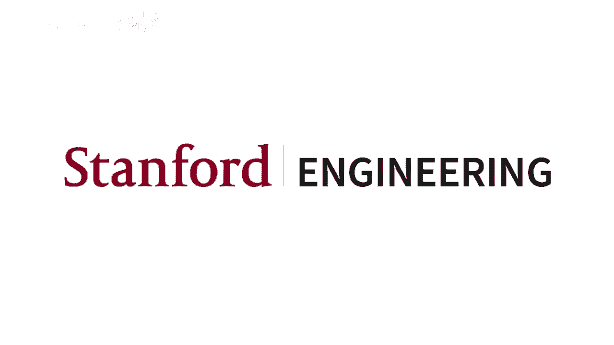
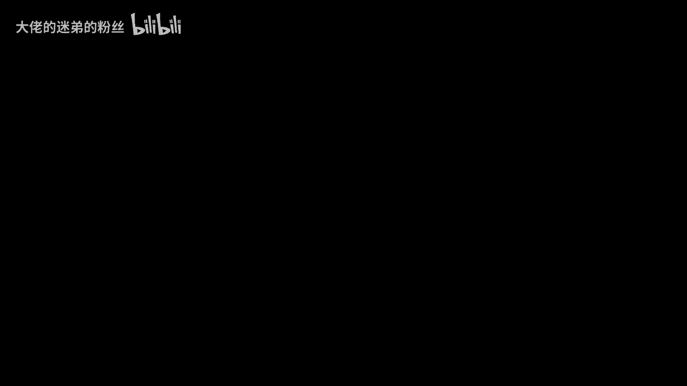
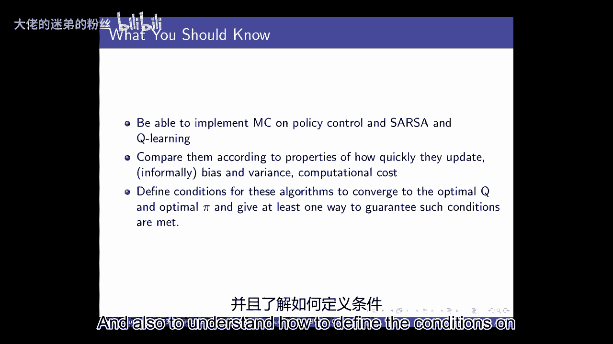

# P4：Lecture 4 - Model Free Control - 大佬的迷弟的粉丝 - BV1Cc411h7QQ

所有的权利，在我进入技术阶段之前，我们要开始了，我们会做一点后勤工作，嗯，所以我们开始了这些叫做会议的事情，我们在广场上宣布了他们，如果你没有，如果你没有得到我们的广场的东西，一定要报名参加广场。

或者给我们发条，嗯，会议旨在进入材料，再深一点，也来讨论一下家庭作业的问题，嗯，有结构化的会话，与办公时间相反，在那里你可以一对一地问关于家庭作业的问题，那个啊，这些课程旨在更深入地研究材料。

他们都是基于我的一些同事，学生在其他班级有多喜欢他们的反馈，以及去年的一些要求，希望有机会更深入地研究材料，所以我们在广场上宣布了这些，这个想法是你将注册一个会议，它们是可选的，你不必做这些。

我们将给参加他们的额外百分之一的学分，如果你参加足够多的，细节也已经公布了，我认为这是真的，如果我没记错的话，发邮件给我，我想已经宣布了，也在广场上，所以如果你去广场，有许多不同的会议。

你可以报名参加他们的报名点，确保我们有足够的空间，但我很肯定我们几乎能容纳任何会议，你想去的，最后一次会议将通过缩放完成，并特别针对SCPD学生，但欢迎任何人做这件事，嗯，我们将跟踪的方式。

不管人们是否去参加会议，我们将有一个代码，在，所以你只需要写上代码来表明你的出席情况，我们将记录最后一次会议，所以如果出于某种原因，你的日程安排如此，你不能参加这些，但你想参加会议。

你可以稍后浏览这些材料，然后使用该代码记录你参加了它，我们将依靠斯坦福荣誉守则，只有这样做的人才会上传代码，然后我们有任何关于会议的问题，什么会，那些又涉及到什么，它们是可选的，他们要更深入地研究材料。

嗯，有些人真的很喜欢这种东西，能看到你的想法，这是一个实验，所有的权利，还有什么问题吗？会议以外，所以作业被释放了，本周办公时间照常，嗯嗯，如有任何问题，请随时与我们交谈或使用Piazza。

我们现在就开始吧，那么嗯，像往常一样，我真的很感激，如果你用你的名字，每当你问问题或发表评论时，所以今天我们终于要开始做决定了，在那里我们没有世界的模型，特别是我们将关注模型自由控制。

所以我们今天要讨论的是，一个代理人如何开始做出好的决定，当它不知道世界是如何运作的时候，它不会显式地构造一个模型，嗯，记住，在这种情况下，一个模型将是一种奖励，或者环境的动力学模型，所以今天我们要看。

不涉及构造，动态或奖励模型，只是直接从经验中学习，我们上次主要讨论的是，也许我们不知道世界是如何运作的，我们没有这些明确的动态和奖励模型，但是，我们将试图评估提供给我们的一项政策，而现在。

我们将考虑真正的问题，在强化学习中经常出现的，这就是当一个代理人不知道世界是如何运作的时候，他们应该如何做出决定，他们仍然想最大化他们预期的折扣奖励，当我们想到一项政策有多好。

一旦我们有了关于一项政策有多好的信息，然后我们可以开始思考如何学习一个好的政策，事实上，当我们刚开始上课的时候，我们讨论了如何学会做出好的决定，或者如果给你一个世界的模型，你会如何计算好的决定。

所以这就是我们现在要回到的，所以特别是，现在我们可以考虑开始解决这个优化和探索的问题，我们仍然不打算进行概括，但这很快就会发生，嗯，我们已经看到了一点，这甚至想出了计划，但现在我们将开始思考如何探索。

我们如何进行优化，所以当我们想到好的时候，我想我只是要经历更多的这些，当我们开始进入这个区域时，所以我们又要考虑，我们如何识别一个有很高期望灰尘的政策，计算的奖励总额，会有延迟的后果。

这意味着我们的代理人采取了可能看不到的行动，这些行为在一段时间内是好是坏的结果，我们将开始考虑探索方面，好的，所以让我们从，嗯，你知道，这些类型的问题出现的地方，人们在那里建模。

当我们考虑马尔可夫决策过程时，也许不是建立一个模型，所以我想这可能是强化学习成功的第一个例子，在这种模式下做，免费的方式是双陆棋，大约是1994年，他们训练一个特工玩双陆棋，棋盘游戏，嗯嗯。

实际上使用神经网络，神经网络在大约10-15年的时间里已经过时了，然后又回来了，但在90年代初，人们使用神经网络，杰里·塔萨罗用它来玩双陆棋得到了一些非常好的结果，这是强化学习的第一个演示之一。

一个更大的设置，你可以解决这些复杂的游戏，嗯，许多其他问题也可以建模为MDP，无论是游戏、机器人、客户广告选择还是入侵物种管理，在许多这样的情况下，我们事先不知道模型，所以我们今天要考虑的是特定的情况。

主要是在这里，我们认为模型是未知的，但如果我们能取样，但偶尔也会有这样的情况，我也是，你知道模型的地方，但它真的真的很贵，所以对于计算可持续性或气候建模，你也许可以写下一个很好的世界模型。

但运行起来真的真的很贵，因为实际上模拟气候真的真的真的真的很难，即使那样，你的模型也可能令人印象深刻，但我只是我提出第二点，从某种意义上说，当我们主要考虑向世界学习的时候。

我们认为一个机器人就像在世界上跑来跑去，这是一件昂贵的事情，因为机器人需要实时来做这件事，但你也可以想想那些正在学习，与模拟器交互，那也很贵，所以我们今天要想的主要是，就是所谓的政策学习。

在那里我们获得了关于世界的直接经验，然后我们试图用它来估计和评估一个政策从经验，但我们也要储存，开始更多地谈论非策略学习，在那里我们获得关于世界的数据，我们用它来估计做事的替代方式。

所以我们可以结合尝试不同事物的经验，试图了解一些我们自己没有做的事情，然后嗯，第三件事真的很重要，所以第二件事真的很重要，所以我只想在这里简单地谈谈，所以假设你有一个案例，说现在只有一个州。

但就像你有一个状态，It’只有一个，你做一个，你呆在一号，然后你做一个1，或者你是一个，你做一个二，呆在一号里，然后你做一个二，所以你希望能够把这些经历结合起来，所以你可以学习这样做。

即使你从来没有这样做过，你从来没有经历过那种完整的轨迹，但你希望能够推断，从以前的经历中，所以这种政策将是一种非政策学习，因为它与我们以前尝试过的政策不同，当我们考虑Q学习时，我们会更多地讨论这个问题。

所以让我们从广义策略迭代开始，好的，所以如果我们回到策略迭代，我们在几节课前的策略迭代中讨论过这个问题，当我们知道世界的模型时，我们最初看到了它，所以这是我们计算什么是正确的事情的一种方式。

给了正确的东西，意味着最大化我们预期折扣奖励金额的政策，那么当我们知道世界是如何运作的时候，我们该如何做到这一点，我们得到了我们的动态和奖励模型，那样的话，我们可能随机初始化一些策略，所以说。

再次初始化意味着我们将s的pi设置为，A适用于所有人，这通常可能是随机选择的，嗯，然后我们做了这个政策评估程序，其中我们首先计算了策略的当前值，然后我们更新了政策，我们拿走了我们所拥有的一切。

然后我们又做了一件事，你可以把它想象成再做一个行李员备份，我们说过，好的，我们把那个V，我们把它插到这里，我们利用了我们知道动力学模型的事实，我们知道奖励模式，我们正在计算这一步，更新的PI素数。

我们谈到了这样一个事实，当我们这样做的时候，我们实际上得到了单调的政策改进，这有时被称为政策改进定理，所以当我们用某种，在这个例子中，在这个例子中，我们知道动力学模型，我们知道奖励模式，嗯。

保证总是给我们一份保单，这至少和以前的政策一样好，或者更好，最终它被保证会聚，至少在我们有有限状态和作用的情况下，因为只有有限数量的策略，所以在这种情况下，只有一个可能的政策。

所以我们最多只能做一个到S次的整个过程，因为每次我们要么选择更好的政策，或者我们保持不变，一旦你找到同样的政策，你是，你做完了，所以现在我们想做这一切，但我们无法获得动态或奖励模型。

那么有人知道我们如何才能做同样的事情吗，现在我们不知道动力或奖励，您可以维护一个计算的转移概率矩阵，当你体验到是的时候，1。这个建议很好，如果我们试着，呃，如果我解释正确，什么。

如果我们试图从世界上估计一个动态模型和一个奖励模型，然后我们可以用这个，你仍然可以计算你的值函数，也许用我们上次看到的一些方法，然后你可以做这个更新这个策略改进，使用你估计的世界动态和奖励模型。

那是完全合理的做法，嗯，我可能有任何其他的想法，我们可以做什么，是的，名字和实际上，我想总的来说，有一个计算机模型，我们能不能去掉模型，直接尝试估计一个特定状态的价值，或者也是零动作状态动作测试。

所以只是呃，不做所有的模型，我们只是呃，呃，估计屋顶，你在行动中得到了什么，是的，实际上你知道，是啊，是啊，所以实际上所说的正是我们今天要看的路径，我们将重点讨论模型自由控制。

所以我们今天不打算直接估计一个模型，其实我个人非常偏爱模特，它们可以非常有效地取样，但今天我们不打算看那个，我们将完全按照刚才的提议去做，我们要计算一个铜，如果我们计算一个Q函数。

记住Q总是状态和作用的函数，我们将直接估计Q函数，然后我们就可以直接使用Q函数来进行政策改进，那么我们该怎么做呢，这是蒙特卡洛的政策Q评估，它看起来很像蒙特卡洛的政策价值评估，但我们得做几个修改。

所以在，如果我们这样做是为了V，我只是要把它写出来形成一种对比，所以对于v，我们只计算了状态的数量，现在我们有了状态动作对的数量，在我们记录G之前，这可能是我们在所有剧集中看到的之前奖励的总和。

对于s的g，现在我们要为s逗号做这个，然后现在我们要代替价值函数，我们会有一个Q PI，所以基本上几乎所有我们以前有的地方，现在我们有s逗号a，然后它看起来会很相似，所以我们将假设我们仍然得到一份保单。

我们可以取样一集，然后我们计算每一个时间步长的GI T，现在记住会，我是说那是以前的事了，但我们要考虑一下，它还与该时间步长的特定状态和特定动作相关联，然后对于每个状态动作对。

要么是我们第一次看到状态动作对，或者每次我们看到状态动作对，我们总是可以像以前一样，我们可以有第一次访问或每次访问，我们只是要更新我们的计数，更新我们的总奖励金额，然后估计我们的Q函数。

基本上和以前一模一样，除了现在我们做的一切都超过了状态动作对，一旦我们有了，现在政策改进比以前更简单了，嗯，所以我们给出了q函数的估计值，现在我们可以直接在上面取一个arg max，因此。

我们将新策略定义为前一个策略的arg max，到目前为止有人觉得这样做有什么问题吗，对于我们在这节课中一直在思考的政策类型，到目前为止，我们考虑的政策大多是确定性的，这意味着从状态到动作有映射。

我们一直在考虑这是一个，嗯，确定性映射，所以我们总是为特定的状态选择特定的动作，是啊，是啊，在后面和名字，首先，哦，是和，我们实际上在探索任何东西，是呀，但是我们从来没有探索过的问题是什么。

哪个是正确的，但是不去探索有什么问题呢，我们只一遍又一遍地采样一条路径，我们从来没有真正了解过，关于我们看不到的世界其他地方，所以我们不知道它是否质量更好，到目前为止，其他地方是在说。

也许我们只对一条路径进行采样，我想他更重要的是，所以你仍然可以对不同的路径进行采样，因为您的状态空间可以是，但你只能尝试一个州的一个动作，所以你永远不会知道那会是什么样子。

如果你在那种状态下拿了一个2而不是一个1，这意味着当你为任何特定的州这样做时，你只会看到一个相应的动作，所以每当你看到状态的时候，你唯一会看到的动作是一个，或者你的政策规定在那里做什么。

这意味着你不会有任何关于在那里做任何其他事情的信息，这意味着你的政策改进会很无聊，因为你不会得到任何关于你应该做的事情的其他信息，所以我们必须进行某种形式的探索，基本上，现在，我们必须开始有某种随机性。

在我们的政策中，或者它需要随着时间的推移而改变，这样我们就可以尝试不同的事情，即使是在同一个州，学习该做什么，是呀，我们事先知道整个行动空间吗，大问题，第一个问题是我们是否事先知道整个动作空间，是啊。

是啊，我们将假设我们至少做了所有的讲座，和一般情况下，是啊，是啊，所以你就不能，动作最初有很高的价值，所以在计算之后，当它可能计算出一些低的东西时，所以下次你看到它的时候，你会尝试另一个动作。

刚刚提出了一个很好的建议，这与我们如何初始化线索有关，所以你可以做的一件事，这就是克里斯托弗刚才建议的，你可以把你的Q函数初始化得很高，到处都是，您基本上可以做所谓的乐观初始化，嗯。

这实际上是一个非常有用的探索策略，如果你以一种特定的方式初始化它，然后呢，你可以有一个可证明的保证，你需要多少数据，为了收敛到最优策略，所以乐观的初始化通常是一件非常好的事情。

对初始化事情的方式要小心一点，比如这些值应该是什么，但总的来说，从经验上来说，它真的很好，从形式上来说，它可以非常好，我也是，嗯，我们今天不讨论乐观初始化，但我们稍后会在课堂上讨论优化。

所以这种方法不依赖于马尔可夫假设，能够估计，Q右，是呀，但我的问题是，每当我们定义策略时，我们只根据状态来定义它，如果你从国家获得的奖励取决于你的历史，那么这就打破了马尔可夫假设，甚至对不起。

即使奖励没有标记出来，那么你的政策是我们在定义政策，是啊，是啊，所以现在问的是一个重要的问题，所以你的现实世界可能是也可能不是马尔科夫，我们现在谈论的所有政策，假设世界是马尔科夫。

策略只是从当前状态到操作的映射，它们不是历史的函数，所以这些可能会很好，也可能不会很好，因为你的现实世界可能是也可能不是MDP，如果不是，那么您考虑的是本质上受限的策略类，只考虑从即时状态到动作的映射。

如果你，你应该做什么真的取决于整个历史，那么你可能不会做出好的决定，好的，这就是你扩展蒙特卡洛的基本方法，能够开始估计线索，一旦你有了它们，你可以做政策改进，但现在，很明显，我们需要在如何。

我们应该积累经验。所以当我们试图改进政策时，我们实际上可以改进，嗯，因为在我们的现在，我们不知道世界的真正动态是如何运作的，所以我们需要做一些政策评估和改进的交织，我们还需要考虑如何进行探索，一般来说。

这可能看起来有点微妙，所以我们已经听到了一个很好的建议，也许你可以乐观地初始化一切，也许这会帮助你探索它，一般来说，可能看起来有点难，我们怎样才能得到这个好的Q PI估计，因为Q PI的作用是。

上面写着，嗯，如果你想对Q PI有一个很好的估计，所有的S A和所有的A，它会说你需要去每个不同的州，采取一切可能的行动，然后从那时开始跟着圆周率，那么我如何确保我参观了所有这些东西，嗯。

我们今天要讲的是一个非常简单的策略，以确保您访问的东西通常在一些关于潜在过程的温和条件下工作，所以真正简单的想法是通过偶尔的随机来平衡探索和开发，所以让我们想象有有限数量的动作，我们称之为基数。

这里有一个嗯，那么关于状态操作值的e贪婪策略如下所示，有概率，一减ε，你将根据你当前的状态动作值函数采取最好的动作，否则你就会采取行动，所以概率为1减去ε，你根据你对Q函数的估计，取你目前认为最好的。

用概率epsilon，你选择其他动作中的一个，所以这是一个非常简单的策略，好的是它仍然足够，但在我们这样做之前，我们为什么不举一个简单的例子，以确保我们意见一致。

所以让我们想想我们如何在政策上做蒙特卡洛，对我们的小火星探测器的Q评估，嗯，所以现在我们的火星探测器将有两件事可以做而不是，嗯，我们将对此进行更多的推理，所以我在这里写下了奖励函数，如果你采取行动。

你得到同样的奖励，我们以前一直在谈论，也就是1 0 0 0 0 0加10，现在我正在改变它，我是说你的行为，你的奖励取决于你的状态吗，以及你所采取的行动，所以2的动作现在将是，你到处都是零。

最后你得到一个加5，伽马是其中之一，让我们假设我们目前贪婪的政策是，1。你在哪儿都能找到行动，我们用的是五点的ε，我们从贪婪的政策中提取一个轨迹，贪婪的政策意味着什么，我把epsilon设为第五点。

这意味着一半的时间我们将采取我们的电流，贪婪的行动政策，一个1，另一半时间，我们要么拿一个，要么拿两个，所以作为一个例子，这将产生一个轨迹，比如状态三，动作1 0状态2，现在这是一个我们随机抽样的案例。

所以我们抛硬币，我们说过，哦，这次我要随机，那我又得抛硬币了，看看我是在采取行动还是在采取行动，我拿了一个二，在那里我得到了零的奖励，然后剩下的轨迹如下，我想问你的问题是，人们和邻居交谈。

当然是现在所有州的Q估计，对于这个轨迹末端的动作1和动作2，使用蒙特卡洛估计，所以我们是第一次来，在这种情况下，关于我们在Epsilon空间中选择的动作的问题，当我们触及探索的表面时。

包括政策上的行动很重要吗，或者我们应该从我们的行动中排除那个行动，我们可能会增加探索的机会，也不那么便宜，政策问题是，当你现在击中一个时，是否会随机做一些事情，你是否应该排除你通常会采取的行动。

如果你很贪婪，嗯，你可以，在某些方面，这就像选择了一个不同的epsilon，我听到的谈话比平时少，有人对此有什么澄清问题吗，或其他问题，科迪哈哈哈有个主意，但是，好的，是啊，是啊，所以嗯。

如果每个人都准备好回答，所以说，你们觉得怎么样，所以在这种情况下你会有三个，你初始化的一切都是零开始对吧，所以你所做的一切，不是你所没有看到的每一个状态动作对，都将保持为零，是啊，是啊，特别是s3的q。

a，one将为零，因为你见过一次，当你看到它的时候，它是0，q，s，two，eight，two也将是0，s 3的q a 1等于0，唯一不为零的是s的q，在这种情况下，这将是一个，因为你见过一次。

当你看到时，你得到的奖励是一个，这是一个答案是，我们有不同的答案，所以我们看到的所有状态动作对都是一个，所有其他状态动作对将为零作为另一个答案，所以我有第三个答案，所以你说的对TD的案子是正确的。

你所说的对上周或昨天来说都是正确的，或者星期一，我想它可能有第三个答案，你能重复一下，第二个选择是，所以第一个选择是我们只更新一个一个，第二个选择是我们所看到的一切现在都将是一个，也许我误解了它是什么。

所以我们将有两个不同的，我们现在有两个向量，所以我们有1的q和2的q，他们看起来不会一模一样，所以有时我们采取行动，有时我们采取行动，我们只能更新我们看到的，我们所采取行动的回报。

那么我们采取了什么行动呢？只看到一个，对呀，所以这意味着对于那些人来说是三个，这将是一个低于Q的三一个一，所以我会把所有的零一二三四都填上，我们拿过2和3吗，否，所以也必须为零。

因为我们从来没有从那里开始，采取行动得到回报，我们采取什么行动呢？对呀，所以对于那个我们得到一个1，所以我们基本上只是分发你的经验，所以现在如果你要最大限度地超过这些。

你就会得到和我们上次在蒙特卡洛看到的一样的东西，也就是1 1 0 0 0 0 0到最后，嗯，但在这里，我们正在细分我们的样本，所以你只能体验到你在这个州实际采取的行动，因为我们在蒙特卡洛的案子里。

我们会看到电视机箱或Q学习，我们稍后会叫它，然后我们可以把所有的奖励加起来到这一集的结尾，所以g是所有步骤的和，我没有强调，哦，我做得很好，我们在这里保持伽马等于1，只是为了让所有的数学，只是添加。

是啊，是啊，只要Q的一半，对于一个QS，这是唯一的区别吗，你能在这两个州都访问两次吗？问题是是否，如果我们每次都去，如果这里有什么变化，抱歉，打扰一下，在这种情况下不会改变，因为他三次访问。

到这一集结束的奖励总数是一个，所以你会有两个一数，然后你除以二，它确实，它实际上可以是不同的，但基本上是不同的，如果你得到了不同的奖励从那时到这一集结束，也许我误解了，所以我觉得你说一切都很特别。

我错过了，你是说这两个动作不一样吗，所以最少一个，我们在轨迹中看到的动作垫和零到，但是是的，很抱歉，好的，所以现在我们要正式地证明这是正确的，所以嗯，我们要证明这一点，就像我们以前做的那样。

当我们在做政策改进的时候，我们展示了如果你选择了一个政策，嗯，嗨，我，这是由贪婪产生的关于你的Q函数，然后保证产生单调的改进，同样的事情在这里也是如此，我也是，当你贪婪的时候，所以如果你用贪婪的策略。

然后您可以收集数据，以便，新政策，你得到的新值，如果你对此持乐观态度，或者对不起，如果你对此很贪婪，然后你会得到一个新的更好的政策，好的，所以让我们说嗯，我们有一个贪婪的政策。

然后我们将调用一个关于Q PI的epolicy，就是圆周率加1，所以我们有一个贪婪的政策，在过去进行了一些探索和贪婪，我们用它来收集数据，然后我们评估了该策略，我们得到了这个Qπi。

现在我们要提取一个新的政策，我们要做政策改进，我们将证明这是一个单调的改进，有人对我们所展示的有什么问题吗，好的，那么这意味着什么呢，所以现在我们要展示的是，就是这个q函数，所以它会比我们以前的值好。

至少和我们以前的旧保单价值一样好或更好，所以我们现在定义它的方式是，这里的q函数是，我们的政策是随机的，所以是圆周率，加上我们在特定状态下采取行动的概率之一，S a的q pi i。

然后我们要把它扩展开来，我们将重新定义它，贪婪的政策意味着什么，所以记住在贪婪的政策中，我们要么随机拿一些东西，那可能是Epsilon，我们把我们的概率质量分成所有的动作，这就是我们如何得到这个方程。

所以这上面写着这是，这是随机的部分，所以有概率有概率Epsilon，我们采取一个行动，其中一个动作，然后我们会从那时起跟随它，所以这只是s a的q pi i，然后概率为1减去Epsilon，我们很贪婪。

我们根据当前的Q PI I遵循最佳动作，所以现在我们要做的是，我们要重写第一学期不会改变，我要扩展第二个，我在这里什么也没做，我刚把最后一项乘以1，但我把它表达为Epsilon上的一个，除以1除以ε。

现在我要把那部分表达出来，所以我不打算重写第一个学期，加一减去ε，最大值超过a，我要把它重写为，它将利用这一事实，每当我们定义我们的E贪婪政策时，如果你把某一状态下的所有动作相加。

这些都是我们在那种状态下采取这些行动的可能性，所以它必须和为一，所以我先除法，我只是在一个特定的地方乘以一，表示为1减去ε，除以1减去ε，那么我就表达了，因为这必须等于1。

因为我们必须在特定的状态下采取一些行动，我们的政策总是要考虑在一个州采取任何行动的可能性，必须等于1，然后我会做那个表情，因为这里是我们采取最好行动的地方，所以根据定义，最好的行动必须是。

至少和采取任何其他行动一样好，所以我们要做下面的事情，我们要把Q往里面推，所以它必须比我们之前看到的要小，因为基本上我们只是把Q往里面推，我们不再取q值的ma，所有的Q值充其量必须等于最大值。

在其他情况下，他们通常会更糟，好的，但一旦我们有了，我们可以在Epsilon上取消那个，减去1除以ε，我们有什么，我们这里有两个不同的术语，看起来非常相似，我们有，我做了一个，让我们看看。

在那部分我犯了一个错误，看看这个，啊，是啊，是啊，在一个，所以现在我要把它拔出来，所以我把这些条款分开了，第一项和第三项相同，减一加一，当然清楚了，所以这最终成为中期，这只是以前的值，是呀，行。

我们把它改成了，而不是给定s的πa的所有a的和，在基数a上减去epsilon到减去epsilon，在这种情况下，是呀，嗯，是不是那个看起来还是那个，哦，是呀。

所以我们从一个减去Epsilon到下一行所做的，所以我们有一个1减去Epsilon，除以1，我把它表示为给定的圆周率上的和，s减去ε，除以a，然后如果你和一个，那是第二个学期，就像Epsilon一样。

第一项是一项，3。你能给我写上你的名字吗，对不起，按i打开而不是按，对不起，我还是不明白你的问题，所以你在第二行是对的还是，在第一句中，在第一句中，好的，π加一对不起，问题是什么，在这一边。

你有i加一和by，任何类型的是，是啊，是啊，谢谢谢谢你抓住它，你能解释一下你是如何工作的吗，是啊，是啊，这么好的问题，大线等于发生，因为我们推了Q PI，我们有一个最大值超过Q PI。

我们把它推到和里面，所以这个和现在不再包括最大值，所以现在最大值总是大于或等于任何其他元素，所以这就是你得到大于或等于，是啊，是啊，金鸡不知道你能不能直观地解释一下，为什么我想我明白问题是。

但我不想明白你为什么要做一些随机的次优动作，然后你最终得到更多的原子，是啊，是啊，所以我们能给出一些直觉吗，这是代数推导，我认为直觉上这个想法是通过做一些贪婪的探索，你会得到其他州行动对的证据。

然后你可以用这些来估计你的Q函数，当你这么做的时候，那么这也会给你一个，那么你就可以改善你的政策，因为这样你就有证据表明你可以做得更好，然后现在这个，你现在正在做的事情，如果你不做任何探索。

你的Q函数和以前没有变化，但现在因为你在做探索，然后你可以学习其他的东西，然后如果更好，你会在你的Q函数中看到，如果它没有改善，所以当你做Q值函数的时候，就是你的探索没有那么好，然后你就把所有值的旧的。

所以这就是现在，嗯，这是说你会得到这种单调的改善，如果你精确地计算这个，所以这是一个重要的部分，所以这个节目，所以这里显示的是，如果你得到一个Q函数，和，看起来从你没有采取的其他行动中得到了一些改善。

现在，你会把你的政策转向专注于这些行动，这是假设现在，根据Q PI被精确计算的单调改进，这就是我们在做计划时看到的，我们知道奖励模型中的动力学模型是什么，我们用它来计算一个值函数，如果我们在这种情况下。

我们有保证的单调改进，因为我们有圆周率的确切值，这里也一样，如果我们有q pi的确切值，然后当你做这个改进的时候，那么你保证会单调地提高，如果你不喜欢，如果你有一个q pi的近似值，它可能不会像。

假设你在那种状态下尝试了另一个动作，从那时起，你可能对事情有多好有一个错误的估计，所以这是一个重要的方面，当我们开始考虑函数逼近时，这将是非常重要的，因为我们几乎永远不会精确地计算q pi i。

但如果你真的喜欢，假设您可以遍历这个，无数次，就像你在学习一样，那仍然是一个表格环境，你们聚集在一起，你知道你的Qπi是完美的，然后当你做政策改进的时候，嗯，你可以得到一个福利，你可以你可以改进它。

所以会有一个有趣的问题，你多久改进一次你的政策，与您花多少时间评估当前的策略相比，是啊，是啊，哦是的，是啊，是啊，所以这是否意味着这肯定会收敛到，就像一个最佳立方体，喜欢提示功能，就总体方案而言，是啊。

是啊，我们会讨论这个问题很好，所以这只是说一步单调的改进，在总收敛方面会发生什么，我们一会儿再谈这个，是呀，提醒我的名字，拜托了，这可能是一个很容易回答的问题，我现在记得，但是嗯，当我想到。

我认为这是一个状态的函数，在这里读作为一个动作的函数，给定一个状态，第一个问题只是想让我们重新振作起来，什么是圆周率，以及我们如何定义函数，现在我们把它看作是从状态到行动的映射，但它可以是一个随机函数。

所以它可以是动作的概率分布，所以我可以用50%的概率选择一个动作，或者以50%的概率行动一个二，比如说，从相同的状态，我是说这取决于你想如何实现它，就像那样可以开始在，但本质上我认为你处于一种状态。

然后你有一些关于动作的概率分布，你必须从中取样来决定你采取什么行动，所以这里我们输入一个状态，政策，所以我们在这里做什么，当我们扩展的时候，这是，我们说过，给定一个州的行动的政策是什么，我们说过。

在一个负ε的概率下，我们将采取这个最大的行动，所以一个有epsilon概率的，我们将采取其中一个动作，然后我们总结了我们可以采取的每一个行动，所以我们在那里做的是，我们把这个总和分成采取一个行动的概率。

这个动作的Q函数是什么，以及采取其他每一个行动的概率，这些东西的价值是什么，所以这就像我们的期望值，是啊，是啊，在后面，就像我们谈到行李员接线员的时候，我们说过，如果你得到相同的值，但你知道。

在你知道之前，你就像你可以停止在这里迭代，你必须尝试每一个动作吗，知道你完蛋了，问了这个伟大的问题，这是以前在政策改进方面，如果你有同样的政策，你知道你完蛋了，你不必再做任何改进了。

问题是在这种情况下是真的吗，或者还有其他一些附加条件，这也与问题密切相关，所以我们为什么不进入下一部分说，你知道吗，在什么条件下，这些会收敛并收敛到最优，你以前有问题吗，是啊，是啊，就快点。

这是否也说明了我们唯一严格的时候，等式是当Epsilon为1时，所以我们只是纯粹随机的行为，问题是是否，有嗯，所以说，如果策略是随机的，你们这里的质量会更严格吗？嗯是的，你应该得到。

我是说你可以得到更严格的质量，当你聚集在一起喜欢的时候，如果你的Q函数是收敛的，你的政策是最优的，那你就限制了质量，我想当你只是不，我不这么认为，因为如果你的行为完全是随机的，事实上。

这通常是你开始的方式，然后你想从那里提高，你面试过吗，我是说，如果你是，如果你的奖励不是统一的，有些东西会比其他的看起来更好，所以即使你的行为是随机的，有些动作会比其他动作有更高的回报。

这将反映在你手中的Q函数中，在我们开始后面的收敛之前，只是一个请求，第二个和更多的，你只有一个，哦对不起，这应该，嗯，你在探索时排除艺术最大值吗，我们要不要排除艺术最大的行动，你有像探索。

贪婪的部分和一台机器，嗯我不，你不不排除，您不排除Argmax操作，当你探索的时候，你把它们都挑出来，嗯，如果你愿意，这相当于定义了你，你可以这么做，但在最简单的版本中，包括在这里的证明中。

我们假设当你随机行动时，你只需从任何一个州取样，从实现到，好的，伟大的问题，让我们，嗯，我也写在这里了，我没事，所以这里的几个人提出了另一个很好的问题，嗯我没事，嗯，随着时间的推移，这意味着什么。

嗯好吧，我们有这种单调的改进，我们有什么保证，所以我们的保证是，如果对所有状态操作对进行采样，无限次，你的行为策略收敛到贪婪策略，我这么说是什么意思，嗯，所以这里的行为策略是你使用的策略。

相对于你当前的Q来说，什么策略是贪婪的，好的，所以如果你有这种情况，这是极限，当我到圆周率的无穷大时，给定的s转到arg，max，皮肤和概率1，这意味着在极限中，你收敛到总是对你的Q函数采取贪婪的行动。

那你就贪婪于无限探索的极限，那叫欢乐合唱团，所以这意味着你访问所有的状态操作对无限次，但你也在汇聚，请原谅我对你的Q函数贪得无厌，嗯，有不同的方法来做到这一点，一个简单的方法是腐烂你的，随着时间的推移。

你的Epsilon或你或你贪婪的政策，嗯，所以你可以以超过1的速度将你的epsilon降低到零，比如说，那就足够了，不一定，这与你想做的经验是分开的，这只是为了在这种情况下展示，那么嗯。

那么我们通常可以证明，我们将收敛到蒙特的最优策略和最优值，卡洛和电视方法，所以一般认为什么时候会再谈这个，当我们谈论其他一些算法时，通常当你高兴的时候，你有一些条件来学习Q函数，那么您将保证收敛策略。

这是唯一能保证，就像通过减少Epsilon，和，哦，是啊，是啊，这是我的荣幸，是啊，是啊，所以问题是这是保证它的唯一方法吗，嗯，这里发生了一些有趣的不同的事情，呃，你可以保证你收敛到最优的Q函数。

不收敛到最优策略，所以你可以让Epsilon保持很高，嗯，你可以得到很多信息，或者你会学习最优Q函数是什么，但您可能没有遵循该策略，我们一会儿会更多地讨论这个问题，所有的权利。

所以让我们更多地谈谈蒙特卡洛控制，在这种给定的前兆中，所以如果我们想做蒙特卡洛在线控制，而不仅仅是我们之前说过的这个评估，我们可以把学习Q函数的这些想法结合起来，在做这个改进的同时。

所以我们可以初始化我们的Q函数和计数，就像我们之前说的那样，嗯，然后我们可以做的是我们可以构建一个贪婪的政策，所以在这种情况下，贪婪的政策总是，概率为1减去ε，我们选择相对于Q的arg max。

用概率epsilon我们选择一个动作，这样重写，a上的概率ε，我们选择动作A，所以我们总是把这个随机的，嗯，或者贪婪，是啊，是啊，有点在上面，所以实际上喜欢最佳动作，在这种情况下，你选择的概率是1。

在Carality日减去Epsilon加Epsilon，对呀，是啊，是啊，好的，是啊，是啊，伙计们，这是，呃，有几个人问过这件事，所以本质上，你太贪心了，概率为1减去ε加上ε除以a。

剩下的概率是随机探索，因为当你随意的时候，您还可以选择当前最好的操作，所以嗯，这看起来和我们之前看到的很相似，我们将在完成这一集后试播一集，那么在这种情况下，我定义为第一次访问不，你可以每次来都这样。

福利和限制在这里适用于我们以前所拥有的，从某种意义上说，你可以给出一个稍微有偏见的估计器，如果你每次都去，但一般来说，您将能够使用更多的数据，它会变得不那么吵，所以在这种情况下，我们所做的是。

我们只是保持状态动作对的计数，我们正在更新我们的Q函数，然后在我们完成那一集之后，然后我们可以更新我们的K和我们的epsilon，在这种情况下，我们只是用epsilon等于1/k。

然后我们重新定义我们关于Q的新的E贪婪政策，然后我们得到另一集，所以这只是一种蒙特卡洛在线控制，那么我们为什么不回到火星探测器的例子呢，所以在火星探测器的例子中，我们得到的是我们的两个q函数。

所以在这一点上，让我们花点时间讨论一下我们的新政策是什么，嗯，如果我们在这一集的结尾，只要写下领带就可以了，如果有两个q函数具有完全相同的值，对于同一状态，对于两个不同的动作，只有一条领带。

你可以选择如何打破领带，嗯，然后也写下新的E贪婪政策是什么，只要花一分钟做那件事，哈哈哈好吧，我们贪婪的政策是什么，我们贪婪的政策是什么，一个1，我们贪婪的政策是什么，那么我们贪婪的政策是什么呢？

然后它对其他一切都是什么，领带，并取决于您的实现，你要么永远是，你可以定义你的贪婪政策，或者你只是想随机断绝关系并跟踪它，你可能会不断地随机断绝关系，从经验上来说，这可能会更好。

而不是预先定义一个贪婪的政策，你可能总是很可爱地询问Q的Argmax是什么，如果你有领带，只需随机打破它们，以获得更多的探索，嗯，所以如果我们定义一个E贪婪策略，其中k是3，我们的ε是k的1。

我们遵循随机的概率是多少，所以k是三，ε等于1/3，所以这意味着我们有三分之一的概率选择随机的东西，我们有三分之二的概率选择圆周率贪婪策略，这就是那一集的更新，所以如果你这样做，如果你这么做了。

如果你在无限探索的极限中有贪婪的蒙特卡洛，然后你将收敛到最佳状态动作值，所以现在我们要开始谈论电视方法，和我们看到的相似，呃为了呃，蒙特卡洛，会有一个简单的类比，这让我们转向TD，所以记住TD。

我们之前得到的是，它等于我们以前的s的v pi，加1减去α次，哎呀，也许我们读到，α乘以r加γvπ，减去Vπs，这是我们取样的地方，期望，因为我们只得到一个S素数的样本，我们正在自举。

因为我们用的是我们以前对v pi的估计，所以这有点，TD学习的两个关键方面，我们都在蒙特卡洛自拍和取样，我们在取样，但不是自举，嗯，TD学习的一个好处是，我们可以在每一个元组之后更新它。

而不是等到这一集结束，就像我们对蒙特卡洛做的那样，我们在比赛所有的VS都有线索，我们要在这里做完全一样的事情，所以现在，我们将考虑这种通常被称为时间差异的东西，控制方法，我们现在要做的是。

我们可以用时差估计q pi函数，用贪婪的策略更新，然后我们可以通过将PI设置为E来进行蒙特卡罗改进，贪婪版Q PI，所以这将是我们能做的一件事，有一种算法叫做sarsa，它代表国家行动奖励，下一个状态。

下一个动作，所以莎莎，如何开始工作，所以我们所做的是随机初始化我们的E贪婪策略，比如说，嗯，我们采取行动，我们观察一个奖励和下一个状态，然后我们采取另一个行动，我们观察到另一个奖励和下一个状态。

然后我们更新我们的Q如下，我们说我们以前的值，我们对ST A T的Q值，会是什么，我们之前的值其实是，我会小心的，我们不会再用圆周率来索引它们了，因为我们有一个连续的估计，我们的政策也会改变。

所以我们得到的Q函数，现在不仅仅是为了一项政策，随着时间的推移，我们可以改变我们的行为方式，所以这是一个T，它将等于s，t，a，t的q，s t的q加上a t加上1减去s t a t。

这个方程的重要之处在于，我正在插入实际的动作，接下来拍的，所以你看到你处于一种状态，你做一个动作，你得到奖励，你去了下一个州，然后你做另一个动作，所以一旦你知道你所做的下一个动作是什么。

那么您可以在sarsa中进行此更新，因为你实际上是在插入所采取的行动，一旦你有了，你可以用正常的方式做政策改进，所以你可以有ST等于，所以就像现在的EG包装纸一样，所以这和蒙特卡洛有点不同有两个原因。

嗯，这是一种，呃，我们正在做这些元组更新，我们看到国家行动，奖励，下一个状态下一个动作元组，一旦我们做了这些，我们可以更新我们的Q函数，嗯，但我们可以一路上做这些，我们不必等到这一集结束，同样。

我们也不必等到这一集结束，改变我们在世界上的行为方式，就像我们之前看到的轨迹一样，我们多次看到一些状态，在这种情况下，我们实际上可能会改变我们的政策，因为我们在同一集里在这些州的行为。

所以如果你的剧集真的很长，这真的很有帮助，一般来说，嗯，我认为经常更新政策是非常有帮助的，是啊，是啊，谢谢。有什么原因，这里就像一个阿尔法，一个自己，哦对不起，在上面，是阿尔法，我们的孩子。

因为它们是标准的，哦耶，所以他们都是一样的，只是要么，你可以写在你把V放在下一部分的地方，也可以不写在下一部分的地方，所以你可以把它写成1-alpha倍，你的旧价值加上奖励加上你下一件事的伽马。

或者你可以把它写成v加alpha乘以，或者这应该仍然是这里的输出，加奖励加减v，所以要么是我自己，他们是一样的，如果你知道我打错了字，只要让我知道，是啊，是啊，你有什么理由可以用。

就像你选择的下一个状态动作对加一而不是最大值，关于的国家行动问题，为什么我们使用您选择的下一个状态操作对而不是最大值，Q学习将是最大的，我们将在大约一张幻灯片中看到这一点，萨拉基本上在更新政策，嗯。

一般可以有，你想做Q学习，这将是最大的，有时也有一些好处，尤其是在，你可能会有很多负面的结果，做麦克斯的乐观最终会，导致你的经纪人在早期做出了很多错误的决定，因为它真的很乐观。

它能做什么而不是它实际上在做什么，嗯，在萨顿和巴托里面有一个很好的悬崖散步例子，他们表明萨尔萨实际上在早期阶段做得更好，早期样本与Q学习的比较，因为Sara很现实，如果你接下来采取某些行动会发生什么。

而不是乐观，如果你做了很多随机性，这意味着斯塔克在早期阶段可以更现实，但从经验上来说，通常你想做关键学习，两者都会收敛到同一件事，所以在第七行可以拍摄Q S T，1 a t加1 b s t加1，是呀。

谢谢。都应该是你，谢谢你的接球，这可能是一个命名问题，但你说的是它如何从未来的行动中获取信息，但你必须已经做了那个动作，那它为什么叫，州行动奖励下一个州行动，当它真的是过去的，从我所了解的情况来看。

你正在更新，因为你在做这个，你用你学到的信息来更新后面的信息，那么为什么，我们为什么要谈论它，就像这是未来的行动，这就是那样做的目的，嗯，我不认为问题是关于用来定义我们集合的特定术语，我不这么认为。

我是说，我想这真的只是，你得等到你得到那个，最后一个A很重要，所以与其说，但在我们看到TD学习之前，你在一个州的行动奖励下一个州，然后你现在就可以更新你的Q函数了，我们只是说你必须等到。

你实际上已经决定了在下一个州做什么，因为这就是你的选择，怎么做，在这里更新您的Q函数，因为这是你为你的目标插入的，所以根据收敛性质，嗯，它需要几个不同的东西，呃，所以如果我们是，嗯，我们需要两样东西。

我们需要一个事实，我们正在更新我们的Q函数，它会逐渐更新，就像我们之前说的，我们需要一些关于阿尔法的条件，如果alpha等于1，一般来说你的Q函数不会收敛，因为这意味着你不记得过去的任何事情，嗯。

如果alpha为零，那你就不再更新了，所以通常你需要一些步骤大小方面的东西，它允许你慢慢地增加，但仍在汇聚，所以这些是一组充分条件，嗯，所以如果你有像alpha t这样的东西，等于1/。

Don’现在不行，根据经验，你经常会想要选择非常不同的学习率形式，所以阿尔法T通常被称为学习率，参数，从经验上看，你通常不会想用这个，一般不会用这个，这将是一个是的，你经常会想用不同的东西。

经验上你可以，你最终会使用有时很小的常数或慢慢衰减的常数，它通常取决于域，但这是从理论上讲的，什么足以确保趋同，另一个方面是你的方式，你的保单本身必须满足欢乐的条件，这意味着随着时间的推移。

你会慢慢变得更加贪婪，但你这样做在某种程度上，您仍在对所有状态操作对进行采样，无限次，现在请注意，这并不总是可能的，像这样，如果您有域，嗯，我的东西够不着的地方，在一个点之后，这不是诡辩。

你到了那里就不能回到某些状态，假设你在驾驶一架直升机，你把直升机弄坏了，所以你不能回到那里，那你就不能满足欢乐合唱团了，因为在某个时候你弄坏了你的直升机，然后，就像你不知道。

如果你继续在空中驾驶你的直升机会是什么样子，所以可能会有一些很难满足的领域，欢乐合唱团，嗯，但我们通常会忽略这些，尽管有一些非常有趣的工作，我们如何处理这些案件，在这种情况下。

你可能会认为这更多的是一个偶发的问题，所以也许你有一百架直升机，所以当你撞毁一个被认为是终止条件的，然后你拿出你的下一个，嗯，所以你可能会也可能不会在信息的限制下贪婪，在无限探索的极限中。

但你可以有一定的探索量，我们以后会更多地讨论，如何以更聪明的方式进行探索，以一种可以给我们有限样本保证的方式，我们需要多少数据来学习一个好的政策，这就是我之前说的，也就是，你知道的。

我们一般不会在帮助下使用步长，这是假设我们更新的一种特定形式，这就是你有s，t，a，t，plus，alpha的q，加1减去α次，正确的，是呀，好的，是啊，是啊，所以这是，这是给莎莎的。

这就是RSA的条件，假设，我们如何更新Q函数的特殊更新，好的，所以是的，菜单，所以在蒙特卡洛的案例中，我们有足够的条件，就像Pi t是令人满意的，就像Epsilon下降了一个，我们一般有类似的吗？嗯。

很好的问题，呃，问题是关于它的，为了蒙特卡洛，我们有类似的情况吗，如果你只是，嗯，如果你是第一次来，光是这一点就足够了，因为你得到了一个无偏的估计器，这是你所有回报的汇聚。

所以只要你访问所有的状态操作对，无限次，如果你是以这种渐进的方式做的，嗯，那么如果你，如果你是，如果你在玩弄阿尔法是怎样的，然后你需要有类似的条件来确保它保证，你觉得怎么样，你怎么知道一个人持有的条件。

你怎么知道事情是欢乐的，是啊，是啊，就像在蒙特卡洛，我们确实有个条件对吧，那就是Epsilon的腐烂是其中一件事，哦，所以我有一个很大的问题，所以本就像，你怎么确保事情是欢乐的，一个充分条件是ε大于1。

h是t的一比还是t的一比，你知道吗，Epsilon序列的相似表征，就像，是啊，是啊，哦，你的意思是，就充分条件而言，像这样，是啊，是啊，就像，会很欢乐，当且仅当ε为零，但有一些分歧或类似的东西，是啊。

是啊，我想它给同样的知更鸟定价，蒙罗序列，就像你本质上是，你是，你在确保，你在做无限次的更新，无限多的随机探索仍然以足够快的速度下降到会聚，我想可能完全一样，但我可以，好的，那么当我们进入Q学习时。

这与问题有关，我们只是问嘿，我们为什么要选择下一个特定的行动，我们为什么不选最大值呢，是啊，是啊，我们可以选择最大值，所以莎莎选择了这个特殊的下一个动作，Q学习是选择下一个最大动作。

我们把它们混合在一起因为你说星际争霸一开始会做得更好，因为它不是那么乐观，Q学习以后更好，所以那些任务我们是否可以混合萨尔萨和Q学习你当然可以，但这也让我意识到，也许我对前面的部分说得不够清楚。

早期在某些领域可以做得更好的明星，尤其是如果有很多真正负面的回报，因为这是现实的，嗯，在其他情况下，Q学习在早期就会更好，因为你可以，你变得更乐观了，正如我们之前谈到的，通常乐观对探索真的很有帮助。

悬崖散步，在萨顿和巴托的例子中，一些行为导致代理人喜欢，从悬崖上摔下来，所以有些行为真的很糟糕，所以他们很早就很乐观，意味着你会做出很多非常糟糕的决定，并在一段时间内遭受大量的负面回报。

许多其他领域都不是这样的，所以这取决于什么，但是是的，你当然可以把它们混合在一起，所以我想就Q而言，学习一件有趣的事情，这里是，嗯，所以我们可以再次思考我们如何改进这一点，我们会有点贪婪。

关于最优q的当前估计，这真的和我们在索萨做的很相似，除了现在我们更新这个Q的时候，我们真的要做这个麦克斯，所以s，t，a，t的q等于前一个值，外加阿尔法奖励，加最大值，所以现在还要注意。

您可以更早地更新它，因为你不必等到下一个动作，所以你只需要观察这一部分，你不需要真正看到所采取的下一个行动，然后您可以执行策略改进，一般来说，在这种情况下，你只在里面。

您只需要为您刚刚处于的状态更新策略，所以你可以做圆周率，您可以为ST更新Pi B，为了你刚才采取的行动，你不需要，尤其是在大的状态空间中，这可能会有所帮助，所以我们实际上已经讨论了一点。

关于如何初始化Q是否重要，它不是渐近的，我是说，如果你有一个Q函数是，会汇聚到正确的事情上，它仍然会聚到正确的地方，不管你怎么初始化它，嗯，所以如果它满足这些其他条件，但从经验上来说，这肯定很重要。

所以，尽管我们经常认为只是随机初始化它，或者用零初始化它，乐观地初始化它通常真的很有帮助，所以当我们谈到探索时，我们会更多地讨论这一点，是啊，是啊，上一张通过armax上的max到第6行的幻灯片，谢谢。

是呀，谢谢。谢谢。所以现在，嗯，如果我们做Q学习，嗯，让我们看看，我想我要离开的是，这只是你以后可以做的练习，但你可以在Q学习中做完全相同的练习，并查看这些更新是如何传播的，就像蒙特卡洛对Q一样。

蒙特卡罗与TD的政策评估，Q学习也有一些相同的问题，Q学习只会更新你的Q函数，你刚进来，所以即使在同一集的后面你会得到很高的奖励，你不会回去的，在这一集结束时传播该信息，就像你对蒙特卡洛一样。

所以Q学习更新通常比蒙特卡洛慢得多，就像，所以这意味着你能多快学会做出更好的决定，所以足以确保Q学习与D收敛的条件，基本上和萨索一样，我们需要确保事情是，实际上稍微修改一下这个。

所以如果你只是想确保你收敛，那么你需要无限频繁地访问所有的文章，你需要在阿尔法上有这些条件，所以如果你看相同的条件，以便Q函数收敛，你需要有这些关于你如何更新你的赞的条件，你的学习速度是多少，嗯。

你无限频繁地访问所有的状态动作对，但那不是，嗯，这足以让你收敛到最佳Q值，然后呢，如果你想确保，你所遵循的政策确实是最佳政策，那你就需要欢乐，因为你也需要你选择的政策越来越贪婪，所有的权利。

在我们结束之前，让我简单地讨论一下最大化偏差，所以最大化偏差是一个有趣的问题，嗯，那么我们为什么要谈论这口井，好的，让我们回到这个，嗯所以在Q学习中，我们在做什么，Q学习，我们在计算Q函数。

然后我们就贪婪了，现在我们得到了更多的数据，我们正在更新我们的Q函数，我们对此很贪婪，所以我们对它很贪婪，所以我们总是在更新东西之间跳舞，获取更多证据，然后试图利用这些知识，直到一些随机的探索。

最大化偏差指出，这可能会有一些问题，好的，所以让我们考虑一个特定的例子，想象有一个单一的状态，mdp，这意味着只有一个州，嗯，但是有两个动作，它们实际上都为零，平均随机奖励。

所以现在你可以把这些看作是高斯函数，现在我们主要是在谈论它，当奖励实际上是确定性的，但不一定是，可能是随机奖励，但在这种情况下，我们会想象，无论你采取一个动作还是一个动作，你的期望值为零。

但是你在任何一集里得到的价值，任何特定的步骤都可能不是零，可能是，你知道一个或减去一个，或者类似的东西，平均值仍然是零，但在任何特定的步骤中，你都可以有不同的东西，但期望值为零，嗯。

所以两者的q值都是1，s，a，2的q值为零，这与价值相同，这些就是你所知道的，最佳Q和S值，所以让我们想象一下有一些先前的样本，你已经试过很多次了，你已经试过很多次了，你计算一个经验估计，又在这里。

在那里嗯，只有一个州，我们可以平均这些，所以让我们想象一下，我们有一个超级简单的，嗯，伽马等于零，所以我们真的只是在估计眼前的回报，所以没有未来的奖励，我们只是说我们以前尝试过这种行动的所有时间。

我们得到的所有奖励是什么，我们平均，现在我们要做的是，我们想对Q函数进行经验估计，为了一个一和一个二，我们想弄清楚贪婪的政策是什么，问题是这可能会有偏见，所以即使Q的每一个无偏估计量本身。

即使对行动的两个估计是无偏的，当你把最大值超过它的时候，它可能会有偏见，所以让我们把它写出来，所以RV I HAT等于max的期望值，我也是，所以我要取这两个东西的最大值的光谱。

因为我就是这样定义我的政策的，我的政策是，从经验上看，这两个中的哪一个看起来最好，但我们从詹森那里知道，这大于等于，如果你切换最大值和期望值，这正好等于零的最大值，所以重要的是这个，所以这等于真Vπ。

这意味着无论我们计算什么，um可以是真V pi的有偏估计器，为什么这会发生得很好，如果你得到一个，你知道如果你只有有限数量的样本，嗯，我如果我试过一个动作，有限次数，它可能在有限的次数上。

它碰巧看起来有点积极，就像零点一样，一个而不是零，然后当我拿着我的保单，我要最大化那些，所以我要立即利用哪一个碰巧看起来更好，即使这是统计上的机会，所以这就是为什么你可以得到这个最大化偏差。

同样的事情也可能发生在MDPS方面，所以嗯，这通常会发生，你也可以看看约翰的这篇论文中的一些很好的例子，约翰在无厚，um和shymanor，他们展示了马尔可夫决策过程中也会发生这种情况，基本上，如果你。

呃，如果你是对这些Q函数的估计，那么你就会对所发生的事情有偏见，在你的数据中看起来很好，所以你可以有一个最大化偏差，所以有一件事被提议试图处理，处理这种情况叫做双Q学习，所以这个想法是代替一个Q函数。

我们将有两个不同的Q函数，我们将创建Q的两个独立无偏估计器，你要用其中一个来做决定，另一个试图估计价值，这将允许我们有一个无偏的估计器，你想这么做的原因是，因为这样它就可以帮助解决这个问题。

你最终可能会对那些碰巧看起来很好的东西过于偏见，但现在你们有点分离，就像你要去的样本之间，你要估计的，一个动作有多好，与你试图估计你的政策的方式相比，所以我就长话短说了，因为时间，Q基本学习，双倍。

q学习基本上意味着我们将有这两个不同的q函数，嗯，然后有百分之五十的概率我们会更新百分之一百五十的概率，我们要更新另一个，所以这个会，在这种情况下，我要跳过，我会在最后的幻灯片中加上这个。

我想让你看看区别，嗯，所以这里的差异可能是显著的，有时候，所以在这种情况下，这是在看时间的百分比，我们在这个领域采取了不好的行动，在这种情况下，你会有一个场景，这实际上是错误的做法，但它是随机的，因此。

只要有少量的数据，它最终会更好看，与另一种选择相比，奖励是确定性的，实际上更好，但没有随机性，然后Q学习会受到这种最大化偏差的很大影响，嗯，如果您使用相同的Q函数来立即定义您的策略。

就像你估计保单的价值一样，而双Q学习做得更好，在这种情况下，因此，当你实施这些事情时，这是需要考虑的事情，开销也很小，因为你可以保持两个不同的Q函数，我知道这有点快，我会确保把细节写在里面，嗯。

我当我我们上传额外的幻灯片今天，嗯，从今天开始你应该知道的主要事情，就是能够理解你是如何在政策控制上做到这一点的，Sasa和Q学习也是如此，了解它们更新的速度是很有用的。

我都在考虑你是否要等到这一集结束，然后信息传播回来的速度有多快，然后了解如何定义算法上的条件。

