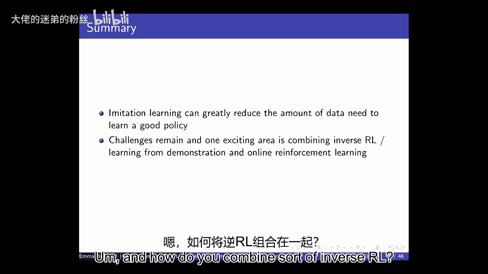

# P7：Lecture 7 - Imitation Learning - 大佬的迷弟的粉丝 - BV1Cc411h7QQ

 All right， so homework two， you guys are probably starting to work on。

 We're having sessions this week that are good for if you don't have background and deep， learning。

 Feel free to reach out and be out。 Oh， yeah。 Just to make sure it seemed perfect to note on the charts that it's like either default。

 or suggested ones。 Can we also do something outside of that？ Questions is a great one。

 The post on Piazza， you're always welcome to design your own project。 That's always completely fine。

 A number of you have come talk to me about those or talked to other TAs。

 These are an additional option。 So if people are interested in looking at either the default project。

 which we released yesterday， which is to do with Bandits and Warfarin。

 or if you want to look at some of the suggestions， from senior PhD students or postdocs。

 those are great opportunities。 Particularly， I think if you haven't ever done reinforcement learning before。

 it's often， I wouldn't expect it three weeks in that you'd be able to defy the state of the art project。

 So if you're interested in learning more about RL research， then it can be a really great。

 opportunity to look at some of those suggested projects that reach out to people。 All right。

 The other thing that I just wanted to do a friendly reminder about is we explicitly post。

 FAQs for each of the homeworks。 And some of the CAs are mentioning that some of the students coming into ops hours right。

 now might not have had a chance to look at those。 So if you have a question when you're going to learn with homework。

 the first thing to， do is to go to Piazza and particularly to look at those pin notes at the very top。

 which， have very common FAQs about the assignment。

 So make sure to read those before you go to office hours。 And then， of course。

 feel free to come to office hours as well。 But those are a really good resource to look at。

 Any other questions？ All right。 So just in terms of where we are in the course right now。

 we went through DQN on Monday。 We're going to talk today some a bit more about-- we're going to wrap up some of the。

 stuff that I had to rush through at the end of Monday in terms of deep Q learning and some。

 of the recent extensions。 And then we're going to talk some about imitation learning in large state spaces before next week。

 starting to talk about policy gradient methods。 So just as we'll start off with a refresher from what DQN was doing。

 DQN was this idea， of combining between Q learning and using deep neural networks as function approximators。

 And the two key sort of algorithmic changes compared to prior work was that they used。

 experience replay and fixed Q targets。 And by fixed Q targets there。

 that was meaning that when we used our RRT plus gamma max over， a Q of STAST plus 1。

 that the weights that were used for that Q representation were fixed， for a while。

 So maybe we'd update those every 100 steps or every 50 episodes or some interval。

 And so this provided a more stable target for supervised learning because the supervised。

 learning part， again， is that we had this combination of we want to have weights and。

 we want to minimize this error versus our current estimate。 So minimizing the TD error。

 So the way that this proceeded is that we'd sort of store transition in a replay memory， buffer。

 We do mini batches， we'd sample a bunch of state extra word， next state tuples and then。

 do these backups where we're sort of updating our Q function and refitting our Q function。

 And like a lot of the linear value function methods we saw before， it uses stochastic gradient。

 descent。 And the really cool thing about this is that they did it on 50 games。

 They use the same architecture for those 50 games and the same hyper parameters and they。

 got human level performance。 So we've talked quite a lot about that before and then we sort of briefly talked about three。

 sort of major extensions to that in the immediate following years。 And again。

 there's been a lot of extensions and a lot of work in deep reinforcement learning， right now。

 But three of them were as follows。 The first was double DQN and we talked before we got it to functional approximation talking。

 about the issue with maximization bias that when you're using the same representation。

 to pick an action and estimate the value of that action， you can get into a maximization。

 bias problem。 And the way that that's avoided in double DQN。

 and I wanted to go over this again because， I had a couple of questions after class。

 we didn't have much time to discuss it， is what， happens is we have a current Q network which is parameterized by a set of weights and that。

 is what is used to select actions。 To be clear here， often we're doing some sort of E greedy method。

 So we'd use the current Q network weights to decide on the best action and we would pick。

 that with one minus epsilon probability。 And then there is an older Q network that is used to evaluate those actions。

 So if we look at how we're going to be changing our weights， we're going to be having an action。

 evaluation using these other weights， W minus， and then action selection using W。

 So when you look at this， it might start to look pretty similar to what DQN was doing。

 Because DQN was saying we're going to use a fixed set of weights for these target updates。

 So what DQN was doing was this R plus gamma Q， I'll write the max in。 And then the max， R， A。

 Q of S prime， A， W minus， minus the current S。 So in the normal DQN， they were also using a W minus。

 But here in a double DQN， it can be a little bit different。

 And the reason it's a little bit different than what we just saw is that you can maintain。

 two sets of weights at all times and you can flip between them on every step or every batch。

 So when DQN was introduced， it was more of an idea of you fix your weights， let's say。

 from time step T to time step T plus 100， use the same weights that whole time period。

 for your target。 In double DQN， you don't necessarily have to do that。

 you can flip back and forth between， these， which is what we'd seen with a double Q learning that on step one。

 you could use， weights one to act and weights two to evaluate。 On step two。

 you could do weights two to evaluate and weights one to act。

 So it means that you can propagate information faster。

 So instead of waiting 50 episodes or 100 episodes to update the weights that you're using for。

 your target， so again， this is your target， you can flip back and forth between them， which。

 allows you to update both networks a lot。 Both of them， both of them， the network weights。

 the networks are identical。 Yeah。 In general， when we're evaluating these kinds of different approaches to improve these techniques。

 is there basically a trade-off between how fast the information propagates and then how。

 unstable it is？ So we might find that if the system we're trying to learn on is itself relatively well-behaved。

 and stable， we want to pick something that has faster information propagation， but if it's。

 highly noisy or unstable that we need to do something that's more conservative。 Make a suggestion。

 which is， you know， is there generally a trade-off in terms of these。

 methods between sort of characterizing the stability of the system and then how fast。

 you can propagate information back？ Unfortunately， I feel like it's not very well characterized。

 So I feel like most of the time these are heuristics and people evaluate them， they evaluate them。

 a lot of different benchmarks and that's sort of the way we get generalization。

 But I don't think that there's a good characterization systematically of how to characterize the stability。

 of the system with these deep neural networks， particularly in the context of RL。

 So there's a lot of great opportunities for theoretical analysis here too or just sort。

 of more formal understanding。 Right now I think we're at the level of saying this either just seems to consistently work。

 a bunch across Atari games and maybe Moojoko or it doesn't try to characterize the successes。 Yeah。

 Yes。 I was wondering if you talk a bit more about the switching that you're referencing and。

 like why how。 Yeah。 So the question is about， you know。

 how could we switch between these W and W minus and how， would you， you know。

 why and how would you do this？ So in the DQN setting you could set W minus。

 So at the beginning W minus is equal to W on time step zero。

 And then in DQN you would keep W minus to be the same， maybe for the next 50 episodes。

 but you'd be updating W。 And then 50 episodes in you would update W minus。 The downside about that。

 which we talked a little bit about before is that you're not。

 using the information you're getting to update this estimate because you're using that old。

 stale set of W。 So essentially you're just not using the information you've got over those 50 episodes to update。

 what would happen if you got an S prime and took action A。

 So an alternative would be to flip between， let's say， instead of thinking this is W and， W minus。

 you can think of it that way。 You can just think of maintaining two different sets of weights。

 And imagine， I'll say this is T times equals one， time equals two， time equals three。

 So imagine that we're just picking between what are the weights that we used to select。

 an action and that weights that we use to evaluate the action。 So on the first time step。

 you could use this to evaluate and this to select the action and。

 then you could flip it back and forth。 So that essentially means that both sets of weights are getting updated very frequently。

 So instead of updating only one of them every 50 episodes， you're continuing to propagate。

 that information back quickly。 And there's of course tons of choices here about how frequently do you update。

 you know， when do you switch back and forth between these。

 You can think of all of those as hyper parameters you can imagine tuning。

 But this is instead of keeping that， keeping this target fixed for 50 steps or， you know， end steps。

 these are all parameters， you could flip back and forth between them， which is。

 what double Q learning did before。 Yeah。 In the normal DQN setting。

 when we're using a target weight， when that target weight， like。

 for action selection or for like evaluations， there'll be another Q network。

 So how is that different from double QN， except for the fact that your selection is a little。

 bit more often。 It is almost， the question is how different is this from the previous year？

 It's almost identical。 So I think the main difference here is that you could switch。

 as long as you're maintaining， some set of weights for your target。

 this is saying you could sort of switch。 Now you really just have you have the same network。

 two sets of weights that you have to， maintain in memory。

 And what this is saying is you can switch back and forth with those very frequently and。

 help avoid the maximization bias during that time。 It doesn't always work。 It frequently helps。

 There is still the issue with stability， but it can be better and it avoids the maximization， bias。

 We also talked about prioritized experience replay。

 We went through a small sort of tabular example where we looked at the impact of doing backups。

 So if we have this experience replay buffer of SARS prime tuples， which one should we use。

 to do our backups and how do we propagate that information back。 And in this paper。

 they talked about the fact that if you can do this optimally， in some。

 cases you might get an exponential speed up in convergence， but it's hard to do that。

 It's computationally intensive。 So what they proposed here is to prioritize something based on the size of sort of the。

 DQ and error， the difference between the current estimate of it and your sort of target estimate。

 that you're looking at。 And so we talked about how you could use that as a priority and it could be a stochastic。

 priority to try to select items。 And we also talked about the fact that if we set alpha equal to zero。

 this becomes uniform。 And so then there's no particular prioritization over your tuples。

 And then the thing that we had almost no time to talk about was dueling。

 So dueling was the best paper from 2016 in ICML。 Let me just give a little bit of refresher on this because we went through it very。

 very， fast。 So the intuition here is that the features that you might need to write down the value。

 of a state might be different than those need to specify the relative benefit of different。

 actions in that state。 And you want to understand the relative benefit of actions in order to decide what your policy。

 should be。 So looking at things like game score， it's obviously very relevant to the value， but it。

 might be you might want other features to try to decide what actions to do right now， in a game。

 And so the advantage function that came up that was designed by Baird a long time ago。

 and this is the same Baird that had that counter example to show why value function。

 approximation can be bad。 So Baird's work before it said， well， look， you can decompose。

 you think of your Q function， which is representing the value of a policy starting in state and taking a particular action。

 versus the value of just that state。 So this is sort of implicitly Q pi s pi s。

 So like what is the difference between taking this particular action versus just following。

 your policy from the current state？ And he called this the advantage。

 The advantage of that action for that state。 So in Dooling DQN。

 instead of having one network that just predicts Q functions， they use an。

 architecture that separates into predicting values and predicting these advantage functions。

 and then adds them back together。 With the idea being that you might get different sort of features here and here。

 So you'd sort of decouple for a little bit to make sure that you're capturing the features。

 that are relevant to capturing the salient things you want to look at for Qs。

 Now one thing that I mentioned very briefly last time is that is the advantage function。

 identifiable？ And what do I mean by that in this case？ I mean that if you have a Q function。

 which is what ultimately we're going to use， can， we decompose it into a unique A pi and B pi？

 So here ultimately we want a Q。 And the question is if we then are in architecture decomposing this into a value and an advantage。

 is there a unique way to do that？ But there isn't。 So if you add a constant to both Q and B。

 then you can get the same advantage function。 So there's not a unique。

 you can always shift your words by a constant and that's not going， to change your policy。

 will change your value function。 So there's lots of different ways to decompose your advantage function and your values。

 It's not a unique decomposition。 So the way that they defined it there is to say。

 well let's force the advantage for state， and action to be zero if A is the action taken。

 So here they compare it to the action that's taken if you're using sort of say a greedy， approach。

 This is really just a way to， all of this we can think of in some ways as an analogy to。

 supervised learning。 So we want to have a stable target and we want to be able to learn these advantage functions。

 and these value functions if we had lots and lots of data about them。

 So this is sort of choosing a particular fixed point for how to define the advantage function。

 And then they also said， well empirically you could just use the mean to， so you could just。

 average over your advantage functions。 It's more a stochastic approach。 And what they find， again。

 so we sort of were layering up these additional techniques。

 We started with DQN and we thought about adding double Q learning to DQN and then we thought。

 about adding prioritized replay。 And then this is dueling and what they find is that dueling versus double DQN with prioritized。

 replay is a lot better most of the time。 Now let me see if I can find Montezumas。 Yep。

 So for Montezumas， this new method is basically no better。

 I think none of these methods are really tackling hard exploration problems but they are doing。

 better ways of sort of propagating information in the network and trying to change the way。

 we're training the network。 Yeah， question in the back。 A name first please。

 Can you speak a bit louder than I'm able to hear you。 Okay， I'll try to speak a little bit louder。

 Can people in the back over there hear me or is it just a pen？ Good。 All right。

 so these were three of the methods that ended up making a big difference。

 We talked very briefly about practical tips。 I won't go on these too much。

 The main thing is just that we try to actively encourage you to build up your Q&A representation。

 first before you try an Atari。 You can try different forms of losses。

 Learning weight is important but in this case in our assignment we're going to be using。

 the atom optimizer which means that you don't have to worry too much about it。

 This issue of sort of trying different exploration schemes is something that we're going to talk。

 about later in this class。 So for right now we're still thinking about just simple e-greeti approaches。

 A nice paper that came out， I think it was started 2018， was Rainbow which was a paper。

 that basically just tried to combine a whole bunch of these recent methods to see really。

 how big of an improvement do you get。 Now， again note in this case and we'll come back to this in just a couple slides。

 This is a lot of data。 There's a lot of experience in the world， 200 million frames of experience。

 They developed an algorithm called Rainbow that combines a lot of the things we've just。

 been talking about， double DQN， prioritized and Dooling as well as some other recent advances。

 Noisy is one that also tries to do some different forms of exploration。

 So they found that kind of by adding these improvements together then you could get a。

 significant improvement。 I think this is a useful insight because often it's not clear whether or not these different。

 gains are additive or if they're just sort of， they're kind of doing the same thing but。

 maybe in a slightly different way。 And so it's nice to see that in some of these cases these different sort of ideas are additive。

 in terms of the resulting performance gain。 These aren't sort of。

 this is still a very large amount of data。 Okay， so just to summarize。

 which are wrapping up where we are with model-free deep neural， networks for RL right now。

 They're very expressive function approximators。 You should be able to understand how you represent the Q function and you can do some Monte。

 Carlo based methods or TD style methods。 And at this point it's sort of good to make sure you understand how you would do that。

 with tabular methods， with linear value function methods and with deep neural networks。

 So sort of algorithmically it looks very similar across all of those but then you， in some。

 cases you have to do this step of doing function approximation in other cases you don't。

 And then it would be good to just make sure you can sort of list a few extensions that。

 help beyond DQN and why they do。 Alright， so now let's go back to our sort of high level view of what we want from a reinforcement。

 learning algorithm。 These algorithms that are sort of doing optimization， handling generalization。

 doing exploration， and doing it all， statistically and computationally efficiently。

 And we've just been spending quite a lot of time on looking at generalization as well as。

 optimization。 But we haven't talked very much about efficiency。

 So one of the challenges is that if you wanted to find efficiency formally like in terms of。

 how much data an agent needs to learn to make a good decision， there are hardness results。

 that are known。 So our lab has developed some lower bounds， other people have too。

 I think we now have basically tight upper and lower bounds for the tabular MDB case which。

 indicate that there are some really pathological MDPs out there for which we just need a lot。

 of data。 Not a data that you know would not scale very well as you start to go up to really huge domains。

 So some of these problems are really hard to do。 Formally you just need a lot of exploration。

 We can do something much better than e-greety but we'll talk about that soon。

 But even when we do those much better things than e-greety we can prove that it's still。

 really hard to learn in those we still might need a lot of data。

 So an alternative is to say well there's lots of other supervision that we could have。

 in the world to try to learn how to do things and so how can we use that additional information。

 in order to sort of speed reinforcement learning。 So what we're going to do is talk about some about imitation learning today and then we're。

 going to start talking about policy search and policy gradient methods next week。

 And those you can also think of as another different way to impose structure because in。

 policy gradient methods you always have to define your policy class。

 Sometimes that can be a really rich policy class and so maybe that's not too much of。

 a limitation but other times you're encoding domain knowledge by the class that you represent。

 Okay and in particular we're going to be thinking about imitation learning in large。

 state spaces which is exactly the place where you might hope to benefit from additional。

 helper supervision。 So if we think about something like Montezuma's revenge there's some nice work on looking。

 at sort of how far did DQN get in this case。 So Montezuma's revenge for those of you who haven't played it is sort of a very long horizon。

 game in which you're sort of trying to navigate through this world and like pick up keys and。

 make decisions and it involves a lot of different rooms。

 So you can see here what the outline is of all the white squares are basically rooms。

 and on the left hand side sort of a DQN that was trained for 50 million frames only gets。

 through the first two rooms。 It's just doing very badly it's not making very much progress。

 Whereas on the right hand side we see something which is explicitly trying to explore and。

 it uses some of the techniques that we'll be talking more about later but notice that。

 it still doesn't get all the way through the game。

 And so I think this sort of illustrates the fact that some of these games are really hard。

 There has been some really nice additional progress since both with me and Percy Lang's。

 web we now can basically sell Montezumas and there's also been some really nice work。

 from Uber AI lab on solving Montezumas but a lot of the places that people originally。

 got traction on this was by starting to use imitation learning demonstrations。

 So in particular if we think about cases where ARL might work well， ARL works pretty well。

 when it's easy or certainly we've seen a lot of success so far when data is cheap and。

 parallelization is easy and it can be much harder to use the methods that we've talked。

 about so far when data is expensive and when maybe failure is not tolerable。

 So if you try to use the methods that we just described to learn to fly like a remote control。

 helicopter typically require a lot of helicopters because they would be a lot it would be very。

 expensive and so there's many cases where this type of performance is just not going。

 to be practical。 So one of the benefits is that if you can give the agent a lot of rewards you can shape。

 behavior pretty quickly。 So one of the challenges in Montezumas revenge is that reward is very sparse。

 The agent has to try lots of different things before it gets any signal of whether it's doing。

 the right thing。 And where do these rewards come from？

 I think this generally is actually a really deep question but for right now let's think。

 about sort of just even the challenge of specifying rewards。

 So if you manually design them that might be pretty brittle depending on the task。

 And an alternative is just to demonstrate。 So if you have to write down the reward function for driving a car it's quite complicated like。

 you don't want to hit roads。 Here hit the hit people you don't want to drive off the road you want to get to your。

 destination and so it's very complicated reward function to write down but it's pretty easy。

 for most of us to just drive to a destination and show an example of maybe an optimal behavior。

 So that's sort of the idea behind learning from demonstrations。

 There's been lots and lots of work on this but since people started thinking about learning。

 from demonstrations or imitation learning I would argue probably that this was started。

 roughly 20 years ago around 1999 2000 was a paper which started to think about learning。

 rewards from demonstration。 But then there's been lots of applications to it since so thinking about it for things。

 like highway driving or navigation or parking lot navigation。

 There's a lot of these cases particularly in driving right now but where people have been。

 thinking and robotics to to think about how do you do demonstrations of like how to pick。

 up a cup or things like that to try to teach robots how to do those tasks。

 There's also some really interesting questions too about like you know how do you do things。

 like path planning or goal inference and again these sort of cases where it's quite complicated。

 to write down a reward function directly or it might be brittle。

 And the problem with brittle reward functions is that your agent will optimize to that and。

 it may not be the behavior that you wanted。 So the setting from learning from demonstrations and today I'm going to be somewhat informal。

 about whether I call things learning from demonstrations。

 There's also inverse RL and there's also imitation learning。

 And there are sort of differences but a lot of these things are somewhat interchangeable。

 Most of this is about the idea of saying that you have some demonstration data and then。

 you're going to use it in order to help either bootstrap or completely learn a new policy。

 So the idea is that you might get an expert and maybe they're a perfect expert or maybe。

 they're a pretty good expert to provide some demonstration trajectories of taking actions。

 in states。 And in many cases it'll be easier for people to do this but it's useful to think about。

 when it's easier to specify one or the other and what situations are common for each。

 So what's the problem setup？ The problem setup is that we have this state space and action space。

 some transition model， that is typically unknown， no reward function and instead sort of a set of teachers demonstrations。

 from some particular， we assume for now optimal policy。

 And in behavior cloning we're going to say how do we directly learn the teacher's policy？

 So how do we try to， how do we get sort of an approximation of pi star directly from。

 these demonstrations？ Invers RL is typically about saying how can we recover the reward function？

 Once we have the reward function then we can use it in computer policy。 And that often。

 that last step often is combined with apprenticeship learning。

 So that we were both trying to get that reward function and then actually generate a good。

 policy with that。 In some cases you might just want the reward function。

 Can anybody think of a case where you might be interested in just the reward function？

 Maybe you don't want to recover the policy but you're just curious about what the reward。

 function is of another agent。 Okay。 >> [INAUDIBLE]， >> Yeah。 >> [INAUDIBLE]， >> Yeah。

 >> [INAUDIBLE]， >> So I think this is a great example。 So in a lot of science， biology， et cetera。

 you often want to understand the behavior of organisms， or animals or things like that。

 And so if you can just look at their behavior， you could say， track monkeys or things like。

 that and then use that to back solve。 Like what is their reward function？

 What are the goals or preferences？ I think there's a number of cases where that's useful and maybe down the line。

 maybe there's， some optimization that will happen。 But generally， often there。

 it's just about understanding like what is the goal structure。

 or what is the preference structure of the organism or individual。

 That could happen with people too that you might want to understand like the choices people。

 are making in terms of commuting or in terms of buying preferences or things like that。

 Maybe later you want to optimize for that， but also you're just curious about how do。

 people's behavior reveal the sort of an underlying reward structure or underlying preference model。

 Yeah。 >> [INAUDIBLE]， >> Yeah。 >> [INAUDIBLE]， >> Yeah。 >> [INAUDIBLE]， >> Yeah。 >> [INAUDIBLE]。

 >> Yeah。 >> [INAUDIBLE]， >> Yeah。 >> [INAUDIBLE]， >> Yeah。 >> [INAUDIBLE]， >> Yeah。

 >> As the nice question of like， is the experts behavior an upper bound or are there cases。

 also where the agent can go beyond this？ We're not going to talk too much about this today。

 but there's a lot of work right now， on combining imitation learning with RL。

 So there's a lot of work on say like inverse RL plus RL where for example you might use。

 this to bootstrap the system and then your agent would continue to learn on top of this。

 There's also some nice work from Peter Beals group where they looked at assuming that。

 the expert was providing like a noisy demonstration of an optimal path。

 And so the goal is to learn the optimal path， not the noisy demonstration of it。

 So often you do want to go beyond the expert。 There's limitations to that and we'll talk about that in a second actually。

 What are some of the limitations that you might have if you don't get to continue to。

 gather data in the new environment？ Okay。 So let's start with behavioral cloning which is probably the simplest one。

 Because essentially in behavioral cloning we're just going to treat this as a standard supervised。

 learning problem。 So we're going to fix a policy class which means sort of some way to represent our mapping。

 from states to actions。 And this could be a deep neural network， it could be a decision tree。

 it could be lots， of different things。 And then we're just going to estimate a policy from the training examples。

 So we're just going to say we saw all these times we saw a state and an action from our。

 expert and that's just our input output for our supervised learning model and we're just。

 going to learn a mapping from states to actions。 And early on。

 so this has been around really for quite a long time and I should have said， more like 30 years。

 there were some nice examples of doing this。 So Alvin was a very early paper and system about thinking about driving down the road。

 seen a neural network and was trained at least in part using behavioral cloning or supervised。

 learning to imitate trajectories。 Okay， so let's think about why this might go wrong。 And to first。

 let's think about what happens in supervised learning。 So in supervised learning。

 we're going to assume IID pairs， SA， and we're going to ignore the， temporal structure。

 So if we're just doing supervised learning in general， we just imagine that we have these。

 state action pairs and then maybe we learn some classifier or， yeah， let's just say a。

 classifier to classify what action we should do and it might have some sort of errors。

 It might have errors of probability epsilon。 And so if we were thinking about doing this over the course of T time steps。

 then we might， have expected total number of errors of epsilon times T。

 So let's just take a second and think about what goes wrong when we're doing this in the。

 supervised learning or in the RL context。 So by the RL context。

 I mean the fact that the decisions that we make influence the next， state。

 So let's just take like one minute， maybe talk to you your neighbor and say like， what。

 do you think could be the problem with behavioral cloning and these sorts of scenarios？

 And if that's a simple thing to think about， then maybe think about how you would address， it。

 So what you might do in that case if there is problems that happen when we try to apply。

 standard supervised learning to this case where it's really underlying an MDP。 [ Pause ]。

 [ Background Conversations ]， [ Background Conversations ]， >> All right， so first of all。

 let's just make a guess。 I'm going to ask you guys whether you think the total expected errors。

 if we're doing this in where the underlying world is an MDP。

 is going to be greater than or less than the number of errors that we'd expect according to a supervised learning approach。

 So who thinks that we're going to have greater expected total errors？ Okay。

 so who thinks we're going to have less？ Who many people must be confused？ [ Laughter ]， >> Okay。

 so how about so many who thinks the answer is that we're going to have greater？

 Maybe somebody who thinks that's the case could say why they think we might have more errors if the real world is MDP and we've tried to do the supervised learning technique。

 Yeah， and name first please。 >> My idea is that kind of like as a human you're planning a more long term horizon or like you're doing one step and then you know how that action is going to then give you like another sequence。

 But since we just start taking a state in action and then like predicting right from there we can't plan that long term sequence so it's going to like compound our errors as we go。

 >> That's right。 This is a quick way we will compound those errors and one of the challenging aspects of this is that the errors can compound a lot。

 And this is because the distribution of states that you get can depend on the actions that you take。

 So if you think about this like a navigation case like if I was supposed to go out the right hand door and I watched and go out this door and I saw that he went right and I tried to learn a supervised learning classifier for what I should do here。

 My supervised learner was a little bit broken and so instead of going right here I actually went left。

 Well now I'm in part of the room which I never went to because he was going over there to go to the door and so like now I have no idea what to do here。

 Like now I'm in the state distribution is something that I haven't seen before。

 It's very likely that I'm going to make an error。 In fact my probability of error now may not be my probability of error here is under assuming the fact that the data that you get in the future is the same distribution as the data you got in the past。

 Our supervised learning guarantees generally say when we have them that if your data is comes from an ID distribution then in the future this is what your test is。

 The problem is that in reinforcement learning and Markov decision processes your actions determine what is the data you're going to see。

 So the fact that instead of following the right action here I went over here and now I have no data and my data distribution is different。

 So now there's no guarantees for my super bullet by his learning algorithm because my data is different。

 It's never been trained on anything like that so it can't generalize。

 So that's exactly the problem and this was noted by like Drew Bagnell's group from CMU in 2011 of arguing that this is a really big problem for what's called behavioral cloning。

 So even though there'd been some nice empirical demonstrations of it he and his former students took on Ross indicated why this might fundamentally be a very big problem and sort of demonstrated some things that people had sometimes seen empirically。

 So the idea is that as soon as you deviate so this is the time where you make your mistake then essentially the whole rest of the trajectory might all be errors。

 You might make team or team or errors and so that means that the total number of errors that you make is not expected。

 Epsilon times t but is that's one times t squared it's much worse。

 And it's really due to these compounding errors leading to you to a place where your distribution of states is very different than what you have data about。

 And this issue will come up again again to sort of a quote this thinking about what is the distribution of states that you get under the policy or following versus the policy that you want to follow that issue comes up again again in reinforcement learning。

 So it really is this sort of foundational issue that you know what is the data distribution you're going to get under the policy that you've learned versus the true policy and looking at this mismatch。

 And so once you go off the race course you're not going to have any data about that。

 So one of the ideas that drew back now and his students came up with to think about this was to say well what if we could get more data。

 So what if when I you know my I only able to mail data to start with I've learned my my supervised learning policy to say you know what should I do in each date and sometimes I make a mistake。

 So sometimes you know I go out that way my race car drives off the race course。

 What if I could know what to do in that in that state。

 So I reached a state that I don't have any data about what if I could ask my expert。

 Hey what should I do now。 So like I go over here and I'm like oh my god I don't know you know what to do now。

 And then you ask your expert and they're like oh just turn right it's fine you can still get out of the right door。

 It's okay。 So if you could ask your expert for labels well now you're getting labels about states that you are encountering。

 And as long as all the as long as you have data that covers all the states that you're going to potentially experience then you're then your supervised learning should do pretty well。

 The bigger issue tends to come up with the fact that you're in counting in states that you don't have any coverage of your training data。

 So the idea of Dagger which sort of data set aggregation is essentially you just keep growing your data set。

 So what happens in this case is you start off you don't have any data you initialize your policy you follow your policy。

 So in this case we're going to assume that you have an expert some expert policy。

 So that might be you know an expert is taking some steps and then also your other policy you can you collect a trajectory。

 So sometimes you're following one policy sentence you're not and then what you get is you get this state you get to go ask your expert for every single state。

 What would you have done here？ So yeah for every state that you encountered in that trajectory and then you add all of those tuples to your data set and you train your supervised learning policy on that。

 So everything inside of your data set that you're using to train your policy on is with an expert label。

 And you're slowly growing the size of that data set。

 So the idea is you're sort of getting more and more experts more and more labels of expert actions across the the strategies you've actually seen。

 And there's nice formal properties for this so you can be guaranteed that you will converge to a good policy by following this under the induced state distribution。

 Yeah。 Just to confirm this is assuming we have a star of all states。

 What are we doing in the case where we don't have the expert。 Yeah。

 no this is a quick question so when I was looking at this just now I would have to tell check I think this is assuming your expert can give you the action there。

 It doesn't assume that you have explicit access to pie star because if you had explicit access to pie star you wouldn't need to learn anything。

 I think in this case it's like tossing a coin about whether the expert just directly gives you the action in that case or whether you follow the other policy。

 Which because you have to have the expert around all the time anyway because they're always going to have to eventually tell you what they would have done there。

 That's how you get that data set。 So that's。 And I'm curious about how this is done efficiently。

 I can imagine that for some situations having a person sit the command line while your your GPU trains and inputs actions won't be efficient。

 How do people generally do this in such a way that doesn't require manual intervention。 Yeah。

 it was a great one which is you know， well this requires you have an expert either around for every single step or like at the end of the structure that can go back and label everything and that's incredibly expensive and you if you're doing this for you know millions and millions of time steps that's completely。

 I think that's why this this line of research has been less influential in certain ways than some of the other techniques that we're going to see next in terms of how you do sort of inverse RL。

 So what this is really assuming is that you have this human loop that's really in the loop as opposed to just asking them to provide demonstrations once and then your algorithm goes off。

 And I think that practically in most cases it's much more realistic to say you know drive the car around the box 10 times。

 but then you can leave and we'll do all of our rl versus saying I need you to be in the car or you know like label all of the trajectories that the car is doing and keep telling me whether it's right or wrong。

 I think this is just very label intensive it's very expensive。

 So I think that in some limited cases like if your action rate is very slow。

 Like if your action rate is you know making decisions in the military or no others would have very high level very sparse decisions this could be very reasonable because you could basically throw you know infinite compute at it before between each decision making。

 If you're doing this for sort of real time hurts level decisions I think that's very hard。 Yeah。

 With an expert taking over the system right like somebody sitting behind a wheel letting an agent drive and then all like recognizing that there's an emergency situation coming up and taking the wheel。

 Yeah so like so is this compatible with sort of an expert taking over。

 Yes I mean I think and that might be an easier way to get labels so you might say if you have an expert there every action that's taken that's the same as the action the expert would take maybe they don't intervene otherwise they only provide labels。

 Or interventions when it would differ but it still requires like an expert to be monitoring which is often still mentally challenging essentially you know it's still high cost。

 Alright so that that is a nice I mean it's very nice to see sort of their formal characterization of why behavior cloning can be bad and what is the reason for this。

 And I think that dagger is can be very useful in certain circumstances but there's a lot of cases where just practically it's much easier to get an example demonstrations and then assume that there's no longer a human in the loop。

 Alright so inverse RL is more of one of the second categories。

 So what does what happens in inverse RL well first let's just think about you know feature based reward function。

 So well okay we'll get to there in a second so again we're thinking about this case where we have some transition model that we might not observe or maybe we do in a lot of the techniques here to start with they did assume that you knew the transition model。

 That's pretty strong for a lot of real world domains but in some cases that's reasonable so for right now we're going to assume that the only thing that we don't know is their award function。

 There's some extensions to when you don't know the transition model to。

 So then we have again our set of demonstrations and the goal now is not to directly learn a policy but just to infer the reward function。

 So if I don't tell you anything about the optimality of the teachers policy。

 What can be referred about their work function。 I could say like it's not an expert it's just demonstrations。

 If you get a demonstration of a state action state etc。 Can you infer anything about our。

 If you don't know anything about the optimality。 I'm going to be the same as samples or you get more demonstrations are approved like our story。

 This is assuming no assumptions about optimality。 So if I don't tell you anything about the optimality of the policy or scene。

 Is there any or any information you can gather in that case。

 Or you'll be able to say that the choice of the teacher may under their policy。 Just right。

 For that particular person you could say something about。

 For their reward function assuming that they're rational agent that that that was higher in their own function。

 That's true。 But if you want it to be about the general word function。

 This would tell you maybe I'm staying it so that it seems a little bit more。

 Subtle that I mean it to be it doesn't tell you anything right like if you if you see me like wandering around。

 Like if you see an agent flailing around right and you know nothing about whether it's making good decisions or not。

 With respect to the true reward function demonstrations don't tell you anything like they don't give you any information about the word function。

 Unless you're trying to make it an assumption that the agent is acting rationally with respect to the true reward function。

 Or maybe you can get some information about their internal one like what you're saying。

 But in general if we don't make any assumptions about agent behavior and we don't assume that they're doing anything optimal with respect to the global reward function。

 There's no information you can get。 Now the more challenging one is the next。

 So let's assume that the teacher's policy is optimal with respect to the true global reward function which the agent is also maybe going to want to optimize in the future。

 So you get expert driver performer driver driving around。

 This is I think for a second about what you can infer about their award function in this case。

 And whether in particular there's more than one reward function that could explain their behavior。

 So think about whether it's unique。 So let's say imagine data is no issue。

 I give you 10 trillion examples of the agent following the optimal policy。 10 trillion examples。

 And you want to see if you could learn what their word function is。

 And the question is is there a single reward function that is consistent with their data or their many。

 Maybe take a second to talk to somebody around you just to see whether there's the question really is there one reward function is their unique reward function。

 If you have infinite data so it's not a data sparsity issue versus money。 [ Inaudible ]。

 [ Inaudible ]， [ Inaudible ]， [ Inaudible ]， [ Inaudible ]， [ Inaudible ]， [ Inaudible ]。

 [ Inaudible ]， [ Inaudible ]， [ Inaudible ]， [ Inaudible ]， [ Inaudible ]， [ Inaudible ]。

 [ Inaudible ]， [ Inaudible ]， (indistinct conversation)， I'm gonna do a quick poll。 Okay。

 I'm gonna poll you guys， and I'm gonna ask whether you think， there is one reward function。

 or if there's more than one reward function。 So who thinks there's a single reward function？

 Infinite data， single reward function that's consistent。

 Who thinks there's more than one reward function？ Okay， can someone give me a reward function。

 that is always consistent with any optimal policy？ (keyboard clicking)。

 I guess what you need to do is， in the first step， just give the older report。

 that the teacher is going to have as a policy， and then the random after that。

 Maybe on the first step that you could make， give the most of the reward。

 that the agent would experience， and then be random after that。 So。

 and that might depend on the state。 I guess I was thinking of， can anybody tell me like a number。

 which would allow a specification of a reward function， like a constant。

 like a choice of a constant， which would make any policy optimal？ Yeah， in the yellow。

 - You just give a reward of zero for a reaction。 - That's right。 - Yes， that is exactly correct。

 If you give a reward of zero， any policy is optimal or respect that。

 You never get any reward anywhere。 It's a sad life， unfortunately。 And in this case。

 all policies are optimal。 So if you just observe trajectories， then one reward function for which。

 that policy is optimal is zero， but it's not unique。 So this issue was observed。

 I think it was by Andrew Ng， and Stuart Russell back in 2000。

 Where there is a paper talking about inverse RL， where they noted this issue。

 The problem is that this is not unique， without further assumptions。

 There are many reward functions that are consistent。 So we have to。

 we're gonna have to think about how do we break ties， and how do we impose additional structure。

 Yeah， in the back。 - If you have a consistent reward function business， if you add a constant。

 it's a lower reward。 It's also a relatively consistent reward function。 - There are lots。 Yeah。

 so they're， oh， remember my mirror name？ So yeah， what you said is， there's many。

 many reward functions。 So if you have a constant， everything has the same， any constant。

 but also be identical。 So there's generally many different reward functions。

 that would all give you， there are many different reward functions， for which any policy is optimal。

 And so that would mean that if you're trying， to deliver an inferior word function， given some data。

 there are many reward functions， that you can write down so that that data。

 would be optimal with respect to their reward function。

 And that second part is really what we're trying to get as。

 We're trying to sort of infer what reward function， would make this data look like it's coming。

 from an optimal policy。 If we assume that the expert is optimal。

 So let's think about also how we do this in， in large state spaces。

 So we're gonna think about linear value function， approximators， because again， often the places。

 where we particularly need to be sample efficient， is when our state space is huge。

 and we're not gonna be able to explore it efficiently。

 So let's think about linear value function approximator， and we're gonna think of this reward also。

 as being linear over the features。 So our reward function might be some weights。

 times some feature as representation of our state space。

 And the goal is to compute a good set of weights， given our demonstration。

 I already said that in general， this is not unique。

 but we're gonna try to figure out ways to do this， and different methods。

 So the value function for a policy pi， can be expressed as the following， I mean。

 just write it down as the expected value， of the discounted sum of rewards。

 And this is the states that you would reach， under that policy。

 Under the distribution of states that you get， under this policy， these are the rewards。

 So now what we're gonna do is re-express this。 So what we're doing now is this is gonna be。

 assuming a linear representation of our reward function。 So we can write。

 we can re-express it like this。 So we can write it down in terms of the features。

 of the state we reach on each time step times the weight。

 And then because the weight vector is constant， for everything， you can just move it out。

 And then you get this interesting expression， which is you basically just have this discounted sum。

 of the state features that you encounter。 And we're gonna call that mu。

 So we talked about this very briefly earlier， but now we're talking about mu as being sort of。

 the discounted weighted frequency of state features， under our policy。

 How much time do you spend in different features？ Or you know， basically how much time do you spend。

 in different states？ It's for the futureized version of that。

 Discounted by kind of when you reach those， because some states you might reach really far。

 in the future versus now。 So it's related to the stationary distributions。

 we were talking about before。 Now we're using discounting。 So why is this good？ Okay。

 so what we're gonna say now is that instead， of thinking directly about reward functions。

 then we can start to think about distributions of states， and think about sort of the probability。

 of reaching different distributions of states。 Different state distributions as representing。

 different policies essentially。 Different policies for a particular reward function。

 would reach different distributions of states。 And so we can think about using this formulation。

 for apprenticeship learning。 So in this case， we have this nice setting。

 for apprenticeship learning right now。 We're using the linear value function approximation。

 We call it apprenticeship learning， 'cause we're learning like the agents being apprenticeship。

 from the demonstrator。 So now we have this discounted weighted frequency， of the feature states。

 So we're always sort of moving， into the feature space of states now。

 And then we wanna note the following。 So if we define what is the value function for pi star。

 that's just equal to the expected discount， of some of rewards we reach。 And by definition。

 that is better， than the value for any other policy。

 At least it's good 'cause either pi is the same， as the optimal policy or it's different。

 And this is just equal to the same thing， same reward function， which we don't know。

 but under a different distribution of states。 So under the distribution of states。

 you'd get to if you follow this alternative policy。

 And so if we think that the experts demonstrations， are from the optimal policy。

 in order to identify W， it's sufficient to find W star， such that if you dot product that。

 with the distribution of states you got to， under the optimal policy， remember this is what we know。

 These are， we can get this from our demonstrations。

 This has to look better than the same weight vector， times the distribution of states you'd get。

 to under any other policy。 Any questions about that？ So it's by making this observation。

 that the value of the optimal policy， is directly related to the distribution of states。

 you get under it times this weight vector。 And that value has to be higher than the value。

 of any other policy， which is using that same weight vector。

 and just gives you a different distribution of states。 Yes？ - My question。

 I conceptualize you by nipple。 In fact， in problem rights， you assume that you need。

 to be placed in the environment of the main actor， to convert tests。

 So the very state of you in this case is sort of like。

 the stationary distribution of the proportion， of the degree to each state given the policy。 - Yes。

 In terms of conceptualizing you， what's the sort of a good way to think of it？

 Should we think of it as like the stationary distribution， of states？ Yeah。

 I think it's a reasonable sort of thing， of essentially the stationary distribution of states。

 weighted with this discount factor on top of it。 So it's very similar to the stationary distributions。

 we saw before。 All right， so essentially it's the same。

 We want to find a reward function so that the expert policy。

 and the distribution of states you reach under it， looks better when you compute the value function。

 compared to that same weight vector， under any other distribution of states。

 And so if we can find a policy， so that its distribution of states。

 matches the distribution of states of our expert， then we're gonna do pretty well。

 So what this says here is that if we have a policy， so the discounted distribution of states。

 that we reach under it is close to the distribution， of states that you got from your demonstration。

 So this is the expert。 So if that's small， then your value function error， will also be small。

 So for IDW， if you can basically match features， match feature expected features or match distributions。

 of states， then you're good。 Then you found a value that's gonna have。

 a very similar value to the true value。 So this actually means for any WT here。

 So it means no matter what the true reward function is。

 if you can find a policy so that your state features match。

 then no matter what the true reward function is， you know that you're gonna be close to the true value。

 Yeah。 - This still means that when you find you would be， used to calculate， I guess。

 an expectation， what your value is of state。 - Yeah， so you could， once you have a W。

 you can combine that with your muse， to compute a value of the state。 - Right。

 - Or you can sum over it。 - How do you， I guess， that translates directly。

 to being able to use that to make decisions， when you're out of state？

 - So I think the question is about saying like， okay， so if we're getting these Ws。

 or sort of what are we solving for resolving， for the policy or resolving for W， et cetera。

 In this case， I think a reasonable way to think about it， is solving for Pi。

 So what this is saying is that， let's say you're optimizing over Pi。 If you found a Pi。

 so right now we know the transition model， which is not always true。

 But if you know the transition model， for a given Pi， you couldn't compute mu。

 because it's just following。 Like you could do Monte Carlo rollouts， for example。

 So if someone's given you a Pi， and they tell you the transition model。

 you can roll that out and you can estimate mu of Pi。 And it's saying that if you do that。

 so let's say I have some policy， I roll this out a bunch of times。

 I estimate my mu and I check whether that seems， to be close to my mu of my demonstration policy。

 If that's small， this is saying no matter， what the real reward function is。

 you're gonna have the same value as， like you've matched the value。

 that you would get under the expert policy， so you're good， you could just use this policy that。

 Yeah。 - And I'm looking at the constraint， on the identity norm for W。 - Yeah。

 - And I don't quite see where that comes from。 I'm curious if I'm missing it here。

 or if we haven't gone over it。 - And here's what why we have this constraint over W。

 I would have to double check the details， to be careful about this， but I'm pretty sure it's there。

 so that as we do these backups， we do this approximation that your errors are all bounded。

 so that things don't explode。 And that when you do this proof。

 that I think I'd have to double check it， but I think you basically use holders inequality。

 and then you use the fact that the W is bounded， to ensure that your ultimate value is bounded。 So。

 I can check that。 In general， you want your reward function to be bounded， particularly in the。

 even with discounting， like it's useful， you always need to make sure。

 that your bellman operator is like a contraction， to have a hope of， I mean。

 we've already talked about the fact， that with linear value function approximated。

 and you don't always converge， but if your rewards are unbounded， it gets worse。 Yeah。

 - Trying to fit this into other things I'm familiar with。

 is this basically like a maximum likelihood， play of looking at the policy， right？

 Like if we flip to coin 100 times， and we got nine to nine heads and one tails。

 it's possible that came from a fair coin。 We can't discount that， but it's unlikely， right？

 So if we observe some expert agent doing the same thing。

 100 times that could come from a reward function， at zero everywhere， but not as likely。

 as some other reward function， is that--， - Oh， great question。

 - Is this sort of giving us some way to deal， with the fact that the reward could be zero。

 that we have this sort of unidentifiability problem。 This does not handle that， unfortunately。 So。

 this is still not guaranteeing that we couldn't， learn a weight that's zero everywhere。

 but what this is saying here is that， instead of thinking about trying to learn。

 the reward function directly， if you match， expected state features， then that's another way。

 to guarantee that your policy is basically， doing the same thing as the expert。

 So if you have a policy that basically looks like。

 that visits the same state and exactly the same frequency， is what the expert does。

 then you've matched their policy。 And you still don't necessarily know。

 that the W you've got is accurate， or is a good estimate of the reward function。

 but maybe you don't need it， because if you really。

 just care about being able to match the expert's policy， then you've matched it。

 Because if you visit all the states， with exactly the same frequency as what the expert does。

 you have identical policies。 So it's sort of giving up on it。 It's saying。

 we still don't know what the real reward function， is， but it doesn't matter。

 'cause we've uncovered， the expert policy。 - Is there like a nonlinear log to this。

 that might be more effective？ - Great question， yeah。 There's been a lot of work also on doing this。

 with deep neural networks。 I'll give a couple pointers later to sort of， other approaches。 Okay。

 so this sort of observation led to an algorithm， for learning the policy， which is you try to find。

 some sort of reward function。 Like that means you know a W， a choice of W。

 Such that the teacher looks better， than everything else， looks better。

 than all the other controllers you've got before。 So it makes it look like sort of the。

 this W for this state distribution looks better， than W for all other distributions。

 And then you find the optimal control policy， for the current W， which can allow you to then get。

 new， new because you have your transition model here。 And you repeat this until sort of the gap。

 is sufficiently small。 (mumbles)， Now this is not perfect。 If your expert policy is suboptimal。

 it's a little tricky how to combine these。 I don't want to dwell too much on this particular algorithm。

 It is not something most people use anymore。 People would use more deep learning approaches。

 But I think that the key things to understand from this。

 is sort of this aspect of kind of if you match date features。

 that that's sufficient to say that the policies， are identical。 It's actually that you're learning。

 Yeah。 I remind me your name personally。 - Is there any significance to using normal one。

 versus neither norm？ They norm two。 - Ah， good question。

 - Good question is why do we use norm one and equation seven？ That is actually important。

 It's not necessarily the only choice， but here this is saying you have to match on all states。

 That's what the norm one is saying here。 So you can think of mu pi really being of s。

 I'm not showing that explicit dependency here， but it's of s。

 And so what norm one is saying is that， when you sum up all of those errors， it has to be one。

 So really you're evaluating the error over all of this。

 You could choose other things to change the analysis。

 Norm one and an infinity norm tend to be particularly easy， to reason about when you start to do。

 when you're trying to bound the error， and the value function。 (mouse clicking)， Okay， so。

 there still is ambiguity that we've talked about。 So there's this sort of infinite number。

 of different word functions。 The algorithm that we just talked about， doesn't solve that issue。

 And so there's been a lot of work on imitation learning， and in reverse reinforcement learning。

 And two of the key papers are as follows。 The first one is called maximum entropy in reverse RL。

 And the idea here was to say， we want to kind of want to pick something。

 which has the maximum uncertainty， given that still respects the constraints。

 of the data that we have from our expert。 So we're saying we're really not sure。

 what the reward function is。 We may not really be sure what the policy is。

 but let's try to pick distributions， that have maximum entropy， sort of make least commitment。

 It's sort of the opposite of what we're fitting。 You kind of want to like under fit as much as possible。

 and only make sure that you match， in these expected state frequencies。

 So both of these methods and a lot of the methods。

 think very carefully about the expected state frequencies， you get and comparing the data you get。

 versus the data you have from the demonstrator。 These type of methods can be extended。

 to where the transition model is at node。 (mouse clicking)。

 Often that requires access to a simulator。 Often it means， so you can imagine。

 for the thing we had before， if you didn't have access to the transition model。

 but you did have access to ACTI in the real world， you could just try out new policies。

 see what your distribution of states are like， and how that matches your expert demonstration。

 And in fact， that's often what's done。 So maximum entropy in reverse RL。

 has been hugely influential。 And then the second one， and this is also a note。

 so also from Drew Bagnell's group， who is the same person that came up with Dagger。

 So that group's been thinking a lot about， and did a lot of nice contributions to inverse RL。

 And then in terms of extending this， to sort of much broader function approximators， Stefan O'Ran。

 who's here at Stanford， extended this to using deep neural networks。 And again。

 it's doing sort of this feature matching。 So the idea in this case。

 both of these methods compared to sort of the Dagger work。

 or assuming that you have a fixed set of trajectories， at the beginning。

 and then you're gonna do more things in the future。 And in particular。

 the general generative adversarial， inverse imitation learning， has these initial trajectories。

 and then is gonna allow the agent， to go out and gather more data。 So it can gather more data。

 it can compute the state frequencies， it can also use sort of a discriminator， to compare。

 one of the challenges is， writing down the form of mu， can be hard when you have a really， really。

 high dimensional state space。 So writing down a distribution of our images is hard。

 So what they do in this case， they mostly are focusing on mu-joko style tasks。

 like robot style tasks， where you'd have like a lot of different joints。

 but still hard to write down， nice distributions over that。 So what they focus on in this case。

 is thinking about things like a discriminator， that could tell between your expert demonstrations。

 and the trajectories that are being generated， by an agent。

 And so if you can tell the difference between those， then you're not matching。

 That's a nice insight， as I say that we could use these sort of， discriminators， GANS。

 and the discriminator function to try to figure out， how do we quantify what it means to have。

 the same state distribution， and really high dimensional state spaces。 So this is known as gale。

 and there's been a lot of extensions to gale as well。

 Earlier we said that there could be real practical benefits。

 to learning the reward function in certain situations。 It seemed like the takeaway though。

 is that we can't actually do that。 Is that the correct takeaway？ - Yeah， so for example。

 earlier is you were arguing that maybe there were ties， where we really want the reward function。

 but maybe you're telling us that we can't really do that。 I think in this。

 so we've mostly been talking about like， frequentist style statistics。

 when we're talking about statistical methods here。 From that perspective。

 it's often very hard to uncover the reward function。 One thing that's often people do。

 when they want to say， understand animal behavior， or things like that， is you have a prior。

 You can do another way to do this， is you have a Bayesian prior over reward functions。

 and then you do Bayesian updating。 So that given the data that you see。

 you try to refine your posterior， over the possible reward functions。 So it avoids。

 like then you could just not have your prior cover， that reward is zero everywhere， for example。

 So if you have a structured prior， that can be one way to still use information。

 to try to reduce your uncertainty， for people's or agents or animals reward functions。 Yeah。

 - What is the prior one to the word function？ Like， you know， it's sometimes the last thing。

 that's the statistics where you assume a prior， or a little hospital。

 you understand if you're a weak first of all。 - Yeah。 - What sort of prior leads are you？

 - It's a great question。 It says you must， you know， what are realistic priors for reward functions？

 It's a great question。 I think mostly it depends on the domain。 That people do use。

 I think we'll talk a little bit about it， for the exploration aspects。

 People do use priors over reward functions， for exploration as well。

 Things like Thompson sampling require you to do that。

 If you want it to be as close to frequentist as possible， often people do a Dirichlet distribution。

 over multi-nomials or things like that， or Gaussians and so you use conjugate exponential families。

 So everything's conjugate。 But those aren't necessarily realistic。 I think in real domains。

 the benefit probably of using these sort of priors。

 would be to really encode domain knowledge about， you know， whether people are risk sensitive。

 what sort of rewards you expect， to be reasonable in these cases。 - Yeah， I mean。

 I think to go back to point two， I think a lot of it does depend on what you want out。

 So if you really want to just understand， the reward function of the preference function。

 then we need to maybe do something Bayesian， or we need to try to have a method。

 that's going to help us uncover it。 I think what a lot of other methods ended up saying is， well。

 maybe we care about the reward function， but mostly we just care about getting high performance。

 So if we can uncover a policy， that's matching the expert policy， we're fine。

 Behavior cloning wasn't a good way to do that， because errors compound。

 but now there are these other ways that can do that better。 And so we're fine with that part。

 And again， I just want to emphasize like Sergei Lamin。

 and others have done work which really combines， like you can take Gaol and then go beyond that。

 in terms of exploration so you can end up， with a policy that's better than your demonstrator。

 which I think is good because often， like if your demonstrator comes from YouTube。

 which is nice because it's a freely available place， to get demonstrations。

 you don't necessarily know the quality。 So often you might want to use that。

 to sort of bootstrap learning， but not necessarily be limited by it。 All right。

 so just to summarize， in practice， there's been an enormous amount of work， on imitation learning。

 particularly in robotics， but in lots of domains。 And I think that if you're going to leave class today。

 and go out into industry， that imitation learning can be very useful practically。

 because often it's easier to get demonstrations， and it can really bootstrap learning。

 and complicated Atari games， et cetera。 But there's still a lot of challenges that remain。

 particularly in a lot of the domains that I think about， we don't know the optimal policy。

 So I think about healthcare or like customers， or education like intelligent tutoring systems。

 and all of those， one of the big challenges， that you don't know the optimal policy。

 and you're maybe doing all of this， because you think you can do something better。

 than what's in the existing data。 So that's a big challenge。

 And how do you combine sort of in BRS RL。

 and then maybe online RL in a safe way？ So one of the motivations I said for imitation learning was。

 oh， well， if you want to be safe， but then if you only say things right now， don't do very well。

 then you have to figure out， how to do safe exploration in the future。 All right。

 I think that's everything for today， and I'll see you guys next week。

 or we're gonna start to talk about policy search。 (clapping)， (buzzing)。

 You。