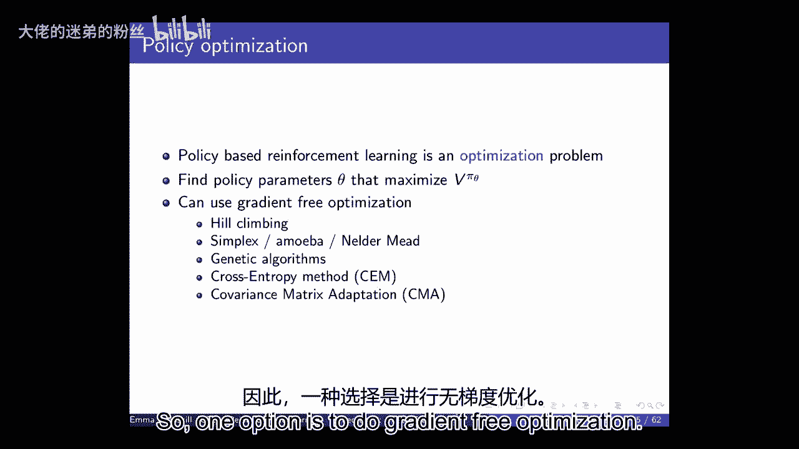
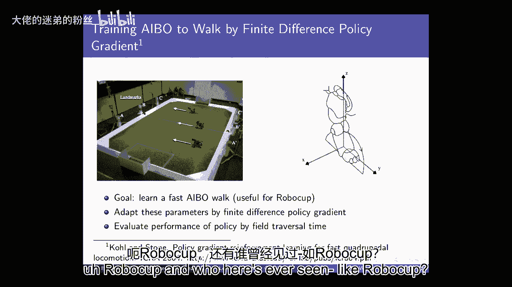
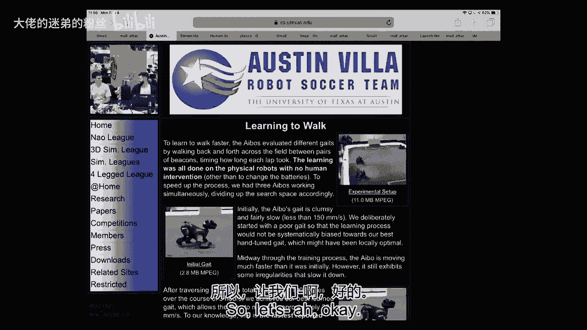
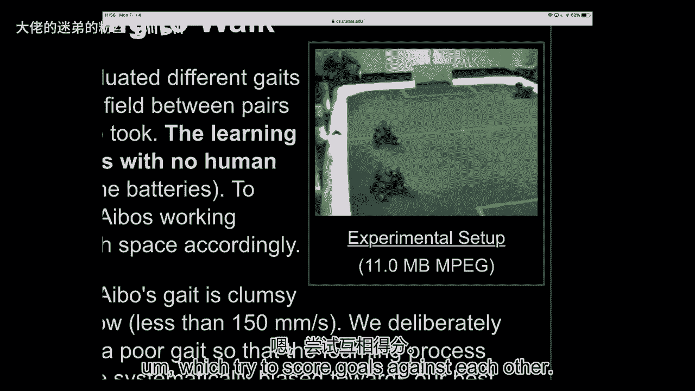
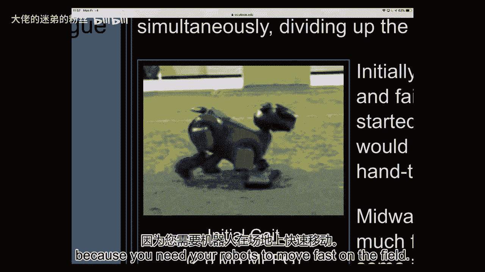
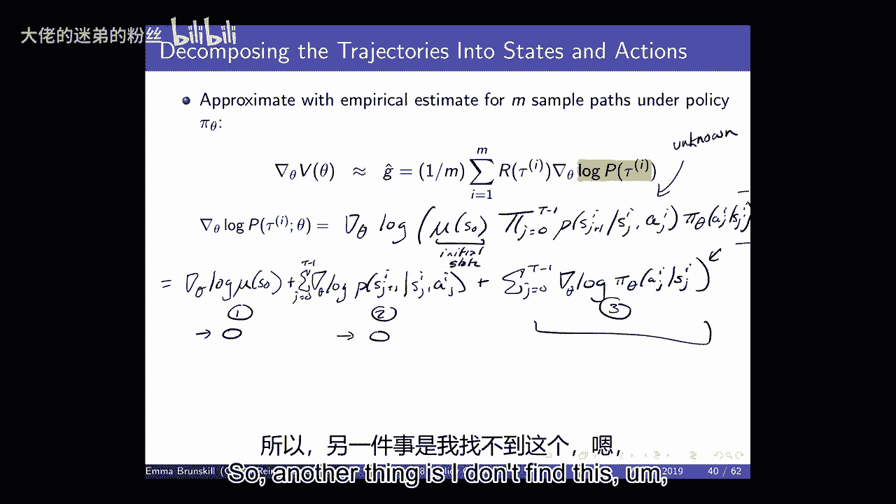
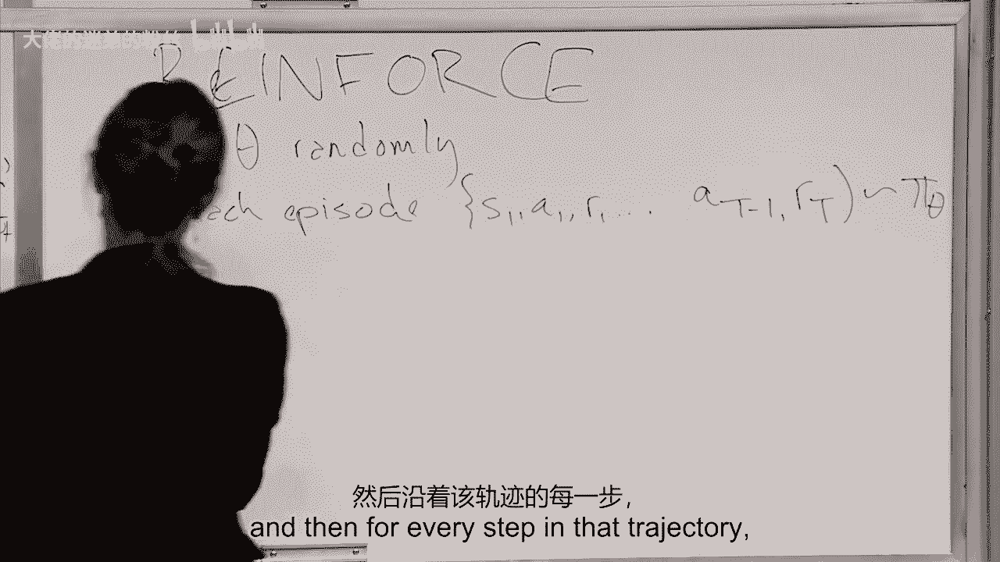

# P8：Lecture 8 - Policy Gradient I - 大佬的迷弟的粉丝 - BV1Cc411h7QQ

所有的权利，我们要开始了，嗯，家庭作业2应该正在进行中，如果你有任何问题，请随时联系我们，呃，项目建议书，如果你对此有疑问，请随时来我们的办公时间或联系，嗯，通过广场，大家还有什么问题吗？

我现在就能回答，所有的权利，所以今天我们要开始，这声音有点大，嗯，今天我们要开始讨论策略梯度方法，嗯，策略梯度方法可能是目前强化学习中最常用的方法，嗯，所以我认为熟悉它们是非常有用的东西，嗯。

每当我们谈到强化学习，我们一直回到我们想要的这些主要属性，学会对他们做出决定的代理人，能够进行这种优化，处理，勘探过程中的延迟后果，嗯，并在非常高的维空间中统计有效地完成这一切，嗯，我们上次开始讨论的。

就模仿学习而言是一种不同的方式来提供额外的结构，或对我们代理的额外支持，这样他们就可以试着学会如何更快地做事，模仿学习是通过利用人们的演示来提供结构支持的一种方式。

我们已经看到了编码结构或人类先验知识的其他方法，当我们开始讨论函数逼近时，所以当我们思考如何定义Q时，就像我们把Q定义为s a和w，其中这是一组参数，我们含蓄地做出了一个选择，即强加一些结构。

就我们如何表示我们的值函数而言，这种选择可能相当强烈，就像假设它是线性的一样，所以这是一个相当强烈的假设，或者这可能是一个非常弱的假设，比如使用深度神经网络，所以当我们指定这些函数的近似和表示时。

我们隐含地选择了多少结构，以及我们想投入多少领域知识以便我们的代理人学习，我们今天要开始讨论的是，本周我们要讨论的是策略搜索，这是另一个可以很自然地将领域知识，我们将在今天的一些机器人例子中看到这一点。

这也是一种非常有效的学习方式，正如我所说的，在我们做模型之前，自由强化学习，当我们开始尝试扩展到非常大的状态空间时，嗯，我一直有几个不同的人，问我关于真正大的动作空间，这是一个非常重要的话题。

我们不打算在本季度谈论太多，不过，我们会稍微讨论一下当你的动作空间是连续的，但低维，但是我们已经开始讨论当状态空间非常高的时候，尺寸很大，所以我们讨论了用某种参数化来近似事物，比如参数θ，或者我们。

或者我们经常使用w，但是函数的某种参数化，所以我们用我们的值函数来定义预期的，来自特定州或州行动的奖励折现总额，然后我们可以从这个值函数中提取一个策略，或者至少从状态操作值函数，相反。

我们今天要做的只是直接参数化策略，所以当我们谈到表格策略时，我们的政策只是从国家到行动的映射，在表格设置中，我们可以把它看作是每个州的查找表，我们可以写下我们将采取什么行动，我们现在要做的是说，嗯。

把我们的政策写下来是不可行的，所以我们要做的是参数化它，我们将使用一组权重或θ，今天我们主要用θ，但这可以被认为是重量，嗯，只是一种参数化我们政策的方法，我们将更多地讨论参数化的特殊形式，嗯。

但就像我们看到的状态动作值函数一样，嗯，这会有很大的影响，因为这有效地定义了你可以学习的空间，所以有点，嗯，它决定了，你可能学到的政策类别，嗯，我们将再次关注模型，自由强化学习。

这意味着我们不会假设我们可以访问，和世界动力或回报的先验模型，所以我们在本季度开始的时候有一些图表，我只想回去，嗯，我们一直在谈论某种价值，我们还没有谈太多关于模特的事，模型也是超级重要的。

但是我们已经讨论了很多关于基于值函数的方法，就是这个，现在我们来谈谈政策，直接策略搜索方法，正如你所料，有很多工作试图将他们两人结合起来，这些通常被称为演员批评方法，嗯，其中您试图显式维护参数化策略。

并显式维护参数化的批评或值函数，所以这是政策，这是一个提示，所以我们今天就开始，我们将讨论基于策略的方法，那么你为什么要把这件事做好呢，这实际上又回到了我们上周讨论的，用模仿学习，用于模仿学习。

我们说过，事实上，有时人类很难写下奖励函数，所以他们可能更容易展示政策是什么样子的，在某些情况下类似，也许，更容易写下策略空间的参数化，比写下状态作用空间的参数化，值函数，此外。

它们通常在高维或连续作用空间中更有效，它们允许我们学习随机策略，到目前为止我们还没有谈过很多，但我要给你们一些关于，我们肯定想要随机政策的地方，嗯，它们有时有更好的收敛政策收敛，呃，属性，嗯。

这可能会有点争论，这完全取决于我们是否在比较，为基于模型的方法建模，我们要做多少计算，嗯，所以这可能是计算的一个功能，计算可能很重要，一个真正大的缺点是它们是，通常只收敛到局部最优，所以我们要收敛到。

希望有一个相当好的政策，但我们通常不能保证收敛到全局最优，现在有一些技术可以保证将当地的，到全局最优，我今天会试着强调其中的一些，但通常你看到的几乎所有方法，像深层加固，基于策略梯度的学习。

仅收敛于局部最优，然后另一个挑战是，通常我们会通过评估一个策略来做到这一点，然后估计它的梯度，通常这可以是一些样本和有效的，我们可能需要相当多的数据来估计梯度是什么，当我们采用基于梯度的方法时。

那么为什么我们想要一个随机的策略，所以在我之前提到的表格设置中，所以让我回到这里，所以我们为什么想要这个，我们想要这个，如果你回想一下最初的讲座，嗯，我说的是如果我们有一个表格，它是确定性的和最优的。

所以在表格MDP设置中，我们不需要，嗯，我们不需要随机政策，因为总是存在一个确定性的策略，与最优策略具有相同的价值，因此，在表格马尔可夫决策过程中不需要这样做，但我们并不总是。

我们并不总是在表格马尔可夫决策过程中行动，所以作为一个例子，这里谁熟悉石头剪刀布，大多数人，嗯，我可能，如果你不是，你可能用了另一个名字，所以在石头、纸、剪刀中，呃，这是两个人的游戏，嗯。

每个人都可以选择剪刀石头布，你必须从其中挑一个剪刀胜过纸，布石头打败剪刀布打败石头，嗯，在这种情况下，如果你有一个确定性的策略，你可能会失去很多，你很容易被其他特工利用，嗯。

但是统一的随机策略基本上是最优的，我所说的最优性是什么意思，在这种情况下，我是说，如果你赢了，你可以说一个加一个，假设为零或负一，如果你现在输了，在这堂课上，我们不会过多讨论多智能体的案例。

但这是一个非常有趣的研究领域，在这种情况下，你知道环境不是不可知论的，环境可以对我们正在做的政策做出反应，而且可能是对抗性的，所以我们想要一个对对手强有力的政策，所以第二个案例，um是别名网格世界。

所以嗯，所以在这种情况下，所以为什么你知道为什么随机在这里很重要，因为我们不是在一个随机的环境中，我们在一个对抗性的环境中，我们有另一个经纪人在耍我们，他们可以不稳定，根据我们的政策改变他们的政策，嗯。

所以它不是一个，环境不会选择下一个，它不挑石头布剪刀，不管我们的行动，在过去，它可以对那些，所以它有一种非平稳性或对抗性，另一种情况是它不是马尔科夫，所以它真的是部分可观察的，你有别名。

这意味着我们无法根据传感器区分多种状态，所以我们之前看到了这个，当我们谈到机器人时，你知道机器人可以有激光测距仪，告诉他们在走廊的什么地方，每一个，嗯第一点，呃，障碍是他们所有的一百八十度。

所以在很多不同的走廊里看起来都是一样的，嗯，这是一个简单的例子，所以在别名网格世界中，嗯，假设代理人因为他们的传感器不能区分灰色状态，它们具有特定形式的特征，嗯，它们有一个特征，即北面是否有一堵墙。

东、南、西，所以它基本上可以像，如果它在这里，它可以分辨出，哦，我两边都有墙，而不是在我前面或后面，嗯，但在那边也可能是一样的在那边也可能是一样的，um灰色状态。

所以如果我们做了一个基于价值的强化学习方法，使用某种近似值函数，需要这些特征结合我要采取什么行动，我周围是否有墙，嗯，或者我们可以有一个基于政策的方法，它也吸收了这些特征，然后直接决定采取什么行动。

这些动作可能是随机的，所以在这种情况下，代理试图弄清楚如何在这个世界上导航，它真的很想来到这里，这是有很大奖励的地方，所以这很好，它想避开头骨和交叉骨，这些将是负面奖励，所以因为别名。

探员分不清它是在这里还是在这里，所以它必须在两个州做同样的事情，所以要么向左要么向右，我们称之为西方或东方，嗯，不管怎样，这都不是最佳的，因为如果它真的在这里，它应该往那边走，而不是这边和下面，嗯。

这样我们就可以区分它是在这里还是在这里，它可能会来回移动或者做出非常糟糕的决定，所以它可能会卡住，永远不知道是什么，下去拿钱是安全的，所以它学会了一个确定性的策略，因为这是我们通常用这些学到的，嗯。

它是贪婪的还是贪婪的，它会做得很差，但是如果你有一个随机策略，当你处于一种不存在的状态时，你可以随机化，你可以说，我不确定我是否真的处于这种状态，这个状态还是这个状态，嗯，所以我就走了。

我不是向东就是向西，有百分之五十的可能性，然后一般很快就会达到目标状态，因为注意，当它到达这里时，它可以知道它应该做什么，因为这看起来和这两种状态不同，所以一旦它在中间，它很清楚该怎么做。

所以这又是一次，一个例子，随机策略比确定性策略有更好的价值，这是因为这里的域不是马尔可夫的，它是部分可观察到的，好的，所以这也是我们可能想，我们想要的一些原因可能是，呃，直接基于策略，还有很多其他原因。

嗯，那么这意味着什么呢，嗯，呃，我们将有这个参数化策略，目标是我们想找到，是啊，是啊，你说的话，我们能得出结论吗，当世界不是我们的这一部分，我们的随机政策总是更好，这么大的问题是对的吗，是啊，是啊。

所以我说的是，我们能得出这样的结论吗？如果世界是部分可观测的，随机政策总是更好，嗯，我想这取决于你想做的模特，我认为在这种情况下比随机好，因为它仍然在灰色的州做一些不太聪明的事情，只是随机的。

将有一个部分可观察的马尔可夫决策过程策略，然后你可以跟踪你在世界上的位置，这样你就可以跟踪一个信仰状态，你处于什么状态，然后你可以希望唯一地识别它，哦，如果我只是在这种状态，我现在必须处于这种状态。

然后你可以确定地向右或向左，所以这取决于模特们愿意做好事，问题，好的，所以当我们开始做参数化策略搜索时，我们要做的是找到产生最佳价值的参数，类中具有最佳值的策略，与我们以前看到的如此相似。

我们可以考虑一些情节设置和无限的连续设置，所以在一个插曲的背景下，这意味着代理将在多个时间步内发挥作用，经常，让我们说H步，但它可能是可变的，就像它可能是，直到你到达，你知道的，终结状态。

然后我们可以考虑什么是期望值或者什么是价值，预期的是什么，我们从起始状态或起始状态分布中获得的奖励的折扣总和，然后我们要做的是找到参数化的策略，价值最高的，嗯，另一个选择是，如果我们在一个连续的环境中。

这意味着我们在在线环境中，我们不按步骤行事，我们只是永远行动，没有终结状态，我们可以使用嗯平均值，即我们对状态分布的平均值，所以这就像我们在考虑分布之前看到的，由特定策略诱导的马尔可夫链上的平稳分布。

因为我们之前说过，如果你修改政策，然后基本上你进入了一个马尔可夫奖励过程，你也可以想想状态的分布，你得到的是马尔可夫链，嗯，如果我们永远在演戏，我们会说平均来说，我们在固定分布下到达的状态的值是多少。

另一种方法也是说，我们只看每次的平均奖励，为了今天的简单，现在就一步，我们将几乎完全集中在情节设置上，但我们可以为这些其他形式的设置考虑类似的技术，和以前一样，这是一个优化问题。

类似于我们在线性值函数的值函数近似情况下看到的，并使用深度神经网络，嗯，我们要做优化，这意味着我们需要做某种优化工具，试图寻找最好的θ。

所以一个选择是做无梯度优化，在策略搜索方法中，我们不太倾向于这样做，嗯，但是有很多不同的方法是梯度冻结优化，只是为了让我们找到任何参数，最大化这个vπθ，嗯，只是为了连接这个，就像我们看到的Q函数。

现在我们有了θ，它指定了一个策略，它可能会有一些有趣的风景，然后我们希望能够找到最大值在哪里，所以我们真的试图找到一个函数的最大值，尽可能有效地，有很多方法可以做到这一点，不要依赖函数是可微的，嗯。

在某些情况下，这些实际上是非常好的，嗯，这是我的一个同事在。

我们开发了一种自动识别外骨骼的方法，在行走过程中最大限度地减少人体代谢能成本的辅助模式，在优化过程中，用户第一次体验到一个控制律，同时进行呼吸测量，稳态，通过拟合第一个来估计能源成本。

将动态模型订购为两分钟瞬态数据，然后改变控制规律，再次估计代谢率，对于规定数量的控制法律，重复这一过程，形成一代，然后使用协方差矩阵自适应进化策略来创建下一代。

每一代的平均值表示最优控制参数值的最佳估计，经过一个小时左右的优化，与没有援助相比，能源成本平均降低了24%。

这是我同事做的工作，史蒂夫·柯林斯，他是机械工程专业的，我们一直在合作一些，嗯，所以这个想法，在这种情况下，有很多例子，你想用外骨骼，很多人都中风了，很多人行动不便，当然，有很多退伍军人失去了一条腿。

在这些情况下，挑战之一是，你如何计算出这些外骨骼的参数，为了给走路的人提供支撑，一般来说，它因生理而异，对许多不同的人来说，他们需要不同类型的参数，但你想快点做到这一点。

所以你希望能够很快地计算出每个人，什么是正确的控制参数，以帮助他们在行走时获得最大的帮助，嗯，所以史蒂夫的实验室把这当成了一种政策，策略搜索问题，你在做什么，你让某人戴上他们的设备。

你在尝试一些控制法律，这些法律提供了一种特殊形式的支持，就他们的外骨骼而言，你在测量他们的新陈代谢效率，你怎么知道，他们呼吸有多困难，他们工作有多辛苦，如果他们没有戴这个或在不同的控制法律下。

然后你可以用这些信息来找出，你使用的下一套控制法则是什么，并以闭环的方式尽快完成这一切，现在，我提出这个问题的原因之一是因为它非常有效，这是一篇很好的科学论文，这说明了这是如何比以前的技术更有效的。

第二，因为它使用CMA，是呀，这是一种无梯度的方法，所以即使我们今天要讨论的大部分内容，在课堂上都是基于梯度的方法，有一些不使用基于梯度的方法的很好的例子，还可以对许多其他类型的应用程序进行策略搜索。

所以我认为这是有用的，在你的工具箱里知道，人们不必局限于基于梯度的方法，像Cme这样的东西有一个很好的地方，他们保证会达到一个全局最优，所以在某些情况下，你可能真的想保证你在这么做。

因为这是一个高风险的情况，和一般情况下，最近人们反复注意到，有时，这些方法确实有点尴尬，嗯，嗯，他们往往在某种程度上是一种蛮力，聪明的蛮力方式，嗯，这往往是非常有效的，因此。

从你所看到的应用程序的角度来看，它们是很好的考虑因素，你知道的，尽管如此，嗯，呃，即使他们真的很好，有时它们对并行化非常非常有帮助，他们一般取样效率不高，因此取决于您正在查看的域，你有什么样的结构。

通常使用基于梯度的方法是有用的，特别是如果您可能对最后的本地解决方案感到满意，所以我们是局部最优的，所以我们今天要讲的主要是，就像我们为价值所做的那样，就像，呃，基于值的方法是梯度的。

基于下降和梯度的方法，嗯，和其他试图利用决策问题的顺序结构的方法，所以CME对这个事实一无所知，世界可能是一个MDP，或者任何一种顺序随机过程，我们将重点关注那些有杠杆作用的。

马尔可夫决策过程的结构和决策过程本身，那么让我们来谈谈策略梯度方法，嗯，我们只是用θ来定义事物，这样我们就可以显式地了解参数，我们将专注于插曲MDPS，这意味着我们将在一定的时间步数内运行我们的策略。

直到我们达到一定的终结状态，你知道的，也许H步，在这段时间里，我们会得到一些奖励，然后我们要重置，我们要找一个局部最大值，我们要取梯度，关于定义策略的参数，然后用一些小的学习率，所以这看起来应该很相似。

非常类似于，这里的主要区别是，而不是对定义q函数的参数求导，我们是根据定义我们政策的参数来接受它们的，所以这里最简单的事情就是做有限差分，因此，对于您的每个策略参数，你只要稍微扰动一下。

如果您对定义策略参数的每一个维度都这样做，呃，然后你会得到梯度的估计，你只是在做有限的差分，梯度的估计，在每种情况下，您可以使用一定数量的评估来做到这一点，这样你就可以，假设你有这个K维。

定义策略的一组参数，你试着改变其中一个，你重复一遍，你得到了一堆新政策的样本，你对所有不同的维度都这么做，现在你有了梯度的近似值，这很简单，挺吵的，效率不是特别高，但它有时是有效的，我是说。

策略梯度方法在RL上下文中如何非常有用，好的是，策略本身不必是可微的，因为我们只是在做梯度的有限差分近似，那么我看到的第一个例子是什么，嗯，我想到了，当我想到，策略梯度方法或策略搜索方法如何真正有效。

彼得·斯通做机器人杯的工作是什么，这里有谁见过像机器人杯。

好的，几个人，但不是每个人，所以让我们看看我们是否能像一个简短的演示一样站起来。

就像这些机器人的样子，所以说。

好的，所以你可能看不到它，我们现在不会那么做，嗯，但本质上你所拥有的是，有一堆不同级别的机器人杯，其中一个目标是，嗯，我想到2050年，我们的目标是要有一支机器人足球队，有点能够打败，喜欢能够。

你知道吗，赢得世界杯，嗯，所以这是我们的驱动目标之一，RoboCup的倡议，这里面有很多不同的联盟，其中之一是四足机器人，嗯，他们试图在彼此的比赛中进球。

其中一个关键的挑战是它们看起来有点像，嗯，你得弄清楚走路的门，你希望它们能快速行走，但你不想让他们摔倒，所以问题很简单，就像，你如何优化大门是一个重要的问题，以便获胜。

因为你需要你的机器人在球场上快速移动。

所以彼得·斯通在很长一段时间里都是机器人杯的领军人物，他们的目标只是学习一种快速的走路方式，通过真实的经验和数据来做这件事在这里真的很重要，因为它很贵，就像你让这些机器人来回走动一样。

你想让他们很快优化步态，你不想不停地更换电池之类的东西，所以你真的想用很少的数据量来做这件事，在这种情况下，他们想做的是做一个参数化的策略，并试图优化这些政策，所以这就是重要的领域知识出现的地方。

这是一种注入领域知识的方法，所以他们用这种连续的椭圆来指定它，关于Gate是如何为这个小机器人工作的，所以他们用这十二个连续的参数来参数化它，这完全定义了您可以学习的可能策略的空间，这可能不是最佳的。

彼得·斯通，他的团队在制作机器人杯方面有丰富的经验，在他们写这篇论文的时候，所以他们真的有很多知识可以注入这里，在某些方面，这是一种提供这种层次结构的方法，什么样的政策可能是好的，然后他们所做的是。

他们只是做了这种有限差分的方法，为了尝试优化所有这些参数，所以这里重要的一点是，他们所有的政策评估都将在真正的机器人上完成，他们只是想让人们偶尔干预一下，为了更换电池，大约每小时发生一次。

所以他们在三个ibos上做了，非常少量的硬件，嗯，他们每次迭代执行大约15个策略，他们对每项政策进行了三次评估，所以不是很多，那可能是一个非常嘈杂的信号，每一代大约花了7。5分钟。

所以他们必须选择一些学习速度，所以我们在这种情况下看到了什么，嗯，我们看到他们的迭代次数，与那里的速度相比，当然，您必须定义您的优化标准，在这种情况下，他们考虑的是稳定行走的速度，嗯。

很多人一直在想如何做到这一点，使用手动调音，嗯，呃，包括，他们是奥斯汀别墅队，嗯，包括他们过去，人们找到了不同的方法来手动调音，嗯，我不知道你是怎么用的，监督学习，等，你可以看到他们所做的。

尝试寻找更好的策略的多次迭代，用这种有限差分法，他们比其他一切都快，这不是很多迭代，嗯，所以这是发生在，你知道吗，几个小时，所以我想，这是一个非常引人注目的例子，策略梯度方法确实可以比以前做得更好。

它不需要大量的数据，这可能和你在作业二中所经历的很不一样，所以这不是迭代的总数，嗯，我想这是在，让我们看看，就像我知道这是在，你知道的，几十到上百份保单，不是数以百万计的步骤。

所以这些东西可以非常有效地处理数据，但也有很多信息是这样给出的，如果你想想，就像我这里有一点，所以在他们的论文中他们讨论了在这种情况下是什么影响了性能，有很多事情会影响性能，所以你知道我们怎么开始，嗯。

所以它可能有一种感觉，为什么你知道，为什么使用的初始策略参数，这类方法的问题，嗯，因为我们不能保证有一个全局最优，只有局部最优，所以你的出发点会影响到你能找到的当地医院，我刚才说的是。

因为这些方法只保证，特别是，这种方法只保证找到局部最优，所有的策略梯度样式方法都是，然后呢，无论你从哪里开始，你会到达最近的本地最优，你不能保证这是最好的全局最优，嗯，所以在这种情况下。

尝试大量随机重启是很重要的，或者拥有领域知识，另一个重要的问题是你在多大程度上扰乱了，你的有限差异的大小，然后我认为最关键的是政策参数化，比如你如何写下可能的政策空间，你可以在其中学习。

因为如果这不是一个好的政策空间，那你什么也学不到，五，二，六，我是一个开放的团体，而是扩展得更多一点，是啊，是啊，嗯，所以问题是关于开放循环政策的部分，所以我们正在学习的这些政策不一定是适应性的。

开环策略本质上是一个计划，这是一系列要采取的行动，嗯，不管您可能有任何额外的输入，所以说，嗯，我们通常认为策略是从状态到操作的映射，但它们也可以只是一系列的动作，所以当我们谈论开环策略时。

这是一个非反应性的政策，因为这只是一系列的动作，不管机器人的状态如何，你只要继续前进，所以也许中间有很大的风，机器人的下一个动作是一样的，风是否很大，它不一定是反应性的，好的，所以说，但总的来说，嗯。

你知道，有限差分是一个合理的尝试，嗯，我们通常会使用梯度信息和杠杆，事实上，我们的函数策略实际上是可微的，所以我们现在要做的是计算，分析政策梯度，抱歉，打扰一下，这在现在使用的大多数技术中都是最常见的。

嗯，我们假设它在任何不为零的地方都是可微的，嗯，我们可以显式地计算这个，所以当我们说我们，当我们说我们知道，这意味着这是可计算的，我们可以显式地计算这个，所以现在我们将只考虑基于梯度的方法。

所以我们只是，嗯，我们将只收敛到局部最优，希望，希望我们能达到当地的最佳状态，这是我们所能希望的最好结果，在这种情况下，所以我们要谈谈，人们经常谈论可能性，比率政策，嗯，他们将按照以下方式进行。

所以我们在考虑插曲案件，所以我们要把它看作是有轨迹的，所以国家行动，奖励下一个状态，等等，一直到某种终端状态，所以这就是我们终止的地方，和，我们将使用tau的r，表示轨迹的奖励总和，所以保单的价值。

在这种情况下，只是意料之中的，我们按照这项政策获得的折扣金额，我们可以把它表示为我们观察到特定轨迹的概率，那个轨迹的回报，所以它只是说在这个政策下给出，你知道什么，看到任何轨迹的概率有多大。

那么这个轨迹的回报是什么，因为奖励只是轨迹的确定性函数，一旦你知道状态动作，奖励，等，那么你的奖励就是所有这些的总和，所以现在在这个特殊的符号中，我们的目标是找到策略参数，这是这个的arg最大值。

我们在这里改变了什么，嗯，现在的变化是我们将专注于这里，所以请注意，现在政策参数只出现在轨迹分布方面，在这项政策下，我们可能会遇到，这和我们所说的模仿学习有点相似，在我们进行模仿学习之前。

我们讲了很多关于状态的分布，状态和动作的分布，并试图找到一个策略，将匹配相同的州行动分布，正如一位专家所证明的那样，今天我们不再讨论状态作用分布，但我们谈论的是我们可能遇到的轨迹分布。

根据我们的特殊政策，那么这个梯度是多少，嗯，所以我们要取这个函数相对于θ的梯度，所以我们要这样做，我们要重写轨道在θ下的概率，所以说，我超过了一个tau，我们要做tau的概率，时间好吧，首先，其实。

我把它搬进去，然后我们要做的就是确保我得到了符号，同样的，那么我们要做的是我们要做一些简单的事情，我们只是乘以和除以同样的东西。

所以我们要把τ{\displaystyle\tau}的概率加上θ{\displaystyle\theta}，除以给定θ的tau概率乘以给定θ的tau概率的导数，如果我们有一个日志，所以如果我们对数求导。

给定的θ正好等于，1除以给定θ的tau的概率乘以给定θ的tau的p的导数，所以我们可以这样重新表达，tau的和，在给定θ的情况下，相对于在给定θ的情况下，对p的对数的导数，到目前为止。

这似乎不一定会很有用，嗯，所以我们已经做到了，这是一个合理的转变，但我们很快就会看到为什么这种转变是有帮助的，尤其是这种转变是有帮助的原因是，这将是非常有用的，当我们想到想做这一切的时候。

在不知道动态或奖励模型的情况下，所以我们需要能够，呃，你知道吗，根据轨迹获得奖励，但我们希望能够评估策略的梯度，在不知道动力学模型的情况下，这个技巧会帮助我们到达那里，所以当我们这样做的时候。

这通常被称为似然比，然后我们可以转换它，只是说好，我们注意到通过这样做，这实际上和日志完全一样，现在，为什么这开始看起来像一些可能很有用的东西，我们这里有什么我们这里有，如果我们这是所有轨迹的总和。

当然，我们不一定能接触到所有可能的轨迹，但我们可以取样，所以你可以想象，开始能够通过多次运行您的策略来近似这一点，对一些轨迹进行采样，看着那些，嗯，然后对给定的轨道概率求导。

所以通常我们会通过运行策略来做到这一点，m次，嗯，然后θτ{\displaystyle\tau}的p{\displaystyle p}给θ{\displaystyle\theta}。

我们将用下面的方法来近似它，所以这部分掉了，我们只是要权衡我们得到的所有轨迹，在我们统一取样期间，然后我们看这个轨迹的回报和p f的对数，呃tau给定θ，那么在这种情况下发生了什么，好的。

所以这意味着梯度是这样的，嗯，呃，原始奖励，我们有时间吗，那个轨迹概率的日志，对于与相关单词times theta相关联的奖励，那么在那种情况下发生了什么，所以在这种情况下，我们有一个函数，对我们来说。

这是奖励，它可以测量特定的轨迹有多好，或者那个样品有多好，所以这是在做什么，我们只是沿着样本的对数概率的轨迹向上移动，基于它有多好，所以我们想提高我们的参数，这些参数对我们负责，得到好的样品。

所以我们希望在我们的政策中有参数，会导致我们执行轨迹，给我们带来高，奖赏，所以如果我们把这里的f乘以x作为奖励，我们这将是我们的政策，参数化策略，我们想增加我们空间中导致高回报的东西的重量。

所以如果这是我们的x的f，也就是我们的奖励功能，这是我们轨迹的概率，那么我们要重新调整我们的政策，试图增加产生高回报的轨迹的概率，所以你最终会对高价值的东西有更大的梯度，高回报，好的，那么下一个问题是。

如果我要这么做，那么我必须能够近似第二项，就是这个日志，你知道吗，对弹道概率的导数，嗯，在某些参数下，所以我必须弄清楚，在一组参数下，轨迹的概率是多少，我们可以这样做，所以这将是对数的δθ。

s零的亩的戳，所以这是我们最初的起始状态，我们初始状态的概率，乘以j的乘积等于0到t，减去观察的概率，下一个状态，考虑到所采取的行动，根据我们目前的政策，采取那种行动的可能性，所以在末端有一个支架。

既然这是日志，我们可以把这个分解，所以这将等于对数的△θ，加Δθ和除以Δθ，因为它是j=0到t的对数项，减去转换模型的对数之一，记住，我们一般不知道这一点，这是未知的，我们只是希望最终得到一个表达式。

这意味着我们不需要拥有它，我在这里索引的是我们在哪个轨道上，和j等于0到2减去1，这将是我们实际的政策参数，所有的权利，有人能告诉我为什么这是一个有用的分解，我们是否需要，所以让我，参数化所有这些东西。

嗯，就我们而言，这看起来有希望吗，不需要知道动力学模型是什么，一件事可能在任何状态下，在状态中，在行动中，比如其中的一些，你怎么得到，那当然每个人都和你的邻居谈谈怎么样，然后告诉我哪项是零。

所以我们对θ求导，哪些项依赖于θ，她说，我最喜欢，所以六点以后，i，记住，θ是决定策略参数的因素，θ是决定你在给定状态下采取什么行动的因素，所有的权利，我要做个快速调查，嗯，所以我要调用这些项目。

一二三，第一项与θ有关吗，举起你的手，如果有，举起你的手，如果没有很好，好的，是的，所以这与θ无关，所以这将是零，嗯，举起你的手，如果第二项与θ无关，所以这个归零，所以我们只剩下这个了这很好，所以嗯。

好在，所以现在变得更清楚了，为什么我们要做这个奇怪的日志转换，因为当我们做这个奇怪的日志转换时，它允许我们得到我们所采取的行动的概率的乘积，和状态转换，然后我们可以把它分解成和。

现在一旦我们看到我们把它分解成总和，我们可以单独应用导数，这意味着其中一些术语直接消失了，这真的很酷，所以这意味着我们实际上不需要知道过渡模型是什么，我们不需要有明确的表示，是啊，是啊，问题和名字第一。

拜托了，问题是我在想，制度的动力不是取决于政策吗，尽管总的来说是个大问题，所以问题是，系统的动态绝对取决于政策吗，但只有通过这一部分，所以就像特工可以选择他们采取什么行动。

但一旦他们选择了动力学独立于代理，所以这种脱钩，所以如果你有不同的政策，你绝对会得到不同的轨迹，但是你得到不同轨迹的方式，UM只在所选择的操作方面受策略的影响，然后环境将决定你得到的下一个状态。

所以我们不需要知道，在估计行动对环境的影响方面，就你得到的奖励而言，它也会通过，因为你得到的奖励也是国家的函数，所以你绝对会参观这个州的不同地方，取决于你采取的行动任何其他问题。

我想确保我明白我是如何得到估计的概率，给定数据看起来像，我们只是说，如果我们拍M集，这个出现了，你知道我的时间会是，我是说，我们在这里做的是正确的伟大的问题，所以你是在问，嗯，你知道这是我放在这里的。

只是其中一个内部术语，能应付一个人，我是的，所以我们在这里做的是，我们在说，我们准备采取这个政策，我们将在m时间跑步，我们可能不会得到任何相同的轨迹，我们要做的是计算，每一个单独的轨迹概率的日志。

然后总结一下，你可能会得到它，我是说，你知道的，在确定性的情况下，您可能，嗯，或者如果您的域没有很大的随机性，你的政策也没有，你可能会得到多个总体上相同的轨迹，你所有的轨迹都将完全不同。

你对它们局部梯度的估计也是如此，所以这真的很好，我们最终会陷入这种境地，我们只需要有一个解析形式，我们的政策对我们的参数的派生，所以我们仍然需要，我们稍后会更多地讨论这个问题，我们还需要这个。

我们要评估一下，这是关于我们如何参数化我们的政策，如果我们想让这是分析的，我们需要参数化我们的策略，以一种我们可以精确计算任何状态的方式，所以我们会更多地讨论一些方法，你知道的，一些策略参数。

这使得这个计算分析性强，很好，在其他情况下，你可能要通过，你知道吗，蛮力或计算，或者有限差分什么的，但是如果我们选择一种特定形式的参数化策略，然后这部分是分析的，所以另一件事是。

我没找到这个，呃，我找不到这个附加术语，特别有帮助，但到处都在用，所以我想介绍一下，也就是人们常说的分数函数，得分函数，这不是特别有帮助，我觉得，但仍然经常被使用，叫做这个，这就是我们刚才所说的数量。

需要能够评估，所以这真的进入了，好吧，我们再把它写出来，所以嗯，当我们对值函数求导时，我们通过得到M个样本来近似，我们和i等于1到m，我们看看轨迹的回报，然后我们求和，后面有人能读懂吗，是啊，是啊。

好的，伟大，是啊，是啊，这些是我们的评分函数，这些是我们的评分函数，嗯，在我们看到的每一个状态动作对上，我们不需要知道动力学模型，所以策略梯度定理稍微概括了这一点，它将如何推广这个音符，在这种情况下。

我们在这里做的是，这是为了情节设置，这是为了当我们把我们的原始奖励功能，所以我们看看这个轨迹的奖励总和，然后我们用这种导数来衡量它，就我们的政策参数而言，原来我们也可以稍微概括一下，假设我要打电话。

所以说，这是一个值函数，嗯，假设我们之前讨论过的目标函数略有不同，我们如何才能有情节奖励或每时间步数的平均奖励或平均值，所以我们可以让我们的目标函数等于我们的正常值。

或者我们可以让它等于我所说的J A VR，也就是每次的平均奖励，步骤，或者我们可以把它作为平均值，假设我们一直在继续，我们想平均我们遇到的状态的分布，所以我们可以考虑这种情况，在所有这些情况下。

你可以做一个类似的推导，就像我们在这里为插曲案例所做的那样，我们发现我们有目标函数的导数，现在可能有点，这些不同的目标函数中的任何一个都等于期望值，在这种情况下，导数的当前策略只涉及这些策略参数。

乘以q，和萨顿·巴托在第十三章，我们也在时间表上参考，嗯，就这些不同的问题进行了很好的讨论，嗯，所以再次，我们不打算过多地讨论这些稍微不同的目标函数，但要知道，这一切都可以扩展到持续的案例，好的。

到目前为止，我们在这里所说的是，我们有这个近似值，我们所做的是，我们只是把我们的政策，我们在每一个m次运行它，我们得到了一系列的状态、行动和奖励，然后我们平均一下，这是对政策梯度的无偏估计，但是很吵。

所以这将是公正的，吵吵闹闹，如果你想想我们之前看到的蒙特卡洛方法，它应该看起来有点眼熟，同样的精神，对呀，我们有，嗯，我们的保单用完了，我们会得到一些奖励，就像我们在蒙特卡洛得到的估计。

但这将是梯度的无偏估计，所以它是梯度的无偏估计，梯度估计，但是很吵，那么什么能让这变得实用呢，嗯，有许多不同的技术来做到这一点，但是我们今天要开始讨论的一些事情是暂时的，结构和基线。

那么我们如何解决这个问题，我们要开始看，你知道的，修复，在我们继续之前，嗯，根据我刚才所说的蒙特卡洛估计，嗯，你们中的一些人的想法是什么，我们如何才能减小这个估计的方差。

根据我们到目前为止在课堂上看到的东西，就像，蒙特卡洛方法的替代方案是什么，你一开始能不能构造，是呀，这是完全正确的，所以D说，您可以使用引导吗，是啊，是啊，所以我们反复看到，嗯。

我们在偏差和方差之间进行了权衡，那种自举，嗯，就像我们在Q中看到的时差方法，了解你在DQN做什么，有助于减少差异和加快信息的传播，所以是的，所以我们绝对可以做一些事情，比如引导，嗯，以一种取代。

用别的东西，或者在R之外使用协变，试图减小r的方差，所有权利，所以我们现在要做的是，我们首先要做一些不是一直到那里的事情，但至少试图利用我们处于时间上的事实，时间。

对于你们中任何一个以前玩过重要样本的人来说，这与嗯密切相关，每项决定，重要抽样，基本上，我们要利用的是这样一个事实，即奖励，只能嗯做的时间结构，我先写出来，好的，所以我们之前说过，嗯。

tau期望值对θ的导数，回报等于你可以得到的轨迹下的期望值，t的和等于0到t，减去RT的一个，所以你得到的奖励总和，这个，m/t等于0到t，减去与策略参数有关的一个导数，那是我们以前吃的。

所以我们只是总结我们所有的奖励，然后我们把它乘以总和，在每个操作状态对的策略的所有梯度上，我们在那个轨迹上，所以让我们考虑一下为了一个奖励而做这件事，而不是看奖励的总和，所以让我们看看。

我们对RT素数的期望值θ求导，这只是我们可能遇到的一个单步奖励，你知道沿着我们的轨迹，这将等于RT素数的期望值，乘以和等于0到这个导数的t质数，所以这看起来和以前几乎一模一样，除了这里唯一的关键区别是。

我只总结T素数，所以我们只是总结一下，你可以把这看作是一个缩短的轨迹，我在看美国的产品，我所付出的努力和回报，当我到了RT Prime，这样我就不必对未来的所有内容进行求和了，所以我们可以把这个表达式。

现在我们可以对所有的时间步长求和，所以这上面写着，预期的报酬是多少，或衍生物，关于时间步T素数的奖励，现在我要总结一下，这将和我的第一个表达式一样，所以我要做的是，我要说θ的v等于导数，关于E r的θ。

我要总结一下内部表达式，所以我对t求和一撇等于零，减去一个RT质数，然后插入第二个表达式，所以我所做的就是，我把它放进去，求和T一撇等于零，一直到T减1，然后我要做的是。

我将通过以下观察来重新排序这个和这个，所以如果我们想想这些对数πθ中有多少项，A T T出现在，所以如果我们看1的对数πθ，所以如果我们看看它出现了多少次，出现在早期奖励中，它出现在所有后来的奖励中。

我也是，好的，这会出现在R one身上，这将为R2出现，它将一个接一个地一直打到我们队，因为我们总是在那之前总结一切，所以我们现在要做的，我们要接受这些条件，我们要重组那些。

所以这些术语中的一些出现了很多次，其中一些是最后一个，t的πθ的对数，它只会出现一次，它只负责决定最后的奖励，所以我们可以利用这种洞察力稍微重组这个方程，如下所示，所以现在我们要说这等于求和的期望值。

t=0 t减去1，请注意，在我把T素数放在外面之前，T在里面，现在我要做的是把T放在外面，我会说我有Δθ对数，πθa t s t乘以t质数之和等于t，一直到t减去一个r t素数，所以我所做的就是。

我已把那笔钱重新整理好了，是啊，是啊，是啊，是啊，从底部开始的第二行，它应该是导数吗，关于θ的值函数，在最左边，好的，是呀，哦对不起，你是说，这应该是这个的导数，是呀，好的。

所以我们在这个例子中所做的是我们重组了太阳，我们只是以稍微不同的方式回忆了术语，但这将以一种有用的方式进行，所以让我们把这个向上移动，我把这个向下移动，所以现在我们还在研究时间结构，这会让我们做得好吗。

第二个术语应该看起来有点熟悉，那是什么意思，俗话说，奖励是什么，我们准时出发，一直走到最后，这只是回报，所以我们之前定义了，嗯，当我们谈论蒙特卡洛方法的时候，等，我们可以一直看着，i的质数。

这正好等于回报，这一集剩下的回归，从时间开始，上第一集，所以这看起来应该很熟悉我们在蒙特卡洛方法中看到的，我们总是可以说从这个状态在行动，我们从那个状态开始在行动中得到的奖励总数是多少，直到这一集结束。

这意味着我们可以重新表示关于θ的导数，在所有轨道上近似为1/m和，我们在总结所有的时间步骤，对实际策略参数θ的导数，时间只是回报，这将是一个比以前略低的方差估计，所以我们不必单独总结我们所有的奖励。

然后我们把它相乘，所有这些对数导数的总和，我们只需要，把一些奖励条款的日志总和，所以在这种情况下，我们可以减少方差，因为在某些方面，这是怎么回事，这是说每一个奖励，因为你可以把它重新表达为奖励的总和。

每一个奖励，你必须通过整个轨迹来确定它，根据梯度的导数，政策参数的导数，现在我们说你不必把它乘以，你只需要把它乘以所有这些，与特定奖励相关的，这意味着你会有一个稍微低一点的方差估计器。

当我们这样做的时候，我们最终可以得到所谓的加强，谁听说过加强，很多人，不是每个人，增强是最常见的强化学习策略分级算法之一，所以你得到了强化算法，所以它是如何工作的是你，嗯，算法是你随机初始化initθ。

您总是必须首先决定如何参数化策略，所以在某个地方，你已经决定了如何参数化你的策略，现在您将随机设置该策略的值，然后每集，所以你要用那个政策写一集，所以你会收集一大堆行动和奖励。

这是从您当前的保单中取样的，因此，您根据当前保单中的某人对当前保单进行采样，你得到一个轨迹，然后在轨道上的每一步。

您将更新策略参数，每次走进那一集，我们将更新我们的策略参数，所以会和以前一样，一些学习率，我不会在那里用W，我会用阿尔法，嗯，乘以对θlogπθt a t gt的导数，GT就在这一集里。

从T A T开始的奖励总额是多少，所以这只是正常的回报，就像我们用蒙特卡洛的方法，就像我们在估计线性值函数时所做的那样，我们从国家和行动开始使用奖励，我们要在这里做同样的事情，除了我们要更新政策参数。

我们做了这么多，很多，很多次，然后在最后我们返回参数，问题，所以对于每一集，您都从更新的策略中取样，我们与你同在，好的，这是正确的，所以在这种情况下，嗯，呃，在你完成一集的所有更新后。

所以你得到了这些增量更新，嗯嗯，然后在完成所有增量更新的最后，然后用新的更新参数得到另一集，因为我们每次都在更新，这会是一种偏见方法吗，嗯好问题，所以说，因为我们每次都在做论文，嗯，这应该是对，呃。

它仍然应该是梯度的无偏估计，它是随机的，但是我们对国家和行动的概念是不一样的，嗯，这将是渐近一致的，这是个好问题，所以嗯的概念，在这种情况下，状态和动作是不同的，因为我们只有这些策略参数。

所以我们在这里不是在估计一个国家在行动的价值，这当然是渐近一致的，我认为这仍然是公正的，如果我，如果我以后重新考虑，我会发封广场邮件，嗯，但我认为这仍然只是对梯度的无偏估计，这是个好问题。

所以我回到我的幻灯片笔记，嗯，我最不想做的事，嗯，我会，我会提几件事，嗯，一个关键问题，这里是，是否或如何计算与策略参数有关的此微分，所以我认为谈谈，你知道的。

人们通常认为有哪些类型的政策有很好的可微形式，所以人们认为的一些类是像SoftMax这样的东西，高斯与神经网络，这些可能是最常见的，我这么说是什么意思，我是说，这就是我们将如何实际参数化我们的策略。

所以让我们看一个例子，所以SoftMax是我们简单地，具有特征的线性组合，我们把它们按指数加权，所以我们要做的是，我们将有我们的状态和行动空间的一些特征，我们要把它们乘以一些权重或参数。

这些是我们的参数，然后实际获得采取行动的概率，所以如果我们想有我们的政策，我们说，给定一个状态，作用的概率是多少，我们将这些加权特征的指数，所以我们有，e，Phi tθ除以所有动作的和，所以请注意。

当我们的动作空间是离散的时，这是一个合理的做法，作用空间离散，很多雅达利游戏，很多不同的场景，你确实有一个离散的动作空间，所以你可以用这个指数除以归一化的，有些超过指数，这立即产生了我们的参数化策略类。

所以如果我们想对这个求导，关于日志，这很好，因为我们这里有指数，我们有对数，我们正在记录这个，所以如果我们想计算这个项，从这种参数化策略类，我们得到的是对数θ的导数。

这种类型的参数化策略正好等于我们的特性，这就是我们使用的任何特征表示，就像移动机器人的情况一样，这就像所有不同的，嗯，这可能是这样的，你知道吗，角或关节，或者类似的东西，这就是我们使用的任何功能。

减去的θ的期望值，使用一个指数，该指数与您的期望值相对于您在该策略下可能采取的所有操作，所以它在某种程度上说你观察到的特征，与平均特征相比，平均特征在动作中的平均特征，所以这是可微的，嗯，你可以解决它。

然后它给你一个解析形式，嗯，另一个真正流行的是高斯政策，为什么这可能是好的，嗯，这可能是好的，因为我们通常有连续的动作空间，所以这很好，如果我们有离散的作用空间，我们通常有连续的动作空间。

这在控制和机器人技术中很常见，所以你有许多不同的参数，在您希望能够设置的连续标量值中，我们在这里可以说的是，假设我们使用μs可能是状态特征的线性组合，乘以某个参数，为了简单起见，让我们想象一下。

我们有一个方差，但那是静态的，所以我们也可以考虑它不是，但是我们要假设我们有一个固定的方差项，这不是参数，这不是我们要学的东西，我们只是要学习θ，这就是定义我们的μ函数，然后我们的政策是高斯的。

所以A将从高斯图中提取，对特征使用此平均值，所以我们将我们当前的状态与平均值进行比较，然后我们选择一个与之相关的操作，在这种情况下，得分函数是高斯函数的导数，所以score是高斯函数的导数。

它最终是S的负MU，状态特征除以西格玛平方，所以它可以通过分析来完成，另一个非常常见的是深度神经网络，所以那些是，嗯，这些是非常常见的形式，人们使用的，在我们结束之前，我们将在下次讨论另一种常见的方法。

我们会花大约五分钟来做一些早期的课堂反馈，这对我们弄清楚是什么帮助你学习真的很有帮助，你认为有哪些可以改进的地方，所以我现在要做的是打开，如果你们能去广场，那就太好了，如果你能把这个填一下。

一切都是匿名的，我的目标是在周三给你们反馈，所以我只是让我看看我是否可以重做，所以它是，张贴，好的，让我看看能不能，我把它钉上，所以更容易找到，所以现在应该是钉住了，我们在最顶端，是的，如果你去广场。

嗯，这是一个很短的调查，你可以把信息反馈给我们，那就太好了，我们下次要做的是，我们将继续讨论策略搜索，我们将讨论基线，这是减少方差的另一种方法，这也是一个非常活跃的研究领域，因此。

在深度强化学习和政策梯度方面有大量的工作，所以我们将讨论其中的一些工作，然后你就有机会，呃，玩这个，在中期后，确实获得了政策梯度的经验，所以我们会在期中考试后发布一个关于这个问题的作业。

