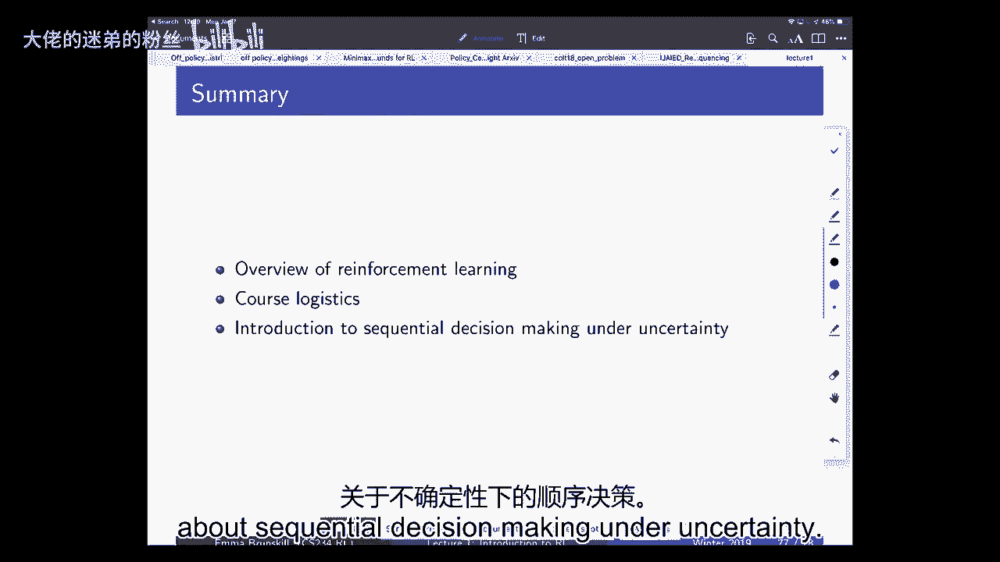

# 1：强化学习导论 - 第一讲 🎯

在本节课中，我们将要学习强化学习的基本概念，了解它与其他人工智能和机器学习领域的区别，并初步接触不确定性下的顺序决策问题。

## 概述 📖

强化学习关注一个核心问题：一个智能体如何通过与环境交互，学会做出一系列好的决策。本节课将介绍强化学习的定义、关键特征、应用领域以及课程的基本安排。

## 强化学习是什么？🤖

强化学习与一个基本问题相关：一个智能体如何学会做出一系列好的决定。

这句话总结了强化学习的核心，并编码了几个重要想法：
1.  我们关心的是**顺序决策**，即智能体需要做出一系列决定，而非单一决定。
2.  我们关心决策的**好坏**，即存在一个衡量决策效用的标准。
3.  智能体通过**学习**来获得做出好决策的能力，它事先并不知道其决策如何影响世界，或哪些决策与好结果相关，必须通过经验获取这些信息。

## 强化学习的起源与重要性 🌱

从婴儿时期开始，我们就在学习如何在这个世界上获得高回报。神经科学和心理学正从人类智能体的角度研究这个基本问题。

一个生物学的例子是一种原始生物，它在婴儿期拥有大脑和眼睛以指导决策，成年后则消化掉大脑。这表明智能或大脑的意义至少部分在于指导决策。

在人工智能领域，强化学习经历了一次范式转变。DeepMind的David Silver展示了使用强化学习直接控制雅达利游戏的惊人成果。智能体仅从像素输入中学习，最终表现甚至超过了人类。这突破了以往强化学习多集中于玩具问题的局限。

## 强化学习的应用领域 🚀

强化学习不仅应用于电子游戏和机器人技术，还适用于许多其他领域：
*   **教育**：通过教育游戏等方式，快速有效地教授知识。
*   **医疗保健**：用于癫痫治疗优化、结合电子病历系统指导患者治疗等。
*   **优化技术**：在自然语言处理、计算机视觉等领域，作为解决复杂优化问题的方法。

## 强化学习的四个关键要素 🔑

强化学习的关键要素将其与其他人工智能和机器学习领域区分开来：
1.  **优化**：目标是做出好的决策。
2.  **延迟后果**：当前决策的效果可能在很久以后才显现，这带来了信用分配的挑战。
3.  **探索**：智能体需要通过尝试来了解世界如何运作。
4.  **泛化**：智能体需要能够将经验应用到未曾遇到过的情形中。

## 与其他领域的对比 ⚖️

*   **规划**：涉及优化、泛化和延迟后果，但**不涉及探索**。规划假设已知世界模型（如游戏规则），难点在于计算最优策略。
*   **监督学习**：涉及优化和泛化，但通常**既不涉及探索，也不涉及延迟后果**。智能体被给定数据集，用于完成分类等单一决策任务。
*   **无监督学习**：涉及优化和泛化，但通常**不涉及探索或延迟后果**。智能体处理没有标签的数据。
*   **模仿学习**：涉及优化、泛化和延迟后果，但**不直接涉及探索**。智能体通过观察专家（如人类）的决策来进行学习。

强化学习智能体需要探索世界，并利用探索经验来指导未来的决策。

## 后勤与学习目标 🗓️

上一节我们介绍了强化学习的核心概念，本节中我们来看看本课程的具体安排和目标。

### 先决条件

学生应具备以下背景：
*   上过人工智能或机器学习课程。
*   具备基本的Python编程能力。
*   熟悉概率统计、多变量微积分、梯度下降等概念。

### 学习目标

课程结束时，学生应能够：
1.  **定义强化学习的关键特征**，并将其与其他类型的问题区分开来。
2.  **将现实世界问题形式化为强化学习问题**，并了解相关算法。
3.  **在代码中实现强化学习算法**，包括深度强化学习算法。
4.  **评估算法**，了解其理论性质（如遗憾、样本复杂度、计算复杂度）。
5.  **比较不同的探索与利用技术**，了解其优缺点。

### 评估

课程评估包括以下部分：
*   **三次主要作业**
*   **一次期中考试**
*   **一次小组测验**（个人答题后，小组讨论并提交最终答案）
*   **一个最终项目**（开放式项目，提供默认选项）

所有课程交流主要通过课程网站进行。

## 不确定性下的顺序决策 🤔

现在，我们开始深入探讨强化学习的核心框架：不确定性下的顺序决策。

### 基本框架

我们考虑一个交互式闭环过程：
1.  智能体处于某个**状态**。
2.  智能体采取一个**动作**，该动作会影响世界状态。
3.  环境返回一个**观察**和**奖励**。
4.  智能体的目标是最大化其获得的**总预期未来奖励**。

这里的“预期”很重要，因为世界本身可能是随机的。智能体需要在即时奖励和长期奖励之间取得平衡，可能为了长期利益而牺牲短期回报。

**示例**：
*   **网络广告**：智能体选择向用户展示哪个广告，观察用户行为（如点击），目标是最大化点击率。
*   **机器人洗碗**：智能体控制机械臂运动，观察厨房图像，奖励是清理完所有碗碟。
*   **血压控制**：智能体开具运动或药物处方，观察血压值，奖励是血压维持在健康范围。

### 奖励设计的重要性

奖励函数的设计至关重要。智能体将学会最大化你指定的奖励函数，但这可能产生 unintended consequences。

**教学代理示例**：
*   **场景**：教学代理向学生出题（加法或减法），学生答对得+1奖励，答错得-1奖励。假设对学生而言，加法比减法容易。
*   **问题**：一个试图最大化奖励的代理会倾向于一直出简单的加法题，因为这样学生更容易答对。但这并非教学的本意。
*   **启示**：奖励函数需要精心设计，以引导智能体完成我们真正期望的任务。

### 状态与历史

*   **历史**：是智能体之前采取的一系列动作及其收到的观察和奖励的序列。
*   **状态**：是智能体用于做出决策的信息。通常假设状态是历史的某个函数。
*   **世界状态**：是环境的真实完整状态，智能体可能无法完全观测到。

### 马尔可夫假设

一个常用且重要的假设是**马尔可夫假设**：未来独立于过去，给定当前状态。即，当前状态是预测未来的充分统计量。

这意味着，如果智能体拥有正确的“状态”表示，那么它只需要知道当前状态就能做出最优决策，无需记住完整历史。

**示例**：
*   **非马尔可夫状态**：仅用当前血压值作为状态来决策用药，可能不是马尔可夫的，因为血压还受饮食、运动等历史因素影响。
*   **变为马尔可夫**：如果将足够长的历史血压值都包含在状态中，理论上可以使系统变为马尔可夫，但这会导致状态空间巨大，难以学习。

在实践中，我们通常寻求一个紧凑且足够的状态表示（如最近几次的观察），以平衡表达能力和学习效率。

## 顺序决策过程的类型 📊

以下是几种主要的顺序决策过程模型：

1.  **多臂赌博机**：动作不影响下一次观察。适用于决策间相互独立的场景，如向一系列独立用户展示广告。
2.  **马尔可夫决策过程**：动作会影响下一个状态和观察。这是更一般的模型，适用于智能体与环境持续交互的场景。
3.  **部分可观测马尔可夫决策过程**：智能体无法直接观测到真实世界状态，只能收到与状态相关的观察。例如，扑克游戏中，你只能看到自己的牌和公共牌。

### 火星探测器示例

考虑一个在简单网格世界中移动的火星探测器：
*   **状态**：网格位置（1到7）。
*   **动作**：向左或向右移动。
*   **真实奖励**：状态1奖励+1，状态7奖励+10，其他状态奖励0。
*   **智能体的模型（可能是错误的）**：
    *   奖励模型：认为所有状态奖励都为0。
    *   转移模型：认为移动时，有50%概率成功，50%概率留在原地。

## 强化学习智能体的组件 ⚙️

一个RL智能体通常包含以下一个或多个组件：

1.  **模型**：智能体对世界动态的理解。包括：
    *   **转移模型**：预测在状态`s`采取动作`a`后，转移到状态`s‘`的概率。`P(s‘ | s, a)`
    *   **奖励模型**：预测在状态`s`采取动作`a`的期望即时奖励。`R(s, a)`
2.  **策略**：智能体的决策规则。是从状态到动作的映射。
    *   **确定性策略**：`a = π(s)`
    *   **随机性策略**：`π(a | s)` 表示在状态`s`选择动作`a`的概率。
3.  **价值函数**：评估状态或状态-动作对的好坏。表示从该状态开始，遵循特定策略所能获得的**预期折扣回报总和**。
    *   **状态价值函数**：`V^π(s) = E[Σ γ^t * R_t | s0=s, π]`
    *   **动作价值函数**：`Q^π(s, a) = E[Σ γ^t * R_t | s0=s, a0=a, π]`
    *   其中 `γ` 是折扣因子（0 ≤ γ ≤ 1），用于权衡即时奖励和未来奖励。

## 算法分类 🧩

根据智能体显式维护的组件，RL算法可分为：
*   **基于模型**：显式维护世界模型。
*   **无模型**：不显式维护模型，直接学习价值函数和/或策略。
*   **价值函数基于**：学习价值函数，通常从中推导出策略（如选择价值最高的动作）。
*   **策略基于**：直接学习策略函数。
*   **演员-评论家**：同时学习价值函数和策略函数。

## 核心挑战：规划、学习、探索与利用 ⚔️

在RL框架下，做出好决策面临几个核心挑战：

1.  **规划**：即使给定了一个准确的世界模型，计算最优策略本身也是一个计算难题（例如，在国际象棋或围棋中）。
2.  **学习**：在现实世界中，模型通常是未知的，必须通过与环境的交互来学习模型、价值函数或策略。
3.  **探索与利用**：这是RL特有的核心困境。
    *   **利用**：根据当前已知信息，选择看起来最好的动作。
    *   **探索**：尝试新的或当前看来不是最优的动作，以获取更多信息，可能在未来带来更大收益。
    *   智能体必须在利用已知信息和探索未知可能性之间取得平衡。

**示例**：
*   **电影**：利用是看你最喜欢的电影；探索是看一部可能好也可能坏的新电影。
*   **广告**：利用是展示当前点击率最高的广告；探索是展示一个不同的广告以测试其效果。
*   **通勤**：利用是走你已知最快的路线；探索是尝试一条不同的路线。

在**有限时域**问题中（例如，你只在镇上呆五天），探索的价值会随时间减少，在最后阶段纯利用通常是最优的。而在**无限时域**问题中，探索则始终具有潜在价值。

## 两大基本问题 🎯

强化学习研究可归结为两个基本问题：

1.  **策略评估**：给定一个策略 `π`，评估它有多好。即计算其价值函数 `V^π` 或 `Q^π`。
2.  **策略控制（优化）**：寻找最优策略 `π*`，以最大化期望回报。

策略评估通常是策略控制的一个子步骤。RL的一个强大之处在于可以进行**离策略评估**，即利用从某个策略收集的数据来评估另一个不同的策略，这大大提高了数据利用效率。

## 路线图 🗺️

本课程后续将涵盖以下内容：
1.  马尔可夫决策过程与规划（已知模型时的评估与控制）。
2.  无模型策略评估。
3.  无模型控制。
4.  深度强化学习与函数逼近。
5.  策略搜索方法。
6.  探索与利用。
7.  高级主题。

## 总结 📝

本节课中我们一起学习了：
*   强化学习的定义及其与优化、延迟后果、探索、泛化四个关键要素。
*   强化学习与其他AI/ML领域（规划、监督学习、无监督学习、模仿学习）的区别。
*   课程的目标、安排和评估方式。
*   不确定性下顺序决策的基本框架，包括状态、动作、奖励、策略、价值函数等核心概念。
*   马尔可夫假设及其重要性。
*   强化学习智能体的主要组件（模型、策略、价值函数）和算法分类。
*   强化学习面临的核心挑战：规划、学习以及探索与利用的权衡。
*   强化学习研究的两个基本问题：策略评估和策略控制。

下一讲，我们将深入探讨马尔可夫决策过程与规划算法。