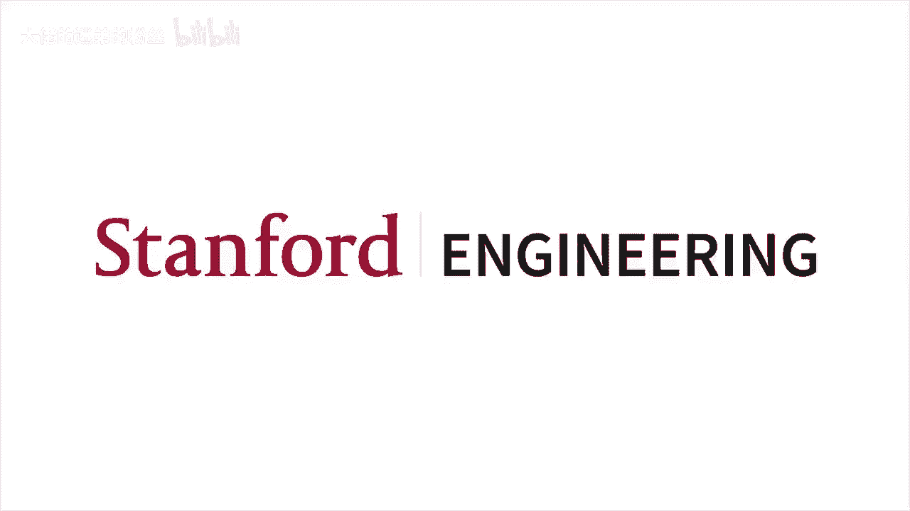
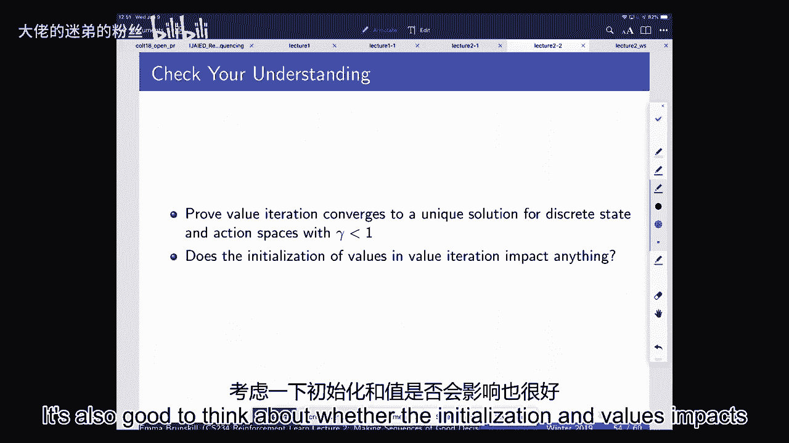
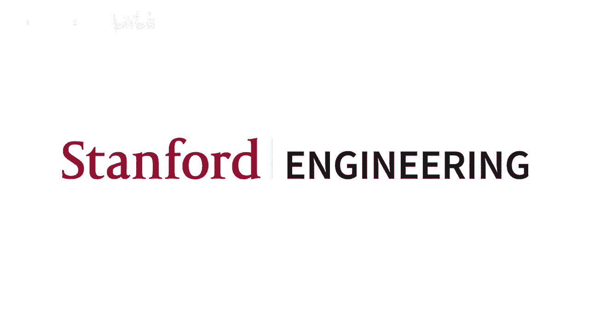

# 2：已知世界模型 🧠

在本节课中，我们将学习当已知世界模型时，如何进行决策规划。我们将从马尔可夫过程开始，逐步构建到马尔可夫决策过程，并学习如何计算最优策略。

---

## 回顾与概述 📚

上一节课我们介绍了强化学习的基本概念，包括模型、价值和策略。本节课，我们将专注于**规划问题**：当我们知道世界模型（即知道在特定状态下采取某个动作会发生什么）时，如何做出最优决策，以最大化长期回报。

---

## 马尔可夫过程 🔄

首先，我们来看没有控制（动作）参与的情况。马尔可夫过程描述了一个随机过程如何随时间演变，其核心是**马尔可夫性质**：未来状态的分布只依赖于当前状态，与过去历史无关。

**公式化定义**：
一个马尔可夫过程由一组（有限或无限的）状态 `S` 和一个转移模型 `P` 组成。转移模型定义了从当前状态 `s` 转移到下一个状态 `s'` 的概率：
`P(s' | s)`

如果状态空间是有限的，我们可以用一个矩阵来表示转移模型，其中 `P[i][j]` 表示从状态 `i` 转移到状态 `j` 的概率。

**示例**：
考虑一个火星车在7个位置（S1到S7）间移动的简单世界。其转移矩阵可能如下（仅示意部分）：
*   从S1出发，有0.6概率留在S1，0.4概率移动到S2。
*   从S4出发，有0.4概率到S3，0.4概率留在S4，0.2概率到S5。

通过从初始状态分布（例如，从S4开始）重复采样转移矩阵，我们可以生成一个状态序列（轨迹），例如：S4 -> S5 -> S6 -> S7 -> S7 ...

---

## 马尔可夫奖励过程 🏆

现在，我们在马尔可夫过程中加入**奖励**。马尔可夫奖励过程在状态转移的基础上，为每个状态关联一个期望奖励值 `R(s)`。此外，我们引入**折扣因子 γ** (0 ≤ γ ≤ 1)，用于权衡即时奖励和未来奖励的重要性。

**核心概念**：
*   **回报**：从某个时间步 `t` 开始，未来获得的折扣奖励总和。
    `G_t = R_{t} + γ * R_{t+1} + γ^2 * R_{t+2} + ...`
*   **价值函数**：从某个状态 `s` 开始，所能获得的期望回报。
    `V(s) = E[G_t | S_t = s]`

**计算价值函数的方法**：
1.  **模拟**：通过多次运行（采样）过程，计算回报的平均值。这种方法简单，不依赖马尔可夫结构，但可能需要大量样本。
2.  **解析解**：利用马尔可夫性质，价值函数可以表示为贝尔曼方程：
    `V(s) = R(s) + γ * Σ_{s'} P(s'|s) * V(s')`
    对于有限状态空间，可以写成矩阵形式 `V = R + γPV`，直接求解 `V = (I - γP)^{-1} R`。
3.  **动态规划/迭代法**：通过迭代更新来求解价值函数。
    *   初始化 `V_0(s) = 0`（或任意值）。
    *   重复以下更新直到收敛：
        `V_{k+1}(s) = R(s) + γ * Σ_{s'} P(s'|s) * V_k(s')`
    这种方法计算效率更高，并且为后续引入动作奠定了基础。

---

## 马尔可夫决策过程 🎮

现在，我们引入**动作**，这是智能体与环境的交互方式。马尔可夫决策过程是强化学习的标准建模框架。

**MDP 元组**：`(S, A, P, R, γ)`
*   `S`: 状态集合
*   `A`: 动作集合
*   `P`: 转移模型 `P(s' | s, a)`
*   `R`: 奖励函数 `R(s, a)` (也可以是 `R(s)` 或 `R(s, a, s')`)
*   `γ`: 折扣因子

**策略**：策略 `π` 定义了在给定状态下应采取的动作。它可以是确定性的（`a = π(s)`）或随机性的（`π(a|s)`）。

**示例**：
在我们的火星车例子中，现在智能体可以采取两个动作：A1和A2。转移模型变为依赖于动作。例如，在状态S6执行A1，可能有50%概率留在S6，50%概率到达S7；而执行A2则可能确定性地前往S7。

---

## 策略评估 📊

给定一个固定的策略 `π`，MDP 就退化成了一个 MRP（因为动作由策略决定）。因此，我们可以使用计算 MRP 价值函数的方法来评估这个策略的好坏，这被称为**策略评估**。

**贝尔曼期望方程**：
`V^π(s) = R(s, π(s)) + γ * Σ_{s'} P(s' | s, π(s)) * V^π(s')`

我们可以使用动态规划迭代求解 `V^π`：
`V_{k+1}^π(s) = R(s, π(s)) + γ * Σ_{s'} P(s' | s, π(s)) * V_k^π(s')`

这个过程会逐步将未来状态的奖励信息“传播”回更早的状态。

---

## 控制：寻找最优策略 🥇

我们最终的目标不是评估给定策略，而是找到**最优策略** `π*`，使得所有状态下的价值函数 `V^π(s)` 最大化。对于无限时域有限状态的MDP，至少存在一个确定性的最优平稳策略。

### 1. 策略迭代

策略迭代交替进行**策略评估**和**策略改进**，直到策略不再改变。

**步骤**：
1.  **初始化**：随机选择一个策略 `π_0`。
2.  **循环**，直到策略收敛：
    *   **策略评估**：计算当前策略 `π_i` 的价值函数 `V^{π_i}`。
    *   **策略改进**：对于每个状态 `s`，根据 `V^{π_i}` 计算**动作价值函数 Q**，并选择能最大化 Q 值的动作作为新策略。
        `π_{i+1}(s) = argmax_a Q^{π_i}(s, a)`
        其中，`Q^{π}(s, a) = R(s, a) + γ * Σ_{s'} P(s' | s, a) * V^{π}(s')`

**为什么有效？**
策略改进定理保证了新策略 `π_{i+1}` 不差于旧策略 `π_i`（`V^{π_{i+1}} ≥ V^{π_i}`）。由于确定性策略的总数是有限的（`|A|^{|S|}`），且策略价值单调不降，算法必然在有限步内收敛到最优策略。

### 2. 价值迭代

价值迭代直接迭代更新最优价值函数 `V*`，而不显式地维护中间策略。

**贝尔曼最优方程**：
`V*(s) = max_a [ R(s, a) + γ * Σ_{s'} P(s' | s, a) * V*(s') ]`

**算法**：
1.  初始化 `V_0(s) = 0`。
2.  重复以下更新直到收敛：
    `V_{k+1}(s) = max_a [ R(s, a) + γ * Σ_{s'} P(s' | s, a) * V_k(s') ]`

**收敛性保证**：
贝尔曼最优备份算子是一个**收缩映射**（只要 γ < 1）。这意味着，无论 `V` 如何初始化，重复应用该算子都会使其唯一地收敛到最优价值函数 `V*`。得到 `V*` 后，最优策略可以通过贪心地选择动作得到：`π*(s) = argmax_a Q*(s, a)`。

---

## 总结 🎯

本节课我们一起学习了在已知世界模型下的规划方法。

*   我们从**马尔可夫过程**和**马尔可夫奖励过程**入手，理解了状态转移、奖励、回报和价值函数的基本概念，并学习了计算价值函数的几种方法（模拟、解析解、动态规划）。
*   然后，我们引入了**马尔可夫决策过程**，其中智能体可以通过**动作**影响环境。**策略**定义了智能体的行为方式。
*   我们学习了如何评估一个给定策略的优劣，即**策略评估**。
*   最后，我们探讨了寻找最优策略的两种主要算法：**策略迭代**（交替进行评估和改进）和**价值迭代**（直接迭代求解最优价值函数）。两者都依赖于贝尔曼方程，并在折扣因子 γ < 1 时保证收敛到最优解。

这些内容是理解后续强化学习算法（特别是当模型未知，需要从交互中学习时）的重要基础。