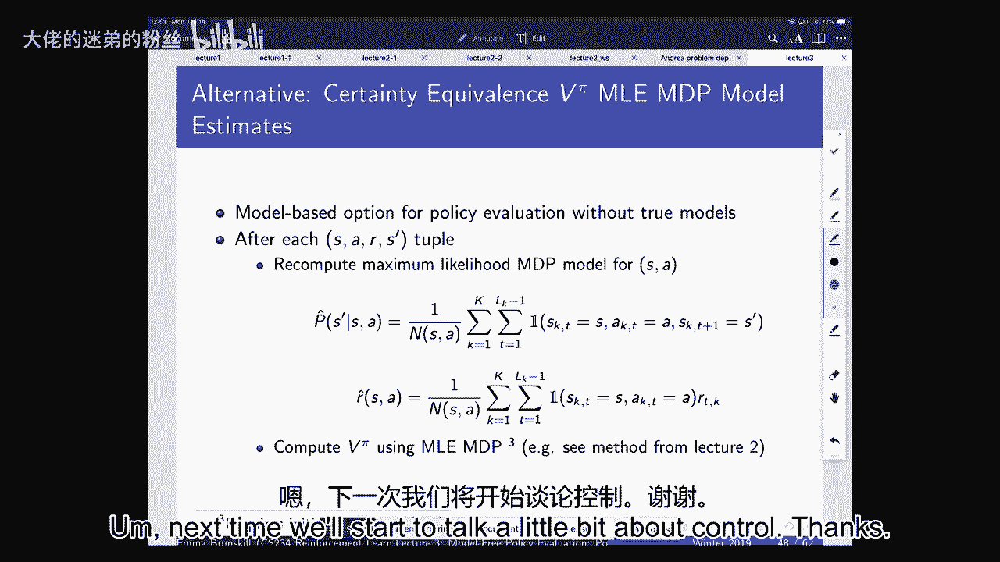

# 3：无模型策略评估 🧠

在本节课中，我们将学习如何在不了解环境模型（即不知道状态转移概率和奖励函数）的情况下，评估一个给定策略的好坏。我们将介绍三种主要方法：动态规划、蒙特卡洛方法和时序差分学习，并比较它们的特性。

---

## 回顾：策略评估与价值函数

上一节我们介绍了马尔可夫决策过程的基本框架。本节中，我们来看看策略评估的核心概念：价值函数。

策略评估的目标是：给定一个策略 `π`，计算在该策略下每个状态（或状态-动作对）的预期累积折扣奖励。

我们定义了两种关键的价值函数：
*   **状态价值函数 `V^π(s)`**：表示从状态 `s` 开始，遵循策略 `π` 所能获得的预期回报。
    *   **公式**：`V^π(s) = E[G_t | S_t = s]`，其中 `G_t = R_{t+1} + γR_{t+2} + γ^2R_{t+3} + ...`
*   **状态-动作价值函数 `Q^π(s, a)`**：表示在状态 `s` 下先执行动作 `a`，然后遵循策略 `π` 所能获得的预期回报。
    *   **公式**：`Q^π(s, a) = E[G_t | S_t = s, A_t = a]`

其中，`γ` 是折扣因子（0 ≤ γ ≤ 1），用于权衡即时奖励和未来奖励。

---

## 动态规划策略评估

当我们拥有环境的完整模型（即知道状态转移概率 `P(s'|s,a)` 和奖励函数 `R(s,a)`）时，可以使用动态规划进行策略评估。

动态规划通过迭代更新来求解贝尔曼方程。其核心思想是“自举”（bootstrapping），即用当前的价值估计来更新下一个状态的价值估计。

以下是动态规划策略评估的算法步骤：
1.  初始化价值函数 `V(s)`，例如全部设为0。
2.  重复以下更新，直到价值函数收敛（变化小于阈值 ε）：
    *   对每个状态 `s`，计算：
        *   `V_{k+1}(s) = Σ_a π(a|s) Σ_{s'} P(s'|s,a) [ R(s,a) + γ * V_k(s') ]`
3.  收敛后得到的 `V(s)` 即为策略 `π` 下的状态价值函数。

**特点总结**：
*   **需要模型**：必须已知 `P(s'|s,a)` 和 `R(s,a)`。
*   **自举**：使用当前估计值 `V_k` 来更新。
*   **假设马尔可夫性**：价值只依赖于当前状态。
*   **收敛性**：在已知模型下，能收敛到精确解。

---

## 蒙特卡洛策略评估

当我们没有环境模型时，可以使用蒙特卡洛方法。其核心思想是通过在环境中实际运行策略，收集完整的轨迹（从开始到结束），然后计算实际回报的平均值来估计价值。

以下是首次访问蒙特卡洛策略评估的算法步骤：
1.  初始化：对所有状态 `s`，设置 `V(s) = 0`，`Returns(s) = 空列表`。
2.  循环多轮（每轮称为一个“幕”或 episode）：
    *   使用策略 `π` 在环境中运行，直到幕终止，得到状态、动作、奖励序列。
    *   计算每个时间步 `t` 的回报 `G_t`（从 `t` 开始到幕结束的累积折扣奖励）。
    *   对于此幕中访问到的每个状态 `s`：
        *   如果是首次访问到状态 `s`，则将 `G_t` 加入 `Returns(s)`。
        *   更新 `V(s)` 为 `Returns(s)` 的平均值。

**特点总结**：
*   **无需模型**：只需要能从环境中采样轨迹。
*   **无自举**：直接使用完整的实际回报 `G_t`。
*   **不假设马尔可夫性**：即使环境不是完全马尔可夫的，方法依然适用。
*   **需要幕式任务**：任务必须有明确的终止状态。
*   **收敛性**：是无偏估计，随着数据量增加会收敛到真实值，但方差可能较高。
*   **效率**：必须等到一幕结束才能更新，数据利用可能不够高效。

---

## 时序差分学习

时序差分学习结合了动态规划的自举思想和蒙特卡洛的采样思想。它不需要等到一幕结束，而是在每一步之后立即进行更新。

最简单的 TD 算法是 TD(0)，其更新规则如下：
*   观察到转移 `(S_t, A_t, R_{t+1}, S_{t+1})` 后，立即更新：
    *   `V(S_t) ← V(S_t) + α [ R_{t+1} + γ * V(S_{t+1}) - V(S_t) ]`
*   其中 `α` 是学习率，`[ R_{t+1} + γ * V(S_{t+1}) ]` 被称为 **TD 目标**，`[ TD目标 - V(S_t) ]` 被称为 **TD 误差**。

以下是 TD(0) 策略评估的在线算法步骤：
1.  初始化价值函数 `V(s)`。
2.  循环（每个时间步）：
    *   在状态 `S_t`，根据策略 `π` 选择动作 `A_t`。
    *   执行动作，观察到奖励 `R_{t+1}` 和下一个状态 `S_{t+1}`。
    *   使用上述公式更新 `V(S_t)`。
    *   `S_t ← S_{t+1}`。

**特点总结**：
*   **无需模型**：只需要采样经验元组 `(s, a, r, s')`。
*   **自举**：使用当前估计 `V(S_{t+1})` 来更新。
*   **假设马尔可夫性**：依赖于状态价值的马尔可夫假设。
*   **适用于持续任务**：不需要幕式终止。
*   **在线更新**：无需等待幕结束，学习更快。
*   **收敛性**：在表格表示下，能收敛到真实值，但估计是有偏的（因为使用了不完美的自举目标），方差通常低于蒙特卡洛方法。

---

## 方法比较与权衡

以下是三种方法在几个关键属性上的比较：

| 属性 | 动态规划 | 蒙特卡洛 | 时序差分 |
| :--- | :--- | :--- | :--- |
| **是否需要模型** | 是 | 否 | 否 |
| **是否处理持续任务** | 是 | 否 | 是 |
| **是否假设马尔可夫性** | 是 | 否 | 是 |
| **是否收敛到真值** | 是（给定模型） | 是（无偏） | 是（一致） |
| **更新方式** | 自举 | 采样完整回报 | 自举 + 采样 |
| **偏差/方差** | 无偏（给定模型） | 无偏，高方差 | 有偏，低方差 |
| **数据效率** | 高（利用模型） | 低（高方差） | 中等/高（利用序列结构） |
| **计算效率** | 高（迭代计算） | 低（需完整轨迹） | 高（在线更新） |

**如何选择**：
*   如果你有一个准确的环境模型，**动态规划**是最佳选择。
*   如果你的任务必须是幕式的，且你关心无偏估计或不满足马尔可夫性，**蒙特卡洛**方法更合适。
*   在大多数无模型、在线学习的场景下，尤其是持续任务中，**时序差分学习**因其高效性和灵活性而最为常用。

---

## 批量数据下的策略评估

最后，我们考虑一种情况：我们拥有一个固定的事先收集好的数据集（批量数据），如何用它来评估策略？

在这种情况下：
*   **蒙特卡洛方法** 会计算数据集中每个状态首次出现时的实际回报，然后取平均。它最小化的是关于观测回报的均方误差。
*   **时序差分方法** 会反复遍历数据集进行更新。它实际上会收敛到基于该数据集的最大似然估计马尔可夫模型（通过计数估计 `P(s'|s,a)` 和 `R(s,a)`）所对应的动态规划解。

这意味着，**如果环境确实是马尔可夫的**，TD 方法能更有效地利用数据的序列结构信息，从而可能得到比蒙特卡洛方法更好的估计。**如果环境不是马尔可夫的**，那么 TD 方法的马尔可夫假设会导致有偏的估计，此时蒙特卡洛方法可能更可靠。

---

## 总结

本节课中我们一起学习了无模型策略评估的三种核心方法：
1.  **动态规划**：需要完整模型，通过自举和迭代求解贝尔曼方程。
2.  **蒙特卡洛方法**：无需模型，通过采样完整轨迹并平均回报来估计价值，无偏但方差高，需要幕式任务。
3.  **时序差分学习**：无需模型，结合自举和采样，每一步后在线更新，适用于持续任务，是有偏但低方差的估计器。

理解这些方法在偏差、方差、数据需求和对环境假设上的权衡，对于在实际问题中选择和应用合适的强化学习算法至关重要。