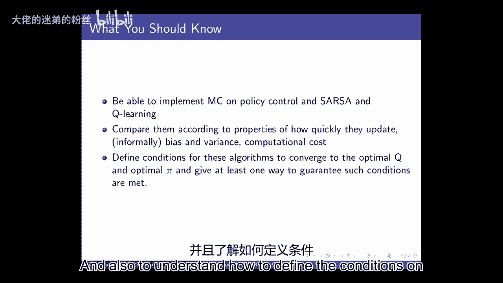

# 4：无模型控制 🎮

在本节课中，我们将学习当智能体不知道环境如何运作时，如何做出好的决策。我们将重点关注无模型控制方法，即不显式构建环境的动态或奖励模型，而是直接从经验中学习。

---

## 概述 📋

上一节我们介绍了如何评估一个给定的策略。本节中，我们将探讨一个在强化学习中更常见的问题：当智能体不知道世界模型时，它应该如何做出决策以最大化其预期的累积折扣奖励。我们将从广义策略迭代开始，然后介绍蒙特卡洛方法和时序差分方法在策略控制中的应用，并讨论探索与利用的平衡。

---

## 广义策略迭代 🔄

如果我们回到已知世界模型时的策略迭代，其过程是：随机初始化一个策略，然后进行策略评估（计算当前策略的值函数），接着进行策略改进（根据值函数更新策略），并不断迭代。这保证了策略的单调改进，并最终收敛到最优策略。

然而，在无模型的情况下，我们无法直接获得动态或奖励模型。一个直接的思路是：我们可以尝试从经验中估计一个世界模型，然后使用该模型进行策略迭代。但本节课我们将采用另一条路径：直接估计状态-动作值函数（Q函数），然后利用Q函数进行策略改进。

以下是进行蒙特卡洛策略Q评估的步骤：
*   与蒙特卡洛策略价值评估类似，但对象从状态值V变为状态-动作值Q。
*   我们通过采样幕（episode）来获得经验。
*   对于幕中每个时间步出现的状态-动作对 (s, a)，计算其到幕尾的累积回报 G_t。
*   更新该状态-动作对的Q值估计，例如采用增量平均的方式。

一旦我们获得了Q函数的估计，策略改进就变得非常简单：新策略可以直接定义为关于当前Q函数的贪婪策略。

---

## 探索与利用 ⚖️

但上述方法存在一个问题：如果我们遵循一个确定性策略，那么在同一个状态s下，我们永远只会采取策略所规定的那个动作a。这意味着我们无法获得在该状态下采取其他动作会怎样的信息，从而策略改进可能无法进行。

因此，我们必须引入某种形式的探索。一个简单而有效的方法是通过ε-贪婪策略来平衡探索与利用。

假设动作空间A是有限的，其大小为|A|。关于状态-动作值Q的ε-贪婪策略定义如下：
*   以概率 (1 - ε)，选择当前Q值估计下最优的动作（即利用）。
*   以概率 ε，随机均匀地选择动作空间A中的任何一个动作（即探索）。

---

## 蒙特卡洛控制 🎲

现在，我们可以将策略评估和策略改进结合起来，进行在线的蒙特卡洛控制。

以下是蒙特卡洛在线控制算法的概要步骤：
*   初始化Q(s, a)和计数器N(s, a)。
*   循环每一幕：
    *   根据当前的ε-贪婪策略（基于Q）生成一幕经验。
    *   对于幕中每个状态-动作对(s, a)：
        *   计算其首次出现后的累积回报G。
        *   更新计数器：N(s, a) += 1。
        *   更新Q值：Q(s, a) += (G - Q(s, a)) / N(s, a)。
    *   更新策略：将策略设置为关于新Q值的ε-贪婪策略。
    *   可以衰减ε（例如ε = 1/k），以满足“无限探索下的贪婪”（Greedy in the Limit with Infinite Exploration, GLIE）条件，从而保证收敛到最优策略。

---

## 时序差分控制：Sarsa ⏱️

蒙特卡洛方法需要等到一幕结束才能进行更新。时序差分（TD）方法则可以在每个时间步之后立即更新，通常学习更快。

Sarsa是一种在策略的TD控制算法，其名称来源于更新所需的数据序列：(S_t, A_t, R_{t+1}, S_{t+1}, A_{t+1})。

Sarsa的更新公式如下：
`Q(S_t, A_t) ← Q(S_t, A_t) + α [ R_{t+1} + γ * Q(S_{t+1}, A_{t+1}) - Q(S_t, A_t) ]`

其中α是学习率，γ是折扣因子。注意，更新中使用了**实际执行的下一个动作** A_{t+1} 的Q值。

更新后，策略可以同步地改进为关于当前Q的ε-贪婪策略。Sarsa的收敛需要满足类似的条件：足够小的学习率序列，以及行为策略满足GLIE条件。

---

## 时序差分控制：Q-Learning 🧠

Q-Learning是一种离策略的TD控制算法，它同样在每个时间步更新，但更新方式与Sarsa不同。

Q-Learning的更新公式如下：
`Q(S_t, A_t) ← Q(S_t, A_t) + α [ R_{t+1} + γ * max_{a} Q(S_{t+1}, a) - Q(S_t, A_t) ]`

关键区别在于，Q-Learning在更新时，使用的是下一状态 S_{t+1} 下所有可能动作的**最大Q值估计**，而不是实际采取的动作的Q值。这意味着它学习的是最优动作的价值，而不依赖于当前策略具体选择了哪个动作。

因此，Q-Learning中的行为策略（用于生成经验）可以是任意的（如ε-贪婪策略），而目标策略（被评估和改进的策略）则是关于Q的完全贪婪策略。这实现了“异策略”学习。

---

## 最大化偏差与双Q学习 🎯

在Q-Learning等使用最大化操作的算法中，存在一个称为“最大化偏差”的问题。即使对每个动作价值的估计是无偏的，对这些估计值取最大值得到的值，其期望可能会高于真实的最大值。这会导致算法过于乐观，并在早期倾向于选择那些因随机波动而偶然被高估的动作。

双Q学习是缓解此问题的一种方法。其核心思想是维护两个独立的Q函数估计，Q1和Q2。
*   更新时，随机决定用哪个Q函数来选择最大化动作，用另一个Q函数来评估该动作的价值。
*   例如，以50%的概率使用Q1选择动作：a* = argmax_a Q1(S_{t+1}, a)，然后用Q2来评估：target = R + γ * Q2(S_{t+1}, a*)，并更新Q1。
*   另一半概率则反之，更新Q2。

这种方法可以消除最大化偏差，在某些问题上能带来更稳定、更高效的学习性能。

---

## 总结 📝

本节课中，我们一起学习了无模型控制的基本方法。
*   我们从广义策略迭代框架出发，将其适配到无模型设定，通过直接估计Q函数并进行贪婪改进。
*   我们认识到探索的必要性，并引入了ε-贪婪策略来平衡探索与利用。
*   我们详细介绍了两种主要的无模型控制算法：在策略的Sarsa和离策略的Q-Learning，理解了它们更新公式的区别及其含义。
*   最后，我们探讨了Q-Learning中可能存在的最大化偏差问题，并简要介绍了双Q学习作为解决方案。

这些算法是强化学习的基础，使我们能够在未知环境中学到优秀的策略。