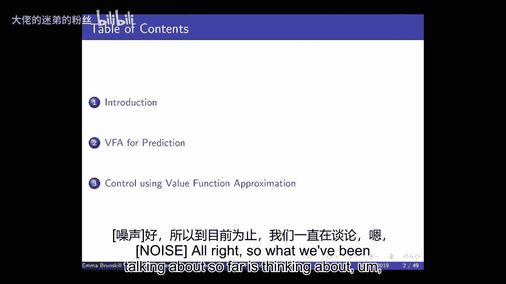
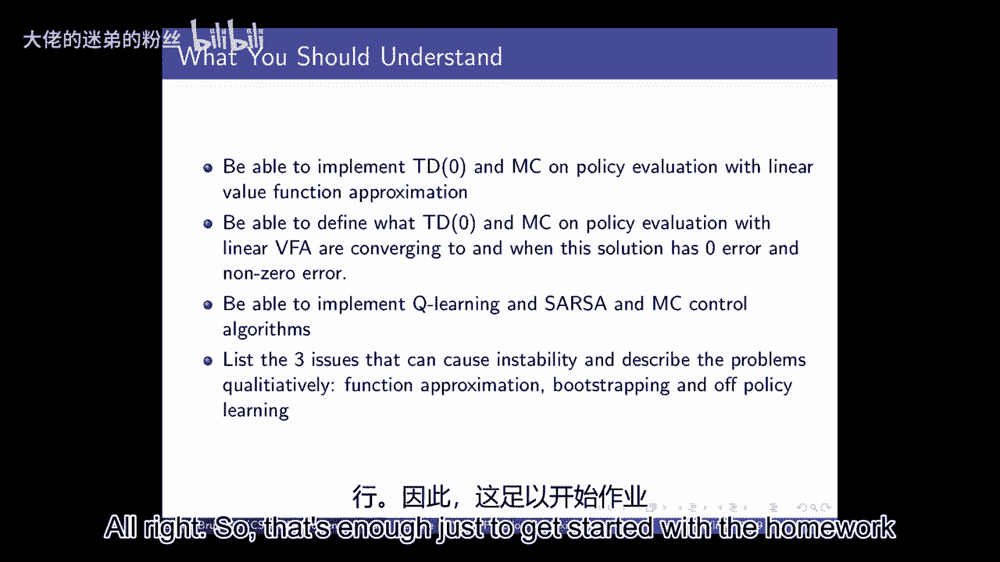

# 5：价值函数近似 📈

在本节课中，我们将学习价值函数近似。当状态和动作空间非常庞大时，我们无法使用表格来存储每个状态或状态-动作对的价值。因此，我们需要使用参数化的函数来近似表示价值函数，从而实现泛化。

---

## 概述

到目前为止，我们讨论的都是如何在未知环境中评估策略和进行序列决策。今天，我们将开始讨论价值函数近似。这意味着我们将不再使用表格来记录价值，而是使用一个带有参数的函数（如线性模型或深度神经网络）来表示价值函数。这种方法可以显著减少内存和计算需求，并可能减少学习所需的数据量。

然而，选择不同的函数近似器会带来不同的权衡。一个表达能力强的模型可能需要更多数据来学习，而一个简单的模型可能无法表示复杂的价值函数。接下来，我们将从线性价值函数近似开始，逐步探讨其在策略评估和控制中的应用。

---

## 为什么需要价值函数近似？🤔

许多现实世界问题（如雅达利游戏）具有巨大的状态和动作空间。我们无法为每个状态或状态-动作对建立一个表格。因此，我们需要泛化能力：即使遇到从未见过的状态，也能基于先前的经验做出好的决策。

使用价值函数近似可以带来以下好处：
*   **减少内存需求**：无需存储庞大的表格。
*   **减少计算需求**：更新参数比更新整个表格更高效。
*   **可能减少所需经验**：通过泛化，智能体可能用更少的数据学到好的策略。

但同时，我们也面临权衡。一个表达能力有限的近似器（假设空间小）虽然需要的数据少，但可能无法表示好的策略或价值函数。这类似于机器学习中的偏差-方差权衡。

---

## 函数近似器的选择 🛠️

几乎任何可用于监督学习的函数近似器都可以用于强化学习中的价值函数近似，例如：
*   神经网络
*   决策树
*   最近邻法
*   小波基

在本课程中，我们将主要关注**可微分的**近似器（如线性模型和神经网络），因为它们具有平滑的优化特性，更容易优化。选择哪种近似器通常取决于具体应用场景，例如是否需要模型的可解释性。

目前最流行的两类是**线性价值函数近似**和**深度神经网络**。我们将从线性近似开始，因为它研究得最深入，并且可以看作是深度神经网络中特征计算的基础。

---

## 梯度下降法回顾 📉

为了优化我们的参数化价值函数，我们需要使用梯度下降法。假设我们有一个关于参数向量 **w** 的可微目标函数 **J(w)**。我们的目标是找到最小化 **J(w)** 的 **w**。

梯度 **∇J(w)** 是 **J(w)** 对 **w** 中每个参数的偏导数向量。梯度下降的更新规则为：

**w ← w - α ∇J(w)**

其中 **α** 是学习率。通过多次迭代，我们可以收敛到一个局部最优解。在强化学习中，我们将使用这种思想来平滑地更新价值函数的参数表示。

---

## 线性价值函数近似与策略评估 🔍

上一节我们回顾了梯度下降法，本节我们来看看如何将其应用于策略评估。策略评估是指，给定一个策略 **π**，我们想要估计遵循该策略所能获得的期望折扣回报 **V^π(s)**。

### 理想情况：有“先知”提供真值

假设有一个“先知”能告诉我们任何状态 **s** 在策略 **π** 下的真实价值 **V^π(s)**。那么，我们的目标就是用一个参数化函数 **V̂(s, w)** 来拟合这些 (状态, 价值) 对。这类似于一个监督学习问题。

我们通常使用均方误差作为损失函数：
**J(w) = E_π[ (V^π(s) - V̂(s, w))^2 ]**

使用随机梯度下降进行更新。对于线性函数近似，**V̂(s, w) = x(s)^T w**，其中 **x(s)** 是状态 **s** 的特征向量。此时，权重更新公式为：
**Δw = α (V^π(s) - V̂(s, w)) x(s)**

### 现实情况：无模型函数近似

然而，我们并没有“先知”。在现实中，我们需要使用从策略 **π** 中采样得到的数据来估计价值。我们之前学过的蒙特卡洛法和时序差分法在这里依然适用，只是现在更新的是函数近似器的参数 **w**，而不是表格中的条目。

首先，我们需要为状态选择一个特征表示 **x(s)**。特征工程非常重要，糟糕的特征可能导致状态混淆（非马尔可夫性），从而影响学习。深度神经网络的一个优势就是可以自动学习好的特征表示。

---

## 蒙特卡洛价值函数近似 🎲

在蒙特卡洛方法中，我们从一次完整的回合中获取回报 **G_t**，并将其作为真实价值 **V^π(S_t)** 的无偏但可能有噪声的估计。然后，我们将其用于监督学习。

对于线性近似，更新规则变为：
**Δw = α (G_t - V̂(S_t, w)) x(S_t)**

算法流程如下：
1.  初始化权重向量 **w**（例如，全零向量）。
2.  使用策略 **π** 采样一个完整回合。
3.  对该回合中首次访问的每个状态 **S_t**：
    *   计算回报 **G_t**。
    *   更新权重：**w ← w + α (G_t - V̂(S_t, w)) x(S_t)**

可以证明，在线性近似和策略评估（同轨策略）的设置下，蒙特卡洛法会收敛到可能的最小均方误差解。

---

## 时序差分价值函数近似 ⚡

上一节我们介绍了蒙特卡洛法，本节我们来看看更高效的时序差分法。TD学习结合了采样和自举。在TD(0)中，我们使用TD目标 **R + γ V̂(S‘, w)** 作为当前状态价值的估计。

对于线性近似，我们的更新目标是使预测值接近TD目标。权重更新公式为：
**Δw = α [R + γ V̂(S‘, w) - V̂(S, w)] x(S)**

算法流程如下：
1.  初始化权重向量 **w**。
2.  对每一步：
    *   根据策略选择动作 **A**，得到元组 **(S, A, R, S‘)**。
    *   更新权重：**w ← w + α [R + γ V̂(S‘, w) - V̂(S, w)] x(S)**

在策略评估的设定下，TD(0)也能收敛，但其解的最优性保证不如蒙特卡洛法严格，误差在一个常数因子 **1/(1-γ)** 内。

---

## 从评估到控制：价值函数近似的挑战 🎯

前面几节我们都在讨论策略评估，本节我们将探讨价值函数近似在控制问题中的应用。控制意味着我们要同时学习最优策略和最优价值函数（通常是Q函数）。

现在，我们用参数化的函数 **Q̂(s, a, w)** 来近似状态-动作价值函数。更新过程与策略评估类似，但需要与策略改进（如ε-贪心）交错进行。

以下是不同算法的更新公式（线性近似）：
*   **蒙特卡洛控制**：**Δw = α (G_t - Q̂(S_t, A_t, w)) x(S_t, A_t)**
*   **Sarsa**：**Δw = α [R + γ Q̂(S‘, A‘, w) - Q̂(S, A, w)] x(S, A)**
*   **Q-learning**：**Δw = α [R + γ max_{a‘} Q̂(S‘, a‘, w) - Q̂(S, A, w)] x(S, A)**

### “致命三要素”与不稳定性

当我们将**函数近似**、**自举（Bootstrapping）**和**离轨策略学习**三者结合时，就可能出现严重问题，这被称为“致命三要素”。在这种情况下，算法可能无法收敛，或者收敛到一个很差的解。

不稳定的原因包括：
1.  **分布不匹配**：用于更新Q函数的数据分布（行为策略）与目标策略下的状态分布不同。
2.  **投影的扩张性**：贝尔曼备份算子本身是一个压缩映射，但将其结果投影回函数近似空间的操作可能是一个扩张映射，导致值函数发散。

Baird反例清晰地展示了在离轨策略学习下，即使使用线性近似，Q-learning的权重也可能发散到无穷大。

---

## 总结

在本节课中，我们一起学习了价值函数近似。我们从为什么需要近似开始，讨论了不同近似器的选择，并回顾了梯度下降法这一核心优化工具。

我们重点探讨了线性价值函数近似在策略评估中的应用，分别介绍了蒙特卡洛法和时序差分法的更新规则及其收敛性质。最后，我们探讨了将价值函数近似用于控制问题时面临的挑战，特别是“致命三要素”导致的不稳定性。

理解这些基础概念对于后续学习深度强化学习至关重要。在接下来的课程中，我们将深入探讨深度神经网络作为函数近似器在强化学习中的强大能力。