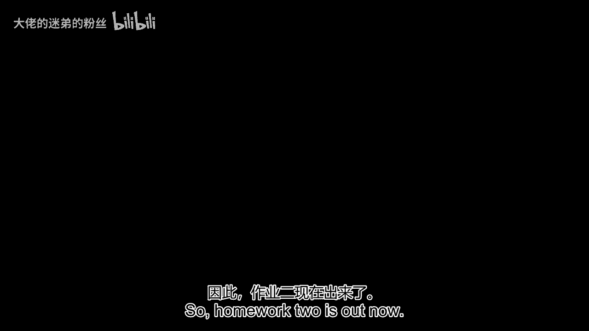
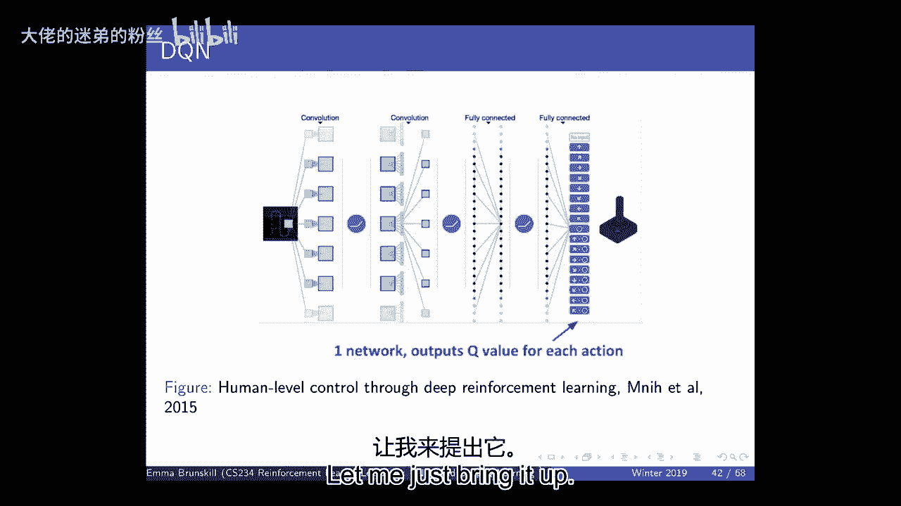
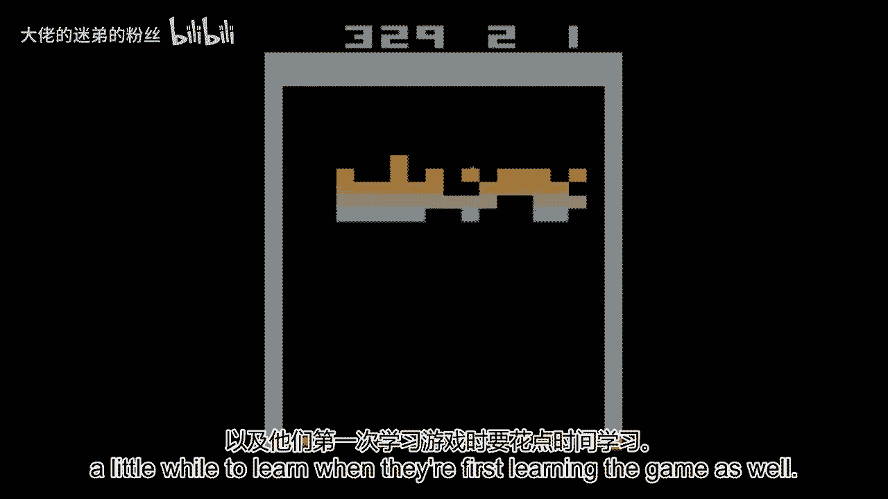
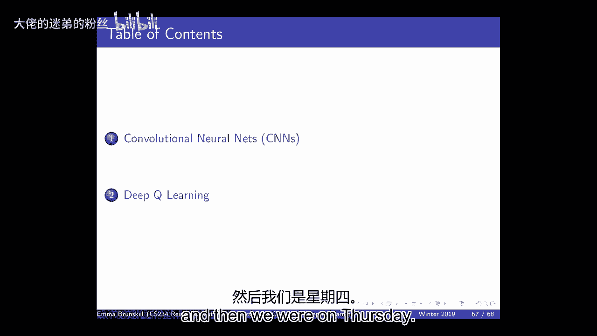
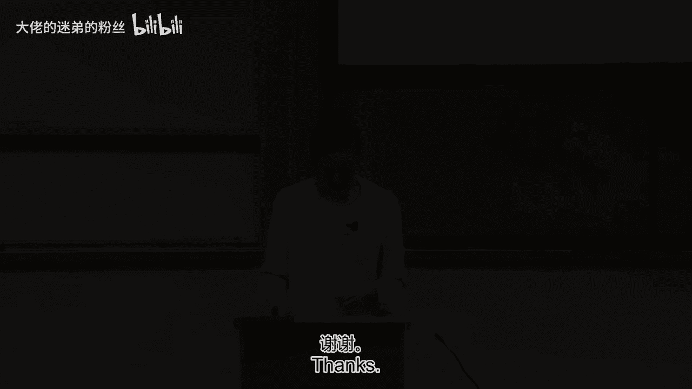
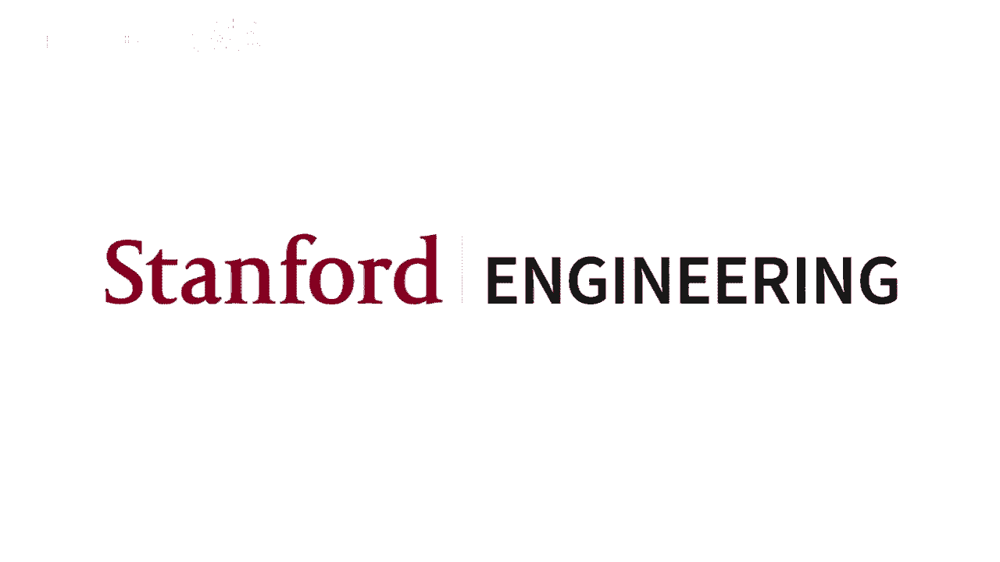

# 6：卷积神经网络与深度Q学习 🧠🎮

在本节课中，我们将学习深度学习和深度强化学习的基础知识。我们将探讨如何使用深度神经网络，特别是卷积神经网络（CNN），来近似值函数，并介绍深度Q学习（DQN）及其核心改进。课程内容旨在让初学者能够理解这些概念。

---

## 概述 📋

本节课我们将首先简要介绍深度学习，然后重点讨论深度强化学习。我们将了解为什么在处理高维输入（如图像）时，函数逼近变得至关重要。接着，我们将探讨卷积神经网络的结构和优势，最后深入讲解深度Q学习算法及其关键创新点。

---

## 深度学习简介 🧠

上一节我们介绍了线性值函数逼近。本节中，我们来看看更强大的函数逼近器——深度神经网络。

深度神经网络由多个函数组合而成。输入 `x` 经过一系列带有权重的函数变换，最终输出预测值 `y`（例如Q值）。损失函数 `J` 用于衡量预测误差。

其核心公式可表示为：
`y = h_n(...h_2(h_1(x; w_1); w_2)...; w_n)`

其中，`h` 代表层函数，可以是线性或非线性变换（激活函数）。常见的激活函数包括Sigmoid和ReLU。

深度神经网络的优势在于：
*   **强大的表示能力**：通过组合函数，可以表示非常复杂的函数。
*   **通用逼近器**：只要网络足够大，理论上可以逼近任何函数。
*   **自动微分**：借助TensorFlow等框架，可以自动计算梯度，无需手动推导。

我们可以使用链式法则（反向传播）和随机梯度下降来更新网络参数 `W`，以最小化损失。

---

## 卷积神经网络（CNN） 👁️

上一节我们了解了通用的深度神经网络。本节中，我们来看看专门为处理图像等具有空间结构的数据而设计的卷积神经网络。

标准的前馈神经网络在处理图像时（例如1000x1000像素）会产生海量参数，且忽略了图像的空间局部相关性。CNN通过以下两个核心思想解决了这些问题：

1.  **局部连接与权重共享**：每个神经元（或滤波器）只连接输入图像的一小块区域（感受野），而不是全部像素。并且，同一个滤波器会滑动扫描整个图像，其权重是共享的。这极大地减少了参数量。
    *   **公式/操作**：对于一个5x5的滤波器在图像上滑动（卷积操作），我们只需要 `5*5=25` 个权重参数，而不是与全图像素连接所需的百万级参数。

2.  **池化层**：在卷积层之后，通常会加入池化层（如最大池化）。它对局部区域进行下采样，保留最显著的特征，同时使特征对微小平移具有不变性，并进一步降低维度。

CNN的典型流程是：输入图像 -> 多个（卷积层 + 激活函数 + 池化层）组合 -> 展平 -> 全连接层 -> 输出（如Q值）。这本质上是从原始像素中自动学习并提取有用的层次化特征表示。

---

## 从函数逼近到深度Q学习 🚀

我们之前讨论了值函数逼近的必要性。本节中，我们来看看如何将深度神经网络，特别是CNN，应用于强化学习中的Q学习，即深度Q学习（DQN）。

传统Q学习在表格形式下工作良好，但无法处理像雅达利游戏像素这样的高维状态。DQN使用深度神经网络来近似Q函数：`Q(s, a; w)`。

Q学习更新规则的核心是：
`w ← w + α * [ (r + γ * max_a‘ Q(s‘, a‘; w)) - Q(s, a; w) ] * ∇_w Q(s, a; w)`

然而，直接将神经网络与Q学习结合会遇到两大问题：
1.  **样本相关性**：连续的状态转移样本是高度相关的，不符合监督学习样本独立同分布的假设。
2.  **非平稳目标**：要拟合的Q目标值本身随着网络参数 `w` 的更新而不断变化，导致训练不稳定。

---

## DQN的核心创新：经验回放与固定Q目标 ⚙️

为了解决上述问题，DQN引入了两项关键技术：

**1. 经验回放**
*   **方法**：智能体将经历过的状态转移元组 `(s, a, r, s‘)` 存储在一个固定大小的回放缓冲区中。训练时，随机从缓冲区中采样一小批（minibatch）经验来进行Q学习更新。
*   **作用**：打破了样本间的相关性，提高了数据利用率，使更新更接近独立同分布。

**2. 固定Q目标**
*   **方法**：使用两个网络。一个**主网络**（参数 `w`）用于选择动作和更新。另一个**目标网络**（参数 `w-`）用于计算Q学习目标中的 `max_a‘ Q(s‘, a‘; w-)`。目标网络的参数定期（例如每N步）从主网络复制，在间隔期内保持固定。
*   **作用**：在一段时间内稳定了学习目标，缓解了非平稳性问题，提高了训练的稳定性。

以下是DQN训练流程的简要步骤：
1.  初始化主网络和目标网络，清空回放缓冲区。
2.  根据当前策略（如ε-greedy）与环境交互，收集经验并存入缓冲区。
3.  从缓冲区随机采样一个minibatch的经验。
4.  使用目标网络计算Q目标值：`y_j = r_j + γ * max_a‘ Q(s‘_j, a‘; w-)`。
5.  计算主网络的预测值与目标值之间的均方误差损失。
6.  对损失执行随机梯度下降，更新主网络参数 `w`。
7.  每隔C步，将主网络参数复制到目标网络：`w- ← w`。
8.  重复步骤2-7。

---

## DQN的改进与扩展 🔧

基本的DQN取得了成功，但后续研究提出了许多改进方法。以下是三个重要的扩展：

**1. 双DQN**
*   **思想**：解决Q学习中固有的“最大化偏差”问题。在计算目标值时，使用主网络来选择动作，使用目标网络来评估该动作的价值。
*   **目标公式**：`y_j = r_j + γ * Q(s‘_j, argmax_a‘ Q(s‘_j, a‘; w); w-)`

**2. 优先经验回放**
*   **思想**：不是均匀地从回放缓冲区采样，而是根据经验的“TD误差”（即 `|y - Q(s, a; w)|`）赋予其不同的采样优先级。误差越大，优先级越高。
*   **作用**：让网络更频繁地从“意想不到”或“信息量大”的经验中学习，可以加速收敛并提升性能。

**3. 竞争网络结构**
*   **思想**：将Q网络分解为两个流：一个估计状态价值 `V(s)`，另一个估计动作优势 `A(s, a)`。最后将两者组合得到Q值：`Q(s, a) = V(s) + A(s, a) - mean_a(A(s, a))`。
*   **作用**：这种结构有助于网络更清晰地学习哪些状态是好的，以及在一个状态下各个动作的相对好坏，在某些任务上表现更优。

---

## 总结 🎯

本节课我们一起学习了深度强化学习的基础。
*   我们首先回顾了深度神经网络作为强大函数逼近器的原理。
*   接着，我们了解了卷积神经网络如何利用局部连接和权重共享高效处理图像数据。
*   然后，我们深入探讨了深度Q学习（DQN），它通过深度神经网络来近似Q函数，以解决高维状态空间问题。
*   我们重点分析了DQN的两大支柱：**经验回放**和**固定Q目标**，它们分别用于打破样本相关性和稳定学习目标。
*   最后，我们简要介绍了DQN的几种有效改进：**双DQN**、**优先经验回放**和**竞争网络结构**。

这些技术共同使得智能体能够直接从像素输入中学习玩转复杂的雅达利游戏，标志着深度强化学习发展的重要里程碑。在接下来的实践中，你将有机会亲自实现并体验这些算法。