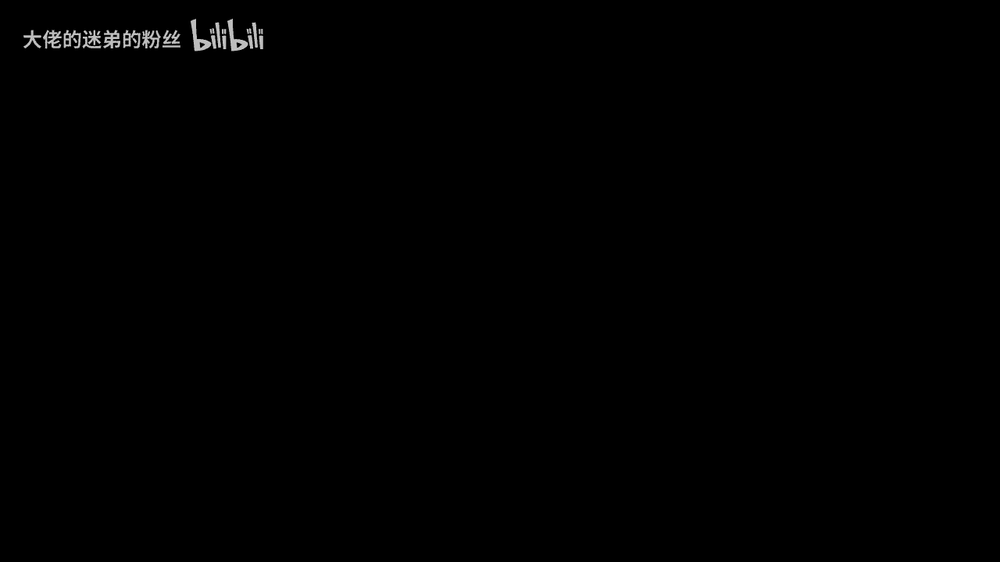
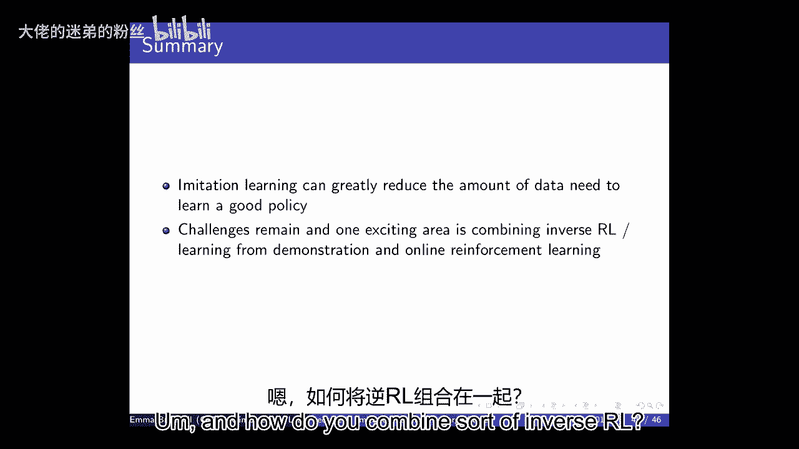
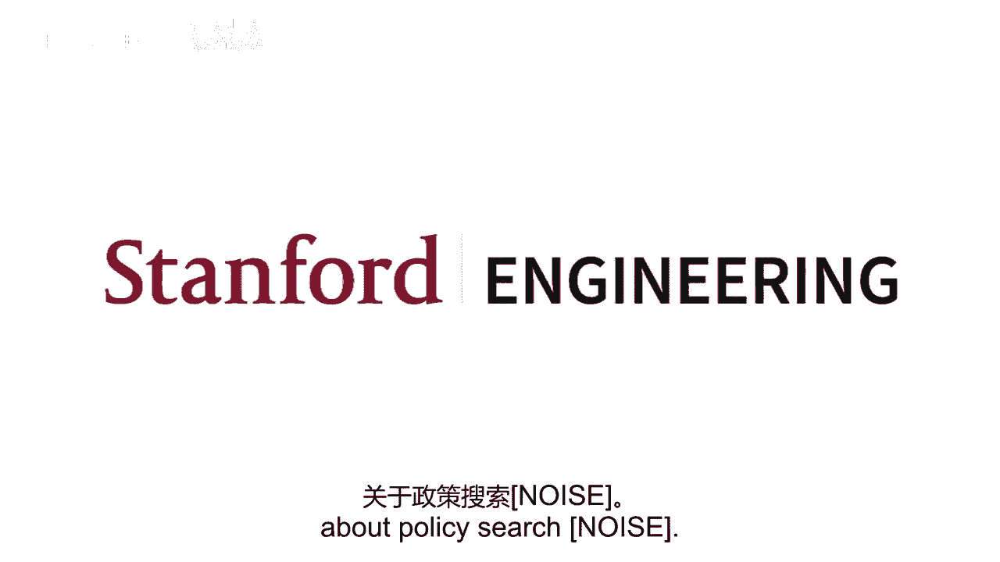

# 7：模仿学习 🧠




在本节课中，我们将学习模仿学习的基本概念、方法及其在强化学习中的应用。模仿学习旨在通过观察专家演示来学习策略或推断奖励函数，从而在复杂环境中实现高效学习。

---

## 概述 📋

我们首先回顾了深度Q网络（DQN）及其扩展，然后探讨了模仿学习的核心思想。模仿学习主要分为两类：行为克隆和逆强化学习。我们将详细讨论这两种方法，并分析它们在大状态空间中的应用和挑战。

---

## DQN回顾与扩展 🔄

上一节我们介绍了DQN及其核心思想。本节中，我们来看看DQN的几个重要扩展。

DQN结合了Q学习和深度神经网络作为函数逼近器。其两个关键算法改进是经验回放和固定Q目标。固定Q目标意味着在更新Q函数时，用于计算目标值的网络权重在一段时间内保持不变，从而为监督学习提供了更稳定的目标。

以下是DQN训练过程的核心步骤：

```python
# 伪代码示例：DQN训练循环
for episode in range(total_episodes):
    state = env.reset()
    for step in range(max_steps):
        # 使用ε-贪婪策略选择动作
        action = epsilon_greedy_policy(state, q_network)
        next_state, reward, done, _ = env.step(action)
        # 将经验存储到回放缓冲区
        replay_buffer.store(state, action, reward, next_state, done)
        # 从回放缓冲区采样小批量经验
        batch = replay_buffer.sample(batch_size)
        # 计算目标Q值（使用固定目标网络）
        target_q = reward + gamma * max(target_network(next_state))
        # 计算当前Q网络的预测值
        current_q = q_network(state)[action]
        # 计算损失并更新Q网络
        loss = mse_loss(current_q, target_q)
        optimizer.zero_grad()
        loss.backward()
        optimizer.step()
        # 定期更新目标网络
        if step % target_update_freq == 0:
            target_network.load_state_dict(q_network.state_dict())
        state = next_state
        if done:
            break
```

### DQN的主要扩展

以下是DQN的三个重要扩展方法：

1.  **双DQN**：旨在解决最大化偏差问题。它使用两个网络：一个用于选择动作，另一个用于评估动作的价值。这可以通过定期切换两个网络的角色来实现，从而更快地传播信息。
2.  **优先经验回放**：根据时序差分误差的大小对经验回放缓冲区中的样本进行优先级排序。误差越大的样本被采样的概率越高，从而加速学习。
3.  **竞争网络架构**：将Q函数分解为状态价值函数和优势函数，分别用不同的网络分支进行学习。这有助于网络学习到与状态价值和动作优势相关的不同特征。

这些扩展方法通常可以叠加使用，从而在性能上获得累加性的提升。

---

## 模仿学习简介 👥

在复杂或稀疏奖励的环境中，传统的强化学习方法可能需要大量交互数据。模仿学习提供了一种替代方案，即通过观察专家演示来学习策略。

### 问题设定

模仿学习的问题设定通常如下：
*   **已知**：状态空间、动作空间、转移模型（有时未知）、一组专家演示轨迹。
*   **未知**：奖励函数。
*   **目标**：从演示中学习一个策略（行为克隆）或推断出奖励函数（逆强化学习）。

---

## 行为克隆 🤖

行为克隆是最简单的模仿学习方法，它将学习策略视为一个标准的监督学习问题。

### 方法

我们定义一个策略类别（如神经网络），并将专家演示中的状态-动作对作为训练数据，学习一个从状态到动作的映射。

### 挑战：误差累积

在标准的监督学习中，我们假设数据是独立同分布的。然而，在强化学习环境中，智能体的动作会影响其访问到的状态分布。

**核心问题**：如果学习到的策略在某个状态下做出了与专家不同的动作，它可能会进入一个在训练数据中从未见过的新状态。在这个新状态下，策略由于缺乏相关数据，很可能再次犯错。这种误差会不断累积，导致性能急剧下降。

**数学描述**：假设单步预测错误率为 **ε**。在T步中，传统监督学习的期望错误数为 **O(εT)**。而在序列决策中，由于误差累积，期望错误数可能高达 **O(εT²)**。

### 解决方案：数据集聚合

为了缓解分布不匹配问题，DAgger算法被提出。其核心思想是迭代地收集数据并重新训练策略。

以下是DAgger算法的主要步骤：

1.  使用初始的专家演示数据训练一个策略。
2.  使用当前策略与环境交互，收集轨迹。
3.  对于轨迹中的每一个状态，询问专家应该采取什么动作，并将这些新的（状态，专家动作）对加入到数据集中。
4.  用增广后的数据集重新训练策略。
5.  重复步骤2-4。

这种方法能确保训练数据覆盖到策略实际访问到的状态分布，从而减少分布不匹配。然而，它需要专家能够持续提供在线反馈，这在实践中可能成本很高。

---

## 逆强化学习 🔍

逆强化学习的目标是从专家演示中推断出潜在的奖励函数。一旦获得奖励函数，就可以使用任何强化学习算法来求解最优策略。

### 特征匹配与学徒学习

在许多工作中，奖励函数被假设为状态的线性函数：**R(s) = w·φ(s)**，其中 **φ(s)** 是状态的特征向量，**w** 是权重。

在这种设定下，一个策略 **π** 的价值函数可以重写为：
**V^π = E[Σ γ^t R(s_t)] = w · E[Σ γ^t φ(s_t)] = w · μ(π)**
其中，**μ(π)** 被称为策略 **π** 的**特征期望**，即折扣加权的状态特征访问频率。

**关键洞察**：如果两个策略的特征期望非常接近，那么对于任何线性奖励函数 **w**，它们的价值也会非常接近。

因此，学徒学习的目标转变为：寻找一个策略，使其特征期望 **μ(π)** 与专家策略的特征期望 **μ(π_E)** 尽可能接近。这避免了直接求解可能不唯一的奖励函数 **w**。

### 主流方法

以下是两种主流的逆强化学习方法：

1.  **最大熵逆强化学习**：在满足与专家特征期望匹配的约束下，选择熵最大的概率分布。这相当于做出最少的假设，仅保证与观测数据一致。
2.  **生成对抗模仿学习**：使用生成对抗网络的思想。一个生成器（策略）试图生成与专家演示相似的轨迹，一个判别器试图区分生成的轨迹和专家轨迹。策略的训练目标是“欺骗”判别器，使其无法区分两者。这本质上是在最小化生成轨迹与专家轨迹之间的分布差异，无需显式定义特征期望。

---

## 总结 🎯

本节课我们一起学习了模仿学习的核心内容：

*   **行为克隆**：将模仿学习视为监督学习，但存在误差累积和分布不匹配的挑战。DAgger算法通过迭代查询专家来缓解这一问题。
*   **逆强化学习**：旨在从演示中推断奖励函数。通过特征匹配或生成对抗训练，我们可以学习到一个能再现专家行为的策略，而无需显式获得唯一的奖励函数。

模仿学习在数据昂贵或安全至上的场景中非常实用，能够利用专家知识有效引导智能体学习。然而，如何超越专家演示的性能，以及如何安全地将模仿学习与在线探索结合，仍然是重要的开放问题。





---