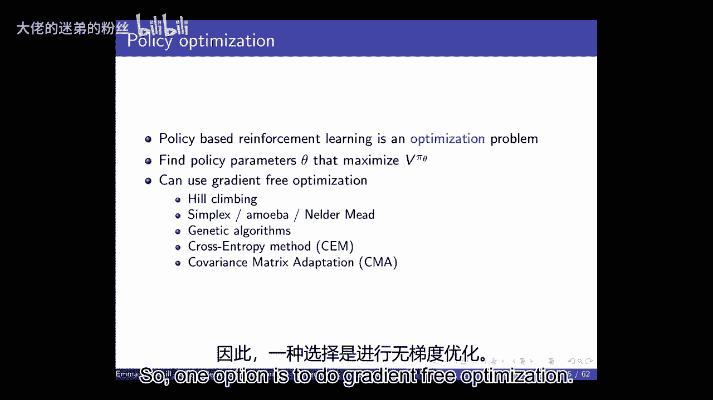
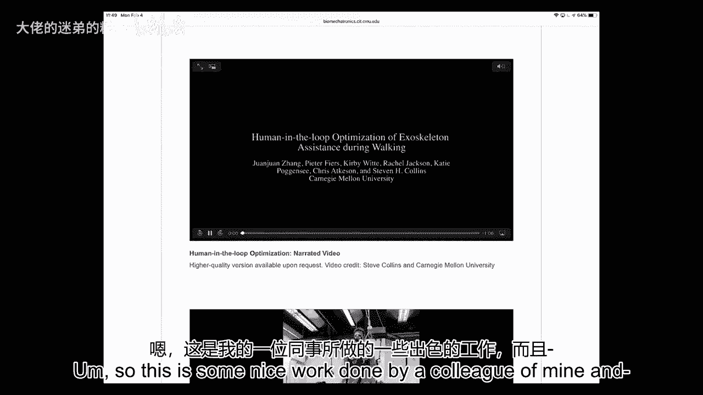
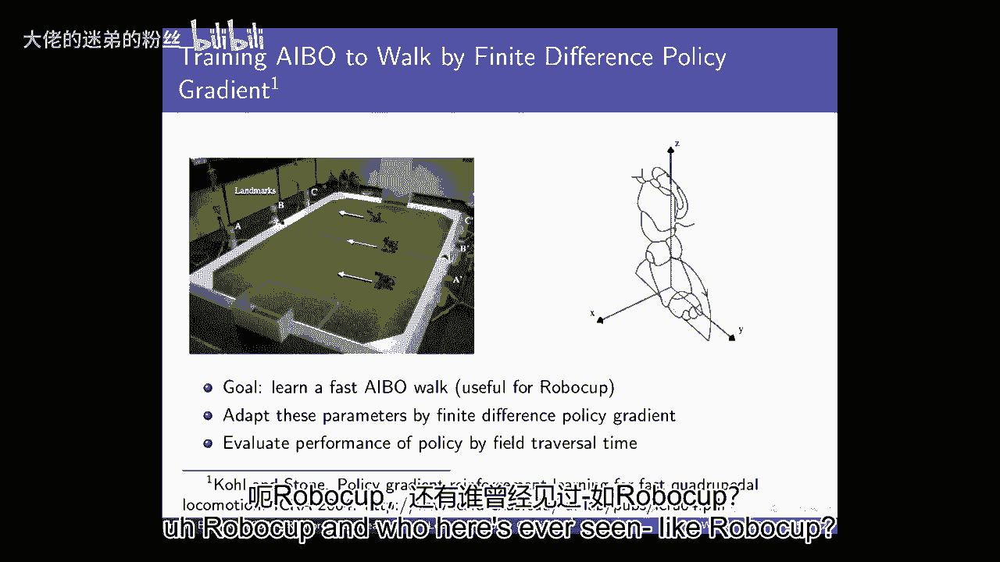
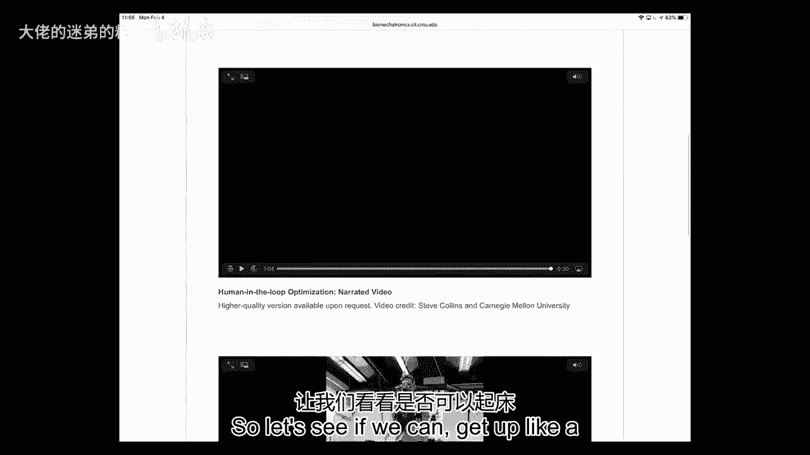
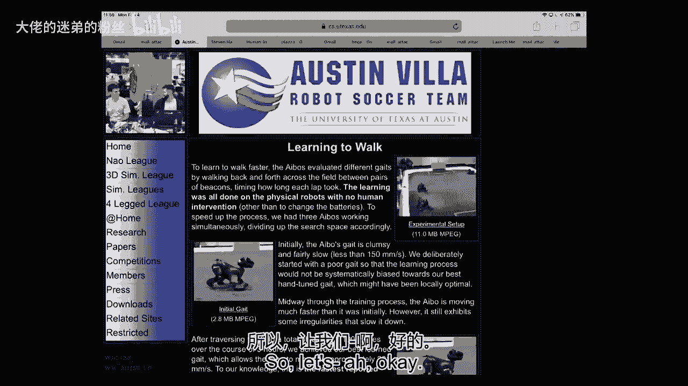
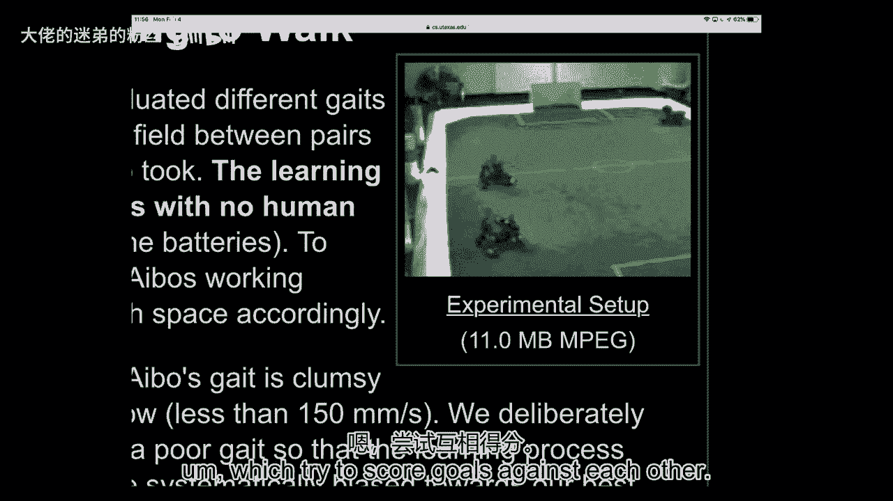
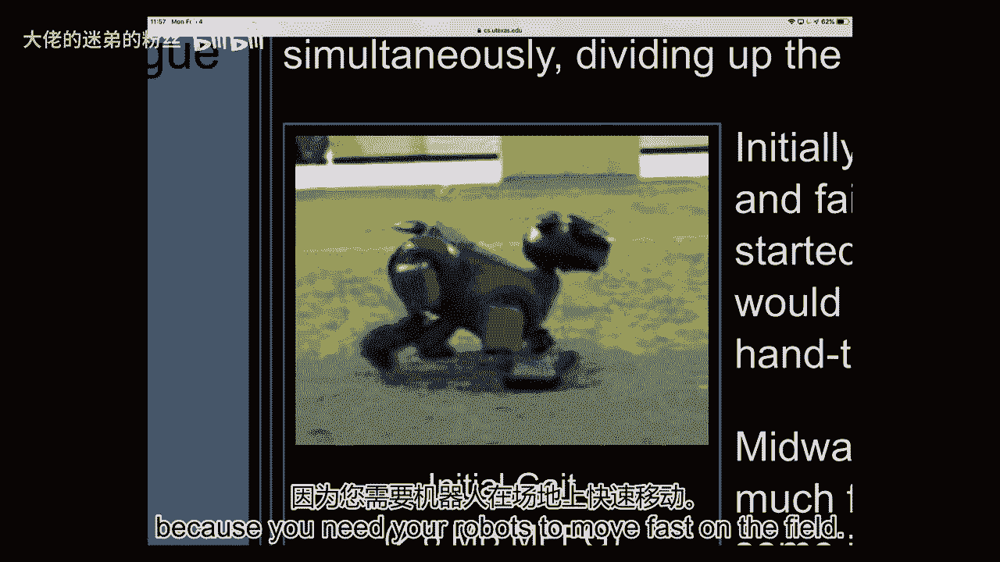
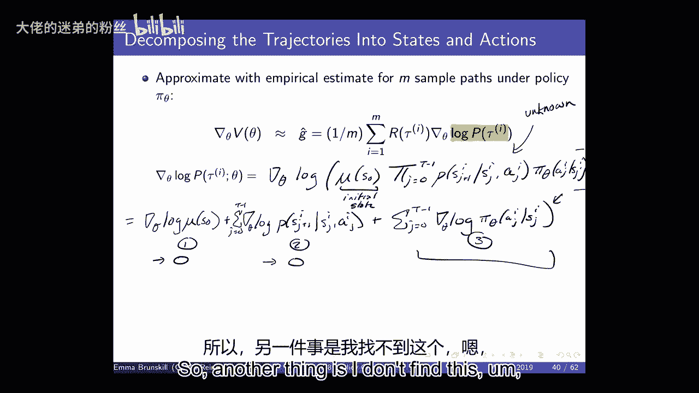
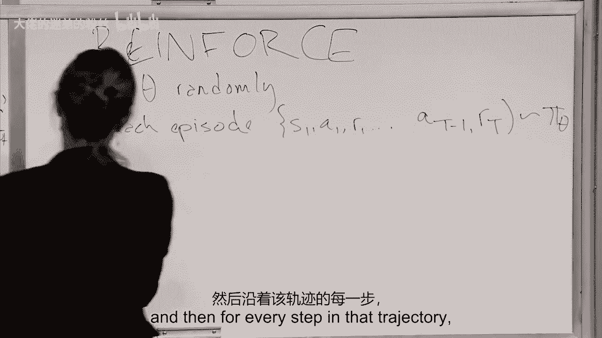
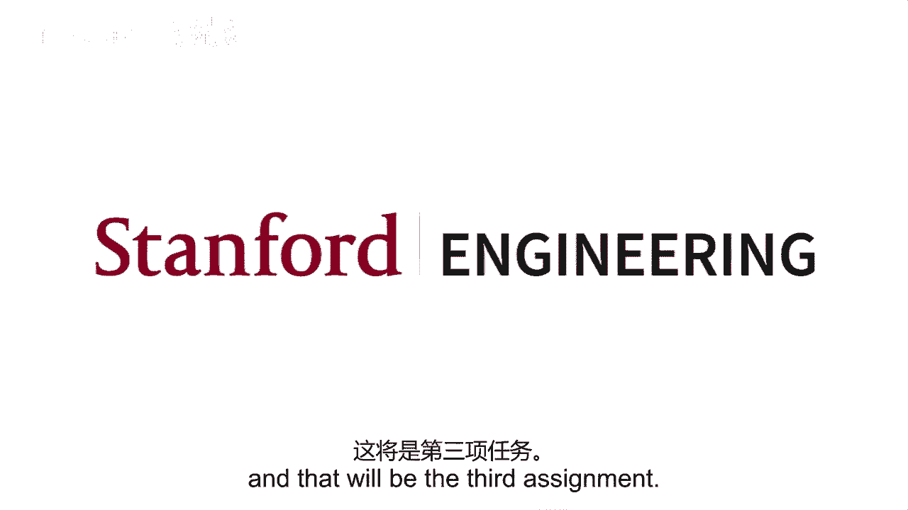

# 8：策略梯度方法 I 🎯

在本节课中，我们将要学习策略梯度方法。这是一种直接对策略进行参数化并优化的强化学习方法。我们将从策略搜索的基本概念开始，讨论为何需要随机策略，并推导出策略梯度定理的核心公式。最后，我们将介绍一个经典算法——REINFORCE。

---

## 概述

强化学习的主要目标是让智能体学会做出好的决策。我们之前讨论过基于价值函数的方法（如Q-learning）和模仿学习。本节课，我们将转向另一种强大的方法：**策略搜索**。这种方法直接对策略本身进行参数化，并通过优化这些参数来寻找最佳策略。

与基于价值的方法相比，策略搜索方法能更自然地融入领域知识，在处理连续或高维动作空间时通常更有效，并且可以学习随机策略。然而，它们通常只能保证收敛到局部最优解。

---

## 为何需要策略搜索与随机策略？

上一节我们介绍了基于价值函数和模仿学习的方法。本节中，我们来看看直接优化策略的动机，以及为何有时随机策略比确定性策略更优。

在表格型马尔可夫决策过程中，总是存在一个确定性的最优策略。因此，在理想化的表格设定下，我们不需要随机策略。

然而，在现实世界的许多问题中，情况并非如此。以下是两个需要随机策略的关键场景：

1.  **对抗性环境（如“石头剪刀布”）**：在对抗性环境中，如果智能体采用确定性策略，对手很容易利用并击败它。一个均匀的随机策略（如以1/3的概率出石头、剪刀或布）则是最优的，因为它无法被对手预测和利用。
2.  **部分可观测环境（如“别名网格世界”）**：当智能体无法仅凭当前观测完全确定自身状态时（即存在状态“别名”），确定性策略可能导致智能体卡在次优行为中。随机策略允许智能体进行探索，从而有更高概率找到通往高奖励状态的路径。

因此，当环境具有对抗性或部分可观测性时，随机策略往往能获得比确定性策略更高的期望回报。

---

## 策略参数化与优化目标

既然我们决定直接对策略进行参数化，那么具体该如何做呢？

我们将策略表示为 \(\pi_\theta(a|s)\)，其中 \(\theta\) 是参数向量。我们的目标是找到能最大化某个性能指标 \(J(\theta)\) 的参数 \(\theta\)。在分幕式任务中，一个常见的目标是最大化**起始状态的期望折扣回报**：

\[
J(\theta) = V^{\pi_\theta}(s_0) = \mathbb{E}_{\tau \sim \pi_\theta} \left[ \sum_{t=0}^{T-1} \gamma^t r_t \right]
\]

其中，\(\tau = (s_0, a_0, r_0, s_1, a_1, r_1, ...)\) 表示一条轨迹，\(\tau \sim \pi_\theta\) 表示轨迹由策略 \(\pi_\theta\) 生成。

这本质上是一个优化问题：\(\theta^* = \arg\max_\theta J(\theta)\)。

---

## 策略梯度定理

为了优化 \(J(\theta)\)，我们需要计算其关于参数 \(\theta\) 的梯度 \(\nabla_\theta J(\theta)\)。策略梯度定理为我们提供了这个梯度的计算公式，而且它**不需要知道环境动力学模型**（即状态转移概率 \(P(s'|s,a)\)）。

以下是推导的核心步骤：

1.  将期望回报写成轨迹概率和轨迹回报乘积的和：
    \[
    J(\theta) = \sum_\tau P(\tau|\theta) R(\tau)
    \]
2.  计算梯度，并运用对数导数技巧 \(\nabla_\theta P(\tau|\theta) = P(\tau|\theta) \nabla_\theta \log P(\tau|\theta)\)：
    \[
    \nabla_\theta J(\theta) = \sum_\tau P(\tau|\theta) \nabla_\theta \log P(\tau|\theta) R(\tau) = \mathbb{E}_{\tau \sim \pi_\theta} \left[ \nabla_\theta \log P(\tau|\theta) R(\tau) \right]
    \]
3.  展开轨迹概率 \(P(\tau|\theta) = \mu(s_0) \prod_{t=0}^{T-1} \pi_\theta(a_t|s_t) P(s_{t+1}|s_t, a_t)\)，并取对数：
    \[
    \log P(\tau|\theta) = \log \mu(s_0) + \sum_{t=0}^{T-1} \left[ \log \pi_\theta(a_t|s_t) + \log P(s_{t+1}|s_t, a_t) \right]
    \]
4.  计算梯度时，只有 \(\log \pi_\theta(a_t|s_t)\) 项与 \(\theta\) 有关。因此：
    \[
    \nabla_\theta \log P(\tau|\theta) = \sum_{t=0}^{T-1} \nabla_\theta \log \pi_\theta(a_t|s_t)
    \]
5.  代入梯度表达式，并利用时间结构进行重组，最终得到策略梯度定理的一个常见形式：
    \[
    \nabla_\theta J(\theta) = \mathbb{E}_{\tau \sim \pi_\theta} \left[ \sum_{t=0}^{T-1} \nabla_\theta \log \pi_\theta(a_t|s_t) G_t \right]
    \]
    其中，\(G_t = \sum_{k=t}^{T-1} \gamma^{k-t} r_k\) 是从时刻 \(t\) 开始的**回报**。

这个公式非常强大：我们只需要能够计算策略的对数梯度 \(\nabla_\theta \log \pi_\theta(a|s)\)，并通过采样轨迹来估计期望值，而无需知道环境如何转移状态。

---

## 策略参数化的常见形式

为了计算 \(\nabla_\theta \log \pi_\theta(a|s)\)，我们需要为策略选择一个具体的、可微的参数化形式。以下是三种常见的选择：

以下是几种常见的策略参数化形式及其得分函数：

1.  **Softmax策略（适用于离散动作空间）**：
    \[
    \pi_\theta(a|s) = \frac{e^{\phi(s,a)^\top \theta}}{\sum_{a'} e^{\phi(s,a')^\top \theta}}
    \]
    其得分函数为：
    \[
    \nabla_\theta \log \pi_\theta(a|s) = \phi(s,a) - \mathbb{E}_{a' \sim \pi_\theta(\cdot|s)}[\phi(s,a')]
    \]

2.  **高斯策略（适用于连续动作空间）**：
    \[
    a \sim \mathcal{N}(\mu(s), \sigma^2), \quad \mu(s) = \phi(s)^\top \theta
    \]
    其得分函数为：
    \[
    \nabla_\theta \log \pi_\theta(a|s) = \frac{(a - \mu(s)) \phi(s)}{\sigma^2}
    \]

3.  **深度神经网络策略**：使用神经网络将状态映射到动作概率分布（离散）或动作分布参数（连续），通过自动微分计算梯度。

---

## REINFORCE 算法

基于策略梯度定理，我们可以得到一个最简单的策略梯度算法——REINFORCE（蒙特卡洛策略梯度）。

REINFORCE 算法流程如下：

1.  随机初始化策略参数 \(\theta\)。
2.  **循环**（对于每一幕）：
    a.  根据当前策略 \(\pi_\theta\) 采样一条轨迹 \(\tau = (s_0, a_0, r_0, ..., s_{T-1}, a_{T-1}, r_{T-1})\)。
    b.  对于轨迹中的每一步 \(t = 0, ..., T-1\)：
        i.  计算从 \(t\) 开始的回报 \(G_t = \sum_{k=t}^{T-1} \gamma^{k-t} r_k\)。
        ii. 更新参数：\(\theta \leftarrow \theta + \alpha \gamma^t G_t \nabla_\theta \log \pi_\theta(a_t|s_t)\)。
        （注：\(\gamma^t\) 项有时被吸收到学习率或回报的计算中，具体形式可能略有不同。）
3.  返回最终参数 \(\theta\)。

该算法本质上是使用蒙特卡洛方法估计梯度，然后执行梯度上升。它是一种无偏但方差可能较高的估计方法。

---

## 总结

本节课中我们一起学习了策略梯度方法的基础知识。

*   我们首先了解了**策略搜索**的动机：它可以直接参数化策略，便于融入领域知识，并能有效处理连续动作空间和部分可观测环境。
*   我们认识到，在**对抗性环境**和**部分可观测环境**中，**随机策略**往往比确定性策略更优。
*   我们推导了强化学习中至关重要的**策略梯度定理**，它表明性能目标的梯度可以表示为策略对数梯度与回报乘积的期望，且**无需环境模型**。
*   我们介绍了策略的常见参数化形式，如 **Softmax**、**高斯分布**和**神经网络**。
*   最后，我们基于定理得到了经典的 **REINFORCE 算法**，它通过采样整条轨迹的回报来进行蒙特卡洛策略梯度更新。

策略梯度方法为直接优化策略提供了坚实的理论基础。然而，原始的REINFORCE算法方差较高。在接下来的课程中，我们将探讨如何通过引入**基线**和**价值函数**（即演员-评论家方法）来大幅降低方差，从而得到更稳定、更高效的策略梯度算法。