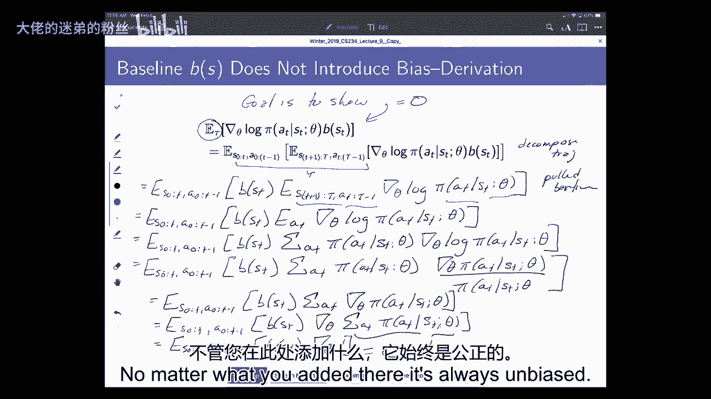
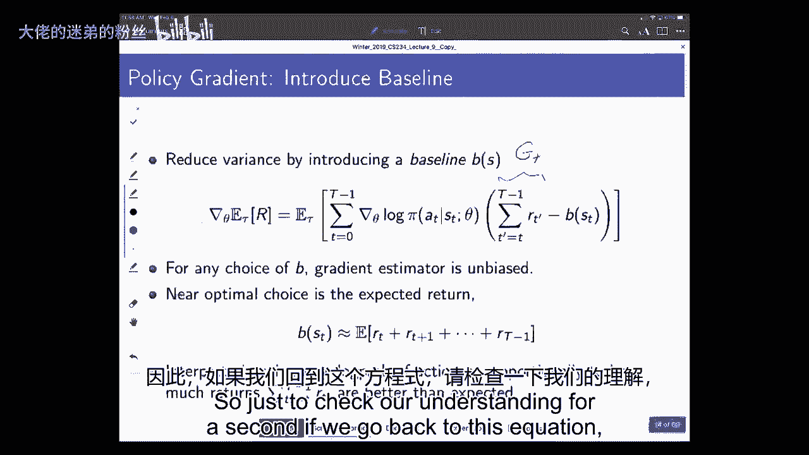
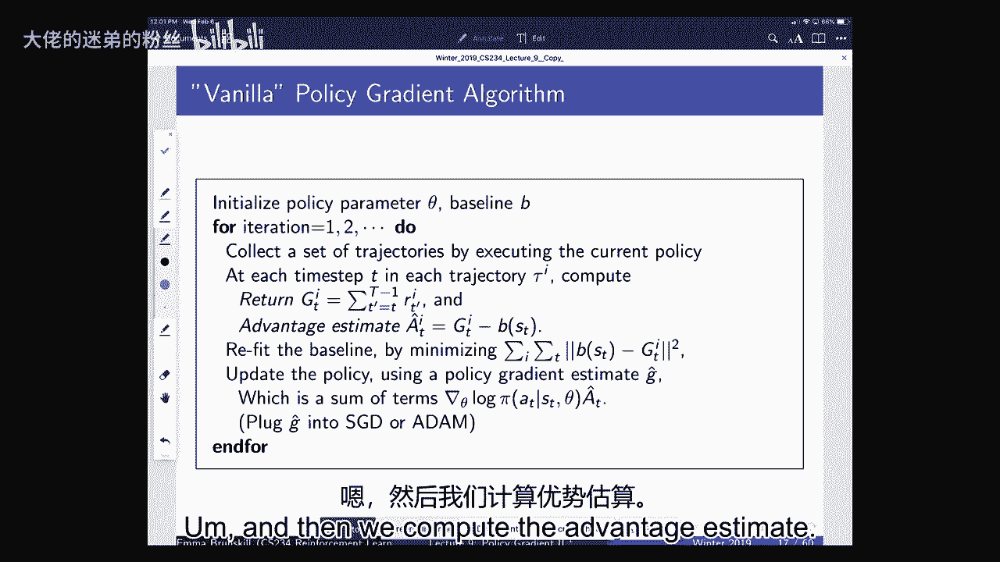
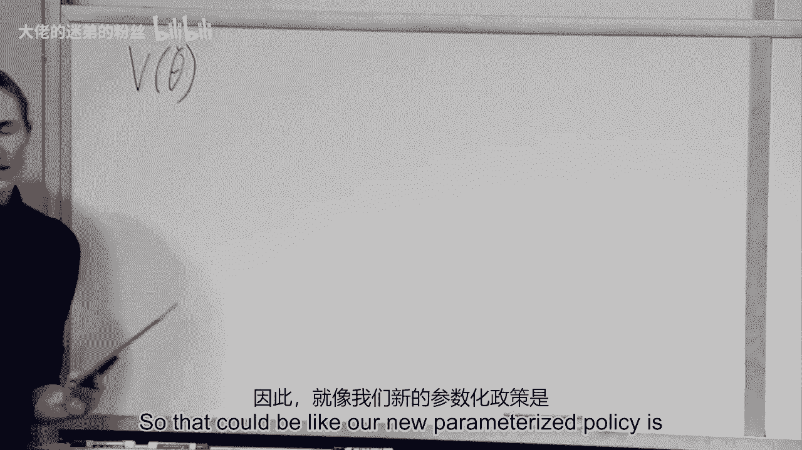

# 9：策略梯度 II 🚀

在本节课中，我们将继续深入探讨策略梯度方法。我们将学习如何通过引入基线（Baseline）和优势函数（Advantage Function）来降低策略梯度估计的方差，并讨论如何通过选择更新步长来保证策略的单调改进。课程内容将涵盖从理论推导到实际算法（如Vanilla Policy Gradient和Actor-Critic方法）的完整流程。

---

## 安排与反馈 📅

在开始之前，我们先说明一下课程安排。下周一我们将进行期中复习，周三进行期中考试。由于班级人数较多，考试将安排在多个教室进行，具体安排会另行通知。考试时可以携带一页手写笔记。

感谢所有参与课程反馈调查的同学。根据反馈，大约65%的同学认为当前课程节奏合适，27%认为稍快，8%认为稍慢。我们将保持大致相同的节奏。许多同学希望看到更多实际例子和推导过程，我们会在后续课程中增加相关内容。此外，我们会注意提高音量，确保大家都能听清。

---

## 策略梯度回顾 🔄

上一节我们介绍了策略搜索的基本概念。策略搜索的核心思想是直接参数化策略，并通过优化策略参数来最大化期望回报。我们有一个参数化的策略 $\pi_\theta$，其价值函数为 $V^{\pi_\theta}$。我们的目标是找到最优参数 $\theta^*$ 以最大化 $V^{\pi_\theta}$。

与基于值函数的方法相比，策略梯度方法通常能保证收敛到局部最优解，但不一定是全局最优。然而，在高风险场景中，我们往往更希望策略能单调改进，即每次更新后策略的性能（期望回报）都不下降。

---

## 降低方差：基线（Baseline） 📉

在策略梯度估计中，我们使用蒙特卡洛回报 $G_t$ 来估计梯度，但这种方法方差很高。为了降低方差，我们可以引入一个仅依赖于状态的基线函数 $b(S_t)$。新的梯度估计公式为：

$$
\nabla_\theta V^{\pi_\theta} \approx \frac{1}{m} \sum_{i=1}^{m} \sum_{t=0}^{T} \left( G_t^{(i)} - b(S_t^{(i)}) \right) \nabla_\theta \log \pi_\theta(A_t^{(i)} | S_t^{(i)})
$$

**关键点**：只要基线 $b(S_t)$ 仅是状态的函数（而不是状态和动作的函数），减去它后得到的梯度估计仍然是无偏的。证明的核心在于证明期望值为零：

$$
\mathbb{E}_{\tau \sim \pi_\theta} \left[ \sum_{t=0}^{T} b(S_t) \nabla_\theta \log \pi_\theta(A_t | S_t) \right] = 0
$$

一个常见且有效的基线选择是状态值函数 $V^{\pi}(S_t)$，此时 $G_t - V^{\pi}(S_t)$ 近似于优势函数 $A^{\pi}(S_t, A_t)$。

---

## Vanilla Policy Gradient 算法 🍦

基于上述思想，我们可以构建基础的策略梯度算法。以下是Vanilla Policy Gradient的步骤：

1.  **初始化**：使用参数 $\theta$ 初始化策略 $\pi_\theta$，并初始化基线函数 $b$（例如，用神经网络近似 $V^{\pi}$）。
2.  **循环**（对于每次迭代 $i=1,2,...$）：
    *   **收集数据**：使用当前策略 $\pi_{\theta_i}$ 收集 $m$ 条轨迹数据。
    *   **计算回报与优势**：对于每条轨迹中的每个时间步 $t$，计算：
        *   回报：$G_t^{(i)} = \sum_{t'=t}^{T} \gamma^{t'-t} R_{t'}$
        *   优势估计：$\hat{A}_t^{(i)} = G_t^{(i)} - b(S_t^{(i)})$
    *   **拟合基线**：使用收集到的所有数据 $\{ (S_t^{(i)}, G_t^{(i)}) \}$，通过最小化平方误差来更新基线函数 $b$，使其逼近 $V^{\pi_{\theta_i}}$。
    *   **更新策略**：使用估计的梯度更新策略参数：
        $$
        \theta_{i+1} \leftarrow \theta_i + \alpha \frac{1}{m} \sum_{i=1}^{m} \sum_{t=0}^{T} \hat{A}_t^{(i)} \nabla_\theta \log \pi_\theta(A_t^{(i)} | S_t^{(i)})
        $$

这个算法框架是许多更高级策略梯度算法的基础。

---

## 演员-评论家（Actor-Critic）方法 🎭

Vanilla Policy Gradient 使用蒙特卡洛回报 $G_t$，这是无偏但高方差的。我们可以用值函数估计（评论家）来替代 $G_t$，形成演员-评论家框架。

在演员-评论家方法中：
*   **演员（Actor）**：参数化的策略 $\pi_\theta$，负责选择动作。
*   **评论家（Critic）**：参数化的值函数 $V_w(S)$ 或 $Q_w(S, A)$，负责评估状态或状态-动作对的价值。

梯度估计公式可以写为：

$$
\nabla_\theta V^{\pi_\theta} \approx \mathbb{E}_{\tau \sim \pi_\theta} \left[ \sum_{t=0}^{T} \left( Q_w(S_t, A_t) - b(S_t) \right) \nabla_\theta \log \pi_\theta(A_t | S_t) \right]
$$

其中，$Q_w(S_t, A_t)$ 可以由评论家估计，$b(S_t)$ 通常也由评论家（如 $V_w(S_t)$）提供。此时，$Q_w(S_t, A_t) - V_w(S_t)$ 直接估计了优势函数。

**权衡**：我们可以使用不同的目标来训练评论家，在偏差和方差之间进行权衡：
*   **TD(0) / 1步回报**：$\hat{G}_t = R_t + \gamma V_w(S_{t+1})$。偏差较低，方差较低。
*   **蒙特卡洛回报**：$\hat{G}_t = \sum_{t'=t}^{T} \gamma^{t'-t} R_{t'}$。无偏，方差高。
*   **n步回报**：$\hat{G}_t = \sum_{t'=t}^{t+n-1} \gamma^{t'-t} R_{t'} + \gamma^n V_w(S_{t+n})$。介于两者之间，通过调整 $n$ 来平衡。

---

## 保证单调改进与步长选择 🚶‍♂️

得到梯度方向后，我们需要决定更新步长 $\alpha$。在强化学习中，步长选择尤为重要，因为糟糕的更新可能导致策略性能急剧下降，并且由于新策略用于收集后续数据，可能陷入局部最优而无法恢复。

我们的目标是实现**单调改进**：$V^{\pi_{i+1}} \geq V^{\pi_i}$。

我们可以通过构建一个**替代目标函数** $L_{\pi}(\tilde{\pi})$ 来分析。该函数在旧策略 $\pi$ 的数据下是可计算的，并且满足：
1.  $L_{\pi}(\pi) = V^{\pi}$
2.  在 $\pi$ 和 $\tilde{\pi}$ 足够接近时，$V^{\tilde{\pi}} \geq L_{\pi}(\tilde{\pi}) - C \cdot D_{KL}(\pi || \tilde{\pi})$，其中 $C$ 是一个常数，$D_{KL}$ 是KL散度。

因此，如果我们通过优化 $L_{\pi}(\tilde{\pi})$ 同时约束 $D_{KL}(\pi || \tilde{\pi})$ 来更新策略，就可以保证真实的价值函数 $V^{\tilde{\pi}}$ 不会下降。这引出了像**信任区域策略优化（TRPO）** 和**近端策略优化（PPO）** 这类现代策略梯度算法，它们通过不同的方式约束策略更新的幅度，从而实现稳定、单调的改进。

---

## 总结 🎯

本节课我们一起深入学习了策略梯度方法的高级主题：

1.  **基线（Baseline）**：通过减去一个仅依赖于状态的基线函数，可以在不引入偏差的前提下，有效降低策略梯度估计的方差。最优基线通常是状态值函数 $V^{\pi}(S_t)$。
2.  **Vanilla Policy Gradient**：提供了策略梯度算法的一个基础而完整的实现模板。
3.  **演员-评论家（Actor-Critic）框架**：通过引入一个独立的评论家网络来估计值函数或优势函数，替代高方差的蒙特卡洛回报，提高了样本效率。我们讨论了在TD估计和蒙特卡洛估计之间的权衡。
4.  **单调改进与步长控制**：理解了在策略梯度中谨慎选择更新步长的重要性。介绍了通过构建替代目标函数并约束策略变化（如KL散度）来保证单调改进的理论基础，这为理解更高级的算法（如TRPO、PPO）打下了基础。

掌握这些概念，你就能理解如何构建更稳定、更高效、更适合高风险应用的策略梯度强化学习算法。