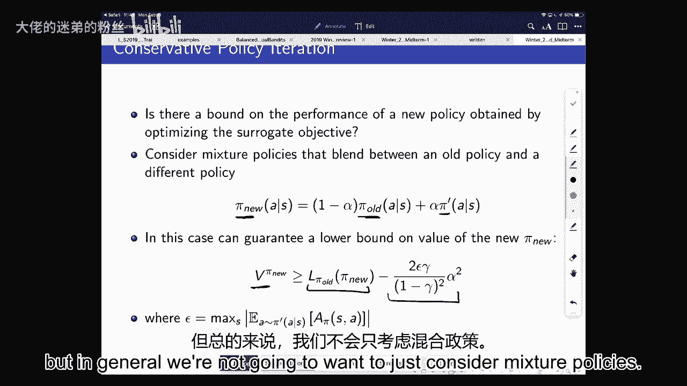
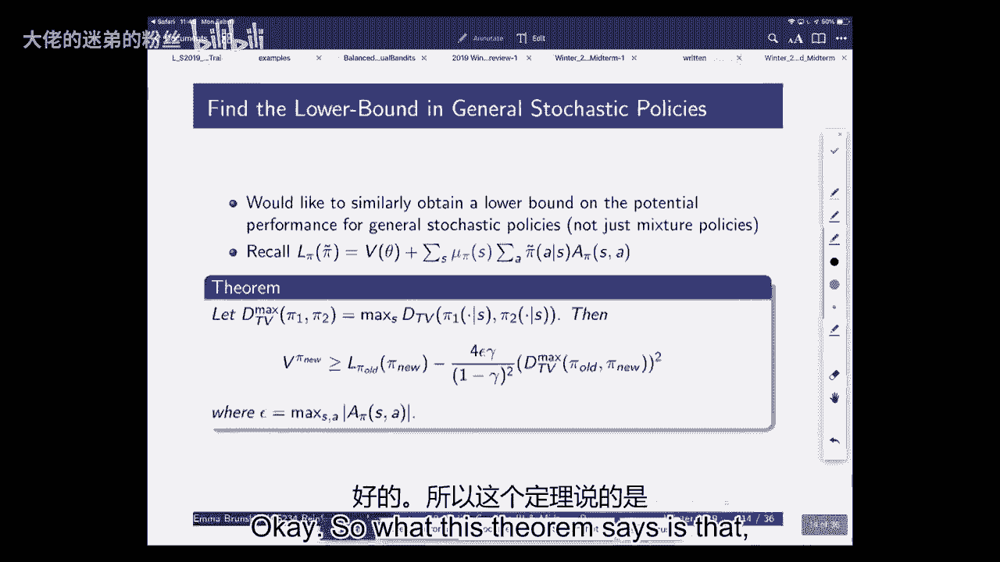
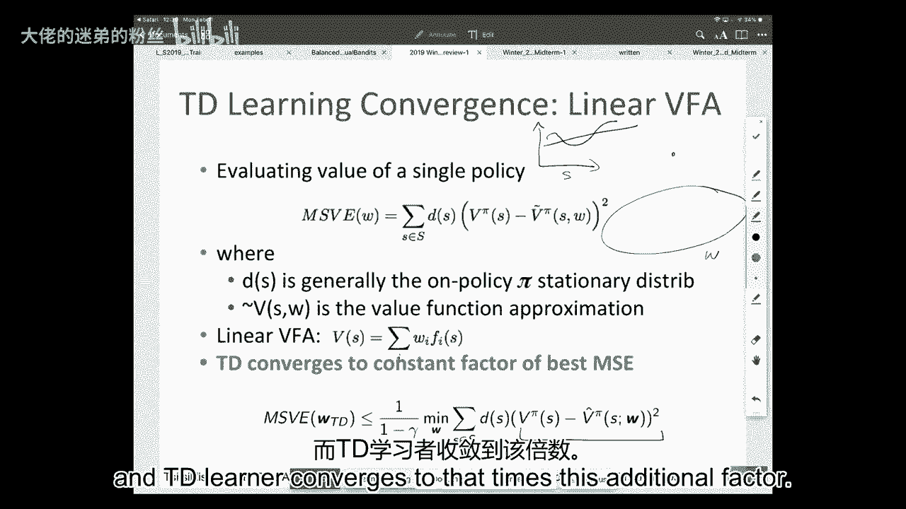
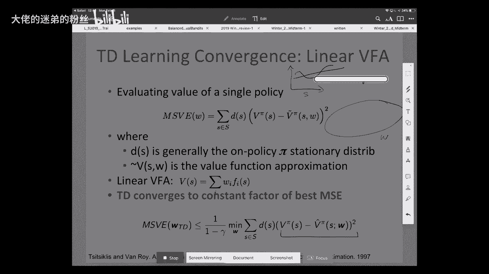
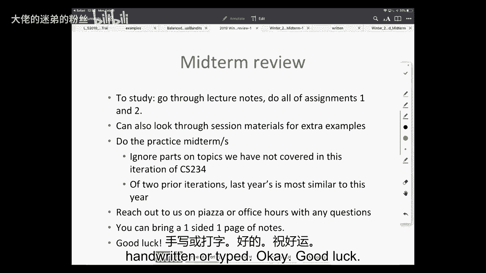

# 10：策略梯度 III 与复习 📚 

在本节课中，我们将完成策略梯度剩余内容的讲解，并对期中考试前的课程内容进行简要回顾。我们将首先探讨如何确保策略梯度方法的单调改进，并介绍一种实用的算法——信任区域策略优化。随后，我们将快速回顾从马尔可夫决策过程到价值函数近似等核心概念。

---

## 📝 期中考试安排说明

在课程开始前，先简要说明期中考试的后勤安排。

考试将分在两个考场进行。具体考场取决于你斯坦福ID的首字母。我们将通过邮件确认具体安排。考场为盖茨B1或科弗罗尔礼堂。

此外，允许携带一页单面的笔记，手写或打印均可。如有其他关于期中考试的问题，请在Piazza上联系我们。

---

## 🎯 今日课程安排

今天我们将完成策略梯度剩余部分的内容。目前课程进度已接近完成策略搜索部分。

期中考试在周三，周一是假期。本周还将发布最后一份作业，内容涵盖策略搜索。

剩余的主要任务包括策略搜索和课程项目。

期中考试后，我们将进入快速探索和强化学习加速的主题。

为确保本周作业发布后大家能跟上进度，今天必须完成策略搜索的讲解。预计花费约20-25分钟，之后进行期中考试内容的简要复习。

提问时请先报上姓名，这有助于我和大家记住彼此。

---

## 🔄 策略梯度回顾

在过去的几节课中，我们开始讨论基于策略的强化学习，目标是找到一个参数化的策略，以学习在环境中做出良好决策。

与价值函数近似类似，对于策略参数化，我们假设存在一个参数向量。我们可以用Softmax或深度神经网络等表示策略，然后计算这些策略的梯度，以学习具有高价值的策略。

我们介绍了最基础的策略梯度算法。其思想是：初始化策略和某个基线，然后在多次迭代中运行当前策略。通过运行策略来估计梯度，即计算当前策略的梯度。

具体步骤包括：运行当前策略生成轨迹，获得状态、动作、奖励、下一状态序列，然后计算回报和优势估计，并与基线比较。可以重新拟合基线，然后更新策略。

这是最基础的策略梯度算法。该算法中有多个选择点，几乎所有策略梯度算法都遵循此类公式。

具体来说，我们需要决定如何估计回报或目标，选择基线，并在计算梯度后决定沿梯度方向移动多远。

---

### 📊 目标估计与偏差-方差权衡

关于第一部分，我们讨论了如何估计当前策略的价值，以用于梯度估计。

最基础的方法是直接运行策略并观察回报，这与蒙特卡洛估计类似。我们可以通过运行一个回合的策略来估计价值函数。这是一个无偏估计，但方差很高。

我们可以使用过去学过的相同工具来权衡偏差和方差。具体来说，可以通过自举和函数近似引入偏差，就像在TDMC和价值函数近似中看到的那样。

我们试图理解特定策略的价值。在估计该价值时，可以在无偏估计和可能有偏差但能更快传播信息、加速学习的估计之间进行权衡。

我们还讨论了行动者-评论家方法，它同时维护策略和价值函数的参数化表示。

---

### 🧭 梯度步长与单调改进

我们深入探讨的另一个关键问题是：一旦估计出策略梯度，应沿该梯度方向移动多远以获得新策略？

在强化学习中，这与监督学习不同，因为我们所采取的每一步、所考虑的每一个新策略，都将决定下一次获得的数据。因此，思考沿梯度方向移动多远以获得新策略尤为重要。

我们讨论的一个理想特性是确保单调改进。我们的目标是单调改进。这在DQN等许多算法中无法保证。在许多高风险领域，如金融、客户服务、医疗等，你可能真的希望在部署新策略之前，确保其期望性能至少不差于旧策略。

我们希望实现这一点，但面临一个大问题：我们没有来自所考虑的新策略的数据，并且我们不想尝试所有可能的下一个策略，因为其中一些可能很差。

因此，我们希望利用现有数据来确定如何采取步骤，并确定我们认为会表现良好的新策略。

---

## 🎯 策略梯度的核心挑战与目标

策略梯度的主要目标是找到一组能最大化价值函数的策略参数。

挑战在于，我们目前只能访问由当前策略（称为 π_old，由参数 θ_old 参数化）收集的数据。在策略梯度讲座中，我一直在策略和参数之间来回讨论，但请记住，π 和 θ 之间存在直接映射关系。每个策略都由一组参数唯一定义。

因此，挑战在于我们拥有来自当前策略的数据，但想要预测不同策略的价值。这是离策略学习的一个挑战。

---

### 📐 新策略价值的表达

我们上次讨论的是如何用已知量来表达策略的价值。我们可以将其写为相对于当前策略的优势。

如果我们考虑一个由新参数 θ_tilde 参数化的新策略，其价值等于另一个策略的价值加上期望优势。可以将其写为：在新策略下期望到达的状态分布，乘以如果遵循新策略在旧策略下会获得的优势。

我们试图做的是找到一种方法来进行策略梯度更新，同时保证单调改进，即新策略保证优于旧策略。但我们希望在不实际尝试新策略的情况下做到这一点。

因此，我们试图用可访问的量来重新表达新策略的价值。我们拥有来自当前策略的现有样本，我们希望利用这些样本和观察到的回报，在部署前估计新策略的价值。

---

### 🧮 替代目标函数 L

我们注意到，也许我们可以访问新策略的显式形式（即考虑放入神经网络的新参数），并且可以想象估计优势函数。但我们不知道新策略下的状态分布，因为这需要我们实际运行它。

因此，我们讨论定义一个可能好可能坏的新目标函数 L。目前，这只是一个我们可以优化的量。

这个新的目标函数 L 是先前价值的函数。它看起来像我们刚才讨论的目标函数（即新策略的价值），但我们不知道新策略下的平稳状态分布。因此，我们只是代入当前策略下的平稳分布。

通常，这不会等于新策略的分布。两个策略下获得相同状态分布的唯一情况通常是它们完全相同。偶尔，两个不同策略下可能获得相同的状态分布，但这意味着它们具有相同的价值。通常，我们预期这些分布是不同的。

但我们暂时忽略这一点。我们只说这是一个目标函数，是我们可以优化的东西。这样做的好处是我们拥有来自当前策略的样本，因此可以想象使用这些样本来估计这个期望。

还需要注意：如果在当前策略处评估目标函数 L，即把旧策略代入目标函数，它恰好等于当前策略的价值。因为现有策略相对于自身的优势为零。因此，在评估旧策略时，此目标函数恰好等于旧策略的价值。对于新策略，它将是不同的东西。

---

### 🔗 与重要性采样的关系

这与重要性采样有何相似之处？在重要性采样中，我们倾向于通过我们拥有的分布来重新加权我们想要的分布。在这种情况下，我们通常在每个状态级别上进行。而在这里，我们关注的是状态上的平稳分布。

实际上，最近有一篇很酷的论文探讨了如何重新加权平稳分布，以获得价值函数的离策略估计。但在这里，我们只是进行替换，而不是重要性采样。我们只是假装到达的状态分布完全相同，但实际上并非如此。不过，我们将证明这最终会成为我们实际想要优化的目标的一个有用下界。

---

## 📉 单调改进的理论保证

如果我们对这个可能好可能坏的目标函数进行优化，对于得到的新价值函数是否优于旧价值函数，我们有任何保证吗？记住，这才是我们的目标。我们并不真正关心优化什么，我们关心的是最终得到的价值函数实际上优于旧的价值函数。

上次提到，如果你有一个混合策略，它混合了当前策略和某个新策略，那么你可以保证新策略价值的一个下界。也就是说，新策略的价值大于或等于我们这里的目标函数 L 减去某个特定量。

这表明，如果针对这个奇怪的 L 目标函数进行优化，实际上可以获得新策略性能的界限。这看起来很有希望，但通常我们不会只考虑混合策略。

对于任何随机策略，而不仅仅是这种奇怪的混合策略，你都可以使用这个略显奇怪的目标函数来获得性能界限。

---

### 📏 总变差距离与KL散度

定义两个策略之间的总变差距离如下。两个策略（我使用点号表示存在多个动作，策略表示动作上的概率分布）之间的总变差距离等于所有动作 A 上，两个策略赋予该动作的概率之差的绝对值中的最大值。它给出了一个策略与另一个策略在某个动作上概率的最大差异。

然后，我们可以通过在所有状态上取该量的最大值来定义最大总变差距离。这本质上表示两个策略在哪个状态上对某个动作的差异最大。

这个定理表明，如果你知道这个量，那么你可以定义：如果你使用这个目标函数 L，那么你的新策略的价值至少是你计算的目标函数减去这个作为总变差距离函数的量。

这给了我们一些信心：如果我们针对目标函数 L 进行优化，那么我们可以获得价值函数的一个界限。

然而，这个最大总变差距离并不容易处理。因此，我们可以利用它的平方以KL散度为上界这一事实，得到一个更容易处理的、关注两个策略之间KL散度的新界限。

---

### 🛡️ 如何利用下界确保单调改进

为什么这有用？目前我告诉你的是，我们有了这个新的目标函数。如果我们使用这个新的目标函数，原则上可以获得新策略性能的下界。

那么，如何利用它来确保我们想要的单调改进呢？目标是单调改进。我们希望 V(π_{i+1}) ≥ V(π_i)。i 表示迭代次数。我们希望部署的新策略实际上优于之前的策略。

我们将这样做：首先，我们有这个下界目标函数。我们将定义 M_i(π) = L_{π_i}(π) - [4εγ/(1-γ)^2] * D_KL^max(π_i || π)。这就是我们上一张幻灯片定义的下界。

我们说过，新策略的价值至少和这个下界一样好。所以，V_{i+1} ≥ M_i(π_{i+1}) = L_{π_i}(π_{i+1}) - [4εγ/(1-γ)^2] * D_KL^max(π_i || π_{i+1})。

现在，我想看的是，如果在当前策略处评估下界，那会是什么？让我们看看 M_i(π_i)。它等于 L_{π_i}(π_i) - [4εγ/(1-γ)^2] * D_KL^max(π_i || π_i)。两个相同策略之间的KL散度为零，因为它们完全相同。所以这等于 L_{π_i}(π_i)。我之前告诉过你，如果你在当前策略处评估目标函数 L，它恰好等于该策略的价值。所以这恰好等于 V(π_i)。

这说明，如果我想比较 i+1 策略的价值与旧策略的价值，我们知道它大于等于 M_i(π_{i+1})。因为根据定理，新策略的价值大于等于我们计算的下界。

所以，V(π_{i+1}) - V(π_i) ≥ M_i(π_{i+1}) - M_i(π_i)。

这意味着，如果你的新价值函数的下界比旧价值函数的下界更好，那么你就实现了单调改进。如果这个差值大于零，则单调改进。这意味着，如果你针对这个下界进行优化，并且可以评估这个量，并且你的新下界高于旧下界，那么你的价值必须更好。因此，我们可以保证单调改进。

---

### ⚠️ 关于下界中 ε 的说明

请注意，你的下界是用 ε 表示的。ε 是你的优势在所有状态和动作上的最大值。原则上，你可以评估这个值，特别是在离散状态和动作空间的情况下。但在实践中，你通常不想这样做。

我将这部分视为形式上的陈述：如果你能评估这个下界。现在我们要讨论的是一个更实用的算法，它试图将这种保守策略改进的保证变得实用，使用一些更容易计算的量。因为一般来说，评估这个 ε 非常困难。你可以取它的上界或下界，但你通常不会知道这个 ε 是多少。

正如克里斯指出的，这个 ε 依赖于策略。但这很酷，因为它意味着你可以实现这种有保证的改进。这是一种最大化-最小化的形式。这是一个很好的想法：你可以有这个新的下界，保证优于当前策略的价值。因此，你可以获得这种保守的单调改进策略。

---

## ⚙️ 信任区域策略优化

我想确保我们有足够的时间进行期中复习，但我想简要讨论如何使这变得实用，特别是因为信任区域策略优化是一个非常流行的策略梯度算法。我认为让你们了解一下是有用的。有些人可能在项目中使用它。它不会成为作业或期中考试的必考部分，但我认为熟悉这个想法很有用。

再次回顾我们刚才讨论的目标函数，我们有了这个 L 函数。然后我们通过减去这个可能难以计算的常数，将其转化为一个下界。

在这种情况下，我们做的是将这个常数变成一个超参数。你可以把它变成一个常数 C。但问题总是，即使你能计算它，我们通常也不知道它是什么，但即使你能计算它或计算它的界限，通常如果我们使用这个，我们会采取非常小的步长。

直观地说，这是因为通常很难从当前策略推断到很远的地方。所以，如果你真的想确定你的新价值优于旧价值，那么只需采取非常小的步长。直观地说，这是因为如果你将策略改变得非常小，至少在某些平滑性保证下，你的策略价值不会改变太多。

梯度通常在函数当前值附近是一个相当好的估计，这一点也应该很直观。但我们也需要快速尝试达到一个好的策略，所以这通常不实用。

TRPO 的主要思想之一是考虑存在一个信任区域，并用它来约束我们的步长。再次回到策略梯度算法的通用模板，我们必须做出沿梯度方向移动多远的决定。其思想是，我们将定义一个约束。

我们将设定我们的目标函数，但不再显式地减去下界，而是说你可以改变梯度，但不能太远。我们将对 KL 散度可以变化多远施加约束。作为一种方式来表示你在参数空间中有一个区域，允许你知道可以改变策略多远。

---

### 🔧 TRPO 的实例化

我将非常简要地讨论这是如何实例化的。

主要思想是，如果我们看看这些目标函数是什么，这可能容易也可能不容易评估。如果我们回顾 L(θ)，即使在这里，我们也有当前策略下的折扣访问权重，但我们无法直接访问它。我们只能访问来自当前策略的样本。

第一个想法是，与其在状态空间上显式求和（状态空间可能是连续且无限的），我们只查看当前旧策略实际采样的状态，并对它们进行重新加权。

这是我们要做的第一个替换。我们现在试图做的是，我们有了这个目标函数，我们希望它成为算法的一部分，但我们需要计算所有必要的量，以便采取一个我们认为新策略会更好的步长。

我们要做的第二件事，这与安德鲁关于重要性采样的问题有关，我们这里有第二个量，即新策略下动作的概率。从某种意义上说，我们可以访问它，因为如果有人给我们一个状态，我们可以准确地说出在所有动作下的概率。但这通常可能是一个连续集。因此，与其处理这个连续集，我们不如说我们将使用重要性采样，我们可以从 π_old 中抽取样本。因此，我们查看在当前策略下采取动作的时间点，并根据我们在新策略下采取这些动作的概率对它们进行重新加权。这使我们能够使用我们拥有的数据来近似那个期望。

第三个替换是将优势切换回 Q 函数。需要注意的是，所有这三个替换都不会改变优化问题的解。这些都是采用不同的替换或不同的方式来评估这些量。

我们最终得到以下结果：我们有了要优化的目标函数（这是在我们进行了刚才提到的替换之后），并且我们有一个关于可以偏离多远的约束。根据经验，他们通常只是对这个替代抽样分布进行抽样，Q 就是你现有的旧策略。

论文中还有很多其他内容。这是一篇非常好的论文，有很多非常有趣的想法。我将跳过他们如何处理一些额外细节的具体内容，那里有一些很好的复杂性。但我只想简要地说，他们在这里做的主要事情是运行策略，计算梯度，考虑这些约束，并使用 KL 约束进行线搜索。

也许最重要的是要意识到这一点，并理解它是如何受到这种保守策略改进的启发，然后试图使其更实用和快速。他们已经将其应用于许多不同的问题。在低运动控制器、连续动作空间、连续状态空间的情况下有一些非常好的成果。这些情况下策略梯度通常非常有帮助，他们有一些非常好的结果。

我将在这里逐步介绍这些。主要要知道的是，根据经验，这是一个非常值得了解的好工具。通常，如果你正在进行策略梯度风格的方法，TRPO 可以成为一个非常有用的基础。它非常有影响力。这篇论文于 2015 年在 ICML 发表，已经有数百次引用。因此，它已成为策略梯度的主要基准之一。

---

## 📋 策略梯度算法模板总结

回顾一下策略梯度算法的模板，无论你是看现有算法还是试图定义自己的算法，它们通常看起来像下面这样：

对于每次迭代：
1.  运行你的策略。
2.  通过运行该策略收集轨迹数据。
3.  计算某个目标（可能只是奖励，也可能是 Q 函数）。我们可以在此权衡偏差和方差。
4.  使用该目标来估计策略梯度。
5.  我们可能希望沿着该梯度智能地采取一步，以确保单调改进。

需要注意的事项以及你们很快将在作业中练习的是，你们应该非常熟悉这些基础方法和 REINFORCE。理解这个通用模板，以及我们讨论的一些不同算法如何实例化这些不同的部分。

你们不必记住我刚才快速介绍的 TRPO 的所有公式。你们将有机会在作业三中更多地练习这些，但期中考试只会 lightly 涉及这些内容。

---

## 🧠 期中考试前内容回顾

现在，让我们切换到对目前为止所学内容的简短回顾。为什么这有用？学习科学中有大量良好证据表明，对想法进行间隔重复以及强制回忆（这是考试的好处之一）确实很有帮助。所以，我们今天要做的就是快速回顾许多不同的主要思想。

再次强调，强化学习通常涉及优化、延迟后果、泛化和探索。我们还没有真正讨论探索，所以这不会出现在期中考试中。期中考试后，我们将开始更多地讨论这个主题。这是一个极其重要的主题，我认为非常迷人，也是 RL 有趣的主要原因之一。但到目前为止，我们已经花了一些时间讨论其他方面。

关于期中考试和课程本身，在第一天我列出了大量的学习目标。我只想强调其中几个，这些将在考试中明确评估。也就是说，到课程结束时（包括在考试中），你们应该非常熟悉：

1.  强化学习的关键特征是什么，使其不同于其他机器学习问题或其他 AI 问题。
2.  如果给定一个应用问题，重要的是要知道为什么或为什么不将其表述为强化学习问题，以及如何表述。通常，这没有单一答案。因此，最好思考一种或多种定义状态空间、动作空间、动态和奖励模型的方式，以及你会建议使用课程中的哪种算法来解决它。
3.  第三件非常重要的事情是理解我们如何决定一个 RL 算法是否优秀。我们可以使用哪些性能标准和评估标准来评估不同算法的优点、优势和劣势以及它们如何比较。这可能包括偏差和方差，也可能是计算复杂度或样本效率等方面。

到目前为止，我们已经涵盖了：
*   **规划**：我们知道世界如何运作。
*   **策略评估**。
*   **无模型学习**：如何做出良好决策。
*   **价值函数近似**。
*   **模仿学习**和**策略搜索**。

我们还讨论过，对于强化学习，通常可以考虑寻找价值函数、策略或模型。模型足以生成价值函数，价值函数足以生成策略。但它们并非都是必需的。你不需要模型来获得策略。

---

### 🧩 马尔可夫决策过程

几乎所有我们到目前为止讨论的内容都假设世界是一个马尔可夫决策过程。我提到过，世界