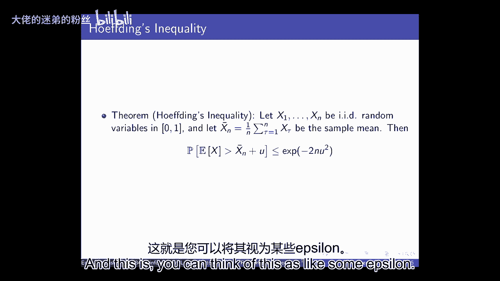
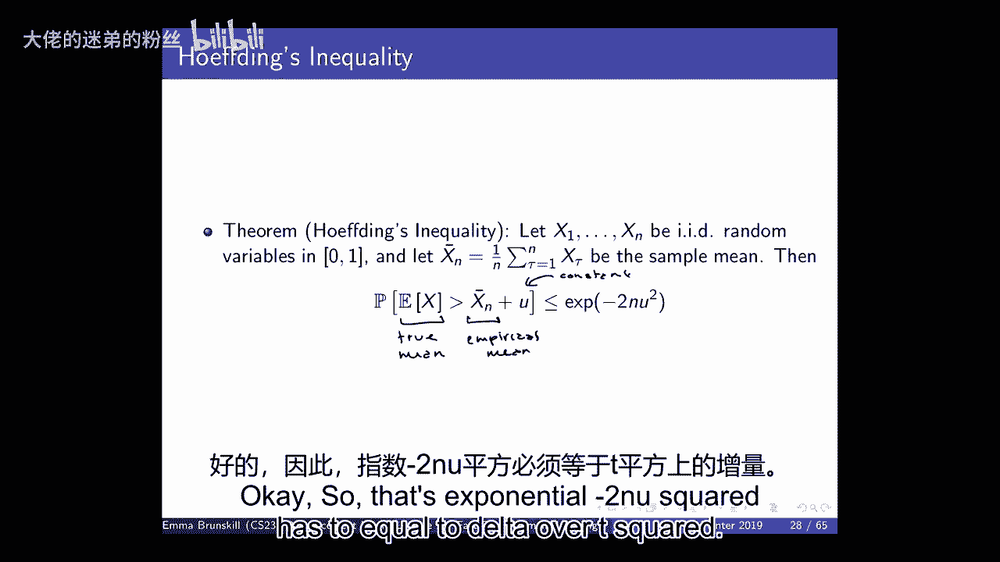
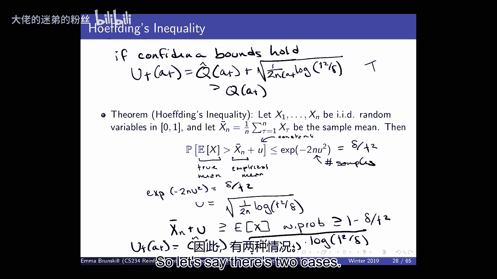

# 11：快速强化学习 🚀


在本节课中，我们将开始讨论快速强化学习。我们将重点关注算法的样本效率，特别是在数据获取成本高昂（例如涉及人类交互）的场景下。我们将介绍多臂老虎机问题，并深入探讨“遗憾”这一评估算法性能的核心框架。最后，我们将学习一种基于“面对不确定性保持乐观”原则的高效算法——置信上界算法。

---

## 背景与目标

我们刚刚完成了策略搜索部分，并正在研究策略梯度。现在，我们将转向快速强化学习。到目前为止，我们讨论了许多主题，如优化、泛化、延迟后果、规划、马尔可夫决策过程以及使用深度神经网络扩展到大型状态空间。在许多拥有良好模拟器或数据成本较低的场景中，这些技术效果很好。

然而，在许多实际应用中，例如教育、医疗或广告推荐，数据来源于人。这带来了两大挑战：首先，人的数量是有限的；其次，与人交互收集数据是昂贵的。因此，这引发了对样本效率的高度关注。

我们之前研究的大多数技术（尤其是Q学习类技术）主要受计算效率需求的启发。例如，时序差分学习相比动态规划，每次更新的计算成本是常数级的，而非状态数量的平方级。在许多实时应用（如高速驾驶、机器人）中，计算效率至关重要。

但在涉及人类的场景中，样本效率变得比计算效率更重要。我们无法承受像DQN学习打乒乓球那样需要数百万次试验的代价。因此，我们需要新的、样本效率更高的技术。

---

## 如何评估算法性能？

在讨论具体算法前，我们需要定义如何评估强化学习算法的“好坏”。我们已经讨论过收敛性，即价值函数或策略是否随时间稳定。比收敛性更强的一个概念是**渐近最优性**，即算法在时间趋于无穷时能否收敛到最优策略。

但“渐近”是一个很长的时间范围。我们更关心算法能以多快的速度达到良好性能。因此，我们需要其他衡量标准。

一种方法是考虑算法随时间累积的**遗憾**，即其表现与最优表现之间的差距。这能让我们比较不同算法的学习速度。在接下来的课程中，我们将：
1.  讨论表格化设置（今天和下次课聚焦于老虎机问题）。
2.  介绍评估算法质量的正式框架（如遗憾）。
3.  介绍能实现不同评估标准（如低遗憾）的算法类别。

---

## 多臂老虎机问题介绍 🎰

多臂老虎机可以被视为强化学习的一个子集。它通常被描述为有`M`条“手臂”，每条手臂相当于一个“动作”。

*   每条手臂都有一个与之关联的、未知的奖励概率分布 `P(r|a)`。
*   每次选择一条手臂（即执行一个动作），都会从该分布中获得一个奖励样本。
*   这与MDPs类似，但没有状态转移函数（或者说，只有一个状态）。
*   目标是在一系列选择中最大化累积奖励。

我们用以下符号定义：
*   `Q(a) = E[r|a]`：动作`a`的期望奖励（未知）。
*   `v* = max_a Q(a)`：最优值。
*   `Δ_a = v* - Q(a)`：动作`a`的“差距”。最优动作的差距为0，其他动作的差距为正数。

**遗憾**的定义是：与始终选择最优动作相比，算法所损失的累积期望奖励。
数学上，在`T`步之后的总遗憾 `R(T)` 为：
```
R(T) = Σ_{t=1}^{T} [ v* - Q(a_t) ]
```
也可以等价地表示为：
```
R(T) = Σ_{a} (期望选择动作a的次数) * Δ_a
```
我们的目标是设计一种算法，能够最小化遗憾的增长速度。理想情况下，我们希望遗憾增长是**次线性**的（例如，对数增长或平方根增长），而非线性增长。

---

## 基础算法及其局限性

以下是两种基础算法及其在遗憾上的表现：

**1. 贪婪算法**
*   根据当前对每条手臂的平均奖励估计 `Q_hat(a)`，总是选择估计值最高的手臂。
*   **问题**：由于奖励的随机性，早期的一次不佳采样可能导致算法永远锁定在一个次优动作上，导致**线性遗憾**。

**2. ε-贪婪算法**
*   以 `1-ε` 的概率选择贪婪动作，以 `ε` 的概率随机选择其他动作。
*   **问题**：即使ε很小，只要它是固定的，算法就会以恒定概率持续探索次优动作，导致**线性遗憾**（尽管常数项可能较小）。

这些简单的探索策略无法实现次线性遗憾。

---

## 面对不确定性的乐观原则 😊

“面对不确定性保持乐观”是一个强大的算法设计原则。其核心思想是：选择那些**可能**具有高价值的动作。

为什么这个原则有效？有两种可能结果：
1.  **乐观正确**：该动作确实很好。那么我们获得了高奖励，遗憾很小。
2.  **乐观错误**：该动作实际不好。那么我们获得了一个低奖励样本，但**我们学到了东西**，并降低了对该动作价值的估计。







乐观探索要么带来高收益，要么带来高信息增益。这比盲目探索（如ε-贪婪）或完全不探索（如贪婪）更有效率。

---

## 置信上界算法

置信上界算法是乐观原则的一个具体实现。它为每个动作的价值估计计算一个**置信上界**，并选择UCB最大的动作。

**UCB定义**：
对于动作`a`，在时间`t`，其UCB值 `U_t(a)` 定义为：
```
U_t(a) = Q_hat_t(a) + c * √( log(t) / N_t(a) )
```
其中：
*   `Q_hat_t(a)` 是动作`a`到时间`t`为止的经验平均奖励。
*   `N_t(a)` 是动作`a`被选择的次数。
*   `c` 是一个探索常数（通常设为√2）。
*   `log(t)` 是时间步的对数项。

**算法流程**：
1.  初始化：将每条手臂都拉一次。
2.  对于每个时间步 `t`：
    *   选择动作 `a_t = argmax_a U_t(a)`。
    *   执行动作 `a_t`，观察奖励 `r_t`。
    *   更新 `Q_hat(a_t)` 和 `N_t(a_t)`，并重新计算所有动作的UCB值。



**UCB项的解释**：
*   `Q_hat_t(a)`：利用（Exploitation）部分，基于当前知识选择看似最好的。
*   `c * √( log(t) / N_t(a) )`：探索（Exploration）部分。
    *   动作被选得越少（`N_t(a)`小），此项越大，鼓励探索。
    *   随着时间推移（`t`增大），对数项缓慢增长，保证即使常被选的动作，其UCB也有微小增长，避免完全停止探索。
    *   平方根结构来源于霍夫丁不等式，确保了真实期望值以高概率低于UCB。

---

## UCB算法的遗憾界分析

可以证明，UCB算法能实现次线性遗憾。其遗憾上界为：
```
R(T) ≤ O( √( M * T * log T ) )
```
其中`M`是动作数，`T`是时间步数。

**证明思路（简述）**：
1.  **高概率事件**：首先证明，在所有时间步上，所有动作的置信区间（即真实Q值 ≤ UCB）同时成立的概率很高。
2.  **利用乐观性**：如果置信区间成立，那么算法所选动作的UCB值至少不小于最优动作的真实值。
3.  **遗憾分解**：将总遗憾分解为所选动作的UCB与其真实Q值之差的和。
4.  **代入边界**：利用UCB的定义，这个差值可以被 `c * √( log(t) / N_t(a) )` 形式的值限定。
5.  **求和与放缩**：通过对所有动作和所有时间步的求和进行放缩，最终得到关于 `T` 的次线性上界。

这个结果表明，UCB算法的遗憾增长速度远慢于线性，在样本效率上优于贪婪和ε-贪婪算法。

---

## 总结与展望

本节课中，我们一起学习了快速强化学习的核心动机——追求高样本效率，并引入了多臂老虎机这一简化模型。我们定义了衡量算法性能的“遗憾”框架，并指出了基础探索策略（贪婪、ε-贪婪）会导致线性遗憾。

接着，我们介绍了“面对不确定性保持乐观”这一关键原则，并详细阐述了其经典实现——置信上界算法。我们分析了UCB公式的构成，并概述了其能够实现次线性遗憾的理论保证。

下一节课，我们将继续深入老虎机问题，从贝叶斯的角度出发，介绍另一种强大的算法——汤普森采样，并比较不同算法的特点。我们还将探讨如何将这些思想扩展到更一般的MDP设置中。


---
**本节课中我们一起学习了**：快速强化学习的样本效率需求、多臂老虎机模型、遗憾的定义、基础算法的局限性、面对不确定性的乐观原则，以及置信上界算法的原理与理论保证。