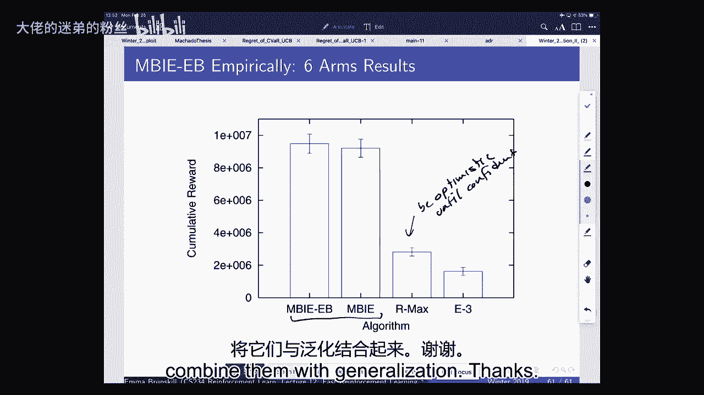

# 12：快速强化学习 II 🚀

在本节课中，我们将学习如何通过“不确定性下的乐观”和贝叶斯方法，在强化学习中实现快速学习。我们将从多臂老虎机问题过渡到马尔可夫决策过程，并探讨不同的性能评估框架。

---

## 1. 回顾：多臂老虎机与遗憾

上一节我们介绍了多臂老虎机问题及其核心评估指标——遗憾。本节中，我们来看看如何通过乐观策略来最小化遗憾。

多臂老虎机是马尔可夫决策过程的一个简化版本。在基础设定中，没有状态，只有一组动作。每个动作对应一个未知的随机奖励分布。我们的目标是通过选择动作来最大化长期累积奖励。

**遗憾** 的正式定义是：将所选动作的期望奖励与最优动作的期望奖励进行比较。其公式为：

\[
\text{Regret}(t) = \sum_{t=1}^{T} [Q(a^*) - Q(a_t)]
\]

其中，\( Q(a^*) \) 是最优动作的期望奖励，\( Q(a_t) \) 是时间步 \( t \) 所选动作的期望奖励。

---

## 2. 不确定性下的乐观策略

“不确定性下的乐观”核心思想是：为每个动作估计一个**置信上界**，并选择上界最高的动作。

以下是该策略可能导致的两种结果：
*   **结果 A**：选择了最优动作 \( a^* \)。此时遗憾为零。
*   **结果 B**：选择了次优动作。随着采样次数增加，该动作的置信上界会下降（因为其真实均值较低），从而促使我们未来更可能选择其他上界更高的动作。

与使用置信下界相比，乐观策略能有效避免因“确认偏误”而陷入次优动作，从而避免线性遗憾。

---

## 3. 上置信界算法示例

我们通过一个治疗脚趾骨折的简化例子来理解UCB算法。假设有三个动作（治疗方式）：
*   手术：成功概率 0.95
*   包扎：成功概率 0.90
*   不处理：成功概率 0.10

UCB值的计算公式为：

\[
\text{UCB}(a) = \hat{Q}(a) + \sqrt{\frac{2 \log t}{N_t(a)}}
\]

其中，\( \hat{Q}(a) \) 是动作 \( a \) 的经验平均奖励，\( t \) 是总尝试次数，\( N_t(a) \) 是动作 \( a \) 被选择的次数。

初始时，每个动作尝试一次。假设结果分别为：手术成功（1）、包扎成功（1）、不处理失败（0）。计算UCB值后，手术和包扎的UCB值相同且最高，因此下一轮会随机选择其中之一，而不会选择不处理。

相比之下，ε-贪婪策略（ε=0.1）会以0.9的概率选择当前最佳动作，以0.1的概率均匀探索所有动作（包括不处理）。UCB策略的探索更具针对性，只关注那些潜力（上界）高的动作。

---

## 4. 贝叶斯老虎机与汤普森采样

上一节我们介绍了非参数化的乐观方法。本节中，我们来看看另一种思路：利用参数先验知识的贝叶斯方法。

在贝叶斯老虎机中，我们假设奖励分布服从某个参数分布（如伯努利分布），并为其参数设置一个先验分布。通过观察到的数据，我们使用贝叶斯规则更新参数的后验分布。

**汤普森采样** 是一种实现“概率匹配”思想的简单而强大的算法。其步骤如下：
1.  为每个动作的参数初始化一个先验分布（例如，对于伯努利奖励，使用Beta分布）。
2.  每一轮中，从每个动作的当前后验分布中采样一组参数。
3.  基于采样出的参数，计算每个动作的期望奖励 \( Q(a) \)。
4.  选择期望奖励最高的动作。
5.  观察获得的真实奖励，并据此更新该动作参数的后验分布。

以伯努利奖励为例，若先验为 Beta(α, β)，观察到奖励 \( r=1 \) 后，后验更新为 Beta(α+1, β)；观察到 \( r=0 \) 后，后验更新为 Beta(α, β+1)。

汤普森采样本质上是根据“该动作是最优动作的概率”来选择动作。它通常能取得优异的经验性能，并且也有良好的贝叶斯遗憾界。

---

## 5. 性能评估框架：PAC

除了遗憾和贝叶斯遗憾，我们还可以使用 **“可能近似正确”** 框架来评估算法。

PAC 算法保证：除了多项式数量的时间步外，算法以至少 \( 1-\delta \) 的概率选择 ε-接近最优的动作。其形式化描述为：

\[
\text{Pr}(Q(a_t) \geq Q(a^*) - \epsilon) \geq 1 - \delta, \quad \text{对于除多项式个时间步外的所有 } t
\]

其中，多项式是状态数、动作数、\( \epsilon \)、\( \delta \)、折扣因子 \( \gamma \) 的函数。

PAC框架关注的是严重错误（即与最优动作差距大于ε的选择）的数量，而不仅仅是累积的期望损失。这在某些对单个错误敏感的领域（如医疗）尤为重要。

---

## 6. 扩展到马尔可夫决策过程

现在，我们将乐观思想从老虎机问题扩展到更具挑战性的**表格型马尔可夫决策过程**。

一种简单的方法是**乐观初始化**：将所有状态-动作值 \( Q(s, a) \) 初始化为一个非常大的乐观值，例如 \( R_{\text{max}} / (1 - \gamma) \)。然后运行Q学习等算法进行更新。这能鼓励系统性的探索，但通常缺乏理论保证。

更高级的模型基于方法，如 **MBIE** 算法，其核心思想是：
1.  维护经验转移模型和奖励模型。
2.  在计算值函数时，为每个状态-动作对添加一个**探索奖励**，该奖励与访问次数的平方根成反比。
3.  奖励公式为：\( \hat{R}(s,a) + \beta / \sqrt{N(s,a)} \)，其中 \( \beta \) 是一个缩放参数。
4.  对于从未访问过的 \( (s, a) \)，其值被视为最大可能值。

这类算法不仅是乐观的，而且被证明是PAC的，即除了多项式数量的步数外，都能执行接近最优的策略。

---

## 7. 总结

本节课中我们一起学习了快速强化学习的核心思想。
*   我们回顾了多臂老虎机中的遗憾和乐观策略（UCB）。
*   我们介绍了贝叶斯方法和汤普森采样，它通过采样参数来实现概率匹配。
*   我们了解了不同的性能评估框架，包括遗憾、贝叶斯遗憾和PAC。
*   最后，我们探讨了如何将这些思想扩展到马尔可夫决策过程中，通过乐观初始化或添加基于访问计数的探索奖励来引导智能体有效探索未知环境。

这些方法为在数据有限的情况下设计高效的学习智能体奠定了理论基础。下一节课，我们将继续探讨如何将这些快速学习的思想与函数近似（如深度学习）相结合。