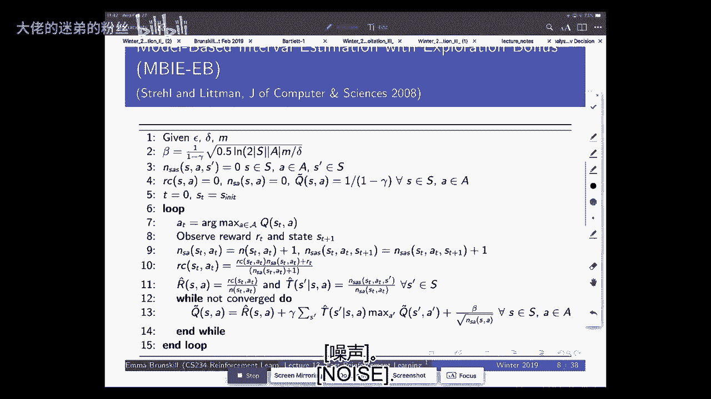
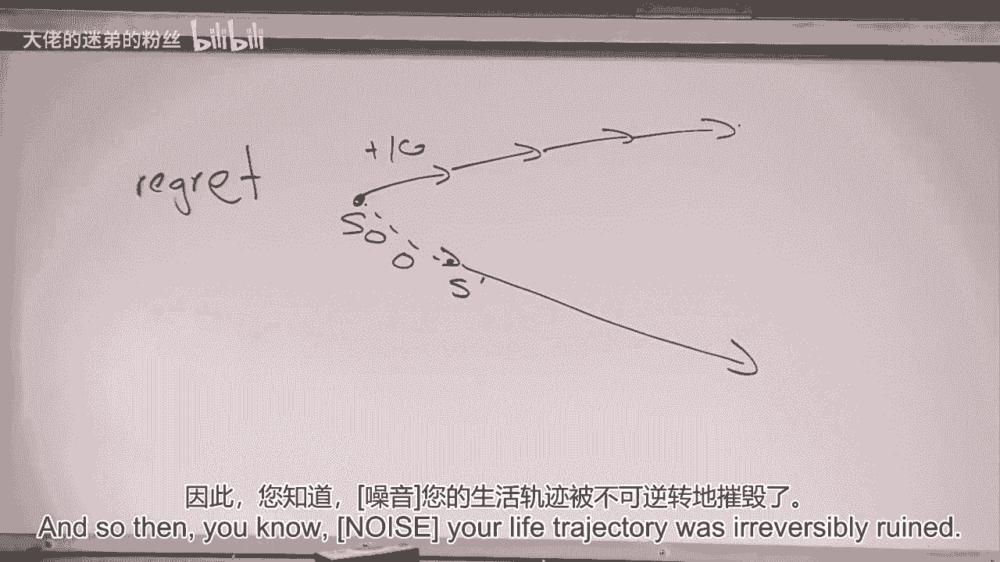
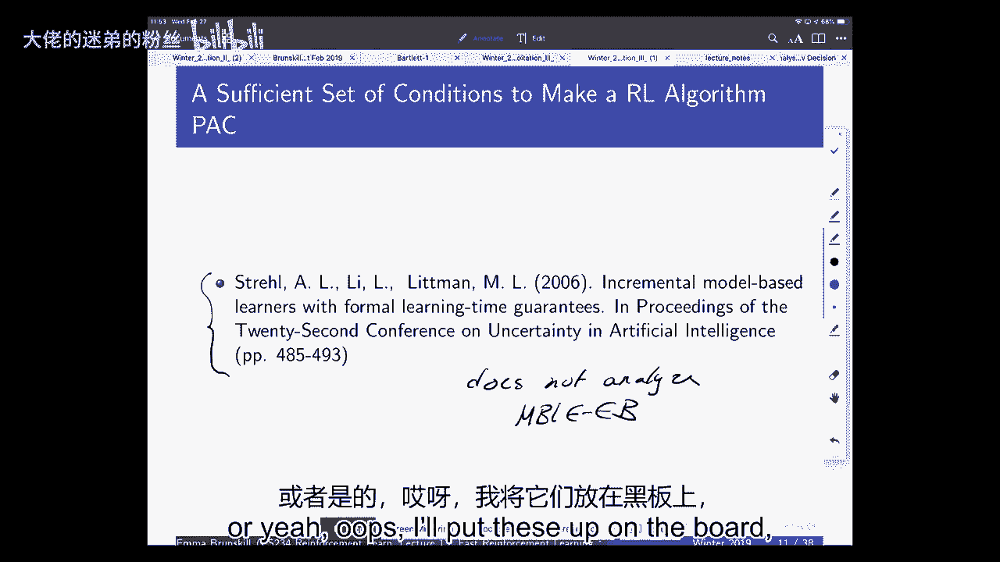
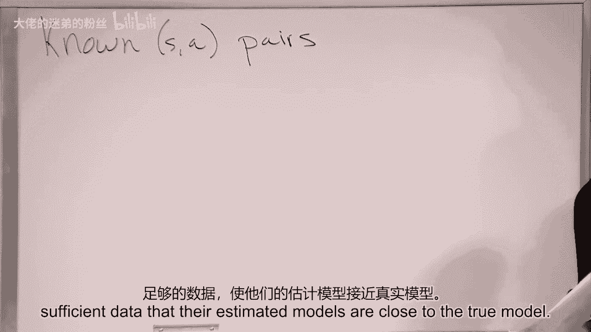
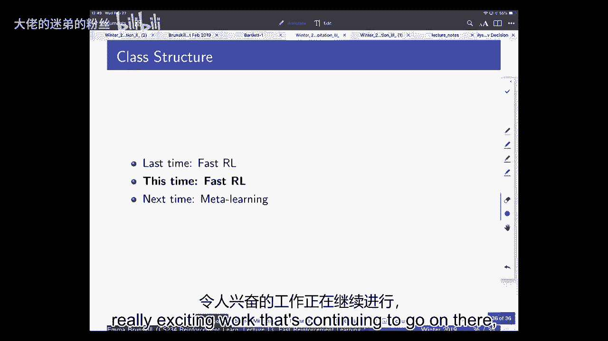

# 13：快速强化学习 III 🚀

在本节课中，我们将学习快速强化学习的最后一部分内容，重点探讨如何评估算法在马尔可夫决策过程中的性能，并理解“可能近似正确”和“遗憾”等核心概念。我们还将了解如何将这些理论框架扩展到大规模状态空间，例如在深度强化学习中的应用。

---

## 物流与期中考试回顾 📊

上一节我们介绍了快速学习的不同设置。本节开始前，我们先处理一些课程物流问题，并回顾期中考试情况。

期中考试的平均分约为71%，与去年的69%非常接近。成绩分布也与去年相似。课程不进行严格的分数曲线调整。如果全班超过90%的学生掌握了材料，那么这些学生都应获得A。去年约有42%的学生获得了A。因此，期中考试表现不理想的学生，仍有充分机会在期末取得好成绩。

关于期中考试的疑问：
*   我们正在处理成绩复议请求，截止日期为本周五。
*   我们没有发布每道题的具体评分细则，但整体上我们更关注概念理解，而非代数计算细节。
*   最后一道题难度最大，也是分数差异最大的题目。

---

## 关于课程测验 📝

接下来我们讨论即将到来的课程测验。测验采用一种特殊形式，旨在避免在期末项目和期末考试之间给学生带来过大压力。

以下是测验的具体安排：

*   **测验形式**：分为两部分，均为选择题，侧重高层次概念理解。
*   **第一部分（个人）**：学生单独完成，时长约45分钟。
*   **第二部分（小组）**：学生被随机分组，共同完成与第一部分相同的试卷，需协商一致得出答案。
*   **计分方式**：最终成绩由个人部分和小组部分共同决定。小组部分只会提高你的分数（取个人与小组成绩的较高者）。
*   **目的**：通过小组讨论深化对材料的理解，并听取他人观点。
*   **样题**：我们将发布去年的测验作为参考。
*   **范围**：涵盖整个课程内容，但会更侧重期中考试之后的知识点。
*   **允许携带**：一张备忘单（与期中考试相同）。

去年实施时，学生反馈积极。虽然存在博弈论层面的考虑（例如在个人部分尽力答题，在小组部分可尝试不同答案以对冲风险），但由于小组部分占比很小（约5%），且通常只有一个正确答案，因此实际影响有限。

---

## 快速学习：框架与算法回顾 🤖

现在，我们回到快速强化学习的主题。我们一直在数据稀缺的背景下讨论此问题，例如医疗、教育等领域。

我们主要讨论了两种设置：**多臂赌博机问题**和**马尔可夫决策过程**。评估算法“好坏”或“快慢”的框架，通常基于其所需的数据量（样本复杂度）。虽然本课程较少涉及计算复杂性，但这些框架也可扩展到该层面。

在赌博机问题中，我们主要关注**遗憾**，即最优表现与实际表现之间的差距。实现低遗憾的主要方法有：
1.  **不确定性下的乐观原则**
2.  **汤普森采样**

在MDP中，我们介绍了**可能近似正确**框架。

### 可能近似正确框架

PAC算法接受两个参数：`ε` 和 `δ`。
*   `ε` 指定策略与最优策略的接近程度。
*   `δ` 指定达到该接近程度的概率。

一个PAC算法保证，以至少 `1 - δ` 的概率，其学到的策略在所有状态上的价值与最优策略的价值之差在 `ε` 以内。所需的样本数 `n` 是状态空间大小、动作空间大小、`1/(1-γ)`、`1/ε` 和 `1/δ` 的多项式函数。

**公式表示**：
`V^π(s) ≥ V^*(s) - ε` 对于所有 `s`，以至少 `1 - δ` 的概率成立。

---

### 遗憾 vs. PAC 📈

理解遗憾和PAC之间的区别非常重要。

*   **遗憾**：在线学习设置中，衡量从初始状态开始，一直执行最优策略所能获得的总回报，与实际执行算法所获总回报之间的差距。它非常苛刻，因为即使早期的一个错误决策导致进入次优的状态分布，你也会持续与“完美人生轨迹”比较。
*   **PAC**：衡量在算法实际引导产生的状态分布下，当前策略与针对该分布的最优策略之间的差距。它更宽容，因为它只要求你在“已陷入的境地”中做到近乎最优。

在分幕式MDP中，两者更接近，因为你总是从初始状态重新开始。但在持续在线学习中，它们差异显著。

---

## 证明算法为PAC的充分条件 ✅

我们将分析一个具体的算法——**基于模型的间隔估计（Interval Estimation - IE）算法**，并理解使其成为PAC算法的原因。这有助于建立设计高效算法的直觉。

IE算法（一种奖励加成算法）维护一个经验转移模型 `T̂` 和经验奖励模型 `R̂`。它通过以下更新规则来行动：
`Q̃(s, a) = R̂(s, a) + β/√(N(s,a)) + γ Σ_{s‘} T̂(s‘|s,a) max_{a‘} Q̃(s‘, a‘)`
其中 `β` 是一个与置信度相关的参数。

这可以看作是在一个**乐观的MDP** `M̃` 上求解最优策略，该MDP使用经验转移模型和经过加成的奖励（`R̂ + 加成`）。

使一个算法成为PAC的一组充分条件如下：

1.  **乐观性**：算法计算的价值 `Q̃_t` 必须（以高概率）在所有时间步 `t` 都满足 `Q̃_t(s,a) ≥ Q^*(s,a) - ε`。
2.  **准确性**：算法计算的价值 `Q̃_t` 必须接近一个“混合MDP” `M‘` 下的策略价值。`M‘` 在“已知”状态-动作对上使用真实模型，在“未知”状态-动作对上使用乐观模型 `M̃`。这保证了当信息足够时，我们的估计是准确的。
3.  **有限的学习复杂度**：
    *   `Q` 值更新的总次数是有界的。
    *   访问“未知”状态-动作对的总次数是有界的。
    这两个界限都是 `ε`、`δ`、状态/动作空间大小的多项式函数。

**直觉**：
*   **乐观性**确保我们高估价值，从而鼓励探索。
*   **准确性**确保当我们获得足够数据后，估计会变得可靠。
*   **有限学习复杂度**确保我们不会永远探索或更新，算法会收敛。

如果算法满足这三个条件，那么它就是PAC的。

---

### 证明IE算法的乐观性 🧠

我们简要展示IE算法如何满足乐观性条件。

我们使用归纳法证明 `Q̃(s,a) ≥ Q^*(s,a)`。
*   **基础**：初始化 `Q̃` 为 `1/(1-γ)`，这显然大于等于 `Q^*`。
*   **归纳假设**：假设第 `i` 次迭代时 `Q̃_i ≥ Q^*`。
*   **归纳步骤**：考虑第 `i+1` 次迭代的更新：
    `Q̃_{i+1}(s,a) = R̂(s,a) + β/√(N(s,a)) + γ Σ_{s‘} T̂(s‘|s,a) max_{a‘} Q̃_i(s‘, a‘)`
    根据归纳假设，`max_{a‘} Q̃_i(s‘, a‘) ≥ max_{a‘} Q^*(s‘, a‘) = V^*(s‘)`。
    因此，`Q̃_{i+1}(s,a) ≥ R̂(s,a) + β/√(N(s,a)) + γ Σ_{s‘} T̂(s‘|s,a) V^*(s‘)`。
    通过利用霍夫丁不等式等工具，可以证明（以高概率）：
    `R̂(s,a) + γ Σ_{s‘} T̂(s‘|s,a) V^*(s‘) ≥ Q^*(s,a) - β/√(N(s,a))`。
    将两者结合，得到 `Q̃_{i+1}(s,a) ≥ Q^*(s,a)`。

这就完成了乐观性的证明。准确性和有限学习复杂度的证明涉及定义“已知”/“未知”状态-动作对，并使用“模拟引理”等工具，思路类似但更复杂。

---

## 贝叶斯方法：汤普森采样 ⚖️

在赌博机问题中，我们介绍了**汤普森采样**。它通过维护奖励概率的后验分布（如Beta分布），并进行概率匹配来探索。

在MDP中，我们可以进行**基于模型的贝叶斯强化学习**。我们对MDP的模型（转移函数 `T` 和奖励函数 `R`）设置先验分布。对于表格型MDP，转移的共轭先验通常是狄利克雷分布，奖励的共轭先验可以是Beta分布（针对0/1奖励）或高斯分布等。

**MDP的汤普森采样算法**如下：
1.  对于每个状态-动作对 `(s,a)`，从当前后验分布中采样一个转移模型 `T_sample` 和一个奖励模型 `R_sample`。
2.  用所有采样模型组合成一个完整的MDP `M_sample`。
3.  求解 `M_sample` 的最优策略 `π_sample` 或最优Q函数 `Q_sample^*`。
4.  执行当前状态下 `π_sample` 的动作。

这种方法也实现了概率匹配，并在实践中常能取得良好效果。

---

## 向大规模状态空间泛化 🌌

以上理论均针对有限状态和动作空间。当状态空间巨大或连续时（如图像像素空间），直接计数 `N(s,a)` 变得不可能。我们需要将乐观和探索的思想推广到函数逼近设置，例如深度强化学习。

主要挑战是如何在深度网络中**量化不确定性**。

### 深度探索的尝试

**1. 基于伪计数的探索奖励**
灵感来自IE算法的奖励加成 `β/√(N(s,a))`。在深度Q学习中，我们可以修改目标，为不常访问的`(s,a)`对添加探索奖励：
`目标 = R + γ max_{a‘} Q(s‘, a‘; θ^{-}) + 奖励加成(s,a)`
关键是如何定义 `奖励加成(s,a)`。一些方法包括：
*   训练一个密度模型来估计状态访问频率。
*   使用哈希函数将相似状态映射到同一桶中，并进行计数。

**2. 深度汤普森采样**
直接在深度网络参数空间进行后验采样非常困难。一些近似方法包括：
*   **Bootstrapped DQN**：训练多个Q网络，每个使用不同的数据子集。行动时随机选择一个网络，相当于对Q函数进行近似后验采样。
*   **贝叶斯线性回归**：在深度网络提取的固定特征之上，使用贝叶斯线性回归来输出Q值，从而获得不确定性估计。

这些方法在诸如《蒙特祖玛的复仇》等难以探索的Atari游戏上，相比标准的ε-贪婪探索，取得了显著更好的性能。

---

## 总结 🎯

本节课我们一起学习了快速强化学习的核心理论框架。

*   我们回顾了评估算法的标准：**可能近似正确**和**遗憾**，并比较了它们的异同。
*   我们深入探讨了使一个算法成为PAC的**充分条件**：乐观性、准确性和有限学习复杂度，并以IE算法为例进行了分析。
*   我们介绍了MDP中的**贝叶斯方法**——汤普森采样。
*   最后，我们探讨了将这些思想**推广到大规模状态空间**（如深度强化学习）所面临的挑战和当前的一些实用方法。

这是一个非常活跃的研究领域，在理论保证和实际应用方面都仍有很长的路要走。下次课，我们将进入一个相关且令人兴奋的领域：**元学习**。